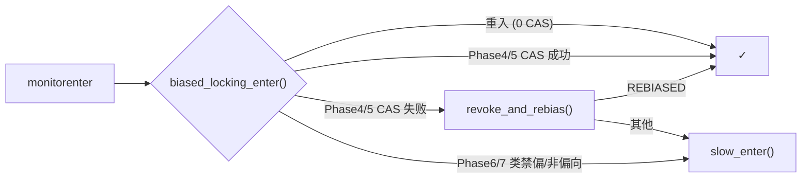
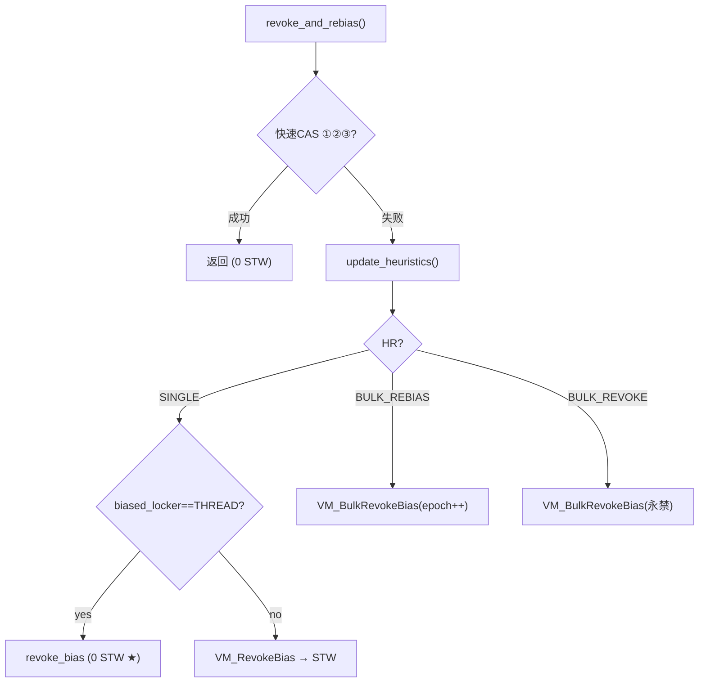

# BiasedLocking · 偏向锁全机制

> OpenJDK 11 slowdebug | `-Xms8g -Xmx8g -XX:+UseG1GC`（标准环境）
> 源文件: `biasedLocking.cpp/hpp`, `markOop.hpp`, `macroAssembler_x86.cpp`, `synchronizer.cpp`
> 前置: [03-BasicLock-Synchronizer]（`fast_enter`/`slow_enter`/`inflate`）
> 关联: [01-ObjectMonitor]（重量锁 enter/exit）[03-BasicLock-Synchronizer]（轻量锁 CAS + inflate 双 CAS 协议）
> 阅读收益: 偏向锁完整获取/撤销路径、epoch 批量机制、四种无 safepoint 快速撤销、hashCode 冲突根源

---

## §〇 源文件清单

| 文件 | 关键内容 | 本文角色 |
|------|---------|---------|
| `biasedLocking.hpp:111-145` | `BiasedLockingCounters` — 7 个计数器 | ★ 统计 |
| `biasedLocking.hpp:148-193` | `BiasedLocking` 类 + `Condition` 枚举 (NOT_BIASED/BIAS_REVOKED/REBIASED) | ★ 接口 |
| `biasedLocking.cpp:155-310` | `revoke_bias()` — 匿名/死线程/栈遍历升级 | ★ 核心撤销 |
| `biasedLocking.cpp:321-371` | `update_heuristics()` — 阈值变迁 0→20→40 + 时间衰减 25s | ★ 启发式 |
| `biasedLocking.cpp:374-484` | `bulk_revoke_or_rebias_at_safepoint()` — epoch++/禁用 | ★ 批量 |
| `biasedLocking.cpp:495-562` | `VM_RevokeBias` — 单对象撤销 VM 操作 | safepoint 载体 |
| `biasedLocking.cpp:566-586` | `VM_BulkRevokeBias` — 批量撤销 VM 操作 | safepoint 载体 |
| `biasedLocking.cpp:624-738` | `revoke_and_rebias()` ★ 主入口 — 快速 CAS×4 + 启发式 | ★★★ 主入口 |
| `biasedLocking.cpp:751-768` | `revoke_at_safepoint()` | safepoint 路径 |
| `markOop.hpp:111-155,173-203` | bit 位枚举 + `biased_lock_pattern=5` + 访问器 | ★ 位编码 |
| `markOop.hpp:313-319` | `encode(JavaThread*, age, epoch)` | ★ 编码 |
| `macroAssembler_x86.cpp:1110-1299` | `biased_locking_enter()` — 汇编七阶段 | ★ 快速路径 |
| `synchronizer.cpp:265-271` | `fast_enter()` → `revoke_and_rebias` 调用点 | ★ 入口 |
| `synchronizer.cpp:719-735` | `FastHashCode()` → `revoke_and_rebias(false)` | hash 冲突 |
| `interpreterRuntime.cpp:786-800` | `monitorenter()` → `fast_enter(attempt_rebias=true)` | 解释器入口 |
| `globals.hpp:964-987` | `UseBiasedLocking` + 5 个阈值参数 | 配置 |

---

## §一 核心原理

> **❓ 为什么需要偏向锁？** 大多数 Java 锁"总是同一个线程反复获取"（实测 >80%）。轻量锁每次 `synchronized` 都要 CAS 一次——即使线程没变。偏向锁把"获取"从每次 CAS 降为：首次 1 次 CAS 安装线程指针，之后每次只需比较指针（0 次 CAS）。

### 1.1 数量级直觉

```
偏向锁重入 (同一线程, epoch 有效)  指针比较         ~1 cycle,      0 次 CAS
偏向锁首次获取 (匿名→线程)        1×lock cmpxchg  ~20 cycles,    1 次 CAS
轻量锁获取                        1×lock cmpxchg   ~20 cycles     每次 CAS
轻量锁 inflate 到重量锁          omAlloc+双CAS     ~500-2000 cycles
重量锁 enter (有竞争)            自适应自旋→park   ~10000+ cycles
```

**核心收益**：偏向锁重入比轻量锁快 20 倍（0 CAS vs 1 CAS），比重量锁快 10000 倍。

### 1.2 不适合偏向锁的场景

| 场景 | 适合？ | 原因 |
|------|:---:|------|
| 单线程反复获取 | ✅ 最佳 | 首次 1 CAS，之后 0 CAS |
| 生产者-消费者交替 | ❌ | 每次都得撤销再重偏向 |
| 启动阶段类加载器锁 | ❌ | 用完就扔，撤销代价大于收益 |
| 调用过 `hashCode()` 的对象 | ❌ | hash(31bit) 和 thread*(54bit) 抢同一块 markOop |

> **❓ 为什么有 4 秒启动延迟？** JVM 启动时大量的类加载锁"用后即弃"——偏向它们产生无意义撤销。延迟留给 warmup。新版 JDK 默认 `BiasedLockingStartupDelay=0`（Batch Rebias 已足够高效）。

```cpp
// biasedLocking.cpp:95-112 — init(): startup delay → VM_EnableBiasedLocking
void BiasedLocking::init() {
  if (UseBiasedLocking) {
    if (BiasedLockingStartupDelay > 0) {
      new EnableBiasedLockingTask(BiasedLockingStartupDelay)->enroll(); // PeriodicTask
    } else {
      VM_EnableBiasedLocking op(false);  VMThread::execute(&op); // 立即 safepoint
    }
  }
}
// L51-52: doit() 遍历所有已加载类 → k->set_prototype_header(biased_locking_prototype())
```

### 1.3 锁升级路径

> 偏向锁的三种命运由**谁在操作**决定：同一个线程重入 → 保持偏向（0 开销）；另一个线程竞争 → 撤销升级；调用 `hashCode`/`wait`/`notify` → 强制撤销。

```
                    偏向锁 (lock=101, biased_lock=1)
                    /        |          \
              保持偏向   wait/notify    撤销(竞争)
                   ↓       ↓              ↓
               (不变)  ★ 重量锁      ★ 轻量锁 (lock=00, BasicLock*)
              (直接 inflate)           /         \
                                 无竞争 CAS   竞争/inflate
                                        ↓        ↓
                                  保持轻量  ★ 重量锁 (lock=10, ObjectMonitor*)
```

> `wait()`/`notify()` 绕过轻量锁直接 inflate（需要 ObjectMonitor 的 WaitSet）。竞争撤销后走轻量锁先 CAS 一把——让竞争说话，失败了再 inflate。

---

## §二 数据结构

### 2.1 markOop 偏向位布局

```
// markOop.hpp:111-118 — bit 枚举: age_bits=4, lock_bits=2, biased_lock_bits=1, epoch_bits=2
// markOop.hpp:122-127 — shift: lock=0, biased_lock=2, age=3, cms=7, hash=8, epoch=8
// markOop.hpp:52 — 64 位 COOPs biased 布局:
63                                                    10 9  8 7 6 5 4 3 2 1 0
┌────────────────────────────────────────────────────┬──────┬─┬───┬─────────┐
│              JavaThread*:54 (bit 63→10)            │epoch:2│c│age:4│ 1 0 1 │
└────────────────────────────────────────────────────┴──────┴─┴───┴─────────┘
                                                       cms_free:1 (G1GC 忽略)
                                                        biased_lock:1, lock:01
```

### 2.2 偏向锁 vs 无锁 markOop 字段对比

| 位域 | 无锁 (lock=01) | 偏向锁 (lock=101) |
|------|------|------|
| bit 63→39 (25bit) | unused | JavaThread*[63:39] |
| bit 38→8 (31bit) | hash (31bit) | JavaThread*[38:8] ★ |
| bit 9-8 (2bit) | hash[9:8] | epoch (2bit) |
| bit 7 (1bit) | cms_free | cms_free |
| bit 6-3 (4bit) | age | age ★ |
| bit 2 (1bit) | 0 | 1 (biased_lock) |
| bit 1-0 (2bit) | 01 | 01 |

**两个关键结论**：① age 仍在——偏向对象年龄在 GC 期间持续递增，避免过早晋升。② hash 被驱逐——hash(31bit) 和 thread* 共用 bit38→8，调用 `hashCode()` 必须撤销偏向。

### 2.3 encode 编码函数

```cpp
// markOop.hpp:313-319 — 编码: [JavaThread* | epoch<<8 | age<<3 | 101]
static markOop encode(JavaThread* thread, uint age, int bias_epoch) {
  intptr_t tmp = (intptr_t) thread;
  assert(UseBiasedLocking && ((tmp & (epoch_mask_in_place | age_mask_in_place
                                     | biased_lock_mask_in_place)) == 0),
         "misaligned JavaThread pointer");  // 低10bit必须为0
  return (markOop) (tmp | (bias_epoch << epoch_shift) | (age << age_shift) | biased_lock_pattern);
}
```
**JavaThread 对齐约束**：`biased_lock_alignment = 2 << (epoch_shift+epoch_bits) = 2048` (`markOop.hpp:147`)。epoch:2 + cms:1 + age:4 + lock:3 = 10bit → JavaThread* 低 10bit 须为 0。

### 2.4 三类 markOop Prototype

```cpp
// markOop.hpp:154 — biased_lock_pattern = 5 (binary: 101)
// markOop.hpp:201 — biased_locking_prototype() = 5 (该类允许偏向)
// unlocked_value = 1 (该类永久禁用偏向, lock=01, biased_lock=0)
```

### 2.5 ★ Klass.prototype_header — 类级别偏向策略

| prototype_header 值 | 含义 | 新对象初始 markOop |
|------|------|------|
| `biased_locking_prototype()` = 5 | 该类允许偏向 | 5（匿名偏向, 可被任意线程 CAS 获取）|
| `prototype()` = 1 | 该类永久禁用偏向 | 1（无锁, 只能走轻量锁）|

**`bulk_revoke` 的本质**：`biasedLocking.cpp:443` — `klass->set_prototype_header(markOopDesc::prototype())`，切 prototype_header 从 5→1，该类新对象和已偏向对象全部不再走偏向。

### 2.6 匿名偏向

```cpp
// markOop.hpp:182-184 — markOop = [0x0][epoch][age][1|01], 有偏向模式, 无持有者
bool is_biased_anonymously() const {
  return (has_bias_pattern() && (biased_locker() == NULL));
}
```
"谁先拿归谁"——第一个 `monitorenter` 的线程 CAS 安装自己的指针即可获取偏向。

---

## §三 偏向获取 — 速度的极致

### 3.1 汇编快速路径 — biased_locking_enter() 七阶段

> 以下为 `macroAssembler_x86.cpp:1110-1299` 的 x86 汇编逻辑等价翻译。`low10` = biased_lock(bit0-2) | age(bit3-6) | epoch(bit8-9)，详见图 §2.1。

```
Phase1: swap=obj->mark(); if ((swap&0x7) != 5) goto cas_label;  // L1139-1144
Phase2: tmp=(proto|r15_thread) ^ swap; tmp &= ~age_mask;       // L1158-1169
        ★ 若 tmp==0: 同线程+epoch匹配 → goto done (0 CAS!)     // L1174
Phase3: if (tmp & biased_lock_mask) goto try_revoke_bias;      // L1188-1189
        if (tmp & epoch_mask) goto try_rebias;                  // L1200-1201
Phase4: lock cmpxchgptr(r15_thread | (swap & low10), mark_addr);// L1222: 匿名→1次CAS
Phase5: load_proto_header(tmp,obj); lock cmpxchgptr(tmp|r15_thread, mark_addr); // L1257
Phase6: load_proto_header(tmp,obj); lock cmpxchgptr(tmp, mark_addr);  // L1287
Phase7: cas_label: return; → slow_enter (CAS栈锁)               // L1296
```

### 3.2 偏向重入 — 0 次 CAS ★★★

```
T1 第二次 monitorenter (同一 obj):
  Phase1: 低3bit=101 ✓
  Phase2: tmp = (biased_prototype|T1) ^ [T1|epoch=0|age=0|101]
          → 低10bit全匹配 → XOR后bit全0 → and ~age_mask → tmp==0!
  → jcc(equal) → goto done (1次 xor + 1次 and + 1次 jcc)
  ★ 没有 lock 前缀, 没有 store!
```

### 3.3 首次偏向与 epoch 过期重偏向 — 1 次 CAS

两者都是 1 次 CAS，但触发场景不同：

| | 首次偏向（匿名→线程）| epoch 过期重偏向 |
|:---:|------|------|
| 触发 | 匿名偏向，任何线程第一次 `synchronized` | 类 prototype_header.epoch 已递增 |
| markOop 变化 | `[0][epoch][age][101]` → `[T1][epoch][age][101]` | `[T_old][old_epoch][age][101]` → `[T_new][new_epoch][age][101]` |
| 位置 | 汇编 Phase4 (匿名 CAS) | 汇编 Phase5 / C++ 快速 CAS③a |
| 计数器 | `anonymously_biased++` | `rebiased++` |

### 3.4 汇编→C++ 决策流



---

## §四 偏向撤销 — revoke_bias() 源码逐行

> **❓ 为什么撤销时需要遍历偏向线程的栈帧？** 偏向线程可能正在临界区里——如果直接改对象头，该线程 `monitorexit` 时会莫名其妙看到锁状态变了。必须找到它栈上对应的 Lock Record，把对象从偏向态"升级"到轻量锁态（设置 `displaced_header` → CAS 栈指针到对象头），保证持有者后续释放正确。

### 4.1 三种轻量撤销路径

```cpp
// biasedLocking.cpp:155-168 — revoke_bias 入口
static BiasedLocking::Condition revoke_bias(oop obj, bool allow_rebias,
    bool is_bulk, JavaThread* requesting_thread, JavaThread** biased_locker) {
  markOop mark = obj->mark();
  if (!mark->has_bias_pattern()) return BiasedLocking::NOT_BIASED; // L157
```
撤销按开销递增有三种路径，前两种都**不遍历栈**：

**路径 A: 匿名偏向** (`L200-215`): `biased_thread == NULL` → `!allow_rebias` 时 `set_mark(unbiased_prototype)` → `BIAS_REVOKED`。0 次栈遍历。

**路径 B: 持有者已死亡** (`L217-240`): `ThreadsListHandle().includes()` 检测 → 已死 → `set_mark(allow_rebias ? biased : unbiased)` → `BIAS_REVOKED`。1 次 ThreadsListHandle 查询，0 次栈遍历。

### 4.2 ★ 持有者活着且在临界区 → 栈遍历升级为轻量锁

```cpp
  // biasedLocking.cpp:256-302 — 遍历偏向线程的栈帧
  GrowableArray<MonitorInfo*>* info = get_or_compute_monitor_info(biased_thread);
  BasicLock* highest_lock = NULL;
  for (int i = 0; i < info->length(); i++) {
    if (info->at(i)->owner() == obj) {                   // L260: ★ 匹配到!
      highest_lock = info->at(i)->lock();
      highest_lock->set_displaced_header(markOopDesc::encode((BasicLock*) NULL)); // L265-267
    }
  }
  if (highest_lock != NULL) {
    highest_lock->set_displaced_header(unbiased_prototype);       // L277
    obj->release_set_mark(markOopDesc::encode(highest_lock));     // L281 ★ lock=00
  } else {
    obj->set_mark(allow_rebias ? biased_prototype : unbiased_prototype); // L297
  }
  return BiasedLocking::BIAS_REVOKED;                     // L309
```

### 4.3 displaced_header 设置语义（栈上有 3 层 `synchronized(obj)` 为例）

```
撤销后栈布局 (高地址→低地址):
  Lock Record 1 (最外层): displaced_header = unbiased_prototype (含age)
  Lock Record 2 (中层):    displaced_header = NULL (重入标记)
  Lock Record 3 (最内层):  displaced_header = NULL (重入标记)
  obj->mark() = encode(Lock Record 1*) ← lock=00(stack-locked)

★ 内层设 NULL 与轻量锁重入一致: fast_exit 遇 NULL→直接return
★ 最外层 = unbiased_prototype: 释放时 CAS restore 到对象头, 变为无锁
```

### 4.4 撤销后状态

| 撤销前 | allow_rebias | 撤销后 markOop 低3bit | 下次 synch |
|------|:---:|:---:|------|
| 匿名偏向 | N/A | 001 (neutral) | 轻量锁 CAS |
| 持有者已死 | true | 101 (匿名偏向) | 可被任意线程 CAS |
| 持有者已死 / 未持有 | false | 001 (neutral) | 轻量锁 CAS |
| 持有中 | false | 000 (轻量锁→BasicLock*) | 正常轻量锁退出 |

### 4.5 ★ 跨线程栈读取：get_or_compute_monitor_info()

`safepoint` 中撤销线程需读**另一个线程**的栈，靠 `get_or_compute_monitor_info()` (`biasedLocking.cpp:120-151`)：

```cpp
static GrowableArray<MonitorInfo*>* get_or_compute_monitor_info(JavaThread* thread) {
  GrowableArray<MonitorInfo*>* info = thread->cached_monitor_info();
  if (info != NULL) return info;                // L122: 命中缓存
  info = new GrowableArray<MonitorInfo*>();
  if (thread->has_last_Java_frame()) {
    RegisterMap rm(thread);
    for (javaVFrame* vf = thread->last_java_vframe(&rm); vf != NULL;
         vf = vf->java_sender()) {              // L132: 遍历调用栈
      GrowableArray<MonitorInfo*>* monitors = vf->monitors();
      if (monitors != NULL)
        for (int i = monitors->length()-1; i >= 0; i--) // L137
          if (!monitors->at(i)->eliminated() && monitors->at(i)->owner() != NULL)
            info->append(monitors->at(i));
    }
  }
  thread->set_cached_monitor_info(info);        // L149: 缓存, 批量后 clean_up
  return info;
}
```

**为什么安全？** safepoint 确保目标线程已停，栈不会被并发修改。

---

## §五 revoke_and_rebias() — 主入口 + 启发式

> `revoke_and_rebias` 是汇编快速路径失败后的 C++ 入口。它按**开销递增**依次尝试：①~③ 纯 CAS（无 STW）→ ④self-revoke（无 STW，只遍历自己栈）→ ⑤other-revoke（单对象 safepoint）→ ⑥批量 safepoint。四个 CAS 失败后才进入启发式，避免偶发撤销触发昂贵的批量操作。

### 5.1 attempt_rebias 语义

| caller | `attempt_rebias` | 含义 |
|------|:---:|------|
| `monitorenter`（解释器/汇编）| `true` | "我想把偏向转给我自己" → 走 epoch 过期重偏向 / 匿名 CAS |
| `hashCode` / `wait` / `notify` | `false` | "我只要撤销偏向，不用重偏向给我" |

### 5.2 快速路径 (无 safepoint!) — 四种 CAS

```cpp
// biasedLocking.cpp:624-687 — revoke_and_rebias 第一步: 四种快速 CAS
BiasedLocking::Condition BiasedLocking::revoke_and_rebias(Handle obj, bool attempt_rebias, TRAPS) {
  markOop mark = obj->mark();

  // ① 匿名偏向 + !attempt_rebias → CAS 安装 unbiased_prototype (L632-646)
  if (mark->is_biased_anonymously() && !attempt_rebias) {
    if (obj->cas_set_mark(markOopDesc::prototype()->set_age(mark->age()), mark) == mark)
      return BIAS_REVOKED;
  }
  // ② 类禁偏 → CAS 安装 prototype_header                 (L648-661)
  else if (mark->has_bias_pattern()) {
    markOop proto = obj->klass()->prototype_header();
    if (!proto->has_bias_pattern()) { obj->cas_set_mark(proto, mark); return BIAS_REVOKED; }
    // ③ epoch 过期 → CAS 重偏向/撤销                     (L662-677)
    else if (proto->bias_epoch() != mark->bias_epoch()) {
      if (attempt_rebias) {
        markOop rebiased = markOopDesc::encode((JavaThread*)THREAD, mark->age(), proto->bias_epoch());
        if (obj->cas_set_mark(rebiased, mark) == mark) return BIAS_REVOKED_AND_REBIASED;
      } else {
        if (obj->cas_set_mark(markOopDesc::prototype()->set_age(mark->age()), mark) == mark)
          return BIAS_REVOKED;
      }
    }
  }
```

**四种快速 CAS 对比**：

| # | 触发条件 | CAS 内容 | 返回值 | safepoint? |
|:---:|------|------|:---:|:---:|
| ① | 匿名偏向, `!attempt_rebias` | CAS 安装 unbiased_prototype | `BIAS_REVOKED` | 否 |
| ② | 类已永久禁用偏向 | CAS 安装 unbiased prototype | `BIAS_REVOKED` | 否 |
| ③a | epoch 过期, `attempt_rebias` | CAS 安装 encode(THREAD,age,new_epoch) | `BIAS_REVOKED_AND_REBIASED` | 否 |
| ③b | epoch 过期, `!attempt_rebias` | CAS 安装 unbiased_prototype | `BIAS_REVOKED` | 否 |

### 5.3 update_heuristics() — 启发式判断

```cpp
// biasedLocking.cpp:313,321-371
enum HeuristicsResult { HR_NOT_BIASED=1, HR_SINGLE_REVOKE=2, HR_BULK_REBIAS=3, HR_BULK_REVOKE=4 };
static HeuristicsResult update_heuristics(oop o, bool allow_rebias) {
  markOop mark = o->mark();
  if (!mark->has_bias_pattern()) return HR_NOT_BIASED;        // L323
  Klass* k = o->klass();
  int revocation_count = k->biased_lock_revocation_count();   // L337

  // ★ 时间衰减: revocation_count≥20 且距上次批量 > 25s → reset 为 0（code: L338-355）
  if ((revocation_count >= BiasedLockingBulkRebiasThreshold) &&
      (revocation_count <  BiasedLockingBulkRevokeThreshold) &&
      (k->last_biased_lock_bulk_revocation_time() != 0) &&
      (os::javaTimeMillis() - k->last_biased_lock_bulk_revocation_time() >= BiasedLockingDecayTime)) {
    k->set_biased_lock_revocation_count(0);
    revocation_count = 0;
  }
  if (revocation_count <= BiasedLockingBulkRevokeThreshold)    // L357: ≤40
    revocation_count = k->atomic_incr_biased_lock_revocation_count();// L359

  if (revocation_count == BiasedLockingBulkRevokeThreshold) return HR_BULK_REVOKE; // =40
  if (revocation_count == BiasedLockingBulkRebiasThreshold)  return HR_BULK_REBIAS;  // =20
  return HR_SINGLE_REVOKE;                                       // L370
}
```

**三阶段周期**（每类独立）：0→20 `HR_SINGLE_REVOKE`(每次 safepoint 撤 1 对象) → =20 `HR_BULK_REBIAS`(1 次 safepoint epoch++) → =40 `HR_BULK_REVOKE`(1 次 safepoint 永久禁偏)。**Decay**: 仅当 `revocation_count ≥ 20`（已触发批量重偏向后），距上次批量 >25s → reset 为 0，允许类重新进入偏向周期。

### 5.4 HR_SINGLE_REVOKE 双路径

```cpp
  // biasedLocking.cpp:692-724
  if (heuristics == HR_SINGLE_REVOKE) {
    if (mark->biased_locker() == THREAD &&
        prototype_header->bias_epoch() == mark->bias_epoch()) {
      // ★ 路径 2a: SELF-REVOKE — 撤销自己的偏向, 无 safepoint!
      // 场景: 线程 T 持有偏向给 T 的对象, 调 hashCode
      Condition cond = revoke_bias(obj(), false, false, (JavaThread*) THREAD, NULL); // L709
      return cond;
    } else {
      // ★ 路径 2b: OTHER-REVOKE — 撤销别人的偏向, 必须 safepoint!
      VM_RevokeBias revoke(&obj, (JavaThread*) THREAD);  // L718
      VMThread::execute(&revoke);
      return revoke.status_code();
    }
  } else {
    // ★ 批量操作 → VM_BulkRevokeBias → safepoint!
    VM_BulkRevokeBias bulk_revoke(&obj, (JavaThread*) THREAD,
      (heuristics == HR_BULK_REBIAS), attempt_rebias);   // L730-732
    VMThread::execute(&bulk_revoke);
  }
```

**Self-revoke 为什么不需要 safepoint？** (`biasedLocking.cpp:700-705` 注释)：请求线程自己就是偏向持有者，栈遍历只涉及自己（无跨线程竞争）。另一个线程不可能同时 CAS 窃取偏向——epoch 必须匹配，而 epoch 只在 safepoint 中改变。

**OTHER-REVOKE 的 TOCTOU 防御** (`biasedLocking.cpp:520-537`)：`VM_RevokeBias::doit_prologue()` 在 safepoint 启动前**再次检查**对象是否仍是偏向：
```cpp
virtual bool doit_prologue() {
  if (_obj != NULL && (*_obj)()->mark()->has_bias_pattern()) return true; // 仍需 safepoint
  return false; // ★ 偏向已被其他线程快速 CAS 撤销 → 跳过 safepoint!
}
```

### 5.5 Mermaid 全路径



---

## §六 Epoch 机制 — 批量优雅撤销

> **❓ 为什么 epoch 比 per-object 撤销好？** 每个对象单独撤销要发 N 次 `VM_RevokeBias`（N 次 safepoint）。epoch++ 把 N 次 safepoint 合并为 1 次：**N 个 O(N) → 1 个 O(N) + N 个 O(1)**。
>
> **类比**：epoch 就像"签发年份"——公安局宣布"2023 年前的身份证全部失效"只需一个公告，每个检查点自动比对年份。比逐个打电话通知 N 个人高效得多。

### 6.1 批量重偏向 (BULK_REBIAS)

```cpp
// biasedLocking.cpp:397-432 — bulk_rebias 路径
if (bulk_rebias) {
  if (klass->prototype_header()->has_bias_pattern()) {
    klass->set_prototype_header(klass->prototype_header()->incr_bias_epoch()); // L410
    int cur_epoch = klass->prototype_header()->bias_epoch();

    for (JavaThread *thr = jtiwh.next(); ) {  // L415-427: 全线程栈 epoch 更新
      GrowableArray<MonitorInfo*>* cached = get_or_compute_monitor_info(thr);
      for (int i = 0; i < cached->length(); i++) {
        oop owner = cached->at(i)->owner();
        if (owner->klass() == k_o && owner->mark()->has_bias_pattern())
          owner->set_mark(owner->mark()->set_bias_epoch(cur_epoch)); // L424
      }
    }
  }
  revoke_bias(o, attempt_rebias_of_object && ..., true, requesting_thread, NULL); // L432
}
```

**效果**：prototype_header.epoch++ → 所有旧 epoch 对象的偏向自动失效 → 汇编 Phase3 或 revoke_and_rebias 快速 CAS③a 重偏向 → 一次 safepoint 处理全类对象。

### 6.2 批量永久撤销 (BULK_REVOKE)

```cpp
// biasedLocking.cpp:433-462 — bulk_revoke 路径
else {
  klass->set_prototype_header(markOopDesc::prototype());  // L443: ★ 永久禁偏
  for (JavaThread *thr = jtiwh.next(); ) {                  // L447-457
    GrowableArray<MonitorInfo*>* cached = get_or_compute_monitor_info(thr);
    for (int i = 0; i < cached->length(); i++) {
      oop owner = cached->at(i)->owner();
      if (owner->klass() == k_o && owner->mark()->has_bias_pattern())
        revoke_bias(owner, false, true, requesting_thread, NULL); // L454
    }
  }
  revoke_bias(o, false, true, requesting_thread, NULL);       // L461
}
```

**效果**：prototype_header 从 5(biased) 切为 1(unbiased) → 该类型对象从此不尝试偏向。

批量操作结束后统一调用 `clean_up_cached_monitor_info()` (`biasedLocking.cpp:487-492`) 清除所有线程的 `cached_monitor_info`，防止下次 safepoint 读到过期栈数据。

**BULK_REBIAS vs BULK_REVOKE 对比**：

| 维度 | BULK_REBIAS (epoch++) | BULK_REVOKE (永久禁偏) |
|------|------|------|
| 触发 | 撤销=20 | 撤销=40 |
| 操作 | `prototype_header.epoch++` | `prototype_header = markOopDesc::prototype()` |
| 旧偏向对象 | 下次 CAS 自动重偏向 | 被强制 `revoke_bias(false)` |
| 新对象 | 仍可偏向 | 不再偏向 |
| 可逆？ | epoch 再++ 即可 | 不可逆 |

**epoch 回绕**：2bit 范围 0~3，`incr_bias_epoch()` = `(epoch+1) & 3`。只需新旧不等即可失效，回绕后 0 vs 3 仍不等。

---

## §七 强制撤销触发 — 与 hashCode/wait/notify 的冲突

> **❓ 为什么 hashCode 与偏向锁互斥？** 偏向锁用 bit[38:8] 存 JavaThread*(54bit)，hash 本身需要 31bit 空间在 bit[38:8]。两者抢同一块区域 → 必然互斥。调用 `hashCode()` 时必须撤销偏向。

### 7.1 hashCode 冲突

```cpp
// synchronizer.cpp:719-735 — FastHashCode()
intptr_t ObjectSynchronizer::FastHashCode(Thread * Self, oop obj) {
  if (UseBiasedLocking) {
    if (obj->mark()->has_bias_pattern()) {                     // L728
      Handle hobj(Self, obj);
      BiasedLocking::revoke_and_rebias(hobj, false, JavaThread::current()); // L735
    }
  }
```

撤销路径：①匿名偏向 → CAS 直接撤销（无 safepoint）→ ②偏自己 → self-revoke（无 safepoint）→ ③偏别人 → VM_RevokeBias（需 safepoint）。

### 7.2 wait/notify 冲突

`Object.wait()`/`notify()` 需要 ObjectMonitor 的三条队列（WaitSet/_cxq/_EntryList）。如果对象还在偏向状态，必须先 revoke → inflate。调用链：`ObjectSynchronizer::wait()` (`synchronizer.cpp:488`) → `BiasedLocking::revoke_and_rebias(obj, false, THREAD)` (L490) → `inflate(THREAD, obj(), inflate_cause_wait)` (L497-L499) → 直接绕过轻量锁。

### 7.3 冲突矩阵

| JVM 操作 | 冲突本质 | 处理方式 | STW? |
|------|------|------|:---:|
| `synchronized` (同线程重入) | 无 | 汇编 Phase2 直接返回 | 否 |
| `synchronized` (其他线程) | 竞争 | revoke_and_rebias → 撤销 | 可能 |
| `identityHashCode()` | bit[38:8] 冲突 | revoke_and_rebias(false) | 可能 |
| `wait()`/`notify()` | 需要 WaitSet | 撤销→ inflate | 否(inflate 无需 STW) |
| GC | markOop 需存标记 | `preserve_marks()`/`restore_marks()` | GC 内 |

---

## §八 GDB 验证 + 可证伪断言

### #1 偏向锁命中后 fast_enter 跳过 slow_enter
`(gdb) b synchronizer.cpp:271` → `p cond` 预期=3 → 单步确认未调入 slow_enter

### #2 epoch 过期重偏向后 biased_locker() = 当前线程
`(gdb) b biasedLocking.cpp:676` → `p obj->mark()->biased_locker()` 预期==THREAD（注：匿名 CAS 在汇编 Phase4 不经 revoke_and_rebias）

### #3 汇编重入路径 0 次 lock cmpxchgptr
源码 `macroAssembler_x86.cpp:1160-1174`: `orptr|r15`→`xorptr|swap`→`andptr|~age`→`jcc equal,done` — 无 lock 前缀

### #4 持有者临界区中 highest_lock->displaced_header() = unbiased_prototype
`(gdb) b biasedLocking.cpp:281` → `p/x highest_lock->displaced_header()` 预期低3位=001

### #5 批量重偏向后 klass.prototype_header.epoch 递增 1
`(gdb) b biasedLocking.cpp:410` → `p prev_epoch; p klass->prototype_header()->bias_epoch()` 预期 new=(prev+1)&3

### #6 批量撤销后 prototype_header.has_bias_pattern() = false
`(gdb) b biasedLocking.cpp:463` → `p klass->prototype_header()->has_bias_pattern()` 预期=false

### #7 self-revoke 无 safepoint 直接 revoke_bias
`(gdb) b biasedLocking.cpp:709` → 堆栈中无 `VMThread::execute` 调用

### #8 update_heuristics 在 revocation_count<20 时返回 HR_SINGLE_REVOKE(=2)
`(gdb) b biasedLocking.cpp:370` → `p revocation_count` 预期 1~19

### #9 时间衰减后 revocation_count 重置为 0
源码 `biasedLocking.cpp:353`: `set_biased_lock_revocation_count(0)`

### #10 hashCode 调用后 has_bias_pattern() = false
`(gdb) b synchronizer.cpp:737` → `p obj->mark()->has_bias_pattern()` 预期=false

### 可验证实验：用 Java 触发批量撤销

```java
// java -XX:+UnlockDiagnosticVMOptions -XX:+PrintBiasedLockingStatistics \
//      -XX:BiasedLockingBulkRebiasThreshold=5 -XX:BiasedLockingBulkRevokeThreshold=10 BiasRevokeTest
public class BiasRevokeTest {
    static final Object lock = new Object();
    public static void main(String[] args) throws Exception {
        synchronized (lock) {}               // 主线程先获取偏向
        Thread.sleep(100);
        for (int i = 0; i < 15; i++) {       // 15次多线程竞争→触发批量操作
            Thread t = new Thread(() -> { synchronized(lock){ Thread.yield(); } });
            t.start(); t.join();
        }
    }
}
```
**预期输出**：JVM 退出时打印 `# revoked lock entries: ` ≥15，`# rebiased lock entries: ` >0。

---

## §九 一句话总结 + 交叉引用

**一句话总结**: 偏向锁是锁升级的最前端优化——利用大多数锁"单线程重入"的特征，把"获取"从每次 CAS（~20 cycles）降为一次指针 XOR 判断（~1 cycle）；当多线程竞争出现时，通过 `revoke_bias()` 栈遍历升级为轻量锁；当某一类对象的撤销过于频繁时，通过 epoch 机制（批量重偏向）或 prototype 机制（永久禁偏）按阈值 20→40 自动降级。

**交叉引用**:
- **[01-ObjectMonitor]** — 重量锁 `enter()`/`exit()`/`wait()`/`notify()`
- **[03-BasicLock-Synchronizer]** — `fast_enter()`/`slow_enter()` + `inflate()` 双 CAS 协议
- **[07-README]** — 锁升级全景 + 三阶段获取代价对比表
- 源码核心文件见 §〇
