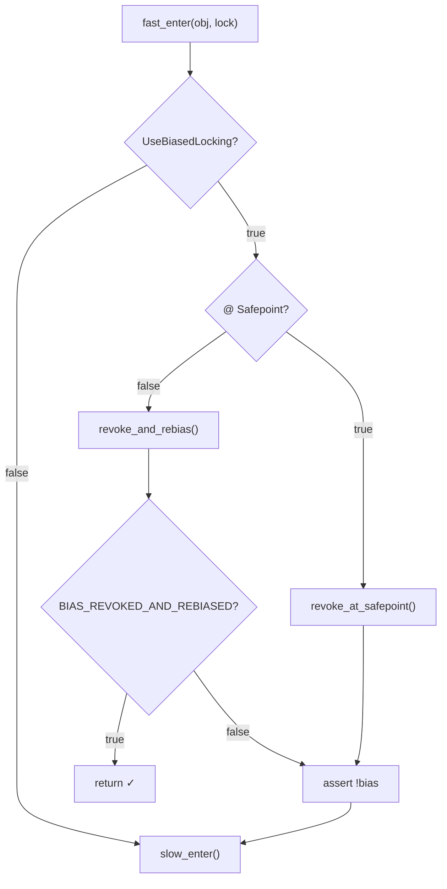
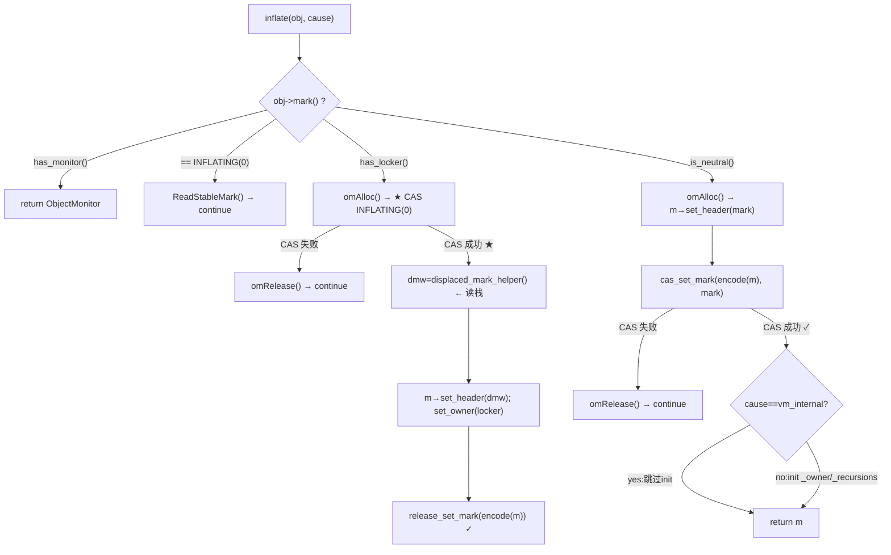

# BasicLock · 轻量级锁 + 锁膨胀(inflate) + hashCode 六种策略

> OpenJDK 11 slowdebug | `-Xms8g -Xmx8g -XX:+UseG1GC`（标准环境）
> 源文件: `synchronizer.cpp`, `basicLock.hpp`, `markOop.hpp`
> 前置: [01-ObjectMonitor]（重量锁 enter/exit 7 层降级 + QMode 四种唤醒策略）
> 关联: [02-BiasedLocking]（`revoke_and_rebias` 入口）[01-ObjectMonitor]（inflate 消费端 `enter()`）
> 阅读收益: 轻量锁 CAS 获取、inflate INFLATING 双 CAS 协议、六种 hashCode 策略设计取舍、三种锁状态下 hash 存储位置矩阵

---

## §〇 源文件清单

| 文件 | 关键内容 | 本文角色 |
|------|---------|---------|
| `synchronizer.cpp:265-281` | `fast_enter()` — 偏向锁检查 → slow_enter | ★ 入口 |
| `synchronizer.cpp:340-377` | `slow_enter()` — CAS 轻量锁 / 重入 / inflate | ★ 核心 |
| `synchronizer.cpp:283-333` | `fast_exit()` — 轻量锁释放 CAS restore header | ★ 释放 |
| `synchronizer.cpp:1403-1615` | `inflate()` — stack-locked/neutral 双路径 | ★ 膨胀 |
| `synchronizer.cpp:1116-1246` | `omAlloc()` — 三级 ObjectMonitor 分配池 | inflate 分配 |
| `synchronizer.cpp:1747-1816` | `deflate_idle_monitors()` — Safepoint 扫描回收 | ★ 回收 |
| `synchronizer.cpp:678-717` | `get_next_hash()` — 六种 hashCode 策略 | ★ hash 生成 |
| `synchronizer.cpp:719-829` | `FastHashCode()` — 三条路径 + inflate 兜底 | ★ hash 查询 |
| `basicLock.hpp:31-78` | `BasicLock(8B)` + `BasicObjectLock(16B)` | ★ 数据结构 |
| `markOop.hpp:30-155,205-302` | 64 位位布局 + lock 状态判断 + encode/INFLATING | ★ 位编码 |

---

## §一 核心原理

> **❓ 为什么需要轻量锁？** 偏向锁被撤销后，如果只有 2 个线程交替使用（无真正竞争），直接膨胀到 ObjectMonitor 代价太大——CAS 栈指针（~20 cycles）比分配 ObjectMonitor + park（~10000+ cycles）便宜 500 倍。轻量锁用极低开销处理低竞争场景。

### 1.1 锁升级路径全景

```
                    偏向锁 (lock=101, JavaThread*)
                    /        |          \
              保持偏向   wait/notify    撤销(竞争)
                   ↓       ↓              ↓
               (不变)  ★ 重量锁      ★ 轻量锁 (lock=00, BasicLock*)
                  (inflate_cause_wait/notify) /       \
                                    无竞争 CAS  竞争/inflate/hashCode
                                          ↓         ↓
                                   保持轻量    ★ 重量锁 (lock=10, ObjectMonitor*)
```

> **注意 bypass 路径**：`Object.wait()`/`notify()` 在偏向对象上跳过轻量锁直接 inflate（`inflate_cause_wait=2` / `inflate_cause_notify=3`）。同样，持轻量锁时调用 `identityHashCode()` 也会触发 inflate（`inflate_cause_hash_code=4`）。

轻量锁处于中间层：不需要 ObjectMonitor 的 216B 结构和三条队列，只需栈上 16B 的 BasicObjectLock。

### 1.2 数量级直觉

```
无锁 → 轻量锁 CAS:     1 次 cas_set_mark()    (~20 cycles)
轻量锁重入:             store NULL 到栈变量     (~1 cycle)
轻量锁释放 CAS:         1 次 cas_set_mark()    (~20 cycles)
轻量锁 → 重量锁 inflate: omAlloc + 1~2 次 CAS  (~500-2000 cycles)
重量锁 enter():         自适应自旋 → park()     (~10000+ cycles, 见[01-ObjectMonitor])
```

差 500-1000 倍——这就是"快路径"和"慢路径"的鸿沟。

### 1.3 为什么偏向撤销后走轻量锁而不是重量锁？

| 场景 | 是否应直接膨胀？ |
|------|------|
| 2 线程交替持锁（只抢一次） | ✗ — 只需 CAS 栈指针 |
| 2 线程真正竞争（CAS 失败） | slow_enter CAS 失败 → **触发 inflate** |
| Object.wait() 被调用 | wait → inflate（需要 ObjectMonitor WaitSet） |

**结论**：偏向撤销只说明"有人用过偏向锁"，不说明"现在在竞争"。slow_enter 先 CAS 一把——让竞争说话，失败了再 inflate。

---

## §二 数据结构

### 2.1 BasicLock（8B，栈上分配）

```cpp
// basicLock.hpp:31-46 — 粒度: volatile markOop(8B)
class BasicLock {
 private:
  volatile markOop _displaced_header;  // ★ 粒度: markOop(8B)
 public:
  markOop displaced_header() const          { return _displaced_header; }
  void     set_displaced_header(markOop h)  { _displaced_header = h; }
};
```

**_displaced_header 四种语义**（粒度: markOop, 8B）：

| 场景 | 值 | 含义 |
|------|------|------|
| 轻量锁首次获取 | 获取前的 markOop（含 hash/age/GC bits） | 备 release 时 CAS 恢复 |
| 轻量锁重入 | `NULL` | 无新的 markOop 可 displaced |
| 即将 inflate | `unused_mark()`(值=3) | 哨兵: 非 NULL 也非有效 header |
| fast_exit 重入退出 | `NULL` → 直接 return | 释放重入层 |

### 2.2 BasicObjectLock（16B，解释器栈帧 Lock Record）

```cpp
// basicLock.hpp:57-78 — 粒度: BasicLock(8B) + oop*(8B)
class BasicObjectLock {
 private:
  BasicLock _lock;   // ★ 粒度: BasicLock(8B), 必须在结构体开头(对齐要求)
  oop       _obj;    // ★ 粒度: oop*(8B), 关联的 Java 对象
};
```

### 2.3 解释器栈帧中 Lock Record 的物理位置

```
栈帧高地址 (栈底方向):
 ┌────────────────────┐ ← frame pointer
 │    局部变量表       │
 ├────────────────────┤
 │  BasicObjectLock N  │ ← interpreter_frame_monitor_begin() (frame_x86.cpp:323)
 │  [_lock:8B][_obj:8B]│    ★ 对象头 lock=00 时 ptr:62 指向 _lock
 ├────────────────────┤
 │  BasicObjectLock 1  │ ← 最小偏移
 ├────────────────────┤
 │   表达式栈          │ ← interpreter_frame_monitor_end()
 └────────────────────┘ ← 栈顶
```

每个 `monitorenter` 字节码分配一个 BasicObjectLock。fast_exit 释放最外层锁对应偏移最小的 Lock Record。

### 2.4 markOop 位编码（64 位 non-biased）

```
// markOop.hpp:46 + :139-155 枚举 (cms_free 在 bit 7, G1GC 下无意义)
63          39 38          8 7    6   5   4   3 2 1 0
┌─────────────┬──────────────┬──┬───┬───┬───┬──────┐
│  unused:25  │   hash:31    │cms│age:4│ 0 |  01  │ ← neutral (unlocked)
└─────────────┴──────────────┴──┴───┴─┴─┴──────┘
                              free:1 (CMS专用,G1忽略)
63          39 38          8 7                 2 1 0
┌─────────────┬──────────────┬─────────────────┬───┐
│ ptr_to_BasicLock*:62                          │00│ ← stack-locked ★
└──────────────────────────────────────────────┴───┘
63          39 38          8 7                 2 1 0
┌─────────────┬──────────────┬─────────────────┬───┐
│ ptr_to_ObjectMonitor*:62                     │10│ ← inflated
└─────────────────────────────────────────────┴───┘
```

**关键判断函数**（`markOop.hpp:215-302`）：

```cpp
// L215: is_neutral() — biased_lock=0 && lock=01
bool is_neutral() const { return (mask_bits(value(), biased_lock_mask_in_place) == unlocked_value); }

// L266: has_locker() — lock=00（栈锁）
bool has_locker()  const { return ((value() & lock_mask_in_place) == locked_value); }

// L273: has_monitor() — bit[2]=1（膨胀态）
bool has_monitor() const { return ((value() & monitor_value) != 0); }

// L227: ★ INFLATING 哨兵: (markOop)0 — 全 0 = "膨胀进行中,勿动"
static markOop INFLATING() { return (markOop) 0; }

// L301: unused_mark() — 返回值=3(marked_value), inflate 前哨兵
static markOop unused_mark() { return (markOop) marked_value; }
```

**INFLATING(0) 的特殊性**：`is_neutral()`=false, `has_locker()`=false, `has_monitor()`=false——所有常规判断全 false，正是想要的效果。

---

## §三 fast_enter() 源码逐行

```cpp
// synchronizer.cpp:265 — fast_enter()
void ObjectSynchronizer::fast_enter(Handle obj, BasicLock* lock,
                                    bool attempt_rebias, TRAPS) {
  if (UseBiasedLocking) {                                     // ①
    if (!SafepointSynchronize::is_at_safepoint()) {           // ②
      BiasedLocking::Condition cond =
        BiasedLocking::revoke_and_rebias(obj, attempt_rebias, THREAD);
      if (cond == BiasedLocking::BIAS_REVOKED_AND_REBIASED) {
        return; // ★ 偏向锁获取成功
      }
    } else {                                                  // ③
      assert(!attempt_rebias, "can not rebias toward VM thread");
      BiasedLocking::revoke_at_safepoint(obj);
    }
    assert(!obj->mark()->has_bias_pattern(),                  // ④
           "biases should be revoked by now");
  }
  slow_enter(obj, lock, THREAD);                              // ⑤ → 轻量锁
}
```

**Mermaid 决策流程图**：



---

## §四 slow_enter() 源码逐行

```cpp
// synchronizer.cpp:340 — slow_enter()
void ObjectSynchronizer::slow_enter(Handle obj, BasicLock* lock, TRAPS) {
  markOop mark = obj->mark();                           // L341

  if (mark->is_neutral()) {                              // L344: ★ 无锁状态
    lock->set_displaced_header(mark);                   // L347: 备份原始 markOop
    if (mark == obj()->cas_set_mark((markOop) lock, mark)) {
      return;                                            // L350: ★ 轻量锁获取成功!
    }
    // CAS 失败 → fall through to inflate               // L352
  } else if (mark->has_locker() &&                       // L353: ★ 已是栈锁
             THREAD->is_lock_owned((address)mark->locker())) {
    lock->set_displaced_header(NULL);                    // L357: ★ 重入: NULL
    return;
  }

  // L365: inflate 前哨兵 → displaced_header = unused_mark() (值=3)
  lock->set_displaced_header(markOopDesc::unused_mark());
  // L374: ★ 膨胀 + 进入重量锁 enter()
  ObjectSynchronizer::inflate(THREAD, obj(),
      inflate_cause_monitor_enter)->enter(THREAD);
}
```

### 4.1 轻量锁获取（L344-L352）：CAS 安装 BasicLock*

```
before:  obj->mark() = [unused:25][hash:31=0][1][age:4][0|01]  ← is_neutral()
         lock._displaced_header = obj->mark()    (L347: 备份)
         CAS obj->mark() ← encode(BasicLock*)    (L348: 安装栈指针, lock=00)
after:   obj->mark() = [ptr_to_BasicLock:62][00]  ← has_locker()=true
```

**为什么先 ST displaced_header 再 CAS？** (`synchronizer.cpp:345-346` 注释)：store→CAS 形成内存序——CAS 成功后，其他线程看到新 markOop 时 displaced_header 已对它们可见。

### 4.2 重入检查（L353-L358）

```
T 第一次 slow_enter:
  Lock_1._displaced_header = obj->mark()    obj->mark() = encode(Lock_1*)
T 第二次 slow_enter (同一个 obj):
  Lock_2._displaced_header = NULL            obj->mark() 不变 (仍是 Lock_1*)
```

> **❓ 为什么重入用 `displaced_header=NULL` 而不是 `_recursions++`？** 轻量锁没有 ObjectMonitor 存计数器。每个 `monitorenter` 分配独立 BasicObjectLock，嵌套深度 = Lock Record 数。`fast_exit` 检测 `displaced_header==NULL` → 直接 return（不恢复对象头）。

### 4.3 膨胀入口（L365-L376）

CAS 失败 **or** 已被其他线程栈锁 → 调用 `inflate()`。

**`unused_mark()`=3 为什么是哨兵？** 值 3 = `marked_value`（lock=11），是 GC 标记对象的专用编码。任何非 GC 运行时代码都不可能产生 lock=11 的对象头——它天然是一个 dead value。用它做哨兵避免了与 NULL（重入标记）和真实 markOop 的歧义。

### 4.4 fast_exit() — 轻量锁释放

`fast_exit()` (`synchronizer.cpp:283-333`) 是 `slow_enter` 的对偶操作，释放路径极度简单：

```cpp
// synchronizer.cpp:283 — fast_exit(oop object, BasicLock* lock, TRAPS)
void ObjectSynchronizer::fast_exit(oop object, BasicLock* lock, TRAPS) {
  markOop dhw = lock->displaced_header();

  if (dhw == NULL) {                               // L290: ★ 重入退出
    return;  // 不碰对象头, 直接返回 — 内层 unlock 对应重入的 monitorenter
  }

  markOop mark = object->mark();
  if (mark == (markOop) lock) {                    // L319: ★ 对象头仍指向本 Lock Record
    if (object->cas_set_mark(dhw, mark) == mark) {  // L323: CAS restore displaced_header
      return;  // ★ 轻量锁释放成功!
    }
  }

  // L330: CAS 失败 或 对象头已变 → inflate 后走重量锁 exit
  ObjectSynchronizer::inflate(THREAD, object, inflate_cause_vm_internal)->exit(true, THREAD);
}
```

**三种退出路径**：

| 路径 | 条件 | 动作 | 匹配 enter 场景 |
|------|------|------|:---:|
| 重入退出 | `dhw == NULL` | 直接 return | 对应 `slow_enter` 的重入分支 |
| 正常退出 | `mark == lock` + CAS 成功 | restore `displaced_header` 到对象头 | 对应普通轻量锁获取 |
| 异常退出 | CAS 失败 or mark 已变化 | inflate → exit（走重量锁） | 对应 inflate 进行中 |

---

## §五 inflate() 完整描述

> **❓ 为什么需要 INFLATING 双 CAS 协议？** 多线程可能同时膨胀同一对象。INFLATING(0) 充当"膨胀权"自旋锁——谁先 CAS 安装 0，谁获得膨胀权。其他线程看到 0 → `ReadStableMark()` 自旋等待，避免分配多个 ObjectMonitor。

### 5.1 五种膨胀原因

| cause | 值 | 触发场景 |
|------|:---:|------|
| `inflate_cause_vm_internal` | 0 | VM内部: FastHashCode辅助(L808)、fast_exit兜底(L330)、complete_exit |
| `inflate_cause_monitor_enter` | 1 | ★ `monitorenter` 竞争（最常见） |
| `inflate_cause_wait` | 2 | `Object.wait()` — 必须 WaitSet |
| `inflate_cause_notify` | 3 | `Object.notify()` — 必须 WaitSet |
| `inflate_cause_hash_code` | 4 | `System.identityHashCode()` — 存 hash 到 `_header` |

> **cause 影响行为**：`vm_internal` 分配走 `new ObjectMonitor()` 而非 `omAlloc(Self)`（跳过池）。**所有 cause 统一走相同的初始化路径**（`m->Recycle(); m->set_owner(NULL); m->_recursions=0; m->_Responsible=NULL;`），不存在 vm_internal 跳过初始化的特殊行为 — `synchronizer.cpp:1569-1578` 对所有分支无条件初始化。

### 5.2 inflate 完整循环 + 两条路径

`inflate()` (`synchronizer.cpp:1403-1615`) 是 `for(;;)` 循环，按 markOop 分四路处理。简化伪代码：

```cpp
ObjectMonitor* ObjectSynchronizer::inflate(Thread* Self, oop object, InflateCause cause) {
  for (;;) {
    const markOop mark = object->mark();
    if (mark->has_monitor())            // L1430: ① 已膨胀
      return mark->monitor();
    if (mark == INFLATING())            // L1444: ② 膨胀中 → 自旋
      { ReadStableMark(object); continue; }
    if (mark->has_locker()) {           // L1469: ③ 栈锁 → ★双CAS
      ObjectMonitor* m = omAlloc(Self); // (cause≠vm_internal走池,否则new)
      m->Recycle(); m->_recursions=0; m->_SpinDuration=Knob_SpinLimit;
      if (object->cas_set_mark(INFLATING(), mark) != mark) // ★CAS1:抢膨胀权
        { omRelease(Self, m, true); continue; }
      markOop dmw = mark->displaced_mark_helper(); // ★读栈
      m->set_header(dmw); m->set_owner(mark->locker()); m->set_object(object);
      object->release_set_mark(encode(m));          // ★CAS2:安装ObjectMonitor*
      return m;
    }
    // ④ neutral → 单CAS, 无INFLATING                  L1559
    assert(mark->is_neutral(), "invariant");
    ObjectMonitor* m = omAlloc(Self);
    m->Recycle(); m->set_header(mark); m->set_owner(NULL); m->set_object(object);
    m->_recursions=0; m->_SpinDuration=Knob_SpinLimit;
    // ★ 所有 cause 统一初始化: _owner(NULL)/_recursions(0)/_Responsible(NULL)
    // synchronizer.cpp:1572-1578 无条件执行，不存在 vm_internal 跳过
    if (object->cas_set_mark(encode(m), mark) != mark)
      { m->set_object(NULL); omRelease(Self, m, true); continue; }
    return m;
  }
}
```

**路径 A 步骤表: stack-locked → inflated**（双 CAS, L1469-L1557）:

| 步 | 操作 | 粒度 | 行号 |
|:---:|------|------|:---:|
| ① | `has_locker()` | 2-bit | L1469 |
| ② | `omAlloc(Self)` | ObjectMonitor*(8B) | L1470 |
| ③ | ★ `CAS INFLATING(0)` 抢膨胀权 | markOop(8B) | L1479 |
| ④ | CAS失败→`omRelease`+`continue` | — | L1481 |
| ⑤ | `dmw=displaced_mark_helper()` 读栈 | markOop(8B) | L1515 |
| ⑥ | `m->set_header(dmw)` | markOop(8B) | L1519 |
| ⑦ | `m->set_owner(mark->locker())` | Thread* | L1526 |
| ⑧ | `release_set_mark(encode(m))` | markOop(8B) | L1533 |

> **❓ 步骤⑤跨线程读栈为什么安全？** inflater 可能和持锁线程不同。完整因果：
> 1. 持有者 `slow_enter` L347 `set_displaced_header(mark)`（栈写）
> 2. 持有者 L348 `cas_set_mark(lock_ptr, mark)`（CAS + 全内存屏障）
> 3. CAS 全屏障 → 步骤1的store已传播至所有CPU
> 4. inflater读到 `has_locker()=true` → 步骤2已成功 → 步骤1的store**必然可见**
> 5. INFLATING(0) 保证期间持有者不会释放锁（fast_exit碰0不CAS直接调inflate），栈上 `_displaced_header` 不被覆写
>
> **4保证可见性，5保证不变性。缺一不可。**

**路径 B: neutral → inflated**（单 CAS, L1559-L1614）：直接 `cas_set_mark(encode(m), mark)`，无 INFLATING。neutral 无栈数据需保护。CAS 输家 `omRelease` 归还 ObjectMonitor，重试时 `has_monitor()` 命中赢家已安装的。

### 5.3 inflate Mermaid 流程图（含 cause 影响）



### 5.4 omAlloc 三级分配池（指数增长批量搬迁）

`omAlloc(Self)` (`synchronizer.cpp:1116-1246`):

| 优先级 | 来源 | 操作 | 并发保护 |
|:---:|------|------|------|
| 1 | 线程本地 `omFreeList` | 摘取头部，无锁 | 仅本线程 |
| 2 | 全局 `gFreeList` | `gListLock`下搬迁，批量大小= `omFreeProvision`，**每次搬迁后 `omFreeProvision += 1 + omFreeProvision/2`**，指数增长至上限 `MAXPRIVATE=1024` | `gListLock` mutex |
| 3 | C 堆 | `new ObjectMonitor[_BLOCKSIZE]` malloc 整块 | malloc内部 |

> **为什么指数增长？** 线程越频繁 inflate → 越需要更多 ObjectMonitor → 一次搬迁更多，减少 `gListLock` 争用频率。序列：1→2→4→7→11→...→1024。这是经典的 exponential backoff batch 优化。

---

## §六 hashCode 六种策略

> **❓ 为什么需要六种策略？** 不同部署需求：基准测试要可重现、安全敏感系统要防 HashDos（地址不可预测）、高性能系统要低延迟（per-thread state 无 contention）。可切换策略授权给运维。

### 6.1 get_next_hash 六种策略源码

```cpp
// synchronizer.cpp:678 — get_next_hash(Thread* Self, oop obj)
static inline intptr_t get_next_hash(Thread * Self, oop obj) {
  intptr_t value = 0;
  if (hashCode == 0) {
    value = os::random();                                    // L684: Park-Miller PRNG
  } else if (hashCode == 1) {
    intptr_t addrBits = cast_from_oop<intptr_t>(obj) >> 3;   // L689: 地址 XOR stwRandom
    value = addrBits ^ (addrBits >> 5) ^ GVars.stwRandom;    // ← STW 间稳定
  } else if (hashCode == 2) {
    value = 1;                                               // L692: 始终=1 (测试)
  } else if (hashCode == 3) {
    value = ++GVars.hcSequence;                              // L694: 全局自增序列
  } else if (hashCode == 4) {
    value = cast_from_oop<intptr_t>(obj);                    // L696: 对象地址
  } else {
    // ★ 策略 5: Marsaglia XOR-Shift (JDK8+ 默认)
    unsigned t = Self->_hashStateX;  t ^= (t << 11);        // L701-709
    Self->_hashStateX = Self->_hashStateY;  Self->_hashStateY = Self->_hashStateZ;
    Self->_hashStateZ = Self->_hashStateW;
    unsigned v = Self->_hashStateW;  v = (v ^ (v >> 19)) ^ (t ^ (t >> 8));
    Self->_hashStateW = v;  value = v;
  }
  value &= markOopDesc::hash_mask;  // L712: 取低 31 位
  if (value == 0) value = 0xBAD;    // L713: 0 保留为 no_hash
  return value;
}
```

### 6.2 策略对比表

| # | 算法 | 性能 | 均匀性 | 可预测性 | 多线程开销 | 场景 |
|:---:|------|:---:|:---:|:---:|:---:|------|
| 0 | Park-Miller PRNG via `os::random()` → Linux syscall `getrandom()` | 慢(~1000-3000c) | ★★★ | 不可预测 | ★★★ 高(全局锁) | 强随机需求 |
| 1 | addr XOR `stwRandom` | 快(~10c) | ★★ | STW间稳定 | ★ 低 | 需可重现 |
| 2 | 始终=1 | 最快(~1c) | ☆ 灾难 | 可预测 | ☆ 无 | **仅测试** |
| 3 | 全局自增 `++GVars.hcSequence` | 中(~20c,缓存行弹跳) | ★ 差 | 可预测 | ★★★ 高 | 调试 |
| 4 | 对象地址 | 最快(~1c) | ★ 差 | HashDos风险 | ☆ 无 | 单线程基准 |
| **5** | **XOR-Shift (per-thread)** | **快(~15c)** | **★★★** | **需128bit种子** | **★ 低** | **★JDK8+默认** |

### 6.3 FastHashCode 完整逻辑

```cpp
// synchronizer.cpp:719 — FastHashCode(Thread* Self, oop obj)
intptr_t ObjectSynchronizer::FastHashCode(Thread * Self, oop obj) {
  if (UseBiasedLocking) {
    if (obj->mark()->has_bias_pattern()) {                   // L728
      BiasedLocking::revoke_and_rebias(...);                // L735: ★ 偏向+hash=冲突
    }
  }
  markOop mark = ReadStableMark(obj);                       // L753

  if (mark->is_neutral()) {                                 // L758: 路径1 无锁
    hash = mark->hash(); if (hash) return hash;
    hash = get_next_hash(Self, obj);
    temp = mark->copy_set_hash(hash);
    if (obj->cas_set_mark(temp, mark) == mark) return hash; // CAS 安装到对象头
  } else if (mark->has_monitor()) {                          // L776: 路径2 已膨胀
    temp = monitor->header();  hash = temp->hash();
    if (hash) return hash;    // hash 在 ObjectMonitor._header
  } else if (Self->is_lock_owned((address)mark->locker())) { // L785: 路径2b owner读栈
    temp = mark->displaced_mark_helper();  hash = temp->hash();
    if (hash) return hash;
    // ★ L792-800 警告: displaced header 严格 immutable, 不能在栈上写 hash!
  }

  // L808: ★ 兜底: inflate → 存 hash 到 ObjectMonitor._header
  monitor = ObjectSynchronizer::inflate(Self, obj, inflate_cause_hash_code);
  mark = monitor->header();  hash = mark->hash();
  if (hash == 0) {
    hash = get_next_hash(Self, obj);
    temp = mark->copy_set_hash(hash);
    test = Atomic::cmpxchg(temp, monitor->header_addr(), mark); // L817: CAS
    if (test != mark) hash = test->hash();  // 别人抢先写了
  }
  return hash;
}
```

### 6.4 hash 存储位置完整矩阵

| 锁状态 | hash 在哪？ | 如何读写？ | 并发安全？ |
|------|------|------|:---:|
| **偏向锁** (lock=101) | ❌ 不存在—偏向&hash互斥 | 先 revoke_and_rebias 撤销 | — |
| **无锁** (lock=01) | markOop bits [38:8] | `mark->hash()` / `copy_set_hash()` CAS | CAS |
| **轻量锁** (lock=00) | `BasicLock._displaced_header` bits [38:8] | `displaced_mark_helper()` 解引用读 | 仅owner |
| **重量锁** (lock=10) | `ObjectMonitor._header` bits [38:8] | `monitor->header()->hash()` | cmpxchg |

**核心不变式**：hash 一旦生成，永不改变。这驱动了所有 inflate 路径中"复制 displaced header"逻辑。

---

## §七 deflate_idle_monitors

**触发时机**：`SafepointCleanupTask` 在每次 safepoint 后执行 (`synchronizer.cpp:1747-1816`)，不在 hot path。

```cpp
// synchronizer.cpp:1747
void ObjectSynchronizer::deflate_idle_monitors(DeflateMonitorCounters* counters) {
  // ① 遍历全局 ObjectMonitor 链表 (gOmInUseList 或 gBlockList, L1765-1801)
  // ② if (!mid->is_busy()) → deflate_monitor(mid, obj) → 恢复 obj->set_mark(_header)
  //    从 in-use 移除 → 加入 free 链表归还 gFreeList
  // ③ freeHeadp → O(1) 拼接到 gFreeList 头部 (L1804-1809)
  // L1814 探针: MonitorDefation(scavenged/inuse/circulating)
}
```

| 字段 | 含义 | 粒度 |
|------|------|------|
| `_count` | 引用计数: `wait()`+1, `exit()`-1 | jint(4B) |
| `nScavenged` | 本次回收数 | int |
| `nInuse` | 仍在使用数 | int |
| `nInCirculation` | 全局总数 (= `gMonitorPopulation`) | int |

**trade-off**：大堆→GC间隔长→ObjectMonitor累积多→单次扫描量大 (`synchronizer.cpp:1641-1644`)。

---

## §八 GDB 验证 + 可证伪断言

### #1 轻量锁获取时 displaced_header = 原始 markOop

**断言**: `slow_enter` 返回前 `lock->displaced_header()` = CAS 前的 `obj->mark()`

```
(gdb) b synchronizer.cpp:349
(gdb) p/x lock->displaced_header()
预期: 低3位 = 001 (unlocked), hash 字段 = 0 (首次获取无hash)
```

### #2 轻量锁重入时 displaced_header = NULL

**断言**: 同一线程对同一 obj 第二次 `monitorenter`，新 Lock Record `_displaced_header == NULL`

```
(gdb) b synchronizer.cpp:358          # 在 set_displaced_header(NULL) 之后
(gdb) p/x lock->displaced_header()
预期: $1 = 0x0    (NULL — 重入标记)
```

### #3 inflate 双 CAS 协议验证

**断言**: stack-locked → inflated 对象头先变 INFLATING(0)，再变 ObjectMonitor*

```
(gdb) b synchronizer.cpp:1479    # CAS INFLATING(0)
(gdb) b synchronizer.cpp:1533    # release_set_mark(encode(m))
在1479: p/x object->mark()  预期低3位=000 (stack-locked)
在1533: p/x object->mark()  预期低2位=10  (inflated)
```

### #4 JDK 默认 hashCode=5

**断言**: 默认启动 `hashCode` 全局变量 = 5 (Marsaglia XOR-Shift)

```
(gdb) p hashCode
预期: $1 = 5
```

### #5 膨胀后 hashCode 写 ObjectMonitor._header

**断言**: 对象已膨胀且无 hash → FastHashCode 用 cmpxchg 写 `_header`

```
(gdb) b synchronizer.cpp:817  # Atomic::cmpxchg(header_addr)
(gdb) p monitor
预期: monitor->_header 被更新为含 hash 的 markOop
```

### #6 omAlloc 线程本地池优先

**断言**: 线程首次 inflate 走路径2(全局池)或路径3(C堆), 后续走路径1(线程本地)

```
(gdb) p Self->omFreeCount
预期: 首次=0 (无本地缓存), 多次后>0
```

### #7 INFLATING(0) 导致 fast_exit 跳过 CAS 分支直接走 inflate

**断言**: fast_exit 检查 `mark == (markOop)lock` 时，如果对象头是 INFLATING(0)，0 ≠ lock 地址 → **不执行 CAS**，直接跳转 L330 走 inflate

```
(gdb) b synchronizer.cpp:319   # if (mark == (markOop) lock)  检查
(gdb) p/x object->mark()
// 值=0 (INFLATING) → mark(0) != lock(非0地址) → 条件为 false → 跳过 CAS
(gdb) b synchronizer.cpp:330   # inflate(..., inflate_cause_vm_internal)
预期: 在 319 跳过 CAS → 命中断点 330
```

### #8 deflate 恢复对象头为 neutral

**断言**: deflate 后对象的 markOop 恢复为 neutral (lock=01)

```
(gdb) b synchronizer.cpp:1747
# 在 deflate 后:
(gdb) p/x obj->mark()
预期: 低3位 = 001 (unlocked/neutral), 不含 monitor 指针
```

### 可验证实验：用 Java 触发 inflate 并观察

```java
// 编译: javac ContentionTest.java
// 运行: java -Xlog:monitorinflation=debug ContentionTest
//  (JDK 11 用 -Xlog, 不能再用 -XX:+TraceMonitorInflation)
public class ContentionTest {
    static final Object lock = new Object();
    public static void main(String[] args) throws Exception {
        // ★ 先让对象带 hash, 避免后续 hash 调用意外触发 inflate
        System.out.println("hash=" + System.identityHashCode(lock));

        // 阶段1: 无竞争 → 轻量锁获取 + 释放
        synchronized (lock) {
            System.out.println("Phase 1: stack-locked (no inflate expected)");
        }   // fast_exit: CAS restore header → 成功

        // 阶段2: 竞争 → inflate_cause_monitor_enter
        Thread t = new Thread(() -> {
            synchronized (lock) { /* CAS 失败 → slow_enter → inflate! */ }
        });
        synchronized (lock) { t.start(); t.join(); }
    }
}
```

预期 JVM 日志（阶段2 竞争时输出）：
```
[debug][monitorinflation] Inflating object 0x..., mark 0x..., type java/lang/Object
```

---

## §九 一句话总结 + 交叉引用

**一句话总结**: 轻量锁是锁升级的"缓冲器"——偏向撤销后用 CAS 栈指针（~20 cycles）测试竞争，失败才 inflate（~500-2000 cycles）；inflate 用 INFLATING(0) 双 CAS 协议保证多线程安全膨胀；hashCode 六种策略中 JDK8+ 默认的 XOR-Shift 在性能、均匀性、并发友好性三项指标上取得最佳平衡。

**交叉引用**:
- **[01-ObjectMonitor]** — inflate 消费端: `enter()` 7 层降级、`exit()` QMode 唤醒、`wait()`/`notify()` 触发 inflate
- **[02-BiasedLocking]** — `revoke_and_rebias()` 在 fast_enter 中被调用，撤销后对象进入轻量锁路径
- **[07-README]** — 锁升级概览、三种锁的完整对比表
- **源码核心文件**: `synchronizer.cpp:265-377`(enter), `1403-1615`(inflate), `678-829`(hash), `1747-1816`(deflate)；`basicLock.hpp:31-78`；`markOop.hpp:30-312`

---

> **可证伪断言清单**（用于 GDB/源码/GC log 验证）
>
> | # | 断言 | 验证方式 |
> |---|------|---------|
> | 1 | 轻量锁获取后 `displaced_header` = 获取前 markOop | GDB break L349 |
> | 2 | 重入 `displaced_header = NULL` | GDB break L358: `p/x displaced_header()` → 0x0 |
> | 3 | inflate 先 CAS INFLATING(0) 再 release_set_mark | GDB break L1479+L1533 |
> | 4 | JDK 默认 hashCode=5 | `p hashCode` in GDB → 5 |
> | 5 | 膨胀后 hash 写 `_header` via cmpxchg | GDB break L817 |
> | 6 | omAlloc 优先线程池, `omFreeProvision` 指数增长 | `p Self->omFreeCount` + `p Self->omFreeProvision` |
> | 7 | INFLATING(0)→fast_exit 跳过CAS直接inflate (L319条件false) | GDB: L319→L330 |
> | 8 | deflate 恢复 markOop 为 neutral (lock=01) | GDB break L1747后: `p/x obj->mark()` → 低3位=001 |
