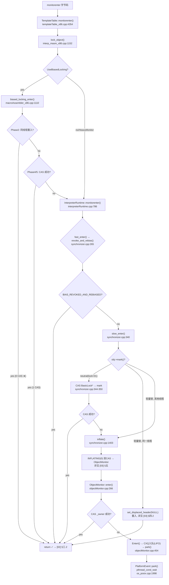
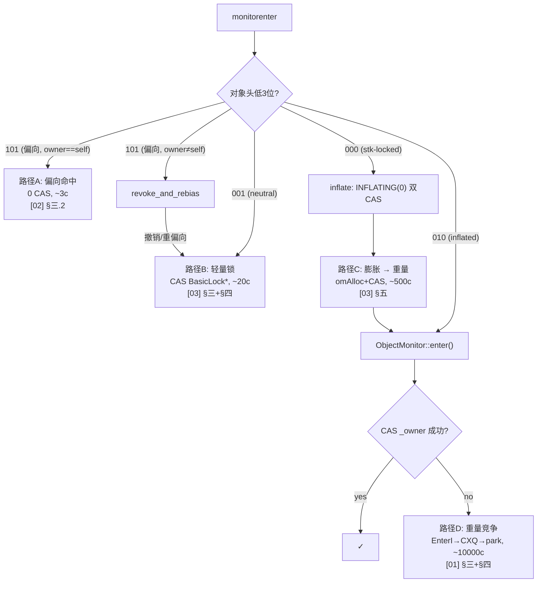

# Synchronized 全链路 — 从 monitorenter 到 OS mutex

> OpenJDK 11 slowdebug | `-Xms8g -Xmx8g -XX:+UseG1GC`（标准环境）
> 源文件: `templateTable_x86.cpp`, `synchronizer.cpp`, `objectMonitor.cpp`, `biasedLocking.cpp`, `basicLock.hpp`
> 前置: 无（这是本系列建议的**第一篇**）| 深入后读: [01-ObjectMonitor] [02-BiasedLocking] [03-BasicLock-Synchronizer]
> 阅读收益: 5 分钟获得 lock=101→00→10 完整调用链地图，知道每个分叉点跳去哪篇深入

---

## §〇 阅读导航 — 本文定位

> 如果你第一次系统研究 JVM 的 `synchronized` 实现，**先读这篇**。本文不深入任何单一机制，而是把所有路径串成一张地图。遇到细节问题，按 `详见 [XX] §Y.Y` 跳转到对应文档。

### 三个阅读深度

```
5 分钟速览:  看 §一 全链路 Mermaid 图 + §七 四级开销对比表             → 得"骨架"
30 分钟理解: 加读 §二~六 四条 enter 路径 + exit 对称表                  → 得"血肉"  
2 小时精通:  按交叉引用跳读 [01-ObjectMonitor] [02-BiasedLocking] [03]  → 得"骨髓"
```

### 源文件清单

| 层 | 文件:行号 | 函数 | 角色 |
|:---:|------|------|------|
| 1 | `templateTable_x86.cpp:4354` | `TemplateTable::monitorenter()` | 解释器机器码入口 |
| 2 | `interp_masm_x86.cpp:1152` | `lock_object()` | 汇编生成：bias CAS + stack CAS |
| 3 | `macroAssembler_x86.cpp:1110` | `biased_locking_enter()` | ★ 偏向锁七阶段 |
| 4 | `interpreterRuntime.cpp:786` | `monitorenter()` | 慢速路径→`fast_enter` |
| 5 | `synchronizer.cpp:265` | `fast_enter()` | ★ 锁调度：偏→轻→重 |
| 6 | `biasedLocking.cpp:624` | `revoke_and_rebias()` | 偏向撤销/重偏向 |
| 7 | `synchronizer.cpp:340` | `slow_enter()` | 轻量锁 CAS / inflate |
| 8 | `synchronizer.cpp:1403` | `inflate()` | INFLATING(0) 双 CAS |
| 9 | `objectMonitor.cpp:266` | `enter()` | 重量锁获取：CAS+自旋+park |
| E1 | `objectMonitor.cpp:921` | `exit()` | 重量锁释放：QMode 唤醒 |

---

## §一 全景地图 — 从 monitorenter 到 pthread_cond_wait

### 1.1 全链路 Mermaid



### 1.2 对象头状态变化 — 沿调用链的 markOop 位

```
101 (偏向锁, 持有者==自己) ──→ (不变, 0 操作!)
101 (偏向锁, 持有者≠自己) ──→ 001 (neutral, 撤销后) ──→ 000 (轻量锁, BasicLock*)
001 (neutral, 无锁)       ──→ 000 (轻量锁, CAS BasicLock*)
000 (轻量锁, 竞争出现)     ──→ 0x0 (INFLATING 哨兵, 全64位=0) ──→ 010 (重量锁, ObjectMonitor*)
010 (重量锁, owner==self)  ──→ (重入, _recursions++)
010 (重量锁, owner≠self)   ──→ park()
```

### 1.3 对象头初始状态 — monitorenter 之前

> **面试必问**：`new Object()` 后对象头长什么样？答案取决于类的 `prototype_header` 和 `BiasedLockingStartupDelay`：
> - 类允许偏向 **且** 偏向锁已启用（启动延迟已过或 `BiasedLockingStartupDelay=0`） → `biased_locking_prototype()` → 低 3 位 = **101**（匿名偏向）
> - 类允许偏向 **但** 仍在启动延迟窗口内 → **001**（偏向锁全局未启用）
> - 类被 `BULK_REVOKE` 禁用 → `prototype()` → 低 3 位 = **001**（无锁，直接走轻量路径）
>
> 详见 [02-BiasedLocking] §二.5：`Klass.prototype_header` 类级别偏向策略。

### 1.4 四条路径分叉 Mermaid



---

## §二 路径 A: 偏向锁获取 — 0 次 CAS

> **❓ 为什么偏向重入只需 3 条指令而轻量锁要 CAS？** 偏向锁把"获取"编码为"当前线程指针 == 对象头中的线程指针"。这个等式在 x86 TSO 模型下，一次普通 `mov` 读 + 一次 `xor` + 一次 `jcc` 就验证完毕——没有 `lock` 前缀，没有 store。轻量锁做不到这点，因为安装 BasicLock* 必须原子地修改对象头。详见 [02-BiasedLocking] §一：>80% 的锁都是同一线程重入，0 CAS 的收益是巨大的。

### 前置条件

对象已是偏向状态 (lock=101)，且偏向持有者 == 当前线程，epoch 有效。

### 调用链

```
monitorenter → lock_object() → biased_locking_enter(Phase2) → done
```

### 核心源码 (`macroAssembler_x86.cpp:1158-1174`)

```cpp
// Phase2: 检查 "当前线程 == 偏向持有者 && epoch 匹配"
load_prototype_header(tmp, obj);           // L1158: 读 klass.prototype_header
tmp = tmp | r15_thread;                    // L1160: [proto | current_thread]
tmp = tmp ^ swap;                          // L1161: XOR → 匹配则全0
tmp = tmp & ~age_mask;                     // L1169: 忽略 age
if (tmp == 0) goto done;                   // L1174: ★ 0 次 CAS, 3 条指令!
```

**代价**：~3 条指令（xor + and + jcc），0 次 `lock` 前缀。详见 [02-BiasedLocking] §三.2。

---

## §三 路径 B: 轻量锁获取 — 1 次 CAS

> **❓ 为什么轻量锁要先 `set_displaced_header(mark)` 再 CAS？** Store→CAS 形成**隐式内存序**——CAS 内置全屏障（`lock cmpxchg`），CAS 成功后，displaced_header 对其他 CPU 必然可见。这个 ordering 保证释放时 `cas_set_mark(dhw, mark)` 能正确恢复 markOop。如果先 CAS 再 store displaced_header，释放线程可能读到旧值。详见 [03-BasicLock-Synchronizer] §三——这是 HotSpot 注释中明确指出的 race 防御。

### 前置条件

对象无锁 (lock=01)，或偏向已被撤销。汇编已跳过或失败，进入 `slow_enter`。

### 调用链

```
monitorenter → lock_object() → slow_case → InterpreterRuntime::monitorenter()
  → fast_enter() → slow_enter(obj, lock)
```

### 核心源码 (`synchronizer.cpp:344-350`)

```cpp
// slow_enter(): 轻量锁 CAS
if (mark->is_neutral()) {                  // L344: lock=01, biased_lock=0
  lock->set_displaced_header(mark);        // L347: 备份原始 markOop 到栈
  if (mark == obj->cas_set_mark((markOop)lock, mark)) {
    return;                                // L350: ★ CAS 成功, lock=00!
  }
}
```

### 对象头变化

```
[unused:25|hash:31|age:4|0|01]  →  [BasicLock*:62|00]
 neutral (lock=01)                 stack-locked (lock=00)
```

**代价**：1 次 `lock cmpxchgptr` (~20 cycles)。详见 [03-BasicLock-Synchronizer] §三+§四。

---

## §四 路径 C: 轻量→重量膨胀 — INFLATING 双 CAS

> **❓ 为什么 inflate 需要 INFLATING(0) 哨兵而非单 CAS？** 多线程可能**同时膨胀同一对象**。INFLATING(0) 充当"膨胀权"自旋锁：谁先 CAS 安装 0，谁获得膨胀权。其他线程看到 0 → `ReadStableMark()` 自旋等待，避免分配多个 ObjectMonitor（每个 ~216B，分配重复会浪费 C 堆且引发对象头竞争）。0 的特殊性在于它是所有锁状态判断函数（`is_neutral()`、`has_locker()`、`has_monitor()`）的**共同假值**——代码看到 0 就知道"有人正在膨胀，别碰"。详见 [03-BasicLock-Synchronizer] §五。

### 前置条件

对象已被另一个线程轻量持有 (lock=00 → other_BasicLock)，或 CAS 失败。

### 调用链

```
slow_enter() → lock->displaced_header=unused_mark() → inflate(obj)
```

### 核心源码 (`synchronizer.cpp:1469-1533`，压缩)

```cpp
// inflate(): 栈锁 → 重量锁（双 CAS 协议）
ObjectMonitor* ObjectSynchronizer::inflate(Thread* Self, oop obj, InflateCause cause) {
  for (;;) {
    const markOop mark = obj->mark();
    if (mark->has_monitor())     return mark->monitor();           // ①已膨胀
    if (mark == INFLATING())     { ReadStableMark(obj); continue; }// ②膨胀中
    if (mark->has_locker()) {                                      // ③栈锁
      ObjectMonitor* m = omAlloc(Self);  m->Recycle();
      if (obj->cas_set_mark(INFLATING(), mark) != mark)            // ★ CAS1: 抢膨胀权
        { omRelease(Self, m, true); continue; }
      markOop dmw = mark->displaced_mark_helper();  // 读持有者栈
      m->set_header(dmw);  m->set_owner(mark->locker());
      obj->release_set_mark(encode(m));                            // ★ CAS2: 装 ObjectMonitor*
      return m;
    }
    // ④ neutral → 单 CAS（无 INFLATING, L1559）
  }
}
```

### 对象头变化（三态）

```
[BasicLock*:62|00]  →  [0x0...0:64 = INFLATING 哨兵]  →  [ObjectMonitor*:62|10]
 stack-locked             全64位=0, is_being_inflated()=true    inflated
```

**代价**：`omAlloc` + 1~2 次 CAS (~500-2000 cycles)。详见 [03-BasicLock-Synchronizer] §五。

---

## §五 路径 D: 重量锁竞争 — park 进内核

> **❓ 为什么 EnterI 中 CXQ 用 LIFO 而不是 FIFO？** LIFO（后进先出）是**无锁 CAS 插入**的最简实现——只需 `node._next = _cxq; CAS(&_cxq, &node, _cxq)`。FIFO 需要维护尾指针，CAS 操作从 O(1) 变成 O(n) 或不安全的双 CAS。但 LIFO 有**饥饿风险**——先到的线程可能永远轮不到。HotSpot 的补偿策略：exit() 时将整个 CXQ 一次性搬到 EntryList 并反转顺序——用批量搬迁的 O(n) 换取 exit 路径上的公平性保证。详见 [01-ObjectMonitor] §四 和 §五 QMode 策略。

### 前置条件

对象已膨胀 (lock=10)，`_owner` 已被其他线程持有，CAS 失败。

### 调用链

```
ObjectMonitor::enter() → TryLock 失败 → TrySpin 失败 → EnterI()
  → ObjectWaiter 入 CXQ(LIFO) → park() → PlatformEvent::park() → pthread_cond_wait
```

### 核心源码 (`objectMonitor.cpp:266-315` + `454-540`，压缩)

```cpp
// enter(): 重量锁快速路径 (objectMonitor.cpp:266)
void ObjectMonitor::enter(TRAPS) {
  if (CAS(&_owner, NULL, Self) == NULL) return;    // ★ 快速 CAS
  if (_owner == Self) { _recursions++; return; }   // 重入
  if (Self->is_lock_owned((address)_owner)) {      // 栈锁升级
    _recursions = 1; _owner = Self; return;         // L280-285: recursions=1(不是0)
  }
  // ... TrySpin 自适应自旋 ...
  EnterI(THREAD);                                   // L315: ★ 慢路径
}

// EnterI(): 竞争队列 + park (objectMonitor.cpp:454)
void ObjectMonitor::EnterI(TRAPS) {
  // ... 自旋重试 ...
  ObjectWaiter node(Self);                          // 构造等待节点
  Self->_ParkEvent->reset();
  node.TState = ObjectWaiter::TS_CXQ;
  ObjectWaiter* nxt;
  for (;;) {                                        // LIFO 入队 CXQ
    nxt = _cxq;
    node._next = nxt;
    if (CAS(&_cxq, &node, nxt) == nxt) break;      // ★ CAS 竞争插入
  }
  node._event->park();                              // ★ park → pthread_cond_wait
}
```

**代价**：自适应自旋 + CAS 入队 + `pthread_cond_wait` (~10000+ cycles)。详见 [01-ObjectMonitor] §三+§四。

---

## §六 monitorexit — 回程的对称性

> **❓ 为什么偏向锁的 exit 是空操作？** 偏向锁的"获取"没有修改对象头（Phase2 只是读+比较），所以"释放"也不需要改任何东西——没有 displaced_header 需要恢复，没有 _owner 需要清零。偏向对象的 monitorexit 比轻量锁的 CAS restore 便宜 20 倍，这也是为什么偏向锁无竞争场景下是零开销的完整体现。

```
monitorexit
  │
  ├─ 偏向锁:  fast_exit → 空操作 (无 store!)          [0 操作]        详见 [02]
  ├─ 轻量锁:  fast_exit → CAS restore displaced_header [1 CAS ~20c]   详见 [03] §四.4
  └─ 重量锁:  ObjectMonitor::exit() → release_store(_owner,NULL)      详见 [01] §五
               → 检查 _cxq/_EntryList → QMode 唤醒 → unpark
```

### 核心源码 (`synchronizer.cpp:283-330` + `objectMonitor.cpp:921`)

```cpp
// fast_exit(): 偏向 / 轻量锁释放 (synchronizer.cpp:283)
void ObjectSynchronizer::fast_exit(oop obj, BasicLock* lock, TRAPS) {
  markOop dhw = lock->displaced_header();
  if (dhw == NULL) return;                       // L290: ★ 重入退出, 直接return
  markOop mark = obj->mark();
  if (mark == (markOop)lock)                     // L319: 对象头仍指向本 Lock Record
    if (obj->cas_set_mark(dhw, mark) == mark)    // L323: ★ CAS restore → lock=01
      return;
  inflate(THREAD, obj, inflate_cause_vm_internal)->exit(true, THREAD); // L330: 兜底
}

// exit(): 重量锁释放 (objectMonitor.cpp:921)
void ObjectMonitor::exit(bool not_suspended, TRAPS) {
  if (_recursions > 0) { _recursions--; return; }        // 重入递减
  OrderAccess::release_store(&_owner, (void*)NULL);       // ★ 释放 owner
  // QMode 控制 _cxq → _EntryList 转移策略
  // → unpark 继任者 (_succ 或 EntryList 头部)
}
```

### Enter ⇔ Exit 对称表

| Enter 路径 | Exit 路径 | 获取代价 | 释放代价 |
|------|------|:---:|:---:|
| A 偏向命中 | 空操作 | 0 CAS (~3c) | 0 |
| B 轻量 CAS | CAS restore | 1 CAS (~20c) | 1 CAS (~20c) |
| C 膨胀 | exit() 兜底 | 双CAS (~500c) | exit() 标准 |
| D 重量 park | exit() + unpark | park (~10000c) | exit()+unpark |

---

## §七 数量级对比 — 为什么设计成四级？

> **❓ 面试高频题：为什么不只做"轻量+重量"两级？为什么加偏向和膨胀？** 答案两个字：**统计**。
> - **加偏向**：实测 >80% 的锁是单线程重入。把 80% 的场景从"每次 CAS"降到"0 CAS"，收益巨大。
> - **加膨胀层**：偏向撤销后不一定有竞争——2 线程交替持有锁时，一次 CAS 足够。直接进 ObjectMonitor（216B 分配 + 三条队列初始化）是巨大浪费。让 slow_enter 先 CAS 一把，让竞争说话——失败了再 inflate。
> - **不降级**（重量不回轻量）：降级意味着每次释放都要检查"是否没人等了"，而释放是 hot path。宁可后台批量 deflate 也不在 hot path 做这个判断。

### 7.1 四级开销对比

| 路径 | 触发条件 | 获取代价 | CAS 次数 | 释放代价 | 详见 |
|------|------|:---:|:---:|:---:|:---:|
| A 偏向 | obj 偏向当前线程, epoch 有效 | **~3 cycles** | 0 | 0 | [02] §三.2 |
| B 轻量 | obj 无锁或偏向已撤 | **~20 cycles** | 1 | 1 CAS (~20c) | [03] §三+§四 |
| C 膨胀 | 轻量锁出现竞争 | **~500-2000 cycles** | 2-3 | exit() 标准 | [03] §五 |
| D 重量 | 已膨胀, owner≠self | **~10000+ cycles** | n | exit()+unpark | [01] §三+§五 |

**级差**：A→B 差 ~6 倍，B→C 差 ~25 倍，C→D 差 ~20 倍。这就是"快路径"和"慢路径"的鸿沟。

### 7.2 每级适用场景与退化条件

| 级别 | 适用场景 | 退化到下一级的信号 |
|------|------|------|
| 偏向 A | 单线程反复获取（>80% 锁） | 其他线程 CAS 失败 → `revoke_and_rebias` |
| 轻量 B | 2 线程交替，无真正竞争 | slow_enter CAS 失败 (已被其他线程持有) |
| 膨胀 C | 过渡态，存在竞争但尚未 park | park 触发 |
| 重量 D | 真正竞争，需内核仲裁 | 自适应自旋失败 |

### 7.3 日志对比

```bash
# 偏向锁开启 — 大部分获取走快速路径
java -XX:+UseBiasedLocking -Xlog:biasedlocking*=info -Xlog:monitorinflation=info ...

# 偏向锁关闭 — 直接走 slow_enter → 轻量锁
java -XX:-UseBiasedLocking -Xlog:monitorinflation=info ...
```

---

## §八 GDB 验证 + 可证伪断言

### 完整断点链

```
(gdb) b templateTable_x86.cpp:4354        # 1. monitorenter 入口
(gdb) b macroAssembler_x86.cpp:1174       # 2. Phase2: 偏向命中判断
(gdb) b synchronizer.cpp:265              # 3. fast_enter 入口
(gdb) b synchronizer.cpp:350              # 4. slow_enter CAS 成功
(gdb) b synchronizer.cpp:1479             # 5. inflate CAS INFLATING(0)
(gdb) b synchronizer.cpp:1533             # 6. inflate release_set_mark
(gdb) b objectMonitor.cpp:266             # 7. ObjectMonitor::enter
(gdb) b objectMonitor.cpp:454             # 8. EnterI 慢路径
(gdb) b os_posix.cpp:1998                 # 9. PlatformEvent::park
(gdb) b objectMonitor.cpp:921             #10. exit()
```

### 10 条可证伪断言

### #1 偏向重入经过 Phase2 且无 lock cmpxchgptr
`(gdb) b macroAssembler_x86.cpp:1174` → 单步确认无 `lock` 前缀指令 [链节点 #2]

### #2 轻量锁获取后 obj->mark() 低 2 位=00
`(gdb) b synchronizer.cpp:350` → `p/x obj->mark()` 预期低2位=00 [链节点 #4]

### #3 inflate 先 CAS INFLATING(0) 再 release_set_mark
`(gdb) b synchronizer.cpp:1479` → `p/x obj->mark()`=0; `b :1533` → mark 低2位=10 [链节点 #5,#6]

### #4 重量锁 enter 无竞争时只需 CAS _owner，不进入 EnterI
`(gdb) b objectMonitor.cpp:315` → 预期**不到达**此断点（CAS 在 L272 成功就返回了）；命中说明走 EnterI [链节点 #7]

### #5 EnterI 中 park 走 pthread_cond_wait
`(gdb) b os_posix.cpp:1998` → `bt` 看到 `PlatformEvent::park` → `pthread_cond_wait` [链节点 #9]

### #6 monitorexit 偏向锁路径无 store
`(gdb) b interp_masm_x86.cpp:1261` → 偏向对象直接 return

### #7 monitorexit 轻量锁路径 CAS restore displaced_header
`(gdb) b synchronizer.cpp:323` → `p/x lock->displaced_header()` 含原 markOop

### #8 monitorexit 重量锁路径 exit() → release_store _owner=NULL
`(gdb) b objectMonitor.cpp:921` → 执行后 `p _owner` → 0x0 [链节点 #10]

### #9 偏向锁关闭时 fast_enter 直接走 slow_enter
`-XX:-UseBiasedLocking` + `b synchronizer.cpp:265` → 跳过 `revoke_and_rebias` 直接 `slow_enter`

### #10 完整链: 从 monitorenter 到 EnterI 单步走完
依次设置上述 9 个断点 + `continue`，验证必经每个节点

```java
// 验证实验: 追踪偏向→重量全路径
public class FullPathTest {
    static final Object lock = new Object();
    public static void main(String[] args) throws Exception {
        synchronized (lock) {} // 主线程获取偏向
        Thread t = new Thread(() -> {
            synchronized (lock) { // T2 触发偏向撤销→轻量→膨胀
                synchronized (lock) { Thread.yield(); } // 重入
            }
        });
        t.start(); t.join();
    }
}
// 运行: gdb --args java -Xms8g -Xmx8g -XX:+UseBiasedLocking -Xint FullPathTest
// 依次设上述 10 个断点 + continue，打印 obj->mark() 在每个节点的低3位
```

---

## §九 一句话总结 + 交叉引用 + 阅读路径

**一句话总结**: `synchronized` 的 `monitorenter` 按对象头低 3 位分流：101=偏向（0 CAS，汇编 xorptr+jcc）→ 001=无锁时 CAS 栈指针（1 CAS，~20c）→ 000 竞争时 INFLATING 双 CAS 膨胀（~500c）→ 010 已膨胀时 CAS _owner 快速路径或 EnterI→park（~10000c）；`monitorexit` 对称递减。

### 下一步阅读路径

```
读完本文 (全链路地图)
  │
  ├─ 想深入偏向锁? → [02-BiasedLocking]
  │    逆向推导 biasing 的 epoch 机制、汇编七阶段、四种无 STW 撤销
  │
  ├─ 想深入轻量锁? → [03-BasicLock-Synchronizer]
  │    inflate 双 CAS 协议、hashCode 六种策略、omAlloc 三级分配池
  │
  └─ 想深入重量锁? → [01-ObjectMonitor]
       enter() 7 层降级、exit() QMode 唤醒、自适应自旋、_Responsible 机制
```

### 交叉引用索引

| 本文 § | 操作 | 文档 | 章节 |
|:---:|------|------|:---:|
| §二 | 偏向重入 0 CAS | [02-BiasedLocking] | §三.2 |
| §二 | 偏向首次获取 1 CAS | [02-BiasedLocking] | §三.3 |
| §三 | 轻量锁 CAS 获取 | [03-BasicLock-Synchronizer] | §三 + §四 |
| §四 | inflate INFLATING 双 CAS | [03-BasicLock-Synchronizer] | §五 |
| §五 | ObjectMonitor::enter | [01-ObjectMonitor] | §三 |
| §五 | EnterI CXQ park | [01-ObjectMonitor] | §四 |
| §六 | exit QMode 唤醒 | [01-ObjectMonitor] | §五 |
| §六 | fast_exit CAS restore | [03-BasicLock-Synchronizer] | §四.4 |
