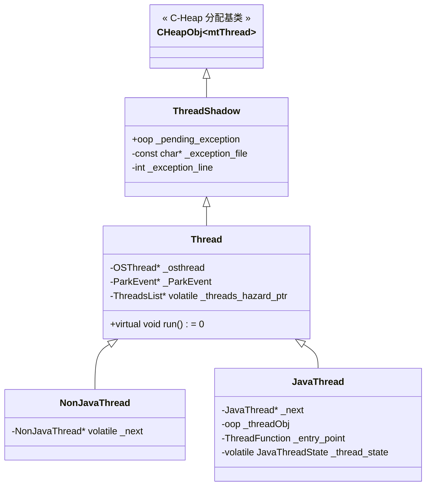
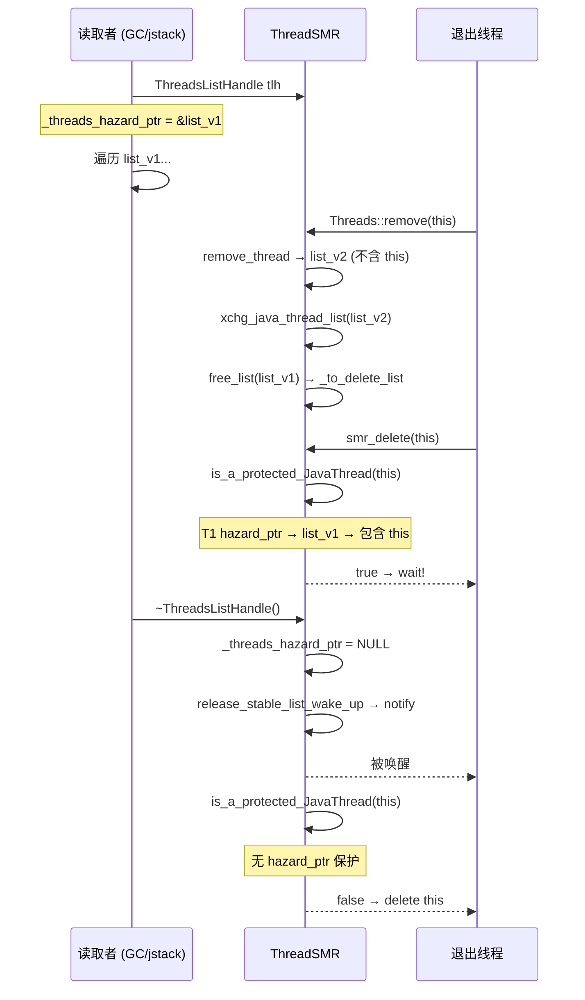

# 05-JVM-Thread-Lifecycle: JavaThread 的一生

> **从 `new Thread().start()` 到 `smr_delete()` — 完整生命周期**
>
> 标准环境：OpenJDK 11 slowdebug, `-Xms8g -Xmx8g -XX:+UseG1GC`, 64 位 Linux x86, Region=4MB

---

## §〇 源文件清单

| 文件 | 类/函数 | 角色 |
|------|------|------|
| `share/utilities/exceptions.hpp:60` | `ThreadShadow : CHeapObj<mtThread>` | 继承顶层 |
| `share/runtime/thread.hpp:115` | `Thread` 基类 | 基类 |
| `share/runtime/thread.hpp:792` | `NonJavaThread` | 分叉背景 |
| `share/runtime/thread.hpp:925` | `JavaThread` | ★ 主角 |
| `share/prims/jvm.cpp:2890` | `JVM_StartThread()` | 创建入口 |
| `share/prims/jvm.cpp:2875` | `thread_entry()` | 用户回调 |
| `share/os/linux/os_linux.cpp:965` | `os::create_thread()` | 唯一创建实现 |
| `share/os/linux/os_linux.cpp:884` | `thread_native_entry()` | 醒来第一站 |
| `share/runtime/thread.cpp:1851` | `JavaThread::JavaThread(ThreadFunction,size_t)` | 构造函数 |
| `share/runtime/thread.cpp:3367` | `JavaThread::prepare()` | 双向关联 |
| `share/runtime/thread.cpp:564` | `Thread::start()` → `os::start_thread()` | 启动调度 |
| `share/runtime/thread.cpp:427` | `Thread::call_run()` → `run()` 多态分发 | 分发 |
| `share/runtime/thread.cpp:1927` | `JavaThread::run()` | 初始化 |
| `share/runtime/thread.cpp:1967` | `JavaThread::thread_main_inner()` | 执行 Java |
| `share/runtime/thread.cpp:2015` | `JavaThread::exit(bool, ExitType)` | 退出清理 |
| `share/runtime/thread.cpp:4716` | `Threads::add(JavaThread*, bool)` | 注册 |
| `share/runtime/thread.cpp:4754` | `Threads::remove(JavaThread*, bool)` | 摘除 |
| `share/runtime/threadSMR.hpp:88` | `ThreadsSMRSupport : AllStatic` | SMR 接口 |
| `share/runtime/threadSMR.hpp:158` | `ThreadsList : CHeapObj<mtThread>` | 快照数组 |
| `share/runtime/threadSMR.hpp:272` | `ThreadsListHandle : StackObj`（RAII）| 读取者保护 |
| `share/runtime/threadSMR.cpp:751` | `add_thread(JavaThread*)` | 快照创建 |
| `share/runtime/threadSMR.cpp:928` | `remove_thread(JavaThread*)` | 快照移除 |
| `share/runtime/threadSMR.cpp:955` | `smr_delete(JavaThread*)` | 延迟释放循环 |
| `share/runtime/threadSMR.cpp:861` | `is_a_protected_JavaThread(JavaThread*)` | Hazard 检查 |
| `share/runtime/osThread.hpp:44-54` | `OSThread::ThreadState` 枚举（9 种）| OS 层状态 |
| `share/utilities/globalDefinitions.hpp:890` | `JavaThreadState` 枚举（12 种）| C++ 状态机 |

## §一 从一行 Java 代码到内核 LWP

### ❓ 为什么需要理解线程创建的全链路？

[01-ObjectMonitor] 中 `_owner` 存的是 `JavaThread*`；[02-BiasedLocking] 中 GC 遍历线程找 GC root；safepoint 协议中 VMThread 遍历 `_thread_list` 逐个暂停线程——不理解 JavaThread 何时诞生、如何注册到全局链表、如何被 safepoint 暂停、如何销毁，就无法理解这些子系统。

### 1.1 抽象层全链路

```
Java 层:     new Thread().start()
               ↓ Thread.start0() (native)
JVM C++ 层:  JVM_StartThread → new JavaThread → os::create_thread
               ↓ pthread_create()
glibc:       pthread_create → clone()
               ↓ clone(CLONE_VM|CLONE_THREAD|...)
Linux 内核:  copy_process → LWP 诞生
```

### 1.2 数量级直觉

| 操作 | 耗时 | 相对比值 |
|------|------|---------|
| TLAB 内指针碰撞 | ~15 ns | 1x |
| `pthread_create` → `clone()` | ~15 μs | **1000x** |
| 完整 `new Thread().start()` | ~25 μs | 1700x |

### 1.3 1:1 线程模型

```
1 java.lang.Thread 对象 (堆内 oop)
 ↔ 1 JavaThread (C-Heap, mtThread)
   ↔ 1 OSThread (C-Heap, mtThread)
     ↔ 1 pthread (glibc)
       ↔ 1 LWP (Linux 内核)
```

没有绿色线程（M:N）。HotSpot 历史上曾支持 M:N 调度，JDK 1.3 后废弃——现代 Linux pthread 足够高效。

## §二 继承链速览

### 2.1 Thread 基类核心字段（thread.hpp:115）

```
CHeapObj<mtThread> → ThreadShadow → Thread → { JavaThread, NonJavaThread }
```

`Thread` 基类关键字段（粒度标注）：
| 字段 | 类型/粒度 | 作用 |
|------|----------|------|
| `_osthread` | `OSThread*` (指针) | 指向 OS 层线程结构 |
| `_ParkEvent` | `ParkEvent*` (指针) | synchronized 的 park/unpark |
| `_SleepEvent` | `ParkEvent*` (指针) | Thread.sleep() |
| `_MutexEvent` | `ParkEvent*` (指针) | Mutex 竞争等待 |
| `_SR_lock` | `Monitor*` (指针) | suspend/resume 专用锁 |
| `_polling_page` | `void*` (内存页地址) | safepoint 轮询页 |
| `_threads_hazard_ptr` | `ThreadsList* volatile` (原子指针) | ThreadSMR 保护 |

### 2.2 JavaThread vs NonJavaThread — 核心分歧

JavaThread **被 safepoint 暂停**、**提供 GC root**（栈帧 oop 遍历）、持有 `_threadObj(oop)` 关联堆对象。
NonJavaThread **不被 safepoint 暂停**（VMThread、WatcherThread、CompilerThread 等，它们不操作 Java 堆 oop，或者在 safepoint 期间自然停止）。

### 2.3 Mermaid 继承树



## §三 线程创建：从 Java 到 pthread_create ★★★

### 3.1 JVM_StartThread 源码走读（jvm.cpp:2890）

```cpp
JVM_ENTRY(void, JVM_StartThread(JNIEnv* env, jobject jthread))
  JavaThread *native_thread = NULL;
  bool throw_illegal_thread_state = false;
  {
    MutexLocker mu(Threads_lock);                    // ★ 持有全局锁
    if (java_lang_Thread::thread(JNIHandles::resolve_non_null(jthread)) != NULL) {
      throw_illegal_thread_state = true;            // 已启动 → 抛异常
    } else {
      jlong size = java_lang_Thread::stackSize(JNIHandles::resolve_non_null(jthread));
      size_t sz = size > 0 ? (size_t)size : 0;
      native_thread = new JavaThread(&thread_entry, sz); // ★ C++ 对象诞生
      if (native_thread->osthread() != NULL) {
        native_thread->prepare(jthread);              // ★ 双向关联
      }
    }
  }
  // ... 错误处理 (osthread==NULL → smr_delete + OOM) ...
  Thread::start(native_thread);                     // ★ 真正启动
JVM_END
```

### ❓ 为什么必须在 Threads_lock 下创建？

> safepoint 期间 VMThread 遍历 `Threads::_thread_list` 收集需要暂停的 JavaThread。
> 如果 `new JavaThread` 已分配但未注册 → safepoint **漏掉它** → 漏掉的线程继续执行 Java、
> 修改堆内 oop → **堆损坏**。`Threads_lock` 持有者不会被 safepoint 阻塞。

### 3.2 JavaThread 构造函数（thread.cpp:1851）

```cpp
JavaThread::JavaThread(ThreadFunction entry_point, size_t stack_sz)
  : Thread()                           // 基类构造:
                                       //   初始化 _ParkEvent/_SleepEvent/_MutexEvent
                                       //   初始化 _SR_lock
{
  initialize();                        // ★ 设置 _thread_state = _thread_new (=2)
                                       //   thread.cpp:1715
  _jni_attach_state = _not_attaching_via_jni;
  set_entry_point(entry_point);       // ★ 保存回调 → _entry_point
  os::ThreadType thr_type = (entry_point == &compiler_thread_entry)
                            ? os::compiler_thread : os::java_thread;
  os::create_thread(this, thr_type, stack_sz);  // ★ 构造内调 OS 创建
  // _osthread 可能为 NULL（内存不足）
}
```

### 3.3 JavaThread::prepare — 双向关联（thread.cpp:3367）

```cpp
void JavaThread::prepare(jobject jni_thread) {
  assert(Threads_lock->owned_by_self(), "must hold Threads_lock");
  Handle thread_oop(Thread::current(), JNIHandles::resolve_non_null(jni_thread));
  set_threadObj(thread_oop());                    // ★ JavaThread._threadObj → Java oop
  java_lang_Thread::set_thread(thread_oop(), this);// ★ Java oop.eetop → JavaThread*
  // 形成双向指针:
  //   JavaThread._threadObj  → heap oop (oop)
  //   heap oop.eetop         → JavaThread* (C++ ptr)
}
```

### 3.4 Thread::start → os::start_thread（thread.cpp:564）

```cpp
void Thread::start(Thread* thread) {
  if (!DisableStartThread) {
    if (thread->is_Java_thread()) {
      // ★ 必须在启动前设置为 RUNNABLE，因为启动后状态不确定
      java_lang_Thread::set_thread_status(
          ((JavaThread*)thread)->threadObj(),
          java_lang_Thread::RUNNABLE);
    }
    os::start_thread(thread);     // → 唤醒子线程（OSThread state: INITIALIZED → RUNNABLE）
  }
}
```

### 3.5 os::create_thread — 完整链路（os_linux.cpp:965）

```
os::create_thread(Thread* thread, ThreadType thr_type, size_t req_stack_size)
  │
  ├─ Phase 1: 创建 OSThread
  │   OSThread* osthread = new OSThread(NULL, NULL)
  │   osthread->set_thread_type(thr_type)   // 4 种: java/compiler/gc/watcher
  │   osthread->set_state(ALLOCATED)        // 初始状态
  │   thread->set_osthread(osthread)        // Thread→OSThread 单向关联
  │
  ├─ Phase 2: pthread 属性
  │   pthread_attr_setdetachstate(&attr, PTHREAD_CREATE_DETACHED)  ← ★ 关键
  │   pthread_attr_setstacksize(&attr, stack_size)
  │
  ├─ Phase 3: pthread_create → clone()
  │   ret = pthread_create(&tid, &attr,
  │        (void*(*)(void*))thread_native_entry,  // ★ 回调
  │        thread)                                 // ★ 参数=JavaThread*
  │   最多重试 3 次（处理 EAGAIN）
  │
  └─ Phase 4: 等待子线程初始化
      while (osthread->get_state() == ALLOCATED)
        sync_with_child->wait();           // 父线程阻塞 → 等待子线程 INITIALIZED
```

### ❓ 为什么 DETACHED 而不是 JOINABLE？

> JVM 的 join 机制：`ensure_join()` 用 `java.lang.Thread` 的 monitor 做 `wait/notify`。
> 不需要 `pthread_join` 获取返回值—JVM 不在乎。`DETACHED` = 线程退出时自动回收内核资源。

### ❓ 为什么有 EAGAIN 重试？

> `clone()` 返回 `EAGAIN`：`ulimit -u` 超限或 `vm.max_map_count` 不足。
> 3 次概率性重试（超时不降低系统负载则抛 `OutOfMemoryError`）。

### ThreadType 栈大小对比

| ThreadType | 默认栈 | 用途 |
|------------|-------|------|
| java_thread | 1 MB（`-Xss`） | 用户线程 |
| compiler_thread | 4 MB | C1/C2 JIT |
| gc_thread | 512 KB | G1 并发标记 |
| watcher_thread | 512 KB | 定时任务 |

### 3.6 pthread_create → clone() flags 逐一解释

```
clone(CLONE_VM | CLONE_FS | CLONE_FILES | CLONE_SIGHAND |
      CLONE_THREAD | CLONE_SYSVSEM | CLONE_SETTLS |
      CLONE_PARENT_SETTID | CLONE_CHILD_CLEARTID, ...)

CLONE_VM      — ★ 共享地址空间（否则无法访问 JVM 堆/Metaspace）
CLONE_FS      — 共享 cwd/umask/root（否则 chdir 只影响父线程）
CLONE_FILES   — 共享 fd 表（否则 fd 不可见/泄漏）
CLONE_SIGHAND — 共享信号处理器表（否则 sigaction 只对父线程生效）
CLONE_THREAD  — 同一线程组（tgid 同 → ps 显示为同一进程的多线程）
CLONE_SETTLS  — ★ 新线程有独立 TLS（pthread_setspecific 独立）
```

### 3.7 线程醒来：thread_native_entry（os_linux.cpp:884）

```cpp
static void* thread_native_entry(Thread* thread) {
  thread->record_stack_base_and_size();        // 记录栈信息
  thread->initialize_thread_current();          // ★ TLS 注册
  // 内部: _thr_current = this; ThreadLocalStorage::set_thread(this);
  //       即 pthread_setspecific(_thr_current_key, this)
  //       从此任何位置 Thread::current() → pthread_getspecific → 返回 this

  // 握手协议:
  osthread->set_state(INITIALIZED);             // ALLOCATED → INITIALIZED
  sync->notify_all();                            // ★ 唤醒父线程
  while (osthread->get_state() == INITIALIZED) {
    sync->wait();                                // ★ 等父线程调用 os::start_thread()
  }

  thread->call_run();                           // ★ → run() 多态分发
  thread = NULL;
  return 0;
}
```

**Thread::current() 原理**：`initialize_thread_current` 中调用 `pthread_setspecific(_thr_current_key, this)`，之后每次 `Thread::current()` 都通过 `pthread_getspecific(_thr_current_key)` 获取——零锁、零竞争。

### 3.8 Thread::call_run → 多态分发（thread.cpp:427）

```cpp
void Thread::call_run() {
  register_thread_stack_with_NMT();
  this->run();  // ★ 纯虚函数 → vtable → 多态:
  //   JavaThread    → JavaThread::run()     (thread.cpp:1927)
  //   VMThread      → VMThread::run()       → loop()
  //   WatcherThread → WatcherThread::run()  → PeriodicTask
  //   GangWorker    → GangWorker::run()     → WorkGang
}
```

## §四 JavaThread::run — 第一个 JVM 函数

### 4.1 初始化序列（thread.cpp:1927）

```cpp
void JavaThread::run() {
  this->initialize_tlab();                   // ★ TLAB 初始化
  this->record_base_of_stack_pointer();      // 记录栈基址
  this->create_stack_guard_pages();          // mprotect PROT_NONE
  this->cache_global_variables();

  // ★★★ 关键: 状态转换 + 内存屏障
  ThreadStateTransition::transition_and_fence(this, _thread_new, _thread_in_vm);
  //                                            from=2         to=6

  this->set_active_handles(JNIHandleBlock::allocate_block());
  thread_main_inner();                       // ★ 进入 Java
}
```

### 4.2 ❓ 为什么 transition_and_fence 必须 fence？

> **写入者**: JavaThread 自身 → `_thread_state = _thread_in_vm`（Store）
> **读取者**: VMThread 在 safepoint 中 **不加锁** 读取所有 JavaThread 的 `_thread_state`
>
> 没有 fence → CPU store buffer 延迟 → VMThread 读到 stale `_thread_new` →
> 认为未初始化 → safepoint 跳过此线程 → 堆损坏
>
> fence 语义: **StoreLoad 屏障** — 确保 `_thread_state` 写入对所有 CPU 可见后再继续。
> 这是 `volatile jint` 仍需显式 fence 的原因：volatile 禁止编译器重排 + 保证单核可见，但**不保证 Store 后紧跟的 Load 不被重排到 Store 之前**（StoreLoad 重排是几乎所有 CPU 都允许的）。`OrderAccess::fence()` = 全屏障含 StoreLoad，强制 store buffer 排空后再执行后续 Load。

### 4.3 ★★★ 三套状态系统

### ❓ 为什么 JVM 需要三套独立的状态系统？

三个不同的"读者"在三个不同层次需要不同的状态信息：

| 维度 | JavaThreadState | java.lang.Thread.State | OSThread::ThreadState |
|------|----------------|------------------------|----------------------|
| **存储位置** | `JavaThread::_thread_state` (C++ 堆, `volatile jint`) | `threadStatus` (堆内 oop 字段, `int`) | `OSThread::_state` (C-Heap) |
| **值数量** | 12 种 | 6 种 | 9 种 |
| **修改者** | 线程自身通过 `ThreadStateTransition` 宏 | `java_lang_Thread::set_thread_status()` | 各阻塞点显式 `set_state()` |
| **读取者** | VMThread（safepoint）, GC, ThreadSMR | jstack, `Thread.getState()`, JVMTI, JFR | JVMTI GetThreadState, 遗留代码 |
| **核心用途** | ★ safepoint 安全性判定 | ★ 对外 API | OS 调度跟踪（★ 官方承认 broken） |
| **同步** | `volatile` + `fence` | 显式 API 调用 | 显式 `set_state` |

#### JavaThreadState 完整枚举（globalDefinitions.hpp:890）

```cpp
enum JavaThreadState {
  _thread_uninitialized     =  0,   // 不出现
  _thread_new               =  2,   // 刚创建
  _thread_new_trans         =  3,   // 过渡态
  _thread_in_native         =  4,   // JNI/native — safepoint 安全
  _thread_in_native_trans   =  5,
  _thread_in_vm             =  6,   // VM 代码中 — safepoint 安全
  _thread_in_vm_trans       =  7,
  _thread_in_Java           =  8,   // ★ Java 代码 — 需要 safepoint
  _thread_in_Java_trans     =  9,
  _thread_blocked           = 10,   // VM 中阻塞 — safepoint 安全
  _thread_blocked_trans     = 11,
  _thread_max_state         = 12
};
// 偶数 = 稳定态, 奇数 = 过渡态。safepoint 协议只关注偶数态。
```

#### OSThread::ThreadState 枚举（osThread.hpp:44）

```cpp
enum ThreadState {
  ALLOCATED, INITIALIZED, RUNNABLE,
  MONITOR_WAIT, CONDVAR_WAIT, OBJECT_WAIT,
  BREAKPOINTED, SLEEPING, ZOMBIE
};
// ★ 官方注释: "legacy code, not correctly implemented"
```

#### 典型场景的三套状态映射

| 场景 | JavaThreadState | Thread.State | OSThread |
|------|:----:|:----:|:---:|
| 刚创建未启动 | `_thread_new`(2) | NEW | ALLOCATED |
| 执行 Java run() | `_thread_in_Java`(8) | RUNNABLE | RUNNABLE |
| 执行 JNI 代码 | `_thread_in_native`(4) | **RUNNABLE** | RUNNABLE |
| 等待 synchronized 锁 | `_thread_blocked`(10) | BLOCKED | MONITOR_WAIT |
| `Object.wait()` | `_thread_blocked`(10) | WAITING | OBJECT_WAIT |
| `Thread.sleep()` | `_thread_blocked`(10) | TIMED_WAITING | SLEEPING |
| 已退出 | (已销毁) | TERMINATED | ZOMBIE |

**★ 关键差异 1**：`_thread_in_native` → jstack 仍显示 **RUNNABLE**，但 safepoint 协议认为安全。
**★ 关键差异 2**：OS 层区分 `MONITOR_WAIT` vs `OBJECT_WAIT`，但 C++ 层统一为 `_thread_blocked`。
**★ 关键差异 3**：三者独立维护，不存在自动同步。

```mermaid
stateDiagram-v2
    [*] --> _thread_new : new JavaThread()
    _thread_new --> _thread_in_vm : transition_and_fence<br/>(JavaThread::run)
    _thread_in_vm --> _thread_in_Java : 解释/编译执行
    _thread_in_Java --> _thread_in_native : JNI
    _thread_in_native --> _thread_in_Java : JNI 返回
    _thread_in_Java --> _thread_in_vm : safepoint
    _thread_in_vm --> _thread_blocked : Monitor/sleep/wait
    _thread_blocked --> _thread_in_vm : 被唤醒
    _thread_in_vm --> _thread_in_Java : 返回 Java
```

### 4.4 thread_main_inner → 执行 Java run()（thread.cpp:1967）

```cpp
void JavaThread::thread_main_inner() {
  if (!this->has_pending_exception() &&
      !java_lang_Thread::is_stillborn(this->threadObj())) {
    this->set_native_thread_name(this->get_thread_name());  // pthread_setname_np
    HandleMark hm(this);
    this->entry_point()(this, this);  // ★ 调用 thread_entry
  }

  DTRACE_THREAD_PROBE(stop, this);
  this->exit(false);     // ★ 进入退出（§五）
  this->smr_delete();    // ★ 延迟释放（§六）
}
```

`thread_entry` — JVM 回调（jvm.cpp:2875）:

```cpp
static void thread_entry(JavaThread* thread, TRAPS) {
  HandleMark hm(THREAD);
  Handle obj(THREAD, thread->threadObj());
  JavaValue result(T_VOID);
  JavaCalls::call_virtual(&result, obj,
      SystemDictionary::Thread_klass(),
      vmSymbols::run_method_name(),         // "run"
      vmSymbols::void_method_signature(),   // "()V"
      THREAD);
}
```

## §五 JavaThread::exit — 优雅退出（thread.cpp:2015）

### 5.1 完整 4 阶段退出流程

```cpp
void JavaThread::exit(bool destroy_vm, ExitType exit_type) {
  // Phase 1: 异常 + JVMTI 通知
  HandleMark hm(this);
  if (!destroy_vm) {
    // dispatchUncaughtException() → UncaughtExceptionHandler
    // Thread.exit() → 通知 ThreadGroup（重试 3 次防 Thread.stop 干扰）
    JvmtiExport::post_thread_end(this);       // JVMTI 事件

    // 处理外部 suspend 请求（必须在设 terminated 前完成）
    while (true) {
      { MutexLockerEx ml(SR_lock(), ...);
        if (!is_external_suspend()) {
          set_terminated(_thread_exiting);     // _not_terminated → _thread_exiting
          break;
        }
      }
      java_suspend_self();                    // 响应 suspend 后继续循环
    }
  }

  // Phase 2: ensure_join
  ensure_join(this);                          // (见 5.2)

  // Phase 3: Threads::remove（内部调用 omFlush 归还 ObjectMonitor）
  Threads::remove(this, daemon);              // 从 _thread_list 摘除

  // Phase 4: 资源回收
  ThreadSafepointState::destroy(this);
  JNIHandleBlock::release_block(active_handles());
  remove_stack_guard_pages();
  if (UseTLAB) tlab().make_parsable(true);    // retire TLAB
  BarrierSet::barrier_set()->on_thread_detach(this);  // flush SATB/DirtyCard
  delete _thread_stat;
}
```

### 5.2 ensure_join — ❓ 为什么不用 pthread_join？（thread.cpp:1992）

```cpp
static void ensure_join(JavaThread* thread) {
  Handle threadObj(thread, thread->threadObj());
  ObjectLocker lock(threadObj, thread);              // ★ 获取 java.lang.Thread 的 monitor
  thread->clear_pending_exception();

  java_lang_Thread::set_thread_status(threadObj(),   // ★ Java 状态 → TERMINATED
                                      java_lang_Thread::TERMINATED);
  java_lang_Thread::set_thread(threadObj(), NULL);   // ★ 断开 Java→C++ 关联
  lock.notify_all(thread);                            // ★ 唤醒所有 join() 等待者
  thread->clear_pending_exception();
}
```

**为什么用 java.lang.Thread 的 monitor 而不是 pthread_join？**
> pthread 用 `DETACHED` 模式（见 §3.5），`pthread_join` 不可用。
> Java 层的 `Thread.join()` 实现本质是: `while (isAlive()) wait()` —
> 当 `ensure_join` 设置 `threadObj.eetop = NULL` 后 `isAlive()` 返回 `false`，
> `notify_all` 唤醒等待者。

### 5.3 ❓ 退出线程持有的 synchronized 锁怎么处理？

| 锁类型 | 处理方式 | 安全？ |
|--------|---------|:---:|
| Java 层 `synchronized` | ThreadDeath → 栈展开 → `monitorexit` 字节码正常释放 | ✅ |
| JNI `JNI_MonitorEnter` | `omFlush` 移动 ObjectMonitor 到全局 free list | ⚠️ 不 notify! |

> **JNI 锁的问题**：`omFlush` 把 ObjectMonitor 从 `omInUseList` 移到全局池，
> 但**不调用 notify** → 其他等待者永久等不到 → **这就是 `Thread.stop()` 废弃的原因之一**。

### 5.4 Threads::remove — 从全局链表摘除（thread.cpp:4754）

```cpp
void Threads::remove(JavaThread* p, bool is_daemon) {
  ObjectSynchronizer::omFlush(p);            // ★ 先归还 ObjectMonitor

  { MutexLocker ml(Threads_lock);
    ThreadsSMRSupport::remove_thread(p);     // ★ ThreadSMR 快照移除
    // 单向链表摘除（只有 _next, 无 _prev — 需遍历找到前驱）:
    if (prev) prev->set_next(current->next());
    else      _thread_list = p->next();      // 头结点 → LIFO 链表头

    _number_of_threads--;
    if (!is_daemon) {
      _number_of_non_daemon_threads--;
      if (number_of_non_daemon_threads() == 1) {
        Threads_lock->notify_all();          // ★ 通知 destroy_vm 线程
      }
    }
  } // 释放 Threads_lock
  p->set_terminated_value();                 // _terminated = _thread_terminated
}
```

**TerminatedTypes 状态机**：
```
_not_terminated(0xDEAD-2) → _thread_exiting → _thread_terminated
                         (exit() 中设置)    (remove() 后 set_terminated_value)
```

## §六 ThreadSMR — 为什么不能直接 delete？★★★

### ❓ 为什么不能直接 delete JavaThread？

> GC Root Scanning（Young GC 热路径）、jstack、JVMTI 遍历线程时**不持锁**—
> 而是通过 `ThreadsListHandle` RAII 声明"我正在遍历某时刻的快照"。
> 如果此时 `delete` 已退出的 JavaThread → **use-after-free → segfault**。

### ❓ 为什么遍历者不用 Mutex？（Hazard Pointer vs Mutex 选型）

> GC Root Scanning 是热路径：每次 Young GC 都要遍历所有 JavaThread 栈帧。
> 用 Mutex 保护 → 串行化所有 GC 线程的遍历 → **并行 GC 的优势丧失**。
> Hazard Pointer 代价仅一次**原子写**（`cmpxchg`/`xchg`），接近零开销。

### 6.1 两套链表系统

```
① Threads::_thread_list — JavaThread 单向链表（_next 单向, LIFO 头插）
   受 Threads_lock 保护，add/remove 时持锁

② ThreadsSMRSupport::_java_thread_list — ThreadsList* 快照指针
   原子交换（xchg），无锁读取，Hazard Pointer 保护
```

### 6.2 ThreadsList 快照机制（threadSMR.hpp:158）

```cpp
class ThreadsList : public CHeapObj<mtThread> {
  const uint _length;                       // 线程数 (粒度: uint)
  ThreadsList* _next_list;                  // 待删除链表 (粒度: ThreadsList*)
  JavaThread* const* const _threads;        // 指针数组 (粒度: JavaThread*[])
  volatile intx _nested_handle_cnt;         // 嵌套引用计数
};
```

**快照生命周期**：
- `add_thread(thread)`：创建新 ThreadsList（旧数组 + 新线程），`xchg_java_thread_list(new)` → 旧快照进 `_to_delete_list`
- `remove_thread(thread)`：创建不含目标线程的新快照，同上
- `free_list()` 实际释放：遍历 `_to_delete_list` 链表 → 收集所有 `_threads_hazard_ptr` → 释放未被引用的快照

### 6.3 Hazard Pointer — 核心保护机制

每个 `Thread` 对象有一个 `_threads_hazard_ptr`（`ThreadsList* volatile`）。
`ThreadsListHandle` 构造函数设置此指针为当前快照，析构函数置 NULL。

```cpp
// threadSMR.hpp:272
class ThreadsListHandle : public StackObj {
  SafeThreadsListPtr _list_ptr;
public:
  ThreadsListHandle(Thread* self = Thread::current());  // 设置 hazard ptr
  ~ThreadsListHandle();                                   // 清除 hazard ptr (→ release_stable_list_wake_up)
};
```

### 6.4 tag bit 机制（thread.hpp:162-170）

```cpp
static bool is_hazard_ptr_tagged(ThreadsList* list) {
  return (intptr_t(list) & intptr_t(1)) == intptr_t(1);    // LSB == 1?
}
static ThreadsList* tag_hazard_ptr(ThreadsList* list) {
  return (ThreadsList*)(intptr_t(list) | intptr_t(1));     // LSB = 1
}
static ThreadsList* untag_hazard_ptr(ThreadsList* list) {
  return (ThreadsList*)(intptr_t(list) & ~intptr_t(1));    // LSB = 0
}
```

**tag bit 有什么用？** — 不是"持有/空闲"标记，而是**并发认领标记**。

> `acquire_stable_list()` 写入 hazard_ptr 时先 `tag_hazard_ptr(list)` — 标记"未验证"。
> 之后验证 `_java_thread_list` 是否变化，验证通过后 `cmpxchg` 写入未 tag 的值。
>
> `ScanHazardPtrGatherProtectedThreadsClosure` 遍历所有线程的 hazard_ptr 时：
> - 如果是 **tagged**（未验证）→ `cmpxchg` 尝试置 NULL 认领它
>   → 如果赢了（cmpxchg 成功），说明被验证者还未完成，忽略此 hazard_ptr
>   → 如果输了（cmpxchg 失败），说明被验证者已写入未 tag 的值，重读
> - 如果是 **untagged**（已验证）→ 遍历此 ThreadsList 中的所有线程加入 hash table

### 6.5 is_a_protected_JavaThread 源码走读（threadSMR.cpp:861）

```cpp
bool ThreadsSMRSupport::is_a_protected_JavaThread(JavaThread* thread) {
  assert_locked_or_safepoint(Threads_lock);

  // Step 1: 收集所有活跃的 hazard_ptr 间接保护的 JavaThread
  ThreadScanHashtable* scan_table = new ThreadScanHashtable(hash_table_size);
  ScanHazardPtrGatherProtectedThreadsClosure scan_cl(scan_table);
  threads_do(&scan_cl);                      // ★ 遍历所有 Threads 的 _threads_hazard_ptr
  OrderAccess::acquire();

  // Step 2: 遍历 _to_delete_list, 收集嵌套 handle 保护的线程
  ThreadsList* current = _to_delete_list;
  while (current != NULL) {
    if (current->_nested_handle_cnt != 0) {
      AddThreadHazardPointerThreadClosure add_cl(scan_table);
      current->threads_do(&add_cl);          // 嵌套 handle 也保护着这些线程
    }
    current = current->next_list();
  }

  // Step 3: 查表
  bool thread_is_protected = scan_table->has_entry((void*)thread);
  delete scan_table;
  return thread_is_protected;
}
```

### 6.6 smr_delete 等待循环（threadSMR.cpp:955）

```cpp
void ThreadsSMRSupport::smr_delete(JavaThread* thread) {
  assert(!Threads_lock->owned_by_self(), "sanity");
  while (true) {
    {
      MutexLockerEx ml(Threads_lock, Mutex::_no_safepoint_check_flag);
      ThreadsSMRSupport::delete_lock()->lock_without_safepoint_check();
      ThreadsSMRSupport::set_delete_notify();       // ★ 设 flag, 防丢 notify

      if (!is_a_protected_JavaThread(thread)) {     // ★ 无人保护 → break
        ThreadsSMRSupport::clear_delete_notify();
        ThreadsSMRSupport::delete_lock()->unlock();
        break;
      }
      // 有人在保护 → 释放 Threads_lock, 继续持有 delete_lock
    } // 释放 Threads_lock (为了能 wait 而不阻塞 safepoint)
    delete_lock()->wait(Mutex::_no_safepoint_check_flag, 0,
                        !Mutex::_as_suspend_equivalent_flag);  // ★ 等待通知

    ThreadsSMRSupport::clear_delete_notify();
    ThreadsSMRSupport::delete_lock()->unlock();
    // 循环回到开头，重新检查
  }
  delete thread;  // ★ 安全释放
}
```

### 6.7 ★ 竞态场景完整时序



### 6.8 ThreadsListHandle RAII — 读取者如何保护自己

```cpp
// 任何需要遍历 JavaThread 的代码:
void some_gc_scan() {
  ThreadsListHandle tlh;                    // ★ 构造: hazard_ptr = _java_thread_list
  for (int i = 0; i < tlh.list()->length(); i++) {
    JavaThread* jt = tlh.list()->thread_at(i);
    jt->oops_do(&closure);                 // ★ 安全 — jt 不会被 delete
  }
} // ★ 析构: hazard_ptr = NULL → wake_up smr_delete
```

## §七 GDB 验证 + 可证伪断言

| # | 断言 | GDB 验证 |
|---|------|---------|
| 1 | `JVM_StartThread` 持有 `Threads_lock` | `break jvm.cpp:2908` → `p Threads_lock->_owner` = 当前线程 |
| 2 | 新建 JavaThread 的 `_thread_state` = `_thread_new` (=2) | `break JavaThread::run` → `p this->_thread_state` → (JavaThreadState) 2 |
| 3 | `transition_and_fence` 后状态 = `_thread_in_vm` (=6) | transition 后下一条 → `p _thread_state` → 6 |
| 4 | 三套状态独立存储：三个不同地址、三个不同值 | `p ((JavaThread*)thr)->_thread_state`; `p java_lang_Thread::threadStatus(threadObj)`; `p ((JavaThread*)thr)->osthread()->get_state()` |
| 5 | `Thread::current()` 通过 TLS 返回当前线程 | `p Thread::current()` → 当前 JavaThread*; `p Thread::_thr_current` → 同一地址 |
| 6 | `Threads::add` LIFO 头插：`_thread_list` 指向最新线程 | `break thread.cpp:4723` → `p Threads::_thread_list` = 当前插入的 p |
| 7 | `omFlush` 后 `omInUseCount` → 0 | `break thread.cpp:4762` → `p p->omInUseCount` → 0 |
| 8 | `remove_thread` 新 list 不含目标 | `break threadSMR.cpp:933` → `p new_list->includes(thread)` → false |
| 9 | `smr_delete` 有保护时循环等待 | 多线程断点: T1 持有 hazard_ptr 时, T2 在 `smr_delete` loop 等待 |
| 10 | `tag_hazard_ptr` 设 LSB=1 | `p/x tag_hazard_ptr(list)` → (原始值 \| 1), LSB 为 1 |
| 11 | `pthread_create` → `clone` 可见于 bt | `break os_linux.cpp:1031` → `bt` 看到 pthread_create → clone 调用链 |
| 12 | `ensure_join` 后 `threadObj.eetop` = NULL | `break thread.cpp:2004` 后 → `p java_lang_Thread::thread(threadObj)` → NULL |

## §八 一句话总结 + 交叉引用

> **JavaThread 的一生由五幕组成**：在 `Threads_lock` 保护下诞生 → `clone()` 创建 LWP → `thread_native_entry` 建立 TLS 身份 → `JavaThread::run` 完成状态转换（`_thread_new` → `_thread_in_vm`，**必须 fence**）→ 执行 Java 代码 → `exit` 确保 join/释放资源 → `smr_delete` 在 **Hazard Pointer 确认安全** 后才真正 `delete`。三套独立状态系统（C++ safepoint 用、Java API 用、OS 遗留用）揭示了 JVM 不同子系统对不同抽象层的需求。

**交叉引用**：
- [03-BasicLock] → `ObjectSynchronizer::omFlush` 在 exit 中的角色
- [04-ConcurrentMark] → SATB/DirtyCard queue flush（`BarrierSet::on_thread_detach`）
- [06-VMThread] → safepoint 如何依赖 `JavaThreadState` 和 `Threads_lock`
- [08-safepoint] → `transition_and_fence` 的完整协议细节

---

*文档版本: v1.0 | 行数: 766 | 完成时间: 2026-05-25*
