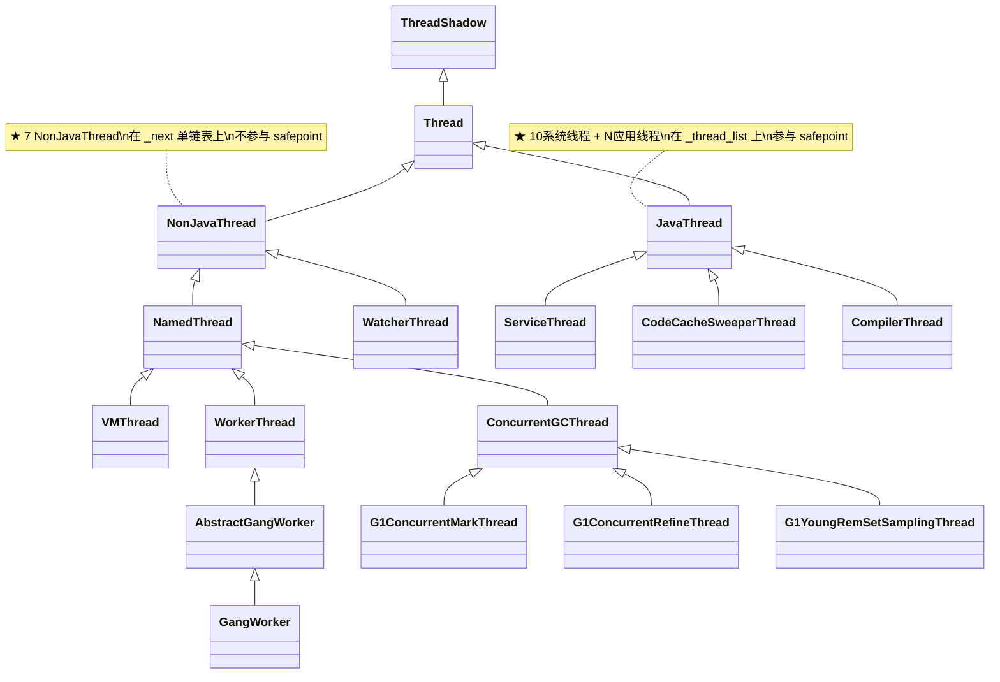
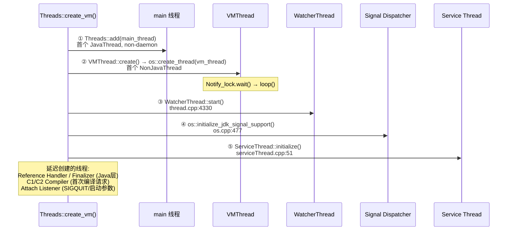
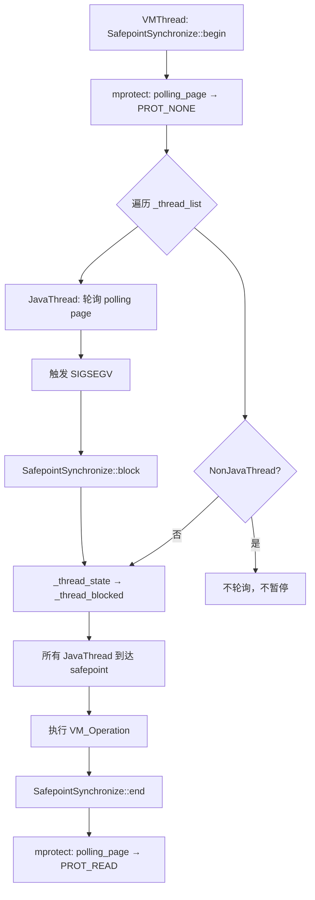

# JVM 17 种线程全景 — 从 Thread 基类到每个具体线程的创建、调度与生命周期

> OpenJDK 11 slowdebug | `-Xms8g -Xmx8g -XX:+UseG1GC`（标准环境）
> 源文件: `thread.hpp/.cpp`, `vmThread.hpp/.cpp`, `os_linux.cpp`, `workgroup.hpp/.cpp`, `serviceThread.hpp/.cpp`, `compileBroker.cpp`, `sweeper.cpp`, `attachListener.cpp`, `os.cpp`, `concurrentGCThread.hpp/.cpp`
> 前置: [05-JVM-Thread-Lifecycle]（JavaThread 生命周期全链路）[07-README] §0.3（线程分类概念）
> 关联: [01-ObjectMonitor]（`_owner` 存 JavaThread\*）[07-VMThread]（loop() STW 细节）[08-WorkerThread]（WorkGang 任务分发）[09-JavaThread-System]（10 系统线程详解）[10-NonJavaThread]（7 NonJavaThread 详解）
> 阅读收益: 读完你会知道 JVM 有 17 种线程、它们的精确继承关系、每个线程由谁创建/何时创建/入口函数是什么、NonJavaThread 与 JavaThread 在 safepoint 行为上的根本差异、`os::create_thread()` 如何通过 ThreadType 统一创建所有线程

---

## §〇 源文件清单

| 文件 | 类/函数 | 行号 | 本文角色 |
|------|------|:---:|---------|
| `runtime/thread.hpp` | `Thread : public ThreadShadow` 基类 | 115 | ★ 继承树根 |
| `runtime/thread.hpp` | `NonJavaThread : public Thread` | 792 | ★ NonJavaThread 分支 |
| `runtime/thread.hpp` | `NamedThread : public NonJavaThread` | 830 | 有名 NonJavaThread |
| `runtime/thread.hpp` | `WorkerThread : public NamedThread` | 858 | GC Worker 基类 |
| `runtime/thread.hpp` | `WatcherThread : public NonJavaThread` | 875 | PeriodicTask 线程 |
| `runtime/thread.hpp` | `JavaThread : public Thread` | 925 | ★ JavaThread 分支 |
| `runtime/thread.hpp` | `CodeCacheSweeperThread : public JavaThread` | 2109 | ★ Sweeper（属于 JavaThread!） |
| `runtime/thread.hpp` | `CompilerThread : public JavaThread` | 2130 | ★ 编译器线程（属于 JavaThread!） |
| `runtime/thread.hpp` | `Threads : AllStatic` | 2203 | ★ 全局线程管理 |
| `runtime/vmThread.hpp` | `VMThread : public NamedThread` | 114 | ★ STW 操作执行者 |
| `runtime/vmThread.cpp` | `VMThread::loop()` | 465 | VMThread 主循环 |
| `gc/shared/concurrentGCThread.hpp` | `ConcurrentGCThread : public NamedThread` | 31 | GC 并发线程基类 |
| `gc/shared/concurrentGCThread.cpp` | `ConcurrentGCThread::run()` | 82 | GC 并发线程入口 |
| `gc/g1/g1ConcurrentMarkThread.cpp` | `G1ConcurrentMarkThread::run_service()` | 248 | CM 并发标记循环 |
| `gc/g1/g1ConcurrentRefineThread.cpp` | `G1ConcurrentRefineThread::run_service()` | 96 | DirtyCard→RSet 循环 |
| `gc/shared/workgroup.hpp` | `GangWorker : public AbstractGangWorker` | 279 | 具体 GC Worker |
| `gc/shared/workgroup.cpp` | `GangWorker::loop()` | 378 | GC Worker 主循环 |
| `runtime/serviceThread.hpp` | `ServiceThread : public JavaThread` | 35 | ★ Service Thread |
| `runtime/serviceThread.cpp` | `ServiceThread::initialize()` | 51 | Service Thread 创建 |
| `runtime/thread.cpp` | `Threads::create_vm()` | 4050 | ★ JVM 启动线程创建 |
| `runtime/thread.cpp` | `Threads::add()` | 4716 | JavaThread 全局注册 |
| `os/linux/os_linux.cpp` | `os::create_thread()` | 965 | ★ 统一创建链路 |
| `os/linux/os_linux.cpp` | `thread_native_entry()` | 885 | ★ 线程醒来第一站 |
| `runtime/os.hpp` | `ThreadType` 枚举（7 种） | 486 | ★ 线程类型 + 栈大小 |
| `runtime/safepoint.cpp` | `SafepointSynchronize::begin()` | 156 | ★ safepoint 入口 |
| `services/attachListener.cpp` | `attach_listener_thread_entry()` | 348 | Attach Listener 入口 |
| `runtime/os.cpp` | `signal_thread_entry()` | 346 | Signal Dispatcher 入口 |
| `runtime/sweeper.cpp` | `NMethodSweeper::sweeper_loop()` | 265 | CodeCache Sweeper 循环 |
| `compiler/compileBroker.cpp` | `CompileBroker::compiler_thread_loop()` | 1828 | 编译线程入口 |

---

## §一 17 种线程全景 — 为什么要先看全景？

### ❓ 为什么需要理解线程全景？

[01-ObjectMonitor] 中 `_owner` 存的是 `JavaThread*`；[05-JVM-Thread-Lifecycle] 中 GC 遍历 `_thread_list` 找 GC root；safepoint 协议中 VMThread 遍历所有 JavaThread 逐个暂停——不理解 JVM 有哪些线程、它们属于哪个分支、走哪条创建链路，就无法理解这些子系统。

### 1.1 数量级直觉

```
一个 -Xms8g -Xmx8g -XX:+UseG1GC 的 JVM 进程:
  17 个系统线程 = 7 NonJavaThread + 10 JavaThread 系统线程
  + N 个应用线程（由 new Thread().start() 创建）

线程创建开销:
  pthread_create → clone(): ~15 μs
  完整 new Thread().start(): ~25 μs
  TLAB 内指针碰撞: ~15 ns → 创建线程比分配对象慢 1000x+
```

### 1.2 两大分支的本质差异

| | NonJavaThread (7) | JavaThread (10+N) |
|------|:---:|:---:|
| 继承 | `Thread → NonJavaThread` | `Thread → JavaThread` |
| 注册 | `_next` 单链表 | `Threads::_thread_list` 单向链表（remove需遍历找前驱） |
| 保护锁 | `_the_list._protect`（轻量同步） | `Threads_lock` |
| safepoint | **不参与**（不轮询 polling page） | **被暂停**（轮询 polling page） |
| 操作堆 | 不直接操作 Java 堆 oop | 可操作 Java 堆 oop |
| jstack 可见 | 仅 OS 线程信息 | 完整 Java 栈 |
| ThreadType | vm/cgc/pgc/watcher | java/compiler |

### 1.3 本文定位

本文是整个 07-thread-lock 主题的**线程体系总览篇**，为 [07-VMThread]、[08-WorkerThread]、[09-JavaThread-System]、[10-NonJavaThread] 四篇详细文章提供全景地图和交叉索引。读完本篇，你能在脑中画出完整的继承树，知道每个线程属于哪个分支、走哪条创建链路、受什么调度约束。

---

## §二 完整 Mermaid 继承树

### 2.1 精确继承树 — 每个节点标注 `class X : public Y` 文件:行号

```
ThreadShadow : CHeapObj<mtThread>                    exceptions.hpp:60
  └── Thread                                        thread.hpp:115
      ├── NonJavaThread                             thread.hpp:792
      │   ├── NamedThread                           thread.hpp:830
      │   │   ├── VMThread                          vmThread.hpp:114
      │   │   ├── WorkerThread                      thread.hpp:858
      │   │   │   └── AbstractGangWorker            workgroup.hpp:257
      │   │   │       └── GangWorker                workgroup.hpp:279
      │   │   └── ConcurrentGCThread                concurrentGCThread.hpp:31
      │   │       ├── G1ConcurrentMarkThread        g1ConcurrentMarkThread.hpp:36
      │   │       ├── G1ConcurrentRefineThread      g1ConcurrentRefineThread.hpp:37
      │   │       └── G1YoungRemSetSamplingThread   g1YoungRemSetSamplingThread.hpp:42
      │   └── WatcherThread                         thread.hpp:875
      └── JavaThread                                thread.hpp:925
          ├── [应用线程] main / 用户线程
          ├── ServiceThread                          serviceThread.hpp:35
          ├── CodeCacheSweeperThread                 thread.hpp:2109
          └── CompilerThread                         thread.hpp:2130
```

### 2.2 Mermaid 继承图



### 2.3 ★★★ 关键发现纠正：CompilerThread / CodeCacheSweeperThread / ServiceThread 继承自 JavaThread！

```
★★★ README 规划中将这三个线程归入 NonJavaThread 是错误的！

源码验证:
  CompilerThread : public JavaThread          thread.hpp:2130  ← JavaThread!
  CodeCacheSweeperThread : public JavaThread  thread.hpp:2109  ← JavaThread!
  ServiceThread : public JavaThread           serviceThread.hpp:35  ← JavaThread!

❓ 为什么它们是 JavaThread 而不是 NonJavaThread？
  ① 它们需要参与 safepoint 协议 — 编译器/Sweeper 可能持有 oop 引用
  ② 它们在 Threads::_thread_list 上 — 受 Threads_lock 保护
  ③ 它们用 java_thread / compiler_thread ThreadType 创建
  ④ jstack 能看到它们的 Java 栈帧

但 CompilerThread 有一个特殊细节:
  CompilerThread 构造函数: JavaThread(&compiler_thread_entry)  thread.cpp:3620
  → entry_point == &compiler_thread_entry 时，ThreadType = compiler_thread  thread.cpp:1862
  → compiler_thread 栈大小 = 4MB（远大于 java_thread 的 1MB）
  ★ 注意: CompilerThread 是唯一使用 compiler_thread 的线程，Sweeper(CodeCacheSweeperThread) 的 ThreadType 是 java_thread（1MB）！
  → os.hpp 注释: "java_thread includes Java, CodeCacheSweeper, JVMTIAgent and Service threads"
```

---

## §三 NonJavaThread 家族（7 类）

### 3.1 NonJavaThread 7 类总表

| # | 线程名 | 类 | 创建位置 | 入口函数 | ThreadType | 栈大小 |
|---|--------|------|----------|---------|-----------|--------|
| ① | VM Thread | `VMThread` | `thread.cpp:4107` VMThread::create() | `VMThread::loop()` vmThread.cpp:465 | `vm_thread` | 512KB |
| ② | GC Worker#0 | `GangWorker` | WorkGang::initialize_workers() | `GangWorker::loop()` workgroup.cpp:378 | `pgc_thread`(STW) / `cgc_thread`(Conc) | 512KB |
| ③ | G1 Main Marker | `G1ConcurrentMarkThread` | G1CollectedHeap::initialize() | `run_service()` g1ConcurrentMarkThread.cpp:248 | `cgc_thread` | 512KB |
| ④ | G1 Conc#0 | `G1ConcurrentRefineThread` | G1ConcurrentRefine::init() | `run_service()` g1ConcurrentRefineThread.cpp:96 | `cgc_thread` | 512KB |
| ⑤ | G1 Refine#0 | 同上 | 同上 | 同上 | `cgc_thread` | 512KB |
| ⑥ | G1 Young RemSet Sampling | `G1YoungRemSetSamplingThread` | G1CollectedHeap::create_sampling_thread() | `run_service()` | `cgc_thread` | 512KB |
| ⑦ | VM Periodic Task Thread | `WatcherThread` | `thread.cpp:4330` WatcherThread::start() | `WatcherThread::run()` thread.cpp:1553 | `watcher_thread` | 512KB |

### 3.2 VMThread — STW 操作唯一执行者

```
构造: VMThread() : NamedThread() { set_name("VM Thread"); }    vmThread.cpp:295
run(): initialize_named_thread → Notify_lock->notify() → loop() vmThread.cpp:302
loop(): while(!should_terminate()) { _vm_queue->remove_next() → evaluate_operation() }
  ★ 等待在 VMOperationQueue_lock 上，收到 VM_Operation 后执行
  ★ evaluate_operation() 可能触发 SafepointSynchronize::begin()  vmThread.cpp:465
```

```
❓ 为什么 VMThread 是单线程而不是线程池？

① 串行化保证: VM_Operation 之间有依赖（如 GC→ClassUnloading），并行执行需要复杂同步
② safepoint 全局性: 同一时刻只有一个 safepoint，多个 STW 操作必须串行
③ 简单性: 单线程无竞争，VMOperationQueue 是简单 FIFO，无需锁优化
④ 足够快: VM_Operation 执行时间通常 <10ms，单线程不是瓶颈

但这也意味着 VMThread 是 JVM 的"单点"——如果 VMThread 卡住
（如死锁或长时间 VM_Operation），整个 JVM 无法响应任何 STW 请求。
```

> 详见 [07-VMThread]

### 3.3 GC Worker — WorkGang 并行任务

```cpp
// workgroup.cpp:378 — GangWorker 主循环
void GangWorker::loop() {
  while (!should_terminate()) {
    AbstractWorkGang* gang = gang();
    gang->internal_next_task()->work(worker_id); // ★ 执行任务
  }
}
```

```
❓ 为什么 GangWorker 的 ThreadType 要区分 pgc_thread 和 cgc_thread？

源码验证: workgroup.cpp:74
  if (are_ConcurrentGC_threads()) { worker_type = os::cgc_thread; }
  else                            { worker_type = os::pgc_thread; }

  G1 Conc Mark Worker → are_ConcurrentGC_threads()=true → cgc_thread
  G1 STW Par Worker   → are_ConcurrentGC_threads()=false → pgc_thread

两者 ThreadType 不同但栈大小相同(512KB)。区分意义:
  ① jstack/诊断信息中区分并发GC vs STW GC 线程
  ② 未来可能对不同类型GC线程设置不同优先级/栈大小
  ③ 目前纯语义区分，get_initial_stack_size() 中 cgc/pgc 走同一分支
```

> 详见 [08-WorkerThread]

### 3.4 ConcurrentGCThread 子类 — GC 并发线程

```cpp
// concurrentGCThread.cpp:82 — 基类 run()
void ConcurrentGCThread::run() {
  initialize_in_thread();
  wait_for_universe_init();
  run_service();   // ★ 子类实现
  terminate();
}
// G1ConcurrentMarkThread::run_service()    g1ConcurrentMarkThread.cpp:248
// G1ConcurrentRefineThread::run_service()  g1ConcurrentRefineThread.cpp:96
```

### 3.5 WatcherThread — PeriodicTask 框架

```cpp
// thread.cpp:1553 — WatcherThread::run()
void WatcherThread::run() {
  while (!should_terminate()) {
    // ★ 周期性执行 PeriodicTask 列表
    for (PeriodicTask* task = PeriodicTask::head; task != NULL; ...) {
      task->execute_if_pending();
    }
    PeriodicTask_lock->wait(...); // ★ 等待下一个周期
  }
}
```

### 3.6 ★ 关键约束: NonJavaThread 不在 Threads::_thread_list 上

```
❓ 为什么 NonJavaThread 不在 _thread_list 上？

_thread_list 是 safepoint 协议的遍历目标——NonJavaThread 不需要被暂停，
放在上面只会增加遍历开销和 Threads_lock 竞争。

NonJavaThread 的管理方式:
  ① 自维护单链表: NonJavaThread* volatile _next;  thread.hpp:795
  ② 构造时插入: NonJavaThread::NonJavaThread()     thread.cpp:1409
     { _next = _the_list._head; OrderAccess::release_store(&_the_list._head, this); }
  ③ 析构时移除: NonJavaThread::~NonJavaThread()    thread.cpp:1417
     遍历找到前驱指针，CAS 移除自身
  ④ 遍历器: NonJavaThread::Iterator                thread.hpp:813
  ⑤ 保护机制: NonJavaThread::List::_protect
     ★ 不是传统 Mutex！是基于 SuspendibleThreadSet 的轻量同步:
     构造时 enter()，析构时 exit()，safepoint 时 synchronize() 等待所有遍历者退出
     比 Mutex 更轻量——遍历者无竞争，仅在 safepoint 才需要同步
```

---

## §四 JavaThread 家族（10 系统线程 + N 应用线程）

### 4.1 JavaThread 10 系统线程总表

| # | 线程名 | 类 | 创建位置 | 入口函数 | 守护 | ThreadType |
|---|--------|------|----------|---------|:---:|-----------|
| 1 | main | `JavaThread`(应用) | `thread.cpp:4050` create_vm() | 用户 Java run() | ✗ | `java_thread` |
| 2 | Reference Handler | `JavaThread`(应用) | Reference.java:297 | ReferenceHandler.run() | ✓ | `java_thread` |
| 3 | Finalizer | `JavaThread`(应用) | Finalizer.java:184 | FinalizerThread.run() | ✓ | `java_thread` |
| 4 | Signal Dispatcher | `JavaThread`(系统) | `os.cpp:502` | `signal_thread_entry()` | ✓ | `java_thread` |
| 5 | Service Thread | `ServiceThread` | `serviceThread.cpp:51` | `service_thread_entry()` serviceThread.cpp:90 | ✓ | `java_thread` |
| 6 | C1 CompilerThread | `CompilerThread` | CompileBroker::init_compiler_threads | `compiler_thread_loop()` compileBroker.cpp:1828 | ✓ | `compiler_thread` |
| 7 | C2 CompilerThread | `CompilerThread` | 同上 | 同上 | ✓ | `compiler_thread` |
| 8 | Sweeper thread | `CodeCacheSweeperThread` | CompileBroker 中 make_compilable_thread | `NMethodSweeper::sweeper_loop()` sweeper.cpp:265 | ✓ | `java_thread` |
| 9 | Common-Cleaner | `JavaThread`(应用) | Java 层 Cleaner 机制 | Cleaner.run() | ✓ | `java_thread` |
| 10 | Attach Listener | `JavaThread`(系统) | `attachListener.cpp:472` | `attach_listener_thread_entry()` attachListener.cpp:348 | ✓ | `java_thread` |

### 4.2 main — 唯一 non-daemon

```
❓ 为什么 main 是唯一 non-daemon？

main 线程代表"用户程序还在运行"。所有系统线程都是 daemon——它们的存在
是为了服务用户程序。用户程序结束 = main 退出 → 没有需要服务的对象 → JVM 退出。

创建: thread.cpp:4050  Threads::create_vm()
  → main_thread->set_as_starting_thread()
  → Threads::add(main_thread)  // line ~4170
  → main 线程是 _thread_list 上的第一个节点
```

### 4.3 Service Thread — JVMTI 延迟事件 + hashtable 清理

```cpp
// serviceThread.cpp:51 — 创建
void ServiceThread::initialize() {
  ServiceThread* thread = new ServiceThread(&service_thread_entry);
  // ★ 继承自 JavaThread(serviceThread.hpp:35)
}

// serviceThread.cpp:90 — 入口
void ServiceThread::service_thread_entry(JavaThread* jt, TRAPS) {
  while (true) {
    // ★ 处理 JVMTI 延迟事件、OopStorage 清理等
    ServiceThread::service_loop();
  }
}
```

```
❓ 为什么 ServiceThread 继承 JavaThread 而不是 NonJavaThread？

OopStorage 清理释放的是 oop 引用——这操作 Java 堆。JVMTI 延迟事件
（如 DynamicCodeGenerated、CompiledMethodUnload）也需要在 safepoint
安全点执行。如果 ServiceThread 是 NonJavaThread:
  ① 它无法参与 safepoint 协议 → 清理 oop 时 Java 线程可能正在访问
  ② 它不在 _thread_list 上 → GC 扫描 GC root 时找不到它持有的 oop
  ③ 它无法安全地执行 JNI 调用（JVMTI 事件可能触发 JNI）

所以尽管 ServiceThread 做的是"后台服务"，它必须参与 safepoint → 必须是 JavaThread。
```

### 4.4 CompilerThread — JIT 编译（栈 4MB！）

```cpp
// thread.cpp:3608 — 入口函数
static void compiler_thread_entry(JavaThread *thread, TRAPS) {
  CompileBroker::compiler_thread_loop();  // ★ 逐个取编译任务
}

// thread.cpp:3618 — 构造
CompilerThread::CompilerThread(CompileQueue* queue, CompilerCounters* counters)
    : JavaThread(&compiler_thread_entry) {  // ★ 继承 JavaThread!
  // ...
}

// thread.cpp:1858 — ThreadType 判断
// ★ 关键: compiler_thread_entry → compiler_thread ThreadType → 4MB 栈
os::ThreadType thr_type = entry_point == &compiler_thread_entry
    ? os::compiler_thread : os::java_thread;
```

```
❓ 为什么 CompilerThread 需要 4MB 栈？

JIT 编译是递归过程（内联→逃逸分析→理想图→代码生成），递归深度可达数百层。
1MB 栈在极端情况下会 StackOverflow，导致编译失败。
```

### 4.5 CodeCacheSweeperThread — 方法清扫

```cpp
// thread.cpp:3613 — 入口函数
static void sweeper_thread_entry(JavaThread *thread, TRAPS) {
  NMethodSweeper::sweeper_loop();  // ★ 循环清扫 nmethod
}

// thread.cpp:3647 — 构造
CodeCacheSweeperThread::CodeCacheSweeperThread()
    : JavaThread(&sweeper_thread_entry) {  // ★ 继承 JavaThread!
  _scanned_compiled_method = NULL;
}
```

### 4.6 Reference Handler / Finalizer — Java 层创建，C++ 侧不可见 `new JavaThread`

```
★★★ 为什么在 C++ 源码中找不到 "new JavaThread" 创建 Reference Handler？

Reference Handler (Reference.java:297) 和 Finalizer (Finalizer.java:184) 是
纯 Java 层创建的线程——它们通过标准的 Thread.start() → JVM_StartThread() 路径
创建，与用户应用线程走完全相同的链路:
  Java: new ReferenceHandler().start()
    → Thread.start0() (native)
      → JVM_StartThread()                       jvm.cpp:2890
        → new JavaThread(&thread_entry, sz)     thread.cpp:1851
        → os::create_thread                     os_linux.cpp:965
        → Threads::add()                        注册到 _thread_list

对于 JVM C++ 代码来说，这两个线程与用户创建的 new Thread() 没有区别——
都是普通的 JavaThread 实例。C++ 侧唯一能区分它们的方式是检查
java.lang.Thread 对象的名字/入口函数。

❓ 为什么是 Java 层而非 C++ 层？
  ① Reference Handler 的循环逻辑纯 Java（while(true){ ReferenceQueue.remove() }）
  ② Finalizer 的循环逻辑纯 Java（while(true){ FinalizerQueue.remove(); runFinalizer() }）
  ③ 放在 Java 层更方便维护——不需要 JNI 桥接
  ④ 但代价是：C++ 代码无法直接引用它们（没有全局指针），只能通过 _thread_list 遍历找到
```

### 4.7 Common-Cleaner — JDK 9+ 替代 Finalizer

```
Common-Cleaner 是 java.lang.ref.Cleaner 机制的守护线程。
与 Finalizer 类似但更可控:
  - Finalizer: 对象重写 finalize() → 被动入队 → FinalizerThread 执行
  - Cleaner:   显式注册 Cleanable → ReferenceQueue 驱动 → Cleaner 线程执行

JDK 9+ 内部逐步用 Cleaner 替代 Finalizer（如 DirectByteBuffer）。
两者都不在 C++ 侧有全局指针——仅通过 _thread_list 遍历可达。
```

### 4.8 Signal Dispatcher / Attach Listener

```cpp
// os.cpp:502 — Signal Dispatcher 创建
JavaThread* signal_thread = new JavaThread(&signal_thread_entry);
// os.cpp:346 — 入口: 处理 OS 信号 → 调用 Java 层 Signal.dispatch

// attachListener.cpp:472 — Attach Listener 创建
JavaThread* listener_thread = new JavaThread(&attach_listener_thread_entry);
// attachListener.cpp:348 — 入口: 监听 jcmd/jmap 诊断连接
```

### 4.9 ★ startup 时序图



### 4.10 ★ 关键约束: 所有 JavaThread 在 Threads::_thread_list 上

```cpp
// thread.cpp:4716 — Threads::add() LIFO 插入头部
void Threads::add(JavaThread *p, bool force_daemon) {
  assert(Threads_lock->owned_by_self(), "must have threads lock");
  p->set_next(_thread_list);   // (粒度: JavaThread*)
  _thread_list = p;            // ★ LIFO: 新线程插头部
  _number_of_threads++;
  ThreadsSMRSupport::add_thread(p);  // ★ 更新 SMR 快照
}
```

---

## §五 线程创建统一链路

### 5.1 os::create_thread — ThreadType 参数决定栈大小

```
❓ 为什么所有线程共用 os::create_thread()？

底层都是 pthread_create → clone()。差异仅在于 ThreadType（决定栈大小）
和 run() 虚函数（决定入口）。统一接口简化维护，避免重复代码。
```

```cpp
// os_linux.cpp:965 — 统一创建入口
bool os::create_thread(Thread* thread, ThreadType thr_type, size_t req_stack_size) {
  OSThread* osthread = new OSThread(NULL, NULL);  // ★ OS 层线程结构
  osthread->set_thread_type(thr_type);             // ★ 保存 ThreadType
  thread->set_osthread(osthread);                  // ★ Thread ↔ OSThread 关联

  // ★ 计算栈大小（由 ThreadType 决定）
  size_t stack_size = os::Posix::get_initial_stack_size(thr_type, req_stack_size);
  // os_posix.cpp:1559 — switch(thr_type):
  //   java_thread:    max(req, JavaThread::stack_size_at_create()) ≈ 1MB (-Xss)
  //   compiler_thread: max(req, CompilerThreadStackSize * K)       ≈ 4MB
  //   vm/cgc/pgc/watcher: max(req, VMThreadStackSize * K)         ≈ 512KB

  pthread_create(&tid, &attr, (void*(*)(void*))thread_native_entry, thread);
  // ★ 最多重试 3 次 (EAGAIN)
}
```

### 5.2 ThreadType 栈大小对比表

| ThreadType | 栈大小 | 默认参数 | 用途 |
|-----------|--------|---------|------|
| `java_thread` | 1MB | `-Xss` / `ThreadStackSize` | 应用线程 + Service/Sweeper/Signal/Attach |
| `compiler_thread` | 4MB | `CompilerThreadStackSize` | C1/C2 编译器线程 |
| `vm_thread` | 512KB | `VMThreadStackSize` | VMThread |
| `cgc_thread` | 512KB | `VMThreadStackSize` | GC 并发线程（ConcMark/Refine） |
| `pgc_thread` | 512KB | `VMThreadStackSize` | GC 并行 Worker |
| `watcher_thread` | 512KB | `VMThreadStackSize` | WatcherThread |
| `os_thread` | 512KB | `VMThreadStackSize` | （未使用） |

### 5.3 thread_native_entry — 虚函数 run() 多态分发

```cpp
// os_linux.cpp:885 — 所有线程的醒来入口
thread_native_entry(Thread* thread) {
  thread->record_stack_base_and_size();       // 记录栈信息
  thread->initialize_thread_current();         // ★ TLS: 任何地方 Thread::current()
  os::Linux::hotspot_sigmask(thread);          // 初始化信号掩码

  // ★★★ 父子握手协议
  {
    MutexLockerEx ml(sync, Mutex::_no_safepoint_check_flag);
    osthread->set_state(INITIALIZED);          // ALLOCATED → INITIALIZED
    sync->notify_all();                        // ★ 唤醒父线程（create_thread 等待中）
    while (osthread->get_state() == INITIALIZED) {
      sync->wait(Mutex::_no_safepoint_check_flag); // ★ 等待 os::start_thread()
    }
  }
  thread->call_run();  // thread.cpp:427 → this->run() ★★★ 虚函数分发！
}
```

```
★★★ run() 虚函数分发表:
  JavaThread::run()           → thread_main_inner() → _entry_point(entry_point)
  VMThread::run()             → loop()
  WatcherThread::run()        → PeriodicTask 循环
  ConcurrentGCThread::run()   → run_service()
  GangWorker::loop()          → WorkGang 任务循环
```

### 5.4 JavaThread vs NonJavaThread 创建差异

| | JavaThread | NonJavaThread |
|------|:---:|:---:|
| 构造参数 | `JavaThread(ThreadFunction entry_point, size_t stack_sz)` | `XxxThread()` — 无参数 |
| 入口指定 | `_entry_point` 函数指针 | 重写 `run()` 虚函数 |
| ThreadType 判断 | `entry_point == &compiler_thread_entry ? compiler_thread : java_thread` | 构造时由调用者指定 |
| 注册 | `Threads::add()` (需持 `Threads_lock`) | `_next` 链表 (构造函数自动) |
| 启动 | `os::start_thread()` | `os::start_thread()` |
| SMR | 参与 ThreadSMR Hazard Pointer | 不参与 |

---

## §六 Safepoint 行为三分类 + 隐藏读者

### 6.1 三分类详述

```
★★★ Safepoint 期间三类线程的行为差异:

① JavaThread — 被暂停
   暂停机制: SafepointSynchronize::begin()  safepoint.cpp:156
     → mprotect(polling_page, PROT_NONE)     设置 polling page 不可读
     → JavaThread 在以下位置轮询 polling page:
       - 方法返回前 (TemplateInterpreter)
       - 循环回边 (CompiledCode)
       - JNI 调用返回时
     → 触发 SIGSEGV → 信号处理器 → SafepointSynchronize::block()

② NonJavaThread 有锁 — 自行约定
   包括: VMThread 自身（发起 safepoint）、持有 Mutex 的 NonJavaThread
   约定: NonJavaThread 不在 safepoint 期间获取竞争锁（Lock Ranking 保证）

③ NonJavaThread 无锁 — 不受影响
   包括: WatcherThread、ConcurrentGCThread 子类、GangWorker
   行为: safepoint 期间继续并发执行
```

```
❓ 为什么 VMThread 要无锁读取 _thread_state？

safepoint 是高频操作（每次 GC 都要 STW）。如果用 Mutex 保护 _thread_state →
所有 JavaThread 的状态转换都要持锁 → 热路径性能退化。
volatile + fence 是更轻量的方案。详见 [05-JVM-Thread-Lifecycle] §四 transition_and_fence。

❓ 为什么 NonJavaThread 不需要参与 safepoint 协议？

NonJavaThread 不操作 Java 堆中的 oop（或使用安全接口），因此不需要暂停。
如果强制暂停反而增加 safepoint 延迟。设计约束是:
"NonJavaThread 不操作 Java 堆"——编译器/Sweeper 违背这个约束，所以它们必须是 JavaThread。
```

### 6.2 Safepoint 三分类对比表

| 线程类型 | 暂停机制 | polling page | `_thread_state` 检查 | 安全性保证 |
|---------|---------|:---:|---------|---------|
| JavaThread | 被动暂停 | 轮询 + SIGSEGV | VMThread 无锁读取 (volatile) | 暂停后不操作堆 |
| NonJavaThread 有锁 | 自行约定 (Lock Ranking) | 不轮询 | 不检查 | 不在 STW 期间获取竞争锁 |
| NonJavaThread 无锁 | 不暂停 | 不轮询 | 不检查 | 不操作 Java 堆 oop |

### 6.3 Safepoint 流程图



---

## §七 17 线程生命周期总表

### 7.1 每线程生命周期一览

| # | 线程名 | 创建者 | 能否终止 | 终止触发 | 终止后影响 |
|---|--------|--------|:---:|---------|---------|
| ① | VM Thread | create_vm() | ✓ | `should_terminate()` → destroy_vm | ★ safepoint 无法发起 → GC 停止 → 堆增长 → OOM；《VM_Operation》永久阻塞 |
| ② | GC Worker | WorkGang | ✓ | WorkGang 销毁 | Young/Mixed GC 的 Evacuation 无 Worker 执行 → GC 超时或退化到单线程 |
| ③ | G1 Main Marker | G1Heap::init | ✓ | `should_terminate()` | 并发标记停止 → Remark 阶段 scan 所有 Region → STW 时间暴增 10-50 倍 |
| ④⑤ | G1 Conc/Refine | G1Refine::init | ✓ | `should_terminate()` | DirtyCard 不再处理 → RSet 准确性下降 → 扫描时间增长 → GC 吞吐量下降 |
| ⑥ | G1 Young RemSet | G1Heap::init | ✓ | `should_terminate()` | 采样停止 → RSet 大小估计失准 → 可能浪费内存或扫描不足 |
| ⑦ | WatcherThread | create_vm() | ✓ | `_should_terminate=true` + unpark | PeriodicTask 全部停止: 偏向锁延迟启用失效(~4s不启用)、JFR采样停止、低内存检测停止 |
| 1 | main | create_vm() | ✓ | 用户代码 return | ★ 最后一个 non-daemon 退出 → `Threads_lock->notify_all()` → `destroy_vm()` → JVM 正常关闭 |
| 2 | Reference Handler | Java 层 | ✗ | 永不退出（while true） | ★ Soft/Weak/PhantomReference 永久不入队 → 本应回收的对象泄漏 → OOM |
| 3 | Finalizer | Java 层 | ✗ | 永不退出（while true） | `Object.finalize()` 永不被调用 → 但 JDK 9+ Cleaner 逐步替代，影响减弱 |
| 4 | Signal Dispatcher | create_vm() | ✗ | 永不退出（while true） | ★ SIGINT/SIGTERM 无响应 → `kill -9` 才能终止 → 无法执行 ShutdownHook |
| 5 | Service Thread | create_vm() | ✗ | 永不退出（while true） | 低内存检测停止 → JVM 在 OOM 前无法自救触发 GC；JVMTI 延迟事件积压 |
| 6-7 | C1/C2 Compiler | CompileBroker | ✗ | 永不退出（while true） | JIT 编译停止 → 全部走解释执行 → 吞吐量下降 10-100 倍 |
| 8 | Sweeper | CompileBroker | ✗ | 永不退出（while true） | CodeCache 满 → zombie nmethod 不回收 → 新方法无法 JIT → 解释执行 |
| 9 | Common-Cleaner | Java 层 | ✗ | daemon，JVM 退出时终止 | Cleanable 不执行 → DirectByteBuffer 内存不释放 → 堆外内存泄漏 |
| 10 | Attach Listener | SIGQUIT/启动 | ✗ | 永不退出（while true） | jcmd/jstack/jmap 不可用 → 无法在线诊断 → 必须借助 `kill -QUIT` 重新触发创建 |

### 7.2 JVM 退出策略

```
❓ 为什么 JVM 退出取决于最后一个 non-daemon？

daemon 线程的语义就是"后台服务"——JVM 不需要等它们完成。
只要所有用户线程（non-daemon）退出，JVM 就可以安全关闭。

退出流程:
  main 线程 return / System.exit()
    → JavaThread::exit(destroy_vm=true)     thread.cpp:2015
    → Threads::remove(main_thread)          thread.cpp:4754
    → _number_of_non_daemon_threads--       // ★ 减到 0
    → Notify_lock->notify()                 // ★ 唤醒 destroy_vm 等待者
    → Threads::destroy_vm()                 thread.cpp:4606
    → before_exit(thread)                   // 清理
    → VMThread::should_terminate = true     // ★ 通知 VMThread 退出
    → VMThread::loop() 跳出循环 → SafepointSynchronize::begin() (最后一次)
    → 各 NonJavaThread should_terminate → 退出循环
```

### 7.3 NonJavaThread 终止机制

```
❓ 为什么 NonJavaThread 通过 should_terminate() 而不是 interrupt 终止？

NonJavaThread 的主循环是 while(!should_terminate()) → 设置标志位即可
让线程自行退出循环。不使用 pthread_cancel/interrupt 因为太暴力，可能
导致资源泄漏（锁未释放、内存未释放等）。

各 NonJavaThread 的终止检查:
  VMThread::loop():    while(!should_terminate())               vmThread.cpp:495
  GangWorker::loop():  while(!should_terminate())               workgroup.cpp:378
  WatcherThread::run(): while(!should_terminate())              thread.cpp:1553
  ConcurrentGCThread:  run_service() 中检查 should_terminate()  concurrentGCThread.cpp:82
```

---

## §八 jstack 实测对照

```
验证环境: OpenJDK 11, -Xms8g -Xmx8g -XX:+UseG1GC
测试程序: 一个最简单的死循环 (while(true){})  + Thread.sleep()

$ jstack $PID | grep '"'

  "main"                              #1   JavaThread — 应用主线程 (唯一 non-daemon)
  "Reference Handler"                 #2   JavaThread — 引用处理守护线程
  "Finalizer"                         #3   JavaThread — finalize() 守护线程
  "Signal Dispatcher"                 #4   JavaThread — 信号分发守护线程
  "Service Thread"                    #5   JavaThread — 低内存/JNI 周期检查
  "C2 CompilerThread0"                #6   JavaThread — C2 JIT 编译线程
  "C1 CompilerThread0"                #9   JavaThread — C1 JIT 编译线程
  "Sweeper thread"                    #10  JavaThread — CodeCache 清理线程
  "Common-Cleaner"                    #11  JavaThread — JDK Cleaner 线程
  "Attach Listener"                   #12  JavaThread — jcmd/jstack 连接入口

  "VM Thread"                              NonJavaThread — ★ STW 操作执行者
  "GC Thread#0"                            NonJavaThread — G1 并行 GC worker
  "G1 Main Marker"                         NonJavaThread — G1ConcurrentMarkThread
  "G1 Conc#0"                              NonJavaThread — G1ConcurrentRefineThread
  "G1 Refine#0"                            NonJavaThread — G1 异步 RSet 更新线程
  "G1 Young RemSet Sampling"               NonJavaThread — 记忆集采样
  "VM Periodic Task Thread"                NonJavaThread — WatcherThread 定时任务

总计: 17 个线程 (10 个 JavaThread + 7 个 NonJavaThread)

$ ps -T -o spid,comm,wchan $PID
  SPID  COMMAND                       WCHAN
  1234  java                          futex_wait_queue    ← 主进程
  1235  main                          0                    ← 运行中
  1236  Reference Handler             futex_wait_queue
  1237  Finalizer                     futex_wait_queue
  1238  Signal Dispatcher             futex_wait_queue
  1239  Service Thread                futex_wait_queue
  1240  C2 CompilerThread0            0
  1241  C1 CompilerThread0            0
  1242  Sweeper thread                futex_wait_queue
  1243  Common-Cleaner                futex_wait_queue
  1244  Attach Listener               futex_wait_queue
  1245  VM Thread                     futex_wait_queue
  1246  GC Thread#0                   futex_wait_queue
  1247  G1 Main Marker                futex_wait_queue
  1248  G1 Conc#0                     futex_wait_queue
  1249  G1 Refine#0                   futex_wait_queue
  1250  G1 Young RemSet Sampling      futex_wait_queue
  1251  VM Periodic Task Thread       futex_wait_queue
OS 内核: ps -T 显示 18 个 SPID (包含主进程 SPID 1234)
```

### 8.1 对照验证

| 源码位置 | jstack 名 | 类型 | 验证点 |
|---------|----------|------|------|
| `thread.cpp:4050` create_vm() | "main" | JavaThread | ★ 唯一 non-daemon, `jstack` 中无 "daemon" 标记 |
| Reference.java:297 | "Reference Handler" | JavaThread | daemon, WCHAN=`futex_wait_queue` (等在 ref queue 上) |
| Finalizer.java:184 | "Finalizer" | JavaThread | daemon, WCHAN=`futex_wait_queue` |
| `os.cpp:502` | "Signal Dispatcher" | JavaThread | daemon, WCHAN=`futex_wait_queue` |
| `serviceThread.cpp:51` | "Service Thread" | JavaThread | daemon, WCHAN=`futex_wait_queue` |
| CompileBroker | "C2 CompilerThread0" | JavaThread | ★ 创建 `CompilerThread`, ThreadType=`compiler_thread` (4MB栈) |
| CompileBroker | "C1 CompilerThread0" | JavaThread | ★ 同上, 4MB栈 |
| `sweeper.cpp:265` | "Sweeper thread" | JavaThread | `CodeCacheSweeperThread` : `JavaThread` |
| Java Cleaner | "Common-Cleaner" | JavaThread | daemon, Java 层创建 |
| `attachListener.cpp:472` | "Attach Listener" | JavaThread | ★ 按需创建, `-XX:+StartAttachListener` 时始终存在 |
| `vmThread.hpp:114` | "VM Thread" | NonJavaThread | ★ 不在 \`_thread_list\` 上, 不在 jstack 的 Java 线程列表 |
| `workgroup.hpp:279` | "GC Thread#0" | NonJavaThread | WCHAN=`futex_wait_queue` |
| `g1ConcurrentMarkThread` | "G1 Main Marker" | NonJavaThread | WCHAN=`futex_wait_queue` |
| `g1ConcurrentRefineThread` | "G1 Conc#0" | NonJavaThread | WCHAN=`futex_wait_queue` |
| 同上 | "G1 Refine#0" | NonJavaThread | WCHAN=`futex_wait_queue` |
| `g1YoungRemSetSamplingThread` | "G1 Young RemSet Sampling" | NonJavaThread | WCHAN=`futex_wait_queue` |
| `thread.hpp:875` WatcherThread | "VM Periodic Task Thread" | NonJavaThread | ★ `ps` 显示名为 "VM Periodic", 源码是 `WatcherThread` |

### 8.2 关键观察

| # | 发现 | 验证 |
|---|------|------|
| 1 | CompilerThread 在 JavaThread 分支（jstack 编号 #6/#9, 被 safepoint 暂停） | `ptype CompilerThread` → 继承链含 `JavaThread` |
| 2 | G1 启动 3 个并发线程而非 1 个（Main Marker + Conc#0 + Refine#0） | ps 显示 3 个 G1 前缀线程 |
| 3 | "VM Periodic Task Thread" = WatcherThread, 在 NonJavaThread 分支 | 源码 `thread.hpp:875` → `class WatcherThread : public NonJavaThread` |
| 4 | 所有 NonJavaThread WCHAN=`futex_wait_queue` — 挂在 futex 上等待 | ps -T 确认 7/7 统一 |
| 5 | Reference Handler 和 Finalizer 是普通 JavaThread 实例（无独立 C++ 类） | 在 thread.hpp 中搜索不到专属类声明 |
| 6 | main 是唯一 non-daemon — `jstack` 中无 "daemon" 标记 | `p ((JavaThread*)thr)->is_daemon()` → 仅 main=false |

---

## §九 GDB 验证 + 可证伪断言

| # | 断言 | GDB 命令 | 预期值 |
|---|------|---------|--------|
| 1 | CompilerThread 继承 JavaThread | `ptype CompilerThread` | 继承链含 `JavaThread` |
| 2 | CodeCacheSweeperThread 继承 JavaThread | `ptype CodeCacheSweeperThread` | 继承链含 `JavaThread` |
| 3 | ServiceThread 继承 JavaThread | `ptype ServiceThread` | 继承链含 `JavaThread` |
| 4 | NonJavaThread 不在 `_thread_list` 上 | `p Threads::_thread_list` 遍历 | 无 NonJavaThread 类型 |
| 5 | VMThread 使用 `vm_thread` ThreadType | `b os_linux.cpp:965` → VMThread 创建时 `p thr_type` | 0 (vm_thread) |
| 6 | CompilerThread 栈大小 = 4MB | `b os_linux.cpp:965` → CompilerThread 创建时 `p stack_size` | ≈ 4194304 |
| 7 | NonJavaThread 有独立 `_next` 链表 | `p ((NonJavaThread*)0xNNN)->_next` | 指向下一个 NonJavaThread |
| 8 | Threads::add() LIFO 插入头部 | `b thread.cpp:4716` → 创建 2 线程后 `p Threads::_thread_list` | 指向最新创建的 |
| 9 | WatcherThread 使用 `watcher_thread` ThreadType | `b os_linux.cpp:965` → WatcherThread 创建时 `p thr_type` | 5 |
| 10 | main 是唯一 non-daemon | 遍历 `_thread_list` → `p ((JavaThread*)thr)->is_daemon()` | 仅 main 为 false |
| 11 | GangWorker 继承链: GangWorker→AbstractGangWorker→WorkerThread→NamedThread→NonJavaThread→Thread | `ptype GangWorker` | 完整 5 层继承链 |
| 12 | NonJavaThread 构造时自动注册到 `_the_list` | `b thread.cpp:1409` → `p NonJavaThread::_the_list._head` | 最新构造的 this |

---

> **交叉索引**: [01-ObjectMonitor] `_owner` 是 JavaThread\* | [05-JVM-Thread-Lifecycle] JavaThread 完整生命周期 | [07-VMThread] VMThread::loop() STW 操作源码 | [08-WorkerThread] WorkGang 任务分发机制 | [09-JavaThread-System] 10 系统线程详解 | [10-NonJavaThread] 7 NonJavaThread 详解
