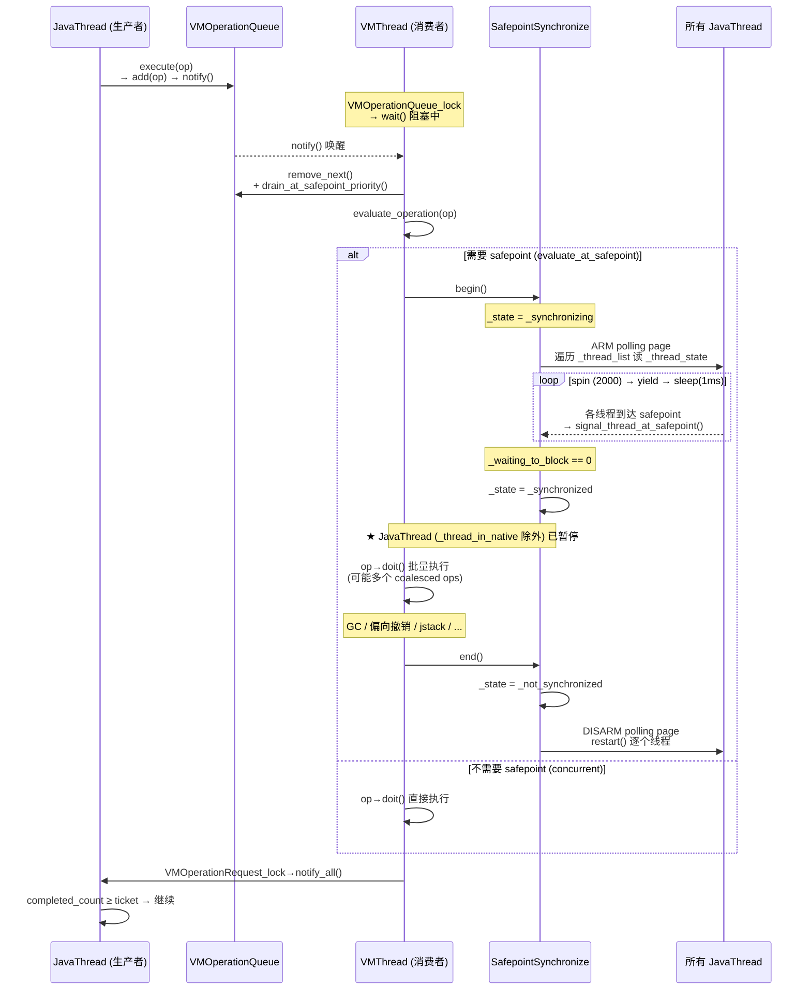
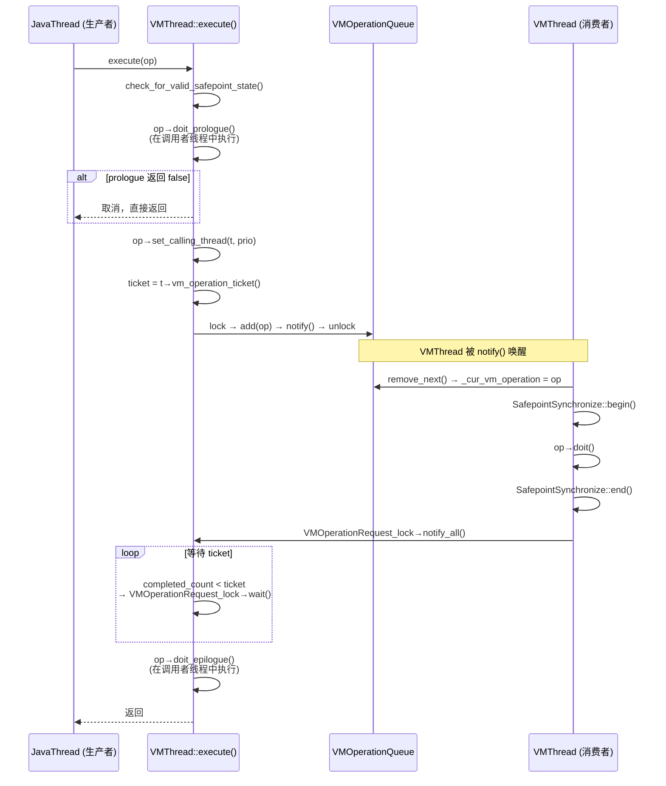
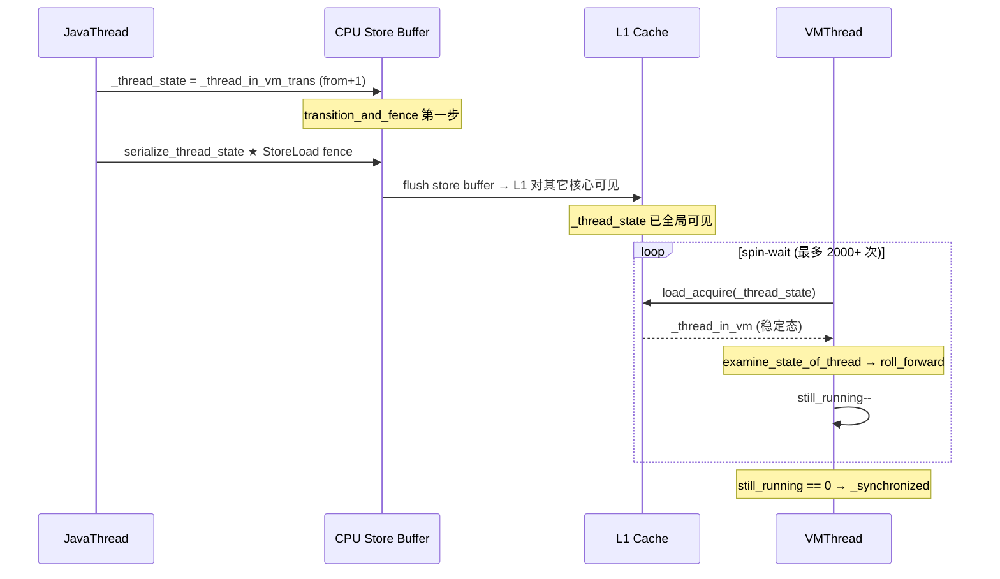

# 07-JVM-VMThread — JVM 的"单线程大脑"：为什么所有 STW 操作必须串行执行？

> **标准环境**：OpenJDK 11 slowdebug, `-Xms8g -Xmx8g -XX:+UseG1GC` (Region=4MB, 2048个), 64-bit Linux x86  
> **源文件**：`vmThread.hpp/cpp` | `vmOperations.hpp/cpp` | `safepoint.hpp/cpp` | `thread.hpp` | `interfaceSupport.inline.hpp`  
> **前置阅读**：[05-JVM-Thread-Architecture]（17 线程全景 + safepoint 三类行为）、[06-JVM-Thread-Lifecycle]（JavaThread 三套状态系统 + `transition_and_fence` 完整分析）  
> **后文关联**：[08-JVM-WorkerThread]（GC 并行 worker）| [10-JVM-NonJavaThread]（其他 NonJavaThread）| [11-JVM-Internal-Locks]（Lock Ranking 死锁预防）  
> **阅读收益**：理解为什么单线程设计在 JVM 中反而是最优解；掌握 safepoint 协议从"发起"到"唤醒"的完整链路；彻底理解 `volatile + StoreLoad fence + spin-wait` 三种原语如何替代 Mutex 实现热路径零锁通信  
> **阅读时间**：45-60 分钟

---

## §〇 源文件清单

本文跨 **vmThread / vmOperations / safepoint** 三个模块，是 [05] 全景区分 JavaThread 与 NonJavaThread 之后的首篇 NonJavaThread 深度走读。

| # | 文件 | 核心类/函数 | 本文角色 | 关键行号 |
|---|------|------------|---------|---------|
| 1 | `runtime/vmThread.hpp` | `VMThread` + `VMOperationQueue` + `VMOperationTimeoutTask` | ★ 类定义 + 两级优先队列 + 超时检测 | 全文件 189 行 |
| 2 | `runtime/vmThread.cpp` | `loop()` / `execute()` / `evaluate_operation()` / `create()` | ★ 核心实现 — 心跳循环 + 生产者入口 | loop():465, execute():686, create():250 |
| 3 | `runtime/vmOperations.hpp` | `VM_Operation` + `VM_OPS_DO` 宏（73 子类） | ★ 多态体系 — 4 种 Mode + doit() 纯虚函数 | VM_Operation:134, Mode:136, VM_OPS_DO:48 |
| 4 | `runtime/vmOperations.cpp` | `add()` / `remove_next()` | ★ 队列操作 — 10:1 防饥饿调度 | add():156, remove_next():176 |
| 5 | `runtime/safepoint.hpp` | `SafepointSynchronize` + `SynchronizeState` + `ThreadSafepointState` | ★ safepoint 协议声明 — 三态枚举 | _state:61, ThreadSafepointState:228 |
| 6 | `runtime/safepoint.cpp` | `begin()` / `end()` / `block()` | ★ safepoint 完整实现 — 自旋 + 等待 + 清理 | begin():156, end():527, block():859 |
| 7 | `runtime/thread.hpp` | `JavaThread::_thread_state` (`volatile jint`) + `JavaThreadState` 枚举 | ★ VMThread 的无锁读取目标 | _thread_state:1011, 枚举:890 |
| 8 | `runtime/interfaceSupport.inline.hpp` | `transition_and_fence()` | ★ 写入侧的 StoreLoad fence — 对 VMThread 可见性保证 | :136 |
| 9 | `runtime/mutexLocker.cpp` | `VMOperationQueue_lock` / `VMOperationRequest_lock` | ★ VMThread 阻塞唤醒所依赖的 Monitor | :282-283 |
| 10 | `gc/shared/vmGCOperations.hpp` | `VM_GC_Operation` / `VM_CGC_Operation` | ★ GC 操作基类 — `doit_prologue`/`doit_epilogue` 分离 | VM_GC_Operation:71 |
| 11 | `gc/g1/vm_operations_g1.hpp` | `VM_G1CollectForAllocation` / `VM_G1CollectFull` | ★ G1 GC 操作 — 分配失败触发 | :50, :37 |
| 12 | `utilities/globalDefinitions.hpp` | `enum JavaThreadState`（12 种状态） | ★ safepoint 安全与否的判断依据 | :890 |

---

## §一 为什么 JVM 需要 VMThread？— 设计动机

### ❓ 问题 1：为什么不让发起 GC 的 JavaThread 自己执行 STW 操作？

这是最自然的设计直觉——谁需要 GC，谁就去做。但这个想法存在一个**自相矛盾**的致命缺陷：

```
假设 JavaThread T1 分配对象时发现堆满了，需要 GC：
  Step 1: T1 需要暂停 T2, T3, ..., Tn → 调用 SafepointSynchronize::begin()
  Step 2: begin() 遍历 Threads::_thread_list，检查每个线程是否到达 safepoint
  Step 3: 但 T1 自己也在 _thread_list 中！
  Step 4: T1 的 _thread_state 是什么？
    - 如果 T1 正在等待 T2 到达 → _thread_in_vm → safepoint 认为 T1 "应该在 VM 中阻塞"
    - 但 T1 同时在执行等待循环 → 悖论：T1 同时是"等待者"和"被等待者"
  Step 5: 死胡同 → begin() 永远等不到"所有线程就绪"
```

这个悖论的本质是：**"发起者"不能同时是"被暂停者"**。和操作系统原理中"调度器不能把自己调度出去"是同一类问题——需要一个**外部代理**。

**解决方案**：引入一个不受 safepoint 影响的专用线程——VMThread。它是 NonJavaThread，不在 `Threads::_thread_list` 上，safepoint 遍历时完全看不到它。

**概念映射（CS 原理）**：这是**控制器与受控对象分离**（Controller/Controlled Separation）模式：
- **CPU 中断控制器**：被中断的执行流 ≠ 中断处理执行流。硬件调度 ISR 执行
- **Kubernetes Controller Manager**：控制 Pod 的生命周期，但自身不被 Pod 调度算法影响
- **JVM VMThread**：控制所有 JavaThread 的暂停与恢复，但自身不被暂停

### ❓ 问题 2：为什么 VMThread 是单线程而不是线程池？

面试中常见的追问——既然有 73 种 VM_Operation，为什么不并行？**四个不可逾越的约束**：

**① 物理约束：全局只有一个 safepoint**

`safepoint.hpp:107` 定义了全局状态变量 `volatile SynchronizeState _state`：

```
_not_synchronized (0) → _synchronizing (1) → _synchronized (2)
```

这是**全局唯一**的三态状态机。`safepoint.cpp:179` 有 `assert(_state == _not_synchronized)`——如果两个 VMThread 同时调用 `begin()`，第二个会 assert fail。同一时刻只能有一个 safepoint，多个 STW 操作天然串行。

**② 因果约束：VM_Operation 之间有隐式依赖**

```
VM_G1CollectForAllocation  ← GC 标记存活对象
  ↓（必须等 GC 完成才能知道哪些类是死的）
VM_UnlinkSymbols           ← 清理死符号
  ↓（符号表清理后才能验证）
VM_Verify                  ← 诊断验证
```

这些依赖不是显式声明的（没有依赖图），而是靠**串行执行的时序自然保证**——单线程 FIFO 就是最简单的因果一致性。

**③ 复杂度约束：单线程 = 无锁竞争**

如果多个 VMThread 并行从 VMOperationQueue 出队，需要 lock-free queue（如 Michael-Scott queue）或细粒度锁。当前实现（`vmThread.cpp:56-67`）只是简单的循环双向链表——因为**只有一个消费者**（VMThread 独占 `remove_next`），入队侧只需要一把锁就够了。

**④ 性能约束：执行时间远小于同步时间**

一次 safepoint 的代价 = 同步代价（等待所有 JavaThread 停到 safepoint）+ 执行代价（doit）。Young GC 5-30ms、jstack <5ms、偏向锁撤销 <1ms。在这量级下单线程串行执行不是瓶颈——真正的瓶颈在同步阶段（spin-wait 等所有线程停住）。

**❓ 追问：什么场景下 VMThread 会变成瓶颈？**

```
场景 1: 逆优化风暴
  反复逆优化+重新编译循环
  → VM_Deoptimize → VM_MarkActiveNMethods → VM_ClearICs
  → 多个 VM_Operation 在 safepoint 期间批量执行（coalescing）
  → 单次 safepoint 时间从 5ms 膨胀到 50ms+ → 吞吐量抖动

场景 2: 监控系统频繁 jstack
  监控每秒调用多次 jstack
  → VM_ThreadDump 排队入队
  → 每个都需要一次 safepoint
  → safepoint 频率异常 → 吞吐量下降

本质：单线程意味着"同一时刻只能做一件事"——这是设计权衡，不是 bug。
     如同 Redis 是单线程的——因为 CPU 不是瓶颈（内存是），Redis 选择单线程简化设计。
     VMThread 同理：safepoint 的串行性是物理约束，不是线程数的函数。
```

### ❓ 问题 3：VMThread 和"事件循环 (Event Loop)"有什么相似之处？

| 维度 | Node.js Event Loop | JVM VMThread |
|------|-------------------|--------------|
| **核心循环** | `while(true) { event=dequeue(); handle(event); }` | `while(true) { op=remove_next(); op->evaluate(); }` |
| **队列** | libuv event queue (多类型事件) | VMOperationQueue (两级优先级 FIFO) |
| **阻塞等待** | `epoll_wait` (I/O 多路复用) | `Monitor::wait` on `VMOperationQueue_lock` |
| **生产者** | 网络请求 / 定时器 / I/O 回调 | 73 种 VM_Operation 的调用者 |
| **单线程原因** | 简化并发模型，利用异步 I/O | safepoint 全局唯一性 + 依赖串行化 |
| **特殊能力** | — | 执行前"叫停大部分 JavaThread"（safepoint），`_thread_in_native` 除外 |
| **不同点** | offload I/O 到内核线程池 | 不 offload —— GC 在 safepoint 期间直接执行 |

### 1.1 STW 操作的本质——谁被暂停、谁继续跑

`safepoint.cpp:802-817` 的 `safepoint_safe()` 定义了各种线程状态的暂停策略：

| 线程状态 | 枚举值 | 暂停？ | 原因 |
|---------|:---:|:---:|------|
| `_thread_in_Java` | 8 | ✅ **暂停** | 正在解释/编译执行 Java → 可能修改堆内 oop |
| `_thread_in_vm` | 6 | ✅ **回调暂停** | 在 VM 代码中 → 需要主动走到 safepoint 检查点阻塞 |
| `_thread_in_vm_trans` | 7 | ⚠️ **等待** | 过渡态 → 阻塞直到变成稳定态 |
| `_thread_in_native` | 4 | ❌ **继续跑** | JNI 代码不碰 Java 堆（oop 全部是 jobject handle）。返回时 polling page 拦住 |
| `_thread_blocked` | 10 | ❌ **已暂停** | 在等锁——walkable stack，等价于已在 safepoint |
| `_thread_new` | 2 | ❌ **跳过** | 未初始化完——还没开始执行 Java |

**核心洞察**：之所以 `_thread_in_native` 的线程不需要暂停，是因为 JNI 规范保证了"JNI 代码只能通过 jobject handle 访问堆对象"。handle 是间接引用，GC 可以安全更新它。但当 native 返回 Java 时，polling page 机制会在返回点检查 `_state != _not_synchronized` → 进入 safepoint 阻塞。

**⚠️ 三层状态的经典矛盾**：`_thread_in_native` 在 safepoint 协议中视为"安全"（不暂停），但在 `jstack` 输出中该线程显示为 **RUNNABLE**（Java 层 `Thread.State`）。运维人员看到 jstack 中有 RUNNABLE 线程，容易误以为"safepoint 没生效"。这是 [06 §4.3] 中 JavaThreadState（C++ safepoint 用）、java.lang.Thread.State（jstack 用）、OSThread::ThreadState（JVMTI 用）三套独立状态系统各说各话的经典案例。

### 1.2 串行化保证一致性

单线程串行执行不只是"简单"，它提供了**因果一致性**的最强保证。对比：

```
如果并行执行（3 个 VMThread）:
  VMThread-1: VM_G1CollectForAllocation  ← 正在标记存活对象
  VMThread-2: VM_UnlinkSymbols           ← 同时在清理死符号！
  → VMThread-2 看到的存活信息是不完整的 → 删除了"刚被复活"的符号 → 副作用传播 → 崩溃

当前单线程方案:
  VM_G1CollectForAllocation → 完成 → VM_UnlinkSymbols → 完成 → VM_Verify
  → 每一步看到的前一步结果是完整的、一致的
```

### 1.3 反面论证：线程池为什么不行

| 必须解决的问题 | 线程池方案 | 单线程方案 |
|--------------|----------|-----------|
| 出队竞争 | lock-free queue / work stealing | VMThread 独占出队 |
| 操作间依赖 | 显式 DAG + barrier 同步 | FIFO 天然 happen-before |
| safepoint 互斥 | 分布式领导者选举协议 | 唯一执行者 |
| 嵌套 VM_Operation | 需要 per-thread 栈管理 | `_cur_vm_operation` 临时覆盖 |
| 调试难度 | 并发问题难以复现 | 单线程完全可预测 |
| 代码量 | 估计多 3000+ 行 | 当前 ~800 行 |

**Amdahl 定律视角**：safepoint 的同步阶段（等待所有 JavaThread 停住）是串行部分——增加 VMThread 数量不能加速这个阶段。而执行阶段（doit）时间远小于同步阶段——所以即使做成了线程池，整体加速也非常有限。

### 1.4 VMThread 在继承体系中的位置

```
Thread (thread.hpp:115) — 所有线程基类
├── NonJavaThread (:792)     ← 不被 safepoint 暂停 ★
│   ├── NamedThread (:830)   ← 有名字（jstack 可见）
│   │   ├── VMThread         ← ★ 本文主角（vmThread.hpp:114）
│   │   ├── WorkerThread     ← GC 并行 Worker（[08]）
│   │   └── ConcurrentGCThread ← 并发 GC 后台（[10]）
│   └── WatcherThread (:875) ← 定时任务（[10]）
└── JavaThread (:925)        ← 被 safepoint 暂停 ★
    ├── 应用线程
    ├── CompilerThread       ★ 继承自 JavaThread！需要参与 safepoint
    └── CodeCacheSweeperThread★ 继承自 JavaThread！
```

**三个关键约束**：
1. VMThread 不在 `Threads::_thread_list` 上 → safepoint 遍历看不到 → 不被暂停
2. VMThread 的生命周期由 `VMThread::create()/destroy()` 管理，不走 `JavaThread::exit()`
3. VMThread 不能获取任何可能在 safepoint 期间被其他线程持有的锁 → Lock Ranking 保证（[11]）

---

## §二 VMThread 的生命周期

### 2.1 创建 — JVM 启动时最早创建的线程之一

VMThread **不是** lazy 创建的——它在 `Threads::create_vm()` 中随 JVM 一起启动，比任何 JavaThread 都早（除了 main 线程自身）：

```
Threads::create_vm()                           [thread.cpp]
  └── VMThread::create()                       [vmThread.cpp:250]
        ├── assert(vm_thread() == NULL)         ★ 单例保证
        ├── new VMThread()                      ★ set_name("VM Thread")
        ├── new VMOperationTimeoutTask()        ★ 仅在 AbortVMOnVMOperationTimeout 时
        │     └── enroll() 到 PeriodicTask      ★ 由 WatcherThread 周期执行
        ├── new VMOperationQueue()              ★ 初始化空队列（含 VM_Dummy sentinel 节点）
        └── new Monitor(_terminate_lock)        ★ rank=safepoint, _safepoint_check_never
      └── os::create_thread(this, thr_type=vm_thread, stack_size)
            └── pthread_create → clone(CLONE_VM|...) → 内核 LWP
              → thread_native_entry → call_run() → VMThread::run()
```

**关键设计**：
- **栈大小 512KB**：远小于 JavaThread 的 1MB（默认 `-Xss`）——VMThread 不执行任意深度的 Java 方法调用链
- **单例模式**：`assert(vm_thread() == NULL)` 保证全局只有一个。所有代码通过 `VMThread::vm_thread()` 静态方法访问
- **`VMOperationTimeoutTask`**：只有在 `-XX:+AbortVMOnVMOperationTimeout` 时才创建。它是 `PeriodicTask`，由 WatcherThread 周期执行。间隔 = `AbortVMOnVMOperationTimeoutDelay / 10`（如 timeout=1000ms → 每 100ms 检查一次）

### 2.2 醒来 — run() 设置高优先级后进入 loop()

```cpp
// vmThread.cpp:293-318
void VMThread::run() {
  assert(this == vm_thread(), "check");
  this->initialize_named_thread();              // 注册到 NonJavaThread::_the_list

  this->set_active_handles(JNIHandleBlock::allocate_block());

  { MutexLocker ml(Notify_lock);
    Notify_lock->notify(); }                   // ★ 告知主线程"我准备好了"
  // Notify_lock is destroyed by Threads::create_vm()

  int prio = (VMThreadPriority == -1)
    ? os::java_to_os_priority[NearMaxPriority]
    : VMThreadPriority;
  os::set_native_priority(this, prio);          // ★ 高于所有 JavaThread

  this->loop();                                 // ★ 永不返回
  // ... 退出逻辑
}
```

**❓ 为什么 VMThread 的 OS 优先级要高于 JavaThread？**

看 `safepoint.cpp:338-361` 的 23 行注释分析了 spin 策略的 trade-off：

```
VMThread 在 begin() 中自旋等待所有 JavaThread 到达 safepoint。
如果 VMThread 优先级 = JavaThread 优先级，且 CPU 饱和：
  → VMThread 可能被抢占 → 自旋中断
  → JavaThread 抢到 CPU 但它在解释执行中 → 还没到 safepoint
  → 需要 ARM polling page → SIGSEGV → 才能停住
  → 但如果 VMThread 被抢占太久，JavaThread 也到不了 safepoint
  → 相互等待 → 活锁（livelock）

设 VMThread 为 NearMaxPriority → 不会被普通 JavaThread 抢占
→ 即使 CPU 饱和，VMThread 也能持续自旋 → 尽快检测到所有线程停住
```

### 2.3 死亡 — 最后一次 safepoint

```
最后一个 non-daemon JavaThread 退出
  └── Threads::destroy_vm()
        └── VMThread::wait_for_vm_thread_exit()   [vmThread.cpp:372]
              ├── VMOperationQueue_lock->lock()
              ├── _should_terminate = true
              ├── VMOperationQueue_lock->notify() ★ 唤醒 VMThread
              └── 解锁

VMThread 被唤醒:
  └── loop() 中 while(should_terminate()) break
  └── run() 继续执行:
        ├── _no_op_reason = "Halt"
        ├── SafepointSynchronize::begin()          ★ 最后一次 safepoint (no-op)
        │     └── Universe::verify()               ★ VerifyBeforeExit
        ├── CompileBroker::set_should_block()
        ├── VM_Exit::wait_for_threads_in_native_to_block()
        │     └── 最多等 300ms(用户线程)/10s(编译器线程)
        └── _terminate_lock->notify()              ★ 告知 wait_for_vm_thread_exit()
```

**❓ 为什么最后还要一次 no-op safepoint？**

参考 bug 4526887：如果不做最后一次 safepoint，某些 JavaThread 可能还卡在 `_thread_in_native_trans` 等过渡态中。这个 no-op safepoint 把所有人推进稳定态后再做 `Universe::verify()`。

### 2.4 为什么不走 JavaThread::exit()？

VMThread 是 `NonJavaThread`，没有 Java 层的 `Thread` 对象（`_threadObj = NULL`），不走 JNI DetachCurrentThread 流程。它的退出是专属的——通过 `_should_terminate` 标志跳出 `loop()`，`run()` 收尾。

---

## §三 VMThread::loop() — 心跳循环

`vmThread.cpp:465-658`，按设计意图分 7 个阶段走读。

### Mermaid 图 1：完整一次 safepoint VM_Operation 的时序



### Phase 1: 等待任务 — 在哪等？谁唤醒？

```cpp
// vmThread.cpp:474-531 (持有 VMOperationQueue_lock 的整个区块)
{ MutexLockerEx mu_queue(VMOperationQueue_lock,
                         Mutex::_no_safepoint_check_flag);

  _cur_vm_operation = _vm_queue->remove_next();

  while (!should_terminate() && _cur_vm_operation == NULL) {
    bool timedout = VMOperationQueue_lock->wait(
        Mutex::_no_safepoint_check_flag, GuaranteedSafepointInterval);
    // ...
  }
}
```

| 要素 | 值 | 为什么 |
|------|-----|--------|
| **阻塞在哪** | `VMOperationQueue_lock` Monitor | Monitor = Mutex + 条件变量，支持 `wait()/notify()`。Mutex 只有 `lock()/unlock()` |
| **谁唤醒** | `VMThread::execute()` 中 `VMOperationQueue_lock->notify()` | 任何调用 `VMThread::execute(op)` 的线程入队后都会 notify |
| **为什么 `_no_safepoint_check_flag`** | VMThread 不能在等待期间被 safepoint 暂停 | 它是唯一能结束 safepoint 的线程。如果它在等待时被暂停 → 没人结束 safepoint → 死锁 |
| **为什么有超时 (timed wait)** | `GuaranteedSafepointInterval` | 即使没有 VM_Operation，也要定期发起 safepoint 做 Monitor deflate / IC buffer 刷新 / StringTable rehash |

**❓ 什么是"GuaranteedSafepointInterval 的 no-op safepoint"？**

JVM 很多清理工作是 **lazy** 的——在 safepoint 时"顺便做"。`safepoint.cpp:638-646` 的 `is_cleanup_needed()` 检查：

```cpp
bool SafepointSynchronize::is_cleanup_needed() {
  if (ObjectSynchronizer::is_cleanup_needed()) return true;  // Monitor 降级
  if (!InlineCacheBuffer::is_empty())        return true;    // IC buffer 刷新
  if (StringTable::needs_rehashing())        return true;    // StringTable
  if (SymbolTable::needs_rehashing())        return true;    // SymbolTable
  return false;
}
```

如果 JVM 长时间没有 GC（也就没有 safepoint），这些清理任务会堆积——Monitor 对象越来越多、IC buffer 满了、StringTable 负载因子过高。`GuaranteedSafepointInterval` 保证即使没有任何 VM_Operation，也会定期触发一次 no-op safepoint 来执行这些 lazy 清理。

### Phase 2: 取任务 + 批量合并

```cpp
// vmThread.cpp:479
_cur_vm_operation = _vm_queue->remove_next();

// vmThread.cpp:527-530 — 批量合并逻辑
if (_cur_vm_operation != NULL &&
    _cur_vm_operation->evaluate_at_safepoint()) {
  safepoint_ops = _vm_queue->drain_at_safepoint_priority();
}
```

**❓ 为什么可以在一次 safepoint 中批量执行多个 VM_Operation？**

safepoint 代价 = **同步代价**（等待所有 JavaThread 停住，固定开销）+ **执行代价**（doit，可变）。既然已经支付了同步代价，何不在同一次 safepoint 中尽可能多地执行操作？

`vmThread.cpp:574-608`（`VMThread::loop()` 内部）展示了批量执行的嵌套循环：

```cpp
do {
  _cur_vm_operation = safepoint_ops;
  if (_cur_vm_operation != NULL) {
    do {
      VM_Operation* next = _cur_vm_operation->next();
      _vm_queue->set_drain_list(next);
      evaluate_operation(_cur_vm_operation);  // 执行当前 op
      _cur_vm_operation = next;              // 取下一个
      SafepointSynchronize::inc_vmop_coalesced_count();  // 统计
    } while (_cur_vm_operation != NULL);
  }
  // 再检查一次 — 可能在 safepoint 期间有新操作入队
  if (_vm_queue->peek_at_safepoint_priority()) {
    MutexLockerEx mu_queue(VMOperationQueue_lock, ...);
    safepoint_ops = _vm_queue->drain_at_safepoint_priority();
  }
} while(safepoint_ops != NULL);
```

`peek_at_safepoint_priority()` 的注释（`vmThread.hpp:68`）特别标注了这是 "lock-free query: may return the wrong answer but must not break"——无锁快速检查，即使偶尔漏掉也不影响正确性（下次循环会补上）。

### Phase 3: 判断模式 — 谁决定"是否需要 safepoint"？

```cpp
// vmOperations.hpp:207-210
virtual bool evaluate_at_safepoint() const {
  return evaluation_mode() == _safepoint || evaluation_mode() == _async_safepoint;
}
```

`evaluation_mode()` 返回 4 种 Mode（`vmOperations.hpp:136-141`）：

| Mode | blocking? | safepoint? | memory | 典型用途 |
|------|:---:|:---:|------|------|
| `_safepoint` | ✅ 阻塞调用者 | ✅ 需要 | C-Heap | GC、偏向撤销、jstack |
| `_no_safepoint` | ✅ 阻塞调用者 | ❌ 不需要 | C-Heap | 编译任务 |
| `_concurrent` | ❌ 非阻塞 | ❌ 不需要 | C-Heap | JFR checkpoint |
| `_async_safepoint` | ❌ 非阻塞 | ✅ 需要 | C-Heap | Monitor scavenge, Thread.stop() |

**❓ 为什么是虚函数 `evaluation_mode()` 而不是 VMThread 决定？**

这是**信息专家原则**（Information Expert）——操作子类最清楚自己的需求。VMThread 不需要知道 73 种操作各自的语义，只需要调用 `evaluate_at_safepoint()` 方法。基类默认返回 `_safepoint`（大多数操作都需要），只有特殊操作覆盖为 `_concurrent` 或 `_async_safepoint`。

### Phase 4: 叫停 JavaThread — SafepointSynchronize::begin()

`safepoint.cpp:156-523`，约 370 行。核心逻辑分 5 步：

```
Step 1: 获取 Threads_lock → 防止线程创建/销毁
Step 2: _state = _synchronizing → 全局通知
Step 3: ARM polling page + fence → 让编译代码感知
Step 4: ★ 遍历 _thread_list → 对每个 JavaThread 调用 examine_state_of_thread()
Step 5: 自旋/等待 → 直到 still_running == 0 且 _waiting_to_block == 0
Step 6: _state = _synchronized → safepoint 达成
```

**自旋策略**（`safepoint.cpp:300-414` 的精髓——源码自带的 50 行注释分析）：

```
策略: steps < 2000 → SpinPause() (PAUSE 指令, ~140 cycles)
      steps < 4000 → os::naked_yield() (让出 CPU 但不阻塞)
      steps ≥ 4000  → os::naked_short_sleep(1) (真正让出 CPU)

为什么自旋这么多次？
  → safepoint 通常极快（微秒级）——大多数 JavaThread 在第一次遍历时
    已经在 _thread_blocked 或 _thread_in_native（安全状态）
  → 只有少数正在执行 Java 代码的线程需要 ARM polling page → SIGSEGV → block
  → 如果 4000 次自旋还没完成 → 说明有线程卡住了 → 睡眠是正确的

为什么不是更精细的策略（如根据 ncpus 动态调整）？
  → 源码注释讨论了 9 种优化方向（yield to still-running threads, 
    check system saturation, drive by time-since-begin instead of iterations）
  → 但未实现——因为当前策略在实践中足够好
```

**阻塞等待**（`safepoint.cpp:433-446`）：

```cpp
while (_waiting_to_block > 0) {
  Safepoint_lock->wait(true);  // 阻塞等待
}
```

`safepoint.cpp:860-990` 的 `block()` 函数——当 JavaThread 在 polling page 上触发 SIGSEGV 后，最终会调用到这里。它递减 `_waiting_to_block` 计数器，当计数器归零时 `Safepoint_lock->notify_all()` 唤醒 VMThread。

### Phase 5: 执行 — `evaluate() → doit()` 虚函数多态分发

```cpp
// vmThread.cpp:411-443 evaluate_operation()
void VMThread::evaluate_operation(VM_Operation* op) {
  ResourceMark rm;  // ★ 每次 VM op 独立的 ResourceMark 作用域
  {
    PerfTraceTime vm_op_timer(perf_accumulated_vm_operation_time());
    EventExecuteVMOperation event;  // JFR 事件
    op->evaluate();                 // ★ 虚函数入口
    if (event.should_commit()) {
      post_vm_operation_event(&event, op);
    }
  }
  // 执行完成后：如果 op 是 C-Heap 分配的 → delete
  bool c_heap_allocated = op->is_cheap_allocated();
  if (!op->evaluate_concurrently()) {
    op->calling_thread()->increment_vm_operation_completed_count();
  }
  if (c_heap_allocated) {
    delete _cur_vm_operation;  // ★ VMThread 负责释放
  }
}
```

`VM_Operation::evaluate()` 在 `vmOperations.cpp:58-77`：

```cpp
void VM_Operation::evaluate() {
  ResourceMark rm;
  // logger: "begin VM_Operation: xxx"
  doit();  // ★ vtable lookup → 具体子类的 doit()
  // logger: "end VM_Operation: xxx"
}
```

**❓ 为什么是虚函数 (doit()) 而不是函数指针？**

| 维度 | 虚函数 (vtable) | 函数指针 |
|------|:---:|:---:|
| **类型安全** | ✅ 编译器检查继承 + `=0` 纯虚强制实现 | ❌ 容易错误转换（`void*` cast） |
| **附加方法** | ✅ `evaluate_mode()`, `allow_nested_vm_operation()`, `doit_prologue/epilogue` 全部绑定 | ❌ 需要单独传递多个回调 |
| **调用链分离** | ✅ `doit_prologue()`(调用者线程) → `doit()`(VMThread) → `doit_epilogue()`(调用者线程) | ❌ 需要手动编排 |
| **调试** | ✅ `p *op` 看到完整对象 + `calling_thread` + `timestamp` | ❌ 只有一个地址 |
| **性能** | one vtable indirection (~2ns) | one indirect call (~2ns) |

虚函数让每个 VM_Operation 是一个**完整的对象**——携带 `calling_thread`、`timestamp`、`_next/_prev` 链表指针。这不仅是一个回调，而是一个有状态的操作实体。

### Phase 6: 唤醒全世界 — end()

```cpp
// safepoint.cpp:527-636
void SafepointSynchronize::end() {
  assert(Threads_lock->owned_by_self(), "must hold Threads_lock");

  _safepoint_counter++;  // 偶数→奇数 (告诉 JNI fast path "正在 safepoint 结束")

  if (PageArmed) {
    os::make_polling_page_readable();  // 恢复 polling page
    PageArmed = 0;
  }

  {
    MutexLocker mu(Safepoint_lock);
    _state = _not_synchronized;       // ★ 先改状态
    OrderAccess::fence();             // ★ 再发 fence — 确保 JavaThread 看到新状态

    for (JavaThread *current = jtiwh.next(); ) {
      ThreadSafepointState* cur_state = current->safepoint_state();
      assert(cur_state->type() != ThreadSafepointState::_running,
             "Thread not suspended at safepoint");
      cur_state->restart();           // ★ 逐个线程重启
    }
  }

  Threads_lock->unlock();  // 允许线程创建/退出
  _end_of_last_safepoint = os::javaTimeMillis();  // 用于 GuaranteedSafepointInterval 判断
}
```

**关键细节**：`end()` 中 `restart()` 是逐个串行的——VMThread 一个接一个地重启 JavaThread。在大量线程场景（>1000）这会是瓶颈。这是 [11-Handshakes] 中 thread-local handshake 优化的动机。

### Phase 7: 循环回到等待 — 通知等待者 + Optional Cleanup

```cpp
// vmThread.cpp:643-657
// 通知提交 VM_Operation 的 JavaThread："你的操作执行完了"
{ MutexLockerEx mu(VMOperationRequest_lock, Mutex::_no_safepoint_check_flag);
  VMOperationRequest_lock->notify_all();
}

// 如果距上次 safepoint 太久 → 发起 no-op safepoint 做清理
if (VMThread::no_op_safepoint_needed(true)) {
  HandleMark hm(VMThread::vm_thread());
  SafepointSynchronize::begin();
  SafepointSynchronize::end();
}
```

---

## §四 VM_Operation 多态体系 — 73 个子类

### 4.1 基类设计 — doit() 纯虚函数

```cpp
// vmOperations.hpp:134-228
class VM_Operation : public CHeapObj<mtInternal> {
public:
  enum Mode {
    _safepoint,       // blocking,     safepoint, C-Heap
    _no_safepoint,    // blocking,  no safepoint, C-Heap
    _concurrent,      // non-blocking, no safepoint, C-Heap
    _async_safepoint  // non-blocking,  safepoint, C-Heap
  };

private:
  Thread*       _calling_thread;  // 谁提交了这个操作
  ThreadPriority _priority;      // 调用者优先级
  long          _timestamp;      // 入队时间戳
  VM_Operation* _next;           // 双向链表 → next
  VM_Operation* _prev;           // 双向链表 → prev

public:
  virtual void doit() = 0;       // ★ 纯虚函数 — 子类必须实现
  virtual Mode evaluation_mode() const            { return _safepoint; }
  virtual bool allow_nested_vm_operations() const { return false; }
  virtual bool is_cheap_allocated() const         { return false; }
  virtual bool doit_prologue()                    { return true; }
  virtual void doit_epilogue()                    {}
};
```

**两个"编译期声明"方法**（不是运行时判断）：
- `evaluation_mode()` — 声明"我需要在 safepoint 下执行吗？"
- `allow_nested_vm_operations()` — 声明"执行我期间允许嵌套 VM_Operation 吗？"

为什么是编译期声明？因为 GC 操作为了永远需要在 safepoint 执行，JVMTI GetStackTrace 也永远需要——不存在"有时需要有时不需要"的场景。提前声明这些属性 → VMThread 可以提前批量合并 safepoint 操作（Phase 2）。

### 4.2 生产者视角 — 谁往 VMOperationQueue 里 add？

**理解"谁生产"才能理解为什么 VMThread 不能是线程池**——所有生产者的需求必须排队经过同一个执行者：

| 生产者 | 触发条件 | VM_Operation | 源码位置 |
|------|------|------|------|
| **G1CollectedHeap** | TLAB 分配失败 | `VM_G1CollectForAllocation` | `g1CollectedHeap.cpp` → `VMThread::execute()` |
| **BiasedLocking** | 偏向锁撤销 | `VM_RevokeBias` | `biasedLocking.cpp` → `VMThread::execute()` |
| **JVM_ThreadDump** | jstack / jcmd Thread.print | `VM_ThreadDump` | `jvm.cpp` → `VMThread::execute()` |
| **JVMTI agent** | GetStackTrace / RedefineClasses | 15 种 JVMTI VM_Operation | `jvmtiEnvBase.hpp` 等 |
| **Compiler** | 逆优化 / IC buffer 满 | `VM_Deoptimize` / `VM_ICBufferFull` | `deoptimization.cpp` / 编译器 |
| **JVM exit** | System.exit() / Runtime.halt() | `VM_Exit` | `java.cpp` → `VMThread::execute()` |
| **WatcherThread** | 定期 Monitor deflate 检查 | no-op safepoint (无 VM_Operation) | `VMThread::no_op_safepoint_needed()` |

### 4.3 VMOperationQueue — 多生产者单消费者 FIFO

```cpp
// vmThread.hpp:39-85
class VMOperationQueue : public CHeapObj<mtInternal> {
  enum Priorities { SafepointPriority=0, MediumPriority=1 };

  int           _queue_length[2];    // 每级优先级元素计数
  int           _queue_counter;      // 10:1 防饥饿计数器
  VM_Operation* _queue[2];           // 哨兵节点 → 循环双向链表
  VM_Operation* _drain_list;         // GC 可达性扫描用的 drained list
};
```

**`remove_next()` 的 10:1 防饥饿调度**（`vmOperations.cpp:176-200`）：

```cpp
VM_Operation* VMOperationQueue::remove_next() {
  int high_prio, low_prio;
  // 每 10 次 SafepointPriority 优先 → 1 次 MediumPriority 优先
  if (_queue_counter++ < 10) {
      high_prio = SafepointPriority; low_prio  = MediumPriority;
  } else {
      _queue_counter = 0;
      high_prio = MediumPriority;     low_prio  = SafepointPriority;
  }
  return queue_remove_front(queue_empty(high_prio) ? low_prio : high_prio);
}
```

这保证了非 safepoint 操作（如 Concurrent GC 操作）不会因为 99% 都是 safepoint 操作而被永远饿死。每 11 次调度中有 1 次给 MediumPriority 优先权——即使 SafepointPriority 队列不为空。

**`_drain_list` 的作用**：VM_Operation 可能包含 oop 引用（如 `VM_ThreadStop` 携带 `_thread` 和 `_throwable` oop 字段）。当 ops 从 `_queue[]` 中 `drain` 出来后，它们脱离了队列链表——GC 遍历 `_queue[]` 做 `oops_do()` 时看不到它们。`_drain_list` 作为"正在执行中"的 ops 临时链表，让 GC 知道这些 oop 还活着，防止被误回收。

### 4.4 VMThread::execute() — 所有生产者的统一入口

`vmThread.cpp:686-780`，这是本文第二个核心函数（仅次于 `loop()`）。它展示了 **生产者-消费者** 的完整协议：



**Ticket 机制的设计精妙之处**：

```cpp
// 生产者侧 (vmThread.cpp:712-741)
int ticket = t->vm_operation_ticket();  // 拿号
// ... add to queue ...
while (t->vm_operation_completed_count() < ticket) {
  VMOperationRequest_lock->wait();      // 等叫号
}

// 消费者侧 (vmThread.cpp:435-437)
// VMThread 执行完 doit() 后:
op->calling_thread()->increment_vm_operation_completed_count();  // 递增
// ... 然后在 Phase 7 中:
VMOperationRequest_lock->notify_all();  // 唤醒所有等待者
```

Ticket 机制允许多个 JavaThread 同时提交 VM_Operation——它们的 ticket 号不同，各自等各自的号被叫到。这就是"排队叫号"模式的优雅实现。

### 4.5 嵌套 VM_Operation

`vmThread.cpp:747-779` 处理了 VMThread 自身调用 `execute()` 的情况（嵌套）：

```cpp
if (t->is_VM_thread()) {
  VM_Operation* prev = vm_operation();
  if (prev != NULL && !prev->allow_nested_vm_operations()) {
    fatal("Nested VM operation %s requested by operation %s",
          op->name(), vm_operation()->name());
  }
  _cur_vm_operation = op;  // 临时覆盖
  if (op->evaluate_at_safepoint() && !SafepointSynchronize::is_at_safepoint()) {
    SafepointSynchronize::begin();
    op->evaluate();
    SafepointSynchronize::end();
  } else {
    op->evaluate();
  }
  _cur_vm_operation = prev;  // 恢复
}
```

大多数 VM_Operation 不允许嵌套（`allow_nested_vm_operations()` 默认 `false`）。只有 `VM_Deoptimize`、`VM_ThreadStop` 等少数操作允许（因为它们可能需要在 deopt 过程中触发 GC 或其他 VM 操作）。违反嵌套 → `fatal()` crash。

---

## §五 VMThread 作为"隐藏读者" ★★★ 全文核心

这是本文最重要的设计洞察——连接 [05] 和 [06]，解释为什么 `transition_and_fence` 必须存在。

### 5.1 场景还原

```
SafepointSynchronize::begin() 中:
  VMThread 遍历 Threads::_thread_list
    对每个 JavaThread 调用 examine_state_of_thread()
      读取 _thread_state (volatile jint)
      判断:
        _thread_in_native(4)  → safepoint_safe → 跳过
        _thread_blocked(10)   → safepoint_safe → 跳过
        _thread_in_Java(8)    → 需要暂停 → 等待它到达
        _thread_in_vm(6)      → roll_forward(_call_back) → 等待它回调
        _thread_new(2)        → 跳过 (未初始化完)
```

### ❓ 为什么 VMThread 无锁读取 _thread_state？

**如果加 Mutex（反面方案）**：

```cpp
// 每次读都要先 lock:
MutexLocker ml(Threads_lock);
JavaThreadState state = thread->thread_state();  // 读取
// 每次写也要 lock:
MutexLocker ml(Threads_lock);
thread->set_thread_state(new_state);  // 写入
```

问题：`_thread_state` 是**热路径**——每次 GC（数十次/分钟）读写一次，每次状态转换也写一次。80 个 JavaThread × 100 次状态转换/秒 = 8000 次锁操作/秒。锁竞争 → safepoint 延迟增加 → GC 停顿变长。

**无锁方案（实际采用）**：

```cpp
// thread.hpp:1010-1011 — 声明
volatile JavaThreadState _thread_state;  // ★ volatile — 保证可见性

// interfaceSupport.inline.hpp:136-146 — 写入侧
static void transition_and_fence(JavaThread *thread,
                                  JavaThreadState from,
                                  JavaThreadState to) {
  thread->set_thread_state((JavaThreadState)(from + 1));  // ① 过渡态
  InterfaceSupport::serialize_thread_state_with_handler(thread); // ② ★ StoreLoad fence
  SafepointMechanism::block_if_requested(thread);               // ③ 检查 safepoint
  thread->set_thread_state(to);                                  // ④ 目标态
}

// safepoint.cpp:1093 — 读取侧 (ThreadSafepointState::examine_state_of_thread)
JavaThreadState state = _thread->thread_state();  // volatile load
```

**协议三要素**：
1. **`volatile jint`** — 禁止编译器优化掉读取（寄存器缓存），每次读都从内存取
2. **`StoreLoad fence`**（写入侧）— flush CPU store buffer，确保写入对其它 CPU 核心可见
3. **`spin-wait`**（读取侧）— 不读一次就走，而是反复重读直到满足条件

### ❓ 读到"过期"的状态怎么办？— spin-wait 的设计原理

VMThread 在 `begin()` 中不是读一次就走：

```cpp
// safepoint.cpp:300-414
while(still_running > 0) {
  for (JavaThread *cur = jtiwh.next(); ) {
    ThreadSafepointState *cur_state = cur->safepoint_state();
    if (cur_state->is_running()) {
      cur_state->examine_state_of_thread();  // ★ 重读 _thread_state
      if (!cur_state->is_running()) {
        still_running--;                     // 这个线程到了
      }
    }
  }
  // 没全到 → 继续自旋 → 下次迭代重读
  SpinPause();
}
```

**原理**：volatile 不保证"立即可见"，只保证"最终可见"——这是 Java 内存模型的基础语义。VMThread 的 spin-wait 就是**乐观读 + 失败重试**模式。它不在一开始就阻塞——而是积极自旋，因为大多数线程在第一次遍历时就已经在安全状态了。

### ❓ 如果去掉 fence → 堆损坏场景

```
时间线 (无 fence):

t1: JavaThread T1: _thread_state = _thread_new_trans (3)
    CPU core 0 的 store buffer 缓存了这个写入 —— 还没 flush 到 L1

t2: VMThread: load_acquire(T1->_thread_state)
    CPU core 1 从 L1 读 → _thread_new (2) [stale!]
    → 判断: 线程未初始化 → 跳过 T1

t3: T1: _thread_state = _thread_in_vm (6)
    T1 开始执行 Java 代码

t4: VMThread: _state = _synchronized
    Safepoint "达成"——但 T1 还在跑 Java！

t5: T1 修改堆内对象 → GC 同时正在移动对象 → 堆损坏 → crash
```

**这就是 [06] 中 `transition_and_fence` 必须使用 `StoreLoad` fence 的根本原因**——在设置过渡态之后、让 VMThread 可见之前，必须 flush store buffer。

### 5.4 完整的读写协议 (可视化)



### 5.5 为什么不是 Mutex？— 定量分析

```
方案 A (Mutex):
  80 threads × 100 transitions/sec = 8000 lock/unlock/sec
  pthread_mutex_lock (无竞争): ~25ns
  pthread_mutex_lock (有竞争): ~10μs (futex syscall)
  → 最差情况: 8000 × 10μs = 80ms/sec 消耗在锁上

方案 B (volatile + fence + spin-wait):
  StoreLoad fence: ~20ns (x86 lock addl)
  volatile load: ~5ns (L1 hit)
  spin-wait: if 10 iterations → 10 × ~30ns = 300ns per safepoint
  if 2000 iterations → 2000 × ~30ns = 60μs per safepoint
  → 无系统调用、无上下文切换、无 futex
```

**结论**：volatile + fence 方案的 worst case (60μs) 比 Mutex 的 best case (25ns × 2 × 8000 = 400μs/sec total) 还要好一个数量级。这就是为什么 JVM 选择了无锁方案——它是热路径性能的教科书级优化。

---

## §六 VMThread 挂了会怎样？— 单点故障分析

### ❓ 面试必问："JVM 突然无响应，GC 日志停了，jstack 超时——怎么回事？"

### 6.1 故障模式

**① VMThread 死锁**：

```
VMThread: _cur_vm_operation->doit() 永远不返回
  → 后续 VM_Operation 全部排队 → VMOperationQueue 堆积
  → safepoint 无法发起 → GC 停止 → 堆满 → OOM
  → 用户感知: 应用无响应、GC log 静止、jstack 超时
```

**② 超长时间操作**：

```
VMThread 执行 Full GC (巨型堆 100GB → 10 分钟)
  → safepoint 持续 10 分钟 → 所有 JavaThread (_thread_in_native 除外) 被暂停
  → 用户感知: 所有请求超时、吞吐量 = 0、监控报警
```

### 6.2 检测手段

| 手段 | 依赖 VMThread？ | 在 VMThread 死锁时可用？ | 原理 |
|------|:---:|:---:|------|
| **GC log** (`-Xlog:gc*`) | ❌ 不依赖 | ✅ | GC log 在 safepoint 的 begin/end 处输出。长期无输出 = VMThread 卡住在非 GC 操作中 |
| **`jstat -gcutil`** | ❌ 不依赖 | ✅ | 读 PerfData 共享内存（mmap 文件）——不经过 VMThread |
| **`jstack`** | ✅ 依赖 VM_ThreadDump | ❌ **超时/无响应** | jstack 通过 AttachListener → VM_ThreadDump → VMThread 执行 |
| **`kill -3` (SIGQUIT)** | ✅ 也依赖 | ❌ **可能也不可用** | Signal Dispatcher 收到信号后仍需要 VM_Operation 来打印线程栈 |
| **`jmap -dump`** | ✅ 依赖 GC | ❌ | 需要触发 Full GC（VM_GC_Operation） |
| **`hs_err` 文件** | ❌ fatal crash 时自动 | ✅ | 含 "VM_Operation" 字段——显示 VMThread 卡在哪个操作 |
| **`-XX:+SafepointTimeout`** | ❌ | ✅ | 产出自旋超时日志——哪个线程、哪个状态卡住了 |
| **`VMOperationTimeoutTask`** | ❌ PeriodicTask | ✅ | 仅当 `-XX:+AbortVMOnVMOperationTimeout` 时。超时 → `fatal()` crash + hs_err |
| **OS 级 `gcore`** | ❌ 不依赖 | ✅ | dump 整个进程内存，offline 用 GDB 分析 |

### 6.3 为什么 jstack 在 VMThread 死锁时也不可用？

```
jstack → AttachListener → JVM_ThreadDump()
  → new VM_ThreadDump() → VMThread::execute(op)
  → VMOperationQueue::add(op)
  → 等待 VMThread 执行 VM_ThreadDump
  → 但 VMThread 已死锁 → VM_ThreadDump 永远不执行
  → jstack 超时退出
```

**为什么 kill -3 也可能不行？** → Signal Dispatcher (JavaThread) 收到 SIGQUIT → 需要通过 `SafepointSynchronize::begin()` 进入 safepoint → 但 safepoint 已被卡住的 VMThread 持有 → 死锁。

### 6.4 预防机制

**① Lock Ranking**（展开见 [11-JVM-Internal-Locks]）：

```cpp
// mutexLocker.cpp:282-283
def(VMOperationQueue_lock,    PaddedMonitor, nonleaf, true, _safepoint_check_sometimes);
def(VMOperationRequest_lock,  PaddedMonitor, nonleaf, true, _safepoint_check_sometimes);
```

`_safepoint_check_sometimes`：VMThread 持有这些锁可以阻塞，但**其他线程持有这些锁时不能到达 safepoint**。违反 → Lock Ranking assert fail → JVM crash（宁可 crash 也不死锁）。

**② VMOperationTimeoutTask**：

```cpp
// vmThread.hpp:92-106, vmThread.cpp:212-234
class VMOperationTimeoutTask : public PeriodicTask {
  volatile int _armed;      // 0=未启动, 1=已武装
  jlong _arm_time;

  void task() {  // WatcherThread 周期调用
    if (is_armed() && (os::javaTimeMillis() - _arm_time) > AbortVMOnVMOperationTimeoutDelay) {
      fatal("VM operation took too long: %ld ms", delay);
    }
  }
};
```

在 `VMThread::loop()` 中：
```cpp
if (_timeout_task != NULL) _timeout_task->arm();    // doit() 前
evaluate_operation(_cur_vm_operation);               // doit()
if (_timeout_task != NULL) _timeout_task->disarm();  // doit() 后
```

如果 `doit()` 超时，WatcherThread 的 PeriodicTask 框架检测到 → `fatal()` crash → hs_err 文件记录完整调用栈。

---

## §七 GDB 验证 + 可证伪断言

### 验证环境

```bash
JAVA=/data/workspace/openjdk-cut-new/build/linux-x86_64-normal-server-slowdebug/jdk/bin/java
gdb --args $JAVA -Xms8g -Xmx8g -XX:+UseG1GC -Xint \
  -cp /data/workspace/demo/src com.wjcoder.Main
```

### 断点设置

```
(gdb) break VMThread::loop
(gdb) break VMThread::execute
(gdb) break VMOperationQueue::add
(gdb) break SafepointSynchronize::begin
(gdb) break SafepointSynchronize::end
(gdb) break VMThread::evaluate_operation
(gdb) break transition_and_fence
(gdb) run
```

### 可证伪断言 (12 条)

| # | 断言 | GDB 命令 | 预期值 |
|---|------|---------|--------|
| 1 | VMThread 是单例 | `p VMThread::_vm_thread` | 非 NULL，全局唯一 |
| 2 | VMThread 不在 `Threads::_thread_list` | 遍历 `Threads::_thread_list→_next→...` 所有节点 | 全部是 JavaThread，没有 VMThread |
| 3 | `_thread_state` 类型是 volatile jint | `ptype JavaThread::_thread_state` | `volatile int` |
| 4 | begin() 断言调用者是 VMThread | `break begin:160 → p myThread->is_VM_thread()` | `true` |
| 5 | begin() 设置 `_state = _synchronizing` | `break begin:254 → p _state` | `1` |
| 6 | begin() 完成后 `_state = _synchronized` | `break begin:468 → p _state` | `2` |
| 7 | loop() 中 `_cur_vm_operation` 被正确赋值 | `break loop:542 → p _cur_vm_operation->name()` | 非空字符串，如 "G1 collect for allocation" |
| 8 | add() 调用者是正确的生产者 | `break add:156 → bt 5` | G1CollectedHeap/BiasedLocking/JVMTI 等 |
| 9 | transition_and_fence 过渡态 = from+1 (奇数) | `break transition_and_fence:138 → p from+1` | `3, 5, 7, 9 或 11` |
| 10 | end() 后 `_state = _not_synchronized` | `break end:592 → p _state` | `0` |
| 11 | VMOperationTimeoutTask 仅在 -XX:+AbortVMOnVMOperationTimeout 时创建 | 不加该参数: `p VMThread::_timeout_task` | `NULL` |
| 12 | VMThread OS 优先级 NearMaxPriority | `p/x os::java_to_os_priority[NearMaxPriority]` | 高于 `NiceNoPriority`（`p/x os::java_to_os_priority[NiceNoPriority]`） |

### 运行时验证示例

```
# 在 VMThread::loop 断点:
(gdb) p _cur_vm_operation
$1 = (VM_Operation *) 0x7fffe8017b00
(gdb) p _cur_vm_operation->name()
$2 = "G1 collect for allocation"

# 在 VMOperationQueue::add 断点:
(gdb) bt 5
#0  VMOperationQueue::add (op=0x7fffe8017b00) at vmOperations.cpp:156
#1  VMThread::execute (op=0x7fffe8017b00)    at vmThread.cpp:723
#2  G1CollectedHeap::attempt_allocation ...  at g1CollectedHeap.cpp
  → 验证: GC 通过 VM_Operation 发起的

# 验证 VMThread 不在 _thread_list:
(gdb) set $t = Threads::_thread_list
(gdb) while $t != 0
>p $t->_name
>set $t = $t->_next
>end
  → 全部是 JavaThread — "main", "Reference Handler", "C2 CompilerThread0" ...
  → 没有 "VM Thread"

# 在 SafepointSynchronize::begin 断点:
(gdb) p _state
$3 = 0   // _not_synchronized (进入前)
(gdb) n  // 单步到 _state = _synchronizing 之后
(gdb) p _state
$4 = 1   // _synchronizing

# 验证 transition_and_fence 的 fence:
(gdb) break transition_and_fence
(gdb) p from
$5 = _thread_in_native   // from=4 (偶数-稳定态)
(gdb) p from+1
$6 = 5                    // _thread_in_native_trans (奇数-过渡态)
```

---

## §八 设计总结

### 一句话总结

VMThread 是 JVM 所有 STW 能力的单点执行者——它用一个单线程事件循环，把"叫停大部分 JavaThread"的 safepoint 协议和"在暂停期间修改全局状态"的 73 种 VM_Operation 串在一起，用最简单的 FIFO 保证因果一致性，用 `volatile + StoreLoad fence + spin-wait` 三种 CPU 级原语实现热路径零锁通信。

### 三条设计原理

1. **分离关注点**（Separation of Concerns）  
   发起者 ≠ 执行者。JavaThread 提出需求（GC、偏向撤销、jstack），VMThread 在安全环境下执行。这和中断控制器、Kubernetes Controller Manager 是同构设计。

2. **事件循环**（Event Loop）  
   单线程 + 异步提交 + 阻塞等待 = 最简单的因果一致性模型。不引入并发复杂性，因为物理约束（全局只有一个 safepoint）决定了"同一时刻只能做一件事"。

3. **隐藏读者**（Hidden Reader Pattern）  
   写入者（JavaThread）和读取者（VMThread）不通过 Mutex 通信——只用 `volatile + fence + spin-wait`。写入者在每次状态转换时插入 StoreLoad fence 保证可见性，读取者轮询直到满足条件。这是 JVM 热路径性能优化的教科书级案例，也是 [06] 中 `transition_and_fence` 必须存在的终极原因。

---

> 📎 **下一篇**：[08-JVM-WorkerThread] — GC 并行主力 WorkerThread 的调度和 Work Stealing  
> 📎 **交叉引用**：[05-JVM-Thread-Architecture] §三（JavaThread vs NonJavaThread 分类）、§六（三类线程 safepoint 行为）| [06-JVM-Thread-Lifecycle] §4.3（三套状态系统 + `transition_and_fence`）| [11-JVM-Internal-Locks]（Lock Ranking + `VMOperationQueue_lock` 的 `_safepoint_check_sometimes` 约束）
