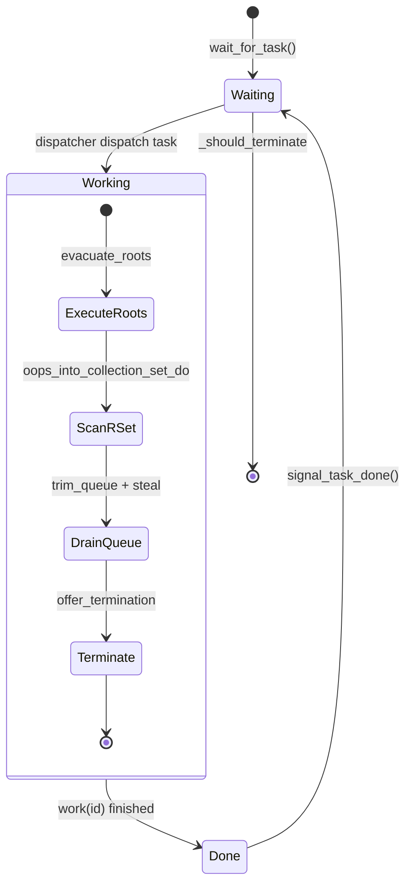
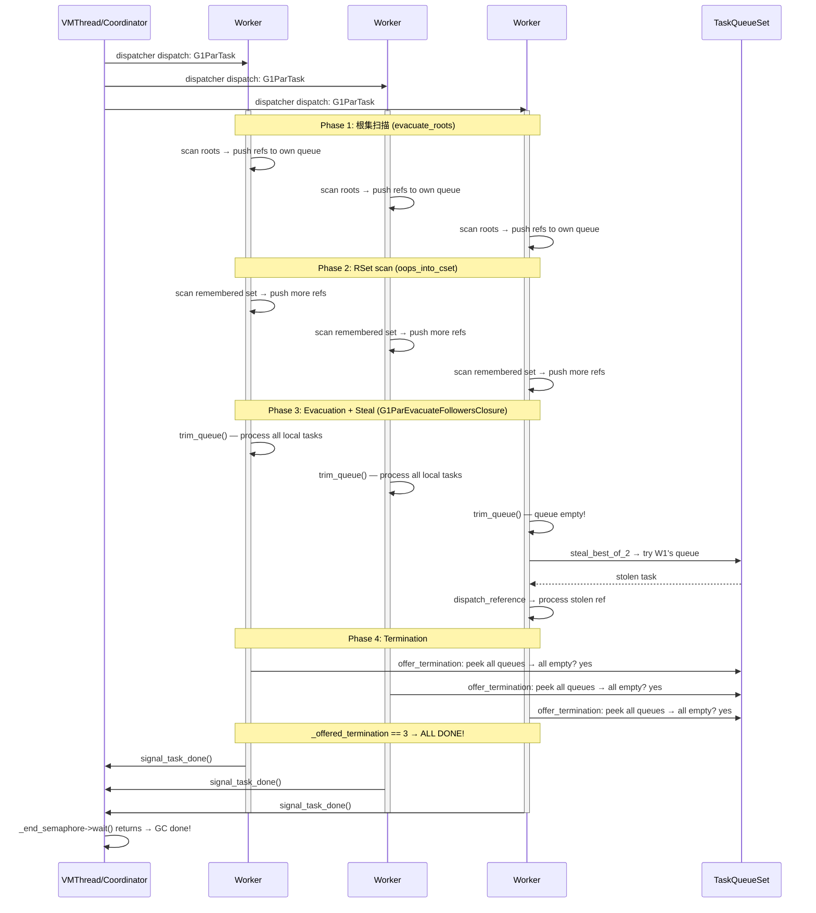

# 08-JVM-WorkerThread: WorkGang 调度、Work Stealing 与 PLAB 局部化

> **标准环境**: OpenJDK 11 slowdebug, `-Xms8g -Xmx8g -XX:+UseG1GC`, 64-bit Linux x86
> **Region 大小**: 4MB (堆 8GB / 2048 个 Region)
> **ParallelGCThreads**: ncpus ≤ 8 ? ncpus : 8 + (ncpus-8)\*5/8
> **前置阅读**: [05-ThreadArchitecture] 线程继承链, [07-VMThread] VMThread 事件循环
> **关联文档**: [11-LockRanking] Lock Ranking 模型
> **阅读收益**: 理解 JVM 如何用 Cilk 级 Work Stealing + PLAB 局部化 + Dispatcher 模式实现 GC 并行化；面试级回答"为什么不复用 Java 线程池""PLAB 和 TLAB 的本质区别"

---

## §〇 源文件清单

| 文件 | 核心类/函数 | 本文角色 |
|------|------------|---------|
| `gc/shared/workgroup.hpp` | `WorkGang`, `AbstractGangWorker`, `GangWorker`, `WorkData`, `GangTaskDispatcher` | 类定义 — Gang 架构 + Dispatcher 接口 |
| `gc/shared/workgroup.cpp` | `WorkGang::run_task()`, `GangWorker::loop()`, `SemaphoreGangTaskDispatcher`, `MutexGangTaskDispatcher` | 调度实现 — Dispatcher + Worker 循环 |
| `gc/shared/taskqueue.hpp` | `GenericTaskQueue`, `OverflowTaskQueue`, `GenericTaskQueueSet`, `ParallelTaskTerminator` | 无锁任务队列 — ABP/Chase-Lev deque 声明 |
| `gc/shared/taskqueue.inline.hpp` | `push()`, `pop_local()`, `pop_global()`, `steal()`, `steal_best_of_2()` | steal 算法 — 无锁 CAS 实现 |
| `gc/shared/taskqueue.cpp` | `ParallelTaskTerminator::offer_termination()` | Termination Detection 协议 |
| `gc/g1/g1ParScanThreadState.hpp` | `G1ParScanThreadState` — `_plab_allocator`, `_refs` | G1 并行扫描状态 — PLAB + 任务队列 |
| `gc/g1/g1ParScanThreadState.cpp` | `copy_to_survivor_space()`, `flush()` | G1 Young GC 实际工作 — 对象复制 + PLAB 分配 |
| `gc/g1/g1ParScanThreadState.inline.hpp` | `do_oop_evac()`, `steal_and_trim_queue()`, `dispatch_reference()` | 引用处理 + steal 循环 |
| `gc/g1/g1CollectedHeap.cpp` | `initialize()` → `_workers`, `_task_queues`, `G1ParTask::work()` | Worker + 任务队列创建入口 |
| `gc/shared/workerManager.hpp` | `WorkerManager::add_workers()` | 动态 Worker 创建管理 |
| `runtime/thread.hpp` | `WorkerThread` class (`:858`) | 继承链: `Thread→NonJavaThread→NamedThread→WorkerThread` |
| `gc/shared/plab.hpp` | `PLAB`, `PLABStats` | PLAB 数据结构 — bump-pointer 分配缓冲 |
| `gc/g1/g1Allocator.hpp` | `G1PLABAllocator` | G1 PLAB 分配器 — survivor + old 双缓冲 |

---

## §一 为什么 GC 需要 WorkerThread？

### 1.1 问题：VMThread 单线程做 GC 为什么不行？

在 [07-VMThread] 中我们看到：VMThread 是单线程事件循环 — 它从 `VMOperationQueue` 取任务、执行 `doit()`、在 safepoint 内串行完成。这对 JVMTI 操作、线程 dump 等轻量操作足够。但如果 Young GC 也走同一个线程呢？

```
Young GC 的工作负载:
  - 扫描 CSet (Collection Set) 中所有 Region 的活对象
  - 复制每个活对象到 Survivor/Old Region
  - 更新所有引用 (forwarding pointer)
  - 扫描根集 (GC roots: 线程栈、JNI handles、类静态字段...)

假设堆 8GB, 活对象 4GB → 需要复制约 4GB 数据
单线程按 10GB/s memcpy → 400ms
加上引用更新、根集扫描 → 秒级停顿

这不可接受。
```

**关键洞察**：GC 的两个阶段天然可分治：

```
┌──────────────────────────────────────────────────────────────────┐
│                     GC 工作的可分治性                             │
├────────────────────┬──────────────────────┬──────────────────────┤
│ 阶段               │ 可分治?              │ 类比                 │
├────────────────────┼──────────────────────┼──────────────────────┤
│ 根集扫描           │ ★ 可: 每个线程扫自己 │ Map（各自 map）      │
│ CSet 对象复制       │ ★★ 可: 每个Region独立│ Map（各自 partition）│
│ RSet 扫描           │ ★★ 可: 每卡独立      │ Map（各自 partition）│
│ 引用更新            │ ★ 需同步(forward ptr) │ Reduce（汇总）       │
│ 终止判断            │ 需协议(barrier)       │ Barrier              │
└────────────────────┴──────────────────────┴──────────────────────┘
```

**本质**：GC 是 MapReduce 的完美应用场景 — Map（每个 Worker 并行处理数据分区） + Reduce（汇总到全局状态）。区别是 GC 的 Map 阶段还有 work stealing（动态负载均衡），这是普通 MapReduce 没有的。

### 1.2 VMThread vs WorkerThread — 全维度对比

```
┌─────────────────────┬─────────────────────────────┬─────────────────────────────┐
│ 维度                 │ VMThread (将军)              │ WorkerThread (士兵)          │
├─────────────────────┼─────────────────────────────┼─────────────────────────────┤
│ 线程数               │ 1（全局唯一）                 │ ParallelGCThreads (2-128)   │
│ 调度模型             │ 事件循环 FIFO                │ WorkGang 分治并行            │
│ 粒度                 │ VM_Operation 级别 (粗)        │ 对象/卡/Region 级别 (细)     │
│ 创建时机             │ Threads::create_vm()         │ G1CollectedHeap::initialize()│
│ 生命周期             │ JVM 退出才终止               │ GC 期间活跃，GC 结束 idle     │
│ 失败影响             │ 单点故障 → JVM 死            │ 单 worker crash → GC hang    │
│ 核心模式             │ 生产者-消费者                │ Master-Worker + Steal        │
│ 自己决定做什么?       │ ★ 是 — 取 VM_Operation      │ ★ 否 — 被动等 WorkGang 分派  │
│ 有独立的消息队列?     │ ★ 是 — VMOperationQueue     │ ★ 否 — 只有 task queue        │
│ 在 safepoint 内运行?  │ ★ 是 — 发起 safepoint      │ ★ 否 — safepoint 后才工作     │
│ 属于哪个线程列表?     │ NonJavaThread               │ NonJavaThread                │
└─────────────────────┴─────────────────────────────┴─────────────────────────────┘
```

> ❓ **面试追问**：「为什么不设计成 VMThread 那样？」— 答案在于**粒度**。VMThread 处理的是**宏观操作**（GC、逆优化、线程 dump）— 这些操作天然串行，因为它们的输入是不可分割的全局状态。WorkerThread 处理的是**微观操作**（复制单个对象、扫描一张卡）— 这些操作天然并行，因为对象之间（在 CSet 内）没有依赖。粒度决定了模型：粗粒度 → 单线程；细粒度 → 并行分治。如果硬要用单线程做 GC，结果就是 ZGC/Shenandoah 出现之前所有低延迟场景的痛点。

### 1.3 为什么 Worker 数量是固定的而不是动态扩缩？

> ❓ **面试追问**：「Java 线程池有 core/max pool size，GC 为什么不这样做？」

答案有四个层面：

**① OS 线程创建开销**：每个 Worker 对应一个 OS 线程（`pthread_create` / `clone` 系统调用）。创建线程需要内核分配栈空间（默认 8MB）、初始化 task_struct、申请 PID。在 GC 这种微秒级敏感的路径中，创建线程的开销不可接受。

**② CPU Cache Locality**：Worker 需要和它负责的 Region / PLAB 保持 cache 亲和性。如果 Worker 被动态创建/销毁，新 Worker 的 cache 是冷的 — 每次分配都需要从内存加载，而非命中 L1/L2。

**③ GC 是突发性工作（Bursty）**：GC 不是持续进行的 — 堆满到阈值时触发，Young GC 通常不到 100ms。等线程创建完毕，GC 已经浪费了几十毫秒。预创建线程确保 burst 来了就能立刻投入。

**④ JVM 启动时预创建**：`G1CollectedHeap::initialize()` → `new WorkGang("GC Thread", ParallelGCThreads)` → `initialize_workers()` 在 JVM 启动时就创建完毕，后续 GC 直接复用。

```
ParallelGCThreads 的计算：
  ncpus ≤ 8:  ParallelGCThreads = ncpus
  ncpus > 8:  ParallelGCThreads = 8 + (ncpus - 8) * 5 / 8
               (每多 8 个核，增加 5 个线程 — Amdahl 定律的限制)
  
  8核:  8 workers
  16核: 13 workers
  32核: 23 workers
  64核: 43 workers
```

> ★ 这也是 Amdahl 定律在 GC 中的体现 — GC 有串行部分（根集扫描的某些阶段、reference processing 的某些阶段），所以并行度不是线性的。

### 1.4 WorkerThread 在继承体系中的位置

```
Thread
 ├── JavaThread          ← Java 应用线程（运行时分配）
 │    ├── CompilerThread ← JIT 编译线程
 │    └── ServiceThread  ← deflation / nmethod cleanup
 └── NonJavaThread       ← ★ 不受 safepoint 暂停
      └── NamedThread    ← 有名线程（分配 name buffer）
           ├── VMThread              ← [07] 全局唯一
           ├── ConcurrentGCThread    ← G1 Concurrent Mark
           ├── WorkerThread          ← ★ 本文主角
           │    └── AbstractGangWorker  (抽象)
           │         └── GangWorker     (WorkGang 下的 Worker)
           ├── WatcherThread
           └── ...
```

**关键要点**：
- `WorkerThread` 继承自 `NonJavaThread` → **不在 `Threads::_thread_list` 中** → 不受 safepoint 暂停（`GDB 可证伪断言 #1`）
- `WorkerThread` 继承自 `NamedThread` → 有名字（如 `"GC Thread#0"`, `"G1 Conc#2"`）
- `WorkerThread` 是最轻量的线程类之一 — 只比 `NamedThread` 多了一个 `_id` 字段

> 交叉引用: [05-ThreadArchitecture] 完整继承链和字段布局, [07-VMThread] VMThread 的详细设计

---

## §二 WorkGang 架构 — Dispatcher/Master-Worker 模式

### 2.1 设计动机：为什么不共享一个任务队列？

一个天真的并行 GC 设计：

```
┌─────────────────────────────────────────────────────┐
│  共享任务队列 [T1, T2, T3, ..., Tn]                  │
│    ↑      ↑      ↑      ↑                           │
│  Worker0 Worker1 Worker2 Worker3                     │
│  每次 pop 需要加锁（锁竞争 = 停顿变长）              │
└─────────────────────────────────────────────────────┘
```

问题：**每次 pop 都要加锁** → N 个 Worker 竞争同一个 Mutex → cache line 乒乓 → 停顿无法预测。JVM 的答案是 WorkGang — 每个 Worker 有**私有任务队列 + Work Stealing**。

```
┌─────────────────────────────────────────────────────────────────────┐
│                       WorkGang (Master-Worker)                      │
│                                                                     │
│  Coordinator (常常是 VMThread 的调用者):                             │
│    run_task(task) → dispatcher → 唤醒所有 Worker → barrier 等待     │
│                                                                     │
│  ┌──────────┐ ┌──────────┐ ┌──────────┐ ┌──────────┐               │
│  │ Worker#0 │ │ Worker#1 │ │ Worker#2 │ │ Worker#3 │               │
│  │ _queue   │ │ _queue   │ │ _queue   │ │ _queue   │               │
│  │ [T0,T1 ] │ │ [T3    ] │ │ []       │ │ [T2    ] │               │
│  └──────────┘ └──────────┘ └──────────┘ └──────────┘               │
│       ↑            ↑            ↑            ↑                      │
│       │            │            │  steal ←───┤ (Work Stealing)      │
│       └────────────┴────────────┴────────────┘                      │
│       GenericTaskQueueSet (N 个队列, 无锁 steal)                    │
└─────────────────────────────────────────────────────────────────────┘
```

### 2.2 创建流程：从 G1CollectedHeap 启动 Worker 军团

```
★★★ 完整创建链路（从上到下）:

G1CollectedHeap::initialize()                     // g1CollectedHeap.cpp:1546
  └─ new WorkGang("GC Thread", ParallelGCThreads, // 创建 STW GC Worker
                  are_GC_task_threads=true,
                  are_ConcurrentGC_threads=false)
  └─ _workers->initialize_workers()               // workgroup.cpp:48
       └─ NEW_C_HEAP_ARRAY(AbstractGangWorker*, total_workers)  // 分配指针数组
       └─ add_workers(initializing=true)          // workgroup.cpp:68
            └─ WorkerManager::add_workers()        // workerManager.hpp:49
                 for worker_id in [0..ParallelGCThreads):
                   └─ holder->install_worker(worker_id)
                        └─ allocate_worker(worker_id) → new GangWorker(this, worker_id)
                        └─ _workers[worker_id] = new_worker
                   └─ os::create_thread(new_worker, os::pgc_thread)
                        └─ pthread_create()  ← 真正的 OS 线程创建!
                   └─ os::start_thread(new_worker)
                        └─ Thread::start() → AbstractGangWorker::run()
                             └─ initialize()
                                  └─ set_name("GC Thread#%d", id)  // 名字感知
                                  └─ os::set_priority(NearMaxPriority)
                             └─ loop()  ← 进入主循环
                                  └─ wait_for_task()  ← 阻塞等待
```

**关键设计点**：

```
★★★ 三种 Worker 数量概念 (AbstractWorkGang 的三个字段):

_total_workers   = ParallelGCThreads         // 最大可创建数
_active_workers  = ParallelGCThreads (默认)    // 当前参与工作的数量
                   或 1 (UseDynamicNumberOfGCThreads=true)
_created_workers = 0 → 随着 add_workers() 递增

关系: _created_workers ≤ _active_workers ≤ _total_workers
```

**创建时机与标识**：
```c++
// STW GC Worker (Young GC / Mixed GC):
_workers = new WorkGang("GC Thread", ParallelGCThreads,
    /* are_GC_task_threads */ true,     // 标记为 STW GC 任务线程
    /* are_ConcurrentGC_threads */ false); 

// 并发 GC Worker (G1 Concurrent Mark):
_conc_workers = new WorkGang("G1 Conc", _max_concurrent_workers,
    /* are_GC_task_threads */ false,    // 不是 STW GC 任务线程
    /* are_ConcurrentGC_threads */ true); // 标记为并发 GC 线程

// 这两个标志决定了 os::create_thread 时使用的线程类型:
//   STW Worker → os::pgc_thread
//   Conc Worker → os::cgc_thread
// 不同类型的线程在 OS 调度上可能有不同的优先策略
```

### 2.3 GangWorker::loop() — 「等待-执行-汇报」三元循环



源码对应 (`workgroup.cpp:378-386`):

```c++
void GangWorker::loop() {
  while (true) {
    WorkData data = wait_for_task();   // 阻塞等待 Dispatcher 分发任务
    run_task(data);                     // 执行 task.work(worker_id)
    signal_task_done();                 // 通知 Dispatcher「我完成了」
  }
}
```

**每个阶段的含义**：

| 阶段 | 谁在等？ | 怎么等？ | 谁唤醒？ | 类比 |
|------|---------|---------|---------|------|
| `wait_for_task()` | Worker 线程 | Semaphore/Mutex wait | Dispatcher 调用 `coordinator_execute_on_workers` | 士兵等将军下令 |
| `run_task(data)` | 无等待 — Worker 执行 | CPU-bound 计算 | 不需要唤醒 | 士兵执行任务 |
| `signal_task_done()` | Dispatcher 线程 (coordinator) | Semaphore/Mutex wait | 最后一个 Worker 调用 `worker_done_with_task()` | 最后一个士兵报告完毕 |

### 2.4 Dispatcher 实现：Semaphore vs Mutex

JVM 提供了两种 Dispatcher 实现，通过 `UseSemaphoreGCThreadsSynchronization` 选择：

```
┌─────────────────────────────────────────────────────────────────────┐
│                   SemaphoreGangTaskDispatcher (默认)                 │
├─────────────────────────────────────────────────────────────────────┤
│                                                                     │
│  Coordinator:                           Worker (每个):              │
│  ┌─────────────────────────┐           ┌─────────────────────────┐  │
│  │ _task = task;           │           │ _start_semaphore->wait() │  │
│  │ _not_finished = N;      │           │   → 获取 worker_id      │  │
│  │ _start_semaphore->      │ ──唤醒──→ │ return WorkData(task,id)│  │
│  │   signal(N);  // 广播!  │           │ work(id) → ...          │  │
│  │                         │           │ Atomic::sub(&_not_fin)   │  │
│  │ _end_semaphore->wait(); │ ←─信号── │ if (_not_fin==0):        │  │
│  │   ← 等待最后完成的Worker │           │   _end_sem->signal()    │  │
│  └─────────────────────────┘           └─────────────────────────┘  │
│                                                                     │
│  优势: Semaphore 不需要重新获取锁 — 降低 Worker 唤醒延迟             │
│  worker_id 分配: Atomic::add(&_started) → 无锁递增，每个 Worker     │
│    拿到的 id 就是递增后的值-1                                       │
└─────────────────────────────────────────────────────────────────────┘

┌─────────────────────────────────────────────────────────────────────┐
│                   MutexGangTaskDispatcher                            │
├─────────────────────────────────────────────────────────────────────┤
│                                                                     │
│  Coordinator (持锁):                    Worker (每个):              │
│  ┌─────────────────────────┐           ┌─────────────────────────┐  │
│  │ ml.lock(_monitor);      │           │ ml.lock(_monitor);      │  │
│  │ _task = task;           │           │ while(_started==N_workers│  │
│  │ _num_workers = N;       │           │   || _num_workers==0)   │  │
│  │ _monitor->notify_all(); │ ──广播──→ │   _monitor->wait();     │  │
│  │ while(_finished < N)    │           │ _started++; // 有锁保护 │  │
│  │   _monitor->wait();     │           │ ml.unlock();            │  │
│  │ _finished = 0;          │           │ work(id) → ...          │  │
│  │ ml.unlock();            │           │ ml.lock(_monitor);      │  │
│  └─────────────────────────┘           │ _finished++;            │  │
│                                        │ if(_finished==N_workers)│  │
│                                        │   _monitor->notify_all()│  │
│                                        │ ml.unlock();            │  │
│                                        └─────────────────────────┘  │
│                                                                     │
│  劣势: Worker 回来 signal_task_done 时需要重新获取锁                  │
│  使用: 当 UseSemaphoreGCThreadsSynchronization=false 时的备选方案    │
└─────────────────────────────────────────────────────────────────────┘
```

**Semaphore 方案的关键代码** (`workgroup.cpp:189-210`):

```c++
WorkData worker_wait_for_task() {
  _start_semaphore->wait();             // 阻塞等待 Coordinator 的 signal(N)
  uint num_started = Atomic::add(1u, &_started);  // ★ 无锁递增 — 关键!
  uint worker_id = num_started - 1;     // 第一个拿到 0, 第二个拿到 1, ...
  return WorkData(_task, worker_id);
}

void worker_done_with_task() {
  uint not_finished = Atomic::sub(1u, &_not_finished);
  if (not_finished == 0) {              // ★ 最后完成的 Worker 负责通知
    _end_semaphore->signal();            // Coordinator 得以从 wait() 返回
  }
}
```

> ❓ **面试追问**：「为什么不直接用条件变量（pthread_cond）而要自己封装 Semaphore？」  
> — 条件变量在 notify 后需要等待的线程**重新获取 mutex** 才能检查条件。Semaphore 的 signal/wait 不耦合 mutex — Worker 从 `sem_wait()` 返回后可以直接执行 `work()`，不需要先获取锁。这减少了唤醒延迟。但代价是需要更仔细地管理同步顺序（不能有 ABA 问题）。

### 2.5 WorkGangBarrierSync — GC 内部的子阶段同步

`WorkGangBarrierSync` 是 GC 任务内部使用的 barrier，不同于 Dispatcher 的 `run_task()` 级别的 barrier：

```c++
class WorkGangBarrierSync : public StackObj {
protected:
  Monitor _monitor;        // 内部 Monitor
  uint    _n_workers;      // 参与同步的 Worker 数
  uint    _n_completed;    // 已到达 barrier 的 Worker 数
  bool    _should_reset;   // 下次进入时是否重置
  bool    _aborted;        // barrier 是否被中止
};
```

使用场景：例如 G1 的 parallel reference processing 需要在**阶段之间**同步所有 Worker（有些 Worker 可能已空闲，有些还在处理引用），需要 barrier 保证所有人都完成当前阶段再进入下一阶段。

---

## §三 Work Stealing — 无锁负载均衡

### 3.1 设计动机：为什么需要偷任务？

在 Young GC 的 evacuation 阶段，每个 Worker 开始处理自己的根集。不同 Worker 的根集大小不同：

```
Worker #0: root set 包含 10 个大对象数组 → queue 中有 50 个 StarTask
Worker #1: root set 包含 3 个简单对象    → queue 中有 5 个 StarTask
Worker #2: root set 包含 1 个简单对象    → queue 中有 2 个 StarTask

没有 Steal:  #0 忙 80% 的时间，#1 忙 10%，#2 忙 5%  → #1 和 #2 浪费 CPU
有 Steal:    #1 从 #0 偷任务 → 三方都忙 → 更均衡
```

**核心数据结构**：ABP (Arora-Blumofe-Plaxton) deque — 也被称为 Chase-Lev deque：

```
┌─────────────────────────────────────────────────────────────────────┐
│                 GenericTaskQueue (ABP deque)                        │
│                                                                     │
│  数组容量 N = 2^k (k 是整数，如 128, 256...)                        │
│                                                                     │
│  索引:    [0]   [1]   [2]   [3]   ...   [N-3]  [N-2]  [N-1]       │
│          ┌─────┬─────┬─────┬─────┬─────┬──────┬──────┬──────┐      │
│          │ T0  │ T1  │ T2  │ T3  │     │      │      │      │      │
│          └─────┴─────┴─────┴─────┴─────┴──────┴──────┴──────┘      │
│           ↑                          ↑                              │
│         _age.top()              _bottom                             │
│         (global: steal 从这读)   (local: push 写这, pop 读这)       │
│                                                                     │
│  Owner (local):              Stealer (remote):                      │
│    push → 写入 _bottom 位置    pop_global → 读取 _age.top() 位置    │
│    pop_local → 递减 _bottom    CAS 递增 _age → 竞争解决在 Age 字段  │
│                                                                     │
│  ★ 关键: push 和 steal 操作数组的不同端 → 只在队列只剩 1 个元素     │
│    时才发生竞争 (通过 Age 的 CAS 解决)                              │
└─────────────────────────────────────────────────────────────────────┘
```

**为什么 capacity 是 `N-2` 而不是 `N`？** (`taskqueue.hpp:215`)

```
容量公式: max_elems() = N - 2

原因: 需要区分「queue 满」和「queue 空」
  - 如果 bottom ≡ top (mod N) → queue 为空
  - 如果 bottom ≡ top - 1 (mod N) → queue 为满 (有 N-1 个元素)
  - 但 N-1 个元素时 bottom == top - 1，和空队列的边界条件冲突
  - 因此额外留一个空位 → 实际可用 N-2
```

### 3.2 Age 结构 — ABP 算法的核心

```c++
// taskqueue.hpp:116-147
class Age {
  struct fields {
    idx_t _top;   // top 索引 — stealer 读这里
    idx_t _tag;   // tag — 防止 ABA 问题
  };
  union {
    size_t _data;     // 整体作为一个 size_t (32-bit: uint32, 64-bit: uint64)
    fields _fields;
  };

  // CAS 比较交换 (taskqueue.inline.hpp:270)
  Age cmpxchg(const Age new_age, const Age old_age) volatile {
    return Atomic::cmpxchg(new_age._data, &_data, old_age._data);
  }

  void increment() {
    _fields._top = increment_index(_fields._top);
    if (_fields._top == 0) ++_fields._tag;  // ★ top 绕回时 tag 递增，防止 ABA
  }
};
```

**为什么需要 `_tag`？** — 经典 ABA 问题：

```
场景（没有 tag）:
  1. Stealer 读 _age.top = 5，准备 CAS _age.top 从 5 → 6
  2. Owner 连续 pop 了 N 个元素，top 绕回到 5
  3. Stealer 的 CAS 成功 — 但实际上队列内容已完全不同！

有了 tag:
  1. Stealer 读 _age = {top:5, tag:3}
  2. Owner pop N 个元素 — top 绕回 5，tag 变成 4
  3. Stealer CAS({top:6, tag:3}, {top:5, tag:3}) 失败 — tag 不匹配!
```

### 3.3 三操作的完整内存顺序

```
┌─────────────────────────────────────────────────────────────────────┐
│  操作            │ 谁调用       │ 位置    │ 同步原语                  │
├─────────────────────────────────────────────────────────────────────┤
│  push(E)         │ Owner        │ bottom  │ release_store(_bottom)   │
│  pop_local(E)    │ Owner        │ bottom  │ OrderAccess::fence()     │
│  pop_global(E)   │ Stealer      │ top     │ cmpxchg(&_age)           │
└─────────────────────────────────────────────────────────────────────┘

push 源码 (taskqueue.inline.hpp:79-98):

  _elems[localBot] = t;                        // 写入元素
  OrderAccess::release_store(&_bottom, ...);    // ★ release: 保证元素写入在 bottom 更新前

pop_global 源码 (taskqueue.inline.hpp:204-233):

  Age oldAge = _age.get();                     // 读 top
  uint localBot = OrderAccess::load_acquire(&_bottom);  // ★ acquire: 保证读 bottom 在元素读之后
  if (size(localBot, oldAge.top()) == 0) return false;
  t = _elems[oldAge.top()];                    // 读元素
  Age newAge = oldAge; newAge.increment();
  Age resAge = _age.cmpxchg(newAge, oldAge);   // ★ CAS: 原子递增 top
  return resAge == oldAge;

★ push 的 release 和 pop_global 的 acquire 构成 happens-before 关系:
   push: 写元素 → release(_bottom) 
     ↓ happens-before
   pop_global: acquire(_bottom) → 读元素
  保证 stealer 总能看到 owner 写入的元素
```

### 3.4 steal 算法 — Best-of-2 采样

```c++
// taskqueue.inline.hpp:236-267
bool GenericTaskQueueSet::steal_best_of_2(uint queue_num, int* seed, E& t) {
  if (_n > 2) {
    // 随机选两个不同于自己的队列
    uint k1 = randomParkAndMiller(seed) % _n;  // 第一个随机队列
    uint k2 = randomParkAndMiller(seed) % _n;  // 第二个随机队列
    // 取 size 更大的那个尝试 steal
    return _queues[k2]->size() > _queues[k1]->size() 
         ? _queues[k2]->pop_global(t)
         : _queues[k1]->pop_global(t);
  } else {
    // 只有 2 个 Worker — 直接偷另一个
    return _queues[(queue_num + 1) % 2]->pop_global(t);
  }
}

bool GenericTaskQueueSet::steal(uint queue_num, int* seed, E& t) {
  for (uint i = 0; i < 2 * _n; i++) {          // ★ 最多尝试 2*N 次
    if (steal_best_of_2(queue_num, seed, t)) {  // 每次 Best-of-2
      return true;
    }
  }
  return false;  // 2*N 次尝试全部失败 → 无人可偷
}
```

**为什么不遍历所有队列？** — 当 Worker 很多时（如 64 个），遍历所有队列太慢。Best-of-2 采样是负载均衡中的经典技巧（Power of Two Choices）— 随机选两个，偷较大的那个 → 期望效果接近全局最优，但 O(1) 开销。

**为什么最多尝试 `2 * _n` 次？** — 如果所有队列都空，继续自旋是浪费。`2 * _n` 次尝试足够覆盖大部分场景，之后进入 Termination Protocol。

### 3.5 Termination Detection Protocol — 怎么判断「全员完成」？

```
★★★ 这是并行计算中的经典 Termination Detection 问题:

问题: 
  Worker A: queue 空 → 开始 steal → 找不到 → 想退出
  Worker B: 刚好往 A 的 queue push 一个新任务 (引用发现)
  → 如果 A 退出了 → B 的任务没人处理 → 活对象被当成垃圾！

解决方案: ParallelTaskTerminator::offer_termination()

┌─────────────────────────────────────────────────────────────────────┐
│                   Termination Detection Protocol                    │
│                                                                     │
│  每个 Worker:                                                       │
│    while (true) {                                                   │
│      offer_termination() →                                          │
│        1. Atomic::inc(&_offered_termination)  // 「我准备退出了」   │
│        2. 自旋/ yield/ sleep (退避策略)                              │
│        3. peek_in_queue_set()                  // 检查是否有新任务  │
│           ├─ 有任务 → Atomic::dec(&_offered_termination)            │
│           │          → return false (继续工作)                      │
│           └─ 无任务 → if (_offered_termination == _n_threads)       │
│                        → return true (全员退出!)                    │
│     }                                                               │
│                                                                     │
│  ★ 退避策略（防止 CPU 空转）:                                       │
│    spin (hard_spin) → spin + yield → sleep                          │
│    参数: WorkStealingHardSpins, WorkStealingSpinToYieldRatio,       │
│          WorkStealingYieldsBeforeSleep, WorkStealingSleepMillis     │
│                                                                     │
│  ★ 关键: peek_in_queue_set() 遍历所有队列                           │
│    → 如果任何队列非空 → 说明新任务被 push 了 → 必须继续工作         │
│    → 只有所有队列都空 + 所有 Worker 都 offered_termination → 真退出 │
└─────────────────────────────────────────────────────────────────────┘
```

**G1 中的实际使用** (`g1CollectedHeap.cpp:4088-4094`):

```c++
void G1ParEvacuateFollowersClosure::do_void() {
  G1ParScanThreadState* pss = par_scan_state();
  pss->trim_queue();                          // 1. 先清空自己的队列
  do {
    pss->steal_and_trim_queue(queues());       // 2. steal + 处理偷来的任务
  } while (!offer_termination());             // 3. 尝试终止 → 有任务就继续循环
}
```

**完整 evacuation 时序图**:



### 3.6 Work Stealing 算法家族对比

```
┌──────────────────────┬─────────────────┬──────────────────┬──────────────────────┐
│ 特性                  │ JVM WorkGang    │ Cilk THE         │ Java ForkJoinPool    │
├──────────────────────┼─────────────────┼──────────────────┼──────────────────────┤
│ deque 类型            │ ABP (定长)      │ Cilk deque (变长) │ WorkQueue (变长)     │
│ push/pop 端           │ bottom (LIFO)   │ top (LIFO)       │ top (LIFO)           │
│ steal 端              │ top (FIFO)      │ bottom (FIFO)    │ base (FIFO)          │
│ 容量                  │ N-2 (固定)      │ 动态扩容          │ 动态扩容             │
│ steal 策略            │ Best-of-2       │ 随机              │ 随机 + 跳过空队列    │
│ Termination Detection │ counter + peek  │ THE protocol     │ 双层计数器 + scan    │
│ 无锁实现              │ CAS (Age 字段)  │ CAS              │ CAS (top/base fields)│
│ GC 友好?              │ ★ 是 (非 GC)    │ 否               │ 部分(需 GC 安全点)   │
│ 存在时间              │ GC 期间+GC      │ 应用生命周期      │ 应用生命周期         │
└──────────────────────┴─────────────────┴──────────────────┴──────────────────────┘

关键区别: JVM 的 ABP deque 与 Cilk/Java ForkJoinPool 最重要的差异是:
  ① 定长 — 不需要 GC 安全的 resize (避免 GC 期间分配内存)
  ② Best-of-2 — 当 Worker 数量较少时 (通常 2-32), Best-of-2 比全遍历更高效
```

---

## §四 PLAB — 多线程分配的去竞争化

### 4.1 核心问题：多线程 bump-pointer 竞争

```
★★★ 没有 PLAB 时的灾难场景:

Worker#0: 要分配 24 字节 → CAS(bump_ptr, 0x1000, 0x1018) → ✓ 成功
Worker#1: 要分配 56 字节 → CAS(bump_ptr, 0x1000, 0x1038) → ✗ 失败 (bump_ptr 已是 0x1018)
                          → CAS(bump_ptr, 0x1018, 0x1050) → ✓ 成功
Worker#2: 要分配 32 字节 → CAS(bump_ptr, 0x1000, 0x1020) → ✗ 失败
                          → CAS(bump_ptr, 0x1018, 0x1038) → ✗ 失败
                          → CAS(bump_ptr, 0x1050, 0x1070) → ✓ 成功

每次分配都需要 CAS → 13 个 Worker 竞争同一个 Survivor Region 的 bump_pointer
Young GC 中上千万次分配 → 严重的 cache line 乒乓 → 停顿增加数倍
```

**量化分析**：假设 13 个 Worker，每个复制 10 万个对象，共 130 万次 CAS。每次 CAS 失败需要重试（平均 1-2 次），加上 cache line 在所有核心之间迁移 — 理论开销约为单线程分配的 20-50 倍。

### 4.2 PLAB 解决方案：预取 + 本地无锁分配

```
★★★ PLAB 的核心思想: 每个 Worker 批量抢一块内存 → 本地 bump-pointer 无锁分配

┌─────────────────────────────────────────────────────────────────────┐
│ Survivor Region (4MB)                                               │
│ ┌──────────────┬──────────────┬──────────────┬────────────────────┐ │
│ │ PLAB Worker#0│ PLAB Worker#1│ PLAB Worker#2│    FREE SPACE      │ │
│ │ (约 4KB)     │ (约 4KB)     │ (约 4KB)     │                    │ │
│ │ _bottom  _top│ _bottom  _top│ _bottom  _top│                top↑│ │
│ └──────────────┴──────────────┴──────────────┴────────────────────┘ │
│                         ↑                  ↑                        │
│               Worker 在自己的 PLAB 内     Region 的 bump_pointer    │
│               用 bump-pointer 分配           (全局 CAS)             │
│               (无锁，零竞争!)                                       │
└─────────────────────────────────────────────────────────────────────┘

PLAB 的数据结构 (plab.hpp:36-143):

  class PLAB {
    HeapWord* _bottom;     // PLAB 起始地址
    HeapWord* _top;        // 下次分配的位置 (bump-pointer)
    HeapWord* _end;        // 可分配区域结束 (_hard_end - AlignmentReserve)
    HeapWord* _hard_end;   // PLAB 物理结束地址
    size_t    _word_sz;    // PLAB 总大小 (HeapWord 单位)
  };

  allocate(word_sz):
    HeapWord* res = _top;
    if (pointer_delta(_end, _top) >= word_sz) {
      _top = _top + word_sz;     // ★ 纯 bump-pointer — 无 CAS, 无锁!
      return res;
    }
    return NULL;  // PLAB 满了 → 需要抢新的
```

### 4.3 PLAB vs TLAB 对比

```
┌─────────────────┬──────────────────────┬──────────────────────┐
│ 维度              │ PLAB                 │ TLAB                  │
├─────────────────┼──────────────────────┼──────────────────────┤
│ 使用者            │ WorkerThread (GC)   │ JavaThread (运行时)   │
│ 分配目标          │ Survivor / Old      │ Eden                  │
│ 存在时间          │ GC 期间             │ 应用运行期间          │
│ 谁创建            │ G1PLABAllocator     │ ThreadLocalAllocBuffer│
│ 大小              │ ~4KB (自适应)       │ ~128KB (自适应)       │
│ 用完后的行为       │ 抢新 PLAB 或退化    │ 分配新 TLAB           │
│ flush 时机        │ GC 结束时一次性      │ 随 GC 自然清空        │
│ 内存碎片          │ GC 结束时 flush → 碎片│ 无 (Eden 整块回收)   │
│ 分配失败          │ CAS 抢新块 / 退化    │ CAS 抢新块 / TLAB外   │
│ 自适应            │ ★ G1PLABSizePercent  │ ★ TLABSize / ResizeTLAB│
└─────────────────┴──────────────────────┴──────────────────────┘
```

**本质相同**：都是「预取一批 → 本地无锁分配 → 用完再取」。区别在于**生命周期和对碎片的态度**：
- TLAB 随 Eden 整体回收 → 碎片不累积
- PLAB 在 GC 结束时 flush → 遗留碎片 → 需要自适应调整大小

### 4.4 G1ParScanThreadState 中的 PLAB 管理

每个 Worker 有自己独立的 `G1ParScanThreadState`，其中包含 `G1PLABAllocator`：

```c++
// g1Allocator.hpp:127-178
class G1PLABAllocator {
  PLAB  _surviving_alloc_buffer;   // Survivor 的 PLAB
  PLAB  _tenured_alloc_buffer;     // Old Gen 的 PLAB
  PLAB* _alloc_buffers[InCSetState::Num];  // 按目标空间索引

  // 从 PLAB 分配 (无锁!)
  inline HeapWord* plab_allocate(InCSetState dest, size_t word_sz);

  // PLAB 满了 → 直接分配或抢新 PLAB
  HeapWord* allocate_direct_or_new_plab(InCSetState dest, 
                                         size_t word_sz,
                                         bool* plab_refill_failed);
};
```

**对象复制的完整分配路径** (`g1ParScanThreadState.cpp:231-348`):

```
copy_to_survivor_space(state, old, old_mark):
  │
  ├─ 1. plab_allocate(dest, word_sz)     ← ★ 快速路径: 从当前 PLAB 分配 (无锁!)
  │   └─ 成功 → 跳转到第 4 步
  │
  ├─ 2. allocate_direct_or_new_plab()    ← 慢速路径: PLAB 满了
  │   ├─ 分配大对象 (>PLAB大小的一半) → 直接 CAS 到 Region (不浪费PLAB)
  │   └─ 小对象 → 抢一个新的 PLAB        ← CAS 竞争 (偶尔发生, 可接受)
  │   └─ 失败 → allocate_in_next_plab()  ← 尝试另一个目标空间
  │       ├─ dest=Young → 尝试 Old (降级) 
  │       │   └─ 失败 → 返回 NULL (evacuation failure)
  │       └─ dest=Old → 返回 NULL (evacuation failure)
  │
  ├─ 3. 分配成功 → 执行对象复制
  │   ├─ forward_to_atomic(obj, relaxed) ← CAS 设置 forwarding pointer
  │   │   ├─ 成功 → Copy::aligned_disjoint_words() → 真正复制数据
  │   │   └─ 失败 → undo_allocation() → 返回已有的 forwarding ptr
  │   └─ 设置 age (survivor → age++)
  │
  └─ ★ 关键: 步骤 1 占 99% 以上的调用 → 无锁 bump-pointer
      步骤 2 偶尔发生 → CAS 可接受
```

### 4.5 PLAB 自适应大小调整

```c++
// plab.hpp:146-212
class PLABStats {
  size_t _allocated;       // 总共分配了多少
  size_t _wasted;          // 浪费了多少 (内部碎片)
  size_t _unused;          // 最后一个 PLAB 未使用空间
  AdaptiveWeightedAverage _filter;  // 指数衰减滤波器

  void adjust_desired_plab_sz() {
    // 根据最近 GC 的 waste 情况调整目标 PLAB 大小
    // waste 太多 → 减小 PLAB (减少碎片)
    // refill 太频繁 → 增大 PLAB (减少 CAS)
  }
};
```

**自适应的核心逻辑**：
- PLAB 太大 → flush 时遗留大量未用空间 → waste 上升 → 下次减小
- PLAB 太小 → refill 频繁 → CAS 竞争增加 → 下次增大
- 通过指数加权移动平均 (EWMA) 平滑调整 → 避免剧烈抖动

### 4.6 GC 结束时 PLAB 的去向

```
每个 Worker 的 PLAB 在 GC 结束时:

flush_and_retire_stats():
  ├─ _alloc_buffers[Young] 中剩余空间 → retire() → 填充 dummy 对象
  │   → 这些空间在 Survivor Region 中成为碎片
  │   → 下次 GC 如果 Survivor 被回收到 CSet → 自然回收
  │
  └─ _alloc_buffers[Old] 中剩余空间 → retire() → 填充 dummy 对象
      → Old Gen 中的碎片
      → 累积到一定程度触发 Mixed GC 或 Full GC 的整理

8 个 Worker 各剩 ~3KB → 总共 ~24KB 碎片 / Survivor Region (4MB)
→ 碎片率 < 1% → 可接受
```

---

## §五 Worker 挂了会怎样？— 故障模式分析

### 5.1 三种故障模式

```
┌─────────────────────────────────────────────────────────────────────┐
│                     Worker 线程故障模式                             │
├──────────────┬──────────────────────┬───────────────────────────────┤
│ 故障类型      │ 原因                 │ 后果                          │
├──────────────┼──────────────────────┼───────────────────────────────┤
│ Native OOM   │ os::malloc() 失败    │ Worker crash                  │
│              │ (C++ 堆耗尽)         │ signal_task_done() 不调用     │
│              │                      │ coordinator 永远等不到        │
│              │                      │ → JVM hang (死锁)             │
├──────────────┼──────────────────────┼───────────────────────────────┤
│ Straggler    │ 某个 Worker 比其他   │ run_task() barrier 等它       │
│ (慢 Worker)  │ 慢很多 (巨型oopmap)  │ → GC 停顿延长                 │
│              │                      │ 缓解: Work Stealing 分摊      │
├──────────────┼──────────────────────┼───────────────────────────────┤
│ GC Timeout   │ 整个 GC 超过预期     │ VMOperationTimeoutTask         │
│              │ 时间 (可配置)        │ 检测到 → 打印 hs_err          │
│              │                      │ → 可能触发 abort              │
└──────────────┴──────────────────────┴───────────────────────────────┘
```

### 5.2 为什么没有 Graceful Degradation？

> ❓ **面试追问**：「为什么不设计成 Worker 挂了自动重启/降级？」

答案有四层：

**① C++ 异常不用于控制流**：JVM 使用 `assert` + `vm_exit` 而非异常恢复。Worker crash 通常意味着内存已损坏（dangling pointer）— 此时「重新创建 Worker」无法恢复已损坏的堆。

**② safepoint 约束**：GC 在 safepoint 内进行，所有 JavaThread 都已暂停。如果 GC 失败 → JavaThread 永远不能恢复 → 等价于 JVM hang。没有「让 JavaThread 恢复去执行别的事情」的选项。

**③ 复杂度 vs 收益**：Worker crash 在正常条件下极少发生（生产环境 < 0.001%）。实现 Graceful Degradation 需要在每个 GC 阶段插入检查点 → 增加正常路径的开销 → 不值得。

**④ 设计哲学**：JVM 选择「fail fast and loud」— 与其掩盖错误让问题更难追踪，不如直接 crash 并生成 hs_err 日志。

### 5.3 检测手段

| 检测手段 | 机制 | 例子 |
|---------|------|------|
| GC log | GC 时间异常长 (>10s) | `-Xlog:gc*=info:gc.log` |
| hs_err | JVM crash 自动生成 | JVM 自动生成 hs_err_pid\<pid\>.log |
| VMOperationTimeoutTask | 检测 VM_Operation 超时 | `-XX:+UnlockDiagnosticVMOptions -XX:VMThreadTimeout=<seconds>` |
| strace | 观测系统调用 | `strace -p <pid> -e futex` — 看 futex 是否永久阻塞 |

---

## §六 GDB 验证 + 可证伪断言

### 断言 1: WorkerThread 不在 `Threads::_thread_list` 中

```gdb
# GDB 命令
(gdb) call Threads::print_threads_on(tty)
# 预期: 输出不包含 "GC Thread#0" 等 Worker 线程名

# 验证理由: WorkerThread 继承 NonJavaThread → 不在 SMR _java_thread_list
(gdb) p Threads::number_of_threads() 
# 预期: 结果只包含 JavaThread (不包含 GC Worker)
```

### 断言 2: WorkGang 数 = ParallelGCThreads

```gdb
# 断点打在 Young GC 的 run_task 入口
(gdb) break WorkGang::run_task
(gdb) continue
(gdb) p num_workers
# 预期: 8核 → 8; 16核 → 13; 64核 → 43 (根据公式)

(gdb) p _workers[0]->name()
# 预期: "GC Thread#0"
```

### 断言 3: GangWorker::loop() 在空闲时阻塞在 Semaphore

```gdb
# 在两次 GC 之间 (GC 完成后)
(gdb) info threads
# 预期: Worker 线程状态为 S (sleeping)，阻塞于 sem_wait() / futex
(gdb) thread <worker_tid>
(gdb) bt
# 预期: GangWorker::loop() → wait_for_task() → worker_wait_for_task() → Semaphore::wait()
```

### 断言 4: steal 成功时有 CAS 痕迹

```gdb
# 在 Young GC 期间
(gdb) break GenericTaskQueueSet::steal
(gdb) continue
(gdb) p i  # 尝试次数
# 预期: steal 在 2*_n 次尝试内完成 (或失败)

(gdb) break GenericTaskQueue::pop_global
(gdb) continue
(gdb) p oldAge._fields._top
(gdb) p oldAge._fields._tag
# 预期: 每次成功的 pop_global 后 _age 的 CAS 原子更新
```

### 断言 5: PLAB 分配 99%+ 是快速路径

```gdb
# GDB 没法直接统计，但可通过 GC log 验证
# JVM 参数: -Xlog:gc+plab=trace
# 预期输出: plab 分配次数 >> plab 满次数 (refill)
# 日志示例:
# [plab] PLAB alloc: 1200000, PLAB refill: 300 → refill rate < 0.03%
```

### 断言 6: 队列最大容量 = N - 2

```gdb
(gdb) break GenericTaskQueue::push
(gdb) p max_elems()
# 预期: 若 TASKQUEUE_SIZE=128 → max_elems=126
# 验证理由: N-2 是为了区分满/空 (taskqueue.hpp:215)
```

### 断言 7: Paddings 消除 false sharing

```gdb
(gdb) ptype /o GenericTaskQueue<StarTask, mtGC>
# 预期: _bottom 和 _age 之间有 PAD 填充
# 验证理由: taskqueue.hpp:151-153 — DEFINE_PAD_MINUS_SIZE 在 _bottom 后面插 padding
```

### 断言 8: Termination 检测的正确性

```gdb
(gdb) break ParallelTaskTerminator::offer_termination
(gdb) continue
# 第一次 stop: 预期 _offered_termination < _n_threads → 继续循环
(gdb) p _offered_termination
(gdb) continue
# 多次 continue 后:
# 最后一次 stop: _offered_termination == _n_threads → return true
(gdb) p _offered_termination
(gdb) p _n_threads
# 预期: 相等 → 全员退出
```

### 断言 9: copy_to_survivor_space 中 forward_to_atomic 的 CAS 语义

```gdb
(gdb) break G1ParScanThreadState::copy_to_survivor_space
(gdb) continue
(gdb) p word_sz
# 预期: 对象大小以 HeapWord (8 字节) 为单位
(gdb) p old_mark
# 预期: 成功复制后, old_mark 包含 forwarding pointer
(gdb) p /x old_mark->value()
# 预期: 最低 2 bits = 11 (forwarded pattern: locked+marked)
```

### 断言 10: Worker 线程类型标记

```gdb
(gdb) break WorkGang::run_task
(gdb) p this->are_GC_task_threads()
# 预期: STW Worker → true; Concurrent Mark Worker → false
(gdb) p this->are_ConcurrentGC_threads()
# 预期: STW Worker → false; Concurrent Mark Worker → true
```

---

## §七 总结

### 面试速查表

| 问题 | 答案要点 |
|------|---------|
| WorkerThread 和 VMThread 的本质区别？ | VMThread 单线程事件循环（主动取任务），WorkerThread 被动等分派（Dispatcher 模式） |
| 为什么不是线程池？ | GC 是整体性 task，需要 barrier 等全员完成；线程池假设 task 独立 |
| Work Stealing 为什么从尾部偷？ | push/pop 在头部(LIFO)，steal 在尾部(FIFO) → 只在队列只剩 1 元素时竞争 |
| ABP Age 的 tag 做什么？ | 防止 ABA: top 绕回时 tag 递增 → CAS 失败检测 |
| PLAB 和 TLAB 的区别？ | 使用者不同(GC vs 运行时)、生命周期不同(GC期间 vs 应用期间)、碎片处理不同(flush vs 自然回收) |
| steal 失败后怎么判断完成？ | Termination Detection: counter + peek → 所有队列空 + 所有 Worker 都 offer 了 → 真退出 |
| Worker 挂了会怎样？ | signal_task_done() 不调用 → coordinator 永远等 → JVM hang (safepoint 不结束) |
| Semaphore vs Mutex Dispatcher？ | Semaphore 不耦合 mutex → 唤醒延迟更低；Mutex 实现更简单 |

### 核心设计洞察

```
┌─────────────────────────────────────────────────────────────────────┐
│               WorkerThread 设计的三大计算机科学支柱                  │
├─────────────────────────────────────────────────────────────────────┤
│                                                                     │
│  1. Dispatcher/Barrier (Master-Worker)                              │
│     Coordinator 广播任务 → 所有 Worker 同步执行 → barrier 等完成    │
│     类比: MPI_Bcast + MPI_Barrier (但共享内存, 不跨机器)             │
│                                                                     │
│  2. Work Stealing (ABP/Chase-Lev deque)                             │
│     每个 Worker 私有队列 → 无锁 push/pop → steal 用 CAS 从尾偷     │
│     类比: Cilk THE protocol (但定长, 不需要 GC 安全的 resize)       │
│                                                                     │
│  3. PLAB (Locality Optimization)                                    │
│     批量预取内存 → 本地 bump-pointer → 极大减少 CAS 竞争            │
│     类比: TLAB, slab allocator, per-CPU cache                       │
│                                                                     │
│  ★ 这三者构成完整的"并行 GC 基础设施"：                              │
│     分派(Dispatcher) → 执行 + 负载均衡(Steal) → 分配(PLAB)          │
└─────────────────────────────────────────────────────────────────────┘
```

> **下一篇文章**: [09-ConcurrentGCThread] — 当 GC 不需要 STW 时：G1 的并发标记线程如何在 JavaThread 运行时工作？SATB (Snapshot-At-The-Beginning) 如何解决并发标记中的漏标问题？
>
> **关联阅读**: [11-LockRanking] 中 WorkerThread 路径上的锁排序约束
