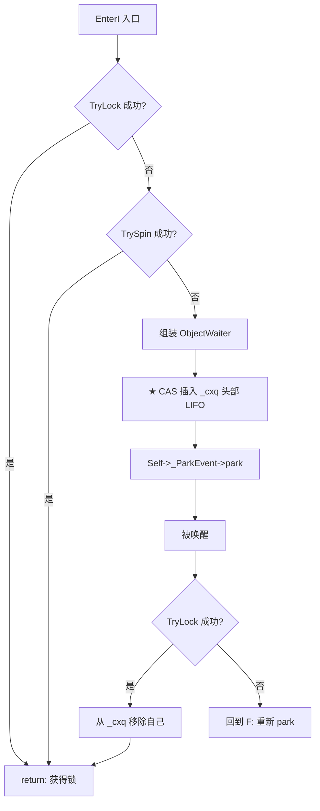

# PROMPT: 请撰写 01-ObjectMonitor.md

## 一、任务

撰写 07-thread-lock 系列的第一篇核心文档，主题：**ObjectMonitor —— 重量级锁的完整实现**

### 定位与独特性

JVM 有三种锁的实现（偏向锁、轻量锁、重量锁），但 ObjectMonitor 是唯一能处理**真正的多线程竞争、wait/notify、超时获取**的锁实现。它也是 JVM 中最古老的锁实现——1997 年就存在核心骨架，20+ 年持续打磨。

> **本文的独特价值**：不是"翻译 enter/exit 源码"，而是 **"如果你已经理解偏向锁和轻量锁的 CAS 不能做什么，从竞争的物理本质推导出为什么 ObjectMonitor 必须有三条队列 ⊕ 自适应自旋 ⊕ _succ 继任者 ⊕ _Responsible 防搁浅"**。每一处设计都在回应一个具体的并发问题——本文的任务是把这些对应关系挖出来。

---

## 二、核心叙事线（从"轻量锁为什么不够"到"ObjectMonitor 怎么解决每个问题"）

### 问题驱动链

```
[03-BasicLock-Synchronizer] 告诉你：
  → 轻量锁 = 一次 CAS 把 BasicLock* 写入对象头 → 无竞争时极快（~20 CPU cycles）
  → 但这要求"只有一个线程竞争"——CAS 失败 = 什么都不能做
  → 轻量锁不支持 wait/notify（没有条件队列）

所以 ObjectMonitor 必须解决以下问题：
  ┌─────────────────────────────────────────────────────────────┐
  │  Q1: 多个线程同时 CAS _owner 失败 — 怎么排队？在哪等？      │
  │      → 答案：_cxq (LIFO 到达队列) + _EntryList (就绪队列)   │
  │                                                             │
  │  Q2: 等的时候是纯 spin 还是 park？spin 多久？               │
  │      → 答案：自适应自旋 — _SpinDuration 随成功率动态调整    │
  │                                                             │
  │  Q3: exit() 释放锁后叫醒谁？叫醒后它抢不过新来的怎么办？    │
  │      → 答案：_succ 继任者机制 + QMode 唤醒策略              │
  │                                                             │
  │  Q4: 如果所有线程都在 park，没人检查锁释放了？              │
  │      → 答案：_Responsible + timed-park 防搁浅协议           │
  │                                                             │
  │  Q5: wait() 释放锁后自己怎么排队？notify() 叫醒后放哪？     │
  │      → 答案：_WaitSet (双向链表) — 与竞争队列完全独立        │
  │                                                             │
  │  Q6: GC safepoint 期间 ObjectMonitor 正在被使用怎么办？     │
  │      → 答案：_count 引用计数 + deflate_idle_monitors        │
  └─────────────────────────────────────────────────────────────┘
```

### 核心约束（必须在文档开篇讲清楚）

```
ObjectMonitor 的设计约束：
  1. 必须支持 wait/notify — 轻量锁没有条件队列 → 至少需要两条独立队列
  2. 多线程 CAS 必然失败 → 必须有"败者排队"的地方
  3. park/unpark 是昂贵的（futex WAKE + FUTEX_WAIT ≈ 1-2μs）
     → 不能每个 CAS 失败都 park → 必须自旋打头阵
  4. 自旋太久浪费 CPU，自旋太短过早 park → 必须自适应调节
  5. GC safepoint 期间 ObjectMonitor 不能被回收
     → 必须有引用计数追踪"正在使用中"的 Monitor
```

---

## 三、必须覆盖的内容（深度不设上限）

### 3.1 ObjectMonitor 的数据结构：为什么字段这样排列？

> **禁止行为**：平铺字段列表。"每个字段在缓存行的哪个位置、为什么放在这个位置、读写频率是多少、谁和谁会竞争同一缓存行"——这才是数据结构分析。

```
ObjectMonitor 字段全景：

    Offset    Field                   Type              R/W频率      Cache Line
    ─────────────────────────────────────────────────────────────────────────────
    +0        _header                 markOop           exit 读      CL#0 (cold)
    +8        _object                 void*             exit 读      
    +16       FreeNext                ObjectMonitor*    空闲链表     
    +24-127   [padding: DEFINE_PAD]                                      ↑
    ──────── 64B 缓存行边界 ──────────────────────────────────────────────
    +128      _owner                  void* volatile    ★ enter CAS    CL#1 (HOT)
    +136      _previous_owner_tid     jlong             JFR 写        
    +144      _recursions             intptr_t volatile ★ enter++      CL#1 (HOT)
    +152      _EntryList              ObjectWaiter*     exit 写/读     CL#1 (HOT)
    +160      _cxq                    ObjectWaiter*     enter CAS      CL#1 (HOT)
    +168      _succ                   Thread*           自旋 exit      CL#1 (HOT)
    +176      _Responsible            Thread*           防搁浅          CL#1 (HOT)
    +184      _Spinner                int               enter 自旋     CL#1 (HOT)
    +188      _SpinDuration           int volatile      ★ 自适应       CL#1 (HOT)
    +192      _count                  jint volatile     引用计数       
    +196      _WaitSet                ObjectWaiter*     wait/notify    
    +204      _waiters                jint              wait/notify    
    +208      _WaitSetLock            int               WaitSet 自旋锁 
```

**★ DEFINE_PAD 的精确动机**（必须深入解释）：

```
为什么 _header（CL#0）和 _owner（CL#1）必须在不同缓存行？

  enter 路径：
    线程 T1 CAS _owner(偏移+128) → lock cmpxchg → 写操作 → CPU 的缓存一致性协议
      会使 _owner 所在的整个 64B 缓存行在 T1 的 L1 cache 中标记为 MODIFIED
      → 其他核心的这一缓存行全部 INVALIDATE

  exit 路径：
    线程 T2(持有者) 释放锁 → 读 _header(偏移+0, 存 displaced markOop)
    → 如果 _header 和 _owner 在同一缓存行 → T2 读数时 L1 cache MISS
      → 必须从 T1 的核心获取最新值 → cross-core cache transfer → ~40-300 cycles

  有 padding 之后：_header(CL#0) 和 _owner(CL#1) 是独立缓存行
    → T1 CAS _owner(CL#1) 不影响 CL#0 → T2 读 _header(CL#0) 仍是 L1 cache HIT

★ 代价：ObjectMonitor 的 sizeof 从 ~112B 膨胀到 ~216B。
  → 为什么可以接受？因为 ObjectMonitor 是 C-heap 分配（mtObjectMonitor），
  而堆中的 Java 对象可能成千上万——每个 ObjectMonitor 多 104B 换来
  enter 和 exit 在不同线程上消除 false sharing。这 104B 买的是 10-20x 的性能。
```

**★ 多线程字段的热区分析**（不是描述字段，是分析并发争用）：

```
HOT: enter() 路径上的字段（频繁写）：
  _owner    — CAS 写    (每线程每次进入 CAS 1-3 次)
  _cxq      — CAS 写    (败者入队)
  _EntryList — 写       (exit() 批量转移 _cxq)
  _succ     — 写/读     (exit() 唤醒, enter() 自旋后读)
  _SpinDuration — 读/写 (enter() 读, exit() 更新)

COLD: 只在特定状态下访问的字段：
  _header   — 读        (exit() 恢复 markOop, 但不频繁)
  _WaitSet  — 写/读     (只在 wait/notify 时)
  _count    — 读/写     (inflate/deflate + GC safepoint 检查)

★ 关键洞察：_owner 每纳秒被 CAS 一次，_cxq 每微秒被 CAS 一次，_WaitSet 每毫秒被访问一次。
  padding 对 _owner 最重要，对 _cxq 次重要，对 _WaitSet 不重要。
```

### 3.2 enter() — 重量级锁获取的全路径

#### 3.2.1 快速路径（CAS _owner，无竞争时 1 次 CAS 获取锁）

```
ObjectMonitor::enter() 快速路径：
  → CAS(_owner, NULL, Self)
  → 成功 → _recursions = 0 → 返回（5 条指令，无系统调用）
  → 失败 → 进入重入检查
```

**为什么 _recursions 从 0 开始？**（容易错！）
ObjectMonitor 首次进入时 `_recursions = 0`，重入时 `_recursions++`。这和 `ReentrantLock` 不同——`ReentrantLock` 的 state 首次进入时 = 1。
> ★ **关键澄清**：这**不是**性能差异。"exit 检查 `_recursions > 0`（减到 0 = 完全释放）"的逻辑不因初始值而变——设 0 或 1，check + decrement 是同一套代码。真正的理由是**语义自洽**：`_recursions` = "重入次数"(不是"持有计数")。不重入时重入次数 = 0，自然语义。`ReentrantLock.state` = "获取次数"，首次获取 = 1，同样自然。两组语义各自自洽——不存在"多一个比较"。把 _recursions 讲成某种性能优化是**错的**。

#### 3.2.2 重入检查

```
ObjectMonitor::enter() 重入 → Self == _owner?
  → 是 → _recursions++ → 返回（重入成功）
  → 否 → 进入 EnterI() 慢路径
```

**面试追问**：同一个线程怎么会有两条路径走到 enter？
→ 可重入 synchronized 嵌套：`synchronized(obj) { synchronized(obj) {...} }`——第二次 monitorenter 时 `_owner == Self`，不需要走竞争路径。

#### 3.2.3 栈锁升级（轻量锁持有者第一次走 ObjectMonitor::enter）

```
ObjectMonitor::enter() 栈锁 → is_lock_owned(Self) != NULL?
  → 是 → Self 持有轻量锁，但其他线程已 inflate 了这个对象
    → EnterI(Self) → 和常规竞争走同一路径
  → 为什么是 EnterI 而不是直接设 _owner？
    → 因为其他线程可能已经在 _cxq 中排队——直接抢锁就是"插队"
```

#### 3.2.4 ★★★ EnterI() —— 慢路径的完整状态机

**必须画 Mermaid 状态图，不是代码注释型描述**



**每个节点必须解释的"为什么"**：

```
① TryLock — 为什么 EnterI 入口还要 TryLock？
   → 在准备 ObjectWaiter 的这段时间内，锁可能刚好被释放
   → 一次 TryLock ≈ 100ns，一次 park ≈ 1-2μs — 值不值得试一次？绝对值！

② TrySpin — 自旋 vs 直接 park 的决策
   ★ 什么条件下自旋？（3 个条件缺一不可）
     a. _owner 是线程（不是 BasicLock*）— 如果 owner 是轻量锁，它可能在任何时刻释放（CAS）→ 值等
     b. _succ != Self — 没人指名我是继任者 → 我必须主动抢 → 自旋！
        （对比：如果 _succ == Self，exit() 会主动 unpark 我 → 不需要自旋 → 直接 park）
     c. 自旋计数 < _SpinDuration — 自适应自旋调度

③ CAS _cxq — ★ 为什么用 LIFO（头部插入，单向链表）而不是 FIFO？
   → LIFO = 单 CAS 头部插入，无需尾指针（写操作 1 次 CAS）
   → FIFO = 需要 CAS 尾部插入（ABI 问题）或需要锁
   → _cxq 是"到达顺序"的近似（新到线程更可能在 CPU cache 中热度高）
   → ★ 公平性问题由 exit() 的 QMode 策略补偿——_cxq 不保证公平，_EntryList 可以 FIFO 化

④ park() — 挂起 ≠ 死等
   → Self->_ParkEvent->park() → PlatformEvent::park()
     → Atomic::xchg 检测 _event 状态 → 若 _event ≥ 0 则直接返回（仅 1 次 atomic，无需 pthread_mutex_lock）
     → _event == 0 → pthread_mutex_lock + pthread_cond_wait → futex(FUTEX_WAIT)
   ★ 为什么用 ParkEvent 而不是直接 pthread_cond_wait？
     → ParkEvent 的 _event 计数器和 Java 的 LockSupport 语义匹配：先 unpark 后 park 不会丢失信号
     → 直接 pthread_cond_wait 没有计数器 → "先 signal 后 wait" 会永远阻塞

⑤ 被唤醒后 TryLock 失败 → 为什么重新 park 而不是重新 EnterI？
   → 已经在 _cxq 中 → 不需要重新入队
   → 重新 EnterI 会再创建一个 ObjectWaiter 并再次 CAS _cxq → 队列中同一个线程有 2 个节点！
```

### 3.3 exit() — 释放 + 唤醒的复杂决策树

```
ObjectMonitor::exit() 四层决策：

第一层: _recursions > 0? → _recursions-- → 返回（重入的 unlock，不释放）
          
第二层: 释放 _owner
  → OrderAccess::release_store(&_owner, NULL)
  → ★ StoreLoad fence: OrderAccess::storeload()
  → 为什么需要 StoreLoad fence？
    → release 保证写 _owner=NULL 之前的所有写都对其他 CPU 可见
    → storeload 保证读 _EntryList/_cxq 在写 _owner=NULL 之后
    → 如果没有 storeload：CPU 可能提前读取 _EntryList（还是旧的空值）→ 错过应该唤醒的线程
    → ★ x86 TSO 上 release_store 已经隐含 storeload——但 ARM 上这是必需的！
      代码中显式写 storeload 是为了声明逻辑意图（ARM 自动生效，x86 是编译器屏障）

第三层: ★ QMode 唤醒策略 — 5 种策略（通过 _cxq→_EntryList 转移控制出队顺序）
  ┌─────────────────────────────────────────────────────────────────┐
  │ QMode=0 (默认): _cxq→_EntryList (FIFO 反转) → 取 _EntryList 头 │
  │   效果: _cxq 的 LIFO 变成 _EntryList 的 FIFO → 公平性补偿      │
  │                                                                 │
  │ QMode=1: _cxq→_EntryList (不反转) → 取 _EntryList 头            │
  │   效果: 偏向最近到达的线程（cache热度高）→ 不公平但吞吐更高     │
  │                                                                 │
  │ QMode=2: _cxq 直接出队 → 不用 _EntryList                        │
  │   效果: 纯 LIFO → 极致 cache 友好 → 最不公平                    │
  │                                                                 │
  │ QMode=3: _cxq→_EntryList 尾部(APPEND) → 取 _EntryList 头        │
  │   效果: ★ 严格 FIFO — LIFO入_cxq → FIFO反转到_EntryList尾部     │
  │     → _EntryList 头是最早到达的线程 → 最公平 → 可能 cache 不友好 │
  │                                                                 │
  │ QMode=4: _cxq→_EntryList → 取 _EntryList 头 + 不堵塞策略        │
  │   效果: 类似 QMode=0 但控制 notify() 侧的特殊转移路径             │
  └─────────────────────────────────────────────────────────────────┘
  ★ 为什么默认是 QMode=0 而不是 QMode=3（最公平）？
    → QMode=0 的一次链表反转操作 = O(n) 批量操作，在释放锁时一次性完成
    → 公平性牺牲：_cxq 是 LIFO → 最近到的线程先进 _EntryList → 
      但"最近到的线程"通常在 CPU cache 中是热的 → 唤醒它能更快进入临界区
    → JVM 选择的是"微不公平 + 高吞吐"——每次退出确保至少有一个线程被唤醒

第四层: futile wakeup throttling — ★ 防止无效唤醒（"叫醒了但抢不到锁"）
  → _succ != NULL? → 已经有线程在自旋等待 → 不自旋直接 unpark(_succ)
  → _succ == NULL && _EntryList/_cxq 为空? → 无人等 → 直接返回
  → _succ == NULL && 有人等? → Optional: 短暂自旋等待新 _succ 被设置
    → Knob_ExitRelease 控制：如果有人在等但没人自旋 → unpark 一个
```

### 3.4 wait() / notify() — 第三条独立队列

```
为什么 wait() 不能把线程放到 _cxq 或 _EntryList？

_cxq 和 _EntryList 上的线程"正在竞争 _owner"，wait() 的线程"主动放弃 _owner 等待条件"
  → 混在一起 = 每次 exit() 都要区分"他是来抢锁的还是来等条件的"
  → 分离队列 = exit() 只唤醒竞争线程（_EntryList），notify() 只唤醒等待线程（_WaitSet）
  → ★ WaitSet 是双向链表（ObjectWaiter._prev + _next），EntryList 也是双向链表，
    _cxq 是单向链表（只有 _next）
```

```
wait() 流程：
  ① Self 必须是 _owner（否则抛 IllegalMonitorStateException）
  ② 组装 ObjectWaiter → _WaitSet 尾部插入（双向链表，APPEND）
  ③ ObjectMonitor::exit(Self) → 释放锁给下一个竞争者
  ④ Self->_ParkEvent->park() → 挂起等待 notify

notify() 流程：
  ① _WaitSet 头部取走一个 ObjectWaiter
  ② 策略决策（QMode 影响）：
     - QMode=2: 直接插 _cxq 头部（最激进的调度）
     - QMode=0/1/3/4: 插 _EntryList（和竞争线程同优先级）
  ③ _waiters-- → unpark 目标线程

notifyAll() 流程：
  全量转移 WaitSet→EntryList/_cxq（策略同上）→ 批量 unpark
```

### 3.5 自适应自旋 — _SpinDuration 的动态反馈

```
_SpinDuration 自适应算法：

  enter() 自旋成功（TrySpin 返回 true）
    → _SpinDuration += 1           (奖励: 自旋值得 → 下次多自旋一点)

  enter() 自旋失败 → park
    → _SpinDuration >>= 1           (惩罚: 自旋白费 → 下次少自旋一半)

  exit() 释放锁后看 _succ 状态
    → _SpinDuration -= _SpinDuration >> 3  (微调: 条件衰减 ~12.5%，仅在 _Spinner > 0 时执行——"有人自旋但锁没及时释放"→自旋效益下降)
    → 如果一直无竞争 → _SpinDuration 不变；如果频繁竞争 → 每次退出衰减

  ★ 设计哲学：自旋是"购买更多 CPU 时间来避免 park 的期货交易"
    → 自旋 1 次 ≈ 50ns，park+unpark ≈ 1-2μs
    → 只要自旋成功率 > 2%，就值
    → _SpinDuration 快速上升（成功时线性增加）、快速下降（失败时除 2）
    → 退出时的衰减是"慢遗忘"——锁竞争强度随时间变化，老数据应逐渐失效

  ★ Knob_SpinLimit=5000：自旋次数的上限 → 防止无限自旋
  ★ Knob_PreSpin=10：进入 EnterI 前抢跑 10 次 TryLock
  ★ Knob_SpinBackOff=0：每次自旋后的退避延迟
```

### 3.6 _succ 继任者 + _Responsible 防搁浅

```
★ _succ（heir presumptive）协议 — 为什么需要？

问题：线程 A 释放锁，线程 B 在 _cxq 中等待。
  A exit() → 从 _cxq/_EntryList 出队 B → unpark(B)
  但 B 被唤醒后需要：
    从内核返回 → 重新调度 → 执行 TryLock → 可能花费 1-10μs
  在这期间，新线程 C 可能 CAS _owner 成功 → "抢在被唤醒者之前获取锁"

解法：_succ 协议
  ① B 在 EnterI() 自旋时 → 设置 _succ = Self
  ② A exit() 看到 _succ != NULL → 知道有人准备抢锁
    → 不自旋、立即 unpark(_succ)
    → 被唤醒后 B 的 TryLock 成功概率大幅提升

★ _Responsible（防搁浅）— 为什么需要？

问题：所有等待线程都在 park 中。没人检查锁是否已释放。
  → 如果 exit() 的 unpark 失败了（线程被中断、信号丢失）→ 锁可能永远被"持有"
    （_owner=NULL 但没人知道自己该抢锁）

解法：_Responsible 协议
  ① 第一个在 _cxq 中 park 的线程 → 设置 _Responsible = Self
  ② _Responsible 用 timed-park（而不是无限期 park）
  ③ timed-park 到期 → _Responsible 醒来 → 检查 _owner 是否为 NULL
    → NULL? → TryLock → 成功 → 线程被拯救
    → 非 NULL? → 没有人搁浅 → 更新 _Responsible → 重新 timed-park

★ 为什么不所有人都 timed-park？
  → timed-park 比普通 park 开销高（需要定时器中断 → 每次唤醒检查时间）
  → 只需要一个"哨兵"就够了 → 大幅降低成本
```

### 3.7 inflate() — ObjectMonitor 从哪来？

```
inflate() 的 OM 分配协议（ObjectSynchronizer::inflate()）：

  ① CAS 检查 markOop 是否已被 inflate（lock=10）
    → 是 → 返回 markOop 中的 ObjectMonitor 指针 → 完成（另一个线程已 inflate）
  
  ② 不是 → 分配新 ObjectMonitor
    ★ 三级分配池（必须分析，不是一笔带过）：
    
    第一级: 线程局部的 omFreeList
      → Self->omFreeList → 之前的 exit 释放的 Monitor
      → 减少到中心池的 CAS 竞争 → cache 友好
    
    第二级: 全局 gFreeList
      → CAS 从 gFreeList 头部取一个空闲 Monitor
      → 有竞争但更快的分配
    
    第三级: C-heap 分配
      → new ObjectMonitor() → os::malloc(~216B, mtObjectMonitor)
      → 最慢但任何时候都可用

  ③ CAS 安装 ObjectMonitor 到对象头
    → 失败（另一个线程抢先）→ 把刚分配的 Monitor 还给 gFreeList → 使用抢先线程的 Monitor
```

### 3.8 deflate_idle_monitors — ObjectMonitor 去哪了？

```
deflate 协议：

  触发条件: SafepointCleanupTask 在每次 safepoint 后扫描所有 Monitor
    → 判断: _count == 0 && _cxq == NULL && _EntryList == NULL && _WaitSet == NULL
    → 条件满足 → 空闲 Monitor → 从 inflate 链中移除
    → markOop 恢复为 "未锁" 状态（unlocked）
    → Monitor 放入 gFreeList

  ★ _count 引用计数的精确语义：
    _count 是活跃线程计数（不持有 Monitor 但引用 Monitor 指针的线程数）
    inflate 时 +1，enter 完成后 -1
    为什么不在 enter 开始时 +1？→ 防止"刚 inflate 还没 enter 就被 deflate" 
    的窗口条件
    
  ★ deflate 只能在 safepoint 期间进行？
    是的——deflate 需要遍历全局 Monitor 链表，且需要保证没有线程正在操作这个 Monitor。
    safepoint 保证了所有 JavaThread 都停止了（不是持有 _owner 就是在 park），
    VMThread 可以安全地回收无人使用的 Monitor。
```

---

## 四、所有源码引用（精确定位）

| # | 文件 | 行范围 | 核心内容 |
|---|------|--------|---------|
| 1 | `objectMonitor.hpp` | 128-199 | ★ ObjectMonitor 全部字段定义（偏移 + DEFINE_PAD） |
| 2 | `objectMonitor.hpp` | 42-60 | ObjectWaiter 类（TStates 枚举 + _thread/_next/_prev/_event） |
| 3 | `objectMonitor.hpp` | 74-126 | 字段排列的设计注释（为什么 _header 必须在偏移 0，为什么 _owner 后跟分组） |
| 4 | `objectMonitor.hpp` | 198-203 | Knob_* 常量声明 |
| 5 | `objectMonitor.cpp` | 110-138 | Knob_* 默认值定义 |
| 6 | `objectMonitor.cpp` | 266-295 | ★ `ObjectMonitor::enter()` 快速路径 + 重入检查 + 轻量锁升级 |
| 7 | `objectMonitor.cpp` | 454-588 | ★ `EnterI()` 慢路径——TryLock→TrySpin→CAS _cxq→park→被唤醒→重试 |
| 8 | `objectMonitor.cpp` | 921-1093 | ★ `exit()` 释放 + QMode 唤醒策略（0/1/2/3） |
| 9 | `objectMonitor.cpp` | 1304-1340 | `ExitEpilog()` — 唤醒继任者的最终步骤 |
| 10 | `objectMonitor.cpp` | 1444-1571 | `wait()` — 释放锁→入 WaitSet→park |
| 11 | `objectMonitor.cpp` | 1798-1850 | `notify()` — WaitSet 取头→转移→unpark |
| 12 | `objectMonitor.cpp` | 436-452 | `TryLock()` — TTAS（Test-And-Test-And-Set）快速获取 ★ 需解释：为什么先普通 load 再 CAS（避免锁被持有时浪费总线带宽），普通 load ~1 cycle vs CAS ~30 cycles |
| 13 | `objectMonitor.cpp` | 1908-1960 | `TrySpin_VaryDuration()` — 自适应自旋实现 |
| 14 | `markOop.hpp` | 30-60 | markOop 位布局（biased_lock+lock 位域，lock=10 表示 inflated） |
| 15 | `markOop.hpp` | 270-285 | `has_monitor()` + `monitor()` — 从 markOop 提取 ObjectMonitor 指针 |
| 16 | `synchronizer.cpp` | 265-290 | `fast_enter()` — 偏向锁分支 → 轻量锁 CAS |
| 17 | `synchronizer.cpp` | 340-380 | `slow_enter()` — inflate 决策 |
| 18 | `synchronizer.cpp` | 1403-1536 | ★ `inflate()` — CAS 安装 ObjectMonitor + omAlloc 三级分配池 |
| 19 | `synchronizer.cpp` | 1747-1866 | `deflate_idle_monitors()` — safepoint 期间回收空闲 Monitor |
| 20 | `park.hpp/cpp` | — | ParkEvent 类 + PlatformEvent::park()/unpark() 的 _event 计数器快速路径 |

---

## 五、设计替代分析（≥4 处，**必须分散嵌入对应章节，不独立成章**）

### 设计替代①：如果把 _cxq 的 LIFO 改成 FIFO

```
当前设计: _cxq 是单向 LIFO 链表 — CAS 头部插入（简单、无等待、cache 友好）
  插入: CAS(*head, new) → O(1)，1 次原子操作
  读出: 遍历整个链表 — O(n)，但 exit() 时批量转移到 _EntryList

替代方案: 用锁保护的 FIFO 队列（双指针 head+tail）
  插入: lock → tail->next = new → tail = new → unlock → O(1) 但加大约 100ns 的锁开销
  读出: 不需要反转 — O(1)

★ 分析：enter() 远比 exit() 频繁（典型比值 10:1 到 100:1）。
  LIFO: enter() 无锁（1 次 CAS），exit() 多 O(n) 反转 → 整体更优
  FIFO: enter() 有锁（pthread_mutex_lock），exit() O(1) → enter() 慢 10x，exit() 快 2x
  对于 enter-heavy 的锁（绝大多数 Java 同步满足），LIFO 完胜。
```

### 设计替代②：如果没有 _succ 协议（exit() 直接 unpark _EntryList 第一个）

```
当前设计: exit() 检查 _succ → 如果有 → 优先 unpark _succ（不考虑其他策略）
  
替代方案: exit() 不查 _succ → 直接从 _EntryList 头出队 → unpark
  问题: 被 unpark 的线程在 TryLock 这段时间内 → 新线程 CAS 获取锁 → "被叫醒但抢不到"
  叫醒但抢不到 → 被叫醒的线程回到 _cxq → 自己再次 park
  → futile wakeup = 浪费一次 unpark + 一次 park = ~2-4μs 的额外开销

★ 定量分析（假设每次抢锁 miss 率 30%，10 个等待线程）：
  有 _succ: 每次 exit → 1 次 unpark → 被叫醒线程抢锁成功率 ≈ 90% → 有效唤醒
  无 _succ: 每次 exit → 1 次 unpark → 被叫醒线程抢锁成功率 ≈ 70% → 30% futile wakeup
  每 100 次 exit → 无 _succ 多 30 次无效唤醒 → 多 60-120μs

★ 为什么 _succ 可以防止 futile wakeup？
  _succ = 有人在自旋、看到 _owner==NULL 会立即抢。exit 时如果有 _succ，不叫醒任何人（因为 _succ 已经在自旋），只释放 _owner。_succ 的 TryLock 在 _owner=NULL 后 1-5 个 CPU 周期内就能抢到锁——远超从 park 唤醒的延迟。
```

### 设计替代③：如果把自适应自旋改为固定次数的自旋

```
当前设计: _SpinDuration 自适应 — 成功+1，失败÷2，退出-12.5%
  优势: 适应变化的竞争强度 → 竞争激烈时自动少自旋，竞争轻时自动多自旋

替代方案: 固定自旋 100 次（不管竞争情况）
  场景 A: 竞争轻（持有时间 < 自旋时间）→ 固定自旋够用 → 和自适应一样
  场景 B: 竞争适中（持有时间 ≈ 自旋时间）→ 固定自旋可能不够 → 提前 park → 性能下降
  场景 C: 竞争激烈（持有时间 > 自旋时间）→ 固定自旋全白费 → 每次都 spin 100 次 + park
    → 每次浪费 100 × 50ns = 5μs 在无意义自旋上

★ 自适应自旋的本质是"预测"：上几次自旋成功 → 预测这次也会成功 → 多自旋
  固定自旋没有预测性 → 竞争激烈时 CPU 利用率崩盘
```

### 设计替代④：如果不分 _cxq 和 _EntryList（用一条队列）

```
当前设计: _cxq(LIFO 到达队列) + _EntryList(就绪队列) 两条队列
  _cxq = enter 时插入 → 持有者释放锁时整链搬到 _EntryList
  两条队列分离了"新的到达"和"老的就绪" → exit() 只需检查 _EntryList

替代方案: 单队列 FIFO — 所有线程都排一条队
  问题 1: enter 时插入单队列 → 需要 CAS 尾部插入（Michael-Scott queue）→ 2 次 CAS
  问题 2: wait/notify 也需要这个队列 → 需要额外的状态位区分"等待条件"和"等待锁"
  问题 3: exit 时不方便做 QMode 策略（反转、不反转、严格 FIFO）

★ 当前的两队列设计在 enter 和 exit 之间建立了生产者-消费者解耦：
  enter 线程生产 ObjectWaiter → _cxq（不涉及 _EntryList）
  exit 线程消费 _cxq → 搬到 _EntryList → _EntryList 是"私有"的（exit 者独占）
  这个解耦消除了 enter 和 exit 在同一个队列上的并发冲突。
```

---

## 六、核心面试题（嵌入文档中作为 "★ 面试追问" 卡片）

### 锁获取路径

1. ObjectMonitor::enter() 为什么把 _recursions 设为 0 而不是 1？和 ReentrantLock 的区别是什么？
2. TryLock 为什么用 TATAS (Test-And-Test-And-Set) 而不是单纯的 CAS？
3. EnterI 在 park 之前为什么要做 3 种检查（TryLock / TrySpin / CAS _cxq），为什么不直接 park？
4. 自旋成功一次后为什么 _SpinDuration++？退出时为什么要递减？这不是矛盾吗？
5. 线程从 park 醒来后为什么还要 TryLock 而不是直接设 _owner？可能被谁抢走？

### 锁释放路径

6. exit() 为什么需要 StoreLoad fence？x86 和 ARM 上的实现差异是什么？
7. QMode 四种策略的目的是什么？为什么默认是 QMode=0？
8. _succ 是"exit 者选的继任"还是"自旋者自己设的"？如果是后者，exit 怎么知道该相信 _succ？
9. 为什么 exit() 先设 _owner=NULL 再处理 _EntryList/_cxq？反过来会怎样？

### wait/notify

10. 为什么 wait() 需要第三条队列 _WaitSet？为什么不能用 _cxq 或 _EntryList 设个标志位替代？
11. notify() 把线程从 WaitSet 转移到 _EntryList/_cxq，此时 notify 者还持有锁——被叫醒线程能抢到锁吗？

### 内存模型

12. _owner 为什么是 `volatile` 而不是 `Atomic*`？enter 和 exit 各依赖哪种内存序？
13. DEFINE_PAD 防止 false sharing 的精确机制——如果不 padding 会退化成什么？

---

## 七、GDB 验证要点（文档需要嵌入运行时调试命令）

```bash
# 1. 查看 ObjectMonitor 内存布局
(gdb) ptype /o ObjectMonitor
# 预期: sizeof=~216, _header@0, _owner@128, _cxq@160, _WaitSet@196

# 2. 在 enter() 断点查看运行时状态
(gdb) break ObjectMonitor::enter
(gdb) p this._owner
(gdb) p this._recursions
(gdb) p this._cxq         # 竞争队列头
(gdb) p this._EntryList   # 就绪队列头
(gdb) p this._WaitSet     # 等待队列头

# 3. 在 EnterI() 断点查看入队
(gdb) break ObjectMonitor::EnterI
(gdb) p *node             # ObjectWaiter 内容
(gdb) p node._thread      # 被代理的线程

# 4. 在 exit() 断点查看释放 + 唤醒
(gdb) break ObjectMonitor::exit
(gdb) p this._succ        # 继任者是否为 NULL
(gdb) p Knob_QMode        # 查看唤醒策略

# 5. inflate 时的 Monitor 分配
(gdb) break ObjectSynchronizer::inflate
(gdb) p om->_header       # 查看 displaced markOop

# 6. 验证 _SpinDuration 自适应
(gdb) break ObjectMonitor::TrySpin_VaryDuration
(gdb) p this._SpinDuration
# 预期: 多次断点后看到 _SpinDuration 在成功和失败后波动
```

---

## 八、多抽象层并发概念自查（本文档必须显式回答）

### 1. 多层状态检查

> **提示**：锁状态在至少 3 个层次有表达：
> - markOop 位 (biased_lock + lock bits + ObjectMonitor pointer 编码)
> - ObjectMonitor 字段 (_owner, _recursions, _cxq, _EntryList, _WaitSet)
> - Java 层语义 (Thread.holdsLock(), Thread.getState() = BLOCKED/WAITING/TIMED_WAITING)
>
> **文档必须**：指明这三层的对应关系——markOop 的 lock=10 对应 ObjectMonitor 存在，ObjectMonitor._owner==Self 对应 Java 层 isHeldByCurrentThread()，_WaitSet 上有线程对应 Java 层 WAITING。

### 2. 并行数据结构检查

> **提示**：同一个逻辑概念在两个地方用不同结构表示：
> - "等待锁的线程" → _cxq (单向 LIFO, CAS 头部插入) vs _EntryList (双向链表, exit 者独占修改)
> - "空闲的 Monitor" → omFreeList (线程局部, 无锁) vs gFreeList (全局, CAS 头部)
> - "正在使用的 Monitor" → ObjectMonitor._count > 0 (引用计数) vs inflate 链表 (全局, safepoint 遍历)
>
> **文档必须**：解释为什么不只用一种结构——并发的读写模式不同导致两条队列和三级分配池的设计。

### 3. 隐藏读者检查

> **提示**：谁在无锁读取 ObjectMonitor 的状态？
> - **Safepoint VMThread**: 读取 `_count > 0` 判断 Monitor 是否在使用中（deflate 决策）
> - **hs_err 崩溃日志**: 以调试目的读取 `_owner` 打印当前持有者（不是并发安全路径）
> - **JFR 事件**: `_previous_owner_tid` 在退出时写入，在事件回调中读取
>
> **文档必须**：标注隐藏读者——VMThread 在 safepoint 中无锁读 _count，这要求 deflate 的检查和 _count 的更新之间有正确的内存屏障保证。

---

## 九、文章结构

```
§〇 源文件清单 + 阅读地图
  - objectMonitor.cpp/hpp/inline.hpp 的职责边界
  - 与 synchronizer.cpp (inflate/deflate) 的接口

§一 ★ 为什么需要重量级锁
  1.1 轻量锁的极限: CAS 失败的三种归宿 — 重入/偏向升级/inflate
  1.2 ObjectMonitor 要解 6 个问题 (§二叙事线的 Q1-Q6 简表)

§二 ★★★ 数据结构: ObjectMonitor 的全字段
  2.1 ★ 字段全景 (偏移+类型+粒度+hot/cold 路径标注)
  2.2 ★ DEFINE_PAD 的精确动机 — false sharing 的数量级分析
  2.3 ObjectWaiter 的三条队列角色 (_cxq vs _EntryList vs _WaitSet)
  2.4 markOop 如何编码 ObjectMonitor 指针 (lock=10 + 62bit ptr)

§三 ★★★ enter() 源码走读
  3.1 快速路径: CAS _owner (1 次 atomic, ~30ns)
  3.2 重入检查: _recursions++ (同一线程递归进入)
  3.3 栈锁升级: 从轻量锁持有者到 EnterI() — 为什么要排队
  3.4 ★★★ EnterI() 慢路径逐行走读:
      ① TryLock — 为什么还要试一次
      ② TrySpin — 自旋的三条件 + _SpinDuration 自适应
      ③ ObjectWaiter 入队 _cxq — LIFO CAS 头部插入 + 为什么用单向链表
      ④ park — ParkEvent 的 _event 计数快速路径
      ⑤ 被唤醒后 TryLock 失败 — 为什么重新 park 而不是重新 EnterI
  3.5 ★ Mermaid 状态图: EnterI 完整决策树

§四 ★★★ exit() 源码走读
  4.1 _recursions 递减 — 重入的 unlock
  4.2 ★ 释放 _owner: release_store + StoreLoad fence 的必要性
  4.3 ★★★ QMode 唤醒策略 (0/1/2/3/4) — 每种策略的效果和适用场景
  4.4 ★ _succ 继任者 — 防 futile wakeup 的精确机制
  4.5 ★ _Responsible — 防搁浅协议 (timed-park 的单哨兵模式)
  4.6 ★ Mermaid 时序图: exit() 决策 → wakeup → 新 owner 获取

§五 ★★ wait() / notify()
  5.1 为什么需要第三条独立队列 — WaitSet 的语义差异
  5.2 wait() 流程: 释放锁→入 WaitSet→park
  5.3 notify() 流程: 出 WaitSet→转移到竞争队列→unpark
  5.4 notifyAll() 的批量转移 + QMode 交互

§六 ★ 自适应自旋
  6.1 _SpinDuration 增减规则 — 成功+1/失败÷2/退出衰减
  6.2 Knob_SpinLimit/Knob_PreSpin/Knob_SpinBackOff 调优
  6.3 自旋 vs park 的成本对比 (数量级: 50ns vs 2μs)
  6.4 设计替代分析: 固定自旋 vs 自适应自旋

§七 ★ inflate 和 deflate — ObjectMonitor 的生命周期
  7.1 inflate: CAS 协议 + omAlloc 三级分配池
  7.2 deflate: safepoint 扫描 + _count 引用计数 + gFreeList 回收
  7.3 为什么 inflate 可以在无 safepoint 时执行（CAS 自旋协议），
      而 deflate 必须等待 safepoint？

§八 可证伪断言 ≥9 条
  每条标注: GDB 命令 + 预期 GDB 输出

§十 交叉引用
  → [03-BasicLock-Synchronizer] inflate 触发来源
  → [02-BiasedLocking] 偏向锁撤销→升级到 ObjectMonitor
  → [04-Synchronized-Full-Path] monitorenter→ObjectMonitor 全链路
  → [06-gc-memory] safepoint 对 deflate 的必要性
```

---

## 十、元信息

| 项目 | 说明 |
|------|------|
| **源文件** | `objectMonitor.cpp/hpp/inline.hpp` (~120KB) + `synchronizer.cpp`(inflate/deflate) + `markOop.hpp`(位编码) + `park.cpp/hpp` |
| **前置依赖** | 已读 [03-BasicLock-Synchronizer] (轻量锁) + [02-BiasedLocking] (偏向锁) — 理解 fast_enter/slow_enter/inflate 的调用方 |
| **标准环境** | OpenJDK 11 slowdebug, `-Xms8g -Xmx8g -XX:+UseG1GC -XX:+UseBiasedLocking`, 64位 Linux |
| **目标行数** | ~600 行（深度优先，不限行数，该展开就展开） |
| **难度** | ★★★★★ — 04 之前的文档（偏向/轻量/全路径）都依赖这篇的核心实现 |

---

## 十一、写作要求

1. **★ 问题驱动，禁止源码翻译**: 每节以 "❓ 为什么..." 开头。源码是证据，不是主体。每个机制必须回答三个问题：解决了什么并发问题 / 为什么是这个方案而非其他 / 代价是什么

2. **★ 数据结构分析要有 hot/cold 路径**: 每个字段标注读写频率、缓存行归属、并发访问模式

3. **★ 设计替代分析 ≥3 处, 深入展开**: 不只是"如果不用 X 会怎样"，要有数量级对比（周期数、延迟）

4. **★ 入场券: 6 个问题的 Q1-Q6 驱动全文**: 文章 §一 要列出 6 个子问题，每节的标题标注对应哪个问题

5. **★ 三问原则贯穿**: 为什么需要 / 怎么解决 / 代价是什么

6. **★ Mermaid 图 ≥2 张**: EnterI 状态机 + exit() 决策树 + inflate/deflate 时序（选 2）

7. **★ 可证伪断言 ≥9 条**: 对应 README 规划的"断言 ≥9 条"

8. **禁止行为**:
   - 平铺字段表不分析并发争用
   - 只讲 "enter 做了 CAS" 不讲 "CAS 的对象、竞争对手、失败后的路径"
   - 忽略 ARM vs x86 的内存模型差异（StoreLoad fence）
   - 把 EnterI 的 park 直接写 "线程挂起" — 必须追踪到 pthread_cond_wait → futex

9. **GDB 验证**: ptype /o ObjectMonitor, sizeof验证, enter/exit/EnterI 断点的运行时状态

10. **交叉引用精确**: 到文件:行号，如 `synchronizer.cpp:1403 inflate()`
