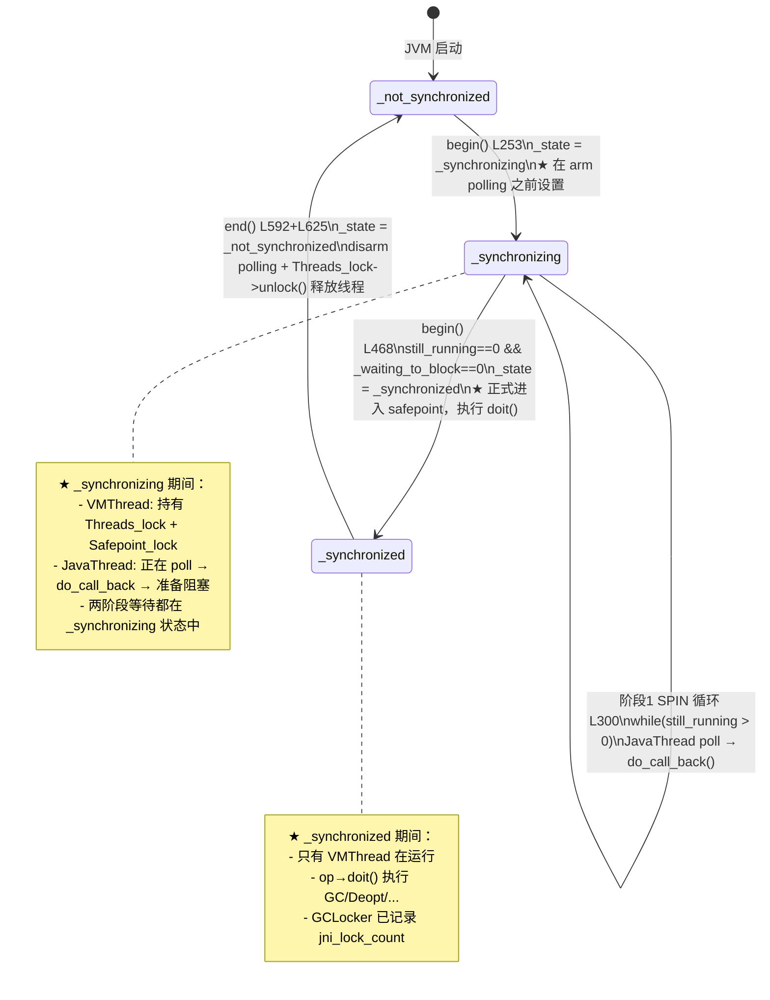

# 01-Safepoint-Protocol — begin/end 三态协议 + 双循环等所有线程 + GCLocker 外部决策

> **标准环境**：OpenJDK 11 slowdebug build, `-Xms8g -Xmx8g -XX:+UseG1GC`, 64-bit Linux x86
> **前置文档**：[07-VMThread], [16-Internal-Locks], [06-Thread-Architecture §五], [10-NonJavaThread]
> **阅读收益**：理解 `begin()` 的 9 步时序、三态状态机为何需要 `_synchronizing`、两阶段等待（SPIN+BLOCK）各自的设计动机、GCLocker 为何不在 begin() 中、`os::serialize_thread_states()` 为何比 per-thread membar 更快

---

## §〇 源文件清单

| # | 文件 | 完整路径 | 核心函数 | 本文角色 |
|---|------|---------|---------|---------|
| 1 | `safepoint.cpp` | `src/hotspot/share/runtime/safepoint.cpp` | `begin()`(:156), `end()`(:527), `block()`(:859), `do_cleanup_tasks()`(:771) | ★★★ begin/end 逐行走读 |
| 2 | `safepoint.hpp` | `src/hotspot/share/runtime/safepoint.hpp` | `SafepointSynchronize`(:59), `SynchronizeState`(:61-66), `ThreadSafepointState`(:228), `do_call_back()`(:170-172) | ★ 三态定义 + 回调判断 |
| 3 | `safepointMechanism.hpp` | `src/hotspot/share/runtime/safepointMechanism.hpp` | `arm/disarm`(:83-84), `polling_type`(:35-38) | ★ arm/disarm 接口 |
| 4 | `os_linux.cpp` | `src/hotspot/os/linux/os_linux.cpp` | `make_polling_page_unreadable()`(:6011), `make_polling_page_readable()`(:6018) | ★ mprotect 系统调用实现 |
| 5 | `g1CollectedHeap.cpp` | `src/hotspot/share/gc/g1/g1CollectedHeap.cpp` | `check_active_before_gc()` 在 Young GC(:3648) 和 Full GC(:1175) | ★ GCLocker 不在 begin() 中的证据 |
| 6 | `vmGCOperations.cpp` | `src/hotspot/share/gc/shared/vmGCOperations.cpp` | `skip_operation()` 中 `is_active_and_needs_gc()`(:75) | ★ GCLocker 在 VM_Operation 层的第二个证据 |

---

## §一 为什么需要 safepoint？— 从 [07] VMThread 的全景到 begin() 的深度

### ❓ VMThread::loop() 调用 begin()，里面发生了什么？

[07-VMThread] 已经讲清楚了 VMThread 的大循环：`VMThread::loop()` 从 `VMOperationQueue` 取出一个 `VM_Operation`，判断其 `Mode`，如果是 `_safepoint` 模式则调用 `SafepointSynchronize::begin()` → `op->doit()` → `SafepointSynchronize::end()`。

但有一个关键问题从未被正面回答：**`begin()` 里面到底发生了什么？** 那不是一句"等所有线程停下来"就完事了。

```
VMThread::loop() ─→ evaluate_operation(op)
                      ├── op->doit_prologue()     ← ★ GCLocker 检查在这里！
                      │     └── 返回 false → 跳过整个 safepoint
                      │     └── 返回 true  → 继续
                      ├── SafepointSynchronize::begin()  ← 本文核心
                      │     ├── L177: 获取 Threads_lock(20)
                      │     ├── L190: 获取 Safepoint_lock(19)  [MutexLocker RAII]
                      │     ├── L196-198: 设计数器
                      │     ├── L253: _state = _synchronizing
                      │     ├── L256-279: arm polling page
                      │     ├── L300-414: 阶段1 SPIN 循环
                      │     ├── L433-474: 阶段2 BLOCK 循环
                      │     ├── L468: _state = _synchronized
                      │     └── L509: do_cleanup_tasks()
                      ├── op->doit()              ← 执行 GC/Deopt/...
                      └── SafepointSynchronize::end()
                            ├── L565: disarm polling page
                            ├── L575-625: _state=_not_synchronized + restart + Threads_lock->unlock()
                            └── L632: 记录 pause_time
```

### ❓ safepoint 期间为什么 VMThread 可以安全持有任意锁？

[16-Internal-Locks] 已经揭示：JVM 的 Mutex 有一个 `_safepoint_check_required` 字段，当线程处于 `_thread_blocked`（即在 safepoint 中）时，rank 检查被豁免。VMThread 在 safepoint 中可以获取任意锁而不触发 rank violation assert。

但还有一个前置问题：`begin()` **入口处的两把锁获取**本身是否违反 Lock Ranking？

```
begin() 入口锁获取序列:
  L177: Threads_lock->lock()         rank=barrier(20, "Threads")
  L190: MutexLocker mu(Safepoint_lock)  rank=safepoint(19, "Safepoint")
                                        ← 20→19 降序 ✓，合法！
```

**关键洞察**：`begin()` 获取 `Threads_lock` 时，`_state` 仍为 `_not_synchronized`——这是正常的降序锁获取，不需要 safepoint 豁免。Lock Ranking 的豁免在 `_state = _synchronized` 之后生效；此外，JavaThread 一旦进入 `_thread_blocked` 状态（在 BLOCK 阶段中 `_state` 仍为 `_synchronizing` 时即可发生），其 rank 检查也会被豁免——豁免与 `_thread_blocked` 状态绑定，而非仅依赖于全局 `_state`。

---

## §二 ★★★ 三态状态机 — `_not_synchronized` → `_synchronizing` → `_synchronized`

### 2.1 SynchronizeState 枚举定义 (safepoint.hpp:61-66)

```cpp
// safepoint.hpp:61-66
enum SynchronizeState {
    _not_synchronized = 0,  // 正常并发运行，所有 JavaThread 自由运行
    _synchronizing    = 1,  // 正在同步：VMThread 在等所有线程到达
    _synchronized     = 2   // 同步完成：只有 VMThread 在跑，JavaThread 全部暂停
};
```

### 2.2 ❓ 为什么需要中间态 `_synchronizing`？为什么不直接从 `_not_synchronized` 跳到 `_synchronized`？

核心答案在 `do_call_back()` 的实现：

```cpp
// safepoint.hpp:170-172
inline static bool do_call_back() {
    return (_state != _not_synchronized);
}
```

**设计逻辑**：`do_call_back()` 只检查 `_state != _not_synchronized`，不检查 `_state == _synchronized`。这意味着：

- `_synchronizing` 是一个**信号**——告诉所有 poll 的线程"VMThread 正在请求 safepoint"，线程看到后立刻开始准备阻塞
- `_synchronized` 是**确认**——所有线程已到达，GC 等 VM 操作可以安全执行

如果没有 `_synchronizing`，而直接从 `_not_synchronized` 跳到 `_synchronized`：
- 线程在 poll 时瞬间从"正常"跳到"已同步"，中间没有"正在请求"的过渡
- 线程无法在 SPIN 阶段区分"正在等别人"和"已经完成了"——两个阶段的语义会混淆

**追问：在 SPIN 阶段（L300），`_state` 是多少？**
→ `_synchronizing`（不是 `_synchronized`！）
→ 线程通过 `do_call_back()` 只检查 `!= _not_synchronized`，所以 `_synchronizing` 就能触发阻塞
→ 但线程真正完成 `_waiting_to_block--` 需要等到 BLOCK 阶段（block() 函数中）

### 2.3 Mermaid 三态转换图



### 2.4 do_call_back() — JavaThread 如何"读到" safepoint 请求

```cpp
// safepoint.hpp:170-172
inline static bool do_call_back() {
    return (_state != _not_synchronized);
}
```

这个函数是 JavaThread 判断"是否应该响应 safepoint"的唯一检查点。它的语义极度简单：

- `_state == _not_synchronized(0)` → 返回 `false` → 线程继续运行
- `_state == _synchronizing(1)` → 返回 `true` → 线程开始阻塞流程
- `_state == _synchronized(2)` → 返回 `true` → 线程不应出现在这里（已在阻塞中）

---

## §三 ★★★ SafepointSynchronize::begin() — 9 步逐行走读

### ❓ 为什么要两阶段等待（spin + block）而不是一个循环？

线程"知道有 safepoint"和"完成状态转换进入 block"是两个步骤——时间差可达数量级：

| 阶段 | 线程在做什么 | 预期耗时 | VMThread 策略 | 为什么 |
|------|------------|---------|-------------|--------|
| SPIN (L300) | 仍在运行，尚未 poll 到 | ~μs（解释器/编译代码路径） | 自旋 + SpinPause | 线程马上就会 poll，不值得上下文切换 |
| BLOCK (L433) | 已确认 safepoint，正做 `_thread_in_vm→_thread_blocked` | ~ms（可能持锁等待） | Monitor::wait() | 状态转换可能因持锁而慢，释放 CPU |

如果用单一循环：SPIN 方式等 BLOCK 阶段的线程→浪费 CPU；Monitor::wait 方式等 SPIN 阶段的线程→上下文切换开销反而更慢。

### 步骤①②：获取 Threads_lock + Safepoint_lock — Lock Ranking 含义

```
safepoint.cpp:177-190

① L177: Threads_lock->lock();
   作用：阻止线程创建/销毁（safepoint 期间线程列表必须稳定）
   rank = barrier(20, "ThreadsLock")

② L190: MutexLocker mu(Safepoint_lock);
   作用：防并发 safepoint + 条件变量（begin() BLOCK 阶段 wait，block() 中最后一个到达的 JavaThread notify_all 唤醒 VMThread）
   rank = safepoint(19, "SafepointLock")

锁获取顺序: Threads_lock(20) → Safepoint_lock(19) → 降序 ✓
```

**为什么是 MutexLocker（RAII）而不是显式 lock/unlock？** 因为 Safepoint_lock 在 begin() 中通过 MutexLocker 持有，BLOCK 阶段 `Safepoint_lock->wait()` 期间自动暂时释放，被 JavaThread 在 `block()` 中 `notify_all()` 唤醒后自动重新获得；end() 中通过另一个 `MutexLocker mu(Safepoint_lock)`（L575）重新获取以保护 `_state` 修改。MutexLocker 保证了 begin()/end() 函数正常或异常返回时 Safepoint_lock 一定被释放。

```cpp
// safepoint.cpp:175-191 关键源码
// By getting the Threads_lock, we assure that no threads are about to start or
// exit. It is released again in SafepointSynchronize::end().
Threads_lock->lock();                                    // L177

assert( _state == _not_synchronized, "trying to safepoint synchronize with wrong state");

int nof_threads = Threads::number_of_threads();         // L181

log_debug(safepoint)("Safepoint synchronization initiated. (%d threads)", nof_threads);

RuntimeService::record_safepoint_begin();

MutexLocker mu(Safepoint_lock);                         // L190
```

### 步骤③④：设计数器 + `_state = _synchronizing` — ★ 先改状态再 arm 的设计

```
safepoint.cpp:192-253

③ L192-198: 复位计数器
    _current_jni_active_count = 0;     // 复位 JNI critical 计数
    _waiting_to_block = nof_threads;   // 等待阻塞的线程数（初始=全部）
    // _waiting_to_block already set in step ③
    int still_running = nof_threads;   // 仍在运行的线程数（初始=全部）

④ L253: _state = _synchronizing;  ← ★ 全文最关键的一行
```

**为什么要先改 `_state` 再 arm polling page？**

这是 `begin()` 设计中最精妙的一步——防止时间窗口漏掉线程：

```
【错误的顺序: 先 arm 再改 _state】
  时间 →
  VMThread:            arm polling ─────── [窗口] ─── 改 _state = _synchronizing
  JavaThread-A:                    poll → do_call_back() → _state=_not_synchronized → 不阻塞 → 漏掉！
  后果: 线程A在arm后立即poll，看到 _state 还是 _not_synchronized → 漏掉 → safepoint 死等/超时

【正确的顺序: 先改 _state 再 arm】
  时间 →
  VMThread:            改 _state=_synchronizing ─── arm polling
  JavaThread-A:                               poll → do_call_back() → _state=_synchronizing → 阻塞 ✓
  JavaThread-B:                        已在 _thread_in_vm → 下一次 poll → 看到 _synchronizing → 阻塞 ✓

  ★ 关键: arm 之前已存在的线程在 arm 后必然看到 _state 已变——没有时间窗口
```

**追问："先改 _state"会不会导致 arm 之前就有线程阻塞？**
不会——arm 之前 polling page 可读，`poll()` 读到 0 直接返回 `false`，`do_call_back()` 根本不在执行路径上。线程必须等 arm（page 变不可读）之后的下一次 poll 才会触发 SIGSEGV → handler → `do_call_back()` → 阻塞。

```cpp
// safepoint.cpp:249-254 关键源码
{
    EventSafepointStateSynchronization sync_event;
    int initial_running = 0;

    _state = _synchronizing;    // L253 — ★ 必须在 arm 之前
```

### 步骤⑤：arm polling page — arm_local_poll vs global serialize

```
safepoint.cpp:255-279

⑤ arm polling page:
   ThreadLocal 模式 (JDK 10+, ThreadLocalHandshakes):
     for each JavaThread: SafepointMechanism::arm_local_poll(cur)  // L259-262
     OrderAccess::fence();                                          // L264
   
   Global 模式 (default, 全局 Polling Page):
     OrderAccess::fence();                                          // L264
     os::serialize_thread_states();                                 // L268
     os::make_polling_page_unreadable();                            // L278
```

**★ `os::serialize_thread_states()` 和 `make_polling_page_unreadable()` 各做什么？为什么不每个线程发一条 membar？**

arm 路径在 Global 模式下有**两道独立的 mprotect**（L267-269 → L277-279），作用不同：

| 调用 | 行号 | 作用 | 保护的页面 | 解决什么问题 |
|------|------|------|-----------|------------|
| `os::serialize_thread_states()` | L268 | 序列化线程状态写入 | **serialize page**（独立页面） | 线程从 native 退出时写 thread_state → 需要被 VMThread 在 SPIN 循环中**读到最新值** |
| `os::make_polling_page_unreadable()` | L278 | 触发页错误 | **polling page** | 编译代码中的 `test` 指令读此页 → SIGSEGV → handler → block() |

**`serialize_thread_states()` 的原理**：JavaThread 从 JNI 返回时，在改 `_thread_state` 之前会写一次 serialize page。VMThread 在 arm 时对该页面做 `mprotect` → **TLB shootdown** 强制所有 CPU 刷新 TLB。这个刷新的副作用是**天然实现了跨核的 store buffer flush**——保证 VMThread 在 SPIN 循环中读到的 `_thread_state` 是最新的。比给每个 JavaThread 发 `mfence` 高效：

| 方案 | 操作 | 开销 (100线程) |
|------|------|---------------|
| per-thread membar | 每个线程退出 native 时发 `mfence` | ~100 × 50ns = 5μs（每次 JNI 返回！） |
| 一次 mprotect | `mprotect` + TLB shootdown | ~1μs（仅 arm 时一次） |

源码注释（safepoint.cpp:221-237）说明的是 `serialize_thread_states()` 的设计动机——**"比在每个 native 调用退出时执行 membar 更高效"**，它不是指"比 begin() 中给每个线程发 membar 快"，而是指"每个线程退出 native 时不发 membar，而是由 VMThread 在 arm 时统一 flush"。二者都触发 TLB shootdown，但目标页面不同：A 操作 serialize page（序列化 thread_state 写入），B 操作 polling page（触发 SIGSEGV）。

Linux 平台实现：
```cpp
// os_linux.cpp:6011-6021
void os::make_polling_page_unreadable(void) {
    if (!guard_memory((char *)_polling_page, Linux::page_size())) {
        fatal("Could not disable polling page");
    }
}

void os::make_polling_page_readable(void) {
    if (!linux_mprotect((char *)_polling_page, Linux::page_size(), PROT_READ)) {
        fatal("Could not enable polling page");
    }
}
```

### 步骤⑥：阶段1 SPIN 循环 (L300-414) — still_running 递减

```
safepoint.cpp:300-414

⑥ while (still_running > 0) {                   // L300
      JavaThreadIteratorWithHandle jtiwh;         // ThreadSMR 安全迭代器
      jtiwh.rewind();
      for (JavaThread *cur = jtiwh.next(); ) {   // L302
          ThreadSafepointState *cur_state = cur->safepoint_state();
          if (cur_state->is_running()) {          // L305
              cur_state->examine_state_of_thread(); // L306 — 检查线程状态
              if (!cur_state->is_running()) {      // L307
                  still_running--;                 // L308 — 线程确认到达
              }
          }
      }
      // 超时检测
      if (SafepointTimeout && safepoint_limit_time < os::javaTimeNanos()) {
          print_safepoint_timeout(_spinning_timeout); // L335
      }
      // 自适应等待策略（三阶段，权衡 VMThread 高优先级可能饿死 mutator）:
      if (ncpus > 1 && steps < 2000) SpinPause();       // L402 — PAUSE指令，不释放CPU
      else if (steps < 4000)     os::naked_yield();     // L405 — 让出但可能立即被调回
      else                       os::naked_short_sleep(1); // L408 — 强制1ms，释放CPU给mutator
  }
```

**关键源码（L300-308）**：
```cpp
while(still_running > 0) {                    // L300
    jtiwh.rewind();                           // L301
    for (; JavaThread *cur = jtiwh.next(); ) { // L302
        ThreadSafepointState *cur_state = cur->safepoint_state();
        if (cur_state->is_running()) {         // L305
            cur_state->examine_state_of_thread(); // L306
            if (!cur_state->is_running()) {    // L307
                still_running--;               // L308
            }
        }
    }
```

**`examine_state_of_thread()` 内部做了什么？** (safepoint.cpp:1090-1145)

```
对每个仍在运行的线程，检查其 JavaThreadState:
  ① _thread_in_native 且有 walkable stack → roll_forward(_at_safepoint) → _type=_at_safepoint
     → _waiting_to_block-- (在 roll_forward 中) + is_running()=false → still_running--
  ② 已被外部 suspend (is_ext_suspended) → roll_forward(_at_safepoint) → 同①，两个计数器都递减
  ③ _thread_in_vm → roll_forward(_call_back) → _type=_call_back
     → is_running()=false → ★ still_running--（SPIN 阶段就递减！）
     → 但线程还未进 block() → _waiting_to_block 不动（留给 BLOCK 阶段）
  ④ 其他状态 (_thread_in_Java 等) → 不改变 _type → is_running()=true → 不递减
     → 线程继续运行，等自己 poll 到
```

**★ 关键**：上述 ③ 是两阶段设计的最精妙之处——`_thread_in_vm` 线程在 SPIN 阶段就被 VMThread 标记为"已到达"（`still_running--`），释放 SPIN 循环压力，但线程真正的状态转换（设 `_thread_blocked` + `_waiting_to_block--`）发生在自己的 `block()` 调用中——这个 gap 正是 BLOCK 阶段存在的理由。

**为什么 SPIN 阶段递减了 still_running 的线程（_call_back）还需要进入 BLOCK 阶段？**
因为 SPIN 的 `still_running--` 只是 VMThread 单方面标记"已识别该线程"——线程本体还在 `_thread_in_vm` 中运行，尚未设 `_thread_blocked` + `_waiting_to_block--`。SPIN 结束 ≠ 线程已停，BLOCK 阶段才是真正等待所有线程完成状态转换。这也是两阶段分离的核心原因。

### 步骤⑦：阶段2 BLOCK 循环 (L433-474) — _waiting_to_block 递减

```
safepoint.cpp:433-474

⑦ while (_waiting_to_block > 0) {              // L433
      log_debug(safepoint)("Waiting for %d thread(s) to block", _waiting_to_block);
      if (!SafepointTimeout || timeout_error_printed) {
          Safepoint_lock->wait(true);            // L436 — ★ 阻塞在条件变量上
      } else {
          // 超时检测：带超时的 wait
          Safepoint_lock->wait(true, remaining_time);
      }
  }
```

**关键源码（L433-436）**：
```cpp
while (_waiting_to_block > 0) {               // L433
    log_debug(safepoint)("Waiting for %d thread(s) to block", _waiting_to_block);
    if (!SafepointTimeout || timeout_error_printed) {
        Safepoint_lock->wait(true);            // L436 — 释放 CPU，等线程 notify
    }
```

**Safepoint_lock 的双重角色**：同一个 Monitor 对象同时充当：
1. **互斥锁**：`MutexLocker mu(Safepoint_lock)` @L190 — 保证只有一个 safepoint 在同步
2. **条件变量（begin↔block 专用）**：`begin()` L436 `Safepoint_lock->wait()` → VMThread 阻塞等 JavaThread；`block()` L912 `Safepoint_lock->notify_all()` → 最后一个到达的 JavaThread 唤醒 VMThread

注意：safepoint 结束时 JavaThread 的释放**不是**通过 `Safepoint_lock->notify_all()`，而是 `end()` L625 `Threads_lock->unlock()` —— JavaThread 在 `block()` L927 `Threads_lock->lock_without_safepoint_check()` 处排队，等 end() 释放。

**两阶段等待对比总结**：

| 维度 | 阶段1 SPIN (L300-414) | 阶段2 BLOCK (L433-474) |
|------|----------------------|------------------------|
| 等什么 | 线程从运行中 poll 到 | 线程完成 `_thread_in_vm→_thread_blocked` 状态转换 |
| 计数器 | `still_running` | `_waiting_to_block` |
| 递减者 | SPIN 循环中的 VMThread 自己减 | 线程在 `block()` 中自己减 |
| 用什么等 | SpinPause / yield / short_sleep | Monitor::wait() — 释放 CPU |
| 为什么用这个 | 线程即将 poll（~μs级），不值得上下文切换 | 状态转换可能因持锁慢（~ms级），应让出 CPU |
| 超时处理 | `print_safepoint_timeout(_spinning_timeout)` | `print_safepoint_timeout(_blocking_timeout)` |
| _state 值 | `_synchronizing` | `_synchronizing` |

### 步骤⑧：`_state = _synchronized` — 正式进入 safepoint

```cpp
// safepoint.cpp:463-499 关键源码
_safepoint_counter ++;                          // L465

// Record state
_state = _synchronized;                         // L468 ☆ 正式进入

OrderAccess::fence();                           // L470 — 确保所有CPU看到新状态

// Update the count of active JNI critical regions
GCLocker::set_jni_lock_count(_current_jni_active_count); // L484

log_info(safepoint)("Entering safepoint region: %s",    // L486
    VMThread::vm_safepoint_description());

RuntimeService::record_safepoint_synchronized();         // L501
```

**注意**：`_state = _synchronized` 在 SPIN 和 BLOCK 都结束后才设置——这意味着在两个等待阶段的整个过程中，`_state` 都是 `_synchronizing`。线程的 `do_call_back()` 不区分 `_synchronizing` 和 `_synchronized`——看到非零就阻塞。

### 步骤⑨：do_cleanup_tasks() — 为什么这些任务必须在 safepoint 中？

```cpp
// safepoint.cpp:771-800 关键源码
void SafepointSynchronize::do_cleanup_tasks() {
    // Parallel cleanup using GC provided thread pool or serial by VMThread
    ParallelSPCleanupTask cleanup(num_cleanup_workers, &deflate_counters);
    cleanup_workers->run_task(&cleanup);
}
```

Cleanup 任务列表（`safepoint.hpp:80-90`）：
1. **Deflate idle monitors** — 回收不再使用的 ObjectMonitor
2. **Update inline caches** — 清理过时的内联缓存
3. **Compilation policy** — 编译策略的 safepoint 工作
4. **Symbol table rehash** — 符号表重哈希（增/删后平衡）
5. **String table rehash** — 字符串常量池重哈希
6. **CLD purge** — 清理 ClassLoaderData
7. **System dictionary resize** — 调整系统字典大小

**为什么这些必须在 safepoint 中做？** 因为它们都需要 STW 保证——遍历数据结构时不能发生并发修改。比如 deflate_idle_monitors 需要遍历所有 ObjectMonitor，如果 JavaThread 同时在操作 monitor 会导致数据竞争。

### 3.8 ★ GCLocker 不在 begin() 中 — 它在 VM_Operation 层的证据

这是本文最容易被误解的点。**在 `SafepointSynchronize::begin()` 的代码中搜索不到 `GCLocker::is_active_and_needs_gc()`。**

GCLocker 检查的位置在 **VM_Operation 层**，不在 safepoint 层：

**证据1 — G1 Young GC 检查** (`g1CollectedHeap.cpp:3648`)：
```cpp
// g1CollectedHeap.cpp:3648 — do_collection_pause_at_safepoint()
if (GCLocker::check_active_before_gc()) {
    return false;  // ← 返回 false → 跳过整个 safepoint
}
```

**证据2 — G1 Full GC 检查** (`g1CollectedHeap.cpp:1175`)：
```cpp
// g1CollectedHeap.cpp:1175 — do_full_collection()
if (GCLocker::check_active_before_gc()) {
    return false;  // ← Full GC 也被放弃
}
```

**证据3 — GC VM_Operation 的 skip_operation()** (`vmGCOperations.cpp:75`)：
```cpp
// vmGCOperations.cpp:75 — VM_GC_Operation::skip_operation()
if (!skip && GCLocker::is_active_and_needs_gc()) {
    skip = Universe::heap()->is_maximal_no_gc();
}
```

**正确的决策流程（双层 GCLocker 检查）**：
```
VMThread::evaluate_operation(VM_GC_Operation)
  ├── op->doit_prologue() — VM_GC_Operation 基类
  │     └── skip_operation() → GCLocker::is_active_and_needs_gc()  ← ★ 第一层
  │           ├── active → return false → VMThread 不调用 begin()
  │           └── inactive → 继续
  ├── IF doit_prologue() 返回 true:
  │     SafepointSynchronize::begin()
  │     op->doit()
  │       └── do_collection_pause_at_safepoint()  ← G1 子类
  │             └── GCLocker::check_active_before_gc() ← ★ 第二层（doit 入口再查一次）
  │                   ├── active → return false → 放弃本次 GC
  │                   └── inactive → 执行 GC
  │     SafepointSynchronize::end()
  └── ELSE:
        跳过整个 safepoint，节省 arm/disarm polling page 的开销
```

**为什么 GCLocker 有双层检查？** `doit_prologue()` 中的 `skip_operation()` 做粗略检查：如果 GCLocker active 且堆已到最大容量（`is_maximal_no_gc()`），直接放弃。如果没到最大容量，不放弃，等 `begin()` 完成后在 `doit()` 中再做精确检查（`check_active_before_gc()`）——因为 `begin()` 本身可能花时间，期间 GCLocker 状态可能改变。这保证了"不在 `begin()` 中做 GCLocker 检查"的同时，也保证了 GC 实际执行时 GCLocker 状态是最新的。

**关键设计决策**：GCLocker 的检查在 VM_Operation 层就完成，VMThread 根本不会为了解决已被 GCLocker 阻止的 GC 而 arm polling page——避免了无意义的 STW 开销。

---

## §四 ★ SafepointSynchronize::end() — 逐行走读

### ❓ end() 的 disarm 和改 _state 顺序是"先改再disarm"还是"先disarm再改"？

**答案取决于模式**：

- **Global 模式（JDK 11 默认）**：先 disarm（L565 `make_polling_page_readable()`），后改状态（L592 `_state = _not_synchronized`，在 MutexLocker 内）
- **ThreadLocal 模式**：先改状态（L580 `_state = _not_synchronized`），后 disarm（L586 `disarm_local_poll()`，也在 MutexLocker 内）

**两种顺序都没有时间窗口问题**，因为：
- disarm 前 JavaThread 还在阻塞中（被 `Threads_lock->lock_without_safepoint_check()` @L927 挂起），不会 poll
- 改 `_state = _not_synchronized` 后线程被 `Threads_lock->unlock()` 释放 → poll 返回 0 → `do_call_back()` 检查 `_state == _not_synchronized` → 返回 `false` → 不阻塞 ✓
- 无论 disarm 和改状态的相对顺序如何，线程的"解除阻塞"和"poll"始终在改状态之后发生（因为 `Threads_lock->unlock()` 在最末尾 L625）

这意味着 end() 没有 begin() 那样的"时间窗口"问题——begin() 必须先改状态再 arm 是因为 arm 后线程立即 poll，而 end() 中被阻塞的线程不会 poll 直到被 unlock 释放。

```cpp
// safepoint.cpp:527-636 — end() 关键源码

void SafepointSynchronize::end() {
    assert(Threads_lock->owned_by_self(), "must hold Threads_lock"); // L529
    EventSafepointEnd event;
    _safepoint_counter ++;                                  // L532

    // ① 先 disarm polling page（在获取 Safepoint_lock 之前）
    if (PageArmed) {
        os::make_polling_page_readable();                   // L565
        PageArmed = 0;                                      // L566
    }

    // ② 获取 Safepoint_lock，改 _state
    {
        MutexLocker mu(Safepoint_lock);                     // L575
        assert(_state == _synchronized, "must be synchronized before ending");
        
        _state = _not_synchronized;                         // L592
        OrderAccess::fence();                               // L593

        // ③ 遍历所有 JavaThread，restart（恢复 _type = _running）
        for (JavaThread *current = jtiwh.next(); ) {
            cur_state->restart();                            // L616
        }

        RuntimeService::record_safepoint_end();              // L621

        // ④ 释放 Threads_lock + Safepoint_lock
        Threads_lock->unlock();                              // L625
    } // ← Safepoint_lock 在 MutexLocker 析构时释放

    Universe::heap()->safepoint_synchronize_end();          // L629

    // ⑤ 记录暂停结束时间
    _end_of_last_safepoint = os::javaTimeMillis();          // L632
}
```

**end() 5 步总结**：
1. **disarm polling** — `make_polling_page_readable()` → 页可读，poll 正常返回
2. **获取 Safepoint_lock，改 `_state = _not_synchronized`** — 线程醒来后看到此状态即知 safepoint 结束
3. **`restart()` 所有线程** — `_type = _running`，清除 `_has_called_back`
4. **`Threads_lock->unlock()`** — 释放所有在 `block()` L927 排队的 JavaThread
5. **记录时间** — `_end_of_last_safepoint` 用于 GuaranteedSafepointInterval 检查

---

## §五 SafepointSynchronize::block() — JavaThread 如何阻塞

### ❓ block() 怎么知道 safepoint 结束了？

`block()` 在 `Threads_lock` 上排队（L927 `lock_without_safepoint_check()`）——不是 `Safepoint_lock`。`end()` 在 L625 `Threads_lock->unlock()` 后所有排队的 JavaThread 被释放，恢复 `_thread_state` 为原值，继续执行。线程在此过程中不需要主动检查 `_state`——`Threads_lock` 的互斥语义天然保证了"end() 释放后才继续"。

`Safepoint_lock` 的角色是 JavaThread ↔ VMThread 之间的通知（`block()` L912 `notify_all()` 唤醒 begin() BLOCK 循环中的 VMThread），而不是 JavaThread 的阻塞等待。

```cpp
// safepoint.cpp:859-932 — block() 关键源码

void SafepointSynchronize::block(JavaThread *thread) {
    // 终止线程特殊处理
    if (thread->is_terminated()) {
        thread->block_if_vm_exited();
        return;
    }

    JavaThreadState state = thread->thread_state();
    thread->frame_anchor()->make_walkable(thread);

    switch(state) {
    case _thread_in_vm_trans:
    case _thread_in_Java:
        // ① 设 _thread_in_vm（假装仍在 VM 中）
        thread->set_thread_state(_thread_in_vm);             // L888

        // ② 获取 Safepoint_lock
        Safepoint_lock->lock_without_safepoint_check();      // L897
        if (is_synchronizing()) {
            _waiting_to_block--;                              // L900
            thread->safepoint_state()->set_has_called_back(true); // L902

            // ③ 如果自己是最后一个 → notify VMThread
            if (_waiting_to_block == 0) {
                Safepoint_lock->notify_all();                 // L912
            }
        }

        // ④ 设 _thread_blocked
        thread->set_thread_state(_thread_blocked);           // L922
        Safepoint_lock->unlock();                            // L923

        // ⑤ 等 safepoint 结束（排 Threads_lock）
        Threads_lock->lock_without_safepoint_check();        // L927
        thread->set_thread_state(state);                     // L930 — 恢复原状态
        Threads_lock->unlock();                              // L931
        break;

    case _thread_in_native_trans:
    case _thread_blocked_trans:
    case _thread_new_trans:
        thread->set_thread_state(_thread_blocked);
        Threads_lock->lock_without_safepoint_check();
        thread->set_thread_state(state);                     // 恢复原状态
        Threads_lock->unlock();
        break;
    }
}
```

### 与 ThreadBlockInVM 的关系

| | `block()` | `ThreadBlockInVM` |
|---|---|---|
| **触发方式** | 被迫暂停（poll → SIGSEGV → handler → block） | 主动声明"我要阻塞" |
| **调用场景** | polling page exception handler | `Mutex::lock()`, `wait()` 等内部阻塞 |
| **线程状态** | `_thread_in_vm` → `_thread_blocked` | `_thread_in_vm` → `_thread_blocked` |
| **阻塞机制** | 获取 `Threads_lock` 排队等 safepoint 结束 | 直接进入 `_thread_blocked`，不排队 |
| **共同终态** | `_thread_blocked` — safepoint 期间不可调度 |

---

## §六 完整时间线：G1 Young GC 的 safepoint 全过程

从某 JavaThread 分配失败到 GC 完成恢复运行的完整序列：

```
时间 →

┌─ JavaThread-N (分配失败) ──────────────────────────────────────────────┐
│ ① 分配失败 → do_collection_pause() → VMThread::execute()                │
│    └── doit_prologue() → Heap_lock->lock()                              │
│        └── skip_operation() → GCLocker::is_active_and_needs_gc()        │
│            → inactive → 继续 → _prologue_succeeded = true              │
│    ★ doit_prologue 只在调用者线程执行一次，VMThread 不再调用            │
│ ② VMOperationQueue::add(op) → notify VMThread                          │
│ ③ 调用者线程阻塞: VMOperationRequest_lock->wait()                       │
│    持有 Heap_lock，在 safepoint 中被 block() 挂起                       │
└─────────────────────────────────────────────────────────────────────────┘
                                    ↓
┌─ VMThread ─────────────────────────────────────────────────────────────┐
│ ④ 被唤醒 → remove_next() → ★ 直接 begin()，不调 doit_prologue          │
│    ★ VM_Operation::evaluate() 只调 doit()，verify: vmOperations.cpp:58-77 │
│                                                                         │
│ ⑤ SafepointSynchronize::begin()  _state=_not_synchronized              │
│     ├── L177: Threads_lock->lock()                rank=20              │
│     ├── L190: MutexLocker mu(Safepoint_lock)      rank=19              │
│     ├── L196: _waiting_to_block = N                                    │
│     ├── L198: still_running = N                                        │
│     ├── L253: _state = _synchronizing        ← 先改状态！               │
│     ├── L264: OrderAccess::fence()                                      │
│     ├── L268: os::serialize_thread_states()  ← TLB shootdown           │
│     ├── L278: os::make_polling_page_unreadable() ← mprotect            │
│     ├── L300-414: SPIN 循环 (still_running--)                           │
│     │      每个 JavaThread poll → do_call_back → _synchronizing →       │
│     │      examine_state_of_thread → still_running--                     │
│     ├── L433-474: BLOCK 循环 (_waiting_to_block--)                      │
│     │      每个 JavaThread block() L900 → _waiting_to_block--            │
│     │      Safepoint_lock->wait()  ← 阻塞等最后一个线程 notify_all()     │
│     ├── L468: _state = _synchronized    ← 所有线程到齐                  │
│     └── L509: do_cleanup_tasks()                                        │
│                                                                         │
│ ⑥ op->doit() — 执行 G1 Young GC                                        │
│                                                                         │
│ ⑦ SafepointSynchronize::end()  _state=_synchronized                    │
│     ├── L565: os::make_polling_page_readable() ← mprotect(PROT_READ)   │
│     ├── L592: _state = _not_synchronized                                │
│     ├── L616: restart() 所有线程                                        │
│     ├── L625: Threads_lock->unlock()                                    │
│     └── L632: _end_of_last_safepoint = now                              │
│                                                                         │
│ ⑧ JavaThread 被 Threads_lock->unlock() 释放 → 恢复 _thread_state      │
│    → 继续执行                                                           │
└─────────────────────────────────────────────────────────────────────────┘
```

**每一步的线程状态、`_state` 值、持有的锁**：

| 步骤 | JavaThread 状态 | `_state` | VMThread 持锁 | 说明 |
|------|----------------|----------|--------------|------|
| ① 检查 GCLocker | 任意 | `_not_synchronized` | 无 | 在 VM_Operation 层，还没进 begin() |
| ⑤ L177 | 任意 | `_not_synchronized` | Threads_lock(20) | 先拿高级别锁 ✓ |
| ⑤ L190 | 任意 | `_not_synchronized` | Threads_lock + Safepoint_lock(19) | 降序 ✓ |
| ⑤ L253 | 任意 | `_synchronizing` | 同上 | ★ 先改状态 |
| ⑤ L278 | 任意 | `_synchronizing` | 同上 | 再 arm polling |
| ⑤ SPIN 循环 | `_thread_in_Java`→poll→handler | `_synchronizing` | 同上 | 线程发现 safepoint |
| ⑤ BLOCK 循环 | `_thread_in_vm`→`_thread_blocked` | `_synchronizing` | 同上 | 线程完成状态转换 |
| ⑤ L468 | `_thread_blocked` | `_synchronized` | 同上 | ★ 正式进入 safepoint |
| ⑥ GC doit() | `_thread_blocked` | `_synchronized` | 同上 + GC 所需锁（豁免检查） | 只有 VMThread 在跑 |
| ⑦ end() | `_thread_blocked`→`_thread_in_Java` | `_not_synchronized` | 同上 → Threads_lock->unlock() | JavaThread 被释放恢复 |

---

## §七 GDB 验证 + 可证伪断言

### 断言 1-3：`_state` 转换验证

**断言 1**：slowdebug 下 `_state` 从 `_not_synchronized(0)` → `_synchronizing(1)` → `_synchronized(2)` 严格按顺序转换

```gdb
# 在 begin() 入口打断点
(gdb) br SafepointSynchronize::begin
(gdb) commands
> silent
> printf "begin() entry: _state = %d\n", SafepointSynchronize::_state
> continue
> end

# 预期输出：_state = 0 (_not_synchronized)
```

```gdb
# 在 L253（_state = _synchronizing）之后打断点
(gdb) br safepoint.cpp:264
(gdb) commands
> silent
> printf "L264 after synchronizing: _state = %d, still_running = %d\n", SafepointSynchronize::_state, still_running
> continue
> end

# 预期输出：_state = 1 (_synchronizing)
```

```gdb
# 在 L468（_state = _synchronized）之后打断点
(gdb) br safepoint.cpp:470
(gdb) commands
> silent
> printf "L470 after synchronized: _state = %d\n", SafepointSynchronize::_state
> continue
> end

# 预期输出：_state = 2 (_synchronized)
```

```gdb
# 在 end() 中改状态后打断点
(gdb) br safepoint.cpp:593
(gdb) commands
> silent
> printf "end() after not_synchronized: _state = %d\n", SafepointSynchronize::_state
> continue
> end

# 预期输出：_state = 0 (_not_synchronized)
```

**可证伪断言 1**：如果看到 `_state` 跳过 `_synchronizing` 直接从 0 到 2，或任何乱序，说明源码版本不匹配或 `#ifdef ASSERT` 未生效。

### 断言 4-5：双循环验证

**断言 2**：SPIN 阶段（L300）`_state` = `_synchronizing`（1），不是 `_synchronized`（2）

```gdb
# 在 SPIN 循环内打断点
# 注意：still_running 是 begin() 局部变量，slowdebug 下可访问；release build 可能需要 info locals
(gdb) br safepoint.cpp:300
(gdb) commands
> silent
> printf "SPIN loop: _state=%d, still_running=%d, _waiting_to_block=%d\n", SafepointSynchronize::_state, still_running, SafepointSynchronize::_waiting_to_block
> continue
> end

# 预期：_state = 1, still_running > 0
```

**断言 3**：BLOCK 阶段结束后（L468 之后）`_state` = `_synchronized`（2），`still_running = 0`

```gdb
# 注意：still_running 是局部变量，slowdebug 下可访问
(gdb) br safepoint.cpp:468
(gdb) commands
> silent
> printf "BLOCK done: _state=%d, still_running=%d, _waiting_to_block=%d\n", SafepointSynchronize::_state, still_running, SafepointSynchronize::_waiting_to_block
> continue
> end

# 预期：_state = 2, still_running = 0, _waiting_to_block = 0
```

**可证伪断言 4**：SPIN 阶段的 `_state` 一定是 1 不是 2。如果在 SPIN 阶段看到 2，说明代码逻辑有误。

### 断言 6：`os::serialize_thread_states()` 的 strace 验证

```bash
# 用 strace 验证 mprotect 系统调用
strace -e trace=mprotect -f java -Xms8g -Xmx8g -XX:+UseG1GC \
  -XX:+PrintSafepointStatistics -XX:PrintSafepointStatisticsCount=1 \
  -jar app.jar 2>&1 | grep -i "PROT_NONE\|PROT_READ"
```

**预期输出**：看到 `mprotect(..., PROT_NONE)` 和 `mprotect(..., PROT_READ)` 交替出现，对应 arm/disarm。

**可证伪断言 5**：如果 strace 中看不到 `mprotect` 调用，可能启用了 ThreadLocal Handshake (`-XX:+ThreadLocalHandshakes`) 或 polling page 初始化失败。

### 断言 7-8：锁获取验证

**断言 6**：`Threads_lock->owned_by_self()` 在 begin() 全过程中为 `true`

```gdb
(gdb) br safepoint.cpp:468
(gdb) commands
> silent
> printf "L468: Threads_lock owned = %d\n", (int)Threads_lock->owned_by_self()
> continue
> end

# 预期：1（true）
```

**断言 7**：`Safepoint_lock` 通过 `MutexLocker` RAII 持有

```gdb
(gdb) br safepoint.cpp:300
(gdb) commands
> silent
> printf "SPIN entry: Safepoint_lock owned = %d\n", (int)Safepoint_lock->owned_by_self()
> continue
> end

# 预期：1（true）
```

**可证伪断言 8**：在 begin() 函数内任意位置，`Threads_lock` 都应当被 VMThread 持有。如果在 L300 处看到 `owned_by_self() == 0`，说明 Lock Ranking 机制或调用路径有问题。

### 断言 9：block() 中 `_thread_state = _thread_blocked`

```gdb
(gdb) br safepoint.cpp:922
(gdb) commands
> silent
> printf "block(): thread=%s, state before blocked=%d\n", thread->name(), thread->thread_state()
> continue
> end

# 预期：线程在 L922 之后 _thread_state = _thread_blocked (8)
```

**可证伪断言 9**：进入 block() 的 JavaThread 必须在 L922 后处于 `_thread_blocked`。如果线程状态不匹配，说明有其他路径修改了线程状态。

### 断言 10：GCLocker 检查不在 begin() 中

```bash
# 在 begin() 代码中搜索 GCLocker
grep -n "is_active_and_needs_gc\|check_active_before_gc" \
  src/hotspot/share/runtime/safepoint.cpp
```

**预期输出**：无结果（或最多有 `#include "gcLocker.hpp"` 和 `set_jni_lock_count`）

```bash
# GCLocker 检查在 VM_Operation 层
grep -n "is_active_and_needs_gc\|check_active_before_gc" \
  src/hotspot/share/gc/shared/vmGCOperations.cpp \
  src/hotspot/share/gc/g1/g1CollectedHeap.cpp
```

**预期输出**：在 vmGCOperations.cpp:75 和 g1CollectedHeap.cpp:1175、3648 等处找到。

**可证伪断言 10**：`SafepointSynchronize::begin()` 中无法搜索到 `GCLocker::is_active_and_needs_gc`。如果找到了，说明 JDK 版本差异或代码被修改。

---

## 可证伪断言汇总

| # | 断言 | 验证方法 | 可证伪条件 |
|---|------|---------|-----------|
| 1 | `_state` 从 0→1→2→0 严格按顺序 | GDB 在 begin/end 入口设断点 | `_state` 跳值或乱序 |
| 2 | SPIN 阶段 `_state = 1` | GDB 在 L300 读 `_state` | `_state != 1` |
| 3 | L468 后 `_state = 2` | GDB 在 L470 读 `_state` | `_state != 2` |
| 4 | `still_running` 在 begin 入口 > 0，SPIN 结束时 = 0 | GDB 在 L300 和 L416 读 | 相等 |
| 5 | `_waiting_to_block` 在 BLOCK 阶段递减到 0 | GDB 在 L433 循环中读 | 不递减 |
| 6 | begin 中没有 `GCLocker::is_active_and_needs_gc` | grep safepoint.cpp | 存在该调用 |
| 7 | `Threads_lock->owned_by_self()` 在 begin 全过程中 true | GDB 在 L468 验证 | false |
| 8 | `Safepoint_lock` 通过 MutexLocker RAII 持有 | GDB 在 L300 验证 owned_by_self | false |
| 9 | block() 后 `_thread_state = _thread_blocked` | GDB 在 L922 后读 | 不是 _thread_blocked |
| 10 | `os::serialize_thread_states()` 触发 mprotect 系统调用 | strace -e mprotect | 没有 mprotect |

---

## 关键 JVM 参数

| 参数 | 默认值 | 作用 |
|------|--------|------|
| `-XX:+SafepointTimeout` | false | 启用 safepoint 超时检测，超时后打印未到达线程 |
| `-XX:SafepointTimeoutDelay` | 10000 (ms) | 超时阈值 |
| `-XX:+PrintSafepointStatistics` | false | 每次 safepoint 打印统计（spin/block/sync/cleanup/vmop 时间） |
| `-XX:+PrintSafepointStatisticsCount` | 0 | 每多少次 safepoint 打印一次 |
| `-XX:+UnlockDiagnosticVMOptions -XX:+LogVMOutput` | — | safepoint 日志到文件 |
| `-XX:+ThreadLocalHandshakes` | false (JDK 11) | 启用 ThreadLocal 轮询（无需全局 mprotect） |
| `-XX:GuaranteedSafepointInterval` | 1000 (ms) | 保证最长 safepoint 间隔（用于触发定期 cleanup） |

## 关键日志

```bash
# 启用 safepoint 统计日志
java -Xms8g -Xmx8g -XX:+UseG1GC \
  -XX:+PrintSafepointStatistics \
  -XX:PrintSafepointStatisticsCount=1 \
  -jar app.jar

# 输出示例:
#          vmop  [threads: total initially_running wait_to_block]  [time: spin block sync cleanup vmop] page_trap_count
# 0.364: G1CollectForAllocation [    12      4      3    ]  [    1     0     1     0    29    ]  0
#                     ▲ 总线程    ▲ 初始运行 ▲ 等block     ▲spin ▲block ▲sync ▲clean ▲vmop
```

**字段含义**：
- `spin`：阶段1 SPIN 循环耗时（ms）
- `block`：阶段2 BLOCK 循环耗时（ms）
- `sync`：begin() 总耗时（≈ spin + block）
- `cleanup`：do_cleanup_tasks() 耗时
- `vmop`：doit() 执行耗时（GC 实际工作时间）
- `page_trap_count`：通过 polling page SIGSEGV 触发的线程数
