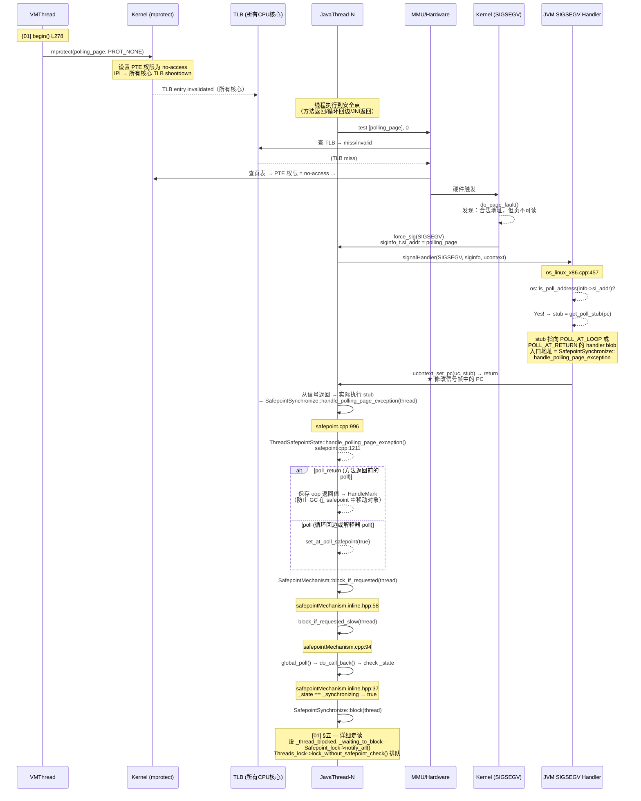

# 02-Polling-Mechanism — 全局 Polling Page vs ThreadLocal Handshake + transition_and_fence + ThreadBlockInVM + 轮询点分布

> **标准环境**：OpenJDK 11 slowdebug build, `-Xms8g -Xmx8g -XX:+UseG1GC`, 64-bit Linux x86
> **前置文档**：[01-Safepoint-Protocol], [16-Internal-Locks §四], [06-Thread-Architecture §五], [09-JavaThread-System]
> **阅读收益**：理解 JavaThread 如何"发现"自己被 arm——从 `make_polling_page_unreadable()` 到 `block()` 的端到端追踪，以及为什么弱一致性模型下 `transition_and_fence` 的 StoreLoad 是必要的

---

## §〇 源文件清单

| # | 文件 | 完整路径 | 核心函数（已验证行号） | 本文角色 |
|---|------|---------|---------------------|---------|
| 1 | `safepointMechanism.inline.hpp` | `src/hotspot/share/runtime/safepointMechanism.inline.hpp` | `global_poll()`(:37), `local_poll()`(:41), `poll()`(:50), `block_if_requested()`(:58) | ★★★ poll 热路径（inline，每个轮询点执行） |
| 2 | `safepointMechanism.hpp` | `src/hotspot/share/runtime/safepointMechanism.hpp` | `PollingType`(:35-38), `arm_local_poll()`(:83), `uses_global_page_poll()`(:65) | ★ arm/disarm 接口 |
| 3 | `safepointMechanism.cpp` | `src/hotspot/share/runtime/safepointMechanism.cpp` | `default_initialize()`(:42), `block_if_requested_slow()`(:94), `initialize_serialize_page()`(:108) | ★ 初始化 + 慢路径 |
| 4 | `interfaceSupport.inline.hpp` | `src/hotspot/share/runtime/interfaceSupport.inline.hpp` | `ThreadBlockInVM`(:297), `transition_and_fence()`(:136), `transition()`(:114), `transition_from_native()`(:158) | ★★ 线程状态转换 + StoreLoad fence + poll 嵌入点 |
| 5 | `os_linux.cpp` | `src/hotspot/os/linux/os_linux.cpp` | `make_polling_page_unreadable()`(:6011), `make_polling_page_readable()`(:6018) | ★ mprotect 系统调用 |
| 6 | `os_linux_x86.cpp` | `src/hotspot/os_cpu/linux_x86/os_linux_x86.cpp` | `JVM_handle_linux_signal()`(:271), polling page 判断(:457-459), implicit null(:511-515) | ★★★ SIGSEGV handler — 三向分流的核心 |
| 7 | `safepoint.cpp` | `src/hotspot/share/runtime/safepoint.cpp` | `handle_polling_page_exception()`(:996), `ThreadSafepointState::handle_polling_page_exception()`(:1211), `block()`(:859) | ★★ SIGSEGV → block 的桥接 + poll_return 特殊处理 |
| 8 | `os.hpp` | `src/hotspot/share/runtime/os.hpp` | `is_poll_address()`(:429) | ★ 判断 fault address 是否在 polling page 范围 |
| 9 | `sharedRuntime.cpp` | `src/hotspot/share/runtime/sharedRuntime.cpp` | `generate_handler_blob()`(:116-126), `POLL_AT_LOOP`, `POLL_AT_RETURN` | ★ stub 生成 — SIGSEGV 怎么路由到 `handle_polling_page_exception()` |
| 10 | `handshake.hpp` | `src/hotspot/share/runtime/handshake.hpp` | `Handshake`(:50), `HandshakeState`(:63), `HandshakeClosure`(:40) | ★ ThreadLocal Handshake 接口 |
| 11 | `handshake.cpp` | `src/hotspot/share/runtime/handshake.cpp` | `execute()`(:389), `process_self_inner()`(:428) | ThreadLocal Handshake 的调度执行 |
| 12 | `templateTable_x86.cpp` | `src/hotspot/cpu/x86/templateTable_x86.cpp` | return 处的 Local poll(:2657-2672) | ★ 解释器轮询点 |
| 13 | `parse1.cpp` | `src/hotspot/share/opto/parse1.cpp` | `add_safepoint()`(:2231) | ★ JIT 轮询点 |
| 14 | `stubGenerator_x86_64.cpp` | `src/hotspot/cpu/x86/stubGenerator_x86_64.cpp` | `generate_safepoint_poll()` | ★ Global Poll 模式下解释器 poll 的 `test` 指令生成 |

---

## §一 为什么需要轮询（Polling）而不是信号（Signal）？

### ❓ VMThread 已经知道所有线程——为什么不直接用 `pthread_kill` 通知每个线程？

[01-Safepoint-Protocol] 已经把 `begin()` 的三态协议讲透了——VMThread 持有了 `Threads_lock`，线程列表是稳定的，`_state` 改为 `_synchronizing` 后 arm polling page。但是 [01] 有一个关键空白：**JavaThread 到底是怎么"发现"自己被 arm 的？**

如果 VMThread 用信号通知每个线程，流程是：
```
for each JavaThread:
    pthread_kill(thread_tid, SR_signum)   // SIGUSR2, 用户态 → 内核态
      → 内核分发信号
        → 线程的 signal handler 执行（在任何位置被打断）
          → handler 需要等到线程自己到达安全点 → 才能进入 _thread_blocked
            → VMThread 收到确认
```

**为什么这个方案被拒绝了？** 四个原因：

1. **O(N) 系统调用**：`pthread_kill` 每条都需要用户态→内核态→信号分发→用户态 handler 的完整路径——数千 CPU cycles 每线程。100 线程 = 数十万 cycles。

2. **★ 信号无 GC-map — 这是最致命的缺陷**。GC 移动对象时需要知道"当前 PC 处哪个寄存器/栈槽存的是 oop 指针"——这叫 **oop map**（也叫 GC map）。JIT 编译器**只在 poll 点生成 oop map**——方法入口、循环回边、方法返回。如果 `pthread_kill` 在线程执行 `*(obj + 12) = new_val` 的半途打断，CPU 不知道 `obj` 是 oop 还是整数，GC 无法安全执行。polling 方案利用硬件**同步 page fault**特性——CPU 保存精确指令指针 → JVM 从 CodeCache 查到对应 nmethod → 获取该 PC 的 oop map → GC 安全执行。

3. **信号+安全点矛盾**：信号在**任何位置**暂停线程，但 oop map 只在安全点有效——信号方案需要线程在 handler 中"自旋等到安全点"，等于在 handler 里重新实现了一遍 polling 逻辑。

4. **确定性**：信号可能被线程阻塞、延迟或与其他信号混淆。polling page 只在代码中预先插入的 poll 点触发——每个触发点的 oop map 都在编译时确定且不可变。

### 1.1 Polling 方案的核心思想：线程自省

```
Polling 方案:
  VMThread:
    ① _state = _synchronizing    （先改状态）
    ② mprotect(polling_page, PROT_NONE)  ← O(1) 系统调用
    ③ 等 JavaThread poll 到

  JavaThread:
    ④ 在安全点执行: test [polling_page], 0   ← O(1) 内存读, 20-30 cycles
    ⑤ → 如果页可读 → 返回 0 → 继续运行
    ⑥ → 如果页不可读 → SIGSEGV → handler → block()
```

**关键性能数据**：

| 操作 | 开销 | 频率 |
|------|------|------|
| `test [mem], 0` (TLB 命中) | 20-30 CPU cycles | 每个安全点 |
| `test [mem], 0` + page fault + SIGSEGV + handler | ~3000-5000 CPU cycles | arm 后每个线程的首次 poll（每 safepoint 每线程 1 次） |
| `mprotect(PROT_NONE)` + TLB shootdown | ~1μs（含 cross-core IPI） | 仅 arm 时 1 次 |
| `pthread_kill` × N 线程 | ~1μs × N（每条数千 cycles） | 如果用信号方案 |

**用 polling 而不是信号的决定性原因**：`begin()` arm polling page 是 O(1) 全局操作，后续线程的"发现"成本是每个线程 O(1) 内存读——正常情况下不触发 page fault、不需要系统调用。这与信号方案 "每个线程都必须经历 pthread_kill 系统调用" 有本质差异。

### 1.2 ❓ 为什么 `test` 指令只 20-30 cycles，且为什么选 `test [mem], 0` 而不是 `cmp` 或 `mov`？

`test [polling_page], 0` 在 disarm 状态下是纯用户态操作：查 TLB（命中）→ 读 L1 → 执行 `test` 并丢弃结果 → `ZF=1`。一共 20-30 cycles。

**❓ 为什么是 `test [mem], 0` 这个特殊形式？** 三个约束：

- **`mov reg, [mem]` 不能用**：会破坏寄存器值，破坏 JIT 的寄存器分配。
- **`cmp byte [mem], 0` 不能用**：会设置 SF/OF/CF/ZF 四个标志位 → JIT 必须在后面跟 `je/jne` 条件分支 → 增加 4-5 字节代码 + 分支预测开销。
- **`test [mem], 0` → AND with 0 → ZF 永远为 1**，对后续代码零影响——JIT 不用插入任何条件跳转。arm 时 page fault 触发 SIGSEGV，disarm 时读内存正常返回→ CPU 直接执行下一条指令。

**poll 指令的唯一目的是"触发 page fault"**——`test [mem], 0` 是对此目的的最小化表达：1 条指令、零副作用、零后续开销。

`pthread_kill` 的路径：用户态 → `syscall` 指令（压栈 + 切换 ring）→ 内核的 `do_signal()` → 检查信号掩码 → 找到目标线程的 `task_struct` → 设置 `siginfo_t` → 排队信号 → 返回用户态 → 目标线程被调度 → 信号 frame 压栈 → `rt_sigreturn` → 用户态 handler。总计数千 cycles——即使 handler 是个空函数。

**这就是为什么 JVM 团队选择了 polling——"让线程自己去查"而不是"我通知你"**——正常情况下不需要任何跨核通信。

### 1.3 与 [01] 的衔接

本文是 [01] 的"下半部分"：
- [01] 讲了 `begin()` arm polling page（L278）和 `end()` disarm（L565）
- 本文讲 arm 之后 JavaThread 怎么"发现自己被 arm"，并最终进入 `block()`

---

## §二 ★★★ Global Page Poll — 从 mprotect 到 block() 的端到端链路

### 2.1 Mermaid 时序图：完整端到端链路

这是本文的灵魂——从 VMThread 的 `make_polling_page_unreadable()` 到 JavaThread 的 `block()`，标注每一步"谁、在哪、做了什么"：



### 2.1b ★ SafepointBlob — signal handler 和 C++ handler 之间的汇编胶水

Mermaid 图中 `ucontext_set_pc(uc, stub) → return` 之后，CPU 不是直接跳到 C++ 函数 `handle_polling_page_exception()`——那样会破坏 JIT 代码的寄存器状态。实际路径是：

```
signal handler (os_linux_x86.cpp:459):
  stub = SharedRuntime::get_poll_stub(pc)
  ucontext_set_pc(uc, stub)     // 修改信号帧中的 PC
  return                          // 信号返回

CPU sigreturn → 从 stub 入口恢复执行:
  ┌─────────────────────────────────┐
  │ SafepointBlob (汇编 stub):      │
  │   ① 保存 caller-saved 寄存器    │
  │     (rcx, rdx, r8-r11, xmm0-7) │
  │   ② 建立 C 调用帧               │
  │   ③ call handle_polling_page_exception  ← 此时才进入 C++ 世界
  │   ④ 恢复 caller-saved 寄存器    │
  │   ⑤ ret → 返回到被中断的 JIT 代码│
  │     (poll 指令的下一条地址)      │
  └─────────────────────────────────┘
```

**为什么必须这样？** C++ 调用约定会破坏 `rcx`, `rdx`, `r8`-`r11` 和 `xmm0`-`xmm7`。在 JIT 代码的 poll 点，这些寄存器可能存着活跃的 oop 或栈指针——如果在 C++ handler 中被覆盖再返回 JIT 代码，后果是随机 crash。

**SafepointBlob 的三种类型**（`sharedRuntime.cpp:116-126`）：

| Stub | 生成条件 | 调用者 | 用途 |
|------|---------|--------|------|
| `POLL_AT_LOOP` | 通用 | 循环回边的 poll | 常规 safepoint 阻塞 |
| `POLL_AT_RETURN` | 通用 | 方法返回前的 poll | 调用 `handle_polling_page_exception`，其内部区分 poll_return → HandleMark 保护 oop 返回值（见 §2.7） |
| `POLL_AT_VECTOR_LOOP` | MaxVectorSize ≥ 32 字节 | 向量化循环的 poll | 需要保存/恢复 YMM/ZMM 向量寄存器 |

### 2.2 ❓ `mprotect(PROT_NONE)` 后，TLB 和页表中到底发生了什么？

`os::Linux::guard_memory()` 被 `make_polling_page_unreadable()`（`os_linux.cpp:6011-6014`）调用，底层通过 `mprotect` 修改 polling page 所在页面的保护属性为 `PROT_NONE`。

```cpp
// os_linux.cpp:6011-6014
void os::make_polling_page_unreadable(void) {
    if (!guard_memory((char *) _polling_page, Linux::page_size())) {
        fatal("Could not disable polling page");
    }
}
```

`mprotect(PROT_NONE)` 在内核中做了两件事：

1. **修改页表项（PTE）**：将 polling page 对应的 PTE 的访问权限设为 no-access。在 x86-64 上，内核可能将 PTE 的 R/W bit 清零 + 设置 NX bit（而不是清 Present bit）——两种策略的效果相同：任何对该页的访问（读/写/执行）都会触发 #PF (Page Fault)。

2. **TLB shootdown**：页表修改只影响当前核心的 TLB。内核通过 IPI（Inter-Processor Interrupt）通知所有其他核心**刷新自己 TLB 中对应 entry**。这是 polling 方案的主要全局开销——IPI 延迟 ~0.1-1μs。

**关键追问：为什么 mprotect 会触发跨核 TLB flush？** 因为如果不 flush，其他核心的 TLB 中可能还缓存着"该页可读"的旧 entry——JavaThread 执行 `test [polling_page], 0` 时 TLB 命中返回正常值 → 不触发 page fault → 线程不知道被 arm → safepoint 漏掉该线程。

### 2.3 `test [polling_page], 0` 指令的生成

poll 在编译代码中被生成为 `safepoint_poll` 节点，编译后变成：

```asm
; x86-64 编译代码中的 poll 指令
test [rip + polling_page_offset], 0   ; 读 polling page，与 0 做 AND
```

源码级生成入口在 `parse1.cpp:2231-2233` 的 `Parse::add_safepoint()`，最终由 `macroAssembler_x86.cpp` 中的 `safepoint_poll()` 生成具体指令。

polling page 地址通过 `os::get_polling_page()` 获取，在内联汇编中直接嵌入为 RIP-relative 地址——这是编译时固定的，不是每次 poll 时查全局变量。

### 2.4 SIGSEGV handler 的实际分流顺序

**这是 JVM 信号处理的核心分支逻辑**。`JVM_handle_linux_signal()`（`os_linux_x86.cpp:271`）处理 SIGSEGV 时，通过 `si_addr`（fault address）和线程状态判断：

```
SIGSEGV 进入 JVM_handle_linux_signal()

① ★ 先检查栈溢出（无论线程状态）
   on_local_stack(si_addr)?
   ├── in_stack_yellow_reserved_zone? → StackOverflowError (Java) 或 fatal (VM)
   └── expanding stack → 扩展栈后 retry

② check cpuinfo_segv_addr (AVX 保存/恢复)

③ if _thread_in_Java:
   ├── os::is_poll_address(si_addr)?  ← ★ polling page trap (L457)
   │     → stub = SharedRuntime::get_poll_stub(pc)
   │
   ├── SIGBUS → MappedByteBuffer (has_unsafe_access)
   ├── SIGFPE → ArithmeticException (除零)
   └── !needs_explicit_null_check(si_addr)?  ← ★ implicit null (L511)
          → stub = continuation_for_implicit_exception(...)

④ if _thread_in_vm + SIGBUS → unsafe access

⑤ is_memory_serialize_page(si_addr)?  ← serialize page trap
     → os::block_on_serialize_page_trap() → retry

⑥ UNRECOGNIZED → VMError::report_and_die()
```

**★★ 为什么 Stack Overflow 必须在 polling page 之前检查？** 因为深层递归导致的栈溢出时，**当前线程已经没有栈空间来执行 signal handler 的栈帧**——若不优先处理栈溢出，signal handler 自己的压栈操作将触发二次 SIGSEGV → 内核强制杀死进程。所以栈溢出检测必须位于最优先位置。

**为什么 polling page 检查在 implicit null 之前（L457 vs L511）？** 这是**特异性原则**——`os::is_poll_address()` 是精确地址范围匹配（`[polling_page, polling_page + page_size)`），而 `needs_explicit_null_check()` 是启发式 `si_addr` 阈值判断（低于某个地址即视为 null check）。精确匹配必须优先于启发式匹配。

关键源码（`os_linux_x86.cpp:457-459`）：

```cpp
if (sig == SIGSEGV && os::is_poll_address((address)info->si_addr)) {
    INST_LOG_SIGNAL_SAFE("..._thread_in_Java -> polling page (Safepoint)");
    stub = SharedRuntime::get_poll_stub(pc);
}
```

`os::is_poll_address()` 的实现（`os.hpp:429`）：

```cpp
static bool is_poll_address(address addr) { 
    return addr >= _polling_page && addr < (_polling_page + os::vm_page_size()); 
}
```

**关键**：判断逻辑极其简单——fault address 是否落在 polling page 的一页范围内。与 polling page 的**精确地址**无关（`test` 指令可能读 polling page 的任意偏移，x86-64 的 RIP-relative 寻址偏移有范围限制）。

### 2.5 ❓ polling page fault 和 implicit null check 都是 SIGSEGV——怎么不混淆？

两种 SIGSEGV 使用了完全不同的内存区域：

| | Polling Page | Implicit Null Check |
|---|---|---|
| fault 地址范围 | `[_polling_page, _polling_page + page_size)` | `[0, page_size)` 低地址保护页 |
| 判据 | `os::is_poll_address(addr)` | `!needs_explicit_null_check(addr)` |
| handler | `handle_polling_page_exception()` → `block()` | `continuation_for_implicit_exception()` → throw NPE |
| 线程状态要求 | `_thread_in_Java` 时检查 polling page | 也需 `_thread_in_Java` |
| 检查顺序 | **先检查**（L457，优先匹配） | **后检查**（L511-515） |

**关键**：polling page 使用 JVM 显式分配的独立页面（`os::reserve_memory` → 普通堆外内存），而 implicit null check 依赖 OS 保护的低地址页面（通常第一页被内核保护，访问地址 0 触发 SEGV）。二者地址范围不重叠，通过 `si_addr` 判断就能区分。

### 2.6 `handle_polling_page_exception()` → `block()` 调用链

```cpp
// safepoint.cpp:996-1013
void SafepointSynchronize::handle_polling_page_exception(JavaThread *thread) {
  assert(thread->is_Java_thread(), "polling reference encountered by VM thread");
  assert(thread->thread_state() == _thread_in_Java, "should come from Java code");
  if (!ThreadLocalHandshakes) {
    assert(SafepointSynchronize::is_synchronizing(), "polling encountered outside safepoint");
  }

  if (PrintSafepointStatistics) {
    inc_page_trap_count();
  }

  ThreadSafepointState* state = thread->safepoint_state();
  state->handle_polling_page_exception();    // → safepoint.cpp:1211
}
```

`ThreadSafepointState::handle_polling_page_exception()`（`safepoint.cpp:1211`）做了两步核心操作：

1. **区分 poll_return 和 poll**：通过 `nm->is_at_poll_return(real_return_addr)` 判断。方法返回点的 poll 需要特殊处理——返回值可能是 oop，GC 时会被移动，需要先 `HandleMark` 保护。

2. **调用 `block_if_requested()`**：

```cpp
// safepoint.cpp:1256-1257（poll_return 分支）
SafepointMechanism::block_if_requested(thread());
```

### 2.7 poll_return 的特殊处理——oop 返回值保护

这是 GC 和 safepoint 交互的微妙细节。方法返回前 poll 时，**返回值可能还不在栈上**（在寄存器中）。如果直接进入 safepoint → GC 发生 → oop 被移动 → 寄存器中的值变为 stale pointer → 崩溃。

```cpp
// safepoint.cpp:1241-1262 — poll_return 的处理
if (nm->is_at_poll_return(real_return_addr)) {
    bool return_oop = nm->method()->is_returning_oop();
    HandleMark hm(thread());
    Handle return_value;
    if (return_oop) {
        oop result = caller_fr.saved_oop_result(&map);
        return_value = Handle(thread(), result);  // ★ 保存到 Handle
    }

    SafepointMechanism::block_if_requested(thread());  // ★ GC 可能发生

    if (return_oop) {
        caller_fr.set_saved_oop_result(&map, return_value());  // ★ 恢复
    }
}
```

**`POLL_AT_RETURN` stub**（`sharedRuntime.cpp:124`）和 `POLL_AT_LOOP` stub（L123）生成不同的 stub blob，共用同一个处理函数 `handle_polling_page_exception`，但传入 `POLL_AT_RETURN` 标志——这决定了上面的 `is_at_poll_return()` 返回值。

### 2.8 `global_poll()` 在 `block_if_requested_slow()` 中被再次调用——不是"双保险"，是竞态窗口的**必要条件**

当 `end()` disarm polling page（`os_linux.cpp:6018-6021` → `mprotect(PROT_READ)` → 页可读），后续 poll 点执行 `test [polling_page], 0`：
- **不触发 SIGSEGV**（页可读，正常读返回 0）

但这里有一个关键竞态窗口——**为什么 `handle_polling_page_exception()` 的 handler 中还要再次调用 `global_poll()`？**

```
竞态窗口：SIGSEGV 触发后但 handler 执行前，safepoint 可能已经结束

时间 →
  VMThread:      end() → _state = _not_synchronized → disarm(polling_page)
                                  ↑
  JavaThread:   test [polling_page] → SIGSEGV! → signal handler 执行
                                  ↑
              页此时还是 PROT_NONE，但 _state 已经 _not_synchronized
              如果 handler 直接调用 block() → 死等永远不会来的 safepoint！
```

**`block_if_requested_slow` 的源码（`safepointMechanism.cpp:94-101`）正是这个竞态窗口的保护**：

```cpp
void SafepointMechanism::block_if_requested_slow(JavaThread *thread) {
  if (global_poll()) {           // ★ 再次检查 _state
    SafepointSynchronize::block(thread);   // _state == _synchronizing → 进入 block
  }                                  // _state == _not_synchronized → 跳过，直接返回
  // ... handshake 检查省略
}
```

**如果这里没有 `global_poll()` 的第二次检查**，路径将是：SIGSEGV → handler → `handle_polling_page_exception` → `block_if_requested_slow` → 直接 `block()` → `block()` 内部再次检查 `is_synchronizing()` → 发现 `_state = _not_synchronized` → 跳过阻塞逻辑 → 返回。**函数不会崩溃**（`block()` 的 switch 明确处理 `_thread_in_Java`），但代价高昂：

```
没有 global_poll() → block() 内部白白执行：
  ① lock(Safepoint_lock)    → 检查 is_synchronizing() → false → unlock
  ② lock(Threads_lock)      → unlock（无人排队等）
  ③ 设 _thread_blocked → 立刻恢复 _thread_in_Java
共计 2 对 lock/unlock + 状态切换 → ~100ns 浪费
```

**`block()` 自己也能正确处理竞态窗口，但 `global_poll()` 的第二次检查把这些不必要的锁操作提前过滤掉了。** 这才是竞态保护的真正动机。

**总结**：`global_poll()` = `SafepointSynchronize::do_call_back()` = `_state != _not_synchronized`。它在"信号已触发但 handler 尚未执行 `block()`"的极窄时间窗口内，重新验证 safepoint 是否仍然活跃——如果 safepoint 已结束，直接跳过 `block()`，省去无意义的锁开销。

---

## §三 ★★ ThreadLocal Handshake — 无 mprotect 的轮询

### 3.1 ❓ 为什么 Global Page Poll 已经很好了，还需要 ThreadLocal Handshake？

**TLB shootdown 的成本**是核心动机。每次 arm/disarm 都要做 `mprotect` → IPI → 刷新所有核心的 TLB。对于高频 safepoint（GuaranteedSafepointInterval=1000ms 的 cleanup），这个成本可以被摊销；但对于**单线程握手**——比如只撤销一个线程的偏向锁——全局 TLB flush 完全浪费。

ThreadLocal Handshake 把"信号"放在线程私有的内存位置：
- arm：对目标线程的 `_poll_data` 字段做一次**普通 store**（`*polling_page_addr() = armed_value`，用户态，<10ns）。配合 `arm_local_poll_release()` 时携带 `release_store` 语义（x86 TSO 下仍是普通 store，但保证之前的写——如 `_operation = handshake_op`——先于 poll flag 对远程 CPU 可见）
- 不需要 `mprotect`，不需要 TLB shootdown
- 支持非全局暂停——可以只和某一线程握手

### 3.2 两种模式对比表

| 维度 | Global Page Poll (JDK 11 默认) | ThreadLocal Handshake (JDK 10+) |
|------|------------------------------|----------------------------------|
| arm 方式 | `mprotect(polling_page, PROT_NONE)` — 系统调用 | `store(thread->_poll_data, armed_value)` — 用户态（release 语义） |
| arm 开销 | TLB shootdown + IPI — ~1μs | 1 条 store — ~10ns |
| poll 开销（disarm 时） | `test [polling_page], 0` — 20-30 cycles（TLB 命中） | `test [thread->_poll_data], bit` — ~5 cycles |
| poll 开销（arm 时） | page fault → SIGSEGV → handler — ~5000 cycles | 单次 load + 分支 — ~30 cycles |
| 影响范围 | 全局 — 所有核心 TLB flush | 仅目标线程 — 无跨核操作 |
| JIT poll 点插入 | `safepoint_poll` IR node → `test [global_page]` | `safepoint_poll` IR node → `test [thread->_poll_data]` |
| arm/disarm 触发者 | begin()/end() → VMThread | Handshake::execute() → VMThread 或任意线程 |
| 并发粒度 | 必须全局 STW | 可单线程握手 + 多线程并行握手 |
| 最小延迟 | ~5μs（mprotect + TLB reload + signal） | ~50ns（store + flag check） |
| 稳定性 | JDK 1.2+，极其成熟 | JDK 10+，默认关闭（需 `-XX:+ThreadLocalHandshakes`） |
| 启用方式 | 默认 | `-XX:+ThreadLocalHandshakes` + JIT 编译时 `THREAD_LOCAL_POLL` 宏 |
| `SafepointMechanism::poll()` | `global_poll()` → `do_call_back()` | `local_poll(thread)` → `local_poll_armed()` |
| `block_if_requested()` | **唯一路径**：直接调用 `block_if_requested_slow()` | 快路径：先检查 `!local_poll_armed()` → 不 arm 则 return |

### 3.3 ThreadLocal Handshake 的 arm/disarm 实现

```cpp
// safepointMechanism.inline.hpp:65-67
void SafepointMechanism::arm_local_poll(JavaThread* thread) {
  thread->set_polling_page(poll_armed_value());
}
```

`_poll_armed_value` 和 `_poll_disarmed_value` 在初始化时设置（`safepointMechanism.cpp:42-91`）：
- **ThreadLocal 模式**：分配两个连续页，bad_page (PROT_NONE) + good_page (PROT_READ)。武装时 `_poll_data = bad_page + poll_bit`，解除时 `_poll_data = good_page`。`local_poll_armed()` 只检查 `_poll_data & poll_bit`（**不读内存，不触发 page fault**）。**❓ 那 bad_page 的 PROT_NONE 是干什么的？** 这是防御性保护——正常代码永远不解引用 bad_page 地址（只检查其值），但如果出现 bug 导致误解引用，立即 SIGSEGV 暴露而非静默读坏数据。实际 poll 机制中，`_poll_data` 作为一个**地址值的 bit 位编码**使用，poll_bit=8 编码在指针的最低有效字节中。
- **Global 模式**：分配一页，初始 PROT_READ。`_polling_page` 指向此页，通过 `mprotect(PROT_NONE/READ)` arm/disarm。

### 3.4 ❓ 为什么 JDK 11 默认还是 `ThreadLocalHandshakes=false`？

1. **JIT 遗漏风险**：ThreadLocal Handshake 需要 JIT 在编译代码中插入**基于线程本地 flag 的 poll 点**（不是基于全局 polling page 的 `test` 指令漏过 SIGSEGV）。如果某个执行路径上 JIT 没有正确插入 poll 点，该路径上的线程就永远不会被 handshake 暂停。

2. **稳定性优先**：Global Page Poll 从 JDK 1.2 开始使用，经过了 20 年验证。ThreadLocal Handshake 在 JDK 10 中引入，JDK 11 默认为 off 是保守策略。

3. **实际上是 JDK 12 才默认开启**：https://bugs.openjdk.org/browse/JDK-8208887——在 OpenJDK 12 b18 中 `ThreadLocalHandshakes` 的默认值从 false 改为了 true。

4. **代码中两条路径都写了**：因为 JIT 生成的 poll 代码是**编译时**决定的——如果 `ThreadLocalHandshakes=true`（编译时宏 `THREAD_LOCAL_POLL` 已定义），JIT 生成基于线程本地 flag 的 `test` 指令；如果 `false`，生成基于全局 polling page 的。解释器中的 poll 也类似（`templateTable_x86.cpp:2657` 用 `uses_thread_local_poll()` 做条件判断）。

---

## §四 ★★★ `transition_and_fence()` — StoreLoad 屏障的必要性

### 4.1 `transition_and_fence()` vs `transition()` — 差异在哪？

两个函数都在 `interfaceSupport.inline.hpp` 中定义：

```cpp
// interfaceSupport.inline.hpp:114-128 — transition()
static inline void transition(JavaThread *thread, JavaThreadState from, JavaThreadState to) {
    thread->set_thread_state((JavaThreadState)(from + 1));  // 进入过渡态
    InterfaceSupport::serialize_thread_state(thread);       // ← 非 handler 版本
    SafepointMechanism::block_if_requested(thread);         // ← ★ poll！
    thread->set_thread_state(to);                           // 写入目标状态
}

// interfaceSupport.inline.hpp:136-148 — transition_and_fence()
static inline void transition_and_fence(JavaThread *thread, JavaThreadState from, JavaThreadState to) {
    thread->set_thread_state((JavaThreadState)(from + 1));
    InterfaceSupport::serialize_thread_state_with_handler(thread);  // ← 带 handler 版本
    SafepointMechanism::block_if_requested(thread);                 // ← ★ poll！
    thread->set_thread_state(to);
}
```

**共同点**：两者都走"过渡态（from+1）→ `serialize_thread_state` → `block_if_requested`（含 poll）→ 写 to"的流程。

**差异**：`serialize_thread_state` 的分支策略决定了 fence 的方式：

```cpp
// interfaceSupport.inline.hpp:82-97
static void serialize_thread_state_internal(JavaThread* thread, bool needs_exception_handler) {
    if (os::is_MP()) {
        if (UseMembar) {
            OrderAccess::fence();                              // ← ★ StoreLoad fence！
        } else {
            // store to serialize page so VM thread can do pseudo remote membar
            if (needs_exception_handler) {
                os::write_memory_serialize_page_with_handler(thread);
            } else {
                os::write_memory_serialize_page(thread);       // ← 写序列化页
            }
        }
    }
}
```

**两个分支**：
- `UseMembar=true` → 直接 `OrderAccess::fence()` (x86: `mfence`) — StoreLoad 屏障
- `UseMembar=false` → 写一次 serialize page — 这个写入配合 `begin()` L268 的 `os::serialize_thread_states()` 间接实现跨核 store buffer flush

不论哪种分支，**效果等价于 StoreLoad fence**——保证 `set_thread_state(to)` 这条存储在 `block_if_requested` 的 load 之前被全局可见。

**调用场景**：

| 调用方 | 用哪个函数？ | 为什么？ |
|--------|------------|---------|
| `ThreadInVMfromJava` 析构（返回到 Java） | `transition()` | 线程回到 `_thread_in_Java`。VMThread 的 SPIN 确实会检查所有 running 线程——但 `_thread_in_Java` 的 `ThreadSafepointState::_type` 仍是 `_running`（非 `_call_back` 或 `_at_safepoint`）。VMThread 不会因为看到 `_thread_in_Java` 就 `still_running--`——它等待线程**自己在 poll 点（①②）响应**。因此状态转换没有"到达"语义，无需 StoreLoad fence |
| `ThreadBlockInVM` 构造（vm→blocked） | `transition_and_fence()` | 线程进入 `_thread_blocked`，VMThread 在 SPIN 中无锁读 `_thread_state`——需要 fence 保证可见性 |
| `ThreadBlockInVM` 析构（blocked→vm） | `transition_and_fence()` | 线程恢复 `_thread_in_vm`，VMThread 可能在下一次 SPIN 中读此状态 |
| `ThreadInVMfromNative` 析构（vm→native） | `transition_and_fence()` | 进入 native，VMThread 发现后 roll_forward——需要 fence |
| `ThreadInVMfromNative` 构造（native→vm） | `transition_from_native()` | 此函数内部直接 `SafepointMechanism::poll()` + `transition_to`——它自己管理 fence |

### 4.2 ❓ 如果 `transition_and_fence` 没有 StoreLoad，具体会发生什么？

这是"隐藏读者"问题的经典案例。

```
【没有 fence 的时间线】：

JavaThread CPU (core-1):                VMThread CPU (core-2):
──────────────────────────              ─────────────────────────
set_thread_state(_thread_blocked)       
  → 写入 store buffer, 未刷到 L1       

                                        SPIN 循环: examine_state_of_thread()
                                        thread_state = _thread_in_vm  ← ★ 旧值！
                                        
                                        → 认为线程还在 VM 中运行
                                        → 不 roll_forward
                                        → 继续 SPIN

                                        ... SPIN ... SPIN ...

                                        → SafepointTimeout → 超时打印
                                        → 线程已经在 _thread_blocked
                                        但 VMThread 看不到！
```

**为什么需要 StoreLoad？** 因为 `examine_state_of_thread()` 在 SPIN 循环中无锁读取 `_thread_state`——这是 VMThread 侧唯一判断线程是否到达的方式。JavaThread 是先写再读（`set_thread_state` → `poll()`），StoreLoad 保证写对全局可见后再读。

### 4.3 与 [01] `begin()` 中 `OrderAccess::fence()` 的关系

这是 Java 并发模型中的"消息传递"模式的**对偶问题**：

| | [01] begin() L264 fence | 本文 transition_and_fence |
|---|---|---|
| 写者 | VMThread（写 `_state = _synchronizing`） | JavaThread（写 `_thread_state = _thread_blocked`） |
| 顺序保证 | 写 `_state` 发生在 arm polling page **之前** | 写 `_thread_state` 发生在 poll（`SafepointMechanism::block_if_requested()` 内部）**之前** |
| 隐藏读者 | JavaThread（poll 后读 `_state` 通过 `do_call_back()`） | VMThread（SPIN 循环中无锁读 `_thread_state`） |
| 没有 fence 的后果 | JavaThread 看到旧 `_state` → 认为没 arm → 不阻塞 → 线程漏掉 | VMThread 看到旧 `_thread_state` → 认为线程未到达 → 死等 |

两边都是"先写后读"模式——fence 保证写对读可见，形成线程间的 happens-before 关系。

---

## §五 ★★ ThreadBlockInVM — 构造/析构 + 不对称的 poll

### 5.1 构造/析构都调用 `transition_and_fence`（都含 poll），但语义不同——为什么析构 poll 可能阻塞而构造 poll 总是 no-op？

```cpp
// interfaceSupport.inline.hpp:297-309
class ThreadBlockInVM : public ThreadStateTransition {
 public:
  ThreadBlockInVM(JavaThread *thread)
  : ThreadStateTransition(thread) {
    thread->frame_anchor()->make_walkable(thread);
    trans_and_fence(_thread_in_vm, _thread_blocked);  // poll via transition_and_fence
  }
  ~ThreadBlockInVM() {
    trans_and_fence(_thread_blocked, _thread_in_vm);  // poll via transition_and_fence
  }
};
```

**两者都调用 `trans_and_fence` → 内部都 poll**（`transition_and_fence` 中 `block_if_requested` → `block_if_requested_slow` → `global_poll()`）。核心差异在于 **poll 的后果**：

**构造时（vm→blocked）：poll 可能触发 `block()` + 完整 safepoint 周期，但总是安全——不是 no-op。**
线程**主动声明**"我要去阻塞了"——`_thread_in_vm → _thread_blocked`。构造中 `global_poll()` 被调用：
- 如果此时 safepoint 正在进行（`_state = _synchronizing`）→ `block()` → 线程在 `block()` 中阻塞 → `block()` 返回后 `_thread_state` 恢复为原值 → ctor 继续设 `_thread_blocked` → VMThread 的 SPIN 循环自然看到 `_thread_blocked` → 视为到达 ✓
- 如果此时没有 safepoint（`_state = _not_synchronized`）→ `global_poll()` 返回 `false` → `block_if_requested_slow` 直接返回 → 无论如何线程最终都是 `_thread_blocked` → VMThread 下次 SPIN 看到此状态 ✓
- **路径统一且安全**：不管 poll 结果如何，线程最终进入 `_thread_blocked`，对 VMThread 而言等价于"已到达"。

**析构时为什么必须 poll？**

线程从 `_thread_blocked` 恢复为 `_thread_in_vm`。关键问题是：线程阻塞期间 VMThread 可能发起了**新的 safepoint**。线程从阻塞恢复到 VM 代码中，如果：

1. 直接恢复执行而不 poll → 线程在 `_thread_in_vm` 中运行 → VMThread 的 SPIN 循环看到线程已在 VM 中 → 线程**需要响应 safepoint**
2. 但线程不在安全点位置（它正在从阻塞恢复到 VM 代码中） → 必须要等线程自己 poll 才能停

所以析构时：`transition_and_fence` 保证状态变化被 VMThread 看到 → 然后 `block_if_requested` 中的 poll 检查 → 如果 `_state = _synchronizing` → 进入 `block()` → 停。

### 5.2 构造/析构对比表

| 维度 | 构造（vm→blocked） | 析构（blocked→vm） |
|------|-------------------|---------------------|
| 状态转换 | `_thread_in_vm → _thread_blocked` | `_thread_blocked → _thread_in_vm` |
| 都 poll？ | ✅ poll（`transition_and_fence` 内含） | ✅ poll（`transition_and_fence` 内含） |
| poll 可能阻塞？ | ❌ poll 总是 no-op（线程正要声明阻塞，即使 safepoint 活跃，`block()` 返回后 ctor 继续设 `_thread_blocked`，对 VMThread 等价于"已到达"） | ✅ poll 可能触发 `block()`（线程从阻塞恢复，可能在阻塞期间新 safepoint 开启了——必须立即响应） |
| VMThread 的视角 | 构造后→ 线程是 `_thread_blocked` → SPIN 视为已到达 | 析构后→ 线程是 `_thread_in_vm` → SPIN 需要线程自己 poll |
| 需要 fence？ | ✅ `transition_and_fence` | ✅ `transition_and_fence` |
| 典型使用场景 | `Mutex::lock()` 等待、`Monitor::wait()` | 锁获取完成、wait 被唤醒 |

### 5.3 使用场景追踪

1. **`Mutex::lock()` 等锁**：线程在 `ThreadBlockInVM` 中阻塞等锁 → 允许 safepoint 在等锁期间进行。析构时 poll 检查是否存在待处理的 safepoint。

2. **`Monitor::wait()`**：线程进入 `ThreadBlockInVM`，释放 monitor，在条件变量上等待。被 `notify()` 唤醒后 → 析构 poll → 检查 safepoint。

3. **JNI 调用**：`ThreadInVMfromNative` 构造 → `transition_from_native(native→vm)` → 内部调用 `SafepointMechanism::poll()` 检查 safepoint。

4. **GC 的 `VM_Operation::doit()` 内部**：GC 在 `_state = _synchronized` 期间执行，不需要 `ThreadBlockInVM`（所有 JavaThread 已在 `_thread_blocked` 中）。

### 5.4 `ThreadBlockInVM` vs `block()` 对比

| 维度 | `ThreadBlockInVM` | `block()` |
|------|-------------------|-----------|
| 触发方式 | 主动声明：线程即将阻塞 | 被迫暂停：poll → SIGSEGV → handler → block |
| 调用源头 | JVM 内部代码（`Mutex::lock()`, `Monitor::wait()` 等） | polling page SIGSEGV handler |
| 状态转换 | `_thread_in_vm → _thread_blocked`（通过 `transition_and_fence`） | `_thread_in_Java/_thread_in_vm_trans → _thread_in_vm → _thread_blocked` |
| 是否需要 `transition_and_fence` | ✅（fence 保证 VMThread 看到 `_thread_blocked`） | 不需要单独的 fence（在 `block()` 内有自己的锁协议） |
| 阻塞机制 | 直接进入 `_thread_blocked`，不排队 `Threads_lock` | 在 `Threads_lock` 上排队等 `end()` 释放 |
| VMThread 视角 | SPIN 循环看到 `_thread_blocked` → 视为到达 | SPIN 循环看到 `_thread_in_vm` → roll_forward(_call_back) |

---

## §六 ★ 轮询点分布 — 为什么这 4 个就够了？

### ❓ 如果漏掉一个轮询点，会有什么后果？

VMThread 在 SPIN 循环中永远等不到该线程响应 safepoint → SafepointTimeout → 超时告警 → 其他线程全部挂起（在 `Threads_lock` 上排队）→ 系统卡死。

**但 JVM 通过 4 个精心设计的 poll 点保证了全覆盖。**

### 6.1 4 个轮询点的位置和必要性论证

#### ① 解释器方法返回 & 回边

```asm
; templateTable_x86.cpp:2657-2672 — interpreter return 处的 poll
; ★ 注意：这段代码只在 uses_thread_local_poll() == true 时激活
;     JDK 11 默认 Global Poll 模式下，解释器的 poll 走另一条路径
testb [r15 + polling_page_offset], SafepointMechanism::poll_bit()
jz    no_safepoint
; → call InterpreterRuntime::at_safepoint → SafepointMechanism::poll()
```

**覆盖场景**：所有纯解释执行的线程（`-Xint` 模式）。

**★★ JDK 11 默认 Global Poll 模式下的实际路径**：上面的代码块是 ThreadLocal Handshake 专用的。Global Poll 模式下（`uses_thread_local_poll() == false`），`if` 分支不执行 → 解释器**不在此处显式 poll**。Global 模式下，解释器的 poll 由 `StubGenerator::generate_safepoint_poll()`（`stubGenerator_x86_64.cpp`）生成的独立 stub routine 提供——该 stub 对 polling page 做 `test` 读，解释器在方法返回/回边的 dispatch 路径中跳转至此 stub。两种模式下解释器的 poll 路径不同：Global 走 stub 间接调用，ThreadLocal 走条件编译内联 poll。

#### ② JIT 编译代码中的循环回边

```cpp
// parse1.cpp:2231-2233 — C2 JIT 的 safepoint 插入入口
void Parse::add_safepoint() {
  // See if we can avoid this safepoint: 消除无外部可见副作用的安全性...
```

JIT（C1 和 C2）在 `if`/`for`/`while` 的 back-branch 处插入 `safepoint_poll` IR node。编译后生成 `test [polling_page], 0` 或 ThreadLocal 版本的 `test`。

**★ C2 的 safepoint 消除优化**：C2 可能会从**计数循环（counted loop）**中消除 poll 点——如果循环迭代次数编译时已知且"不太多"，poll 被消除以提升性能。`UseCountedLoopSafepoints=true`（全局 flag，默认 `true`，非 G1 特有）保证即使被消除的计数循环也保留 poll 点。

**为什么必须在循环回边处 poll？** 因为编译代码可以无限循环而不返回！如果不在循环回边处 poll，无线循环里的线程永远无法被 safepoint 暂停。方法返回点的 poll 覆盖了"不循环"的代码路径，循环回边处的 poll 覆盖了"循环运行"的路径。

#### ③ JNI 返回

```cpp
// interfaceSupport.inline.hpp:158-177 — transition_from_native()
static inline void transition_from_native(JavaThread *thread, JavaThreadState to) {
    thread->set_thread_state(_thread_in_native_trans);
    InterfaceSupport::serialize_thread_state_with_handler(thread);
    if (SafepointMechanism::poll(thread) || thread->is_suspend_after_native()) {
        JavaThread::check_safepoint_and_suspend_for_native_trans(thread);
    }
    thread->set_thread_state(to);
}
```

**覆盖场景**：线程从 native 代码（JNI/系统调用）返回到 JVM 管理的代码。

**为什么必须在 JNI 返回时 poll？** 线程在 native 中完全不 poll（native 代码不受 JVM 控制，无法插入 poll 点）。从 `_thread_in_native` 返回时是第一个"可控点"——必须在此处检查是否有待处理的 safepoint。实际上这就是 [01] SPIN 循环中 `examine_state_of_thread()` 对 `_thread_in_native` 线程的处理策略——标记为 `_at_safepoint`，不强制暂停，等线程自己从 native 返回时 poll 到。

#### ④ ThreadBlockInVM 析构

已在 §五 详细分析——线程从 `_thread_blocked` 恢复后必须 poll，防止错过阻塞期间开启的 safepoint。

### 6.2 完整性论证：为什么 4 个就够了？

**问题的本质**：不是 poll 间隔的时间上限，而是——**任意执行路径是否必然经过至少一个 poll 点。**

| 执行上下文 | 最长不 poll 路径 | 为什么必然到达 poll 点 |
|-----------|----------------|-----------|
| 解释器执行（无循环） | 方法体 → 必然到达 return | 方法返回处有 poll — 控制流必然经过方法出口 |
| 解释器执行（有循环） | 一次循环迭代的 bytecode 数 | 回边处有 poll — 每次迭代都检查 |
| JIT 编译代码（无循环） | 方法体 → 必然到达 return | 无循环 = DAG → 控制流必然到达返回点 |
| JIT 编译代码（有循环） | 一个循环迭代的指令数 | 回边有 poll → 每次迭代都检查 |
| native 代码 | 无法控制的任意时长 | 返回到 JVM 时（③）立即检查 |
| 阻塞等待（`_thread_blocked`） | 阻塞的时长 | 恢复时（④）立即检查 |

**反例分析**：

- **end() 之后为什么不需要 poll？** `_state` 已 `_not_synchronized`，`do_call_back()` 返回 false，poll 是空操作。
- **VM 代码执行过程中为什么不 poll？** 线程在 `_thread_in_vm` 中，VMThread 的 SPIN 循环看到后 mark `_call_back` → `still_running--`。但线程必须通过 `ThreadBlockInVM` 析构（④）或方法返回（①/②）才能离开 VM 代码——这些出口都被 poll 覆盖。

### 6.3 `_thread_in_native` 的线程怎么被暂停？

**答案：不被暂停。它被"视为已到达"。**

`examine_state_of_thread()` 发现 `_thread_in_native + walkable stack` → 调用 `roll_forward(_at_safepoint)` → `_type = _at_safepoint` → `still_running--`。VMThread 不等待 native 线程——它假设线程从 native 返回时一定会 poll 到 `_synchronizing` 状态并进入 `block()`。

如果线程从 native 返回时 safepoint 已经结束（VMThread 的 `end()` 已完成）→ `SafepointMechanism::poll()` 返回 `false` → 不阻塞 → 继续执行。这是正常的竞态窗口——线程从 native 返回时 safepoint 刚好结束，不会造成任何问题。

---

## §七 GDB 验证 + 可证伪断言

### 断言 1-3：polling page 读验证

**断言 1**：disarm 状态下，GDB 读 `*(polling_page)` 成功

```gdb
(gdb) p os::_polling_page
$1 = (address) 0x7ffff7ffb000       # ← get_polling_page() 返回此地址
(gdb) p/x *(char*)os::_polling_page
$2 = 0x0                            # ← disarm 状态下正常读返回 0
# 验证：读 polling page 不会 crash
```

**断言 2**：通过 `os::is_poll_address()` 验证 SIGSEGV handler 的地址判断

```gdb
(gdb) p os::is_poll_address((address)0x7ffff7ffb000)
$3 = true                         # ← polling page 范围内
(gdb) p os::is_poll_address((address)0x0)
$4 = false                        # ← 不在 polling page 范围
```

**断言 3**：strace 验证 `mprotect` 系统调用

```bash
strace -e trace=mprotect -f java -Xms8g -Xmx8g -XX:+UseG1GC \
  -XX:+PrintSafepointStatistics -XX:PrintSafepointStatisticsCount=1 \
  -jar app.jar 2>&1 | grep "PROT_NONE\|PROT_READ" | head -5
```

**预期输出**：看到交替的 `mprotect(..., PROT_NONE)` (arm) 和 `mprotect(..., PROT_READ)` (disarm)。

**可证伪断言 1**：`-XX:-UseSafepointPolling` → strace 中无 `mprotect` 调用。

### 断言 4-5：`transition_and_fence` 的 StoreLoad 效果

**断言 4**：验证 `transition_and_fence` 中的 `OrderAccess::fence()` 反汇编

```bash
objdump -d libjvm.so | grep -A 5 "transition_and_fence"
# 预期：看到 mfence 指令
```

```gdb
(gdb) disassemble ThreadStateTransition::transition_and_fence
# 预期：在 set_thread_state 和 block_if_requested 之间看到 mfence 或 serialize_page 写入
```

**断言 5**：ThreadBlockInVM 析构时调用 `SafepointMechanism::poll()`

```gdb
# 在 safepointMechanism.inline.hpp:50 的 poll() 打断点
(gdb) br SafepointMechanism::poll
(gdb) commands
> silent
> printf "poll() called from ThreadBlockInVM dtor? %d\n", \
    (int)(!strcmp(thread->name(), "main"))
> bt 5
> continue
> end
```

**可证伪断言 2**：没有 `transition_and_fence` 的场景（如 `transition()`），反汇编中不应该有 `mfence`（如果 `UseMembar=false`）。

### 断言 6：ThreadBlockInVM 构造验证 poll 行为

```gdb
# 用函数名断点（比行号更可靠，inline 函数可能多次实例化）
(gdb) br ThreadBlockInVM::ThreadBlockInVM
(gdb) commands
> silent
> printf "ThreadBlockInVM ctor: thread=%s, state=%d\n", _thread->name(), _thread->thread_state()
> continue
> end
```

**预期**：构造函数中 `_thread_state` 走 `_thread_in_vm` → `_thread_in_vm_trans` → `_thread_blocked`。`transition_and_fence` 内含 poll，但 disarmed 状态下 `global_poll()` 返回 false，不会进入 `block()`。

### 断言 7：SIGSEGV handler 中 polling page 检测

```gdb
# 在 os_linux_x86.cpp:457 打断点 — polling page 判断
(gdb) br os_linux_x86.cpp:457
(gdb) commands
> silent
> printf "polling page SIGSEGV: si_addr=" PTR_FORMAT ", pc=" PTR_FORMAT "\n", \
    (address)info->si_addr, (address)pc
> printf "is_poll_address=%d\n", (int)os::is_poll_address((address)info->si_addr)
> continue
> end
```

### 断言 8：`block_if_requested` → `block()` 的调用链

```gdb
(gdb) br SafepointSynchronize::block
(gdb) commands
> silent
> printf "block(): thread=%s, state=%d, _state=%d\n", \
    thread->name(), thread->thread_state(), SafepointSynchronize::_state
> bt 10                          # signal→stub→handle_polling→block_if_requested→block 至少 6 帧
> continue
> end
```

**预期**：`block()` 的调用栈应包含 `block_if_requested_slow` → `global_poll` → `handle_polling_page_exception` → `JVM_handle_linux_signal`。

### 断言 9：`global_poll()` 验证 `do_call_back()` 实现

```gdb
(gdb) p SafepointSynchronize::_state
$1 = 0                            # _not_synchronized → global_poll() = false
# 或
$1 = 1                            # _synchronizing → global_poll() = true
```

### 断言 10：ThreadLocal Handshake 的 arm/disarm

```bash
# 启用 ThreadLocal Handshake
java -Xms8g -Xmx8g -XX:+UseG1GC -XX:+ThreadLocalHandshakes \
  -jar app.jar &

# GDB 附加
gdb -p $!
(gdb) p SafepointMechanism::_polling_type
$1 = SafepointMechanism::_thread_local_poll   # 验证模式切换

(gdb) p SafepointMechanism::_poll_armed_value
(gdb) p SafepointMechanism::_poll_disarmed_value
# arm/disarm 值应该是不同的页地址（bad_page vs good_page）或 bit 位不同
```

### 断言 11：解释器 poll 点的条件编译

```gdb
(gdb) p SafepointMechanism::uses_thread_local_poll()
$1 = false                         # JDK 11 默认
# 如果 true → templateTable_x86.cpp:2657 的 Local poll 代码路径激活
# 如果 false → 解释器也走 global_poll() 路径
```

### 可证伪断言汇总

| # | 断言 | 验证方法 | 可证伪条件 |
|---|------|---------|-----------|
| 1 | disarm 时 `*(_polling_page) == 0` | GDB `p/x *(char*)os::_polling_page` | 非 0 |
| 2 | arm 时读 `*(_polling_page)` → SIGSEGV | strace 看到 mprotect(PROT_NONE) 后 GDB 读 | 不触发 SIGSEGV |
| 3 | `transition_and_fence` 包含 `mfence` 或 serialize page 写入 | `objdump -d` / GDB `disassemble` | 无 fence 指令 |
| 4 | ThreadBlockInVM 析构调用 `SafepointMechanism::poll()` | GDB 断点 `SafepointMechanism::poll` | 析构时不调用 |
| 5 | `block()` 调用栈包含 `JVM_handle_linux_signal` | GDB `bt` 在 `SafepointSynchronize::block` | 没有此调用栈 |
| 6 | `os::is_poll_address()` 精确区分 polling page 和 implicit null | GDB 验证地址范围 | 地址范围重叠 |
| 7 | `global_poll()` = `do_call_back()` = `_state != _not_synchronized` | GDB 读 `_state` | 实现不同 |
| 8 | ThreadLocalHandshakes=false → `_polling_type = _global_page_poll` | GDB 读 `_polling_type` | 类型不匹配 |
| 9 | `block_if_requested()` → `block_if_requested_slow()` → `global_poll()` → `block()` | GDB 断点 `block` | 调用链不同 |
| 10 | strace 能看到 arm/disarm 的 mprotect 系统调用 | `strace -e mprotect` | 没有 mprotect |
| 11 | `-XX:-UseSafepointPolling` 禁用后没有 mprotect 调用 | strace 验证 | 仍有 mprotect |

---

## 关键 JVM 参数

| 参数 | 默认值 | 作用 |
|------|--------|------|
| `-XX:+ThreadLocalHandshakes` | false (JDK 11) | 启用 ThreadLocal 轮询（无 mprotect） |
| `-XX:-UseSafepointPolling` | true (隐含) | 完全禁用 polling page 机制 |
| `-XX:+UseCountedLoopSafepoints` | true | 计数循环中插入 safepoint poll |
| `-XX:+PrintSafepointStatistics` | false | 每次 safepoint 打印统计 |
| `-XX:PrintSafepointStatisticsCount=1` | 0 | 每 N 次 safepoint 打印一次 |
| `-XX:GuaranteedSafepointInterval` | 1000 (ms) | 保证最长 safepoint 间隔 |

---

## 关键日志

```bash
# 观察 polling page SIGSEGV 的 page_trap_count
java -Xms8g -Xmx8g -XX:+UseG1GC \
  -XX:+PrintSafepointStatistics \
  -XX:PrintSafepointStatisticsCount=1 \
  -jar app.jar

# 输出示例:
#          vmop  [threads: total initially_running wait_to_block]  [time: spin block sync cleanup vmop] page_trap_count
# 0.364: G1CollectForAllocation [    12      4      3    ]  [    1     0     1     0    29    ]  3
#                                                                                              ▲
#                                                                                    page_trap_count
#                                                    通过 polling page SIGSEGV 触发 block() 的线程数
```
