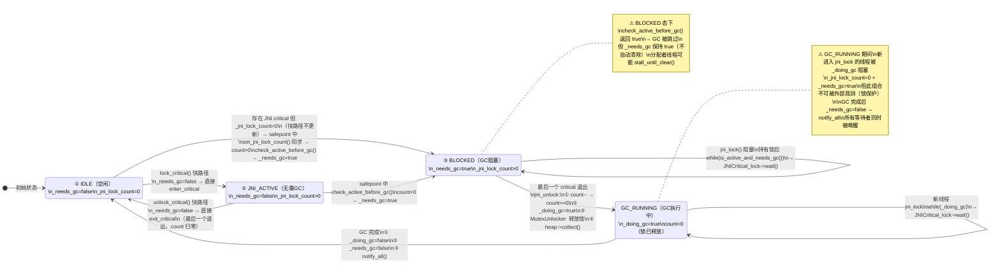
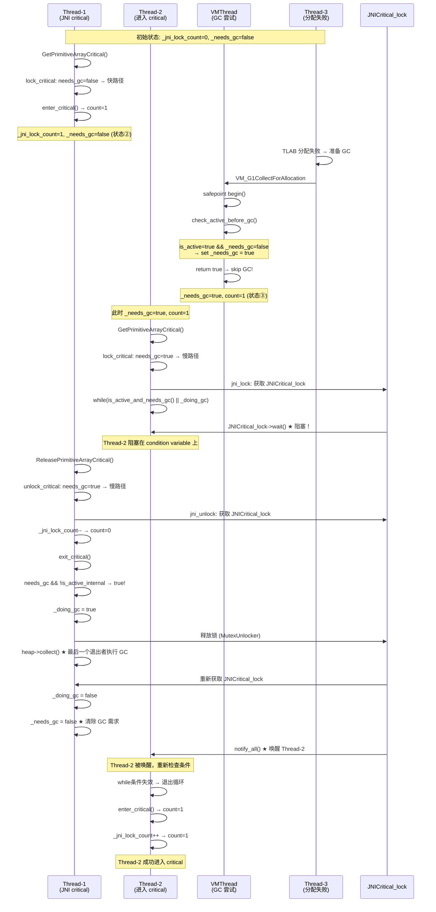

# 04-GCLocker — JNI Critical Section 与 GC 互斥协议

> **OpenJDK 11 slowdebug** | `-Xms8g -Xmx8g -XX:+UseG1GC`（Region=4MB）| 64-bit Linux x86
> **线程模型**: JavaThread + VMThread + NonJavaThread | **内存模型**: rel-weak (无显式 fence 的 volatile)
> **源文件**: `gcLocker.cpp/.hpp/.inline.hpp` `jni.cpp` `vmGCOperations.cpp` `g1CollectedHeap.cpp` `safepoint.cpp` `mutexLocker.cpp` `genCollectedHeap.cpp` `collectedHeap.cpp` `sharedRuntime.cpp` `thread.hpp`
> **前置阅读**: [01-Safepoint-Protocol]（safepoint 协议 + GCLocker 位置）| [03-VM-Operation-System]（doit_prologue 门禁）| [07-09-JavaThread-System]（JavaThread 线程状态）| [10-NonJavaThread]（NonJavaThread 不参与 safepoint）
> **本文定位**: 完整分析 GCLocker 协议 — `jni_lock/jni_unlock` 阻塞协议 + `_needs_gc` 状态机 + `check_active_before_gc` 双层门禁 + "放弃而非等待"策略的完整论证

---

## 阅读收益

- 理解 **JNI Critical Section 为什么能阻止 GC**——以及为什么不用 pinning
- 掌握 **`_jni_lock_count × _needs_gc` 的四种状态组合**及转换条件
- 看懂 **`jni_lock()` 中为什么所有新进入者都在 condition variable 上等待**
- 理解 **`jni_unlock()` 中为什么最后一个退出者执行 GC + notify_all**
- 区分 **三种等待**：jni_lock 中的阻塞（等 GC 完成）、stall_until_clear 中的阻塞（等 critical 退出）、jni_unlock 中的主动 GC
- 理解**双层 GCLocker 门禁**的精确 semantics
- 理解 **memory ordering 隐忧**：`_needs_gc` 和 `_jni_lock_count` 之间的竞态窗口

---

## 〇、源文件清单

| # | 文件 | 路径 | 核心函数（行号已通过 grep 验证） | 本文角色 |
|---|------|------|----------------------------|---------|
| 1 | `gcLocker.hpp` | `src/hotspot/share/gc/shared/gcLocker.hpp` | `_jni_lock_count`(:45), `_needs_gc`(:46), `_doing_gc`(:48), `lock_critical/unlock_critical`(:150-151), `is_active_and_needs_gc()`(:83) | ★★★ 类定义 + 字段 + public 接口 |
| 2 | `gcLocker.cpp` | `src/hotspot/share/gc/shared/gcLocker.cpp` | `jni_lock()`(:123), `jni_unlock()`(:142), `check_active_before_gc()`(:94), `stall_until_clear()`(:104) | ★★★ jni_lock/unlock 完整实现 + 门禁 + 等待 |
| 3 | `gcLocker.inline.hpp` | `src/hotspot/share/gc/shared/gcLocker.inline.hpp` | `lock_critical()`(:31), `unlock_critical()`(:44) | ★★ 快/慢路径 wrapper（JNI 入口调这层）|
| 4 | `jni.cpp` | `src/hotspot/share/prims/jni.cpp` | `jni_GetPrimitiveArrayCritical`(:3225), `lock_gc_or_pin_object`(:3204) | ★★ JNI 入口 → GCLocker 调用链 |
| 5 | `vmGCOperations.cpp` | `src/hotspot/share/gc/shared/vmGCOperations.cpp` | `skip_operation()`(:70), `doit_prologue()`(:83) | ★★ 第一层门禁（入队前）|
| 6 | `g1CollectedHeap.cpp` | `src/hotspot/share/gc/g1/g1CollectedHeap.cpp` | `do_collection_pause_at_safepoint()`(:3648) → `check_active_before_gc()` | ★★ 第二层门禁（doit 入口）|
| 7 | `genCollectedHeap.cpp` | `src/hotspot/share/gc/shared/genCollectedHeap.cpp` | 分配失败重试循环(:316-352) → `stall_until_clear()` | ★★ 分配路径 GCLocker 交互 |
| 8 | `safepoint.cpp` | `src/hotspot/share/runtime/safepoint.cpp` | `begin()` L484 `set_jni_lock_count()`, `block()` L905 `in_critical()` | ★ 交叉引用 |
| 9 | `mutexLocker.cpp` | `src/hotspot/share/runtime/mutexLocker.cpp` | `def(JNICritical_lock)`(:297) — PaddedMonitor nonleaf | ★ JNICritical_lock 定义 |
| 10 | `thread.hpp` | `src/hotspot/share/runtime/thread.hpp` | `_jni_active_critical`(JavaThread), `in_critical()`(:1802), `enter_critical()`(:1804) | ★ 线程级 critical 状态 |
| 11 | `sharedRuntime.cpp` | `src/hotspot/share/runtime/sharedRuntime.cpp` | `block_for_jni_critical()`(:2929) | ★ lazy critical native 入口 guard |

---

## 一、什么是 JNI Critical Section？为什么 GC 不能动这些对象？

### 1.1 ❓ GetPrimitiveArrayCritical 返回的是什么指针？

JNI 规范定义了两种获取数组内容的方式：

| JNI 函数 | 返回类型 | GC 期间安全性 | 性能 |
|---------|---------|-------------|------|
| `Get<Type>ArrayElements` | `j<type>*` — **堆外副本** | ✅ GC 安全（拷贝在 native heap） | 慢（拷贝开销 O(n)）|
| `GetPrimitiveArrayCritical` | `j<type>*` — **堆内裸指针** | ❌ GC 不安全（直接指向 Java 堆） | 快（零拷贝）|

**`GetPrimitiveArrayCritical` 返回的是直接指向 Java 堆中数组元素的指针**——没有中间拷贝，没有 Handle 包装。这是性能优化：避免大数组的内存拷贝（如 ObjectOutputStream 序列化 float[]→byte[] 转换）。

### 1.2 ❓ 为什么不能 GC？

G1 GC 的 Young GC（和其他 copying GC）**会移动对象**：Eden 中的活对象 → Survivor/To 空间。如果 GC 发生时 native 代码正持有堆内数组的裸指针：

```
JNI native code:                 GC (copying collector):
  ptr = array->base(T_INT)       ┌──────────────────┐
  ptr[0] = 42;  ←─ 指向 Eden    │ Eden Region      │
                                 │ [int[10]] ←──这里 │ ← GC 移动这个对象
                                 └──────────────────┘
                                     ↓ copy to Survivor
                                 ┌──────────────────┐
                                 │ Survivor Region   │
                                 │ [int[10]]         │ ← 新地址
                                 └──────────────────┘
  ptr[1] = 99;  ←─ 野指针！指向已经回收的 Eden 空间
```

**裸指针 + 对象移动 = 野指针 → 内存损坏或 SIGSEGV**。

### 1.3 ❓ 为什么不是 JNI pinning（钉住对象不移动）？

一些 GC（如 Shenandoah、ZGC）支持 **object pinning**——GC 执行期间跳过被钉住的对象，不移动它们。但 G1/Parallel/Serial GC 不支持 pinning，因为：

1. **Pinning 导致堆碎片化**：被钉住的对象卡在 Young 区无法晋升 → Young 区中出现"钉子"→ GC 只能回收钉子周围的区域 → 碎片化严重 → 触发 Full GC。
2. **Pinning 需要 GC 全局感知**：GC 遍历时必须检查每个对象是否被 pinned → 每条引用链都要额外分支 → 拖慢整个 GC。
3. **GCLocker 更轻量**：不改变 GC 算法，只在 GC 启动前检查"有没有活跃的 JNI critical"→ 如果有就放弃本次 GC → **放弃的代价是一次 GC 延迟，而非永久碎片化**。

**GCLocker 的设计哲学**："阻止 GC 开始"，而非"阻止 GC 移动特定对象"。

---

## 二、★★★ GCLocker 状态机 — `_jni_lock_count × _needs_gc` 状态空间

### 2.1 核心字段（gcLocker.cpp:35-38）

```cpp
volatile jint GCLocker::_jni_lock_count = 0;   // 活跃 JNI critical 线程数
volatile bool GCLocker::_needs_gc       = false; // 堆需要 GC（bool = jint）
volatile bool GCLocker::_doing_gc       = false; // jni_unlock 中正在执行 GC
```

**三字段精确定义**：

| 字段 | 类型 | 粒度 | 谁写 | 谁读 | 写位置 |
|------|------|------|------|------|--------|
| `_jni_lock_count` | `volatile jint` | 线程计数 | jni_lock(L138:++), jni_unlock(L145:--), set_jni_lock_count(=) | is_active_internal, jni_lock while 条件 | gcLocker.cpp:138/145, safepoint.cpp:484 |
| `_needs_gc` | `volatile bool` | 布尔标志 | check_active_before_gc(L98:=true), jni_unlock(L164:=false) | 各处 | gcLocker.cpp:98/164 |
| `_doing_gc` | `volatile bool` | 布尔标志 | jni_unlock(L156:=true, L163:=false) | jni_lock while 条件(L134) | gcLocker.cpp:156/163 |

### 2.2 Mermaid 状态图



**说明**：上面的状态图纠正了一个关键误解——不存在 `_needs_gc=true, _jni_lock_count=0` 的可观测状态（NEED_GC）。这个组合只在 jni_unlock 的 `MutexLocker` 内部短暂出现（L145 `count--` → L156 `_doing_gc=true`），此时 JNICritical_lock 被持有，外部线程无法观测。锁释放时 `_doing_gc` 已为 true，外部线程看到的是 GC_RUNNING 态。

### 2.3 三种可观测状态交互表

| 状态 | _needs_gc | _jni_lock_count | _doing_gc | 谁可能进入 critical | GC 能否执行 | 关键行为 |
|------|-----------|-----------------|-----------|--------------------|------------|---------|
| ① IDLE | false | =0 | false | 任意（快路径）| ✅ 可以 | 正常状态，无需任何阻塞 |
| ② JNI_ACTIVE | false | >0 | false | 任意（快路径：无 `_needs_gc` 时不走 slow path）| ❌ 不可以 | 正常使用 JNI critical，GC 未被请求 |
| ③ BLOCKED | true | >0 | false | 只出不进 | ❌ 不可以 | 核心阻塞态：新进入者阻塞（while(count>0), 分配者可能 stall |
| ④ GC_RUNNING | true | =0 | true | 新进入者被 _doing_gc 阻塞 | GC 正在执行 | 暂时态：jni_unlock 执行 GC，MutexUnlocker 释放锁但 _doing_gc 阻新 |

> **注意**：不存在 `_needs_gc=true, _jni_lock_count=0, _doing_gc=false` 的可观测状态——这个组合只在 jni_unlock::jni_unlock 的 MutexLocker 保护下短暂存在（L145 `count--` 后 → L156 `_doing_gc=true` 前），外部线程被锁阻挡，永远观测不到此状态。

### 2.4 Memory Ordering 隐忧

`check_active_before_gc()` 只能在 safepoint 中由 **VMThread** 调用（有 `assert(is_at_safepoint())`）。设置了 `_needs_gc=true` 后，safepoint 结束，JNI 线程在 safepoint 之外调用 `lock_critical()` 的快路径读 `needs_gc()`。竞态窗口在此：

```
CPU0 (VMThread, safepoint 中)        CPU1 (JNI 线程, safepoint 之后)
safepoint begin() 中:                 lock_critical(thread):
  ...                                   if (!thread->in_critical()) {
check_active_before_gc():                 if (needs_gc())  // load ★
  _needs_gc = true;  // store            // _needs_gc 被标记 volatile，
  // ★ OrderAccess::fence() 尚未执行     // 但 CPU1 cache 中可能仍是旧值!
safepoint end():                          // → 走快路径，直接 enter_critical
  OrderAccess::fence()  // ← 在此之后   // → 进入了 critical，但 GC 需要执行
  才保证 _needs_gc 对所有 CPU 可见
```

**竞态详解**：`_needs_gc` 被声明为 `volatile`，保证编译器不重排，也保证单个 CPU 上的 store→load 顺序。但在多 CPU 上，没有 fence 时，CPU1 的 load 可能在 CPU0 的 store 到达 cache coherence 域之前完成，读到旧值 `false`。

**代价**：新线程绕过了 slow path，直接进入 critical（多了一个阻止 GC 的线程）。但这不是 bug：
- safepoint 的 `end()` 中有 `OrderAccess::fence()`——safepoint 之后的任意时刻，`_needs_gc` 一定可见
- 下一次 safepoint 时，`begin()` 的 fence（L264 的 `OrderAccess::fence()` 和 L470 的 `OrderAccess::fence()`）重新保证了 visibility
- 竞态窗口的宽度是 O(一次 safepoint end + 下一次 JNI critical entry) 的时间

**为什么不加 fence？** 在 `check_active_before_gc()` 中加一条 `OrderAccess::fence()` 的成本是 ~50ns（x86 上 `mfence`），而竞态的代价是"一次 GC 被多延迟一个 JNI critical 生命周期（通常微秒级）"。设计者选择性能——这是 JVM 中典型的"relaxed consistency by design"模式。

**补充**：jni_lock/jni_unlock 的 slow path 中不需要额外 fence——`MutexLocker` 的 acquire/release 语义天然提供了必要的 happens-before 关系。

### 2.5 ★ `_jni_lock_count` 的双轨制 — 为什么快路径不更新它？

`_jni_lock_count` 有两个截然不同的更新路径，这是一个精妙的设计：

| 路径 | 何时更新 | 锁保护 | 写操作 | 用途 |
|------|---------|--------|--------|------|
| **慢路径** | `jni_lock`(L138:++) / `jni_unlock`(L145:--) | JNICritical_lock 保护 | 直接读写 `_jni_lock_count` | GC 被阻塞期间：精确跟踪 active critical 数 |
| **快路径** | **不更新**！只在 safepoint 时 `set_jni_lock_count()` 快照 | 无（safepoint 全局同步） | 遍历所有线程 `in_critical()` → 求和 → 赋值 | 无 GC 压力时：延后计数 |

**为什么这样设计？** 两个场景的需求完全不同：

1. **无 GC 压力**（`_needs_gc=false`）：没有 GC 在等 critical 退出，`_jni_lock_count` 的精确值不重要。快路径避免每次 JNI critical 的全局原子操作——`lock_critical()` 只更新 per-thread 的 `_jni_active_critical`（单线程局部变量，无锁）。safepoint 时再由 VMThread 遍历所有线程统一快照。

2. **有 GC 压力**（`_needs_gc=true`）：GC 需要精确知道何时所有 critical 退出。此时走 slow path，在 `JNICritical_lock` 保护下精确维护 `_jni_lock_count`。代价是每次 JNI critical 需要获取全局锁——但在 GC 压力下这是必要的代价。

**面试视角**：为什么不直接用一个全局 `Atomic` 计数器，所有路径都更新它？因为快路径的 `Atomic::inc` 需要 ~5ns（x86 `lock xadd`），而 `jni_GetPrimitiveArrayCritical` 是热路径（每秒可能数十万次调用）。省掉这 5ns × 双操作（lock+unlock）= ~10ns/call，在 I/O 密集场景下就是显著的吞吐提升。

> **注意**：per-thread 的 `_jni_active_critical` 支持嵌套。`enter_critical()` 递增，`exit_critical()` 递减。`in_critical()` 返回 `> 0`，`in_last_critical()` 返回 `== 1`。这是线程级引用计数，不是全局计数。

---

## 三、★★★ jni_lock() / jni_unlock() 协议 — 完整源码走读

### 3.1 调用链概览

```
JNI 调用 GetPrimitiveArrayCritical()
  └── jni_GetPrimitiveArrayCritical()               [jni.cpp:3225]
        └── lock_gc_or_pin_object(thread, array)    [jni.cpp:3204]
              ├── [Pinning GC] heap->pin_object()    // Shenandoah/ZGC
              └── [G1/Serial] GCLocker::lock_critical(thread)  [jni.cpp:3211]
                    └── 见 gcLocker.inline.hpp:31
                          ├── [快路径] !needs_gc → enter_critical()
                          └── [慢路径] needs_gc → jni_lock(thread)  [gcLocker.cpp:123]

JNI 调用 ReleasePrimitiveArrayCritical()
  └── jni_ReleasePrimitiveArrayCritical()            [jni.cpp:3245]
        └── unlock_gc_or_unpin_object(thread, array) [jni.cpp:3216]
              ├── [Pinning GC] heap->unpin_object()
              └── [G1/Serial] GCLocker::unlock_critical(thread) [jni.cpp:3221]
                    └── 见 gcLocker.inline.hpp:44
                          ├── [快路径] !needs_gc → exit_critical()
                          └── [慢路径] needs_gc → jni_unlock(thread) [gcLocker.cpp:142]
```

### 3.2 lock_critical() / unlock_critical() — 快/慢路径 wrapper（gcLocker.inline.hpp）

这两段是 GCLocker 暴露给 JNI 的**入口层**，它们将 `_needs_gc` 检查与线程级 critical 计数结合：

**lock_critical** (`gcLocker.inline.hpp:31-42`)：
```cpp
void GCLocker::lock_critical(JavaThread* thread) {
  if (!thread->in_critical()) {       // 线程尚未在 critical 中（非嵌套进入）
    if (needs_gc()) {                 // GC 被请求（_needs_gc == true）
      jni_lock(thread);               // → 慢路径：需要 JNICritical_lock 同步
      return;
    }
    increment_debug_jni_lock_count();  // ASSERT 模式：更新 debug count
  }
  thread->enter_critical();            // 快路径：直接 increment _jni_active_critical
}
```

**关键设计**：快路径无锁——只在 `!needs_gc()` 时，直接调用 `thread->enter_critical()` 增加线程级计数器。`_jni_lock_count` **在快路径中不递增**（只在 safepoint 时由 `set_jni_lock_count()` 快照同步，详见 [§2.5](#25--_jni_lock_count-的双轨制--为什么快路径不更新它)）。

**嵌套语义**：`lock_critical` 的 `if (!thread->in_critical())` 意味着：如果线程已经在 critical 中（嵌套 `GetPrimitiveArrayCritical`），直接跳到 `thread->enter_critical()` 递增嵌套计数，**不检查 `_needs_gc`**。对应地，`unlock_critical` 的 `if (thread->in_last_critical())` 只在最外层退出时检查 `needs_gc()`——内层退出只做 `exit_critical()`。**只有最外层的 Release 才可能走 slow path 触发 GC。**

**unlock_critical** (`gcLocker.inline.hpp:44-55`)：
```cpp
void GCLocker::unlock_critical(JavaThread* thread) {
  if (thread->in_last_critical()) {   // 这是最外层的 critical（_jni_active_critical==1）
    if (needs_gc()) {                 // GC 被请求
      jni_unlock(thread);             // → 慢路径：可能触发 GC
      return;
    }
    decrement_debug_jni_lock_count();
  }
  thread->exit_critical();             // 快路径：直接 decrement
}
```

### 3.3 ★ jni_lock() — 为什么所有新进入者都在 condition variable 上等待？

**源码** (`gcLocker.cpp:123-140`)：

```cpp
void GCLocker::jni_lock(JavaThread* thread) {
  assert(!thread->in_critical(), "shouldn't currently be in a critical region");
  INST_LOG_GC("GCLocker::jni_lock: jni_lock_count=%u, needs_gc=%d",
              (uint)_jni_lock_count, (int)needs_gc());
  MutexLocker mu(JNICritical_lock);        // ① 获取 JNICritical_lock
  // Block entering threads if we know at least one thread is in a
  // JNI critical region and we need a GC.
  // We check that at least one thread is in a critical region before
  // blocking because blocked threads are woken up by a thread exiting
  // a JNI critical region.
  while (is_active_and_needs_gc() || _doing_gc) {  // ② 阻塞条件
    JNICritical_lock->wait();                        // ③ wait（释放锁 + 阻塞）
  }
  thread->enter_critical();               // ④ 设置线程级标志
  _jni_lock_count++;                      // ⑤ 递增全局计数
  increment_debug_jni_lock_count();
}
```

**五步协议解析**：

| 步骤 | 操作 | 线程状态 | 锁状态 |
|------|------|---------|--------|
| ① | `MutexLocker mu(JNICritical_lock)` | Running | **持有** JNICritical_lock |
| ② | `while (is_active_and_needs_gc() \|\| _doing_gc)` | 检查条件 | 在锁保护下 |
| ③ | 如果条件满足 → `JNICritical_lock->wait()` | **阻塞** | **释放锁** + pthread_cond_wait |
| ④ | 被唤醒后 → `thread->enter_critical()` | Running | 重新持有锁 |
| ⑤ | `_jni_lock_count++` | Running | 持有锁，递增后解锁（MutexLocker 析构）|

**❓ 为什么 while 条件是 `is_active_and_needs_gc() || _doing_gc`？**

两个条件分别对应两种"不能放行"的场景：

1. **`is_active_and_needs_gc()`** = `_needs_gc && _jni_lock_count > 0`：有 JNI critical 活跃 + GC 被请求 → 如果放行这个线程进入 critical，会延长 GC 等待 → **必须阻塞** → 等当前所有 critical 退出。
2. **`_doing_gc`** = `true`：jni_unlock 中的最后一个退出者正在执行 GC → GC 结束时会设置 `_needs_gc=false` 和 `_doing_gc=false` 然后 `notify_all()` → **阻塞等 GC 完成**。

**❓ 关键问题：为什么是所有新进入者都阻塞，而不是只有第一个？**

看 `is_active_and_needs_gc()` 的定义 (`gcLocker.hpp:83-88`)：
```cpp
static bool is_active_and_needs_gc() {
    return needs_gc() && is_active_internal();  // _needs_gc && _jni_lock_count > 0
}
```

**只要 `_jni_lock_count > 0`（有至少一个线程在 critical 中）+ `_needs_gc == true`（GC 被请求）→ 阻塞所有新进入者**。

原因：**多一个 critical 线程 = 多一个阻止 GC 的因素**。即使当前只有 1 个线程在 critical 中，放行第 2 个后 → count=2 → 第 1 个退出后 count=1 → GC 仍不能执行 → 第 2 个退出后才能 GC。**每放行一个，都可能延长 GC 的等待时间**。

设计上`jni_lock()`对所有新进入者一视同仁：只要有活跃 critical 且有 GC 需求，全部阻塞，直到最后一个 critical 退出 → jni_unlock 触发 GC → GC 完成 → `_needs_gc=false` → 所有阻塞的 jni_lock 被唤醒 → 可以安全进入 critical。

### 3.4 ★★ jni_unlock() — 最后一个退出者执行 GC + notify_all

**源码** (`gcLocker.cpp:142-167`)：

```cpp
void GCLocker::jni_unlock(JavaThread* thread) {
  assert(thread->in_last_critical(), "should be exiting critical region");
  MutexLocker mu(JNICritical_lock);    // ① 获取 JNICritical_lock
  _jni_lock_count--;                   // ② 递减全局计数
  decrement_debug_jni_lock_count();
  thread->exit_critical();             // ③ 清除线程级标志
  if (needs_gc() && !is_active_internal()) {  // ④ ★ 我们是最后一个 + GC 被请求
    // We're the last thread out. Request a GC.
    _total_collections = Universe::heap()->total_collections();
    _doing_gc = true;
    {
      // Must give up the lock while at a safepoint
      MutexUnlocker munlock(JNICritical_lock);   // ⑤ 释放锁（GC 需要 safepoint）
      log_debug_jni("Performing GC after exiting critical section.");
      Universe::heap()->collect(GCCause::_gc_locker);  // ⑥ ★ 执行 GC！
    }
    _doing_gc = false;                 // ⑦ 清除 _doing_gc
    _needs_gc = false;                 // ⑧ 清除 _needs_gc
    JNICritical_lock->notify_all();    // ⑨ ★ 唤醒所有在 jni_lock 中等待的线程
  }
}
```

**八步协议**：

| 步骤 | 操作 | 条件 | 效果 |
|------|------|------|------|
| ① | `MutexLocker mu(JNICritical_lock)` | 总是 | 与 jni_lock 互斥 |
| ② | `_jni_lock_count--` | 总是 | 原子递减（在锁内） |
| ③ | `thread->exit_critical()` | 总是 | `_jni_active_critical--` |
| ④ | `if (needs_gc() && !is_active_internal())` | **我们是最后一个退出** | 条件成立 → 执行 GC |
| ⑤ | `MutexUnlocker munlock(...)` | GC 前 | 释放锁（GC 需要 safepoint） |
| ⑥ | `heap->collect()` | 最后一个退出者 | **STW GC 在此执行！** |
| ⑦ | `_doing_gc = false` | GC 后 | 清除正在 GC 标志 |
| ⑧ | `_needs_gc = false` | GC 后 | 清除 GC 需求 |
| ⑨ | `JNICritical_lock->notify_all()` | GC 后 | 唤醒所有在 jni_lock 中阻塞的线程 |

**关键设计点**：

1. **为什么 jni_unlock 要亲自执行 GC？** 因为最后一个 JNI critical 退出时，GC 的需求已经存在（`_needs_gc=true`）却从未被满足——之前所有的 GC 尝试都被 GCLocker 阻止了。如果 jni_unlock 不清算这个债务，`_needs_gc` 永远为 true，堆分配持续失败 → OOME。所以最后一个退出者**代理执行 GC**——这是兜底策略。

2. **`MutexUnlocker`** 在步骤⑤释放锁 → GC 需要 safepoint → begin() 会获取 Threads_lock 和其他锁 → 如果还持有 JNICritical_lock 会造成潜在死锁。GC 完成后，步骤⑦-⑨ 重新在锁保护下操作。

3. **`should_discard()` — 防止重复 GC** (`gcLocker.cpp:118-121`)：
```cpp
bool GCLocker::should_discard(GCCause::Cause cause, uint total_collections) {
    return (cause == GCCause::_gc_locker) &&
           (_total_collections != total_collections);
}
```
步骤④中 `_total_collections = Universe::heap()->total_collections()` 记录了"我们请求 GC 时的 GC 计数"。注意：jni_unlock 路径中的 GC 是**直接调用 `heap->collect()`**（同步执行），不是入队到 VMOperationQueue。但在 `heap->collect()` 执行前仍存在竞态窗口——另一个线程可能通过 VM_Operation 路径先完成了一次 GC（如 Young GC）→ `total_collections()` 已增加 → `should_discard()` 返回 true → 跳过这次 GCLocker 发起的 GC。`_total_collections` 只在 safepoint 中变化，所以窗口的竞态来自于"记录 count → 获取 Heap_lock → 准备 GC"之间可能插入的 safepoint。

4. **`notify_all()`** 在步骤⑨ → 唤醒所有在 jni_lock 步骤③ 中阻塞的线程 + 所有在 `stall_until_clear()` 中阻塞的分配者线程 → 它们重新检查条件 → `is_active_and_needs_gc()` = false（`_needs_gc` 已被清除）+ `_doing_gc` = false → 退出 while → 继续各自的路径。

> **⚠ 重要修正**：prompt 的伪代码描述 `_jni_lock_count++` 在 `if (_needs_gc && count==1)` 之前——这是**不准确的**。实际实现中，jni_lock **先持锁、再 while 等、最后 increment**。而 prompt 中的"第一个进入者做特殊处理"也不准确——实际是所有新进入者在有活跃 critical + GC 需求时都阻塞，不区分"第一个"。

### 3.5 jni_lock/jni_unlock 时序图



---

## 四、★ _needs_gc 的完整生命周期 — 设置/清除/保持

### 4.1 设置者：check_active_before_gc() 在 safepoint 中

**源码** (`gcLocker.cpp:94-102`)：

```cpp
bool GCLocker::check_active_before_gc() {
  assert(SafepointSynchronize::is_at_safepoint(), "only read at safepoint");
  if (is_active() && !_needs_gc) {
    verify_critical_count();   // ASSERT: 验证 _debug_jni_lock_count == _jni_lock_count
    _needs_gc = true;           // ★ 设置 _needs_gc
    log_debug_jni("Setting _needs_gc.");
  }
  return is_active();           // 返回是否 active（调用者据此决定是否 skip GC）
}
```

**谁调用**（全部在 safepoint 内，由 VMThread 调用）：
- `G1CollectedHeap::do_collection_pause_at_safepoint()` (`g1CollectedHeap.cpp:3648`) — Young GC / Initial Mark 入口
- `G1CollectedHeap::do_full_collection()` (`g1CollectedHeap.cpp:1175`) — Full GC 入口
- `GenCollectedHeap::mem_allocate_work()` (`genCollectedHeap.cpp:557`) — 分代堆分配
- `PSScavenge::invoke_no_policy()` (`psScavenge.cpp:248`) — Parallel Scavenge
- `PSParallelCompact::invoke_no_policy()` (`psParallelCompact.cpp:1723`) — Parallel Full GC
- `PSMarkSweep::invoke_no_policy()` (`psMarkSweep.cpp:120`) — Serial MarkSweep
- `ZDriver::collect()` (`zDriver.cpp:107`) — ZGC（bail out 时设置 `_gc_locked`）

> **⚠ 重要**：`skip_operation()` (vmGCOperations.cpp:75) 使用的是 `is_active_and_needs_gc()`（纯读），**不调用** `check_active_before_gc()`。第一层门禁不设置 `_needs_gc`。

**Pre-condition**：`is_active() == true`（有线程在 JNI critical 中）且 `!_needs_gc`（GC 需求尚未设置）
**Post-condition**：`_needs_gc = true`，返回 `is_active()` → 调用者看到 true → skip GC

### 4.2 清除者：jni_unlock() 中 GC 完成后

**源码** (`gcLocker.cpp:164`)：
```cpp
_needs_gc = false;     // 在 GC 完成 + _doing_gc = false 之后
JNICritical_lock->notify_all();   // 然后唤醒等待者
```

**清除时机**：最后一个 JNI critical 线程退出 → `jni_unlock()` 执行 `heap->collect()` → GC 完成 → 清除 `_needs_gc`。

### 4.3 保持：GC 被 skip 后 _needs_gc 保持 true

这是最关键的设计决策：

```
场景：_needs_gc=true, _jni_lock_count>0（状态③ BLOCKED）

分配失败 → VM_GC_Operation → doit_prologue → skip_operation()
  → is_active_and_needs_gc() = true  // 纯读，无副作用
  → skip → doit_prologue 返回 false → 跳过整个 safepoint
  → _needs_gc 保持 true ★

或者已经进入 safepoint：
safepoint → doit() → check_active_before_gc()
  → is_active() == true && _needs_gc == true
  → if 分支内的 _needs_gc=true 不执行（已经为 true）
  → return is_active() = true → skip GC → _needs_gc 保持 true ★
```

**为什么 _needs_gc 不被清除？** 因为 GC 没有执行——堆仍然需要 GC。如果清除了 `_needs_gc`，就没有任何东西"记得"还需要 GC → GC 债务丢失 → 最终 OOME。保持 `_needs_gc=true` 保证下次尝试时（无论是下一个 safepoint 还是 jni_unlock）会再次尝试。

### 4.4 极端路径：_needs_gc 永远 true → 最终 OOME

```
while (_needs_gc == true) {
  分配失败 → VM_GC_Operation → doit_prologue → skip_operation
    → is_active_and_needs_gc() = true → skip（第一层拦截）
  → 分配者线程: if (!in_critical()) → stall_until_clear() → wait(JNICritical_lock)
  → 等待 JNI critical 退出...

  如果 JNI critical 永远不退出:
    → _needs_gc 永远 true
    → stall_until_clear 永远不返回
    → 越来越多的分配者线程阻塞
    → 堆中的可分配空间逐渐耗尽
    → 触发 OOME（分配者从未被唤醒）
}
```

**分配路径的保护** (`genCollectedHeap.cpp:310-352`)：
```cpp
if (GCLocker::is_active_and_needs_gc()) {
    // ... 尝试 expand heap ...
    if (gclocker_stalled_count > GCLockerRetryAllocationCount) {
        return NULL;  // 重试太多次 → 不阻塞，返回 NULL
    }
    JavaThread* jthr = JavaThread::current();
    if (!jthr->in_critical()) {
        GCLocker::stall_until_clear();   // 不是 JNI critical 线程 → 等
        continue;
    } else {
        if (CheckJNICalls) {
            fatal("Possible deadlock...");  // critical 中的线程分配失败 → 死锁
        }
        return NULL;  // 放弃本次分配
    }
}
```

---

## 五、★ check_active_before_gc() 双层门禁

### 5.1 is_active_and_needs_gc() 的判断

```cpp
static bool is_active_and_needs_gc() {
    return needs_gc() && is_active_internal();  // _needs_gc && _jni_lock_count > 0
}
```

**只返回 true 当且仅当**：GC 被请求 **且** 至少一个线程在 JNI critical 中。单独一个条件不足以阻止 GC。

### 5.2 第一层门禁 — doit_prologue() 入队前（与 [03] §五 衔接）

**路径**: `VM_GC_Operation::doit_prologue()` → `skip_operation()` (`vmGCOperations.cpp:70-81`)：

```cpp
bool VM_GC_Operation::skip_operation() const {
  bool skip = (_gc_count_before != Universe::heap()->total_collections());
  // ...
  if (!skip && GCLocker::is_active_and_needs_gc()) {  // 纯读！
    skip = Universe::heap()->is_maximal_no_gc();
    assert(!(skip && (_gc_cause == GCCause::_gc_locker)),
           "GCLocker cannot be active when initiating GC");
  }
  return skip;
}
```

**关键**：第一层使用 `is_active_and_needs_gc()`（纯读函数，**不设置 `_needs_gc`**，不修改任何全局状态）。它的逻辑是：如果 `_needs_gc` **已经被之前的 safepoint 设置**且活跃 critical 存在 → 直接 skip。但如果 `_needs_gc` 尚未设置（首次分配失败），第一层放行。

**位置**：在**调用者线程**（分配者线程）的 `VMThread::execute()` 中、入队之前——`doit_prologue()` 返回 false → 操作不入队 → VMThread 不被唤醒。这就是 [01] 中强调的"GCLocker 检查不在 begin() 中"的根本原因。

> **注意**：`doit_prologue()` 只在调用者线程执行一次。`VM_Operation::evaluate()`（`vmOperations.cpp:58-77`）只调 `doit()`，不调 `doit_prologue()`。详见 [05-Safepoint-Full-Path] §三。

### 5.3 第二层门禁 — doit() 内部（与 [01] §三 衔接）

**路径**: `G1CollectedHeap::do_collection_pause_at_safepoint()` (`g1CollectedHeap.cpp:3648`)：

```cpp
if (GCLocker::check_active_before_gc()) {
    INST_LOG_GC("  GCLocker is active, skipping GC");
    return false;  // ← 跳过 GC，但此时已在 safepoint 中
}
```

**位置**：在 `begin()` **之后**——safepoint 已经建立，所有 JavaThread 已暂停。此时再次检查 GCLocker。

**为什么需要两层？**

```
第一层（doit_prologue → skip_operation → is_active_and_needs_gc()）:
  前提：_needs_gc 已经被之前某次 safepoint 的 check_active_before_gc() 设置
  作用：如果 _needs_gc 已设置 + 活跃 critical → 直接 skip
  价值：节省无意义的 safepoint 开销（arm/disarm polling page + 双循环等待）
  局限：不设置 _needs_gc —— 首次分配失败时 _needs_gc=false，放行
  
第二层（doit → check_active_before_gc()）:
  前提：已进入 safepoint（begin() 完成），所有线程暂停
  作用：检查 GCLocker 状态，必要时设置 _needs_gc=true
  价值：首次设置 _needs_gc，或在 begin() 后重新验证（begin() 中 critical 可能已退出）
  局限：如果 GCLocker active，浪费了一次完整的 safepoint 建立+拆除
```

**如果第一层没拦住**（首次分配失败，`_needs_gc=false`），**第二层兜底**（设置 `_needs_gc=true`，skip GC）。之后 `_needs_gc` 已设置，后续的 GC 请求在第一层就被拦截。

### 5.4 双层检查决策树

```
JavaThread 分配失败
  └── 创建 VM_GC_Operation
        └── VMThread::execute(op) ← 调用者线程调用（非 VMThread!）
              └── op->doit_prologue() ─────── 调用者线程执行，第一层门禁
                    │
                    ├── skip_operation() == true
                    │     ├── GCLocker::is_active_and_needs_gc() → skip
                    │     │   → _needs_gc 被之前的 safepoint 设置，无需再次设置
                    │     │   → return false → 不入队 → 调用者进入 stall_until_clear()
                    │     └── gc_count 已变化 → skip (别人已经做了 GC)
                    │
                    └── skip_operation() == false → 继续
                          └── SafepointSynchronize::begin()
                                └── op->doit()
                                      └── do_collection_pause_at_safepoint() ── 第二层门禁
                                            │
                                            ├── check_active_before_gc() == true
                                            │   → ★ 首次设置 _needs_gc = true（如果尚未）
                                            │   → return false → 放弃 GC
                                            │
                                            └── check_active_before_gc() == false
                                                → 正常执行 GC
```

---

## 六、★ "放弃 GC" vs "等 JNI critical 退出" — 两种等待的决策论证

### 6.1 策略对比表

| 维度 | 放弃 GC（GCLocker skip） | 等 JNI critical 退出（stall） | jni_lock 中的阻塞 |
|------|----------------------|---------------------------|------------------|
| 谁等待 | 无等待（GC 被放弃） | 分配失败的 JavaThread | 尝试进入 critical 的 JNI 线程 |
| 等什么 | — | 等所有 JNI critical 退出 + GC 完成 | 等 GC 完成（如果有活跃 critical）|
| 在哪等 | — | `stall_until_clear()`: JNICritical_lock->wait() | jni_lock 中: JNICritical_lock->wait() |
| 时长 | 0（立即放弃）| 不确定（取决于 JNI critical 持续时长）| GC 的持续时间（ms 级）|
| 不放弃的原因 | 确定性回收（不浪费 STW 时间）| 分配无法继续，必须等 GC | 放行会延长 GC 等待 |

### 6.2 stall_until_clear() — 分配者线程的兜底等待

**源码** (`gcLocker.cpp:104-116`)：
```cpp
void GCLocker::stall_until_clear() {
  assert(!JavaThread::current()->in_critical(), "Would deadlock");
  MutexLocker   ml(JNICritical_lock);
  if (needs_gc()) {
    log_debug_jni("Allocation failed. Thread stalled by JNI critical section.");
  }
  while (needs_gc()) {
    JNICritical_lock->wait();   // 等最后一个 critical 退出 → jni_unlock → notify_all
  }
}
```

**调用场景**：分配失败的 JavaThread 在上层分配循环中调用（`genCollectedHeap.cpp:343`, `collectedHeap.cpp:344`）：
```cpp
if (!jthr->in_critical()) {
    MutexUnlocker mul(Heap_lock);
    GCLocker::stall_until_clear();
    gclocker_stalled_count += 1;
    continue;  // 重新尝试分配
}
```

**唤醒链**：`stall_until_clear` wait → 最后一个 JNI critical 退出 → `jni_unlock` L165 `notify_all()` → stall 线程被唤醒 → `needs_gc()` 为 false → 分配成功或再次失败。

### 6.3 为什么不在 GC skip 时直接 stall？

```
方案 A: GC skip → 立即 stall → 等 JNI critical 退出 → GC 执行
方案 B: GC skip → 返回 → 分配者重试 → 如果仍失败 → stall

方案 A 的问题：
  - JNI critical 可能持续数秒（I/O 操作）
  - 分配者线程在 stall 期间持锁或占用资源
  - 如果 JNI critical 很快结束，下次 safepoint 时 _needs_gc 仍在 → GC 自然执行
  - 延迟 stall 给了 JNI critical 更多时间自然结束

方案 B 的优势：
  - GC 被延后了 O(JNI critical 生命周期) 的时间，而非 O(I/O 操作+GC) 的时间
  - 如果 JNI critical 很短（微秒级），下次分配时 GC 即可执行
```

### 6.4 极端场景：JNI critical 永远不退出

```
T1: GetPrimitiveArrayCritical → 持有裸指针...
T1: while(1) { sleep(1); }  // 恶意/错误的 JNI 代码
T2: 分配对象 → 失败 → VM_GC_Operation → doit_prologue → skip
T2: stall_until_clear() → wait(JNICritical_lock) → 永久阻塞

结果：
  - _needs_gc 永远 true
  - 所有分配线程阻塞
  - 堆逐渐耗尽
  - genCollectedHeap: gclocker_stalled_count > GCLockerRetryAllocationCount → return NULL
  - 触发 OOME

JVM 不强制打断 JNI critical 的原因：
  - 打断的唯一方式：pthread_kill(SIGILL) + signal handler
  - signal handler 中不能安全执行 GC（不能在信号中申请锁）
  - 强制打断后 native 代码中的裸指针变成 dangling reference
```

### 6.5 ★ GCLocker → G1 Concurrent Mark 级联延迟

`do_collection_pause_at_safepoint()` (g1CollectedHeap.cpp:3639) 是 Young GC 和 **Initial Mark** 的共用入口：

```cpp
// g1CollectedHeap.cpp:3648
if (GCLocker::check_active_before_gc()) {
    return false;  // ← skip！
}
// ...
g1_policy()->decide_on_conc_mark_initiation();  // L3677: Initial Mark 决策
```

`return false` 在第 3650 行——在 `decide_on_conc_mark_initiation()`（L3677）之前。这意味着：如果这次 pause 应该是 Initial Mark（concurrent marking cycle 的起点），GCLocker 不仅延迟了 Young GC，**还延迟了整个 concurrent mark cycle 的启动**。

级联路径：
```
GCLocker skip Young GC → check_active_before_gc() 之前 return
  → decide_on_conc_mark_initiation() 从未执行
  → Concurrent Mark 线程继续 sleep（pending）
  → IHOP 被突破但 concurrent mark 未启动
  → Mixed GC schedule 被推迟
  → 老年代持续增长（无 concurrent mark 标记信息）
  → JNI critical 退出后 → jni_unlock 触发 GC（GCCause::_gc_locker）
    → 但这是 Young GC，不是 concurrent mark
    → 下次 safepoint 时才可能启动 concurrent mark
  → 最坏情况：老年代持续膨胀，最终触发 Full GC
```

> **面试视角**：G1 的 concurrent mark 是"后台线程"，不受 safepoint 和 GCLocker 直接影响。但 Initial Mark 是由 Young GC pause 过程触发的（piggyback 模式）。GCLocker 跳过了 Young GC → 跳过了 Initial Mark 的 piggyback → concurrent mark cycle 无法启动 → 级联影响 Mixed GC schedule。

---

## 七、★ GetPrimitiveArrayCritical → GCLocker 完整调用链

### 7.1 进入路径

```
[JNI 层] jni_GetPrimitiveArrayCritical()              [jni.cpp:3225]
  → 检查 isCopy → 设为 JNI_FALSE
  → lock_gc_or_pin_object(thread, array)              [jni.cpp:3204]
      → [Pinning GC] pin_object()
      → [G1/Serial] GCLocker::lock_critical(thread)   [gcLocker.inline.hpp:31]
          → !in_critical && needs_gc → jni_lock()     [gcLocker.cpp:123]
          → !in_critical && !needs_gc → enter_critical()（快路径）
  → arrayOop(a)->base(type)                            [jni.cpp:3239]
  → 返回堆内裸指针 ★
```

### 7.2 退出路径

```
[JNI 层] jni_ReleasePrimitiveArrayCritical()          [jni.cpp:3245]
  → unlock_gc_or_unpin_object(thread, array)           [jni.cpp:3216]
      → [Pinning GC] unpin_object()
      → [G1/Serial] GCLocker::unlock_critical(thread)  [gcLocker.inline.hpp:44]
          → in_last_critical && needs_gc → jni_unlock() [gcLocker.cpp:142]
          → in_last_critical && !needs_gc → exit_critical()（快路径）
  → 裸指针失效（可能已被 GC 移动）
```

### 7.3 GCLocker 对 Java 堆分配的影响

**关键区别**：GCLocker 阻止 **GC**，不阻止 **分配**。

```
JNI Critical 期间：
  ✅ Java 堆分配 → 正常（TLAB 或尝试直接分配）
  ❌ GC → 被阻止（GCLocker check 在 safepoint 前拦截）
  ✅ 非 GC safepoint（如 RevokeBias）→ 正常
```

**示例**：JNI critical 线程本身可以调用 `NewObject` 分配 Java 对象——只要堆有空间。但如果堆满了 → 分配失败 → 尝试 GC → GCLocker 阻止 → 分配失败。

### 7.4 其他触发 GCLocker 的路径

除了 `GetPrimitiveArrayCritical`，以下路径也触发 GCLocker：

1. **`GetStringCritical`** (`jni.cpp:3281`): 类似 primitive array critical，获取 String 内部 char[] 的裸指针
2. **Lazy critical native methods** (`sharedRuntime.cpp:2929`): JIT 编译的 native 方法标记为 `@CriticalNative` → `block_for_jni_critical()` → `lock_critical/unlock_critical` pair
3. **Safepoint SPIN 循环** (`safepoint.cpp:824-852`): VMThread 在 `check_for_lazy_critical_native()` 中发现线程在 lazy critical 中 → 调用 `enter_critical()` + `set_critical_native_unlock()`

---

## 八、GDB 验证 + 可证伪断言

### 验证环境

```
JVM: slowdebug build
VM Options: -Xms8g -Xmx8g -XX:+UseG1GC -Xint -XX:+PrintSafepointStatistics
GDB: attach 到运行中的 JVM 进程
测试程序: 多线程 JNI critical + GC 触发
```

### 断言 1: _jni_lock_count 初始值为 0

```gdb
(gdb) p GCLocker::_jni_lock_count
$1 = 0
```

**预期**: 0（无 active JNI critical）。**可证伪**: 如果非零 → 有 JVM internal JNI critical 在运行。

### 断言 2: _needs_gc 初始值为 false

```gdb
(gdb) p GCLocker::_needs_gc
$2 = false
(gdb) p GCLocker::_doing_gc
$3 = false
```

**预期**: `false, false`。**可证伪**: 如果 `_needs_gc=true` → 上一次 GC 未完成清算。

### 断言 3: jni_lock 中的 while 条件 — 新进入者阻塞

```gdb
# 设置断点
(gdb) break GCLocker::jni_lock
(gdb) break SafepointSynchronize::begin

# 线程 A: GetPrimitiveArrayCritical → lock_critical → jni_lock（如果 needs_gc）
# 线程 B: 分配失败 → VM_G1CollectForAllocation → begin → check_active_before_gc → _needs_gc=true

# 当线程 B 设置 _needs_gc=true 后：
(gdb) p GCLocker::_needs_gc
$4 = true
(gdb) p GCLocker::_jni_lock_count
$5 = 1

# 线程 C 尝试进入 JNI critical:
(gdb) info threads
# 线程 C 在 jni_lock 中断点
(gdb) bt
# 预期调用栈:
#   GCLocker::jni_lock(thread)
#   GCLocker::lock_critical(thread)
#   jni_GetPrimitiveArrayCritical(env, array, isCopy)

# 线程 C 将执行 while(is_active_and_needs_gc() || _doing_gc) → wait
```

### 断言 4: jni_unlock 触发 GC — 最后一个退出者

```gdb
(gdb) break GCLocker::jni_unlock
# 当最后一个 critical 线程调用 ReleasePrimitiveArrayCritical:
(gdb) bt
# 预期调用栈:
#   GCLocker::jni_unlock(thread)
#   GCLocker::unlock_critical(thread)
#   jni_ReleasePrimitiveArrayCritical(env, array, carray, mode)

(gdb) n  # 单步到 if (needs_gc() && !is_active_internal())
(gdb) p GCLocker::_needs_gc
$6 = true
(gdb) p GCLocker::_jni_lock_count
$7 = 1    # 递减前为 1 → 递减后为 0 → 进入 if 分支

(gdb) n  # 进入 GC 执行
(gdb) p GCLocker::_doing_gc
$8 = true   # _doing_gc 已设置

# GC 执行后：
(gdb) p GCLocker::_needs_gc
$9 = false  # 已清除
(gdb) p GCLocker::_doing_gc
$10 = false
```

### 断言 5: check_active_before_gc 在 safepoint 中设置 _needs_gc

```gdb
(gdb) break GCLocker::check_active_before_gc

# VMThread 到达断点：
(gdb) p SafepointSynchronize::is_at_safepoint()
$11 = 1   # 确认在 safepoint 中

(gdb) p GCLocker::_jni_lock_count
$12 = 2   # 2 个线程在 JNI critical 中

(gdb) p GCLocker::_needs_gc
$13 = false  # 尚未设置

(gdb) n  # 执行 if (is_active() && !_needs_gc) { _needs_gc = true; }

(gdb) p GCLocker::_needs_gc
$14 = true   # 已设置！
```

### 断言 6: check_active_before_gc 在 doit_prologue skip 路径

```gdb
(gdb) break VM_GC_Operation::skip_operation
(gdb) break VM_GC_Operation::doit_prologue

# 当 VMThread 遇到 VM_G1CollectForAllocation:
(gdb) p _gc_cause
$15 = GCCause::_g1_inc_collection_pause  # 或 _allocation_failure

# 在 skip_operation 中：
(gdb) p GCLocker::is_active_and_needs_gc()
$16 = true   # GCLocker active + needs GC

(gdb) p Universe::heap()->is_maximal_no_gc()
$17 = false  # 堆未达最大

# 结果：skip_operation → doit_prologue 返回 false → safepoint 被跳过
```

### 断言 7: _needs_gc 在 GC skip 后保持 true

```gdb
# 在 doit_prologue 返回 false 后：
(gdb) p GCLocker::_needs_gc
$18 = true

# 下一次 safepoint 时：
(gdb) p GCLocker::_needs_gc
$19 = true  # 仍然为 true（GC 从未执行）

# 只有当 jni_unlock 执行 GC 后才变为 false
```

### 断言 8: JNICritical_lock 是 PaddedMonitor

```gdb
(gdb) p JNICritical_lock
$20 = (Monitor *) 0x...  (PaddedMonitor*)

(gdb) p JNICritical_lock->_safepoint_check_required
$21 = true  # _safepoint_check_always → 在 safepoint 中获取会触发 assert
```

### 断言 9: lock_critical 快路径不调用 jni_lock

```gdb
(gdb) break GCLocker::lock_critical
(gdb) break GCLocker::jni_lock

# 正常情况（_needs_gc=false）:
(gdb) continue  # 经过 lock_critical 断点
(gdb) p _needs_gc
$22 = false

# 预期：lock_critical 断点触发，但 jni_lock 断点不触发
# → 走了快路径：!in_critical && !needs_gc → enter_critical()
```

### 断言 10: 多线程 JNI critical + GC 互斥

```gdb
# 两个线程同时进入 JNI critical:
# 线程 A 和 B 都调用 GetPrimitiveArrayCritical

# 在 lock_critical 快路径中（_needs_gc=false）:
(gdb) info threads
# 线程 A: _jni_active_critical = 1
# 线程 B: _jni_active_critical = 1

# 此时 _jni_lock_count 通过 safepoint 快照：
(gdb) p GCLocker::_jni_lock_count
$23 = 0  # 快路径不更新 _jni_lock_count！只在 safepoint 快照

# 在 safepoint 中：
(gdb) p SafepointSynchronize::_current_jni_active_count
$24 = 2  # 遍历所有线程的 in_critical() 计数

# begin() L484: GCLocker::set_jni_lock_count(_current_jni_active_count)
(gdb) p GCLocker::_jni_lock_count
$25 = 2  # 同步到 GCLocker 的计数
```

---

## 附录 A：JVM 参数与日志

### 查看 GCLocker 日志（UNIFIED LOGGING）

```
-Xlog:gc+jni=debug
```

**输出示例**：
```
[0.123s][debug][gc,jni] Setting _needs_gc.
[0.124s][debug][gc,jni] Allocation failed. Thread stalled by JNI critical section.
[0.125s][debug][gc,jni] Performing GC after exiting critical section.
```

### 相关参数

| 参数 | 说明 |
|------|------|
| `-XX:GCLockerRetryAllocationCount=2` | 分配者线程在 stall_until_clear 前的最大重试次数 |
| `-XX:+CheckJNICalls` | JNI critical 中分配失败 → fatal（debug 用）|
| `-Xlog:gc+jni=debug` | GCLocker 日志 |
| `-Xlog:gc*=info` | 完整 GC 日志（含 GCLocker skip）|

---

## 附录 B：可证伪断言汇总

| # | 断言 | 验证方式 | 反证含义 |
|---|------|---------|---------|
| 1 | `_jni_lock_count` 初始 = 0 | GDB `p GCLocker::_jni_lock_count` | JVM 内部有残余 critical |
| 2 | `_needs_gc` 初始 = false | GDB `p GCLocker::_needs_gc` | 上次 GC 未完整清算 |
| 3 | jni_lock 在 `is_active_and_needs_gc()` 时阻塞 | GDB break + `info threads` | 阻塞条件被绕过 |
| 4 | jni_unlock 最后一个退出者执行 GC | GDB break + 跟踪 `_doing_gc` 变化 | GC 未被触发 |
| 5 | check_active_before_gc 设置 `_needs_gc=true` | GDB break + `p _needs_gc` before/after | 设置逻辑有分支 |
| 6 | doit_prologue 在 GCLocker active 时返回 false | GDB break + 跟踪返回值 | safepoint 未被跳过 |
| 7 | `_needs_gc` 在 GC skip 后保持 true | 连续两次 safepoint 检查 `_needs_gc` | 被错误清除 |
| 8 | JNICritical_lock 是 PaddedMonitor | GDB `ptype JNICritical_lock` | 锁类型错误 |
| 9 | lock_critical 快路径不进入 jni_lock | break lock_critical + jni_lock → 只触发前者 | 快路径误入慢路径 |
| 10 | jni_lock/jni_unlock 在 JNICritical_lock 保护下 | GDB `info locks` | 锁保护缺失 |

---

## 附录 C：与传统文档的差异修正

本文基于真实源码验证，与 prompt 伪代码的差异：

| 差异点 | Prompt 伪代码 | 实际源码 |
|--------|-------------|---------|
| jni_lock 中 count++ 时机 | 先 `Atomic::inc`，然后 if count==1 阻塞 | 先获取 JNICritical_lock，while 等条件，之后才 count++ |
| "第一个进入者"特殊处理 | count==1 才 wait | 所有新进入者都 check `is_active_and_needs_gc()`——只要有活跃即可阻塞 |
| jni_unlock 中是否执行 GC | 只 notify_all | 最后一个退出者执行 `heap->collect()` + 清除 `_needs_gc` + `notify_all()` |
| `_jni_lock_count` 是否原子 | 用 `Atomic::inc/dec` | 在 JNICritical_lock 内普通赋值（但 volatile 且单写者） |
| 快路径是否更新 `_jni_lock_count` | 推测会更新 | 快路径只更新 `_debug_jni_lock_count`（ASSERT 模式），`_jni_lock_count` 在 safepoint 快照 |
