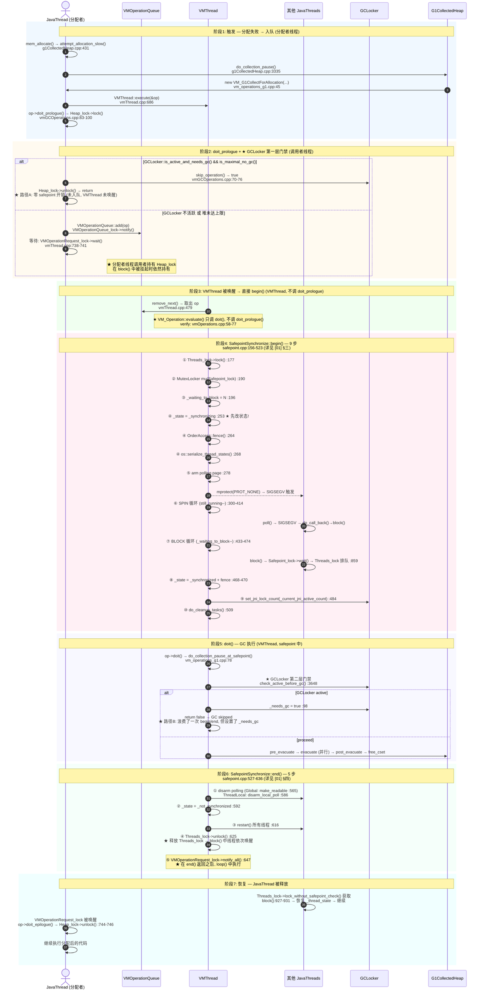
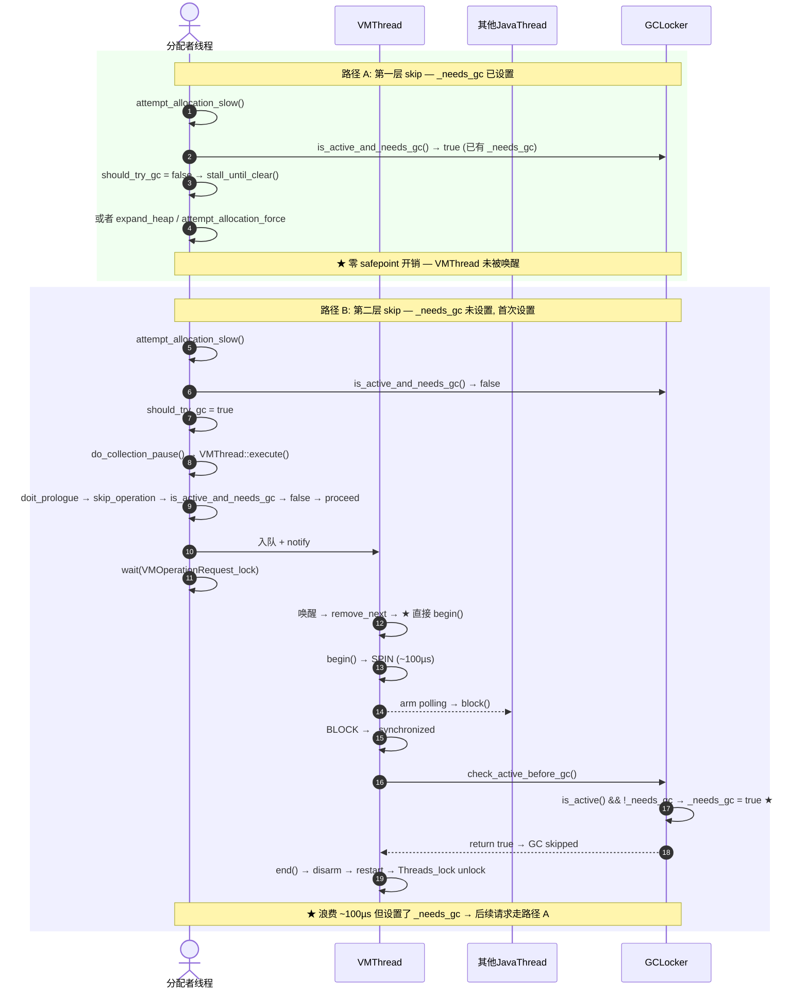

# 05-Safepoint-Full-Path — 从分配失败到 GC 执行到恢复的完整时间线串联

> **标准环境**：OpenJDK 11 slowdebug build, `-Xms8g -Xmx8g -XX:+UseG1GC`, 64-bit Linux x86, G1 Region = 4MB
> **前置文档**：[01-Safepoint-Protocol], [02-Polling-Mechanism], [03-VM-Operation-System], [04-GCLocker]
> **交叉引用**：[07-Thread-Architecture §五], [16-Internal-Locks], [10-NonJavaThread], [06-GC-Memory 03-YoungGC]
> **阅读收益**：理解一次 GC-triggered safepoint 的 10 个阶段、每个阶段属于哪个线程、GCLocker 双层门禁在时间线上的精确位置、`transition_and_fence` + `begin()` fence 的双向 happens-before 协议、不同 VM_Operation 的 pause time 组成差异
> **阅读顺序**：最后阅读（写作顺序也是最后）——本文是前 4 篇的总串联，依赖 [01]~[04] 的全部内容

---

## §〇 源文件清单

| # | 文件 | 完整路径 | 核心函数（已验证行号） | 本文角色 |
|---|------|---------|---------------------|---------|
| 1 | `safepoint.cpp` | `src/hotspot/share/runtime/safepoint.cpp` | `begin()`(:156), `end()`(:527), `block()`(:859), `examine_state_of_thread()`(:1090), `begin_statistics()`(:1353) | ★★★ begin/end 骨架（衔接 [01]） |
| 2 | `safepointMechanism.inline.hpp` | `src/hotspot/share/runtime/safepointMechanism.inline.hpp` | `poll()`(:50), `global_poll()`(:37), `block_if_requested()`(:58) | ★★ arm/poll 节点（衔接 [02]） |
| 3 | `vmThread.cpp` | `src/hotspot/share/runtime/vmThread.cpp` | `loop()`(:465), `evaluate_operation()`(:411), `execute()`(:686) | ★★★ VMThread 事件循环（衔接 [03]） |
| 4 | `vmOperations.hpp` | `src/hotspot/share/runtime/vmOperations.hpp` | `VM_Operation::Mode`(:136), `doit_prologue()`(:181) | ★ VM_Operation 调度（衔接 [03]） |
| 5 | `vmGCOperations.cpp` | `src/hotspot/share/gc/shared/vmGCOperations.cpp` | `doit_prologue()`(:83), `skip_operation()`(:70) | ★★ GCLocker 第一层门禁（衔接 [04]） |
| 6 | `vm_operations_g1.cpp` | `src/hotspot/share/gc/g1/vm_operations_g1.cpp` | `doit_prologue()`(:62), `doit()`(:78) | ★★ G1 GC VM_Operation |
| 7 | `g1CollectedHeap.cpp` | `src/hotspot/share/gc/g1/g1CollectedHeap.cpp` | `attempt_allocation_slow()`(:431), `do_collection_pause()`(:3335), `do_collection_pause_at_safepoint()`(:3639) | ★★★ 分配失败触发 + GCLocker 第二层门禁 + GC 执行 |
| 8 | `gcLocker.cpp` | `src/hotspot/share/gc/shared/gcLocker.cpp` | `check_active_before_gc()`(:94), `is_active_and_needs_gc()`(:83:hpp), `jni_lock()`(:123), `jni_unlock()`(:142) | ★★ GCLocker 协议（衔接 [04]） |
| 9 | `gcLocker.hpp` | `src/hotspot/share/gc/shared/gcLocker.hpp` | 字段定义 `_jni_lock_count`(:45), `_needs_gc`(:46), `_doing_gc`(:48) | ★ GCLocker 状态机 |
| 10 | `interfaceSupport.inline.hpp` | `src/hotspot/share/runtime/interfaceSupport.inline.hpp` | `transition_and_fence()`(:136), `transition_from_native()`(:158) | ★★ 线程状态转换（衔接 [02]） |
| 11 | `os_linux.cpp` | `src/hotspot/os/linux/os_linux.cpp` | `make_polling_page_unreadable()`(:6011), `make_polling_page_readable()`(:6018) | ★ arm/disarm 系统调用（衔接 [02]） |

---

## §一 ★ 全景概览 — safepoint 全生命周期

### ❓ 4 篇文章的子系统如何串在一起？

前 4 篇文章各自拆解了 safepoint 的一个子系统，但它们是孤立的拼图。本文以 `begin()`/`end()` 的 10 个阶段为骨架，把 [02] 的 polling 机制、[03] 的 VM_Operation 调度、[04] 的 GCLocker 门禁嵌入到正确的时间点上。

### 1.1 Mermaid 全景时序图



### 1.2 阶段分解

| # | 阶段 | 执行线程 | 关键锁 | _state | 耗时量级 | [0X] 引用 |
|---|------|---------|--------|--------|---------|----------|
| 1 | 触发：分配失败 → 构造 VM_Operation | 分配者线程 | — | `_not_synchronized` | ~μs | [03] §四 |
| 2 | doit_prologue + GCLocker 第一层门禁 | **分配者线程** | Heap_lock (调用者获取) | `_not_synchronized` | ~μs | [03] §五, [04] §五.2 |
| 3 | VMThread 取出 op → 直接 begin() | VMThread | VMOperationQueue_lock | `_not_synchronized` | ~μs | [03] §三 |
| 4 | begin() 9 步 | VMThread | Threads_lock + Safepoint_lock | →`_synchronizing`→`_synchronized` | ~100μs | [01] §三, [02] §四 |
| 5 | doit() GC 执行 + GCLocker 第二层门禁 | VMThread (+ GC workers) | 同上 + Heap_lock(调用者持有) | `_synchronized` | ~10-500ms | [01] §三-L66, [04] §五.3 |
| 6 | end() 5 步 | VMThread | 同上 | →`_not_synchronized` | ~μs | [01] §四, [02] §五 |
| 7 | 线程恢复 | JavaThreads | 无（已释放） | `_not_synchronized` | ~μs | [01] §五 |

### 1.3 线程上下文切换全景

```
分配者线程:    [触发] [doit_prologue+GCLocker gate1] ──wait── [被唤醒 do_epilogue]
        持有Heap_lock ──────────────────────────────────→ Heap_lock->unlock()
                                   │                    ▲
                                   ▼                    │
VMThread:                  [取op][直接 begin()...][doit()GC][end()...][notify]
     ★ evaluate() 只调 doit(), 不调 doit_prologue()
                                   │
其他JavaThread:                    │ [poll→block()] ──blocked── [被 Threads_lock unlock 释放]
                                   │
GC Worker Thread:                  │            [evacuate 并行]
```

---

## §二 ★★ 从分配失败到 VM_Operation 入队

> 衔接 [03] §四。"分配失败的线程要自己构造 VM_Operation"——为什么不是 VMThread 构造？

### ❓ 为什么 VM_G1CollectForAllocation 的构造发生在分配失败线程中，而不是 VMThread 中？

**设计动机**：GC 的触发原因（如 `_allocation_failure` vs `_gc_locker` vs `System.gc()`）必须在**调用者的上下文**中确定。如果由 VMThread 构造 VM_Operation，分配失败的线程已经把"为什么失败"的信息丢失了——它只知道"拿不到内存"，但不知道是"TLAB 耗尽"还是"Heap 耗尽"还是"Humongous 分配失败"。

### 2.1 G1 分配失败路径（标注行号）

```
应用线程分配对象
  └─ MemAllocator::allocate()                           // memAllocator.cpp
       ├─ TLAB::allocate() 快速路径 (~5ns)               // tlab.inline.hpp
       │   └─ 成功 → return obj (99%+ 走这里)
       └─ 失败 → TLAB refill / 堆直接分配
            └─ G1CollectedHeap::mem_allocate()           // g1CollectedHeap.cpp:416
                 ├─ is_humongous(word_size)?
                 │   └─ Yes → attempt_allocation_humongous()  // Humongous 路径
                 │   └─ No  → attempt_allocation(word_size)   // g1CollectedHeap.cpp:428
                 │            └─ _allocator->attempt_allocation()  // MutatorAllocRegion
                 │                 ├─ 现有 Eden Region 尝试无锁分配 (CAS on _top)
                 │                 └─ 失败 → attempt_allocation_slow()  // ★ 慢路径
                 │                      g1CollectedHeap.cpp:431
```

### 2.2 attempt_allocation_slow() — GCLocker 感知的重试循环

```cpp
// g1CollectedHeap.cpp:431-511
HeapWord *G1CollectedHeap::attempt_allocation_slow(size_t word_size) {
    HeapWord *result = NULL;
    for (uint try_count = 1; ; try_count += 1) {
        {
            MutexLockerEx x(Heap_lock);               // :457 获取 Heap_lock
            result = _allocator->attempt_allocation_locked(word_size);  // :458 持锁重试
            if (result != NULL) return result;

            // ★ GCLocker 感知: 如果 GCLocker 活跃, 先尝试 expand young gen
            if (GCLocker::is_active_and_needs_gc() &&  // :466
                g1_policy()->can_expand_young_list()) {
                result = _allocator->attempt_allocation_force(word_size);  // :469
                if (result != NULL) return result;
            }
            should_try_gc = !GCLocker::needs_gc();     // :477
            gc_count_before = total_collections();      // :479 ★ 快照 GC 计数
        }   // ← Heap_lock 释放

        if (should_try_gc) {
            bool succeeded;
            result = do_collection_pause(word_size, gc_count_before, &succeeded,
                                         GCCause::_g1_inc_collection_pause);  // :488
            if (result != NULL) return result;
            // ... 失败处理
        } else {
            // GCLocker 需要 GC → 等待 locker 清除
            GCLocker::stall_until_clear();              // 详见 [04] §四
        }
    }
}
```

### 2.3 do_collection_pause() — 构造 VM_Operation 并提交

```cpp
// g1CollectedHeap.cpp:3335-3355 (★ 分配者线程中执行)
HeapWord *G1CollectedHeap::do_collection_pause(size_t word_size,
                                               uint gc_count_before,
                                               bool *succeeded,
                                               GCCause::Cause gc_cause) {
    assert_heap_not_locked_and_not_at_safepoint();
    VM_G1CollectForAllocation op(word_size,          // :3340 ★ 分配者线程构造
                                 gc_count_before,    // ★ 防止重复 GC
                                 gc_cause,           // ★ _g1_inc_collection_pause
                                 false,              // ★ 非 initial-mark
                                 g1_policy()->max_pause_time_ms());
    VMThread::execute(&op);                           // :3345 ★ 提交给 VMThread

    HeapWord *result = op.result();                   // :3347 GC 后获取结果
    bool ret_succeeded = op.prologue_succeeded() && op.pause_succeeded();
    *succeeded = ret_succeeded;
    return result;
}
```

### 2.4 VMThread::execute() — doit_prologue + 入队 + 等待

```cpp
// vmThread.cpp:686-746 (★ 分配者线程中执行)
void VMThread::execute(VM_Operation* op) {
    Thread* t = Thread::current();

    if (!t->is_VM_thread()) {                    // ★ 分配者线程走这里
        // ① ★ doit_prologue 在调用者线程执行!!
        if (!op->doit_prologue()) {              // :699 → VM_G1CollectForAllocation::doit_prologue()
            return;   // GCLocker skip → 直接返回, 不入队!
        }

        // ② 入队 + ticket
        op->set_calling_thread(t, Thread::get_priority(t));  // :704
        int ticket = t->vm_operation_ticket();                // :714
        {
            VMOperationQueue_lock->lock_without_safepoint_check();  // :721
            _vm_queue->add(op);                                    // :723
            VMOperationQueue_lock->notify();                       // :725 ★ 唤醒 VMThread
            VMOperationQueue_lock->unlock();                       // :726
        }

        // ③ ★ 分配者线程阻塞等待
        MutexLocker mu(VMOperationRequest_lock);                   // :738
        while(t->vm_operation_completed_count() < ticket) {        // :739
            VMOperationRequest_lock->wait(!t->is_Java_thread());   // :740
        }

        // ④ ★ GC 完成后, 分配者线程执行 epilogue
        if (execute_epilog) {
            op->doit_epilogue();                    // :745 → Heap_lock->unlock()
        }
    }
}
```

**关键点**：
- `doit_prologue()` 在**分配者线程**中执行（步骤①），不是在 VMThread 中。`VMThread::execute()` 虽然叫 "VMThread::"，但它是静态方法，由**调用者线程**调用。`execute()` 的 L689 `if (!t->is_VM_thread())` 确认了这一点——分配者线程不是 VMThread。
- `doit_prologue()` **只被调用一次**。`VM_Operation::evaluate()`（`vmOperations.cpp:58-77`）内部只调 `doit()`，不调 `doit_prologue()`。`VMThread::evaluate_operation()`（`vmThread.cpp:411`）调用 `evaluate()` → `doit()`，也不调 `doit_prologue()`。详见 §三 的源码验证。

---

## §三 ★★★ doit_prologue — GCLocker 第一层门禁（调用者线程）

> 衔接 [03] §五 + [04] §五。doit_prologue **只被调用一次**，在**调用者线程（分配者线程）**的 `VMThread::execute()` 中。

### ❓ doit_prologue 到底在哪个线程中执行？为什么只调用一次？

**面试级问题**：一眼看到 `VMThread::execute()` 这个函数名，直觉会认为它在 VMThread 中执行——但实际上 `execute()` 是 VMThread 的**静态方法**，由**调用者线程**调用。`execute()` 内部的 `if (!t->is_VM_thread())` 分支确认了这一点。

调用链验证（标注线程上下文）：

```
分配者线程 (JavaThread):
  do_collection_pause()                           g1CollectedHeap.cpp:3335
    └─ VMThread::execute(&op)                     vmThread.cpp:686
         ├─ if (!t->is_VM_thread()) {             // L689 ★ 分配者线程
         │    if (!op->doit_prologue()) {          // L699 ★ 唯一调用点
         │        return;     // GCLocker skip → 不入队!
         │    }
         │    VMOperationQueue::add(op)            // L723 入队
         │    VMOperationQueue_lock->notify()       // L725 唤醒 VMThread
         │    VMOperationRequest_lock->wait()       // L740 阻塞等待
         │    op->doit_epilogue()                   // L745 释放 Heap_lock
         │    return;
         │ }

VMThread (被唤醒后):
  VMThread::loop()                                vmThread.cpp:465
    └─ 从队列取 op → SafepointSynchronize::begin()  // 直接 begin!
         └─ evaluate_operation(op)                  // :571
              └─ op->evaluate()                     // :421
                   └─ op->doit()                    // vmOperations.cpp:70 ★ 只有 doit()
```

**`VM_Operation::evaluate()` 的真实源码**（`vmOperations.cpp:58-77`）：

```cpp
void VM_Operation::evaluate() {
  ResourceMark rm;
  LogTarget(Debug, vmoperation) lt;
  if (lt.is_enabled()) { /* 日志 */ }
  doit();                               // ★ 只调 doit()
  if (lt.is_enabled()) { /* 日志 */ }
}
```

**没有 `doit_prologue()` 调用。没有 `doit_epilogue()` 调用。没有 `if` 分支。** `evaluate()` 就是 `doit()` 的薄包装，仅加了日志。

### ❓ 为什么 `evaluate()` 不调 `doit_prologue()`？—— Heap_lock 的归属权设计

如果 `evaluate()` 调用了 `doit_prologue()`（错误设计）：

1. VMThread 尝试 `Heap_lock->lock()` → **自死锁**。分配者线程在 `doit_prologue`（调用者侧 L100）中已经获取了 `Heap_lock`，且在 `VMOperationRequest_lock->wait()` 中阻塞。VMThread 尝试再次获取 → 死锁。

2. `skip_operation()` 的 `_gc_count_before` 比较可能不一致——第一次在调用者线程已经检查过了。

3. `skip=true` 让操作不应该入队，但此时操作**已经入队**——无法撤回。

**正确设计**：`doit_prologue` 只在调用者线程调用一次。一旦入队，不再有"prologue 检查"——第二层 GCLocker 工作在 `doit()` 内部（`check_active_before_gc()`），不需要额外获取锁。

### ❓ Heap_lock 由谁持有、持有多久？

```
时间 →
分配者线程:  [doit_prologue→Heap_lock->lock():100] ───────── [doit_epilogue→Heap_lock->unlock():122]
             |← 入队 → WAIT阻塞 → block()挂起 ─→ 被唤醒→ 释放    |
                                                                  ↑
VMThread:                         [begin()→doit()GC→end()]  [notify_all:647]
```

**关键洞察**：GC 不意味着"VMThread 获取 Heap_lock 后执行 GC"，而是**调用者线程早已持有 Heap_lock**，在 safepoint 中被挂起，VMThread 代表调用者执行 GC。`Heap_lock` 的 owner 始终是调用者线程——它带着锁一起进入了 safepoint。

> 【面试追问】那 GC 代码内部需要 Heap_lock 怎么办？
> → GC 代码通过 `assert_at_safepoint_on_vm_thread()` 确认安全，依赖调用者已持有的 Heap_lock 提供堆的独占访问。这就是为什么 `doit_prologue` 中获取 Heap_lock 必不可少——它保证了整个 GC 期间堆的独占性。

### 3.1 skip_operation() —— GCLocker 第一层门禁（调用者线程中执行）

```cpp
// vmGCOperations.cpp:70-81 (★ 调用者线程中执行)
bool VM_GC_Operation::skip_operation() const {
    // ① 检查是否有其他线程已经做了 GC
    bool skip = (_gc_count_before != Universe::heap()->total_collections());  // :71
    if (_full && skip) {
        skip = (_full_gc_count_before != Universe::heap()->total_full_collections());  // :73
    }

    // ② ★ GCLocker 第一层门禁 — 纯读, 不设 _needs_gc
    if (!skip && GCLocker::is_active_and_needs_gc()) {    // :75
        skip = Universe::heap()->is_maximal_no_gc();       // :76
    }
    return skip;
}
```

**`is_active_and_needs_gc()` 为什么是纯读？**

```cpp
// gcLocker.hpp:83-88
static bool is_active_and_needs_gc() {
    return needs_gc() && is_active_internal();  // ★ 纯读 _needs_gc && _jni_lock_count > 0
}
```

此函数在**非 safepoint 上下文**中调用——`doit_prologue` 在调用者线程中执行，此时尚未进入 safepoint（`_state = _not_synchronized`）。不写 `_needs_gc` 的原因：没有 fence 保证 volatile 写对其他 CPU 的可见性顺序。且 `_needs_gc` 是全局状态标记，为后续所有 GC 请求创建新的决策依据，必须在 safepoint 同步（所有线程状态一致）之后才能安全设置。

**两层的本质差异**：

| 维度 | 第一层: `is_active_and_needs_gc()` | 第二层: `check_active_before_gc()` |
|------|-----------------------------------|-----------------------------------|
| 调用位置 | `skip_operation()` (调用者线程, doit_prologue 中) | `do_collection_pause_at_safepoint()` 入口 |
| 调用线程 | **分配者线程** | **VMThread** (safepoint 中) |
| safepoint 状态 | **不在** safepoint 中 (`_not_synchronized`) | **在** safepoint 中 (`_synchronized`) |
| 写入 | **无**（纯读 volatile） | **写 `_needs_gc = true`** |
| skip 代价 | 0（doit_prologue 返回 false → 不入队 → VMThread 不唤醒） | ~100μs（浪费 begin/end 往返） |
| `_jni_lock_count` 准确性 | 非同步快照（无 fence） | 同步后确定值（`set_jni_lock_count` 已写入） |

### 3.2 两条路径的时间开销对比

| | 路径 A: 第一层 skip | 路径 B: 第一层放行 → 第二层 skip |
|---|---|---|
| doit_prologue 开销 | ~μs (获取+释放 Heap_lock) | ~μs (获取 Heap_lock, 不释放) |
| 入队开销 | 无 (不入队) | ~μs (VMOperationQueue::add) |
| VMThread 取出 | 无 | ~μs |
| begin() SPIN+BLOCK | 无 | ~100μs |
| GCLocker check | is_active_and_needs_gc (纯读) | check_active_before_gc (带副作用) |
| end() disarm | 无 | ~μs |
| **总 safepoint 开销** | **0** (未进入 safepoint) | **~100μs** (但设置了 `_needs_gc`) |

> **关键结论**：第一层 skip 是"零开销"的——doit_prologue 返回 false 后，VM_Operation 根本**不入队**（`vmThread.cpp:700` `return`），VMThread 不被唤醒，safepoint 从未开始。第二层 skip 则浪费了一次完整的 begin/end 往返（arm polling + SPIN + BLOCK + disarm），但代价是将 `_needs_gc` 从 false 设为 true——为后续 GC 请求铺平了"零开销 skip"的道路。

---

## §四 ★★★ begin() — safepoint 建立的 9 步（含 GCLocker 嵌入点）

> 衔接 [01] §三-§五 + [02] §二/§四。每一步标注线程、锁、fence。

### 4.1 步①-③：获取锁 + 初始化计数器

```
safepoint.cpp:156-198

VMThread 执行

① L177: Threads_lock->lock()
   → 阻止线程创建/销毁 (Threads_lock rank=20, 最高优先级)
② L190: MutexLocker mu(Safepoint_lock)
   → 互斥 safepoint 请求 (Safepoint_lock rank=19)
③ L192-198:
   _current_jni_active_count = 0      // ★ JNI critical 累加器清零
   _waiting_to_block = nof_threads    // BLOCK 阶段计数器
   TryingToBlock = 0                   // 在 is_synchronizing() 中尝试 block 的线程数
   still_running = nof_threads        // SPIN 阶段计数器
```

### 4.2 步④-⑤：`_state=_synchronizing` → arm polling + fence

```
safepoint.cpp:249-279

VMThread 执行

④ L253: _state = _synchronizing        ★ 全文最关键的一行 — "先改状态"
   L264: OrderAccess::fence()            ★ StoreLoad — 保证 _state 写入对所有 CPU 可见
   L268: os::serialize_thread_states()   ★ TLB shootdown + store buffer flush (详见 [02] §二)

⑤ arm polling:
   - ThreadLocal 模式 (L255-262):
     for each JavaThread: SafepointMechanism::arm_local_poll(cur)
     OrderAccess::storestore()
   - Global 模式 (L271-279):
     Interpreter::notice_safepoints()
     PageArmed = 1
     os::make_polling_page_unreadable()  → mprotect(PROT_NONE)
```

**`transition_and_fence` + `begin()` fence 的双向配合**（详见 [02] §四）：

```
路径1 (VMThread → JavaThread) — "告诉所有线程: 我要做 safepoint 了"
  VMThread 写 _state=_synchronizing → fence → arm polling page
   JavaThread poll → SIGSEGV → handler → 读到 _state=_synchronizing → block
  ★ fence 保证 _state 写入在 arm 前对 JavaThread 可见

路径2 (JavaThread → VMThread) — "告诉 VMThread: 我已进入阻塞状态"
  JavaThread 写 _thread_state=_thread_blocked → fence → poll
  VMThread SPIN: 读 _thread_state=_thread_blocked → roll_forward
  ★ fence 保证 _thread_state 写入在 SPIN 前对 VMThread 可见

两条 fence 配对形成 "双向 handshake" — 消息传递协议的经典实现
```

### 4.3 步⑥-⑦：SPIN + BLOCK 双循环

```
safepoint.cpp:300-474

VMThread 执行

⑥ SPIN 循环 (L300-414): while(still_running > 0)
   for each JavaThread:
     examine_state_of_thread()          L306
       ├─ _thread_in_native → safepoint_safe? → roll_forward(_at_safepoint)
       │   ★ _at_safepoint 线程: signal_thread_at_safepoint() → _waiting_to_block--
       │   ★ 如果线程在 JNI critical 中: increment_jni_active_count()
       │      这个计数在 end of begin() 时写入 GCLocker::_jni_lock_count
       ├─ _thread_in_vm     → roll_forward(_call_back)
       │   ★ _call_back 线程: 不递减 _waiting_to_block — 线程自己会在
       │     transition_and_fence → block_if_requested → block() 中处理
       └─ _thread_in_Java   → 保持 _running ← 等线程 poll 到
          _thread_blocked    → safepoint_safe → roll_forward(_at_safepoint)

   自旋策略 (L402-409):
     - steps < safepoint_spin_before_yield → SpinPause() (MP-Polite spin)
     - steps < _defer_thr_suspend_loop_count → os::naked_yield()
     - else → os::naked_short_sleep(1)

⑦ BLOCK 循环 (L433-474): while(_waiting_to_block > 0)
   Safepoint_lock->wait(true)  ← 阻塞等最后一个线程 notify_all()
   ★ 每个 thread block() L901: _waiting_to_block-- → 如果到0 → Safepoint_lock->notify_all()

   ★ 在 BLOCK 循环中，VMThread 在 Safepoint_lock 上睡眠。
     当最后一个线程在 block() 中执行 Safepoint_lock->notify_all() 后，
     VMThread 被唤醒 → _waiting_to_block == 0 → 退出循环
```

**examine_state_of_thread() 对 _thread_in_native 的处理**（`safepoint.cpp:1090-1144`）：

```cpp
void ThreadSafepointState::examine_state_of_thread() {
    JavaThreadState state = _thread->thread_state();
    _orig_thread_state = state;  // ★ 快照原始状态

    if (_thread->is_ext_suspended()) {
        roll_forward(_at_safepoint);   // 已挂起 → 视为已到达
        return;
    }

    // ★ _thread_in_native / _thread_blocked → safepoint_safe → _at_safepoint
    if (SafepointSynchronize::safepoint_safe(_thread, state)) {
        SafepointSynchronize::check_for_lazy_critical_native(_thread, state);
        roll_forward(_at_safepoint);   // → signal_thread_at_safepoint()
        return;
    }

    // ★ _thread_in_vm → _call_back (等待线程自己过渡)
    if (state == _thread_in_vm) {
        roll_forward(_call_back);
        return;
    }

    // 其他状态 (_thread_in_Java, _thread_in_native_trans 等) → 保持 _running
}
```

**roll_forward(_at_safepoint) 的关键副作用**：

```cpp
// safepoint.cpp:1148-1169
void ThreadSafepointState::roll_forward(suspend_type type) {
    _type = type;
    switch(_type) {
        case _at_safepoint:
            SafepointSynchronize::signal_thread_at_safepoint();  // ★ _waiting_to_block--
            if (_thread->in_critical()) {
                SafepointSynchronize::increment_jni_active_count();  // ★ 累计 JNI critical
            }
            break;
        case _call_back:
            set_has_called_back(false);  // 等线程 block()
            break;
    }
}
```

### 4.4 步⑧-⑩：`_synchronized` + GCLocker 快照 + cleanup

```
safepoint.cpp:468-522

VMThread 执行

⑧ L468: _state = _synchronized     ★ 正式进入 safepoint
   L470: OrderAccess::fence()       ★ 保证状态对 block() 中线程可见

⑨ L484: GCLocker::set_jni_lock_count(_current_jni_active_count)
   ★ 将 SPIN 循环中通过 roll_forward(_at_safepoint) 累积的
     JNI critical 线程数写入 GCLocker::_jni_lock_count。
   ★ 这个值的含义: "safepoint 建立时刻有多少线程在 JNI critical 中"
   ★ check_active_before_gc() 读取 is_active() → _jni_lock_count > 0
     这个值现在可以被信任了——所有线程已经通过 safepoint 同步

⑩ L509: do_cleanup_tasks()
   - InlineCacheBuffer::update_inline_caches()
   - StringTable/SymbolTable rehashing
   - ObjectSynchronizer::deflate_idle_monitors()
   - nmethod marking (NMethodSweeper)
```

**GCLocker 不在 begin() 中 — 证据汇总**（[01] 的核心结论）：

| 搜索位置 | 结果 | 说明 |
|---------|------|------|
| `begin()` L156-523 | 没有 `is_active_and_needs_gc()` | GCLocker 不在 begin() 中 |
| `begin()` L484 | `GCLocker::set_jni_lock_count()` | 只有计数器快照，不是 GC 跳过决策 |
| `doit_prologue()` L70-81 | `is_active_and_needs_gc()` | ★ 第一层门禁 — 在 VM_Operation 层 |
| `do_collection_pause_at_safepoint()` L3648 | `check_active_before_gc()` | ★ 第二层门禁 — 在 GC 入口 |

---

## §五 ★★★ doit() 内部 — GCLocker 第二层门禁 + GC 执行

> 衔接 [01] §三-L66 + [04] §五.3 + [06-GC-Memory 03-YoungGC]。

### 5.1 do_collection_pause_at_safepoint 源码走读

```cpp
// g1CollectedHeap.cpp:3639-3710
bool G1CollectedHeap::do_collection_pause_at_safepoint(double target_pause_time_ms) {
    assert_at_safepoint_on_vm_thread();               // :3640 ★ 必须在 safepoint 中 + VMThread
    guarantee(!is_gc_active(), "collection is not reentrant");  // :3641

    // ★★★ GCLocker 第二层门禁 ★★★
    if (GCLocker::check_active_before_gc()) {          // :3648
        return false;                                  // :3650 GC 放弃
    }

    _gc_timer_stw->register_gc_start();                // :3653
    GCIdMark gc_id_mark;                               // :3655 ★ GCId 在此创建
    // ↑ GCIdMark 在 doit_prologue 成功后、doit 开始前创建
    // 如果 GCLocker skip → 不会有 GCId → GC log 中不可见

    _gc_tracer_stw->report_gc_start(gc_cause(), _gc_timer_stw->gc_start());

    g1_policy()->note_gc_start();                      // :3661

    // Phase 1: pre_evacuate
    //   - 选择 Collection Set (CSet)
    //   - decide_on_conc_mark_initiation()
    //   - wait_for_root_region_scanning()

    // Phase 2: evacuate (并行, GC Worker Threads)
    //   - 根扫描 + 对象复制 + RSet 扫描

    // Phase 3: post_evacuate
    //   - 引用处理 (ReferenceProcessor)
    //   - 字符串去重 (StringDedup)
    //   - 重建 RSet

    // Phase 4: free_collection_set
    //   - 释放 CSet 中的 Region → FreeRegionList
    //   - 更新 HeapRegionManager

    // ... (详见 [06-GC-Memory 03-YoungGC])
}
```

### 5.2 GCLocker 第二层 — `check_active_before_gc()` 设置 `_needs_gc`

```cpp
// gcLocker.cpp:94-102
bool GCLocker::check_active_before_gc() {
    assert(SafepointSynchronize::is_at_safepoint(), "only read at safepoint");
    if (is_active() && !_needs_gc) {    // ★ _jni_lock_count > 0 && !_needs_gc
        verify_critical_count();
        _needs_gc = true;               // ★★★ 副作用!! _needs_gc: false → true
        log_debug_jni("Setting _needs_gc.");
    }
    return is_active();                  // ★ 返回 _jni_lock_count > 0
}
```

### ❓ 为什么需要两层门禁？`is_active_and_needs_gc()` vs `check_active_before_gc()` 的本质差异

| 维度 | 第一层: `is_active_and_needs_gc()` | 第二层: `check_active_before_gc()` |
|------|-----------------------------------|-----------------------------------|
| 调用位置 | `skip_operation()` (doit_prologue 中) | `do_collection_pause_at_safepoint()` 入口 |
| 调用线程 | 分配者线程 | VMThread (safepoint 中) |
| safepoint 状态 | **不在** safepoint 中 | **在** safepoint 中 |
| 读取 | `_needs_gc && _jni_lock_count > 0` | `_jni_lock_count > 0`（通过 is_active） |
| 写入 | **无**（纯读） | **写 `_needs_gc = true`** |
| skip 代价 | 0（doit_prologue 返回 false → 不入队） | ~100μs（浪费 begin/end 往返） |
| 可靠性 | `_jni_lock_count` 可能不是最新值 | `_jni_lock_count` 已通过 safepoint 同步 |

**为什么第一层不能写 `_needs_gc`？**

`doit_prologue` 的第一次调用在分配者线程中，此时**不在 safepoint 中**。写 `volatile bool _needs_gc = true` 只保证单个变量对其他 CPU 的可见性，但不保证与其他变量（如 `_safepoint_counter`、`_state`、`_jni_lock_count`）之间的顺序关系。只有在 safepoint 的 fence（`begin()` L264 + L470）之后，才能安全地写 `_needs_gc`——此时所有线程已经同步，内存状态一致。

**为什么第二层可以写 `_needs_gc`？**

`check_active_before_gc()` 有 `assert(SafepointSynchronize::is_at_safepoint())` ——此时 `_state = _synchronized`，所有线程已通过 SPIN+BLOCK 同步。`begin()` L470 的 `OrderAccess::fence()` 保证此时 VMThread 看到的所有 JavaThread 状态是同步前的最终状态。在此上下文中写 `_needs_gc` 是安全的。

### 5.3 `_needs_gc` 首次设置的完整路径

```
第一次分配失败 (GCLocker inactive):
  attempt_allocation_slow()
    → GCLocker::is_active_and_needs_gc() = false  (因为 _needs_gc=false)
    → should_try_gc = true → do_collection_pause()
    → doit_prologue: skip_operation → GCLocker::is_active_and_needs_gc() = false → skip=false
    → 入队 → VMThread 唤醒 → 直接 begin()
    → begin() → SPIN → BLOCK → _synchronized
    → do_collection_pause_at_safepoint()
      → check_active_before_gc(): is_active() = false → return false → GC 继续

第二次分配失败 (GCLocker inactive → 正常 GC):

第三次分配失败 (GCLocker 刚好活跃):
  attempt_allocation_slow()
    → GCLocker::is_active_and_needs_gc() = false  (_needs_gc 仍是 false)
    → should_try_gc = true → do_collection_pause()
    → doit_prologue: skip_operation → is_active_and_needs_gc() = false → skip=false
    → 入队 → VMThread 唤醒 → begin() → _synchronized
    → do_collection_pause_at_safepoint()
      → check_active_before_gc(): is_active() = true && !_needs_gc
        → _needs_gc = true ★★★ 首次设置!!!
        → return true → GC 放弃 ✗
    → end()

第四次分配失败 (GCLocker active, _needs_gc=true):
  attempt_allocation_slow()
    → GCLocker::is_active_and_needs_gc() = true ★ (已有 _needs_gc)
    → should_try_gc = false
    → GCLocker::stall_until_clear() ← 等 JNI critical 退出
    → 或者: attempt_allocation_force() / expand_heap
    → 如果都不是: 返回 NULL → OutOfMemory

第五次分配失败 (GCLocker inactive again):
  attempt_allocation_slow()
    → GCLocker::is_active_and_needs_gc() = false  (_needs_gc 已被 jni_unlock 清除)
    → should_try_gc = true → do_collection_pause()
    → doit_prologue: skip_operation → is_active_and_needs_gc() = false
    → 正常 GC 路径
```

> 一次第二层 skip（浪费 ~100μs）换来了后续**所有**尝试的零开销 skip。这就是 GCLocker 协议的精妙之处："舍得花一次冤枉钱，后面全是赚的"。

### 5.4 GCIdMark 的创建时机

`GCIdMark`（`g1CollectedHeap.cpp:3655`）在 `doit_prologue()` 成功后、`doit()` 开始前创建。这意味着：

- **如果 GCLocker 在第一层 skip**：`doit_prologue` 返回 false → 不入队 → 不会到达 `doit()` → 没有 `GCIdMark` → GC log 中不可见 ✓
- **如果 GCLocker 在第二层 skip**：`doit_prologue` 返回 true → begin() → `doit()` → `do_collection_pause_at_safepoint()` → `check_active_before_gc()` 返回 true → return false → GCIdMark dtor → GCId 被回收 → GC log 中仍不可见 ✓
- **只有真正执行了 GC** 的 safepoint 才会在 GC log 中留下 `GC(123)` 这样的条目

---

## §六 ★★ end() — safepoint 拆除 + 恢复

> 衔接 [01] §四 + [02] §五。

### 6.1 end() 5 步走读

```
safepoint.cpp:527-636

VMThread 执行

① disarm polling (Global 模式: 先 disarm 再改状态):
   - L565: os::make_polling_page_readable() → mprotect(PROT_READ)
   - L566: PageArmed = 0
   - L571: Interpreter::ignore_safepoints()
   - ThreadLocal 模式: L586 SafepointMechanism::disarm_local_poll(current)

② _state = _not_synchronized:
   - ThreadLocal 模式: L580 _state=_not_synchronized → storestore (先改状态再 disarm)
   - Global 模式: L592 _state=_not_synchronized → OrderAccess::fence()

③ restart() 所有线程:
   L585: cur_state->restart() → _type = _running
   ★ ThreadLocal 模式 (L580-588): 在 Safepoint_lock 保护下; Global 模式 (L589-619): 先改 _state → notify_all → restart

④ L625: Threads_lock->unlock()
   ★★★ 释放 Threads_lock → 所有在 block() L927 排队的线程被唤醒！
   block() 中的线程执行流:
     L927: Threads_lock->lock_without_safepoint_check()  ← 获取锁!
     L930: thread->set_thread_state(state)               ← 恢复 _thread_in_Java
     L931: Threads_lock->unlock()                        ← 释放锁
     → 线程继续执行 (从 poll 点返回)
```

### 6.2 block() 中线程的恢复路径

```cpp
// safepoint.cpp:859-958 (JavaThread 执行)
void SafepointSynchronize::block(JavaThread *thread) {
    // ... 状态检查和验证 ...

    JavaThreadState state = thread->thread_state();
    thread->frame_anchor()->make_walkable(thread);

    switch(state) {
        case _thread_in_vm_trans:
        case _thread_in_Java:                          // ★ 从编译代码 poll 来
            thread->set_thread_state(_thread_in_vm);   // :888 假装在 VM 中

            if (is_synchronizing()) {
                Atomic::inc(&TryingToBlock);            // :891
            }

            // ★ 获取 Safepoint_lock → 递减 _waiting_to_block → notify
            Safepoint_lock->lock_without_safepoint_check();   // :897
            if (is_synchronizing()) {
                _waiting_to_block--;                    // :901
                thread->safepoint_state()->set_has_called_back(true);
                if (thread->in_critical()) {
                    increment_jni_active_count();       // :907
                }
                if (_waiting_to_block == 0) {
                    Safepoint_lock->notify_all();       // :912 ★ 最后一个线程唤醒 VMThread
                }
            }
            thread->set_thread_state(_thread_blocked);  // :922
            Safepoint_lock->unlock();                   // :923

            // ★★★ 在 Threads_lock 上排队 — 等待 end() 释放
            Threads_lock->lock_without_safepoint_check();  // :927
            thread->set_thread_state(state);               // :930 恢复原始状态
            Threads_lock->unlock();                        // :931
            break;  // ← 从这里恢复, 返回 poll 点继续执行

        case _thread_in_native_trans:
        case _thread_blocked_trans:
        case _thread_new_trans:
            thread->set_thread_state(_thread_blocked);  // :949
            // ★ 同样在 Threads_lock 上排队
            Threads_lock->lock_without_safepoint_check();  // :956
            // 恢复状态...
            break;
    }
}
```

**Threads_lock 上的排队**：所有进入 `block()` 的线程都会在 L927（或 L956）等待 `Threads_lock`。`end()` L625 释放 `Threads_lock` 后，这些线程依次获取锁、恢复状态、释放锁、继续执行。这是一个**顺序出队**的过程——不会一拥而上。

### 6.3 pause_time 的计算

`safepoint.cpp` 的统计函数揭示 pause time 的组成：

| 阶段 | 统计变量 | 来源函数 | 单位 |
|------|---------|---------|------|
| 时间戳 | `_time_stamp` | L1357 | 秒 |
| 线程数 | `_nof_total_threads`, `_nof_initial_running_threads` | L1365-1366 | 个 |
| Spin 时间 | `_time_to_spin` | `begin_statistics`→`update_statistics_on_spin_end` | 纳秒 → 毫秒 |
| Block 时间 | `_time_to_wait_to_block` | `update_statistics_on_sync_end` | 纳秒 → 毫秒 |
| Sync 总时间 | `_time_to_sync` | `update_statistics_on_sync_end` L1408 | 纳秒 → 毫秒 |
| Cleanup 时间 | `_time_to_do_cleanups` | `update_statistics_on_cleanup_end` | 纳秒 → 毫秒 |
| VM Op 时间 | `_time_to_exec_vmop` | `end_statistics` L1429 | 纳秒 → 毫秒 |

**输出格式**（`safepoint.cpp:1452-1478`）：

```
     timestamp: vmop_name                  [tot_thr init_run wait_blk][  spin    block     sync  cleanup    vmop  ]  page_trap
```

例如：
```
   166.900: G1CollectForAllocation         [      50                7                6][  0.381   0.021   0.453   0.005 156.234 ]   43
```

- `spin=0.381ms`: SPIN 阶段（等线程 poll 到）
- `block=0.021ms`: BLOCK 阶段（等线程状态转换）
- `sync=0.453ms`: spin+block 总和
- `cleanup=0.005ms`: do_cleanup_tasks() 耗时
- `vmop=156.234ms`: GC 实际执行时间
- `page_trap=43`: 通过 polling page trap 到达 safepoint 的线程数

---

## §七 ★★★ GCLocker 在两条路径上（第一层 skip vs 第二层 skip）的对比

> 衔接 [04]。这是 [04] 没有明确量化的关键结论。

### 7.1 路径 A vs 路径 B 的并行时序图



### 7.2 JNI critical 在 safepoint 中退出的竞态窗口

```
场景: VMThread 在 begin() SPIN 阶段。Thread-A 在 JNI critical 中 (_thread_in_native)。

时间 →  
T0: begin() L253: _state = _synchronizing
T1: begin() L278: arm polling page
    Thread-A 状态: _thread_in_native, in_critical() = true
T2: SPIN: examine_state_of_thread(Thread-A)
    → safepoint_safe(_thread_in_native) → true
    → roll_forward(_at_safepoint):
        → signal_thread_at_safepoint()     // _waiting_to_block--
        → increment_jni_active_count()     // _current_jni_active_count++  ★ JNI critical 被计数
T3: Thread-A 释放 JNI critical (jni_unlock):
    → MutexLocker mu(JNICritical_lock)
    → _jni_lock_count--  (从 safepoint 快照看: 此时 _jni_lock_count 是旧值)
    → exit_critical()
    → needs_gc() && !is_active_internal() ?
        → 如果 _needs_gc 是 true:
           _doing_gc = true
           MutexUnlocker munlock(JNICritical_lock)
           heap->collect(GCCause::_gc_locker)    ★ 尝试 GC
           → 但 VMThread 正在 safepoint 中!
           → heap->collect → VM_G1CollectForAllocation → VMThread::execute
           → doit_prologue → skip_operation → GCLocker::is_active_and_needs_gc()
           → _needs_gc=true (第二层已设置) && _jni_lock_count 可能是 0 (因为 jni_unlock)
           → is_maximal_no_gc()? → 如果堆已到最大 → skip → return false
           → doit_prologue 返回 false → 执行 epilogue? 已经在 execute 中
           → execute() 返回 → heap->collect() 返回 false → GC 未执行
           ★ 关键: jni_unlock 中的 heap->collect() 尝试 GC 失败,
              因为此时已有 safepoint 在进行中。GC 请求被 doit_prologue 拒绝。

        → 如果 _needs_gc 是 false:
           不走 GC 路径, 直接 notify_all, 继续

    但实际上:
    → Thread-A 的 _thread_state 仍然被 VMThread 标记为 _at_safepoint
    → Thread-A 在 _thread_in_native 中继续执行 jni_unlock 的代码
    → ★ Thread-A 不在 block() 中 — 它被 roll_forward(_at_safepoint) 放行了
    → 这意味着 Thread-A 在 safepoint 期间仍在运行!
    → 但它只执行 JNI 代码, 不会动 Java 堆 (JNI critical 的语义)
    → GC 安全!
```

### 7.3 jni_unlock 的 `heap->collect()` 如何与正在进行的 safepoint 协调

```
jni_unlock 路径 (gcLocker.cpp:142-167):

    jni_unlock(thread):
        MutexLocker mu(JNICritical_lock)      ① 获取 JNICritical_lock
        _jni_lock_count--                      ② 递减计数
        exit_critical()
        if (needs_gc() && !is_active_internal()):
            _doing_gc = true                   ③ 设置标志
            MutexUnlocker munlock              ④ 释放 JNICritical_lock (允许其他线程进入)
            heap->collect(GCCause::_gc_locker) ⑤ 执行 GC
            _doing_gc = false                  ⑥ 清除标志
            _needs_gc = false                  ⑦ 清除标记
            JNICritical_lock->notify_all()      ⑧ 唤醒等待的线程

与 safepoint 的交互:

情况A: jni_unlock 在 safepoint 前执行
    → heap->collect() → VM_G1CollectForAllocation → begin() → ... → end()
    → 正常的 GC, 无特殊冲突
    → 之后 begin() 的检查: _needs_gc=false (已被清除), is_active=false → 正常

情况B: jni_unlock 在 begin() SPIN 阶段执行 (如 §7.2 T3)
    → Thread-A 在 _thread_in_native → roll_forward(_at_safepoint)
    → Thread-A 继续执行 jni_unlock
    → heap->collect() → VM_G1CollectForAllocation → VMThread::execute()
      → 分配者线程 (Thread-A) 执行 doit_prologue → skip_operation
      → 此时 _needs_gc 可能是 true (已被第二层门禁设置)
      → _jni_lock_count 是 safepoint 快照值 (可能 >0) 还是 jni_unlock 后的值 (0)?
      → ★ is_active_internal() 读 volatile _jni_lock_count — 这是最新值!
      → 如果 _jni_lock_count==0: is_active_and_needs_gc() = needs_gc(true) && is_active(false) = false
      → skip_operation 返回 false
      → 但 Heap_lock->lock() 可能阻塞: 第一个分配者线程持有 Heap_lock
         (在它的 doit_prologue L100 中获取, 现被 block() 挂起)
      → ★ 此时 Heap_lock 状态: owner 是第一个分配者线程(非 VMThread!)
         Thread-A 在 VMThread::execute 的 doit_prologue 中尝试 Heap_lock->lock()
         → 阻塞! 等第一个分配者线程在 doit_epilogue 中释放
      → end() 后第一个分配者线程被唤醒 → doit_epilogue L122 → Heap_lock->unlock()
      → Thread-A 获取 Heap_lock → skip_operation 返回 false → proceed
      → doit_prologue 成功 → 入队 (新 safepoint 请求!)
      → VMThread 在 loop() 中处理下一个 safepoint
      → ★ 这是第二个 safepoint, 与第一个完全独立

情况C: heap->collect() 发生在已经 skip 的 safepoint 的 end() 之后
    → 此时所有线程已恢复 → 正常的 GC 流程
```

**关键结论**：`jni_unlock` 中的 `heap->collect()` 不会与正在进行的 safepoint 冲突：
- 如果 safepoint 还在进行中 → Thread-A 被 roll_forward(_at_safepoint) 放行，可以执行 `jni_unlock`，但 `heap->collect()` 中的 `doit_prologue` 会被 `Heap_lock` 阻塞（第一个分配者线程在 `doit_prologue` 中获取了 Heap_lock，正在 `block()` 中被挂起）
- 如果 safepoint 已经结束 → 正常执行 GC
- `_needs_gc` 的生命周期由 GCLocker 协议保证：设置（第二层门禁）→ 在 safepoint 后传递给 jni_lock slow path → 阻止新 critical → 所有 critical 退出 → jni_unlock 执行 GC → 清除 `_needs_gc`

---

## §八 ★★ 时间开销分解 + 不同 VM_Operation 对比

### 8.1 PrintSafepointStatistics 输出格式

启用 `-XX:+PrintSafepointStatistics` 后输出（`safepoint.cpp:1452-1478`）：

```
         vmop                    [threads: total initially_running wait_to_block ][time: spin block sync cleanup vmop ] page_trap
166.900: G1CollectForAllocation  [      50                7                6  ][  381    21   453      5 156234 ]   43
```

| 字段 | 单位 | 说明 | 源码 (safepoint.cpp) |
|------|------|------|---------------------|
| `spin` | 毫秒 | SPIN 循环耗时 (等线程 poll) | L1471 |
| `block` | 毫秒 | BLOCK 循环耗时 (等线程状态转换) | L1472 |
| `sync` | 毫秒 | spin+block 总同步时间 | L1473 |
| `cleanup` | 毫秒 | do_cleanup_tasks 耗时 | L1474 |
| `vmop` | 毫秒 | doit() 执行耗时 | L1475 |
| `page_trap` | 个 | 通过 polling page SIGSEGV 到达的线程数 | L1477 |

### 8.2 不同 VM_Operation 的 pause 组成对比

```
┌─────────────────────────────────────────────────────────────────────────────────┐
│  safepoint 总 pause time = lock_acquire + spin + block + cleanup + vmop        │
│  (lock_acquire 纳秒级, 忽略不计)                                                  │
├─────────────────────────────────────────────────────────────────────────────────┤
│                                                                                 │
│  ① G1CollectForAllocation (Young GC):                                           │
│     ┌─────────────┬───────┬─────────┬───────┬────────────────────────────────┐  │
│     │ spin(~100μs)│ block │ cleanup │ vmop = 10ms - 500ms                     │  │
│     │  ████       │ ~10μs │ ~5μs    │  ██████████████████████████████████████ │  │
│     └─────────────┴───────┴─────────┴────────────────────────────────────────┘  │
│     dominant: vmop_time (GC 自身占 >99%)                                         │
│                                                                                 │
│  ② RevokeBias (偏向锁撤销):                                                      │
│     ┌───────────────────────────────────┬──────────────────────────────────────┐│
│     │ spin(~100μs)                      │ vmop(<1μs, 一个 CAS)                  ││
│     │  ████████████████████████████████  │  ▏                                    ││
│     └───────────────────────────────────┴──────────────────────────────────────┘│
│     dominant: spin_time (等线程占 >99%) — "杀鸡用牛刀"                             │
│                                                                                 │
│  ③ noop safepoint (清理任务, 如 GuaranteedSafepointInterval):                    │
│     ┌───────────────────┬──────────────────┬────────────────────────────────┐   │
│     │ spin(~100μs)       │ cleanup(~10μs)    │ vmop(0)                       │   │
│     │  ████████████████  │  ██               │                               │   │
│     └───────────────────┴──────────────────┴────────────────────────────────┘   │
│     dominant: spin_time (没有 GC, 只有清理)                                        │
│                                                                                 │
│  ④ GCLocker Initiated GC (GCCause::_gc_locker):                                  │
│     同 ① Young GC, 但 cause 是 _gc_locker                                        │
│     heap->collect() 由 jni_unlock 触发 (最后一个 JNI critical 退出)              │
│     此时 VMThread 不在 safepoint 中 → 正常 safepoint 流程                         │
│                                                                                 │
└─────────────────────────────────────────────────────────────────────────────────┘
```

### 8.3 为什么 RevokeBias 的 safepoint 昂贵？

`VM_RevokeBias::doit()` 通常只需要一个 CAS 操作（撤销某个对象的偏向锁），耗时 <1μs。但 `begin()` 仍然需要：
1. `Threads_lock->lock()` — 纳秒级
2. `Safepoint_lock->lock()` — 纳秒级
3. arm polling page (`mprotect` + TLB shootdown) — ~10μs
4. SPIN 循环（等所有线程 poll） — ~50-100μs（取决于线程数和 CPU 负载）
5. BLOCK 循环（等线程完成状态转换） — ~10μs
6. `_state = _synchronized` + cleanup — ~10μs

**总计**: ~100μs 的同步开销，用于 <1μs 的有效工作。效率 ~1%。

这就是为什么 JDK 15+ 引入了 Thread-Local Handshake——允许只针对单个线程进行 safepoint 操作（如偏向锁撤销），避免全局 STW。

### 8.4 如何排查长 pause 问题

```bash
# 启用 safepoint 统计
-XX:+PrintSafepointStatistics
-XX:PrintSafepointStatisticsCount=1   # 每次 safepoint 都打印

# 排查方向:
# - vmop 列高 → GC 慢 (调优 GC 参数)
# - spin 列高 → 线程多 / CPU 饱和 (检查线程数 / CPU 使用率)
# - block 列高 → 线程在 VM 中卡住 (死锁? 长时间 JNI?)
# - page_trap << total_threads → 很多线程在 native/blocked 中 (normal for GCLocker)
```

---

## §九 GDB 验证 + 可证伪断言

### 断言 1：safepoint 全链路调用栈验证

```gdb
# 在 begin() 入口打断点，打印调用栈
(gdb) br SafepointSynchronize::begin
(gdb) commands
> silent
> bt 5
> continue
> end

# 预期输出 (在 VMThread 中):
# #0  SafepointSynchronize::begin()
# #1  VMThread::loop() at vmThread.cpp:565
# #2  VMThread::run() at vmThread.cpp:316
# #3  Thread::call_run() at thread.cpp:380
# #4  thread_native_entry at os_linux.cpp:xxx

# 可证伪: 如果 begin() 在非 VMThread 中被调用 → assert 失败 (L160)
```

### 断言 2：GCLocker first-layer vs second-layer skip 的断点验证

```gdb
# 第一层 skip 断点
(gdb) br vmGCOperations.cpp:70
(gdb) commands
> silent
> printf "skip_operation: _gc_count_before=%d, total_collections=%d, is_active_and_needs_gc=%d\n", _gc_count_before, Universe::heap()->total_collections(), GCLocker::is_active_and_needs_gc()
> continue
> end

# 第二层 skip 断点
(gdb) br g1CollectedHeap.cpp:3648
(gdb) commands
> silent
> printf "check_active_before_gc: is_active=%d, _needs_gc=%d, _state=%d\n", GCLocker::is_active(), GCLocker::needs_gc(), SafepointSynchronize::_state
> continue
> end

# 可证伪:
# - 如果第一层 skip: doit_prologue 返回 false → VM_Operation 不入队
# - 如果第二层 skip: _state 必须为 _synchronized (2)
```

### 断言 3：begin() fence + transition_and_fence fence 的双向 happens-before

```gdb
# 验证 _state 写入先于 arm polling
(gdb) br safepoint.cpp:253
(gdb) commands
> silent
> printf "_state = _synchronizing at %d\n", SafepointSynchronize::_state
> continue
> end

(gdb) br safepoint.cpp:278
(gdb) commands
> silent
> printf "arm polling page: PageArmed=%d, _state=%d\n", PageArmed, SafepointSynchronize::_state
> continue
> end

# 预期: L253 在 L278 之前 → _state 写入在 arm 之前
# 可证伪: 如果出现 L278 在 L253 之前 → 时间窗口存在竞态
```

### 断言 4：PrintSafepointStatistics 各字段的源码级对应

```gdb
# 在 print_statistics 打断点，检查字段值
(gdb) br SafepointSynchronize::print_statistics
(gdb) commands
> silent
> printf "sstats[%d]: spin=%lld block=%lld sync=%lld cleanup=%lld vmop=%lld\n",
  _cur_stat_index,
  (long long)(_safepoint_stats[_cur_stat_index]._time_to_spin / 1000),
  (long long)(_safepoint_stats[_cur_stat_index]._time_to_wait_to_block / 1000),
  (long long)(_safepoint_stats[_cur_stat_index]._time_to_sync / 1000),
  (long long)(_safepoint_stats[_cur_stat_index]._time_to_do_cleanups / 1000),
  (long long)(_safepoint_stats[_cur_stat_index]._time_to_exec_vmop / 1000)
> continue
> end

# 可证伪: spin_time + block_time ≈ sync_time (误差 <100ns)
```

### 断言 5：_needs_gc 首次设置的精确断点

```gdb
(gdb) br gcLocker.cpp:98
(gdb) commands
> silent
> printf "_needs_gc set to TRUE: _jni_lock_count=%d, _state=%d\n", GCLocker::_jni_lock_count, SafepointSynchronize::_state
> continue
> end

# 可证伪:
# - _state 必须为 _synchronized (2) — 只能在 safepoint 中设置
# - _jni_lock_count 必须 >0 (因为 is_active() 检查)
```

### 断言 6：jni_unlock 的 heap->collect() 在 safepoint 中/后的不同行为

```gdb
(gdb) br gcLocker.cpp:161
(gdb) commands
> silent
> printf "jni_unlock heap->collect(): _needs_gc=%d, _doing_gc=%d, _state=%d, is_at_safepoint=%d\n",
  GCLocker::needs_gc(), GCLocker::_doing_gc, SafepointSynchronize::_state, SafepointSynchronize::is_at_safepoint()
> continue
> end

# 可证伪:
# - 如果 is_at_safepoint() → heap->collect() 中的 doit_prologue 会被 Heap_lock 阻塞
# - 如果 !is_at_safepoint() → 正常执行 GC
```

### 断言 7：block() 中线程在 Threads_lock 上排队的验证

```gdb
(gdb) br safepoint.cpp:927
(gdb) commands
> silent
> printf "block() Threads_lock->lock_without_safepoint_check: thread=%s, state=%d, _waiting_to_block=%d\n",
  thread->name(), thread->thread_state(), _waiting_to_block
> continue
> end

# 可证伪:
# - 在 _state == _synchronized 期间，_waiting_to_block 应为 0
# - 线程获取 Threads_lock 应发生在 end() 释放 Threads_lock 之后
```

### 断言 8：doit_epilogue 中 Heap_lock->notify_all() 的触发点

```gdb
(gdb) br vmGCOperations.cpp:120
(gdb) commands
> silent
> printf "doit_epilogue Heap_lock->notify_all(): calling_thread=%s\n", calling_thread()->name()
> continue
> end

# 可证伪: 此断点应在 end() 之后、VMOperationRequest_lock->notify_all() 之后触发
```

### 断言 9：分配失败 → VM_G1CollectForAllocation → doit_prologue 的完整调用栈

```gdb
(gdb) br G1CollectedHeap::do_collection_pause
(gdb) commands
> silent
> bt 10
> continue
> end

# 预期输出:
# #0  G1CollectedHeap::do_collection_pause()
# #1  G1CollectedHeap::attempt_allocation_slow() at g1CollectedHeap.cpp:488
# #2  G1CollectedHeap::attempt_allocation() at g1CollectedHeap.cpp:428
# #3  G1CollectedHeap::mem_allocate() at g1CollectedHeap.cpp:428
# #4  MemAllocator::allocate_outside_tlab()
# #5  MemAllocator::allocate()
# #6  InstanceKlass::allocate_instance()
# ... (BytecodeInterpreter / compiled code)

# 可证伪: 调用链必须是 分配者线程 → VMThread::execute → VMThread::loop
```

### 断言 10：SPIN 循环 + BLOCK 循环的时间差异

```gdb
(gdb) br safepoint.cpp:418   # SPIN 结束
(gdb) commands
> silent
> set $spin_end = os::javaTimeNanos()
> printf "SPIN ended: iterations=%d, spin_time=%lld ns\n", iterations, $spin_end - _safepoint_begin_time
> continue
> end

(gdb) br safepoint.cpp:449   # BLOCK 结束
(gdb) commands
> silent
> set $block_end = os::javaTimeNanos()
> printf "BLOCK ended: block_time=%lld ns, total_sync=%lld ns\n", $block_end - $spin_end, $block_end - _safepoint_begin_time
> continue
> end

# 可证伪:
# - spin_time + block_time ≈ sync_time (来自 PrintSafepointStatistics)
# - spin_time >> block_time (正常情况)
# - 如果 block_time >> spin_time → 可能某个线程在 VM 中卡住
```

---

## 附录 A：与 [01][02][03][04] 的交叉引用索引

| 本文 § | 描述 | [01] 引用 | [02] 引用 | [03] 引用 | [04] 引用 |
|--------|------|----------|----------|----------|----------|
| §二 | 分配失败 → 入队 | — | — | §四 | — |
| §三 | doit_prologue 双线程调用 | — | — | §五 | §五.2 |
| §四.2 | _synchronizing + fence + arm | §三(步④⑤) | §二, §四 | — | — |
| §四.3 | SPIN + BLOCK 双循环 | §四, §五 | §六.3 | — | — |
| §四.4 | set_jni_lock_count | §三(步⑨) | — | — | §三 |
| §五.2 | check_active_before_gc | — | — | — | §五.3 |
| §六 | end() + 线程恢复 | §六 | §五 | — | — |
| §七 | GCLocker 两条路径对比 | — | — | — | §五, §六 |
| §八 | 时间开销分解 | §七 | — | — | — |

---

## 附录 B：可证伪断言汇总

| # | 断言 | 验证方式 | 如果为假意味着 |
|---|------|---------|-------------|
| 1 | begin() 在 VMThread 中调用 | GDB bt + L160 assert | 架构设计错误 |
| 2 | 第一层 skip: doit_prologue=false → VM_Operation 不入队 | GDB br vmThread.cpp:700 | GCLocker 门禁失效 |
| 3 | begin() L253 (_state=_synchronizing) 在 L278 (arm polling) 之前 | GDB 时间顺序 | 存在竞态窗口 |
| 4 | spin_time + block_time ≈ sync_time | PrintSafepointStatistics 输出 | 统计错误 |
| 5 | _needs_gc 只能在 _state=_synchronized 时设置 | GDB br gcLocker.cpp:98 | GCLocker 线程安全 bug |
| 6 | block() 中线程在 Threads_lock 上排队 | GDB 线程状态 + 调用栈 | 线程恢复机制描述错误 |
| 7 | doit_epilogue 在 end() 之后执行 | GDB 时间顺序 | 锁释放顺序错误 |
| 8 | check_active_before_gc() 返回 true → GC 被放弃 | GDB br g1CollectedHeap.cpp:3650 | GCLocker 第二层失效 |
| 9 | is_active_and_needs_gc() 不写任何 volatile 字段 | 源码验证 (纯读) | 第一层门禁不纯 |
| 10 | SPIN 时间 >> BLOCK 时间 (正常负载下) | PrintSafepointStatistics 对比 | 线程模型异常 |
| 11 | jni_unlock 的 heap->collect() 在 safepoint 进行中被 Heap_lock 阻塞 | GDB br gcLocker.cpp:161 + safepoint.cpp:253 时序 | JNI critical 与 safepoint 协调机制错误 |
| 12 | GCIdMark 在 doit_prologue 成功后创建 (不 skip 的 safepoint) | GDB br g1CollectedHeap.cpp:3655 | GCId 生命周错误 |
