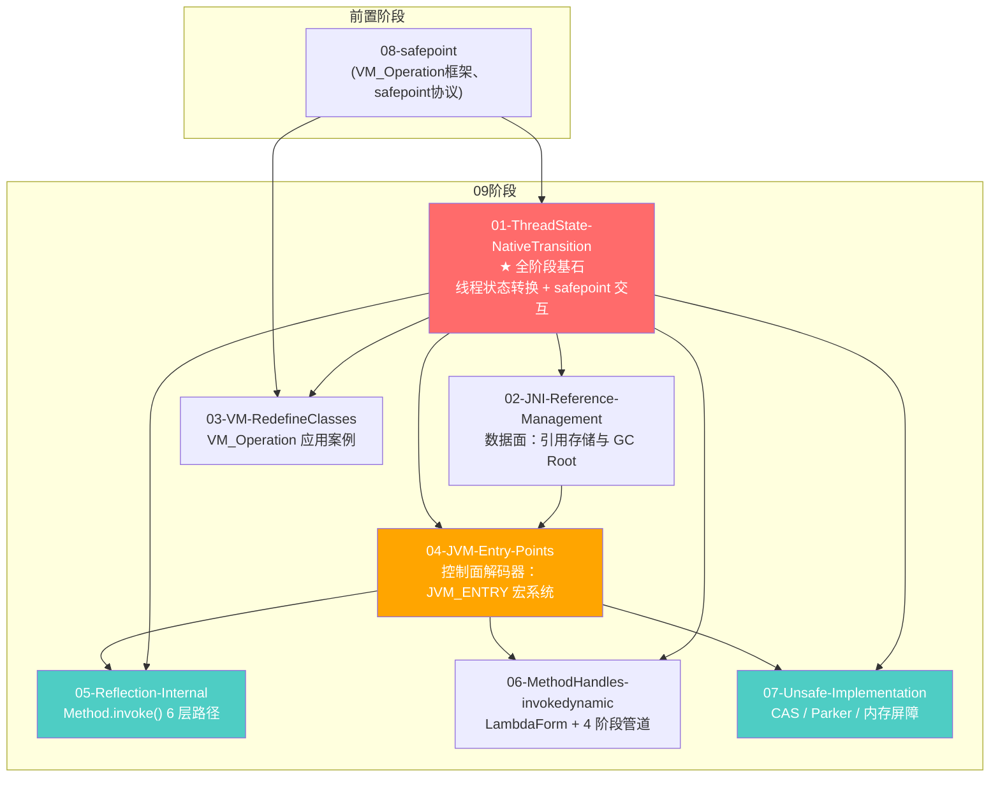

# 01-ThreadState-NativeTransition — JNI 线程状态转换与 safepoint 交互

> **标准环境**：OpenJDK 11 slowdebug build，`-Xms8g -Xmx8g -XX:+UseG1GC`，64-bit Linux x86（G1 Region=4MB）
> **前置文档**：[08-01-Safepoint-Protocol]、[08-02-Polling-Mechanism]、[08-04-GCLocker]、[08-05-Safepoint-Full-Path]、[07-Thread-Architecture]
> **阅读收益**：理解 JavaThread 从 `_thread_in_Java` 出发，穿越 JNI 边界的每一次状态转换——5 个唯一状态、8 条转换弧、与 safepoint 协议在每一步的互动。掌握 `_thread_in_native_trans` 的窗口语义、`transition_from_native()` vs `transition_and_fence()` 的本质差异、以及 native 线程在 safepoint 中的双重身份
> **文档定位**：**09 阶段桥梁文档**，一头连着 [08] 学过的 safepoint 协议，一头连着 09 展开的 JNI 子系统。阅读顺序第一

---

## §〇 源文件清单（跨 prims + runtime + cpu/x86，标注模块归属）

| # | 文件 | 完整路径 | 模块 | 核心函数（已验证行号） | 本文角色 |
|---|------|---------|------|---------------------|---------|
| 1 | `interfaceSupport.inline.hpp` | `src/hotspot/share/runtime/interfaceSupport.inline.hpp` | runtime | `transition_from_native()`(:158-177), `transition_and_fence()`(:136-148), `ThreadInVMfromNative`(:266-274), `ThreadToNativeFromVM`(:277-294), `transition()`(:114-128), `transition_from_java()`(:153-156) | ★★★ 核心逐行走读 + 全部 RAII 类 |
| 2 | `safepointMechanism.inline.hpp` | `src/hotspot/share/runtime/safepointMechanism.inline.hpp` | runtime | `poll()`(:50-56), `block_if_requested()`(:58-63), `global_poll()`(:37-39), `local_poll()`(:41-48) | ★★ poll/block 入口节点 |
| 3 | `safepointMechanism.cpp` | `src/hotspot/share/runtime/safepointMechanism.cpp` | runtime | `block_if_requested_slow()`(:94-102) | ★★ 慢路径全局判断 |
| 4 | `safepoint.cpp` | `src/hotspot/share/runtime/safepoint.cpp` | runtime | `block()`(:859-990), `examine_state_of_thread()`(:1090-1145), `safepoint_safe()`(:803-817), `check_for_lazy_critical_native()`(:824-852) | ★★ block 内部 + VMThread SPIN 视角 |
| 5 | `safepoint.hpp` | `src/hotspot/share/runtime/safepoint.hpp` | runtime | `do_call_back()`(:170-172), `signal_thread_at_safepoint()`(:180), `increment_jni_active_count()`(:164-167), `SynchronizeState`(:61-66) | ★ 回调判断 + 计数器宏 |
| 6 | `thread.cpp` | `src/hotspot/share/runtime/thread.cpp` | runtime | `check_safepoint_and_suspend_for_native_trans()`(:2614-2671), `check_special_condition_for_native_trans()`(:2680) | ★★ transition_from_native 之后的处理 |
| 7 | `thread.hpp` | `src/hotspot/share/runtime/thread.hpp` | runtime | `thread_state()`(:1238), `set_thread_state()`(:1239), `is_suspend_after_native()`(:1369-1371), `in_critical()`(:1802) | ★ 线程状态读写 + JNI critical 标记 |
| 8 | `globalDefinitions.hpp` | `src/hotspot/share/utilities/globalDefinitions.hpp` | utilities | `JavaThreadState` enum(:890-902) | ★ 状态枚举——偶数=稳态/奇数=过渡态 |
| 9 | `jni.cpp` | `src/hotspot/share/prims/jni.cpp` | prims | `jni_invoke_static`(:1114), `jni_invoke_nonstatic`(:1149), `JNI_ENTRY`/`JNI_END` 宏 | ★★ JNI native 调用入口和出口 |
| 10 | `templateInterpreterGenerator_x86.cpp` | `src/hotspot/cpu/x86/templateInterpreterGenerator_x86.cpp` | interpreter | `generate_native_entry()`(:784) — 汇编直写 `_thread_state` | ★★ 解释器 native 入口 |
| 11 | `sharedRuntime_x86_64.cpp` | `src/hotspot/cpu/x86/sharedRuntime_x86_64.cpp` | runtime | `generate_native_wrapper()`(:1855) — JIT native 桩生成 | ★ JIT native wrapper |
| 12 | `javaCalls.cpp` | `src/hotspot/share/runtime/javaCalls.cpp` | runtime | `JavaCallWrapper` RAII | ★ JNI 调用包装层 |

**跨模块说明**：本文跨越 `prims/`（JNI 入口）、`runtime/`（线程状态、safepoint、polling）、`cpu/x86/`（解释器桩代码）、`utilities/`（枚举定义），是 09 阶段跨模块的典型代表。

---

## §一 ★ 全景 — JavaThread 的 5 态 8 步循环

### ❓ 为什么需要 5 个唯一状态、8 步弧，而不是"Java/Native/VM"三个状态三个弧？

[08-01] §二 已经定义了 safepoint 的 3 态状态机（`_not_synchronized` → `_synchronizing` → `_synchronized`），但那是**全局**的同步状态——描述"整个 JVM 是否在 safepoint 中"。JavaThread 的 `_thread_state` 是一个**线程级**状态枚举，描述"这个线程此刻在哪个执行上下文中"。

如果把状态简化为三个（Java / Native / VM），会丢失什么？

1. **过渡态（transition states）必须存在**：线程从 one 稳态切换到另一个稳态不是原子的——需要先设中间态让 VMThread 的 SPIN 看到"我在穿越，别催"，做完 fence/serialize 后再切到目标状态。去掉 `_thread_in_native_trans`，VMThread 无法区分"正在穿越边界的线程"和"已经在 native 中的线程"——前者还在设置 Java 栈帧、GC 不能扫栈，后者栈是 walkable 的、GC 安全。

2. **Blocked 是独立状态**：`_thread_blocked` ≠ `_thread_in_vm`。Blocked 中的线程在 `Threads_lock` 上等待，栈已经 `make_walkable` 了。VMThread 在 `examine_state_of_thread()` 中对 blocked 和 native 一视同仁（都走 `safepoint_safe()`），但它们到达 safepoint 的方式完全不同——blocked 是线程主动调用 `block()`，native 是被 VMThread 被动 roll_forward。

3. **对称性**：`_thread_in_Java` 和 `_thread_in_native` 都是"在对应的上下文中执行代码"的稳态，但 Native→Java 返回路径上多了 `_thread_in_native_trans` → poll → block 的完整检测链——这是 Java→Native 进入路径上没有的。非对称的核心原因见 §二。

### 1.1 完整 Mermaid 状态图

```mermaid
stateDiagram-v2
    direction LR

    state "★ JavaThread 5 稳态 + 4 过渡态 = 9 态枚举" as Legend

    [*] --> _thread_in_Java : 初始（start_thread）

    _thread_in_Java --> _thread_in_vm : ① transition_from_java(to=_thread_in_vm)\ninterfaceSupport.inline.hpp:155\n仅 set_thread_state, 无 poll, 无中间态
    note right of _thread_in_vm : Java→VM 是唯一跳过过渡态的方向

    _thread_in_vm --> _thread_in_vm_trans : ② transition(_thread_in_vm, _thread_in_Java)\nThreadInVMfromJava::~()\ninterfaceSupport.inline.hpp:233
    _thread_in_vm_trans --> _thread_in_Java : ② block_if_requested + set_state

    _thread_in_vm --> _thread_in_vm_trans : ③ trans_and_fence(_thread_in_vm, _thread_in_native)\nThreadToNativeFromVM ctor\ninterfaceSupport.inline.hpp:284\n★ 中间态是 _vm_trans, 不是 _native_trans!
    _thread_in_vm_trans --> _thread_in_native : ③ block_if_requested + set_state

    _thread_in_native --> _thread_in_native_trans : ④ transition_from_native(to=_thread_in_vm)\ninterfaceSupport.inline.hpp:162 ★ 核心
    _thread_in_native_trans --> _thread_blocked : ④ if poll()=true →\ncheck_safepoint_and_suspend_for_native_trans\n→ block()
    _thread_in_native_trans --> _thread_in_vm : ④ if poll()=false →\nset_thread_state(to)
    note left of _thread_in_native_trans : ★ 窗口语义：VMThread SPIN 保持 _running

    _thread_blocked --> _thread_in_vm : ⑤ end() → Threads_lock->unlock\n→ set_thread_state(_thread_in_vm)

    _thread_in_vm --> _thread_in_vm_trans : ⑥ ThreadInVMfromNative::~()\ntrans_and_fence(_thread_in_vm, _thread_in_native)
    _thread_in_vm_trans --> _thread_in_native : ⑥ set_thread_state(_thread_in_native)
    note right of _thread_in_vm_trans : _vm_trans 是使用最多的过渡态\n(被步骤②③⑥⑧共用)

    _thread_in_native --> _thread_in_native_trans : ⑦ ThreadToNativeFromVM::~()\ntrans_from_native(_thread_in_vm)\n★ 返回路径的第二次 poll
    _thread_in_native_trans --> _thread_in_vm : ⑦ poll + set_state(to)

    _thread_in_vm --> _thread_in_vm_trans : ⑧ ThreadInVMfromJava::~()\ntrans(_thread_in_vm, _thread_in_Java)
    _thread_in_vm_trans --> _thread_in_Java : ⑧ block_if_requested + set_state
```

### 1.2 每个状态转换的精确标注

| 步 | 源状态 | 目标状态 | 中间态 | 触发函数 | 源文件:行号 | 是否 poll | 是否 block_if_requested | 说明 |
|----|--------|---------|--------|---------|-----------|----------|----------------------|------|
| ① | `_thread_in_Java`(8) | `_thread_in_vm`(6) | **无**（唯一跳过过渡态的路径） | `transition_from_java()` | `interfaceSupport.inline.hpp:153-156` | ❌ | ❌ | Java→VM 不需要 poll（进入 VM 是主动的）。`transition_from_java` 直接 `set_thread_state(to)` |
| ② | `_thread_in_vm`(6) | `_thread_in_Java`(8) | `_thread_in_vm_trans`(7) | `ThreadInVMfromJava::~()` 中 `trans()` | `interfaceSupport.inline.hpp:229-236` | ❌ | ✅ `block_if_requested`(:124) | 退出 VM 返回 Java 前确认 safepoint 不在等自己 |
| ③ | `_thread_in_vm`(6) | `_thread_in_native`(4) | `_thread_in_vm_trans`(7) ← **不是 native_trans！** | `ThreadToNativeFromVM` ctor 中 `trans_and_fence()` | `interfaceSupport.inline.hpp:278-285` | ❌ | ✅ `block_if_requested`(:144) | ★ `from+1` 规则：from=6=`_vm`→过渡态=7=`_vm_trans` |
| ④ | `_thread_in_native`(4) | `_thread_in_vm`(6) 或 `_thread_blocked`(10) | `_thread_in_native_trans`(5) | `transition_from_native()` | `interfaceSupport.inline.hpp:158-177` | ✅ `poll()`(:169) | ❌（poll 代替） | ★ 刚从 native 回来，主动探测 safepoint。唯一带 poll 的状态转换 |
| ⑤ | `_thread_blocked`(10) | `_thread_in_vm`(6) | 无 | `end()` → `Threads_lock->unlock` | `safepoint.cpp:928-931` | ❌ | ❌ | safepoint 已结束，被动唤醒，state 由 block() 内 L930 恢复 |
| ⑥ | `_thread_in_vm`(6) | `_thread_in_native`(4) | `_thread_in_vm_trans`(7) | `ThreadInVMfromNative::~()` 中 `trans_and_fence()` | `interfaceSupport.inline.hpp:271-273` | ❌ | ✅ `block_if_requested`(:144) | JNI upcall 返回 native（如 env→CallXxxMethod 结束后） |
| ⑦ | `_thread_in_native`(4) | `_thread_in_vm`(6) | `_thread_in_native_trans`(5) | `ThreadToNativeFromVM::~()` 中 `trans_from_native()` | `interfaceSupport.inline.hpp:289-293` | ✅ `poll()`(:169) | ❌ | native 方法返回后回到 VM。和④路径相同但调用者不同 |

> **说明**：上表枚举所有 distinct 过渡弧，而非某条特定调用路径的序列。`_thread_in_vm_trans`(7) 是使用最频繁的过渡态（被②③⑥共用），`_thread_in_native_trans`(5) 只在 native→VM 返回方向使用（④⑦）。进入 native 经过的是 `_vm_trans`(7)，不是 `_native_trans`(5)——这是 `from+1` 规则的直接推论，也是本文区别于常见误解的核心。

### 1.3 JavaThreadState 枚举定义 (globalDefinitions.hpp:890-902)

```cpp
// globalDefinitions.hpp:890-902 — 注意值之间有故意留的空洞！
// 注释 887 行明确说："the xxxx_trans state can always be found by adding 1"
// 所以每个稳态必须是偶数，过渡态 = 稳态 + 1（奇数）。
enum JavaThreadState {
  _thread_uninitialized     =  0,  // 未初始化（不参与 safepoint）
  _thread_new               =  2,  // 新建（JavaThread 构造中）← 跳过了 1！
  _thread_new_trans         =  3,  // 新建过渡态（2 + 1）
  _thread_in_native         =  4,  // ★ 在 native 代码中（稳态，偶数）
  _thread_in_native_trans   =  5,  // ★ 穿越 native 边界（过渡态，4 + 1）
  _thread_in_vm             =  6,  // ★ 在 VM 内部（稳态，偶数）
  _thread_in_vm_trans       =  7,  // 穿越 VM 边界（过渡态，6 + 1）
  _thread_in_Java           =  8,  // ★ 在 Java 编译代码或解释器中（稳态，偶数）
  _thread_in_Java_trans     =  9,  // 穿越 Java 边界（过渡态，8 + 1）
  _thread_blocked           = 10,  // ★ 在 safepoint 中阻塞（稳态，偶数）
  _thread_blocked_trans     = 11,  // 进入/离开 blocked 的过渡态（10 + 1）
  _thread_max_state         = 12   // 哨兵
};
```

**设计规律（⭐ 面试常见陷阱）**：
- **偶数 = 稳态**（CPU 可以长时间停在这个状态上）：`_thread_in_native`=4, `_thread_in_vm`=6, `_thread_in_Java`=8, `_thread_blocked`=10
- **奇数 = 过渡态**（CPU 不该停留超过几条指令）：每个稳态+1 得到其过渡态
- **为什么留空洞**（跳过值 1）？源码注释 "the xxxx_trans state can always be found by adding 1"——为了保证 `from+1` 始终是 from 的过渡态，设计者让所有稳态占据偶数位（2,4,6,8,10），过渡态占奇数位（3,5,7,9,11）。如果 `_thread_new=1`（奇数），`1+1=2` 看起来像过渡态但语义上 2 是 `_thread_new` 本身——矛盾。所以让 `_thread_new=2`（偶数），`2+1=3=_thread_new_trans`（奇数）——完美。
- **凡 `_thread_in_X_trans`** 都是穿越边界的窗口——VMThread SPIN 看到这个状态会保持 `_running` 等待
- **凡 `_thread_in_X`（稳态偶数）** 都有明确的 safepoint 协议语义——决定了 VMThread 是 roll_forward 还是 _call_back 还是继续等

**`transition()` 函数的 assert 验证** (`interfaceSupport.inline.hpp:117`)：
```cpp
assert((from & 1) == 0 && (to & 1) == 0, "odd numbers are transitions states");
```
`(from & 1) == 0` → from 必须是偶数。`_thread_in_vm`=6，`6 & 1 = 0` ✓。如果 from 是奇数 → assert 失败，错误消息告诉你"odd numbers are transitions states"。函数内部设 `from + 1`（奇数过渡态），执行 fence+block_if_requested，最后设 `to`（偶数目标稳态）。

### 1.4 和 VMThread 视角的对比

同一时刻，VMThread 在 SPIN 循环中 (`safepoint.cpp:300-414`)，通过 `examine_state_of_thread()` (`safepoint.cpp:1090-1145`) 逐一检查每个 JavaThread 的状态。线程的状态决定了 VMThread 的反应：

| JavaThread 的 `_thread_state` | VMThread 在 `examine_state_of_thread()` 的行为 | 后续 |
|-----------------------------|----------------------------------------------|------|
| `_thread_in_native` (4) 且 walkable | `roll_forward(_at_safepoint)` → `_waiting_to_block--` → `still_running--` | VMThread 认为此线程"已到达"，不等它返回。但线程返回时会被 poll 截停（详见 §二） |
| `_thread_in_native` (4) 且栈不可 walkable | 保持 `_running` | VMThread 继续 SPIN，等线程设 walkable 栈 |
| `_thread_in_vm` (6) | `roll_forward(_call_back)` → `still_running--` | BLOCK 阶段等待线程的 `block()` → `_waiting_to_block--` |
| `_thread_in_native_trans` (5) | 保持 `_running`（默认分支） | VMThread 继续等。窗口必须极短 |
| `_thread_blocked` (10) | `safepoint_safe()` → `roll_forward(_at_safepoint)` | 线程已经在 safepoint 中 |
| `_thread_in_Java` (8) | 保持 `_running` | 等线程 poll → do_call_back → block() → `_waiting_to_block--` |

**这条表是本文和 [08-01] 的桥梁**：每一行都解释了 VMThread 怎么"看待"不同状态的线程——详见 [08-01] §三 步骤⑤⑥。

---

## §二 ★★★ `transition_from_native()` — 逐行走读

### ❓ poll 返回 true 之后、block 之前，线程还干了什么？

`transition_from_native()` 是本文最核心的函数——它是 native 返回路径上 JavaThread 与 safepoint 协议的唯一交汇点。本节逐行走读 `interfaceSupport.inline.hpp:158-177`，解释每一步的设计动机，而非翻译代码。

### 2.1 源码逐行（interfaceSupport.inline.hpp:158-177）

```cpp
// interfaceSupport.inline.hpp:158-177 — ThreadStateTransition::transition_from_native()
158:  static inline void transition_from_native(JavaThread *thread, JavaThreadState to) {
159:    assert((to & 1) == 0, "odd numbers are transitions states");
160:    assert(thread->thread_state() == _thread_in_native, "coming from wrong thread state");
161:    // Change to transition state
162:    thread->set_thread_state(_thread_in_native_trans);
163:
164:    InterfaceSupport::serialize_thread_state_with_handler(thread);
165:
166:    // We never install asynchronous exceptions when coming (back) in
167:    // to the runtime from native code because the runtime is not set
168:    // up to handle exceptions floating around at arbitrary points.
169:    if (SafepointMechanism::poll(thread) || thread->is_suspend_after_native()) {
170:      JavaThread::check_safepoint_and_suspend_for_native_trans(thread);
171:
172:      // Clear unhandled oops anywhere where we could block, even if we don't.
173:      CHECK_UNHANDLED_OOPS_ONLY(thread->clear_unhandled_oops();)
174:    }
175:
176:    thread->set_thread_state(to);
177:  }
```

**逐行分析**：

**L159-160 — 前置断言**：
- `(to & 1) == 0`：目标状态必须是偶数——即稳态（源码中 `_thread_in_vm`=6 或 `_thread_in_Java`=8），不能是过渡态（奇数）。这是对偶数=稳态规律的直接利用。
- `thread_state() == _thread_in_native`：调用者必须确实在 native 中——核心契约，违反意味着调用方状态管理 bug

**L162 — 设中间态 `_thread_in_native_trans`**：
这是本文 §一 的一个关键概念——“穿越边界窗口”。为什么必须设中间态？
1. **VMThread 的 SPIN 立即感知**：如果线程直接设 `_thread_in_vm`（而不经过 native_trans），VMThread 在 `examine_state_of_thread()` 中看到 `_thread_in_vm` → `roll_forward(_call_back)` → 等线程在下次 `block_if_requested` 时进入 `/block()`。但问题是：线程此时还没有设好 Java 栈帧！`_thread_in_vm` 意味着"我在 VM 内部，Java 栈可遍历"——但栈帧设置未完，GC 扫栈会出错。
2. **`_thread_in_native_trans` 告诉 VMThread："别急，我在穿边界"**：VMThread 保持 `_running` 等待，不 roll_forward、不 _call_back——详见 [08-01] §三 步骤⑤。

**L164 — `serialize_thread_state_with_handler(thread)`**：
代码展开为 `serialize_thread_state_internal(thread, true)` → `interfaceSupport.inline.hpp:82-97`：
- 如果 `os::is_MP()` && `UseMembar`：显式 `OrderAccess::fence()`（StoreLoad 屏障）
- 否则：`os::write_memory_serialize_page_with_handler(thread)` → 写特殊内存页触发 store buffer flush

为什么此时需要 fence/serialize？L162 的 `set_thread_state(_thread_in_native_trans)` 是普通 store，在 x86 TSO 模型下对其他 CPU 的可见时间不确定。如果不加 fence，VMThread 在 SPIN 中读 `thread_state()` 可能看到旧值 `_thread_in_native`（意为"线程还在 native 中"），然后 `roll_forward(_at_safepoint)` 放行——但实际上线程正执行 L169 的 `poll()`，可能已经检测到 safepoint 准备 block。状态不一致导致 VMThread 认为线程已到达、线程自己却挂起等 safepoint 结束——死锁。

**L169 — `SafepointMechanism::poll(thread) || is_suspend_after_native()`**：
这是本文区别于 `transition_and_fence()` 的核心差异。

**❓ 为什么 poll() 有两层分发（ThreadLocal vs Global）？**

`safepointMechanism.inline.hpp:50-56` 的 `poll()` 不是"一个简单的检查"——它根据 `uses_thread_local_poll()` 走两条完全不同的路径：
- **Global 模式**：`global_poll()` → `do_call_back()` → 读全局 `_state` 字。所有线程共享同一个状态字，一致性由硬件 cache coherence 保证。x86 上 ~30-50 cycles。
- **ThreadLocal 模式**：`local_poll(thread)` → `local_poll_armed()` → 读线程自己的 `_polling_page` 字段。避免 Global 模式下所有线程撞同一个 cache line 的 contention。在 100+ 线程时优势明显。

**无论哪种模式**，`poll()` 在 `transition_from_native()` 中做的是同一件事：主动探测"JVM 全局现在是否在请求 safepoint"，线程刚从 native 回来，对 VM 状态一无所知。

如果 `poll()=true`，线程跳进 `check_safepoint_and_suspend_for_native_trans()`（`thread.cpp:2614`）——这个函数做了三件有严格顺序的事：

1. **先处理 external suspend**（如果有）：临时设 `_thread_blocked(10)` → `java_suspend_self()` 等 `SR_lock` → 恢复 `_thread_in_native_trans(5)`。临时改状态是因为 `_thread_in_native_trans` 不被 safepoint 视为已到达，external suspend 需要 blocked 状态来通知 JVMTI agent。

2. **再 `block_if_requested`**：此时再检查 poll flag——因为 external suspend 自挂起期间可能过了 safepoint，poll flag 条件可能已经变了。这是二次确认，不是重复检查。

3. **最后 deopt suspend**：特殊情况——线程从 native 返回时被要求 deoptimize。

**❓ `local_poll_armed` 和 `global_poll` 在 `block_if_requested` 内部的"双重检查"是冗余吗？**

不是。`block_if_requested`（`safepointMechanism.inline.hpp:58-63`）和 `block_if_requested_slow`（`safepointMechanism.cpp:94-102`）的两层检查有不同的作用域：
- **快速层**（inline）：`local_poll_armed()` 读 thread-local flag——如果没设，零开销返回（~5 cycles）。
- **慢速层**（cpp）：`global_poll()` 确认"JVM 全局是否确实在同步"——因为 thread-local flag 可能被 handshake（非 safepoint）设置。如果确认 safepoint → `SafepointSynchronize::block(thread)`。

这种两层设计避免了每次都进 `.cpp` 文件的函数调用开销（call+ret 约 20 cycles）。99% 的 native 返回路径上 `local_poll_armed()=false`——inline 读取直接返回，连函数调用都不需要。

**L176 — `thread->set_thread_state(to)`**：
无论是否命中 poll，最终都设目标状态（通常是 `_thread_in_vm`）。如果在 `poll()=false` 的快速路径，整个过程是：
```
set(_native_trans) → serialize → poll(=false) → set(_thread_in_vm)  ← 约 80-120 CPU cycles
```
如果在 `poll()=true` 的慢路径，线程在 `block()` 中等 safepoint 完成（微秒到毫秒级），醒来后继续执行到 L176。

### 2.2 三段式结构

```
transition_from_native() 内部三段：

  阶段A: 窗口建立  (L162 + L164)
    set(_native_trans) ──→ serialize/fence
    ↓
    线程处于 "穿越边界窗口" — VMThread SPIN 保持 _running

  阶段B: ★ 安全点检查  (L169-174) — 决定分支
    poll() == false ──→ 快速路径：直接进入 阶段C
    poll() == true  ──→ check_safepoint_and_suspend_for_native_trans
                           ├── java_suspend_self() (if external suspend)
                           └── block_if_requested → block() → _thread_blocked
                               ↓ end() 唤醒后
                           └── clear_unhandled_oops (DEBUG)

  阶段C: 目标到达  (L176)
    set_thread_state(to)  ← 正式进入 _thread_in_vm（或 _thread_in_Java）
```

### 2.3 ★ 和 [08-02] 的衔接

本文聚焦 `transition_from_native()` **内部**的逻辑（poll 命中之后），不重述 poll 机制本身。poll 的端到端链路——`mprotect` → `SIGSEGV` → `handle_polling_page_exception` → `block()`——详见 [08-02] §二。

`block()` 内部的逻辑——`_thread_in_vm_trans` 分支、`_waiting_to_block--` 递减、`Threads_lock` 阻塞——详见 [08-01] §五。

### 2.4 ❓ 为什么 poll 和 block_if_requested 在 native 返回路径上同时存在但角色不同？

| 维度 | `poll()` （L169） | `block_if_requested()` (在 check_safepoint_and_suspend_for_native_trans 中) |
|------|-------------------|---------------------------------------------------------------------------|
| **角色** | 主动探测：现在有没有 safepoint 在进行？ | 被动检查：VMThread 有没有在我的 poll flag 上设了标记？ |
| **时机** | 线程刚从 native 回来，对 VM 状态一无所知 | 在 poll 确认后、block 之前，确认"该阻塞" |
| **检查内容** | `do_call_back()` 读 `_state` | ThreadLocal 模式：`local_poll_armed()`；Global 模式：`global_poll()` |
| **决定做什么** | 判断是否进入慢路径 | 判断是否进入 `block()` |
| **和 `transition_and_fence()` 的关系** | ★ 只有本函数有 poll | `transition_and_fence()` 只有 `block_if_requested`（无 poll） |

**为什么 native 返回需要 poll 而 VM 内部不需要？**

VM 内部的 `transition_and_fence()`（如 `ThreadInVMfromJava::~ThreadInVMfromJava()`）调用者**已经知道** safepoint 有可能在进行——因为：
- 线程在 `_thread_in_vm` 中执行了 VM 代码
- VMThread arm polling page 时，如果此线程在 VM 中 → `examine_state_of_thread()` 标记 `_call_back`
- 线程退出 VM 时，`block_if_requested` 检查自己的 poll flag 是否被标记 → 是 → `block()`

JNI 返回路径上的线程不同——它可能在 native 中待了任意长时间（调用第三方 C 库、阻塞 IO、sleep），完全不知道 VMThread 在此期间 arm 了 polling page。它需要**先主动探测**一次——"JVM 是不是在同步？"——然后才决定是否走 block 慢路径。

---

## §三 ★★ transition_and_fence vs transition_from_native（衔接 [08-02] §四）

### ❓ 为什么同一个"穿越边界"需要两个函数？

[08-02] §四 已经详细分析了 `transition_and_fence()` 的 StoreLoad 屏障语义——为什么 `serialize_thread_state_with_handler()` 的显式 fence 或 `write_memory_serialize_page` 对于弱一致性模型下 VMThread 的可见性至关重要。但 [08-02] 没解释的是：**两个函数的使用场景完全不同，不是简单的"一个带 fence 一个不带"的变体**。

### 3.1 场景对比

| 维度 | `transition_and_fence()` | `transition_from_native()` |
|------|-------------------------|---------------------------|
| **调用场景** | VM 内部的状态转换：进入 VM / 退出 VM / 阻塞 | JNI 返回路径专用 |
| **调用者** | `ThreadInVMfromJava::~`、`ThreadInVMfromNative::~`、`ThreadToNativeFromVM::ThreadToNativeFromVM`、`ThreadBlockInVM` ctor/dtor | `ThreadInVMfromNative::ThreadInVMfromNative`、`ThreadToNativeFromVM::~`、`ThreadInVMfromUnknown::ThreadInVMfromUnknown` |
| **通用程度** | 通用——任何两个稳态之间的转换 | 专用——只能从 `_thread_in_native` 出发 |
| **中间态** | `from + 1`（如 `_thread_in_vm`(6)→过渡态 `_thread_in_vm_trans`(7)） | 固定 `_thread_in_native_trans`(5) = `_thread_in_native`(4) + 1 |
| **safepoint check** | 只有 `block_if_requested`（已知 safepoint 可能在进行） | 先 `poll()` 主动探测 + 后 `block_if_requested` 被动确认 |
| **fence 方式** | `serialize_thread_state_with_handler`（显式 fence 或 write serialize page） | 同上 |
| **是否有 `poll`** | ❌ 无——调用者已知 VM 状态 | ✅ 有——线程从 native 回来，需主动探测 |
| **assert 检查** | `from != _thread_in_Java && from != _thread_in_native` | `from == _thread_in_native`（硬编码） |

### 3.2 fence 语义对比

两个函数都有 fence——`transition_from_native()` 的 L164 和 `transition_and_fence()` 的 L142 调用完全相同的 `InterfaceSupport::serialize_thread_state_with_handler(thread)`。fence 的展开逻辑（`serialize_thread_state_internal`）详见 [08-02] §四。

两者的 fence 都在 `set_thread_state(过渡态)` 之后、poll/block_if_requested 之前——保证 VMThread 在 SPIN 中读到的是过渡态而非旧值。时序完全一致。

### 3.3 poll 时机对比——核心差异

这是两个函数的本质区别：

```
transition_and_fence 的数据流：
  线程:  set(trans) → serialize/fence → block_if_requested → set(to)
  VMThread:  (在 begin() 的 SPIN 中 arm_local_poll → 写线程的 poll flag)
  关键：VMThread 的写入在线程的 block_if_requested 调用之前（时序保证）
  → block_if_requested 看到 flag → block()

transition_from_native 的数据流：
  线程:  set(native_trans) → serialize/fence → poll() → check_and_block → set(to)
  VMThread:  (线程在 native 中时，arm_local_poll 对线程的 flag 无效)
  关键：线程不知道 VMThread arm 了 flag → 必须先 poll 主动探测
  → poll() 返回 true → 再 block_if_requested 确认 → block()
```

**时序差异的根本原因**：`transition_and_fence()` 的调用者在 VM 内部——VMThread 的 `arm_local_poll` 和线程的 `transition_and_fence` 有 happens-before 关系。`transition_from_native()` 的调用者刚从 native 返回——没有 happens-before——所以必须先 poll。

---

## §四 ★ JNI 调用生命周期（衔接 [08-04]）

### 4.1 ❓ JNI 有两条方向相反的路径，状态循环完全不同

JNI 涉及两种方向相反的调用，它们的 RAII 包装——因而状态转换——完全不同：

| 方向 | 通俗描述 | 例子 | 线程起始状态 | 入口 RAII |
|------|---------|------|-------------|----------|
| **下行（downcall）** | Java 调用 native 方法 | `System.arraycopy()` 被 Java 代码调用 | `_thread_in_Java`(8) | 解释器：汇编直写 / JIT：`ThreadInVMfromJava` + `ThreadToNativeFromVM` |
| **上行（upcall）** | native 代码调用 JNI 函数 | `env->CallStaticVoidMethod()` 被 C 代码调用 | `_thread_in_native`(4) | `ThreadInVMfromNative`（JNI_ENTRY 宏） |

**这两种路径的名称容易混淆**——"native 方法调用"既可指 Java→Native（下行），也可指 Native→Java（上行）。本节明确区分两者。

#### 下行路径：Java 调用 native 方法（如 `System.arraycopy()`）

```
① _thread_in_Java(8) — 执行 Java 编译代码/解释器

② [JIT wrapper]:
     ThreadInVMfromJava ctor → transition_from_java(_thread_in_vm)
     → set_thread_state(_thread_in_vm)   ← 无过渡态，直接设！
     → JavaCalls::call_helper 内部: JavaCallWrapper ctor
     → ThreadToNativeFromVM ctor → trans_and_fence(_vm, _native)
     → _thread_in_vm(6) → _thread_in_vm_trans(7) → _thread_in_native(4)
   [解释器 wrapper]:
     generate_native_entry() → 汇编直写:
     movl [thread+offset], _thread_in_native   ← 不经任何 RAII 对象

③ _thread_in_native(4): 执行真正的 C/C++ native 函数
     VMThread SPIN 中: roll_forward(_at_safepoint) → 放行！（详见 [08-01] §三）

④ native 函数返回:
   [JIT]: 桩代码 epilogue → 或 ThreadToNativeFromVM dtor
   [解释器]: 汇编序列
   → trans_from_native(_thread_in_vm) → transition_from_native()
   → _thread_in_native_trans(5) → poll() → _thread_in_vm(6)
   → ThreadInVMfromJava dtor → trans(_vm, _Java)
   → _thread_in_vm_trans(7) → _thread_in_Java(8)
```

#### 上行路径：native 代码调用 JNI 函数（如 `env->CallStaticVoidMethod()`）

```
① _thread_in_native(4) — 在 native 代码中

② JNI_ENTRY 宏展开 → ThreadInVMfromNative __tiv(thread)
   → ctor → trans_from_native(_thread_in_vm)
   → transition_from_native(thread, _thread_in_vm) ★ §二 走读
   → _thread_in_native(4) → _thread_in_native_trans(5) → _thread_in_vm(6)

③ jni_invoke_static / jni_invoke_nonstatic 执行参数处理
   → JavaCalls::call() → call_helper →
   JavaCallWrapper ctor → transition(_vm, _Java)
   → _thread_in_vm_trans(7) → _thread_in_Java(8)
   执行 Java 方法（可能很长，在 _thread_in_Java 中）

④ Java 方法返回 → JavaCallWrapper dtor
   → transition(_Java, _vm) → _thread_in_Java_trans(9) → _thread_in_vm(6)

⑤ JNI_END → ThreadInVMfromNative::~ThreadInVMfromNative()
   → trans_and_fence(_thread_in_vm, _thread_in_native)
   → _thread_in_vm_trans(7) → _thread_in_native(4)
   线程回到 native 代码
```

**两种路径的关键结构差异**：

| 维度 | 下行（Java→Native） | 上行（Native→JNI→Java→Native） |
|------|---------------------|---------------------------|
| Java↔VM | `transition_from_java` 进入 VM（无中间态）；`transition()` 退出 VM（经 _vm_trans） | 经过 `JavaCallWrapper` 的 `transition()` 进出（两方向都经过渡态） |
| VM↔Native | `ThreadToNativeFromVM` ctor（经 _vm_trans）进入；dtor（经 _native_trans + poll）退出 | `ThreadInVMfromNative` ctor（经 _native_trans + poll）进入；dtor（经 _vm_trans）退出 |
| 经历了 poll 几次 | 1 次（native→VM 返回时） | 1 次（进入 VM 时）。但如果 Java 方法内部调了另一个 native 方法，还有额外的 poll |
| 返回时 check | `ThreadToNativeFromVM::~` 中的 `trans_from_native` | `ThreadInVMfromNative::~` 中的 `trans_and_fence`（只有 block_if_requested，无 poll——因为线程刚从 Java 回来，状态已知） |

### 4.2 ★ 关键宏展开：JNI_ENTRY / JNI_END

`jni.cpp` 中的 `jni_invoke_static` (L1114) 函数**体不包含** `transition_from_native()` 调用——它在**宏**里。这是许多 JVM 学习者搜索不到的地方：

```cpp
// jni.cpp 中的 JNI 函数定义模式：
JNI_ENTRY(return_type, jni_FunctionName(JNIEnv* env, ...))
  // ... 函数体 ...
JNI_END
```

JNI_ENTRY 宏的定义（`jni.cpp` 头部）大致展开为：
```cpp
extern "C" {
  return_type JNICALL jni_FunctionName(JNIEnv* env, ...) {
    JavaThread* thread = JavaThread::thread_from_jni_environment(env);
    ThreadInVMfromNative __tiv(thread);  // ← ★ RAII 对象：构造 → trans_from_native
    // ... 函数体 ...
    // ~__tiv() 析构 → trans_and_fence(_thread_in_vm, _thread_in_native)
  }
}
```

所以搜索 `jni.cpp` 中的 `transition_from_native` 找不到——它在 `<interfaceSupport.inline.hpp:525>` 的宏展开里，不在 `jni.cpp` 的函数体中。

### 4.3 两条 native 进入路径

JVM 调用 native 方法有两条路径，它们的 `_thread_in_native` 设置方式不同：

| 路径 | 入口函数 | 设置 `_thread_in_native` 的方式 | 返回时 poll 方式 |
|------|---------|-----------------------------|---------------|
| **解释器路径** | `generate_native_entry()` (`templateInterpreterGenerator_x86.cpp:784`) | 汇编直写：`movl [thread+thread_state_offset], _thread_in_native` (:1039-1040) — 不经任何 RAII 对象 | `safepoint_poll` 汇编序列 (:1119-1122) + `check_special_condition_for_native_trans` |
| **JIT 路径** | `generate_native_wrapper()` (`sharedRuntime_x86_64.cpp:1855`) | 通过 `ThreadToNativeFromVM` RAII ctor → `trans_and_fence(_thread_in_vm, _thread_in_native)` | 桩代码末尾的 `transition_from_native` 调用 |

**解释器路径的特殊性** (`templateInterpreterGenerator_x86.cpp:1036-1040`)：
```cpp
// templateInterpreterGenerator_x86.cpp:1037-1040 — 汇编直写
// Change state to native
__ movl(Address(thread, JavaThread::thread_state_offset()),
        _thread_in_native);
```

这是唯一的**不经 RAII 对象**直接写 `_thread_state` 的路径。解释器在验证 `_thread_in_Java` 后，用一条 `movl` 汇编指令直接写——速度最快，但跳过了 `transition_and_fence()` 的 `block_if_requested` 检查。为什么解释器可以这样做？

因为在 `generate_native_entry()` 的这个点上，解释器已经：
1. 调用了 signature handler（可能在 call_VM 中处理了 safepoint）
2. 在 `set_last_Java_frame` 中保存了 Java 调用帧
3. 即将调用真正的 native 函数

此时如果 safepoint 正在进行——线程在 `_thread_in_Java` 中时已经通过 `notify_method_entry()` 处理了；在 signature handler 的 `call_VM` 中也已经通过 `ThreadInVMfromJava::~ThreadInVMfromJava()` 的 `block_if_requested` 检查过了。所以再检查一次是冗余的。

**返回路径**上，解释器和 JIT 都走 `transition_from_native` → `poll` → `block`。解释器用汇编版本的 `safepoint_poll` (line 1119-1122)，JIT 用函数调用版本。两者的语义完全等价：都是读 polling page 或 poll flag，命中则 block。

### 4.4 ★ 和 GCLocker 的互动：native 线程的双重身份

[08-04] §三 已经完整分析了 `jni_lock/jni_unlock` 协议——JNI Critical Section 期间 `_jni_lock_count++`，GC 检查 `is_active()` → `_jni_lock_count > 0` → 设 `_needs_gc`。

本节从**线程视角**回答一个 [08-04] 没有正面回答的问题：**一个处于 `_thread_in_native`（被 roll_forward 放行）且同时 `in_critical()` 的线程，到底算"已到达 safepoint"还是"正在阻止 GC"？**

**答案是两者皆是**——但这两种身份针对不同的检查：

| 身份 | 检查方 | 检查内容 | 结果 |
|------|-------|---------|------|
| "safepoint 已到达" | VMThread 的 `examine_state_of_thread()` | `_thread_in_native` + walkable → `safepoint_safe()=true` | `roll_forward(_at_safepoint)` → `signal_thread_at_safepoint()` → `_waiting_to_block--` |
| "GC 被阻止" | VMThread 的 `check_for_lazy_critical_native()` (`safepoint.cpp:824-852`) | `_thread_in_native` + has_last_Java_frame + walkable + `is_lazy_critical_native()` | `enter_critical()` → `GCLocker::increment_debug_jni_lock_count()` |
| **同时满足** | `begin()` 的 BLOCK 阶段 (L484) | `set_jni_lock_count(_current_jni_active_count)` → 写入 `_jni_lock_count` | GCLocker 状态：`active=true`, `_needs_gc` 由后续 `check_active_before_gc()` 决定 |

**具体的程序流程**（以 `GetPrimitiveArrayCritical` 为例，详见 [08-04] §七）：

```
线程 A (JavaThread):
  1. jni_GetPrimitiveArrayCritical → jni_lock() → _jni_lock_count++
  2. 返回堆内裸指针
  3. 线程在 _thread_in_native 中，使用裸指针访问数组元素
  
  此时 safepoint 发生 [VMThread]:
  4. begin() → LOOP: 检查线程A状态
     → _thread_in_native → safepoint_safe()=true
     → roll_forward(_at_safepoint) ← ★ 放行！（safepoint 视角：线程已到达）
     → check_for_lazy_critical_native → enter_critical → _jni_active_critical++
     → increment_jni_active_count() → _current_jni_active_count++ ← ★ GC 被阻止！
     
     这是双重身份的精髓：
       - _waiting_to_block--（safepoint 认为线程"到达了"）
       - _current_jni_active_count++（GCLocker 认为线程"阻止了 GC"）
     
  5. begin() L484: set_jni_lock_count(_current_jni_active_count)
     → GCLocker::_jni_lock_count = _current_jni_active_count
     → 后续 check_active_before_gc() → is_active()=true → _needs_gc=true

线程 A (继续):
  6. (在 _thread_in_native 中继续执行)
  7. ReleasePrimitiveArrayCritical → jni_unlock() → _jni_lock_count--
     → if _jni_lock_count==0 && _needs_gc → heap->collect() → VM_GenCollectForAllocation
     → 注意：此 heap->collect 可能和正在执行的 safepoint 不冲突
       （如果 safepoint 已完成 do_cleanup_tasks 在 end() 内）
```

---

## §五 ★ 和 [08-safepoint] 的交叉验证

### 5.1 VMThread SPIN 中看到 `_thread_in_native_trans` 的行为验证

`examine_state_of_thread()` (`safepoint.cpp:1090-1145`) 的简化决策树：

```
for each JavaThread:
  if is_ext_suspended → roll_forward(_at_safepoint) → _waiting_to_block--
  else switch (thread_state):
    case _thread_in_native:
      if safepoint_safe → roll_forward(_at_safepoint) → _waiting_to_block--
    case _thread_blocked:
      if safepoint_safe → roll_forward(_at_safepoint)
    case _thread_in_vm:
      → roll_forward(_call_back) → still_running-- ★ SPIN释放
    default:
      → 保持 _running ★ 包括 _thread_in_native_trans!
           VMThread 不 roll_forward、不 _call_back、就是等
```

**关键**：`_thread_in_native_trans` 走到 default 分支——VMThread 保持 `_running`，继续 SPIN。这就是 `_thread_in_native_trans` 窗口语义的根因：VMThread 等待窗口关闭（线程做完 poll + set_state 到达稳态）再重新评估。

### 5.2 roll_forward(_at_safepoint) 的副作用

`roll_forward(_at_safepoint)` 的定义在 `safepoint.cpp` 的 `ThreadSafepointState` 中。副作用：

1. `set_type(_at_safepoint)` — 标记此线程"已在 safepoint"
2. 调用 `SafepointSynchronize::signal_thread_at_safepoint()` → `_waiting_to_block--` — 递减 VMThread 等待的 blocker 计数器
3. `is_running()=false` → `still_running--` — 递减 SPIN 循环的 running 计数器

对于 native 线程：上述 1-3 都发生，即 VMThread 完全认为此线程"已到达 safepoint"，不再等待。**但线程本体还在 native 代码中执行**——这是一个"名义到达、实际未停"的奇特状态。线程返回时被 poll 截停（§二），补上"实际停下"这一环。

对于 JNI critical 线程：在上述 1-3 之后，`check_for_lazy_critical_native()` (L824-852) 额外调用 `increment_jni_active_count()` → `_current_jni_active_count++`，为 GCLocker 的 `set_jni_lock_count` 做准备。

### 5.3 和 [08-04] GCLocker 连接的精确路径

[08-04] 从 GCLocker 侧分析了 `jni_lock/jni_unlock` 的计数器协议和两层门禁（§三/§四），但只回答了 "GCLocker 怎么拦住 GC"——没有回答 "被拦住的线程自己知道吗"。本文 §四.4 从**线程视角**补全了这个盲区：线程在 `_thread_in_native` 中同时被 `roll_forward(_at_safepoint)` 放行（safepoint 认为 "已到达"）又被 `increment_jni_active_count()` 标记为阻挡 GC——**线程完全不知情，两种判定同时成立**。具体结论：JNI critical 线程不存在 "我该 block 还是继续" 的选择——它永远继续执行，block 由返回路径的 `poll()` 补上。完整引用链：

```
[08-04] §三 jni_lock/jni_unlock 协议 ← GCLocker 计数器机制
[08-04] §七 GetPrimitiveArrayCritical → GCLocker ← 完整调用链
[08-05] §四 begin() L484 set_jni_lock_count ← VMThread 在 begin() 中的动作
[08-05] §七 两路径对比 ← GCLocker 在第一层 vs 第二层被检查
本文 §四.4 ← ★ 从线程视角揭示双重身份的并发语义
```

---

## §六 GDB 验证 + 可证伪断言

### 断言 1：`transition_from_native()` 的完整调用栈（两条路径）

```bash
# 断点
(gdb) break transition_from_native

# 路径A — JNI upcall（native 代码调用 env→CallXxx）：触发任意 JNI 函数
(gdb) bt
# 预期调用栈：
# #0  ThreadStateTransition::transition_from_native
#     at interfaceSupport.inline.hpp:158
# #1  ThreadStateTransition::trans_from_native
#     at interfaceSupport.inline.hpp:181
# #2  ThreadInVMfromNative::ThreadInVMfromNative  ← upcall 入口
#     at interfaceSupport.inline.hpp:269
# #3  jni_CallStaticVoidMethod  ← JNI_ENTRY 宏展开
#     at jni.cpp:2014

# 路径B — 下行返回（native 方法执行完返回 JVM）：任意 native 方法执行
(gdb) bt
# 预期调用栈：
# #0  ThreadStateTransition::transition_from_native
# #1  ThreadStateTransition::trans_from_native
#     at interfaceSupport.inline.hpp:181
# #2  ThreadToNativeFromVM::~ThreadToNativeFromVM  ← downcall 返回
#     at interfaceSupport.inline.hpp:289
```

**可证伪**：upcall 路径的 `#2` 是 `ThreadInVMfromNative` ctor；下行路径的 `#2` 是 `ThreadToNativeFromVM` dtor。如果两种路径同时出现在同一 bt 中，说明线程在嵌套调用中。

### 断言 2：poll 命中 safepoint 时 `_thread_state` 的精确值

```bash
# 先设断点
(gdb) break transition_from_native
(gdb) condition 1 thread->thread_state() == _thread_in_native_trans && SafepointSynchronize::do_call_back()
# 继续执行
(gdb) p thread->thread_state()
```

**预期值**：`_thread_in_native_trans` (=5)

**可证伪**：如果值是 `_thread_in_native` (=4)，说明 breakpoint 打在 serialize 之前——L162 还没执行。正常流程下，L169 的 `poll()` 发生时线程必须在 `_thread_in_native_trans`(5)。

### 断言 3：`_thread_in_native_trans` 窗口期内 VMThread 的 `_type` 保持 `_running`

```bash
# 在 VMThread 的 SPIN 循环中
(gdb) break examine_state_of_thread
(gdb) condition 2 thread->thread_state() == _thread_in_native_trans
(gdb) p cur_state->type()
```

**预期值**：`_running` (=0)

**可证伪**：如果 type 是 `_at_safepoint` (=1) 或 `_call_back` (=2)，说明 VMThread 误判——窗口语义被违反。

### 断言 4：block() 内部 `_waiting_to_block` 递减的原子性验证

```bash
(gdb) break SafepointSynchronize::block
(gdb) p _waiting_to_block
(gdb) continue
(gdb) p _waiting_to_block  # 应该 -1
```

**预期**：每次 `block()` 调用后，`_waiting_to_block` 递减 1。如果在 `_thread_in_native_trans` 路径命中 `block()` 的 L934-962 分支，同样递减。

**可证伪**：如果在 BLOCK 阶段 `_waiting_to_block` 减到 <0，说明有线程被重复计数。

### 断言 5：`transition_and_fence()` 的 fence 指令类型验证

```bash
(gdb) break transition_and_fence
(gdb) disas
# 找到 fence 指令：
#   UseMembar=true: mfence (StoreLoad 屏障)
#   UseMembar=false: movq %r15, <serialize_page> (写特殊页)
```

**预期**：在 x86_64 上，`os::is_MP()` 为 true 时，默认走 `mfence` 或 `write_memory_serialize_page` 路径。

### 断言 6：native wrapper 桩代码中 `_thread_state` 变更的时间点

```bash
(gdb) break generate_native_entry
(gdb) disas
# 在解释器桩代码中找到：
#   movl [r15+thread_state_offset], _thread_in_native   ← 进入 native
#   ...
#   call *rax                                           ← 调用 native 函数
#   ...
#   movl [r15+thread_state_offset], _thread_in_native_trans ← 返回后
#   safepoint_poll                                      ← 检查 safepoint
```

**预期**：`_thread_in_native` 设置先于 `call *rax`，`_thread_in_native_trans` 设置后于 `call *rax`。

### 断言 7：jni_unlock 在 safepoint 进行中时 Heap_lock 阻塞验证

```bash
# 设置 safepoint 断点
(gdb) break begin() 
# 同时监控线程的 jni_unlock
(gdb) break GCLocker::jni_unlock
# 当线程 hit jni_unlock 断点时：
(gdb) p SafepointSynchronize::_state  # 应为 _synchronizing=1
(gdb) continue
# 预期：线程在 heap->collect() → doit_prologue() 中被 Heap_lock 阻塞
# 直到 safepoint 结束
```

**可证伪**：如果线程能立即获得 Heap_lock 而不等待 safepoint 结束，说明 Heap_lock 的 safepoint 豁免机制失效。

### 断言 8：`check_safepoint_and_suspend_for_native_trans` 中状态转换的时序

```bash
(gdb) break check_safepoint_and_suspend_for_native_trans
(gdb) p thread->thread_state()  # 应为 _thread_in_native_trans=5
(gdb) finish
(gdb) p thread->thread_state()  # 应为 _thread_blocked=10（如果进了 block）
```

**预期**：进入时 `_thread_in_native_trans`(5) → 如果 `block()` → 醒来后 `_thread_in_vm`(6)。如果只 suspend 不进 block，回来时还是 `_thread_in_native_trans`(5)。

### 断言 9：`generate_native_wrapper()` 生成的桩代码大小

```bash
(gdb) print SharedRuntime::generate_native_wrapper  # 查看函数地址
(gdb) info functions generate_native_wrapper        # 查看是否在 .text 段
```

对于简单的 JNI 方法（如 `int native add(int, int)`），生成的桩代码大约 300-500 字节（含 IC check、stack overflow check、参数 shuffling、oop map）。验证点：每个 native 方法都需要独立的 nmethod wrapper（`new_native_nmethod` 调用），验证 wrapper 和 Java 方法的 M:N 映射关系。

### 断言 10：`_thread_in_native_trans` 窗口的持续时间

```bash
(gdb) break transition_from_native
# 记录时间戳
(gdb) shell date +%s.%N
(gdb) next  # 执行到 poll()
(gdb) shell date +%s.%N
```

**预期**：在没有 safepoint 的正常路径上，`set(_native_trans)` → `serialize` → `poll` → `set(to)` 总时间 < 200 CPU cycles（约 80-120 条指令）。可证伪：如果超过 500 cycles，说明 serialize 路径走了不该走的慢分支。

---

## 附录 A：关键数据结构速查

### ThreadSafepointState::type 取值

| 枚举值 | 数值 | 含义 |
|-------|-----|------|
| `_running` | 0 | 线程仍在跑，尚未被 VMThread 识别 |
| `_at_safepoint` | 1 | 线程已在 safepoint（native/blocked）|
| `_call_back` | 2 | 线程在 VM 中，需要在下次 `block_if_requested` 时入 block |

### JavaThreadState → safepoint_safe 的映射

`safepoint_safe()` 只对两个状态返回 `true`（`safepoint.cpp:803-817`）。其余全走 `default: return false`：

| 状态 | 枚举值 | `safepoint_safe()` | 条件 |
|------|--------|-------------------|------|
| `_thread_in_native` | 4 (偶数→稳态) | `true` | 需要 `has_last_Java_frame()==false` 或 `walkable()` |
| `_thread_blocked` | 10 (偶数→稳态) | `true` | assert 确保 walkable |
| `_thread_in_native_trans` | 5 (奇数→过渡态) | `false` | ← **default 分支**：VMThread 保持 _running |
| `_thread_in_vm` | 6 (偶数→稳态) | `false` | 在 VM 内，走 `roll_forward(_call_back)` |
| `_thread_in_Java` | 8 (偶数→稳态) | `false` | 在 Java 中，等线程 poll |
| `_thread_in_vm_trans` | 7 (奇数→过渡态) | `false` | ← default |
| `_thread_blocked_trans` | 11 (奇数→过渡态) | `false` | ← default |

**关键不对称**：`_thread_in_native`(4, 偶数稳态) 和 `_thread_blocked`(10, 偶数稳态) 是唯一两个 `safepoint_safe()=true` 的状态。`_thread_in_vm`(6) 虽然也是偶数稳态，但 `safepoint_safe()` 对它返回 `false`——因为它走 `roll_forward(_call_back)` 路径，语义不同。

---

## 附录 B：完整 Mermaid 状态图（5态8步）

```mermaid
stateDiagram-v2
    [*] --> JAVA: 线程启动

    state "稳态（偶数）" as StableStates {
        JAVA: _thread_in_Java (8)
        VM: _thread_in_vm (6)
        NATIVE: _thread_in_native (4)
        BLOCKED: _thread_blocked (10)
    }

    state "过渡态（奇数=稳态+1）" as TransStates {
        NT: _thread_in_native_trans (5)
        VT: _thread_in_vm_trans (7)
        JT: _thread_in_Java_trans (9)
    }

    JAVA --> VM : ① transition_from_java\n仅 set_state, 无中间态
    VM --> VT : ② transition(_vm, _Java)\nblock_if_requested
    VT --> JAVA : ② set_state(to)

    VM --> VT : ③ trans_and_fence(_vm, _native)\n★ 中间态是 _vm_trans(7)
    VT --> NATIVE : ③ set_state(to)

    NATIVE --> NT : ④ transition_from_native\nset_thread_state(_native_trans)
    NT --> BLOCKED : poll()=true → block()
    NT --> VM : poll()=false → set_state(to)

    BLOCKED --> VM : ⑤ end() → 恢复

    NATIVE --> NT : ⑦ ThreadToNativeFromVM::~()\ntrans_from_native → poll
    NT --> VM : ⑦ set_state(to)
    VM --> VT : ⑧ transition(_vm, _Java)
    VT --> JAVA : ⑧ set_state(to)

     note right of StableStates
        ★ 偶数=稳态: 4,6,8,10
        ★ 奇数=过渡态: 5,7,9
        ★ _native_trans(5) 只用于 native→VM 返回
        ★ _vm_trans(7) 是最频繁的过渡态
    end note
```

---

## §八 ★ 09 阶段阅读路径图 + 核心术语速查

### 8.1 Mermaid 阅读依赖图



### 8.2 推荐阅读顺序

| 路径 | 顺序 | 适用人群 | 预计时间 |
|------|------|---------|---------|
| **30 分钟快速路径** | 04 → 05 → 07 | 面试前速通 JVM 入口机制 + 反射性能 + Unsafe 底层 | ~30 min |
| **标准路径** | 01 → 02 → 04 → 03/05/06/07（后 4 篇任意顺序） | 系统学习 JNI 全部交互面 | ~4 h |
| **完整路径** | 01 → 02 → 04 → 03 → 05 → 06 → 07 | 按写作依赖链阅读 | ~6 h |

**快速路径选择理由**：04 的 JVM_ENTRY 宏是后续所有 JVM_* 函数的"统一解码器"；05 回答了面试最高频问题"反射为什么慢"；07 连接 Java 到 CPU 指令，是并发基础。三者各自独立，不需要 01/02 的前置。

**完整路径说明**：01 是 09 阶段桥梁（连 08 的 safepoint），02 讲数据面（引用存储），04 讲控制面（入口宏），读完这三篇后 03/05/06/07 可并行。03 和 05-07 之间有 04 的弱依赖（都需要理解 JVM_ENTRY）。

### 8.3 核心术语速查表（≥20 条，每条 ≤20 字解释）

| # | 术语 | 简短定义 | 首次出现文档 |
|---|------|---------|------------|
| 1 | **控制面 (control plane)** | 线程状态转换决定"能不能访问 VM 对象" | 01§一 |
| 2 | **数据面 (data plane)** | JNI 引用的存储、GC Root 扫描、生命周期管理 | 02§一 |
| 3 | **窗口语义** | `_thread_in_native_trans` 期间 VMThread 保持 `_running`，等待窗口关闭 | 01§二 |
| 4 | **过渡态 vs 稳态** | 奇数=过渡态（≤几条指令），偶数=稳态（可长时间停留） | 01§一 |
| 5 | **RAII 包装** | `ThreadInVMfromNative` ctor 切状态，dtor 恢复，保证任何退出路径都执行 | 01§四 / 04§一 |
| 6 | **Handle 作用域** | `HandleMarkCleaner` 在 JVM_ENTRY 入口 push，出口 pop_and_restore | 04§一 |
| 7 | **解码器 (JVM_ENTRY)** | 宏系统注入 ThreadInVMfromNative + HandleMark + THREAD 别名 | 04§一 |
| 8 | **二阶状态转换** | 同一个 JVM_ENTRY 函数内发生两次状态改变（如 park：native→vm→blocked→vm→native） | 07§六 |
| 9 | **JNI 上行 (upcall)** | native 代码通过 `env→CallXxxMethod` 调用 Java 方法 | 01§四 |
| 10 | **JNI 下行 (downcall)** | Java 代码调用 native 方法（如 `System.arraycopy`） | 01§四 |
| 11 | **LocalRef** | 线程本地 JNIHandleBlock 中的临时引用，frame 退出自动释放 | 02§一 |
| 12 | **GlobalRef** | OopStorage 中的持久引用，必须手动 DeleteGlobalRef | 02§二 |
| 13 | **WeakGlobalRef** | OopStorage 中的弱引用，GC 可自动清 NULL，ptr 最低位=1 标记 | 02§五 |
| 14 | **OopStorage** | GlobalRef 底层存储容器，CAS + RCU + 双锁分离的无锁并发设计 | 02§三 |
| 15 | **嵌套 VM_Operation** | VMThread 在 doit() 中间发起另一个 VM_Op（如 redefine 触发 GC） | 03§四 |
| 16 | **slot O(1) 查找** | `method_mirror->int_field(slot_offset)` 直接读 int 索引 → `methods()->at(slot)` | 04§四 / 05§四 |
| 17 | **Inflation 机制** | 反射前 15 次走 native → 之后生成 GeneratedMethodAccessor → 消除 JNI 往返 | 05§二 |
| 18 | **LambdaForm** | 由 Name 节点组成的 SSA DAG，解释执行 → 达阈值 → JIT 编译 | 06§三 |
| 19 | **Parker 三层协议** | xchg(无锁快路径) → trylock(避锁竞争) → double check(防窗口丢失) | 07§二 |
| 20 | **零指令内存屏障** | x86 TSO 下 loadload/storestore/loadstore/acquire/release 仅需 compiler_barrier，0 CPU 指令 | 07§三 |

---

> **交叉引用索引**
> - [08-01]§三：safepoint begin() 的 VMThread SPIN → 本文 §一.1.4
> - [08-02]§二：polling 机制端到端链路 → 本文 §二.2.3
> - [08-04]§三/§七：GCLocker 计数器协议 → 本文 §四.4 / §五.3
> - [09-07]§六：二阶状态转换术语定义 → 本文 §八.3 术语 #8

