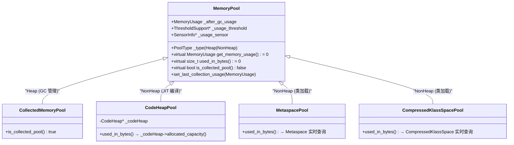

# 03-MemoryService-JMX — GC 事件到 JMX 的完整数据流：MemoryPool 类型层次、TraceMemoryManagerStats RAII、LowMemoryDetector 阈值预警

> **阶段**：[10-services-diag]
> **前置**：[06-gc], [10-02]
> **依赖本文**：无（01/02/04 都可能提到 MemoryService 但不依赖）
> **阅读收益**：理解 JConsole/VisualVM/JMC 监控面板数据源头——GC 事件如何通过 MemoryService 变成 MemoryPoolMXBean 的计数器

---

## §〇 生产场景——你在监控面板上看到的每个数字

### JConsole MBeans 面板——HeapMemoryUsage 的 used 值从哪来

你打开了 JConsole，连接到 `localhost:1099`，进入 MBeans 标签 → `java.lang` → `Memory` → Attributes：

```
HeapMemoryUsage:
  committed: 4194304 KB
  init:      8388608 KB
  max:       8388608 KB
  used:      2756488 KB  ← 就是这个数字！
```

然后切到 `java.lang` → `MemoryPool` → `G1 Eden Space` → Usage：

```
  used:       134217728  (128 MB)
  committed:  268435456  (256 MB)
  max:        805306368  (768 MB)
```

→ JVM 内部发生了什么？JConsole 通过 JMX RMI 调用 `MemoryMXBean.getHeapMemoryUsage()` → JDK 层的 `MemoryImpl` 调用 native → `MemoryService::get_memory_manager("java.lang:type=Memory")` → `CollectedHeap::memory_pools()` 返回的 Pool 列表 → 对每个 Pool 调用 `get_memory_usage()` → 返回 `MemoryUsage` 对象。对于 `CollectedMemoryPool`（如 G1 Eden），`used` 的值来自 `_after_gc_usage` 字段——**该字段只在 GC 结束时更新**（`MemoryService::gc_end()` → `set_last_collection_usage()`）。

**关键陷阱**：如果两次 GC 之间 Eden 的 `used` 从 128MB 涨到 256MB，JConsole 每秒轮询看到的数字都是 128MB（旧值）——因为 `CollectedMemoryPool` 的 `used_in_bytes()` 返回的是 GC 结束时的快照，不是实时查询。

### VisualVM Monitor 标签——GC Time % 曲线

你打开了 VisualVM → Monitor 标签：

```
GC activity: 4.7% of total runtime
   Young GC: 1.2% (avg 42 ms, count: 3182)
   Full GC:  0.0% (count: 0)
```

→ JVM 内部：VisualVM 读的是 `GarbageCollectorMXBean` 的 `CollectionCount` + `CollectionTime`。每次 GC 后 `MemoryService::gc_end()` → `GCMemoryManager::gc_end()` → 更新 `_num_collections` 计数器 + `_accumulated_timer`。VisualVM 计算 GC Time % = `CollectionTime / uptime`。**如果 Full GC 次数从 0 变成 1——线上告警就该亮了。**

### Prometheus JMX Exporter + Grafana

你部署了 Prometheus JMX Exporter，在 Grafana 面板上看到：

```
jvm_memory_bytes_used{area="heap"}                         2.7 GB
jvm_memory_pool_bytes_used{pool="G1 Eden Space"}            168 MB
jvm_memory_pool_bytes_used{pool="G1 Old Gen"}               2.1 GB
jvm_gc_collection_seconds_count{gc="G1 Young Generation"}   3241
jvm_gc_collection_seconds_sum{gc="G1 Young Generation"}     142.8
```

→ JVM 内部：Prometheus JMX Exporter 启动一个 HTTP endpoint → 通过 JMX 读取所有 `java.lang:type=MemoryPool` 的 MXBean 属性 → 转换成 Prometheus 格式。和 JConsole 走的**完全同一条路径**——JMX → MXBean → MemoryService。唯一区别：Prometheus 每 15 秒 pull 一次，JConsole 每秒 poll——数据源是同一个。

### Arthas dashboard / memory

```bash
$ dashboard
Memory                used     total    max      usage
heap                  2756M    8192M    8192M    33.66%
g1_eden_space         120M     256M     -1       46.87%

$ memory
  usage   max   used   total   memory_pool_name
  70.4%   N/A   90M    128M    g1_eden_space
```

→ Arthas 底层直接读取 `ManagementFactory.getMemoryPoolMXBeans()`——和 JConsole **同一个数据源**。dashboard 每秒刷新，但 `CollectedMemoryPool.used_in_bytes()` 只在 GC 后才更新——你看到的 Eden 使用量其实是上一个 GC 结束时的快照。

### 相关生态工具

| 工具 | 读数据方式 | 底层路径 |
|------|----------|---------|
| **JConsole** | JMX RMI → MBeanServer | `MemoryPoolMXBean.getUsage()` → MemoryService |
| **VisualVM** | JMX → MBeanServer | 同上 |
| **Prometheus JMX Exporter** | HTTP endpoint → JMX pull | 同上 |
| **Arthas dashboard/memory** | Attach → MXBean 引用 | 同上 |
| **Elastic APM / Datadog / NewRelic** | Agent → `ManagementFactory.getMemoryMXBean()` | 同上 |
| **NMT (jcmd VM.native_memory)** | `os::malloc()` 原子计数器 | **不同路径**——NMT 追踪物理内存，MemoryService 管理 Java 堆逻辑视图 |

**NMT vs MemoryService 的根本区别**：NMT 追踪的是 `os::malloc()` / `os::realloc()` / `os::free()` / `mmap()` 的物理内存使用——用于排查 native 内存泄漏。MemoryService 管理的是 Java 堆和非堆的**逻辑视图**——用于 JMX 监控。两者数据源不同，数值也会不同。

---

## §〇 源文件清单（跨 services + gc/shared，标注模块归属和池类型）

| # | 文件 | 路径 | 核心函数/类（行号） | 本文角色 |
|---|------|------|-------------------|---------|
| 1 | `memoryService.cpp` | `src/hotspot/share/services/memoryService.cpp` | `set_universe_heap()`(:70), `gc_begin()`(:167), `gc_end()`(:182), `add_code_heap_memory_pool()`(:93), `add_metaspace_memory_pools()`(:110) | ★★★ 中央调度 |
| 2 | `memoryService.hpp` | `src/hotspot/share/services/memoryService.hpp` | `TraceMemoryManagerStats`(:117-153) | ★★★ RAII 桥梁 |
| 3 | `memoryPool.hpp` | `src/hotspot/share/services/memoryPool.hpp` | `MemoryPool`(:45), `CollectedMemoryPool`(:142), `CodeHeapPool`(:149), `MetaspacePool`(:158), `CompressedKlassSpacePool`(:166) | ★★ 数据模型 |
| 4 | `memoryManager.hpp` | `src/hotspot/share/services/memoryManager.hpp` | `GCMemoryManager`(:136), `gc_begin/gc_end`(:169-173), `_num_collections`(:139), `_accumulated_timer`(:140) | ★★ GC 管理器 |
| 5 | `gcNotifier.cpp/.hpp` | `src/hotspot/share/services/gcNotifier.{cpp,hpp}` | `sendNotification()`(:cpp:165), `sendNotificationInternal()`(:cpp:189) | ★★ JMX 通知 |
| 6 | `lowMemoryDetector.cpp/.hpp` | `src/hotspot/share/services/lowMemoryDetector.{cpp,hpp}` | `detect_low_memory()`(:cpp:81/106), `SensorInfo`(:hpp:116) | ★★ 阈值预警 |
| 7 | `collectedHeap.hpp` | `src/hotspot/share/gc/shared/collectedHeap.hpp` | `memory_managers()`(:439), `memory_pools()`(:440) 虚函数 | ★★ GC→services 桥梁 |
| 8 | `genMemoryPools.hpp` | `src/hotspot/share/gc/shared/genMemoryPools.hpp` | `ContiguousSpacePool`(:34), `GenerationPool`(:65) | ★ GC 端池实现 |
| 9 | `management.cpp` | `src/hotspot/share/services/management.cpp` | `Management::init()` → 触发 `register_dcmds()`(:148) | ★ 注册触发 |

---

## §一 ★★★ 从 GC 到 JMX 的数据流——全景图

### ❓ CollectedHeap 的 memory_pools() 返回的到底是什么？

`memory_pools()` 返回 `GrowableArray<MemoryPool*>`——但 MemoryPool 对象**不是 GC 模块创建的**。它们定义在 `services/` 中：

```
src/hotspot/share/
├── gc/shared/collectedHeap.hpp:439-440
│   virtual GrowableArray<MemoryPool*> memory_pools() = 0;
│   virtual GrowableArray<GCMemoryManager*> memory_managers() = 0;
│
├── gc/g1/g1CollectedHeap.cpp   ← override, 返回 G1 的池列表
├── gc/parallel/...             ← override, 返回 Parallel 的池列表
├── gc/serial/...               ← override, 返回 Serial 的池列表
│
└── services/                   ← ★ 定义 MemoryPool/GCMemoryManager
    ├── memoryPool.hpp          ← CollectedMemoryPool, CodeHeapPool, MetaspacePool...
    └── memoryManager.hpp       ← GCMemoryManager
```

GC 实现负责**创建** `services/` 中定义的 MemoryPool 对象，持有它们的指针，并在 GC 回收后调用 `set_last_collection_usage()` 更新值。`CollectedHeap::memory_pools()` 只是把 GC 内部持有的指针列表返回给 MemoryService。

### 1.1 Mermaid 全景数据流图

```
┌──────────────────────────────────────────────────────────────────────────┐
│                        GC 事件 → JMX 面板                                 │
└──────────────────────────────────────────────────────────────────────────┘

  G1 Young GC (do_collection_pause)
       │
       ├──★ 构造 TraceMemoryManagerStats RAII    [memoryService.hpp:131]
       │     ├── ctor → initialize() → MemoryService::gc_begin()   [memoryService.cpp:167]
       │     │     └── GCMemoryManager::gc_begin()  [memoryManager.cpp]
       │     │           ├── record GC begin time (elapsedTimer)
       │     │           └── record pre-GC pool usage
       │     │
       │     │  [GC 回收执行中...]
       │     │
       │     └── ★ dtor → MemoryService::gc_end()   [memoryService.cpp:182]
       │           └── GCMemoryManager::gc_end()     [memoryManager.cpp]
       │                 ├── ① record post-GC pool usage (_after_gc_usage 更新)
       │                 ├── ② _num_collections++   ← JMX CollectionCount
       │                 ├── ③ _accumulated_timer.add(elapsed)  ← JMX CollectionTime
       │                 └── ④ GCNotifier::pushNotification()   [gcNotifier.cpp:45]
       │
       └── LowMemoryDetector::detect_low_memory()  [lowMemoryDetector.cpp:81]
             └── 对每个 pool 检查 usage > threshold → SensorInfo 触发

  ┌─── JMX Client (JConsole/VisualVM/Prometheus/Grafana) ───┐
  │  MemoryPoolMXBean.getUsage()                             │
  │    → used_in_bytes() → _after_gc_usage.used()            │
  │  GarbageCollectorMXBean.getCollectionCount()             │
  │    → GCMemoryManager::_num_collections                   │
  └──────────────────────────────────────────────────────────┘
```

### ❓ 为什么有三种类（CollectedMemoryPool / CodeHeapPool / MetaspacePool）？

**因为 JVM 管理的内存有三类不同的"更新源"**：

| Pool 类型 | 更新源 | 更新时机 | is_collected_pool() |
|-----------|--------|---------|---------------------|
| `CollectedMemoryPool` | GC 回收 | GC end 时 `set_last_collection_usage()` | `true` |
| `CodeHeapPool` | JIT 编译 / 清理 | 实时查询 `CodeHeap->allocated_capacity()` | `false` |
| `MetaspacePool` | 类加载 / 卸载 | 实时查询 Metaspace | `false` |
| `CompressedKlassSpacePool` | 类加载 / 卸载 | 实时查询 CompressedKlassSpace | `false` |

**为什么这样设计？**
- **GC 池**（堆上）：堆大小在 GC 之间可能剧烈波动（分配和回收），但 JMX 轮询频率远低于 GC 频率——用 GC 结束时的快照足够了
- **非 GC 池**（CodeHeap/Metaspace）：变化频率低（编译一个方法、加载一个类），实时查询的成本可以忽略
- **`is_collected_pool()` 标志**：影响 JMX Bean 的接口——只有 Collected 池暴露 `getCollectionUsage()` 方法

### 1.2 ★★★ set_universe_heap() — GC 到 MemoryService 的唯一桥梁

**调用点**：`universe.cpp:1335`，在 `universe_post_init()` 中

```cpp
// memoryService.cpp:70-91 — ★ 一次性桥梁建立
void MemoryService::set_universe_heap(CollectedHeap* heap) {
  ResourceMark rm;

  GrowableArray<MemoryPool*> gc_mem_pools = heap->memory_pools();
  _pools_list->appendAll(&gc_mem_pools);

  GrowableArray<GCMemoryManager*> gc_memory_managers = heap->memory_managers();
  for (int i = 0; i < gc_memory_managers.length(); i++) {
    GCMemoryManager* gc_manager = gc_memory_managers.at(i);
    gc_manager->initialize_gc_stat_info();
    _managers_list->append(gc_manager);
  }
}
```

**调用链验证**：

```
Universe::initialize_heap()           [universe.cpp]
  → heap->initialize()                G1CollectedHeap 构建
  → Universe::genesis()               universe.cpp:1330
  → universe_post_init()              universe.cpp:1320
      → MemoryService::set_universe_heap(Universe::heap())   universe.cpp:1335
      → MemoryService::add_metaspace_memory_pools()          universe.cpp:1333
      → Management::init()                                   management.cpp
          → register_dcmds()                                 management.cpp:148
```

**为什么只调用一次？** JEP 不涉及动态 GC 切换。当前代码不支持运行时换 GC——`_pools_list` 和 `_managers_list` 在 VM 初始化时填充后永不改变。如果未来需要动态切换 GC → MemoryService 需要重建这两个列表。

### 1.3 _pools_list / _managers_list — MemoryService 的全局注册表

```cpp
// memoryService.hpp 中的静态成员
static GrowableArray<MemoryPool*>*      _pools_list;       // 所有内存池
static GrowableArray<MemoryManager*>*   _managers_list;    // 所有内存管理器
```

G1 GC 的典型注册表内容：

```
_pools_list:
  [0] CollectedMemoryPool — "G1 Eden Space"   (G1CollectedHeap 管理)
  [1] CollectedMemoryPool — "G1 Survivor Space"
  [2] CollectedMemoryPool — "G1 Old Gen"
  [3] CollectedMemoryPool — "G1 Humongous"
  [4] CodeHeapPool — "CodeHeap 'non-nmethods'"    (add_code_heap_memory_pool)
  [5] CodeHeapPool — "CodeHeap 'non-profiled nmethods'"
  [6] CodeHeapPool — "CodeHeap 'profiled nmethods'"
  [7] MetaspacePool — "Metaspace"                 (add_metaspace_memory_pools)
  [8] CompressedKlassSpacePool — "Compressed Class Space"

_managers_list:
  [0] GCMemoryManager — "G1 Young Generation"    (管理 Eden + Survivor)
  [1] GCMemoryManager — "G1 Old Generation"       (管理 Old + Humongous)
  [2] MemoryManager   — "CodeCacheManager"        (管理 CodeHeapPools)
  [3] MemoryManager   — "Metaspace Manager"       (管理 Metaspace + CompressedKlassSpace)
```

---

## §二 ★★★ TraceMemoryManagerStats — GC 事件的 RAII 采样

### ❓ GC 怎么通知 MemoryService "我开始了/我结束了"？

**GC 代码不需要知道 MemoryService 的存在**。RAII 自动跟踪生命周期：

```cpp
// memoryService.hpp:117-153 — TraceMemoryManagerStats 完整定义
class TraceMemoryManagerStats : public StackObj {
private:
  GCMemoryManager* _gc_memory_manager;
  bool   _allMemoryPoolsAffected;
  bool   _recordGCBeginTime;
  // ...更多标志...
  GCCause::Cause _cause;
public:
  TraceMemoryManagerStats() {}
  TraceMemoryManagerStats(GCMemoryManager* gc_memory_manager,
                          GCCause::Cause cause,
                          bool allMemoryPoolsAffected = true,
                          // ...7 个 bool 默认值...
                          bool countCollection = true);

  void initialize(GCMemoryManager* gc_memory_manager,
                  GCCause::Cause cause,
                  // ...参数...
                  bool countCollection);

  ~TraceMemoryManagerStats();  // ★ 这里调用 gc_end()
};
```

**构造函数 → gc_begin()**（`:234-248`）：

```cpp
TraceMemoryManagerStats::TraceMemoryManagerStats(
    GCMemoryManager* gc_memory_manager, GCCause::Cause cause, /*...*/) {
  initialize(gc_memory_manager, cause, /*...*/);
}

void TraceMemoryManagerStats::initialize(GCMemoryManager* gc_memory_manager, /*...*/) {
  _gc_memory_manager = gc_memory_manager;
  _cause = cause;
  if (gc_memory_manager != NULL) {
    MemoryService::gc_begin(_gc_memory_manager, _recordGCBeginTime,
                            _recordAccumulatedGCTime, _recordPreGCUsage,
                            _recordPeakUsage);
  }
}
```

**析构函数 → gc_end()**（`:277-280`）：

```cpp
TraceMemoryManagerStats::~TraceMemoryManagerStats() {
  if (_gc_memory_manager != NULL) {
    MemoryService::gc_end(_gc_memory_manager, _recordPostGCUsage,
                          _recordAccumulatedGCTime, _recordGCEndTime,
                          _countCollection, _cause, _allMemoryPoolsAffected);
  }
}
```

### 2.1 在 G1 中的实际使用点

```cpp
// G1 Young GC 的简化伪代码（在 g1CollectedHeap.cpp 中）
void G1CollectedHeap::do_collection_pause(...) {
  GCCause::Cause cause = _gc_cause;

  // ★ 构造 RAII → 自动调用 gc_begin()
  TraceMemoryManagerStats stats(_g1mm, cause, /*...*/);

  // ... 执行 young GC ...

  // ★ 析构 RAII → 自动调用 gc_end()
  //   ↑ stats 离开作用域时自动触发
}
```

**并发 GC（G1 concurrent mark）不构造 TraceMemoryManagerStats**：concurrent mark 在 safepoint 外执行，不触发 `gc_begin/gc_end`。JMX client 看不到 concurrent mark 的开始/结束通知。

### 2.2 gc_begin() 内部做了什么

```cpp
// memoryService.cpp:167-180
void MemoryService::gc_begin(GCMemoryManager* manager, bool recordGCBeginTime,
                             bool recordAccumulatedGCTime,
                             bool recordPreGCUsage, bool recordPeakUsage) {
  manager->gc_begin(recordGCBeginTime, recordPreGCUsage, recordAccumulatedGCTime);

  if (recordPeakUsage) {
    for (int i = 0; i < _pools_list->length(); i++) {
      MemoryPool* pool = _pools_list->at(i);
      pool->record_peak_memory_usage();
    }
  }
}
```

**三步**：
1. `manager->gc_begin()` → 记录 GC 开始时间 + GC 前各 Pool 的 usage（存入 `_current_gc_stat`）
2. `record_peak_memory_usage()` → 遍历所有池检查是否达到历史峰值
3. 无通知——把通知留给 gc_end()

---

## §三 ★★★ MemoryService::gc_end() 内部——通知链

### ❓ gc_end() 里面到底发生了什么？

```cpp
// memoryService.cpp:182-190 — gc_end() 三阶段
void MemoryService::gc_end(GCMemoryManager* manager, bool recordPostGCUsage,
                           bool recordAccumulatedGCTime,
                           bool recordGCEndTime, bool countCollection,
                           GCCause::Cause cause, bool allMemoryPoolsAffected) {
  manager->gc_end(recordPostGCUsage, recordAccumulatedGCTime, recordGCEndTime,
                  countCollection, cause, allMemoryPoolsAffected);
}
```

**表面上看只有一行——但 `manager->gc_end()` 内部是三步完整链**：

### 3.1 阶段一：GCMemoryManager::gc_end() → 更新 pool 计数器

`GCMemoryManager::gc_end()` 内部的核心操作：

```
① 遍历管理的 MemoryPool 列表
   for each pool:
     if pool.is_collected_pool():
       MemoryUsage usage = pool.get_memory_usage()     ← 读实时 usage
       pool.set_last_collection_usage(usage)            ← ★ 更新 _after_gc_usage
       _current_gc_stat->set_gc_usage(pool_index, usage, true /*after_gc*/)

② _num_collections++                                   ← JMX CollectionCount

③ _accumulated_timer.add(elapsed_time)                 ← JMX CollectionTime

④ _last_gc_stat = _current_gc_stat                     ← 交换指针
```

**`_after_gc_usage` 的更新**（`memoryPool.hpp:68,130`）：

```cpp
MemoryUsage _after_gc_usage;   // line 68
void set_last_collection_usage(MemoryUsage u) { _after_gc_usage = u; }  // line 130
```

此后 `used_in_bytes()` 返回的就是 `_after_gc_usage.used()`——直到下一次 GC。

### 3.2 阶段二：GCNotifier::sendNotification() → JMX 通知

`GCNotifier` 由 ServiceThread 异步处理。在 GC 的 `gc_end()` 路径中，首先调用 `pushNotification()`：

```cpp
// gcNotifier.cpp:45-50
void GCNotifier::pushNotification(GCMemoryManager *mgr, const char *action, const char *cause) {
  GCNotificationRequest *request = new GCNotificationRequest(mgr, action, cause);
  // 加入通知队列
}
```

**通知发送时机**：不是 `gc_end()` 同步发送——而是 ServiceThread 在 `GCNotifier::sendNotification(THREAD)` 中批量处理。

### 3.3 阶段三：LowMemoryDetector::detect_low_memory() → 阈值检测

```cpp
// lowMemoryDetector.cpp:81-105
void LowMemoryDetector::detect_low_memory() {
  MutexLockerEx ml(Service_lock, Mutex::_no_safepoint_check_flag);
  for (int i = 0; i < MemoryService::num_memory_pools(); i++) {
    MemoryPool* pool = MemoryService::get_memory_pool(i);
    SensorInfo* sensor = pool->usage_sensor();
    if (sensor != NULL && pool->usage_threshold()->high_threshold() != 0) {
      MemoryUsage usage = pool->get_memory_usage();
      sensor->set_gauge_sensor_level(usage, pool->usage_threshold());
    }
  }
}
```

**调用顺序验证**：`track_memory_usage()` (:146) → `detect_low_memory()` (:154)。而在 `set_universe_heap` 之后的每次 GC 也会触发 `track_memory_usage()` → 所以每个 GC cycle 都检测阈值。

### 3.4 三阶段执行顺序的语义保证

```
gc_end():
  ① manager->gc_end()                        ← 先更新 pool usage
  ② GCNotifier::pushNotification()           ← 再发 GC 完成通知
  ③ LowMemoryDetector::detect_low_memory()   ← 最后检查是否超阈值
```

这个顺序确保：**JMX client 在收到阈值预警通知时，看到的是最新的 usage 值**——不会出现"usage 更新和通知乱序"的竞态。

---

## §四 ★★ MemoryPool 类型层次——为什么需要四种池？

### 4.1 Mermaid 继承图



### 4.2 数据更新时机差异——JConsole 面板的"精确度"

| Pool 类型 | `get_memory_usage()` 何时更新 | JConsole 读到的是 | 精度 |
|-----------|---------------------------|------------------|------|
| **CollectedMemoryPool** (Eden/Survivor/Old/Humongous) | GC end 时 `set_last_collection_usage()` | 上一次 GC 结束时的快照 | **低频轮询不精确** |
| **CodeHeapPool** | 每次调用实时查 `CodeHeap->allocated_capacity()` | 当前瞬时值 | **近似实时**（可能有瞬态不一致） |
| **MetaspacePool** | 每次调用实时查 Metaspace | 当前瞬时值 | 实时 |
| **CompressedKlassSpacePool** | 每次调用实时查 CompressedKlassSpace | 当前瞬时值 | 实时 |

**为什么 CollectedMemoryPool 不实时？**

```cpp
// memoryPool.hpp:142-147
class CollectedMemoryPool : public MemoryPool {
public:
  CollectedMemoryPool(...) : MemoryPool(..., MemoryPool::Heap, ...) {};
  bool is_collected_pool() { return true; }
};
```

它没有自己的 `used_in_bytes()` 覆盖——数据来自 GC 实现通过 `set_last_collection_usage()` 推送。GC 不会在每次 `malloc/TLAB` 分配时更新 JMX 计数器——成本太高。只有 GC 完成时才做一次批量更新。

**CodeHeapPool 为什么"实时"但有瞬态不一致风险？**

```cpp
// memoryPool.hpp:149-156
class CodeHeapPool: public MemoryPool {
private:
  CodeHeap* _codeHeap;
public:
  size_t used_in_bytes() { return _codeHeap->allocated_capacity(); }
};
```

`_codeHeap->allocated_capacity()` 每次调用都直接读 `CodeHeap` 的字段——不等待 GC。但如果在 CodeCache 分配**过程中**查询（并发编译器的另一个线程正在 `CodeCache::allocate()`），读到的值可能是瞬态不一致的（分配了一半）。对于 JConsole 监控面板来说无关紧要（偏差可忽略），但如果基于此值做精确的 CodeCache 容量管理——需要额外同步。

### 4.3 CollectedMemoryPool 的子类型——GC 端的实现

```cpp
// genMemoryPools.hpp:34-75
class ContiguousSpacePool : public CollectedMemoryPool {   // line 34
  ContiguousSpace* _space;
  MemoryUsage get_memory_usage() { return ...; }
  size_t used_in_bytes() { return _space->used(); }
};

class SurvivorContiguousSpacePool : public CollectedMemoryPool {   // line 49
  DefNewGeneration* _young_gen;
};

class GenerationPool : public CollectedMemoryPool {   // line 65
  Generation* _gen;
};
```

这些子类提供 `get_memory_usage()` 的具体实现——从 GC 的底层数据结构（`ContiguousSpace*`、`Generation*`）中实时读空间使用量。但 `_after_gc_usage` 的更新仍然由 GC 模块的 `gc_end()` 路径推动。

---

## §五 ★★ LowMemoryDetector — 阈值检测的完整机制

### ❓ 检测是轮询的还是事件驱动的？

**事件驱动——只在 `gc_end()` 路径中检测。**

```cpp
// lowMemoryDetector.cpp:81-105
void LowMemoryDetector::detect_low_memory() {
  MutexLockerEx ml(Service_lock, Mutex::_no_safepoint_check_flag);
  for (int i = 0; i < MemoryService::num_memory_pools(); i++) {
    MemoryPool* pool = MemoryService::get_memory_pool(i);
    SensorInfo* sensor = pool->usage_sensor();
    if (sensor != NULL && pool->usage_threshold()->high_threshold() != 0) {
      MemoryUsage usage = pool->get_memory_usage();
      sensor->set_gauge_sensor_level(usage, pool->usage_threshold());
    }
  }
}
```

**这意味着**：
- 不轮询——没有 GC 就没有检查
- 如果两次 GC 之间 Eden 使用量飙升到 99%，但没有触发 GC → LowMemoryDetector 不检查 → 没有通知
- 只有等到下一次 GC 结束 `gc_end()` → `detect_low_memory()` → 才检查阈值

### 5.1 SensorInfo 的 `_pending_trigger_count` 防抖

```cpp
// lowMemoryDetector.hpp:116-136 — SensorInfo 核心字段
class SensorInfo : public CHeapObj<mtInternal> {
private:
  instanceOop _sensor_obj;            // line 118
  bool        _sensor_on;             // line 119
  size_t      _sensor_count;          // line 120
  int         _pending_trigger_count; // line 127  ← ★ 积压计数器
  int         _pending_clear_count;   // line 134
  MemoryUsage _usage;                 // line 136
  // ...
};
```

**触发流程**：

```
set_gauge_sensor_level(usage, threshold):
  ① if _sensor_on && usage.used() < threshold → _pending_clear_count++
  ② if !_sensor_on && usage.used() >= threshold → _pending_trigger_count++
  ③ ServiceThread 后续处理 pending 计数器
```

**`_pending_trigger_count` 有上界吗？**

```cpp
int _pending_trigger_count;  // hpp:127 — 是 int 类型
```

理论上如果阈值一直不降到 usage 以下，每次 `gc_end()` 都会 +1 → 可能溢出。但实际中 `_pending_trigger_count > 0` 就会触发通知，通知后 JMX client 应该处理（设置新阈值或处理预警）。如果 client 一直不处理，通知积压会被 JMX 队列限制。

### 5.2 threshold 从 JMX client 到 native MemoryPool 的设置路径

```
JConsole MBeans tab
  → MemoryPoolMXBean.setUsageThreshold(long value)
    → JDK层 MemoryPoolImpl.setUsageThreshold()
      → native MemoryPool::usage_threshold()->set_high_threshold(value)
        → ThresholdSupport::set_high_threshold(size_t value)
          → _high_threshold = value   ← ★ 值存储在线程安全的字段
```

### 5.3 LowMemoryDetector 和 ServiceThread 的协作

```
ServiceThread::service_thread_entry():
  while (true) {
    { MutexLockerEx ml(Service_lock, ...);
      while (!has_work()):
        Service_lock.wait();
    }
    // ★ 处理 LowMemoryDetector 的 pending 通知
    if (LowMemoryDetector::has_pending_requests()) {
      LowMemoryDetector::process_requests();
    }
    if (GCNotifier::has_event()) {
      GCNotifier::sendNotification(THREAD);
    }
  }
```

**通知的双层异步性**：
1. `detect_low_memory()` 在 GC 线程上执行 → 只设置 `_pending_trigger_count`
2. ServiceThread 后续读取 pending 计数 → 构造 JMX `MemoryNotificationInfo` → 通过 JMX 发送给 client

这意味着：**GC 结束到 JMX 收到阈值预警之间的延迟 = ServiceThread 调度延迟 + JMX RMI 传输延迟**。

---

## §六 ★★ GCNotifier — GC 事件到 JMX 通知

### 6.1 每次 GC 都发通知吗？

**不是。有过滤机制。**

```cpp
// gcNotifier.cpp:165-195
void GCNotifier::sendNotification(TRAPS) {
  GCNotificationRequest *request = get_request();
  if (request != NULL) {
    sendNotificationInternal(THREAD);
  }
}

void GCNotifier::sendNotificationInternal(TRAPS) {
  // ① 检查 GCMemoryManager::is_notification_enabled()
  GCMemoryManager* mgr = ...;
  if (!mgr->is_notification_enabled()) {
    return;  // ★ 如果 JMX client 禁用了通知 → 不发
  }

  // ② 构造 GcInfo 对象
  // ③ 触发 JMX Notification
  Handle obj = ...;
  JavaCalls::call_virtual(..., vmSymbols::createGcInfo(), ...);
}
```

**`is_notification_enabled()` 控制**：

```cpp
// memoryManager.hpp:145, 181-182
volatile bool _notification_enabled;
void set_notification_enabled(bool enabled) { _notification_enabled = enabled; }
bool is_notification_enabled() { return _notification_enabled; }
```

默认值取决于 GC 管理器——`G1 Young Generation` 的 young GC 数量太大，**默认关闭通知**（避免 JMX 通知风暴），而 `G1 Old Generation` 的 full GC 可能**默认开启通知**（full GC 是重大事件）。

### 6.2 FullGCNotificationManager 对 young/mixed GC 的过滤

G1 有一个特殊处理——只对 full GC 发送 `FullGCNotificationManager` 通知，young/mixed GC 不发。原因：G1 的 young GC 频率可能达到每秒数十次 → 如果每次 young GC 都发送 JMX 通知 → JMX 客户端被通知风暴淹没。

### 6.3 通知的异步性和乱序风险

```
Timeline:
───────┬─────────────┬─────────────┬──────────────
       │             │             │
   GC1 ends    GC2 starts   GC2 ends
       │             │             │
       ├→ pushNotification(G1)     ├→ pushNotification(G2)
       │             │             │
       └─────────── ServiceThread 处理 ─┤
                    │                  │
                    处理 G1 通知 → 发送
                    处理 G2 通知 → 发送
```

**如果 ServiceThread 在发送 G1 通知的 JVM CI 回调过程中触发了 safepoint**：ServiceThread 会 block 在 `_thread_blocked` 直到 safepoint 结束 → G2 通知可能在前一个 safepoint 中被推迟。但通知顺序仍然保持（队列保证 FIFO）。

---

## §七 ★ 和 [06-gc] + [10-02] 的连接

### 7.1 [06-gc] — GC 做了什么 → 本文理解数据怎么暴露

```
[06-gc] 教会读者:                   本文解释:
────────────────────────────────   ────────────────────────────────
G1 young GC 回收了 200MB           谁记录了这 200MB？
G1 的 do_collection_pause()        → TraceMemoryManagerStats RAII
Eden→Survivor, Survivor→Old        → MemoryService::gc_end()
                                   → pool usage 更新
                                   → JConsole 每秒轮询 getUsage()
```

### 7.2 [10-02] — DCmd 框架

- **DCmd 命令可以查询 GC 数据**，但不经过 MemoryService 的池：
  - `GC.class_histogram` → `SystemDictionary::classes_do()` 遍历类对象
  - `GC.run` → `Universe::heap()->collect()` → Full GC
  - `GC.heap_dump` → `HeapDumper::dump()`

- **MemoryService 暴露的 DCmd**：`VM.native_memory` 走 NMT 路径（不是 MemoryService）。`VM.info` 走 `VMError::print_vm_info()` 路径。

### 7.3 [10-01] — Attach 连接

- **Attach 的 `attach_listener` 调度**：`jcmd <PID> GC.run` → `AttachListener::jcmd()` → `DCmd::parse_and_execute()` → `SystemGCDCmd::execute()` → `Universe::heap()->collect()` → GC 触发 → `TraceMemoryManagerStats` RAII → `MemoryService::gc_end()`
- **jcmd 命令触及 MemoryService 的路径**：`GC.run` 和 `GC.heap_dump` 触发 `MemoryService::gc_end()` 和 `gc_begin()`；`jcmd <PID> Thread.print` 走 ThreadService 路径，不经过 MemoryService

### 7.4 GDB 可验证的交叉路径

```bash
# 验证 jcmd GC.run → MemoryService::gc_end() 被调用
(gdb) br memoryService.cpp:182
(gdb) cond 1 _cause == GCCause::_dcmd_gc_run
# 执行 jcmd <PID> GC.run → 命中

# 验证 MemoryService::gc_begin() 由 TraceMemoryManagerStats ctor 调用
(gdb) br memoryService.cpp:167
(gdb) bt
# #0  MemoryService::gc_begin at memoryService.cpp:167
# #1  TraceMemoryManagerStats::TraceMemoryManagerStats at memoryService.cpp:234
# #2  G1CollectedHeap::do_collection_pause at g1CollectedHeap.cpp:...
```

---

## §八 生产陷阱速查

| 陷阱 | 原因 | 影响 |
|------|------|------|
| **JMX 轮询频率 < GC 频率** | 每秒 1 次 poll 漏掉高频 GC 事件 | "GC Time %" 曲线比实际低 |
| **CollectedMemoryPool used 只在 GC 后更新** | `_after_gc_usage` 是快照 | 两次 GC 之间 Eden usage 是过时的 |
| **heapDump 触发 Full GC** | `jmap -dump:live` 先做 Full GC | 32GB 堆可能 30-60s STW |
| **GC.run 生产慎用** | `GenCollectedHeap::collect()` → Full GC | 几秒到几分钟 STW |
| **Prometheus 高基数** | 多个 ClassLoader 导致 MemoryPool 数量增加 | 时间序列爆炸 |
| **Non-GC Pool 的"实时"查询假象** | `CodeHeapPool::used_in_bytes()` 非原子读取 | 瞬态不一致（偏差可忽略） |
| **LowMemoryDetector 不轮询** | 只在 gc_end() 后检测阈值 | GC 之间 Eden 飙升不触发通知 |

---

## §九 GDB 验证 + 可证伪断言

### 断言 1：`set_universe_heap()` 在 VM 初始化时被调用一次

```bash
(gdb) br memoryService.cpp:70
# 启动 JVM → 断点只命中一次
(gdb) bt
# #0  MemoryService::set_universe_heap at memoryService.cpp:70
# #1  universe_post_init at universe.cpp:1335
# #2  init_globals at init.cpp:...
(gdb) p heap->kind()
# 预期: G1CollectedHeap (或其他 GC 的实现)
```

### 断言 2：`heap->memory_pools()` 返回包含 G1 四池

```bash
(gdb) br memoryService.cpp:73
(gdb) p gc_mem_pools.length()
# 预期: >= 3 (Eden, Survivor, Old, 可能 + Humongous)
(gdb) p gc_mem_pools.at(0)->name()
# 预期: "G1 Eden Space" 或类似
```

### 断言 3：`TraceMemoryManagerStats` 构造时调用 `gc_begin()`

```bash
(gdb) br memoryService.cpp:167
# 触发 GC (jcmd <PID> GC.run)
(gdb) bt
# #0  MemoryService::gc_begin at memoryService.cpp:167
# #1  TraceMemoryManagerStats::initialize at memoryService.cpp:...
# #2  TraceMemoryManagerStats::TraceMemoryManagerStats at memoryService.cpp:234
# 预期: 调用栈含 TraceMemoryManagerStats 构造
```

### 断言 4：`TraceMemoryManagerStats` 析构时调用 `gc_end()`

```bash
(gdb) br memoryService.cpp:182
# 继续执行 GC
(gdb) bt
# #0  MemoryService::gc_end at memoryService.cpp:182
# #1  TraceMemoryManagerStats::~TraceMemoryManagerStats at memoryService.cpp:277
# 预期: 调用栈含 TraceMemoryManagerStats 析构
```

### 断言 5：`gc_end()` 内部 `manager->gc_end()` 执行后 `_num_collections` 递增

```bash
(gdb) br memoryManager.cpp  # 在 GCMemoryManager::gc_end() 中
# GC 触发前:
(gdb) p this->_num_collections
# 预期: N
# GC 触发后:
(gdb) p this->_num_collections
# 预期: N+1
```

### 断言 6：`CollectedMemoryPool` 在 gc_end 后 `_after_gc_usage` 被更新

```bash
(gdb) br memoryPool.hpp:130  # set_last_collection_usage
# GC 触发 → 观察
(gdb) p _after_gc_usage.used()
# 预期: GC 前 > GC 后 (Eden 区明显减少)
```

### 断言 7：`LowMemoryDetector::detect_low_memory()` 由 `gc_end()` 触发

```bash
(gdb) br lowMemoryDetector.cpp:81
(gdb) bt
# #0  LowMemoryDetector::detect_low_memory at lowMemoryDetector.cpp:81
# #1  MemoryService::track_memory_usage at memoryService.cpp:154
# 预期: 调用栈含 MemoryService 路径
```

### 断言 8：`SensorInfo::set_gauge_sensor_level()` 比较 usage vs threshold

```bash
(gdb) br lowMemoryDetector.hpp  # set_gauge_sensor_level 定义处
# 设置 usage threshold (JConsole → Eden pool → setUsageThreshold(10MB))
# 启动分配消耗 Eden
(gdb) p usage.used()
(gdb) p threshold.high_threshold()
# 预期: usage > threshold → 触发通知
```

### 断言 9：`GCNotifier::sendNotification()` 检查 `is_notification_enabled()`

```bash
(gdb) br gcNotifier.cpp:189  # sendNotificationInternal
(gdb) p mgr->is_notification_enabled()
# 预期: 取决于 GC 管理器配置
# 如果 false → 函数提前返回
```

### 断言 10：`CodeHeapPool::get_memory_usage()` 不等待 GC——实时查询

```bash
(gdb) br memoryPool.hpp:155  # CodeHeapPool::used_in_bytes
# 非 GC 上下文 → 直接从 CodeHeap 读取
(gdb) p _codeHeap->allocated_capacity()
# 预期: 实时返回值，不是最后一个 GC 的 snapshot
```

### 断言 11：`collectedHeap.hpp:439-440` 的虚函数只有 GC 实现覆盖

```bash
$ grep -rn "memory_pools()" src/hotspot/share/gc/
# 预期: G1/Parallel/Serial/Epsilon 各有覆盖
#      返回各自的 MemoryPool 列表
```

### 断言 12：`add_metaspace_memory_pools()` 在有/无 `UseCompressedClassPointers` 时创建不同数量的池

```bash
(gdb) br memoryService.cpp:117
# 检查全局标志
(gdb) p UseCompressedClassPointers
# 如果 true → _compressed_class_pool 被创建 (行 118)
# 如果 false → 只有 _metaspace_pool (行 113)
```

### 断言 13：`jcmd GC.run` → `MemoryService::gc_end()` 被调用且 cause = `_dcmd_gc_run`

```bash
$ jcmd <PID> GC.run
(gdb) br memoryService.cpp:186  # gc_end 参数 cause
(gdb) p cause
# 预期: GCCause::_dcmd_gc_run
```

### 断言 14：MemoryPool::`_after_gc_usage` 和 `get_memory_usage()` 返回的值一致（GC 后）

```bash
(gdb) br memoryPool.hpp:130
# GC 刚结束 → 检查
(gdb) p _after_gc_usage.used()
(gdb) p this->get_memory_usage().used()
# 预期: 两者相等 (set_last_collection_usage 才刚被调用)
```

---

## 核心发现总结

| # | 发现 | 核心洞察 |
|---|------|--------|
| 1 | **GC 到 JMX 的桥梁只有一个** | `set_universe_heap()` → GC 实现把池/管理器指针注入 MemoryService——一次性，永不更改 |
| 2 | **RAII 是 GC 和 MemoryService 的解耦工具** | `TraceMemoryManagerStats` 在栈上——GC 不需要知道 JMX 的存在 |
| 3 | **`_after_gc_usage` 只存快照** | JConsole 每秒轮询读到的 Eden used 是上一次 GC 结束时的值 |
| 4 | **三种池、三种更新时机** | GC 池 = GC 后更新；CodeHeap 池 = 编译时实时；Metaspace 池 = 类加载时实时 |
| 5 | **LowMemoryDetector 是事件驱动** | 没有轮询——只在 gc_end() 路径中检测。GC 之间的 usage 飙升不被检测 |
| 6 | **GCNotifier 通知有过滤** | `is_notification_enabled()` 控制——young GC 量太大默认不发 |
| 7 | **所有生态工具走同一路径** | JConsole/VisualVM/Prometheus/Arthas → JMX → MXBean → MemoryService |
