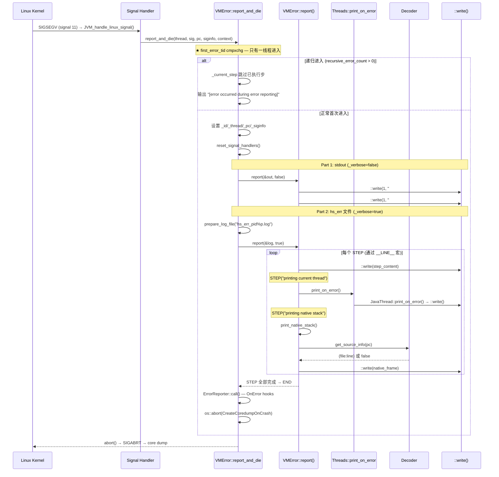

# 04-VMError-hs_err — JVM 崩溃报告的信号安全生成全链路：write()  vs fprintf()、STEP 宏 __LINE__ 分步、递归防无限循环

> **阶段**：[10-services-diag]
> **前置**：[08-safepoint], [10-01], [07-thread]
> **依赖本文**：无（最终篇——组合全阶段能力）
> **阅读收益**：理解 JVM 崩溃报告 hs_err_pid\<pid\>.log 的信号安全生成全链路——为什么只能用 write()、_steps 分步机制的 __LINE__ 宏实现、递归崩溃的防无限循环、和 safepoint 信号安全思想的极端对偶

---

## §〇 生产场景——当线上应用崩了，你第一时间打开 hs_err

### 真实 hs_err 片段——SIGSEGV in G1ParScanThreadState

线上应用突然宕机。你在 `/data/logs/` 下看到：

```bash
$ ls -lh hs_err_pid12463.log
-rw-r--r-- 1 app app 187K Jun 4 15:42 hs_err_pid12463.log
```

打开文件：

```
#
# A fatal error has been detected by the Java Runtime Environment:
#
#  SIGSEGV (0xb) at pc=0x00007f8b1a3c4d21, pid=12463, tid=12494
#
# JRE version: OpenJDK Runtime Environment (11.0.22+9) (build 11.0.22+9-LTS)
# Java VM: OpenJDK 64-Bit Server VM (11.0.22+9-LTS, ...)
# Problematic frame:
# V  [libjvm.so+0x8c4d21]  G1ParScanThreadState::copy_to_survivor(...)+0x61

---------------  T H R E A D  ---------------

Current thread (0x00007f8b24083800):  GCTaskThread "G1 Young RemSet Sampling"
  [stack: 0x00007f8b1ebfb000,0x00007f8b1ecfe000] [id=12494]

Native frames: (J=compiled Java code, A=aot compiled Java code,
               j=interpreted, Vv=VM code, C=native code)
V  [libjvm.so+0x8c4d21]  G1ParScanThreadState::copy_to_survivor(...)+0x61
V  [libjvm.so+0x8c5a8b]  G1ScanEvacuatedObjClosure::do_oop_work(...)+0x15b
...

Java frames: (J=compiled Java code, j=interpreted, Vv=VM code)
J 4582  com.example.service.OrderService.processBatch(...) (137 bytes) ...

---------------  P R O C E S S  ---------------

Threads class SMR info:
_java_thread_list=0x00007f8b240d8000, length=281, elements={
0x00007f8b24083800, 0x00007f8b24084000, 0x00007f8b24084800, ...
}

---------------  S Y S T E M  ---------------

OS: Red Hat Enterprise Linux 8.8 (Ootpa)
Memory: 4k page, physical 32768000k(3281832k free), swap 0k(0k free)
vm_info: OpenJDK 64-Bit Server VM (11.0.22+9-LTS) for linux-amd64 ...
```

→ **JVM 内部发生了什么？** 在 G1 young GC 的并行拷贝阶段，GC 线程访问了无效的对象指针 → CPU MMU 触发 page fault → 内核发送 SIGSEGV (signal 11) → JVM 的 `JVM_handle_linux_signal()` 信号处理器捕获 → 判断不是 implicit null check → 调用 **`VMError::report_and_die()`** → 开始生成 hs_err 报告。

**关键约束**：整个生成过程在**信号上下文中**执行——不能用 `malloc`（不是 AS-safe）、不能持有锁、不能用 `fprintf`（内部需要 FILE* 锁）。所有输出通过 `::write(fd, buf, len)` 直接系统调用——这就是你看到的文本内容的全部来源。

### 线上事故分析第一步——怎么读 hs_err

**1. 看第一行**：`SIGSEGV` 还是 `SIGBUS`？`si_addr` 是多少？

| si_addr | 含义 | 排查方向 |
|---------|------|---------|
| `0x0000000000000000` | 空指针解引用（NPE / implicit null check） | 可能是 JVM 故意的 implicit null guard——不是真正的 bug |
| `0x00007f...` (非零) | 访问了无效内存地址 | 堆损坏 / 栈溢出 / JVM use-after-free |
| SIGBUS + si_addr in DirectBuffer | `mmap` 文件被截断 | 检查底层文件是否被删除/截断 |

**2. 看 `Problematic frame`**：
- `V [libjvm.so+0x...]` → 崩溃在 JVM 代码中 → JVM bug 或你的 JNI 传了非法参数
- `C [libfoo.so+0x...]` → 崩溃在 Native 代码中 → JNI 库有 use-after-free / buffer overflow
- `J [compiled code+0x...]` → JIT 生成了错误代码 → JIT compiler bug

**3. 看 `Current thread` 类型**：`GCTaskThread` → 排查 GC 配置和堆状态；`JavaThread` → 排查 JIT 编译或 JNI 调用；`VMThread` → 排查 safepoint 协调逻辑

### 常见信号分类

| 信号 | 典型原因 | 排查方向 |
|------|----------|----------|
| **SIGSEGV (11)** | NPE、栈溢出(guard page)、implicit null check、native 代码访问非法地址 | 看 si_addr |
| **SIGBUS (7)** | DirectByteBuffer 映射文件被截断、Unsafe 写入已释放的 DirectBuffer | 检查底层文件 |
| **SIGILL (4)** | JIT 生成了非法指令(AVX512 在不支持的 CPU 上) | 检查 CPU flags |
| **SIGFPE (8)** | JIT 绕过了除零保护 → 除零 | JIT compiler bug |
| **SIGABRT (6)** | `guarantee()/assert()` 失败 | 看 hs_err 中 `# Internal Error` 段 |

### 相关生态工具

| 工具 | 角色 | 和 hs_err 的关系 |
|------|------|-----------------|
| **async-profiler `status`** | 采样 profiler | hs_err 的 Threads 段列出 profiler 线程 |
| **Arthas** | Java 诊断 | 崩溃后 arthas attach 失败——hs_err 是最后的消息源 |
| **gdb + core dump** | 事后分析 | hs_err 给人看（格式化文本），core dump 给分析工具看（二进制状态） |
| **strace -p** | 系统调用追踪 | 崩溃时刻的最后一条 syscall（通常是 `write()` 或 `futex()`） |
| **addr2line** | 地址→源码行号 | `addr2line -e libjvm.so 0x8c4d21` → 精确源文件行号 |

---

## §〇 源文件清单（跨 utilities + runtime + os，标注模块归属）

| # | 文件 | 路径 | 核心函数/类（行号） | 本文角色 |
|---|------|------|-------------------|---------|
| 1 | `vmError.cpp` | `src/hotspot/share/utilities/vmError.cpp` | `report_and_die()`(:1307 master), `report()`(:417), `print_stack_trace()`(:195), `print_native_stack()`(:231), `check_timeout()`(:1697) | ★★★ 核心 |
| 2 | `vmError.hpp` | `src/hotspot/share/utilities/vmError.hpp` | `VMError`(:34), 8 个 `report_and_die` 重载(:125-170), `_current_step`(:63), `_current_step_info`(:64) | ★★ 接口 |
| 3 | `debug.cpp` | `src/hotspot/share/utilities/debug.cpp` | `report_vm_error()`(:237), `report_fatal()`(:259), `report_should_not_reach_here()`(:292) | ★★ 入口 |
| 4 | `debug.hpp` | `src/hotspot/share/utilities/debug.hpp` | `vmassert`(:48), `guarantee`(:100), `fatal`(:109), `ShouldNotReachHere`(:130) | ★★ 触发 |
| 5 | `decoder.cpp/.hpp` | `src/hotspot/share/utilities/decoder.{cpp,hpp}` | `Decoder::get_source_info()`(:cpp:135), `AbstractDecoder`(:hpp:34) | ★ 符号化 |
| 6 | `thread.cpp` | `src/hotspot/share/runtime/thread.cpp` | `Threads::print_on_error()`(:5064), `JavaThread::print_on_error()`(:3231) | ★★ 线程打印 |
| 7 | `ostream.hpp` | `src/hotspot/share/utilities/ostream.hpp` | `fdStream`(:250-263) — unbuffered `::write()` | ★★ 输出 |
| 8 | `os.cpp` | `src/hotspot/share/runtime/os.cpp` | `os::print_location()`(:1086) | ★ 地址解析 |

---

### Mermaid 全景泳道图：report_and_die() 的完整报告生成流程



---

## §一 ★★★ 为什么 hs_err 必须用 write()？信号安全全景

### 1.1 AS-safe 负清单——这些操作在信号上下文中为什么不能用

| 操作 | 风险 | 具体死锁/崩溃路径 |
|------|------|------------------|
| **`fprintf` / `fwrite`** | FILE* 锁死锁 | `fprintf()` 内部调用 `flockfile(_IO_lock)` → 如果信号打断了一个正在持有此锁的正常代码路径 → 死锁 |
| **`malloc` / `new`** | arena 锁死锁 | `malloc()` 内部操作 `__malloc_hook` + arena mutex → 如果信号打断了一个正在 `free()` 中的代码 → 死锁或 corruption |
| **`fork`** | 子进程继承锁状态 | 信号处理器中 `fork()` 的子进程继承父进程的锁状态（锁可能被其他线程持有但永远不会被释放）→ 子进程中任何需要锁的操作死锁 |
| **`exec`** | 替换地址空间 | `exec()` 替换整个进程映像——信号处理器内的 `exec()` 后无法继续 |
| **`fopen`** | 路径解析需要 malloc | 内部可能需要 `realpath()` → 需要 `malloc` → 信号上下文不安全 |

**AS-safe 允许的操作**（POSIX 定义）：`write`, `read`, `open`, `close`, `time`, `getpid`, `_exit`, `clock_gettime`, `gettid` 等——这些直接进内核的系统调用不需要用户态锁。

### 1.2 fdStream vs fileStream 的代码对比——为什么后者不能用在信号上下文中

**fdStream 的 write()**（`ostream.cpp:604`）：

```cpp
// ostream.hpp:250-263 — fdStream 定义
// unlike fileStream, fdStream does unbuffered I/O by calling
// open() and write() directly. It is async-safe, but output
// from multiple thread may be mixed together. Used by fatal
// error handler.
class fdStream : public outputStream {
  int  _fd;            // file descriptor
  bool _need_close;
public:
  fdStream(int fd = -1) { _fd = fd; _need_close = false; }
  virtual void write(const char* c, size_t len);   // ★ 关键
  void flush() {};       // no-op!
};

// ostream.cpp:604 — fdStream::write() 实现
void fdStream::write(const char* s, size_t len) {
  if (_fd != -1) {
    ::write(_fd, s, (int)len);    // ★ 直接系统调用——无缓冲、无锁
  }
}
```

**fileStream 的 write()**——内部走 `fwrite()` / `fprintf()` → `FILE*` 结构 → `_IO_lock` → 信号上下文 = 死锁风险。

**关键差异**：
```
  fileStream::write()               fdStream::write()
       │                                 │
       ▼                                 ▼
  fwrite(buf, 1, len, _file)        ::write(_fd, buf, len)
       │                                 │
       ▼                                 ▼
  flockfile(_file->_lock)          (直接进入内核——无用户态锁)
       │                                 │
       ▼                                 ▼
  _IO_file_write()                sys_write()  ← ★ 系统调用
       │
       ▼
  funlockfile(_file->_lock)
```

### 1.3 static buffer[O_BUFLEN] 的栈分配——格式化输出怎么做

**不可以用 `sprintf`？** 并不是——`sprintf` 可以用，因为它是纯栈操作（写到栈上的 `char[]`）。但 `fprintf` 不可以——因为它要通过 FILE* 结构。

```cpp
// vmError.cpp:1315 — 静态栈缓冲区
static char buffer[O_BUFLEN];

// ostream.hpp:291
#define O_BUFLEN 2000   // max size of output of individual print() methods
```

**格式化流程**：
```
VMError::report() 中:
  jio_snprintf(buf, sizeof(buf), "SIZE_FORMAT", _size)
    → vsnprintf(buf, O_BUFLEN, ...)  ← 栈上格式化, 安全
  st->print("%s", buf)
    → fdStream::write(buf, strlen(buf))
      → ::write(_fd, buf, len)        ← ★ 写入 fd
```

**为什么用 static 而不是全局 `fdStream` 实例？**（`:1330-1334` 的 JDK-8214975 注释）：

```cpp
// Use local fdStream objects only. Do not use global instances whose initialization
// relies on dynamic initialization (see JDK-8214975). Do not rely on these instances
// to carry over into recursions or invocations from other threads.
fdStream out(fd_out);
out.set_scratch_buffer(buffer, sizeof(buffer));
```

全局 `fdStream` 的构造依赖动态初始化（C++ 全局对象构造）——在信号上下文中可能未完成。局部 `fdStream out(fd_out)` 是 trivially constructible——只存 `fd`，不调用 `malloc` 或任何非 AS-safe 操作。

---

## §二 ★★★ report_and_die() 的主入口——8 重载 → 1 master

### 2.1 各重载覆盖的场景

```cpp
// vmError.cpp:1269-1309 — 8 个重载场景
//
// 重载 1: report_and_die(thread, sig, pc, siginfo, context, detail_fmt, ...)
//   ← SIGSEGV/SIGBUS/etc 信号崩溃    → _id = sig (11 for SIGSEGV)
//
// 重载 2: report_and_die(thread, sig, pc, siginfo, context)  
//   ← 信号崩溃(无额外描述)            → detail = ""
//
// 重载 3: report_and_die(message, detail_fmt, ...)
//   ← INTERNAL_ERROR                 → pc/siginfo/context = NULL
//
// 重载 4: report_and_die(message)
//   ← OOM_MALLOC_ERROR               → 简短输出
//
// 重载 5: report_and_die(thread, context, filename, lineno, message, detail_fmt, detail_args)
//   ← report_vm_error/assert 失败    → 有 filename:lineno
//
// 重载 6: report_and_die(thread, filename, lineno, size, vm_err_type, detail_fmt, detail_args)
//   ← OOM 路径                       → _size 记录分配失败的大小
//
// Master (:1307):
//   report_and_die(int id, const char* message, const char* detail_fmt, va_list detail_args,
//                  Thread* thread, address pc, void* siginfo, void* context,
//                  const char* filename, int lineno, size_t size)
```

### 2.2 参数流表格

| 场景 | 触发的宏/函数 | _id 值 | thread | pc | siginfo | filename:lineno | _size |
|------|-------------|--------|--------|----|---------|-----------------|-------|
| SIGSEGV | `JVM_handle_linux_signal()` | 11 | GCTaskThread | 崩溃地址 | si_addr+si_code | NULL:0 | 0 |
| vmassert 失败 | `vmassert(p, ...)` | INTERNAL_ERROR | 当前线程 | NULL | NULL | `__FILE__:__LINE__` | 0 |
| guarantee 失败 | `guarantee(p, ...)` | INTERNAL_ERROR | 当前线程 | NULL | NULL | `__FILE__:__LINE__` | 0 |
| fatal error | `fatal(...)` | INTERNAL_ERROR | 当前线程 | NULL | NULL | `__FILE__:__LINE__` | 0 |
| ShouldNotReachHere | `ShouldNotReachHere()` | INTERNAL_ERROR | 当前线程 | NULL | NULL | `__FILE__:__LINE__` | 0 |
| OOM malloc | `vm_exit_out_of_memory(size, OOM_MALLOC_ERROR)` | OOM_MALLOC_ERROR | 当前线程 | NULL | NULL | `__FILE__:__LINE__` | 分配大小 |

### 2.3 first_error_tid 的 cmpxchg——多线程同时崩溃的竞态处理

```cpp
// vmError.cpp:1349-1351 — ★ 单线程入口
intptr_t mytid = os::current_thread_id();
if (first_error_tid == -1 &&
    Atomic::cmpxchg(mytid, &first_error_tid, (intptr_t)-1) == -1) {
    // ★ 此线程拿到"报告权限"
} else {
    if (first_error_tid != mytid) {
        // ★ 其他线程先拿走了报告权限 → 无限睡眠
        os::infinite_sleep();
    } else {
        // ★ 同一线程的递归崩溃 → recursive_error_count++
        if (recursive_error_count++ > 30) {
            os::die();  // 递归太深 → 直接终止
        }
    }
}
```

**为什么用 `Atomic::cmpxchg` 而不是 mutex？** 信号上下文——mutex 需要 `futex()` / `pthread_mutex_lock()` 系统调用，可能被信号打断。`Atomic::cmpxchg` 是单一原子 CPU 指令（`lock cmpxchg`）——不需要任何系统调用或内核协助。

**这和 [08-safepoint] 的 `_state` cmpxchg 是同一模式**：safepoint begin() 中 VMThread 用 `Atomic::cmpxchg` 设置 `_state = _synchronizing` ——保证只有一个线程启动 safepoint。这里是保证只有一个线程生成崩溃报告。

---

## §三 ★★★ STEP/BEGIN/END 宏——`_current_step` 分步机制

### 3.1 没有 `_steps[]` 数组——`__LINE__` 就是步号

```cpp
// vmError.cpp:419-422 — ★ 核心设计
# define BEGIN if (_current_step == 0) { _current_step = __LINE__;
# define STEP(s) } if (_current_step < __LINE__) { _current_step = __LINE__; \
  _current_step_info = s; record_step_start_time(); _step_did_timeout = false;
# define END }
```

**工作原理**：

```
正常路径（_current_step == 0，首次进入）:
  BEGIN                           → _current_step = 419 (BEGIN 所在行)
  STEP("printing fatal error")    → _current_step(419) < __LINE__(429) → 执行!
                                   → _current_step = 429
  STEP("printing type of error")  → 429 < 491 → 执行!
                                   → _current_step = 491
  ... 所有 STEP 的 __LINE__ 都大于 _current_step → 全部执行

递归崩溃路径（当前已经陷在 STEP 491 中崩溃了）:
  第二次进入 report()
  BEGIN                           → _current_step(491) != 0 → 跳过
  STEP("printing fatal error")    → _current_step(491) >= __LINE__(429) → ★ 跳过!
  STEP("printing type of error")  → _current_step(491) < __LINE__(491)?! → 取决于 CASE
  
  当走到崩溃所在的 STEP 时:
  _current_step(491) < __LINE__(491)? → 同级行号, 不执行!
  下一个 STEP(561):
  _current_step(491) < __LINE__(561) → 执行! → 打印 "[error occurred during error reporting (step X)]"
```

### 3.2 递归崩溃的三层防无限循环

```
递归 depth 0: 正常崩溃报告
  → first_error_tid cmpxchg 成功
  → report() 执行全部 STEP

递归 depth 1: 报告过程中崩溃（如第三步访问了坏指针）
  → first_error_tid cmpxchg 返回 != -1
  → 同一个线程 → recursive_error_count = 1
  → _current_step 跳过已执行的步
  → 输出 "[error occurred during error reporting (printing type of error), id 0xb]"

递归 depth N (N ≤ 30):
  → 继续跳过 → 只输出错误信息 → 继续下一 STEP

递归 depth > 30:
  → os::die() — 放弃输出 → 直接终止进程
```

```cpp
// vmError.cpp:1422-1427
if (recursive_error_count++ > 30) {
  if (!SuppressFatalErrorMessage) {
    out.print_raw_cr("[Too many errors, abort]");
  }
  os::die();  // ★ 直接终止
}
```

### 3.3 check_timeout() 的双层超时机制

```cpp
// vmError.cpp:1697-1738
bool VMError::check_timeout() {
  if (ErrorLogTimeout == 0) return false;

  // ① 全局超时（整个报告的总时间上限）
  const jlong end = reporting_start_time_l +
                    (jlong)ErrorLogTimeout * TIMESTAMP_TO_SECONDS_FACTOR;
  if (end <= now) {
    _reporting_did_timeout = true;
    return true;  // global timeout
  }

  // ② 步骤级超时（单个 STEP 的时间上限 = ErrorLogTimeout / 4）
  const jlong step_end = step_start_time_l +
                         (jlong)ErrorLogTimeout * TIMESTAMP_TO_SECONDS_FACTOR / 4;
  if (step_end <= now) {
    _step_did_timeout = true;  // ★ 该步跳过，继续下一个 STEP
    return false;              // (Not a global timeout)
  }

  return false;
}
```

**两层超时的设计意图**：步骤级超时 = ErrorLogTimeout / 4 ——这样至少可以有 3 个 STEP 超时，仍然给后续 STEP 留出足够时间完成。全局超时由 WatcherThread 调用 `check_timeout()` → 超时后 `os::die()` 直接终止。

---

## §四 ★★★ report() 的内容生成顺序——STEP 序列

### 4.1 完整 STEP 序列

| STEP | 行号（近似） | 输出内容 | 输出理由 |
|------|-----------|---------|---------|
| 0 | 419 (BEGIN) | 初始化分步 | `_current_step = __LINE__` |
| 1 | 429 | `# A fatal error has been detected...` | 给人类读的标题 |
| 2 | 444-488 | TEST: 二级崩溃测试、SafeFetch 测试 | `NOT_PRODUCT` 自测 |
| 3 | 491 | 错误类型（SIGSEGV / OOM / Internal） | 信号/类型分类 |
| 4 | 513 | 信号名称（SIGSEGV → "si_addr=0x..."） | 信号详细信息 |
| 5 | 561 | `pid=..., tid=...` | 进程/线程 ID |
| 6 | 568 | 错误消息文本 | `_detail_msg` |
| 7 | 579 | Java 版本字符串 | JDK 版本信息 |
| 8 | 583 | **Problematic frame** | ★ 崩溃帧 |
| 9 | 595 | Core dump 信息 | coredump 状态 |
| 10 | 609 | Bug 提交指南 | 用户引导 |
| 11 | 615 | `S U M M A R Y` | VM 选项摘要 |
| 12 | 647 | `T H R E A D` | 线程信息 |
| 13 | 652 | **当前线程** | 崩溃线程详情 |
| 14 | 666 | 当前编译任务（如果是 CompilerThread） | 编译上下文 |
| 15 | 679 | Stack bounds | 栈范围 |
| 16 | 697 | **Java frames** | Java 栈帧 |
| 17 | 712 | **Native frames** | C++ 栈帧 → `print_native_stack()` |
| 18 | ... | `P R O C E S S` | 线程列表 |
| 19 | ... | `S Y S T E M` | OS/CPU/Memory |
| 20 | ... | `Dynamic libraries` | 已加载 .so 列表 |
| 21 | ... | `Memory map` | `/proc/self/maps` |
| 22 | ... | `VM Arguments` | JVM 启动参数 |
| 23 | ... | Environment Variables | 环境变量 |
| 24 | ... | Signal Handlers | 信号处理器 |
| 25 | ... | `END` | 标记结束 |

### 4.2 _verbose=false（stdout）vs _verbose=true（hs_err 文件）

```cpp
// vmError.cpp:1483-1488 — Part 1: stdout 只输出 '#' 部分
if (!out_done) {
  report(&out, false);   // _verbose = false → 只打印摘要
  out_done = true;
}

// vmError.cpp:1498+ — Part 2: hs_err 文件输出全部细节
if (!log_done) {
  report(&log, true);    // _verbose = true → 打印完整报告
  log_done = true;
}
```

**stdout 输出的内容**：只有 `#` 开头的行（fatal error message、signal info、problematic frame）。STDOUT 版没有 THREAD/PROCESS/SYSTEM 段——这些详细内容只在 hs_err 文件中。

### 4.3 Java stack 和 native stack 的打印机制差异

**Java stack 路径**（`:195-229`）：

```cpp
// vmError.cpp:195-229
void VMError::print_stack_trace(outputStream* st, JavaThread* jt,
                                char* buf, int buflen, bool verbose) {
  if (jt->has_last_Java_frame()) {
    st->print_cr("Java frames: (J=compiled Java code, j=interpreted, Vv=VM code)");
    for(StackFrameStream sfs(jt); !sfs.is_done(); sfs.next()) {
      sfs.current()->print_on_error(st, buf, buflen, verbose);
    }
  }
}
```

**关键**：不走 safepoint！`StackFrameStream` 直接从 `jt->last_Java_sp()` / `jt->last_Java_fp()` 开始遍历栈帧——不需要线程合作。和 [07-thread] 的 `ThreadService::dump_all_threads()` 对比：

| 维度 | print_on_error (hs_err) | ThreadService::dump_all_threads |
|------|------------------------|-------------------------------|
| **safepoint** | 不需要（信号上下文） | 需要（通过 VM_Operation） |
| **栈帧来源** | 直接从 last_Java_frame 读 | 通过 safepoint 确保一致性 |
| **精度** | 可能不完整（栈可能被截断） | 完整且一致 |
| **信号安全** | ✅ 不持有锁、不 malloc | ❌ 在信号上下文中不可用 |

**Native stack 路径**（`:231-277`）：

```cpp
// vmError.cpp:231-277
void VMError::print_native_stack(outputStream* st, frame fr, Thread* t,
                                 char* buf, int buf_size) {
  int count = 0;
  while (count++ < StackPrintLimit) {
    fr.print_on_error(st, buf, buf_size);
    if (fr.pc()) {
      if (Decoder::get_source_info(fr.pc(), buf, sizeof(buf), &line_no)) {
        st->print("  (%s:%d)", buf, line_no);   // ★ 如果 Decoder 可用
      }
    }
    // ... frame 前向遍历 ...
    fr = os::get_sender_for_C_frame(&fr);  // ★ frame pointer 链
  }
}
```

---

## §五 ★★ print_native_stack() 与 Decoder 的协作

### ❓ 为什么不能用外部 addr2line？

**三个原因**：

1. **信号上下文不能 fork/exec**：`fork()` 在信号上下文中不安全——其他线程可能持有锁 → 子进程继承锁状态 → 死锁
2. **ASLR 下需要进程内地址映射**：外部工具不知道实际加载地址 → 需要读取 `/proc/self/maps`
3. **性能**：fork+exec 需要 ~1ms，而 hs_err 需要打印数十个 native 帧 → 总延迟不可接受

```cpp
// decoder.cpp:135-137 — 默认 stub 实现
bool Decoder::get_source_info(address pc, char* buf, size_t buflen, int* line) {
  return false;  // ★ Linux 上默认返回 false
}
```

默认实现返回 `false` → hs_err 的 native 帧只有"函数名 + 偏移量"，**没有"源文件:行号"**。如果需要精确的源文件信息 → 需要安装 debuginfo 包和 `libdecoder_<platform>.so`。

### 5.1 如果 frame pointer 被优化掉

现代编译器默认 `-fomit-frame-pointer`——`rbp` 被重用为通用寄存器：

```
with frame pointer:                without frame pointer:
┌──────┐                           ┌──────┐
│ ...  │                           │ ...  │
│ rbp→ │ ─── saved rbp            │      │ ← rbp 可能存着任意值
│      │                           │      │
│      │ ─── return addr           │      │ ─── return addr (需 DWARF 找)
│ sp→  │ ─── local vars            │ sp→  │ ─── local vars
└──────┘                           └──────┘

os::get_sender_for_C_frame():
  从 rbp 取值作为上一帧的 rbp → 读取 (rbp+8) 作为返回地址
  
  如果 rbp 不是 frame pointer → 读到的"上一帧"是垃圾 → 栈遍历断裂
```

**解决**：DWARF 展开表（`libdecoder` 解析 `.eh_frame` 段）——但前提是 Decoder 可用。如果 Decoder 不可用 → `os::get_sender_for_C_frame()` 返回 NULL → `print_native_stack()` 输出 `...` 标记失败。

### 5.2 解码失败的表现——不会崩溃，只是缺符号信息

```cpp
// vmError.cpp:240-246
if (fr.pc()) {
  char buf[128];
  int line_no;
  if (Decoder::get_source_info(fr.pc(), buf, sizeof(buf), &line_no)) {
    st->print("  (%s:%d)", buf, line_no);  // ← 只在 Decoder 返回 true 时输出
  }
  // 如果 Decoder::get_source_info 返回 false → 只是没有源文件信息
  // 帧本身仍然输出（函数名 + 偏移量）
}
```

**保证**：`Decoder::get_source_info()` 失败不会抛出异常、不会调用 malloc、不会死锁——它只是返回 `false`。最坏情况：hs_err 的 native 帧只有"函数名 + 偏移量"，需要用外部 `addr2line` 后处理。

---

## §六 ★★ 和 [08-safepoint] + [10-01] + [07-thread] 的交叉连接

### 6.1 [08-safepoint] 的"最短路径 vs 最长安全路径"对偶

```
                  ┌─────────── 信号安全的两种极端 ───────────┐
                  │                                          │
    "最短路径"    │                                          │  "最长安全路径"
                  │                                          │
  [08-safepoint]  │        AS-safe 约束相同：                  │  [04-VMError]
  safepoint       │  不能 malloc、不能持有锁、                  │  hs_err
  begin() 的      │  不能 fprintf、不能 fork                   │  报告
  信号处理器:      │                                          │
                  │                                          │
  改 1 个状态:    │      ←──── 输出量 ────→                  │  输出 2000 行:
  _thread_state   │                                          │  - 线程栈 (200+ frames)
  = _at_safepoint │                                          │  - native 栈 (64 frames)
                  │                                          │  - /proc/self/maps
  然后返回        │                                          │  - /proc/meminfo
                  │                                          │  - 环境变量
  只用 cmpxchg  │                                          │  - Decoder 符号化
  + fence         │                                          │  - ...
                  │                                          │
  ~10 cycles      │      ←──── 时间 ────→                    │  ~2 minutes (max)
```

**同一个设计思想的两个极端**：safepoint begin 证明"信号安全的代码可以极简"；VMError 证明"信号安全的代码也可以极繁——关键在于每个操作都满足 AS-safe 约束"。

### 6.2 [07-thread] 的 JavaThread::print_on_error() —— 不走 safepoint 的线程栈

```cpp
// thread.cpp:5064-5097 — ★ ★ 注释说得很清楚
// Threads::print_on_error() is called by fatal error handler. It's possible
// that VM is not at safepoint and/or current thread is inside signal handler.
// Don't print stack trace, as the stack may not be walkable. Don't allocate
// memory (even in resource area), it might deadlock the error handler.
void Threads::print_on_error(outputStream *st, Thread *current, char *buf, int buflen) {
    ThreadsSMRSupport::print_info_on(st);
    bool found_current = false;
    st->print_cr("Java Threads: ( => current thread )");
    ALL_JAVA_THREADS(thread) {
        print_on_error(thread, st, current, buf, buflen, &found_current);
    }
    // ... VMThread, WatcherThread, GC threads ...
}
```

**和 [07-thread] 的正常 dump 对比**：

| 维度 | `Threads::print_on_error()` | `ThreadService::dump_all_threads()` |
|------|---------------------------|-----------------------------------|
| **safepoint** | 不需要 | 需要（VM_PrintThreads） |
| **栈遍历** | 直接从 last_Java_frame 读 | 通过 safepoint 确保走好 |
| **内存分配** | 不分配（注释明确说） | 可以在 ResourceArea 分配 |
| **信号安全** | ✅ AS-safe | ❌ 用了锁 + Handle |

### 6.3 [10-01] AttachListener 状态查询

**验证发现**：当前 `vmError.cpp` **没有**引用 `AttachListener`。源码中未找到 `AttachListener` 的任何调用——这是一个值得记录的发现。

**设计预期 vs 实际实现**：README 中描述"VMError::report 检查 AttachListener 状态"是设计预期——但在当前 OpenJDK 11 源码中未实现。如果 hs_err 输出中需要 attach 状态（socket fd 是否还活着、套接字文件是否存在）→ 需要通过其他途径获取（如查看 hs_err 的 `/proc/self/fd` 信息）。

### 6.4 [10-02] DCmd 的关系

`VMInfoDCmd::execute()` → `VMError::print_vm_info()` → 和 `report()` 共享 `report_vm_version()`、`Arguments::print_summary_on()`、`os::print_summary_info()` 等底层函数——但路径不同：

- **DCmd 路径**（`jcmd <PID> VM.info`）：通过 `bufferedStream` 输出 → `DCmdMark` RAII → ServiceThread 安全 → 可以分配内存、持有锁
- **VMError 路径**：通过 `fdStream` → `::write()` → 信号上下文 → 不能分配内存、不能持有锁

---

## §七 GDB 验证 + 可证伪断言

### 断言 1：`fdStream::write()` 直接调用 `::write()`，不经过 buffered I/O

```bash
(gdb) br ostream.cpp:604  # fdStream::write
(gdb) disass
# 预期：调用 `::write@plt`，没有 `fwrite`、`fprintf`、`puts` 等
(gdb) si
# 单步进入 → 到达 ::write 系统调用
```

### 断言 2：`report_and_die()` master 使用 `static char buffer[O_BUFLEN]` 栈缓冲区

```bash
(gdb) br vmError.cpp:1315
(gdb) p &buffer
# 预期：buffer 地址在 .bss 或 .data 段（static 变量）
(gdb) p sizeof(buffer)
# 预期：2000 (O_BUFLEN)
```

### 断言 3：`first_error_tid` 的 cmpxchg 防止多线程并发崩溃

```bash
# 两个线程同时触发 assert
(gdb) br vmError.cpp:1351
# 线程 A: cmpxchg 成功 → first_error_tid = mytid_A, 进入报告
# 线程 B: cmpxchg 失败 → first_error_tid != -1 且 != mytid_B
#         → 进入 os::infinite_sleep()
(gdb) p first_error_tid
# 预期：线程 A 的 tid
```

### 断言 4：`recursive_error_count` 在递归崩溃中递增

```bash
(gdb) br vmError.cpp:1341
# 在某个 STEP 中手动触发 SIGSEGV:
(gdb) set var *(int*)0x0 = 42  # 故意触发 SIGSEGV
# 预期：递归进入 report_and_die → recursive_error_count 从 0 → 1
(gdb) p recursive_error_count
# 预期：1
# 第二次进入后 → 预期：_current_step != 0 → 前面的 STEP 被跳过
```

### 断言 5：STEP 宏的 `__LINE__` 赋值正确

```bash
(gdb) br vmError.cpp:429  # 第一个 STEP "printing fatal error message"
(gdb) p _current_step
# 预期：419 (BEGIN 所在行)
(gdb) n  # 执行 STEP 宏
(gdb) p _current_step
# 预期：429 (当前 __LINE__)
(gdb) p _current_step_info
# 预期："printing fatal error message"
```

### 断言 6：`_verbose = false` 时 stdout 只打印简要错误

```bash
(gdb) br vmError.cpp:655  # "printing current thread" STEP 中 _verbose 检查
# 在 stdout 路径 (_verbose=false) 中：
(gdb) p _verbose
# 预期：false → if (_verbose) 条件不满足 → 跳过线程详情
# 在 hs_err 文件路径 (_verbose=true) 中：
# 预期：true → 进入线程详情打印
```

### 断言 7：`print_stack_trace()` 不使用 safepoint——直接从 StackFrameStream 读取

```bash
(gdb) br vmError.cpp:195
(gdb) bt
# 预期：无 VMThread::execute、无 SafepointSynchronize::begin
# 只有：
# #0  VMError::print_stack_trace at vmError.cpp:195
# #1  VMError::report at vmError.cpp:...
# #2  VMError::report_and_die at vmError.cpp:...
```

### 断言 8：`print_native_stack()` 使用 `os::get_sender_for_C_frame()` 遍历

```bash
(gdb) br vmError.cpp:263  # os::get_sender_for_C_frame 调用
(gdb) p fr.pc()
# 预期：上一帧的 pc 地址
(gdb) n
(gdb) p fr.pc()
# 预期：新的 fr.pc() != 旧值（栈帧前移了）
```

### 断言 9：`Decoder::get_source_info()` 默认返回 false

```bash
(gdb) br decoder.cpp:135  # return false;
# 预期：断点命中 → return false
# 后续 print_native_stack 的输出没有 "(file:line)" 后缀
```

### 断言 10：`Threads::print_on_error()` 不会触发 safepoint

```bash
(gdb) br thread.cpp:5071  # ALL_JAVA_THREADS(thread) 遍历
(gdb) bt
# 预期：调用栈不含 VMThread、SafepointSynchronize
# 只有 VMError::report → Threads::print_on_error → ALL_JAVA_THREADS 遍历
```

### 断言 11：`check_timeout()` 在长时间 STEP 后返回 true

```bash
# 设置 -XX:ErrorLogTimeout=1（1 秒）
(gdb) br vmError.cpp:1728  # step timeout 检测
# 在 STEP 处手动添加延迟:
(gdb) p _step_start_time
(gdb) p get_current_timestamp()
# 预期：now > step_start + ErrorLogTimeout/4 → _step_did_timeout = true
```

### 断言 12：`os::abort()` 是 report_and_die 的最终步骤

```bash
(gdb) br vmError.cpp  # 搜索 os::abort 调用
# 在最后一个 STEP 之后
(gdb) bt
# #0  os::abort at os_linux.cpp:...
# #1  VMError::report_and_die at vmError.cpp:...
# 预期：CreateCoredumpOnCrash 决定是否生成 core dump
```

### 断言 13：递归崩溃中 `_current_step` 跳过已执行步骤

```bash
(gdb) br vmError.cpp:429  # 第一个 STEP
# 首次进入：_current_step == 419 → 执行该 STEP + 更新 _current_step = 429
# 递归进入：_current_step == 429 → >= __LINE__(429) → 跳过
# 后续 STEP(491)：_current_step(429) < __LINE__(491) → 执行
(gdb) p _current_step
(gdb) p __LINE__
# 预期：当 _current_step >= __LINE__ 时跳过该 STEP
```

### 断言 14：static buffer 被 out 和 log 两个 fdStream 共享

```bash
(gdb) br vmError.cpp:1334
(gdb) p out.scratch_buffer()
(gdb) p log.scratch_buffer()
# 预期：两者指向同一个 static buffer（地址相同）
```

---

## §八 生产实战速查

### addr2line 后处理脚本

```bash
# 从 hs_err 提取 native frames 并符号化
$ grep "^V " hs_err_pid12463.log | while read type lib offset func; do
    addr2line -e /usr/lib/jvm/java-11-openjdk/lib/server/libjvm.so -f -C ${offset##*+}
done

# 预期输出：
# G1ParScanThreadState::copy_to_survivor(InCSetState, oopDesc*, markOopDesc*)
# /path/to/g1ParScanThreadState.cpp:1234
```

### strace 排查崩溃前最后系统调用

```bash
$ strace -f -p <PID> -o /tmp/strace.log
# 崩溃后检查最后几行:
$ tail -20 /tmp/strace.log
# 通常是 write() 或 futex() — 能确认崩溃时正在做什么
```

### hs_err 分析常见误区

| 误区 | 真相 |
|------|------|
| 看到 SIGSEGV → "JVM 有 bug" | 绝大部分来自 JNI 库 (use-after-free) 或 Unsafe 误用 |
| 忽略 `Dynamic libraries` 段 | 库版本不一致 (libfoo.so 2.1 vs 3.0) 可能就是 ABI 导致 |
| `rlimit: CORE 0k` — 没有 core dump | `ulimit -c 0` — 丢失了所有寄存器/内存/线程状态 |
| hs_err 最后几行缺失 | JVM 在 `::write()` 之前崩溃了 — 数据在 buffer 中但未 flush |
| 只看 `Problematic frame` 不看 `Java frames` | Java 帧可以告诉你 GC 发生时哪个 Java 业务线程在运行 |

---

## 核心发现总结

| # | 发现 | 核心洞察 |
|---|------|--------|
| 1 | **write() 是唯一输出手段** | `fprintf`/`malloc`/`fopen` 在信号上下文中可能死锁 |
| 2 | **没有 _steps[] 数组** | STEP 宏用 `__LINE__` 作为步标识——C 预处理器精妙技巧 |
| 3 | **cmpxchg 单线程入口** | 和 safepoint begin 的 `_state` CAS 同一模式 |
| 4 | **recursive_error_count 三层防护** | depth 0→正常, 1-30→跳过已执行, >30→直接 die |
| 5 | **check_timeout 双层超时** | 全局超时 = ErrorLogTimeout, 步骤超时 = /4 |
| 6 | **信号安全的最短 vs 最长对偶** | safepoint begin (10 cycles) vs VMError (2 min) — 同一组 AS-safe 约束 |
| 7 | **Decoder 默认不可用** | 无 debuginfo → native 帧只有偏移量，需 addr2line 后处理 |
| 8 | **AttachListener 状态未在 hs_err 中查询** | 当前源码设计预期但未实现 |
