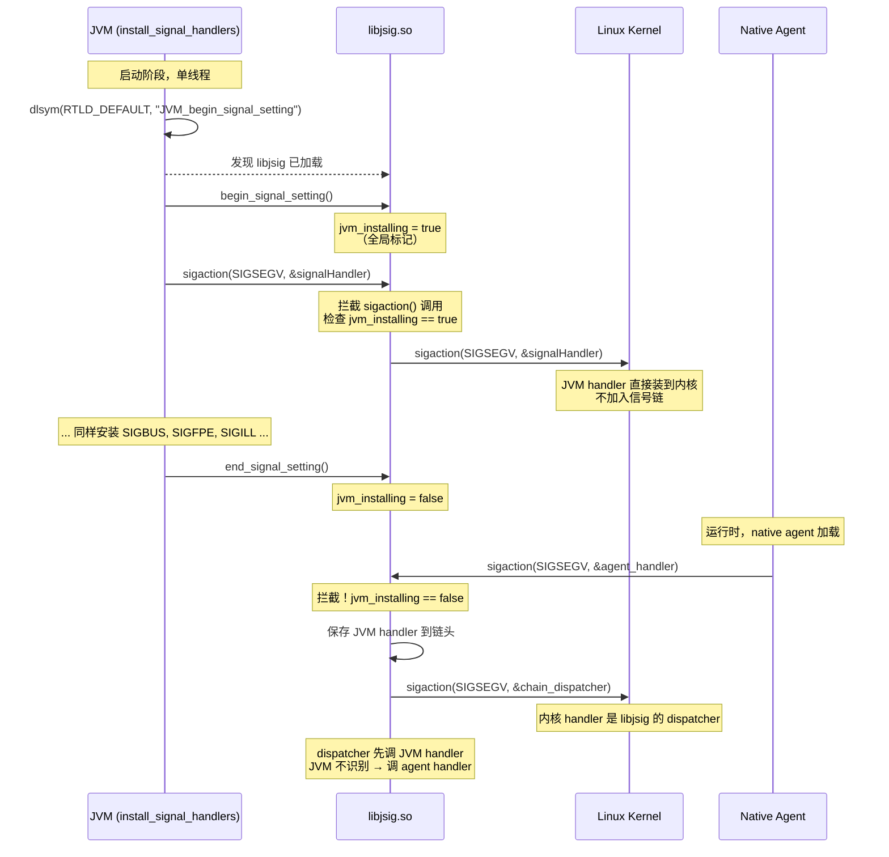

# 01-Signals — SIGSEGV 从 CPU 页故障到 JVM handler 分流的完整信号管线

> **阶段**：[11-os-layer]
> **前置**：[08-safepoint]（polling page + SIGSEGV）, [10-services-diag]（hs_err 信号安全）, [09-native-interface]（JNI FastGetField slowcase）
> **依赖本文**：[11-02]（线程的信号屏蔽字初始化）, [11-04]（crash 出口 = 信号路径末端的 report_and_die）
> **阅读收益**：理解 SIGSEGV 从 CPU 页故障到 JVM handler 分流的全路径——为什么同一个信号既是 safepoint 的协作机制又是崩溃的报警管道；掌握 libjsig.so 的信号链协议如何让 JVM 和 native agent 共享信号处理器而不冲突

---

## §〇 源文件清单（跨 os/linux + os_cpu/linux_x86 + os/posix + runtime）

| # | 文件 | 完整路径 | 模块 | 核心函数/类（行号） | 本文角色 |
|---|------|---------|------|-------------------|---------|
| 1 | `os_linux.cpp` | `src/hotspot/os/linux/os_linux.cpp` | os/linux | `signalHandler`(:5221), `set_signal_handler`(:5329), `libjsig_is_loaded`(:5234), `get_chained_signal_action`(:5240), `chained_handler`(:5301), `call_chained_handler`(:5255), `hotspot_sigmask`(:704) | ★★★ 信号安装全链路——sigaction + libjsig 协议 + 信号屏蔽字 |
| 2 | `os_linux_x86.cpp` | `src/hotspot/os_cpu/linux_x86/os_linux_x86.cpp` | os_cpu/linux_x86 | `JVM_handle_linux_signal`(:271) | ★★★ 核心分流——6 路信号分发逻辑 |
| 3 | `os_posix.cpp` | `src/hotspot/os/posix/os_posix.cpp` | os/posix | `save_preinstalled_handler`(:1727), `get_preinstalled_handler`(:1720) | ★ 信号链回退——预安装 handler 保存 |
| 4 | `os.cpp` | `src/hotspot/share/runtime/os.cpp` | runtime | `signal_thread_entry`(:346), SIGBREAK 触发 AttachListener | ★★ SIGBREAK 处理——AttachListener lazy init + thread dump |
| 5 | `globals.hpp` | `src/hotspot/share/runtime/globals.hpp` | runtime | `UseSignalChaining`(:900), `ReduceSignalUsage`(:883), `AllowUserSignalHandlers`(:896) | ★★ 标志控制——信号链开关 + 用户 handler 豁免 |
| 6 | `jniFastGetField.cpp` | `src/hotspot/share/prims/jniFastGetField.cpp` | prims | `JNI_FastGetField::find_slowcase_pc`(:32) | ★★ 信号作为控制流——FastGetField 的 SIGSEGV slowcase |
| 7 | `safepoint.cpp` | `src/hotspot/share/runtime/safepoint.cpp` | runtime | `SafepointSynchronize::handle_polling_page_exception`(:996), `ThreadSafepointState::handle_polling_page_exception`(:1211) | ★★ polling page 的 handler 末端 |
| 8 | `os.hpp` | `src/hotspot/share/runtime/os.hpp` | runtime | `os::is_poll_address`(:429) | ★ polling page 地址判定 |
| 9 | `vmError.cpp` | `src/hotspot/share/utilities/vmError.cpp` | utilities | `VMError::report_and_die`(:1307), STEP/BEGIN/END 宏(:419-422) | ★★ 信号管线末端——崩溃报告 |
| 10 | `ostream.cpp` | `src/hotspot/share/utilities/ostream.cpp` | utilities | `fdStream::write`(:604) | ★ AS-safe 输出——hs_err 的唯一写通道 |

**跨模块说明**：01-Signals 跨越 os/linux、os_cpu/linux_x86、os/posix、prims、runtime、utilities 六个模块。`os_linux_x86.cpp:271` 的 `JVM_handle_linux_signal` 是本阶段最关键的单函数——它被 01（信号分流）和 04（崩溃触发点）双重依赖。

---

### 凌晨 3 点的 SIGSEGV：从惊恐到理解

线上 JVM 崩溃了。你登录服务器，看到 hs_err 文件第一行：

```
#
# A fatal error has been detected by the Java Runtime Environment:
#
#  SIGSEGV (0xb) at pc=0x00007f8b1a3c4d21, pid=12463, tid=12494
```

你往下翻，想找崩溃线程栈——但是 `Native frames` 只有 1 帧，`Java frames` 全空，`Current thread` 显示的是 `VMThread` 而不是你的应用线程。更诡异的是：你在 `LD_PRELOAD=libjsig.so` 后面挂了一个第三方 native profiler agent——现在 profiler 的日志显示它收到了 SIGSEGV 但 JVM 没收到，profiler 的 handler 自己 abort 了。

发生了两件事。第一件：JVM 的信号处理器 `signalHandler` 和你的 profiler 的 `sigaction(SIGSEGV, ...)` 之间，有一个你不知道的"信号链（signal chaining）"协议在运行。libjsig.so 拦截了所有 `sigaction()` 调用，决定谁先收到信号。如果这条链搭错了——你的 profiler 吃掉了属于 JVM 的 polling page SIGSEGV（用于 safepoint 协调），结果 JVM 永远进不了 safepoint → 看起来像死锁 → 但实际上是信号链断裂。

第二件：你的 JNI 代码在 `_thread_in_native` 状态里收到了 SIGSEGV（用 Unsafe 写了一个已释放的 DirectByteBuffer）。你期望 JVM 打印 hs_err 崩溃——但 JVM 没有。你翻源码，发现 `JVM_handle_linux_signal()` 的 `_thread_in_native` 分支里，只有 `JNI_FastGetField::find_slowcase_pc()` 和 SIGBUS unsafe access 两条特殊路径——大部分 SIGSEGV 在 `_thread_in_native` 中直接走到末尾的 `chained_handler()` → 如果链上没有 handler → `report_and_die()`。但如果你的 agent 恰好注册了一个全局 SIGSEGV handler → 这个信号被它吃掉了 → JVM 静默。

**本文回答什么**：不是"Linux 信号是什么"——不讲 `sigset_t` 的类型定义、不讲 `SA_NODEFER` vs `SA_ONSTACK` 的内核差异。本文只关心：`signalHandler` → `JVM_handle_linux_signal` → 6 路分流 → `report_and_die` 的完整路径。`si_addr` + `thread_state` + `sig` 的组合怎么决定走哪条分路？为什么 StackOverflow 的 guard page SIGSEGV 优先于 implicit null check？libjsig 的 `begin_signal_setting`/`end_signal_setting` 两阶段协议为什么存在？

**和 [11-os-layer README](README.md) §五 的关系**：本文的"信号"是 OS 三原语（信号/线程/内存）的第一原语。读者读完本文后应在脑中将 [08-safepoint] 的 polling page 路径和 [10-services-diag] 的 report_and_die 路径连接为一根连续的信号管线。

---

## §一 ★★★ 信号从 CPU 陷阱到 JVM handler 的完整路径

### 1.1 物理链路：CPU → 内核 → signalHandler

> **你需要知道的内核知识**：VMA (Virtual Memory Area) 是内核为每个 mmap/mprotect 调用维护的地址范围描述符，记录起始地址、长度、访问权限。每个进程的地址空间由多个 VMA 组成——你可以在 /proc/PID/maps 中看到它们。PROT_READ/PROT_WRITE/PROT_EXEC 是 mmap 时指定的页级权限位。当 CPU 访问一个地址触发 page fault，内核的 do_page_fault() 遍历该进程的 VMA 链表：如果地址不在任何 VMA 中 → 发送 SIGSEGV with si_code=SEGV_MAPERR（访问了未映射地址）；如果在 VMA 中但当前访问类型不被允许（如写入 PROT_READ 页）→ SEGV_ACCERR。force_sig_info() 是内核向用户进程投递信号的内部函数，而 si_addr 字段就是触发 fault 的那个地址——JVM 用它判断是 NPE（si_addr < page_size）还是真正的内存错误。

```
CPU MMU Page Fault
  │  TLB miss → page table walk → 页不存在或权限不足
  ▼
内核 do_page_fault()
  │  handle_mm_fault() 判断：是否合法 VMA？是否有 PROT 权限？
  │  如果非法 → force_sig_info(SIGSEGV, SEGV_MAPERR, addr)
  ▼
内核 arch_do_signal()
  │  setup_rt_frame() → 在用户栈上压入 ucontext_t + siginfo_t
  │  修改 RIP 指向信号处理器的入口（sa_sigaction）
  ▼
用户态 signalHandler(int sig, siginfo_t *info, void *uc)
  │  uc 指向 ucontext_t（包含所有 GP 寄存器 + FPU 状态）
  │  info->si_addr = 故障地址，info->si_code = 故障原因
  │  这就是 JVM 唯一的信号入口
  ▼
JVM_handle_linux_signal(sig, info, uc, true)
  │  abort_if_unrecognized=true → "处理不了就 crash"
  ▼
6 路分流 → stub 跳转 / 异常抛出 / chained handler / report_and_die
```

### 1.2 signalHandler 包装——为什么保存/恢复 errno？

`os_linux.cpp:5221-5226`：

```cpp
static void signalHandler(int sig, siginfo_t *info, void *uc) {
    assert(info != NULL && uc != NULL, "it must be old kernel");
    int orig_errno = errno;  // ★ Preserve errno value over signal handler.
    JVM_handle_linux_signal(sig, info, uc, true);
    errno = orig_errno;
}
```

**signalHandler 有三个不为人知的角色**：

**(1) 唯一入口**：`set_signal_handler` 把 `signalHandler` 安装为所有 JVM 信号的 `sa_sigaction`。也就是说，SIGSEGV、SIGBUS、SIGFPE、SIGILL、SIGPIPE、SIGXFSZ——六个信号都从这同一个函数进入。没有"信号类型→专用 handler"的分发——分发在 `JVM_handle_linux_signal` 内部完成。

**(2) errno 的保存/恢复**：`JVM_handle_linux_signal` 内部可能调用任何函数——比如 `write()` 到 inst log buffer 会设置 errno。如果 `signalHandler` 不保存/恢复 errno → 被中断的正常代码看到"随机"的 errno 值 → 诡异的"resource temporarily unavailable"误报。

**errno 保存有意义 vs 无意义对照表**：

| 分流路径 | 是否返回 normal code  | errno 保存有意义？ | 原因 |
|---------|----------------------|-------------------|------|
| polling page (safepoint) | ✅ return true → 返回被中断代码 | ✅ 有意义 | polling 之后线程继续执行 |
| implicit null (NPE) | ✅ return true → 返回被中断代码 | ✅ 有意义 | 修改 PC 跳转 stub 抛 NPE |
| StackOverflow (yellow) | ✅ return true | ✅ 有意义 | 抛 StackOverflowError 后继续 |
| JNI FastGetField slowcase | ✅ return true | ✅ 有意义 | 修改 PC 跳转 slowcase stub |
| SIGPIPE / SIGXFSZ | ✅ return true | ✅ 有意义 | 忽略信号返回 |
| StackOverflow (red zone) → fatal | ❌ 永不返回 | ❌ 无意义 | fatal → report_and_die → abort |
| crash (unrecognized) | ❌ 永不返回 | ❌ 无意义 | report_and_die → abort |

**(3) `abort_if_unrecognized=true`**：`signalHandler` 硬编码传 `true` —— 这是"最后的防线"。如果 JVM 无法识别这个信号 → 直接崩溃。第三方通过 `os::Linux::signal_handlers_are_installed` 门禁后转发信号时可能传 false —— 允许"试一下 JVM 能不能处理，不能就算了"的模式。

### 1.3 signal_handlers_are_installed 的门禁作用

`os_linux.cpp:5231`：

```cpp
bool os::Linux::signal_handlers_are_installed = false;
```

在 `JVM_handle_linux_signal` 的线程识别逻辑中（`os_linux_x86.cpp:328-340`）：

```cpp
JavaThread* thread = NULL;
VMThread* vmthread = NULL;
if (os::Linux::signal_handlers_are_installed) {
    if (t != NULL ){
        if(t->is_Java_thread()) {
            thread = (JavaThread*)t;
        }
        else if(t->is_VM_thread()){
            vmthread = (VMThread *)t;
        }
    }
}
```

`Thread::current()` 依赖 OSThread TLS → 但 TLS 只在 JVM 初始化后才有效。初始启动阶段（比如在 `os::init()` 调用 sigaction 安装 handler 的过程中），如果信号到达 → `JVM_handle_linux_signal` 不能安全调用 `Thread::current()` → `signal_handlers_are_installed` 为 false 时 `thread` 和 `vmthread` 均为 NULL → 整个分流逻辑的主体被跳过 → 直接走到 chained_handler / report_and_die。

`install_signal_handlers()` 在 `os_linux.cpp:5416` 将其设为 true：
```cpp
if (!signal_handlers_are_installed) {
    signal_handlers_are_installed = true;
```

外部代码可以通过吗？JVMTI agent 可以通过 `os::Linux::set_signal_handler` 间接触发再安装。但恶意代码直接 `sigaction()` 绕过 JVM → `signal_handlers_are_installed` 保护不了——这是内核层面的问题，不在 JVM 控制范围内。

---

## §二 ★★★ JVM_handle_linux_signal 的 6 路分流逻辑

### 2.1 完整决策树

`os_linux_x86.cpp:271-660`。信号分流的本质是 **`sig` × `thread_state` × `si_addr` × `pc`** 的四维决策矩阵。以下是经过源码验证的完整决策树：

```
JVM_handle_linux_signal(sig, info, uc, abort_if_unrecognized)
  │
  ├─[L309-317] SIGPIPE 或 SIGXFSZ?
  │   └─ chained_handler() → 有链? 委托成功返回 true
  │   └─ 无链? 忽略(return true)                      ★ BRANCH 1: 忽略信号
  │
  ├─[L343-349] SafeFetch 故障?
  │   └─ StubRoutines::is_safefetch_fault(pc) → 重定向PC
  │       → ucontext_set_pc(uc, continuation_for_safefetch_fault(pc))
  │
  ├─[L380-446] sig==SIGSEGV && si_addr 在栈中?
  │   ├─ in_stack_yellow_reserved_zone:                ★ BRANCH 2: 栈溢出
  │   │   ├─ in_stack_reserved_zone + _thread_in_Java + annotated method
  │   │   │   → 继续执行(保留 annotation 预留栈)
  │   │   ├─ reserved_zone but no annotation → StackOverflowError stub
  │   │   └─ yellow_zone → disable yellow → StackOverflowError stub
  │   ├─ in_stack_red_zone: → FATAL (no recovery)
  │   └─ MAP_GROWSDOWN expansion zone:
  │       └─ manually_expand_stack() → 成功返回 true / 失败 fatal
  │
  ├─[L448-451] AVX cpuinfo segv? → stub = VM_Version::cpuinfo_cont_addr()
  │
  ├─[L453-516] thread_state == _thread_in_Java?
  │   ├─[L457-459] sig==SIGSEGV && is_poll_address(si_addr)  ★ BRANCH 3: safepoint
  │   │   └─ stub = SharedRuntime::get_poll_stub(pc)
  │   ├─[L460-471] sig==SIGBUS                          ★ BRANCH 4: MappedByteBuffer
  │   │   └─ nm->has_unsafe_access()?
  │   │       → stub = SharedRuntime::handle_unsafe_access(thread, next_pc)
  │   ├─[L474-510] sig==SIGFPE && si_code==FPE_INTDIV/FPE_FLTDIV
  │   │   └─ stub = SharedRuntime::continuation_for_implicit_exception(
  │   │               thread, pc, IMPLICIT_DIVIDE_BY_ZERO)
  │   └─[L511-516] sig==SIGSEGV && !needs_explicit_null_check(si_addr)
  │       └─ stub = SharedRuntime::continuation_for_implicit_exception(
  │                   thread, pc, IMPLICIT_NULL)        ★ BRANCH 5: implicit NPE
  │
  ├─[L517-523] thread_state==_thread_in_vm && sig==SIGBUS
  │   └─ thread->doing_unsafe_access()?
  │       → stub = SharedRuntime::handle_unsafe_access(...)
  │
  ├─[L527-533] JNI_FastGetField slowcase?
  │   └─ JNI_FastGetField::find_slowcase_pc(pc) != -1? ★ BRANCH 6: FastGetField
  │       → stub = slowcase_entry
  │
  ├─[L539-545] is_memory_serialize_page(thread, si_addr)?
  │   └─ block_on_serialize_page_trap() → return true
  │
  ├─[L622-629] stub != NULL?
  │   └─ thread->set_saved_exception_pc(pc)
  │   └─ ucontext_set_pc(uc, stub) → return true
  │
  ├─[L631-636] chained_handler(sig, info, ucVoid)?
  │   └─ 返回 true(链上 handler 处理了)
  │
  └─[L638-659] abort_if_unrecognized?
      ├─ false → return false(信号没人处理)
      └─ true → sigprocmask(unblock_sig) → VMError::report_and_die(...) → abort
```

### 2.2 ★ 信号分流决策表

| # | 信号 | thread_state | si_addr 条件 | pc 条件 | 处理方式 | 行号 |
|---|------|-------------|-------------|---------|---------|------|
| 1 | SIGPIPE/SIGXFSZ | 任意 | 任意 | 任意 | 尝试 chained_handler，失败则忽略 | 309-317 |
| 2 | SIGSEGV | 任意 | 在栈 yellow zone | — | disable yellow + StackOverflowError stub | 380-440 |
| 2a | SIGSEGV | _thread_in_Java | 在栈 reserved zone | annotated method | 继续执行（保留预留栈） | 401-412 |
| 2b | SIGSEGV | 任意 | 在栈 red zone | — | FATAL（不可恢复） | 418-424 |
| 2c | SIGSEGV | 任意 | 在栈扩展区 | — | manually_expand_stack() | 426-441 |
| 3 | SIGSEGV | _thread_in_Java | polling page 范围 | — | SafepointBlob stub | 457-459 |
| 4 | SIGBUS | _thread_in_Java | — | in compiled method with unsafe_access | handle_unsafe_access stub | 460-471 |
| 5 | SIGFPE | _thread_in_Java | — | — (si_code == INTDIV/FLTDIV) | IMPLICIT_DIVIDE_BY_ZERO stub | 474-510 |
| 6 | SIGSEGV | _thread_in_Java | 零页附近 (< 64KB) | — (needs_explicit_null==false) | IMPLICIT_NULL stub → NPE | 511-516 |
| 7 | SIGBUS | _thread_in_vm | — | doing_unsafe_access() | handle_unsafe_access stub | 517-523 |
| 8 | SIGSEGV/SIGBUS | 任意 | — | pc ∈ FastGetField speculative_pc list | slowcase_entry stub | 527-533 |
| 9 | 不能识别 | 任意 | — | — | chained_handler → report_and_die | 631-659 |

### 2.3 ★ 栈溢出检测为什么优先于 implicit null？

`os_linux_x86.cpp:380-446`（栈检测）→ `512-516`（implicit null）。顺序不是巧合——是设计：

```
栈检测的 si_addr 条件: thread->on_local_stack(addr)
  → 检查 addr 是否在 [stack_bottom, stack_base] 之间

implicit null 的 si_addr 条件: info->si_addr < 64KB (zero page)
```

**关键冲突**：如果 guard page 恰好落在零页附近（栈底非常接近虚拟地址 0x0）→ 同一个 SIGSEGV 同时满足"在栈中"和"在零页附近"两个条件。

**如果先检查 null** → `implicit_null` 路径 → 抛 `NullPointerException` → StackOverflowError 变成 NullPointerException → 用户完全无法理解为什么 `void foo(int x)` 的入参 `x=5` 抛出 NullPointerException。

**正确行为（当前代码）**：栈检测优先 → 在 `on_local_stack(addr)` 的 `if` 分支中 `return` → 永远不会到达 implicit null 检查。

### 2.4 ★ SIGBUS 的 _thread_in_Java vs _thread_in_vm 双分支

`os_linux_x86.cpp:460-471`(Java) vs `517-523`(VM)：

**Java 线程 SIGBUS**：MappedByteBuffer 场景。底层 `mmap` 文件被截断 → 访问已失效的映射 → 内核发 SIGBUS (BUS_ADRERR)。JVM 检查 `si_code == BUS_ADRERR` → 如果 pc 在 compiled method 中且 method 有 `unsafe_access` 标志 → 跳转 `handle_unsafe_access` stub → 在 Java 层抛 `InternalError`。

```cpp
if (sig == SIGBUS) {
    CodeBlob* cb = CodeCache::find_blob_unsafe(pc);
    CompiledMethod* nm = (cb != NULL) ? cb->as_compiled_method_or_null() : NULL;
    if (nm != NULL && nm->has_unsafe_access()) {
        address next_pc = Assembler::locate_next_instruction(pc);
        stub = SharedRuntime::handle_unsafe_access(thread, next_pc);
    }
}
```

**VM 线程 SIGBUS**：VM 代码中 Unsafe 访问（如 GC copying 过程中访问了坏对象引用）。检查 `thread->doing_unsafe_access()` → 跳转 unsafe access handler。

这两种场景有本质不同：Java 线程的 SIGBUS 主要是外部文件系统问题（文件截断），VM 线程的 SIGBUS 是 JVM 内部 bug。另外，`si_code` 的差异也重要：`BUS_ADRALN`（未对齐访问）不会匹配行 460 的检查（那里匹配 `BUS_ADRERR`）→ 直接走到 `report_and_die` —— 正确行为。

### 2.5 ★ JNI FastGetField 的 SIGSEGV slowcase——信号作为控制流跳转

`jniFastGetField.cpp:32-38`：

```cpp
address JNI_FastGetField::find_slowcase_pc(address pc) {
    for (int i=0; i<count; i++) {
        if (speculative_load_pclist[i] == pc) {
            return slowcase_entry_pclist[i];
        }
    }
    return (address)-1;
}
```

JNI `Get<Primitive>Field` 有两条路径：fast path（一条汇编 stub，无 safepoint 检查，直接读字段值）和 slow path（走完整 JNI + Handle + safepoint 检查）。

**正常情况**：fast path 直接读字段 → 约 10 cycles → 返回。

**异常情况**：如果字段在 memory serialize page 上（G1 barrier 期间标记为不可读）→ fast path 的 `mov (%rdi), %eax` 触发 SIGSEGV → pc 落在 fast path stub 的已知地址范围（`speculative_load_pclist`）→ `JVM_handle_linux_signal` 调用 `JNI_FastGetField::find_slowcase_pc(pc)` → 返回 slowcase 入口地址 → 修改 ucontext 中的 PC 寄存器 → 信号返回后线程跳到 slowcase → 走完整 JNI 路径。

为什么不是信号 handler 直接完成字段读取？→ 信号上下文中不能持有锁、不能分配 Handle → 必须"跳回正常代码"执行——修改 PC 是最干净的方案。

---

## §三 ★★★ libjsig.so 信号链的完整协议

### 3.1 dlsym 发现过程：如何知道 libjsig 已加载？

`os_linux.cpp:5427-5440`：

```cpp
typedef void (*signal_setting_t)();
signal_setting_t begin_signal_setting = NULL;
signal_setting_t end_signal_setting = NULL;
get_signal_t get_signal_action = NULL;

begin_signal_setting = CAST_TO_FN_PTR(signal_setting_t,
                       dlsym(RTLD_DEFAULT, "JVM_begin_signal_setting"));
if (begin_signal_setting != NULL) {
    end_signal_setting = CAST_TO_FN_PTR(signal_setting_t,
                         dlsym(RTLD_DEFAULT, "JVM_end_signal_setting"));
    get_signal_action = CAST_TO_FN_PTR(get_signal_t,
                        dlsym(RTLD_DEFAULT, "JVM_get_signal_action"));
    libjsig_is_loaded = true;
}
```

`dlsym(RTLD_DEFAULT, ...)` 在全局符号空间中搜索 `JVM_begin_signal_setting` —— 如果 libjsig.so 通过 `LD_PRELOAD` 注入 → 这个符号存在 → `libjsig_is_loaded = true` → 之后所有 `sigaction` 调用都会经过 libjsig 的 chain 管理。

libjsig.so 不是 JVM 的 .cpp 文件——它是独立编译的动态库，通过 `LD_PRELOAD` 拦截了 glibc 的 `sigaction()`。libjsig 导出的三个符号：
- `JVM_begin_signal_setting()`: 标记"JVM 正在安装 handler，请直接装到内核，不要加入链"
- `JVM_end_signal_setting()`: 移除标记
- `JVM_get_signal_action(int sig)`: 返回链上该信号的下一个 handler（非 JVM 的）

### 3.2 ★ libjsig 4 步时序：begin → sigaction → end → 链管理



**两阶段协议的核心逻辑**：

```
JVM 装 handler 时 (begin→end 区间):
  JVM handler 必须直接装到内核——不能插入链中
  （因为 JVM handler 本身就是链的第一个节点）

agent 装 handler 时 (end 之后):
  agent handler 被 libjsig 拦截 → 加入链的后端
  内核 handler 被替换为 libjsig 的 chain dispatcher
  chain dispatcher = 先调 JVM handler → 不识别 → 调 agent handler
```

`jvm_installing` 是一个全局标记。如果两个 JVM 线程同时调 sigaction（一个在设置 SIGSEGV，另一个在设置 SIGBUS）→ 会不会竞态？**当前代码避免了这个问题**：`install_signal_handlers()` 在 `os::init()` 的启动阶段被调用——此时只有主线程在运行，不存在并发线程。

### 3.3 chained_handler 的委托逻辑

`os_linux.cpp:5301-5312`：

```cpp
bool os::Linux::chained_handler(int sig, siginfo_t *siginfo, void *context) {
    bool chained = false;
    if (UseSignalChaining) {
        struct sigaction *actp = get_chained_signal_action(sig);
        if (actp != NULL) {
            chained = call_chained_handler(actp, sig, siginfo, context);
        }
    }
    return chained;
}
```

**两步查询**：
1. `get_chained_signal_action(sig)` (`os_linux.cpp:5240-5253`)：
   - 优先查 libjsig 的 `get_signal_action` 函数指针 → 如果 libjsig 维护了链 → 从链上取下一个 handler
   - 如果 libjsig 没有（未加载）→ 回退到 `os::Posix::get_preinstalled_handler` → JVM 自己保存的"安装前已存在的 handler"
2. `call_chained_handler(actp, sig, siginfo, context)` (`os_linux.cpp:5255-5299`)：
   - 检查 sa_flags 决定是调 `sa_handler`(sig) 还是 `sa_sigaction`(sig, info, context)
   - 根据 SA_NODEFER 标识是否自动阻塞信号
   - 根据 SA_RESETHAND 标识是否做 one-shot 复位
   - 执行这个 handler → 如果它返回了 → JVM 继续（说明链上 handler 处理不了）→ 最终 `report_and_die`

### 3.4 无 libjsig 时的危险场景——native agent 覆盖 JVM handler

如果 libjsig 未加载（没有 `LD_PRELOAD=libjsig.so`），`set_signal_handler` 直接调用内核的 `sigaction()` —— 没有信号链。后续 native agent 也调用 `sigaction(SIGSEGV)` → 内核用新 handler 覆盖 JVM 的 `signalHandler` → JVM 永远收不到 SIGSEGV。

**后果**：
- polling page 失效 → 没有任何线程触发 safepoint → JVM hang
- implicit null check 失效 → NPE 变成 SIGSEGV crash
- StackOverflow guard page SIGSEGV 被 agent 吃掉 → 真正的栈溢出不被检测 → 写坏邻居内存
- 所有 _thread_in_Java 的 SIGSEGV 分流失效

**为什么 `AllowUserSignalHandlers` 不能解决这个问题**？因为它只决定 JVM 安装 handler 时的行为（跳过安装 vs 链式委托）——不保护已安装 handler 不被后续覆盖。

---

## §四 ★★ set_signal_handler 的 3 种安装决策

### 4.1 3 路径：跳过 vs 链式 vs fatal

`os_linux.cpp:5329-5408`：

```
set_signal_handler(sig, set_installed=True)
  │
  ├─ 先读当前 handler (sigaction(sig, NULL, &oldAct))
  │
  ├─ oldhand != SIG_DFL && oldhand != SIG_IGN && oldhand != signalHandler?
  │   ├─ AllowUserSignalHandlers || !set_installed?
  │   │   └─ ★ 路径 1: 跳过 — "用户自己管理这个信号"
  │   │       return; (不安装 JVM handler)
  │   ├─ UseSignalChaining?
  │   │   └─ ★ 路径 2: 链式 — 保存 old handler 到 preinstalled_handler[]
  │   │       os::Posix::save_preinstalled_handler(sig, oldAct);
  │   └─ else
  │       └─ ★ 路径 3: FATAL — 拒绝启动
  │           fatal("Encountered unexpected pre-existing sigaction handler %#lx...")
  │
  └─ oldhand == SIG_DFL/SIG_IGN/signalHandler
      └─ 正常安装: sigAct.sa_sigaction = signalHandler
                      sigAct.sa_flags = SA_SIGINFO|SA_RESTART
```

**路径 1（跳过）**：ASAN、TSAN 等地址消毒器独占信号，不加入链。通过 `-XX:+AllowUserSignalHandlers` 或 `set_installed=false` 触发。

**路径 2（链式）**：保存 old handler → 以后 JVM handler 不能识别信号时委托给它。通过 `-XX:+UseSignalChaining`（默认 true）触发。

**路径 3（fatal）**：出现意料之外的预安装 handler → JVM 拒绝启动——因为不知道该 handler 的行为（可能吃信号不转发 → 死锁 JVM）。

### 4.2 SIGPIPE / SIGXFSZ 特殊处理

`os_linux_x86.cpp:309-317`：

```cpp
if (sig == SIGPIPE || sig == SIGXFSZ) {
    if (os::Linux::chained_handler(sig, info, ucVoid)) {
        return true;
    } else {
        return true;  // Ignoring - see bugs 4229104 or 6499219
    }
}
```

这两个信号极其频繁但无信息量——SIGPIPE 在写关闭的 pipe/socket 时发生，SIGXFSZ 在写超出文件大小限制时发生。信号处理器中如果对它们做完整分流 → 日志爆炸。JVM 给它们最简单的路径：先尝试链式委托 → 不行就 return true（忽略）——**即使 `abort_if_unrecognized=true`**，这两个信号也永远不会走到 `report_and_die`。它们在分流树的**最顶端**就返回了。

### 4.3 ReduceSignalUsage 信号控制

`globals.hpp:883`：`-XX:+ReduceSignalUsage` — 默认 false。

如果开启 → `hotspot_sigmask` 中不区分 VMThread/非VMThread 的信号屏蔽字（`os_linux.cpp:718`）。同时 `install_signal_handlers` 中不安装 SHUTDOWN1/2/3_SIGNAL 和 BREAK_SIGNAL 的用户态 handler——让内核默认行为生效（行 5467-5495）：

```
安装列表（信号注册表）：
  signal(SHUTDOWN1_SIGNAL, ...)  ← 除非 ReduceSignalUsage
  signal(SHUTDOWN2_SIGNAL, ...)  ← 除非 ReduceSignalUsage
  signal(SHUTDOWN3_SIGNAL, ...)  ← 除非 ReduceSignalUsage
  signal(BREAK_SIGNAL, ...)      ← 除非 ReduceSignalUsage
  set_signal_handler(SIGSEGV)
  set_signal_handler(SIGPIPE)
  set_signal_handler(SIGBUS)
  set_signal_handler(SIGILL)
  set_signal_handler(SIGFPE)
  set_signal_handler(SIGXFSZ)
  set_signal_handler(SIGTRAP)    ← 只设 SA_SIGINFO 标志，不装 handler
```

`BREAK_SIGNAL (=SIGQUIT)` 的特殊之处：它触发 AttachListener lazy init（`signal_thread_entry` 中）。如果 `ReduceSignalUsage` → AttachListener 只能走套接字连接触发，不能走 SIGQUIT → `jcmd`/`jstack` 依赖 SIGQUIT 触发 thread dump 时会静默失败。

---

## §五 ★★ hotspot_sigmask —— 信号屏蔽字的 per-thread 设置

### 5.1 unblocked_sigs vs vm_sigs 两个信号集

`os_linux.cpp:585-590, 704-734`：

```cpp
static sigset_t unblocked_sigs;  // SIGILL, SIGSEGV, SIGBUS, SIGFPE, SR_signum, SHUTDOWN signals
static sigset_t vm_sigs;         // BREAK_SIGNAL (= SIGQUIT)

void os::Linux::hotspot_sigmask(Thread *thread) {
    sigset_t caller_sigmask;
    pthread_sigmask(SIG_BLOCK, NULL, &caller_sigmask);  // 保存调用者的屏蔽字
    osthread->set_caller_sigmask(caller_sigmask);       // 以备后续恢复

    pthread_sigmask(SIG_UNBLOCK, os::Linux::unblocked_signals(), NULL);  // 解禁 JVM 内部信号

    if (!ReduceSignalUsage) {
        if (thread->is_VM_thread()) {
            pthread_sigmask(SIG_UNBLOCK, vm_signals(), NULL);  // VMThread: 解禁 BREAK_SIGNAL
        } else {
            pthread_sigmask(SIG_BLOCK, vm_signals(), NULL);    // 其他线程: 阻塞 BREAK_SIGNAL
        }
    }
}
```

**为什么 pthread_create 不继承屏蔽字**：fork 继承父线程屏蔽字，但 pthread_create 不继承——新线程从 glibc 的默认屏蔽字开始（通常全解禁）。JVM 必须显式设置。

**为什么只有 VMThread 解禁 BREAK_SIGNAL**：`SIGQUIT` 触发 thread dump —— 应该由 VMThread 统一处理（通过 `os::signal_wait()` → `signal_thread_entry`）。如果所有线程都响应 → 输出乱序 + 不需要的全栈打印。

### 5.2 两个调用点

`os_linux.cpp:924`（`thread_native_entry` — 新创建的线程）和 `os_linux.cpp:1177`（`create_attached_thread` — JNI 附加的线程）。详见 [11-02-Threads] §三。

---

## §六 ★ 和 [08-safepoint] + [10-services-diag] + [09-native] 的交叉连接

### 6.1 [08-safepoint] polling page 路径——最短路径 vs 最长安全路径对偶

```
                    ┌─────────── 信号安全的两种极端 ───────────┐
                    │                                          │
      "最短路径"    │                                          │  "最长安全路径"
                    │                                          │
    [08-safepoint]  │        AS-safe 约束相同:                  │  [04-VMError]
    SafepointBlob   │  不能 malloc、不能持有锁、                  │  hs_err
    信号处理器:      │  不能 fprintf、不能 fork                   │  报告
                    │                                          │
    改 1 个 PC:     │      ←──── 输出量 ────→                  │  输出 2000 行:
    ucontext_set_pc │                                          │  - 线程栈
    (uc, stub)      │                                          │  - native 栈
                    │                                          │  - /proc/self/maps
    然后返回        │                                          │  - 环境变量
                    │                                          │
    ~10 cycles      │      ←──── 时间 ────→                    │  ~2 minutes (max)
```

**精确连接**：`JVM_handle_linux_signal:457-459`：

```cpp
if (sig == SIGSEGV && os::is_poll_address((address)info->si_addr)) {
    stub = SharedRuntime::get_poll_stub(pc);
}
```

`os::is_poll_address` (`os.hpp:429`) 检查 `si_addr` 是否在 `[_polling_page, _polling_page + page_size)` 范围内。`get_poll_stub(pc)` 返回 `SafepointBlob` 的入口地址 → 修改 PC 后线程跳转到 safepoint handling code → `SafepointSynchronize::handle_polling_page_exception` (`safepoint.cpp:996`) → `ThreadSafepointState::handle_polling_page_exception` (`safepoint.cpp:1211`)。

这就是 08 讲的"polling page 怎么用 SIGSEGV 实现协作"——本文填补了从 mprotect → SIGSEGV → signalHandler → JVM_handle_linux_signal → 分流到 polling page 分支的"信号部分"。

### 6.2 [10-services-diag] report_and_die——"最长安全路径"的信号上下文约束

**精确连接**：`JVM_handle_linux_signal:638-659`（信号管线的末端）：

```cpp
if (!abort_if_unrecognized) {
    return false;
}
sigset_t newset;
sigemptyset(&newset);
sigaddset(&newset, sig);
sigprocmask(SIG_UNBLOCK, &newset, NULL);
VMError::report_and_die(t, sig, pc, info, ucVoid);
```

在调用 `report_and_die` 前，先 `sigprocmask(SIG_UNBLOCK)` —— 这是因为 signalHandler 被调用时内核自动屏蔽了当前信号（通过 SA_NODEFER）。如果在 report_and_die 过程中再次发生相同信号 → sentinel 标记已设置信号被屏蔽 → secondary crash → os::die()。

10-04 的 `VMError::report_and_die` 用 `fdStream::write`（`ostream.cpp:604` → `::write()`) 代替 `fprintf`。本文解释这个约束的根源——`signalHandler` 在线程栈上被中断，上下文是信号上下文，不能用锁、不能 malloc。

`signalHandler` 用 `int orig_errno = errno`（保存单变量），`VMError::report_and_die` 用 `static char buffer[O_BUFLEN]` + `::write()`（全套 AS-safe 输出）——两个尺度，同一约束。

### 6.3 [09-native] JNI FastGetField——"信号作为控制流"

正常路径无信号（fast path → ~10 cycles）。只在 memory serialize page 保护时触发 SIGSEGV → handler 改 PC 跳转 slowcase。这是"信号作为控制流机制"的经典案例——类比 user-level 的 page fault handling。

详见 §二.5。

### 6.4 ★ 11-os-layer README §五 阶段对比表

本文的"信号"是 11 阶段 OS 三原语的第一原语。从对比表看：
- 09 讲 JNI 线程状态转换，11 讲信号本身是 JVM 的"primitive 事件源"
- 08 讲 safepoint 的 mprotect 设计，11 讲这个设计如何通过信号层实现
- 10 讲 hs_err 的输出电路，11 讲输出电路的电源——信号上下文

---

## §七 GDB 验证 + 可证伪断言

### 断言 1：`signalHandler` 是所有 JVM 信号的唯一入口

```bash
(gdb) br os_linux.cpp:5221
# 发送 kill -SEGV <pid>
# 预期: GDB 在 signalHandler 中断
# 调用栈底部是 __restore_rt（内核信号 return frame），无其他 JVM 函数包装
(gdb) bt
# __restore_rt ← 内核信号返回例程
# signalHandler ← 用户态唯一入口
```

### 断言 2：`signalHandler` 传入 `abort_if_unrecognized=true`

```bash
(gdb) br os_linux.cpp:5224
# 预期: 第四个参数 = 1 (true)
(gdb) p/d $ecx
# x86_64 calling convention: 第4参数在 %rcx
# 预期值: 1
```

### 断言 3：polling page SIGSEGV 在 `JVM_handle_linux_signal:457` 被识别

```bash
(gdb) br os_linux_x86.cpp:457
# 触发 polling page 访问（如等待 GC 期间）
(gdb) p os::is_poll_address((address)info->si_addr)
# 预期: true
# 断点命中 → 进入 handle_polling_page_exception，不走到 report_and_die
```

### 断言 4：implicit null check SIGSEGV 在 `JVM_handle_linux_signal:511` 被识别

```bash
(gdb) br os_linux_x86.cpp:511
# 故意触发 NPE（如 ((Object)null).hashCode()）
(gdb) p info->si_addr
# 预期: 值在零页附近（如 0x0000000000000004）
(gdb) p needs_explicit_null_check((intptr_t)info->si_addr)
# 预期: false → 进入 IMPLICIT_NULL stub
```

### 断言 5：StackOverflow SIGSEGV 先于 implicit null 被检查

```bash
(gdb) br os_linux_x86.cpp:380   # 栈检测入口
(gdb) br os_linux_x86.cpp:511   # implicit null 检查
# 触发 StackOverflow（深度递归）
# 断点 L380 命中
# 预期: 断点 L511 不命中（栈检测先处理了 SIGSEGV）
```

### 断言 6：libjsig 的 `dlsym` 发现 `JVM_begin_signal_setting`

```bash
$ LD_PRELOAD=/path/to/libjsig.so java ...
(gdb) br os_linux.cpp:5431
# 断点命中 → stepi 进入 dlsym
(gdb) p begin_signal_setting
# 预期: != NULL（ld.so 找到了 libjsig 的符号）
(gdb) p libjsig_is_loaded
# 预期: 变为 true
```

### 断言 7：`chained_handler` 在 JVM 无法识别信号时被调用

```bash
(gdb) br os_linux.cpp:5301  # chained_handler 开头
# 发送 JVM 不识别的信号（如 kill -USR1 <pid>）
# 预期: 断点命中
(gdb) p UseSignalChaining
# 预期: true（默认值）
# 链上有 handler → 调用它；链上无 handler → 回到 JVM_handle_linux_signal
# → report_and_die
```

### 断言 8：`call_chained_handler` 正确调用链上 handler

```bash
(gdb) br os_linux.cpp:5255  # call_chained_handler 开头
(gdb) p actp->sa_sigaction
# 预期: 非 NULL（存在链上 handler）
# stepi 单步进入：
(gdb) bt
# 进入链上 handler 代码，无 JVM 帧
# handler 返回 → JVM 继续判断
```

### 断言 9：只有 VMThread 解禁 BREAK_SIGNAL

```bash
(gdb) br os_linux.cpp:720  # is_VM_thread 检查
# 在 VMThread 中触发：
(gdb) p thread->is_VM_thread()
# 预期: true → 进入 SIG_UNBLOCK 分支
# 在 JavaThread 中触发：
(gdb) p thread->is_VM_thread()
# 预期: false → 进入 SIG_BLOCK 分支
```

### 断言 10：SIGBREAK 触发 AttachListener lazy init

```bash
(gdb) br os.cpp:362  # signal_thread_entry 中 SIGBREAK 分支
# kill -QUIT <pid>
# 预期: 断点命中
(gdb) p AttachListener::transit_state(AL_INITIALIZING, AL_NOT_INITIALIZED)
# 预期: 如果 AttachListener 未初始化 → AL_NOT_INITIALIZED 返回值
# 然后触发 AttachListener::is_init_trigger()
```

### 断言 11：JVM_handle_linux_signal 末尾触发 `report_and_die`

```bash
(gdb) br os_linux_x86.cpp:656  # report_and_die 调用处
# 故意触发无法处理的 SIGSEGV（如 *(volatile int*)0xdeadbeef = 0）
# 预期: 断点命中
(gdb) p sig
# 预期: 11 (SIGSEGV)
(gdb) n
# 进入 VMError::report_and_die() → 生成 hs_err 文件
```

### 断言 12：errno 保存/恢复在 polling page 路径中有意义

```bash
(gdb) br os_linux.cpp:5222  # int orig_errno = errno
# 触发 polling page SIGSEGV
(gdb) p errno
# 预期: 记录被中断代码的 errno
# continue → signalHandler 返回 → errno 被恢复
(gdb) br os_linux.cpp:5225  # errno = orig_errno
# 预期: 断点命中，errno 被恢复为保存值
```

---

## 核心发现总结

| # | 发现 | 核心洞察 |
|---|------|--------|
| 1 | **signalHandler 是六个信号的唯一入口** | SIGSEGV/SIGBUS/SIGFPE/SIGILL/SIGPIPE/SIGXFSZ 都从 `signalHandler`(:5221) 进入——没有"信号类型→专用 handler"的内核级分发 |
| 2 | **errno 保存在 6 条分路中 3 条有意义** | polling/implicit null/StackOverflow 路径 return true → errno 恢复有意义；red zone/crash 路径永不返回 → errno 保存无用 |
| 3 | **栈溢出检测必须优先于 implicit null** | guard page 的 si_addr 可能在零页附近 → 如果先检查 null → StackOverflowError 变成 NullPointerException |
| 4 | **SIGBUS 的双分支反映了根本不同的故障源** | Java 线程: 外部文件截断（BUS_ADRERR）→ InternalError；VM 线程: JVM 内部 bug → doing_unsafe_access |
| 5 | **FastGetField 用 SIGSEGV 做控制流** | 不读字段值（信号上下文不能分配 Handle）→ 只改 PC 跳转 slowcase → 信号作为"goto" |
| 6 | **libjsig 的两阶段协议解决单线程安全** | begin/end 的 jvm_installing 是全局标记——但 `install_signal_handlers` 在启动单线程阶段调用，无并发 |
| 7 | **没有 libjsig 的 JVM 是脆弱的** | native agent 的 sigaction 直接覆盖 JVM handler → polling page 失效 → safepoint 死锁 |
| 8 | **SIGPIPE/SIGXFSZ 绕过所有分流** | 在分流树最顶端返回——即使 `abort_if_unrecognized=true` 也无效——日志爆炸防护 |
