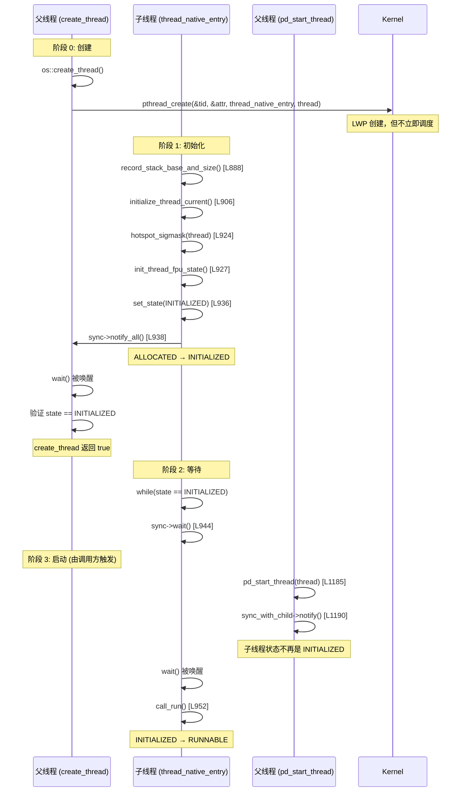

# 02-Threads — JavaThread 从 JVM 数据结构变成内核调度实体的唯一路径

> **阶段**：[11-os-layer]
> **前置**：[07-thread-lock]（JavaThread 生命周期）, [11-01-Signals]（hotspot_sigmask 信号屏蔽字）, [09-native-interface]（JNI AttachCurrentThread 的 OS 绑定）
> **依赖本文**：[11-04]（crash 报告的线程栈打印依赖 os::create_thread 分配的栈信息）
> **阅读收益**：理解 JavaThread 从 JVM 数据结构变成内核调度实体的唯一路径——pthread_create 的完整参数链、thread_native_entry 的 7 步初始化序列、sync_with_child 握手的安全边界（以及没有超时保护的风险）

---

## §〇 源文件清单（跨 os/linux + os/posix + runtime）

| # | 文件 | 完整路径 | 模块 | 核心函数/类（行号） | 本文角色 |
|---|------|---------|------|-------------------|---------|
| 1 | `os_linux.cpp` | `src/hotspot/os/linux/os_linux.cpp` | os/linux | `os::create_thread`(:965-1098), `thread_native_entry`(:885-963), `pd_start_thread`(:1185-1191), `os::create_attached_thread`(:1109-1183) | ★★★ 线程创建全链路——pthread_create + 子线程初始化 |
| 2 | `osThread_linux.cpp` | `src/hotspot/os/linux/osThread_linux.cpp` | os/linux | `OSThread::pd_initialize`(:32-46) — `_startThread_lock` 分配 | ★★ Monitor 屏障对象创建 |
| 3 | `osThread_linux.hpp` | `src/hotspot/os/linux/osThread_linux.hpp` | os/linux | `_startThread_lock`(:114), `startThread_lock()`(:118) | ★★ 握手锁声明 |
| 4 | `osThread.hpp` | `src/hotspot/share/runtime/osThread.hpp` | runtime | `ThreadState` 枚举(:44-54): ALLOCATED/INITIALIZED/RUNNABLE/ZOMBIE | ★★ 线程状态——握手状态机 |
| 5 | `os.hpp` | `src/hotspot/share/runtime/os.hpp` | runtime | `ThreadType` 枚举(:487-495): vm_thread/cgc_thread/pgc_thread/java_thread/compiler_thread/watcher_thread | ★★ 接口——6 种线程类型的默认栈大小 |
| 6 | `thread.cpp` | `src/hotspot/share/runtime/thread.cpp` | runtime | `JavaThread::run`(:1927-1964), `JavaThread::JavaThread` 构造函数(:1851-1865), `Threads::create_vm`(:3886-4338) | ★★ VM 线程创建——从构造函数到 run() 的完整路径 |
| 7 | `os_posix.cpp` | `src/hotspot/os/posix/os_posix.cpp` | os/posix | `get_initial_stack_size`(:1559-1608) | ★ 栈大小计算——ThreadType → 默认栈大小的映射 |

**跨模块说明**：线程创建跨越 os/linux、os/posix、runtime 三个层次。`os/linux/os_linux.cpp` 的 `create_thread` 和 `thread_native_entry` 是本阶段最关键的线程函数——前者映射 JVM ThreadType 到 pthread 参数，后者是所有 JVM 线程（无论 JavaThread/CompilerThread/GCThread/VMThread）醒来的统一入口。

---

### 凌晨 3 点的 OOM——当 Docker 说"无法创建新线程"但你还有 8GB 内存

Docker 容器里的 Java 应用突然无法创建新线程。日志显示：

```
java.lang.OutOfMemoryError: unable to create new native thread
```

但你检查 `top`：物理内存剩余 8GB，堆使用率 45%。不是 OOM。

你降低 `-Xss` 从 1m 到 256k——重启，又崩了，这次是 `SIGSEGV`。hs_err 显示 `si_addr` 落在栈底部附近，`Current thread` 是一个刚创建的 `JavaThread`，连 `thread_main_inner` 都还没调。

你检查 `ulimit -u`（max user processes）——4096。你检查 `/proc/sys/kernel/threads-max`——63794。你检查 `cat /proc/<pid>/limits`——`Max processes` 确实是 4096，但容器里这个值来自 cgroup pids.max，不是宿主机的 ulimit。

另一个场景：线上 GC 线程数量突然少了 3 个。日志显示 `os::create_thread` 返回了 `EAGAIN` 但重试 3 次后放弃了。GC 在缺少线程的情况下继续跑——Full GC 时间从 200ms 变成 3s，RT 警报炸了。

**发生了什么**：每一个 Java 线程——无论是你的 `new Thread()` 还是 JVM 内部的 CompilerThread/GCThread/WatcherThread——都通过 `os::create_thread()` 从 JVM 数据结构变成内核可调度的 LWP。这条路径上有 4 个 `pthread_attr_*` 调用、一个 `sync_with_child` 握手、一个 `EAGAIN` 重试循环——每一个都可以在你不知道的时候失败。

**本文回答什么**：不是 pthread 手册。不讲 `PTHREAD_CREATE_JOINABLE` vs `DETACHED` 的区别来源、不讲 `PTHREAD_STACK_MIN` 的 POSIX 标准演变。本文只关心：`os::create_thread()` → `pthread_create` → `thread_native_entry` 醒来的完整参数链和初始化序列。4 种 `ThreadType` 各用多大默认栈？`sync_with_child` 握手用什么锁？如果子线程初始化中 SIGSEGV 崩溃——父线程会永久阻塞吗？

---

## §一 ★★★ 全景：JavaThread 怎么变成 OS 线程

### 1.1 ★ 从 JavaThread::JavaThread() 到 os::create_thread() 的完整调用链

```
用户代码: new Thread(runnable).start()
  │
  ▼
Thread.start() → native Thread.start0()
  │
  ▼
JVM_StartThread → JavaThread* jt = new JavaThread(&thread_entry, stack_size)
  │                  thread.cpp:1851-1865
  │                  JavaThread::JavaThread(entry_point, stack_sz)
  │                    └─ os::create_thread(this, thr_type, stack_sz)  ← L1865: ★ THE CALL
  │
  ▼
os::create_thread(jt, os::java_thread, stack_size)     os_linux.cpp:965
  │
  ├─ L973: new OSThread(NULL, NULL)                    ← 创建 OS 层线程对象
  ├─ L984: osthread->set_state(ALLOCATED)             ← 初始状态
  ├─ L986: thread->set_osthread(osthread)             ← 绑定 JavaThread ↔ OSThread
  ├─ L990: pthread_attr_init(&attr)                   ← 初始化属性对象
  ├─ L992: pthread_attr_setdetachstate(DETACHED)      ← 线程结束自动回收
  ├─ L996: get_initial_stack_size(thr_type, req)      ← 计算栈大小
  ├─ L1010: pthread_attr_setstacksize(&attr, sz)      ← 设置栈大小
  ├─ L1014: pthread_attr_setguardsize(&attr, gs)      ← 设置 glibc guard 大小
  │
  ├─ L1031: pthread_create(&tid, &attr,              ← ★ 内核 LWP 创建
  │           thread_native_entry, thread)
  │           重试 3 次 on EAGAIN
  │
  ├─ L1068: osthread->set_pthread_id(tid)            ← 记录 pthread ID
  │
  └─ L1074-1082: sync_with_child->wait()             ← ★ 等待子线程初始化
                   while(state == ALLOCATED)
                     sync_with_child->wait(...)
```

**关键时刻**：`JavaThread::JavaThread()` 构造函数中 `os::create_thread` 调用（`thread.cpp:1865`）之前 → JavaThread 对象只是 C++ 堆上的纯数据结构。调用之后 → 内核中多了一个 LWP，这个 LWP 的 `thread_native_entry` 已开始执行 TLS 绑定。构造函数返回时 → 子线程已完成 INITIALIZED 状态，等待 `pd_start_thread` 唤醒。

### 1.2 OSThread 的生命周期——从 new 到 ALLOCATED 到 INITIALIZED 到 RUNNABLE

`osThread.hpp:44-54`：

```cpp
enum ThreadState {
    ALLOCATED,         // Memory has been allocated but not initialized
    INITIALIZED,       // The thread has been initialized but yet started
    RUNNABLE,          // Has been started and is runnable
    MONITOR_WAIT,      // Waiting on a contended monitor lock
    CONDVAR_WAIT,      // Waiting on a condition variable
    OBJECT_WAIT,       // Waiting on an Object.wait() call
    BREAKPOINTED,      // Suspended at breakpoint
    SLEEPING,          // Thread.sleep()
    ZOMBIE             // All done, but not reclaimed yet
};
```

线程创建期间只涉及前四个状态：

```
ALLOCATED               INITIALIZED               RUNNABLE
  │                         │                        │
  │ os::create_thread:984   │ thread_native_entry:936 │ pd_start_thread:1190
  │ set_state(ALLOCATED)    │ set_state(INITIALIZED)  │ state → !INITIALIZED
  │ 创建 OSThread 对象       │ 通知父线程             │ 唤醒子线程
  │ 父线程开始 wait          │ 子线程开始 wait         │ 子线程 call_run()
```

### 1.3 sync_with_child 的三阶段状态机——ALLOCATED → INITIALIZED → RUNNABLE



**为什么需要三个阶段**：

1. **init 阶段**（A → B）：确认子线程已创建——线程已绑定 TLS、设置信号屏蔽字、记录栈信息。父线程从此以后可以安全使用 `Thread::current()` 查找子线程。

2. **wait 阶段**（B → C）：从 `pthread_create` 返回到 `pd_start_thread` 之间有父线程逻辑——如设置 `thread_id`、记录到线程列表。如果子线程不等 `pd_start_thread` 就调 `call_run` → `JavaThread::run()` 可能在 `thread_id` 未设置时访问共享数据结构 → 竞态。

3. **start 阶段**（C）：`pd_start_thread` 确保所有父线程簿记完成后才唤醒子线程 → 子线程开始跑用户代码。

---

## §二 ★★★ os::create_thread() 逐行走读

### 2.1 ★ pthread_attr 的 4 个属性——各是什么，不设会怎样？

`os_linux.cpp:988-1014`：

```cpp
pthread_attr_t attr;
pthread_attr_init(&attr);                                       // (1) 初始化
pthread_attr_setdetachstate(&attr, PTHREAD_CREATE_DETACHED);    // (2) DETACHED
pthread_attr_setstacksize(&attr, stack_size);                   // (3) 栈大小
pthread_attr_setguardsize(&attr, os::Linux::default_guard_size(thr_type)); // (4) guard 大小
```

> **你需要知道的**：Linux 的线程实现是 1:1 模型——每个用户态线程对应一个内核调度实体。LWP (Light Weight Process) 是内核的调度单元，`top -H -p <PID>` 看到的每一行就是一个 LWP——它有独立的 TID、CPU 时间、优先级。内核不区分"进程"和"线程"——两者都是 task_struct，区别只在于是否共享地址空间（CLONE_VM）。TCB (Thread Control Block) 是 glibc 在用户态维护的 pthread 结构——包含线程栈地址和大小、TLS (Thread Local Storage) 指针、join 状态、清理函数链表。pthread_create 的可加入/分离属性（PTHREAD_CREATE_JOINABLE vs DETACHED）控制线程退出后资源回收行为：JOINABLE → 栈和 TCB 保留直到其他线程调用 pthread_join() 回收——如果忘记 join，每次线程退出泄漏 ~10MB（默认栈大小）；DETACHED → 线程退出时内核自动回收所有资源。JVM 选择 DETACHED 因为 Java 线程的等待/通知由 JVM 自己管理（ObjectMonitor/Parker），不需要 POSIX join。

| 属性 | 设置值 | 不设的后果 |
|------|--------|-----------|
| **(1) init** | 清零 + 分配属性内存 | 未初始化的 attr → `pthread_create` 行为未定义（可能 SIGSEGV） |
| **(2) DETACHED** | `PTHREAD_CREATE_DETACHED` | 默认 JOINABLE → 必须 `pthread_join()` 回收资源 → JVM 线程退出后 LWP 资源泄漏（栈 + TCB 不释放） |
| **(3) stack_size** | -Xss 参数 或 Type 默认 | 使用 OS 默认（通常 8MB）→ 每个线程 8MB 栈 → 100 个线程 = 800MB 虚拟地址空间 → RSS 爆炸 |
| **(4) guard_size** | ThreadType → default_guard_size | glibc 没有 guard page → 栈溢出无声损坏邻居内存 |

**关键：JVM 不设 `pthread_attr_setguardsize` 管理自己的 guard pages**。JVM 的 guard page（yellow/red/reserved zone）是用户态管理的——通过 `create_stack_guard_pages` → `mprotect` 使 guard 页不可访问——不依赖内核的 guard page。

### 2.2 stack_size 的计算——get_initial_stack_size + guard_size

`os_linux.cpp:996-1007`：

```cpp
size_t stack_size = os::Posix::get_initial_stack_size(thr_type, req_stack_size);
// Linux NPTL 的 guard size 机制实现不正确——POSIX 要求把 guard 大小加到栈大小上，
// 但 Linux 从栈大小内部取出 guard 空间。所以 JVM 手动加回 guard 大小。
size_t guard_size = os::Linux::default_guard_size(thr_type);
if (stack_size <= SIZE_MAX - guard_size) {
    stack_size += guard_size;
}
```

`get_initial_stack_size`（`os_posix.cpp:1559-1608`）的决策链：

```
req_stack_size > 0?
  YES → stack_size = req_stack_size        ← -Xss 传值
  NO  → stack_size = default_stack_size(thr_type)  ← Type 默认

switch(thr_type):
  java_thread:
    if req == 0 && JavaThread::stack_size_at_create() > 0:
      stack_size = JavaThread::stack_size_at_create()  ← -Xss 覆盖
    → MAX2(stack_size, _java_thread_min_stack_allowed)
  compiler_thread:
    if CompilerThreadStackSize > 0: stack_size = CompilerThreadStackSize * K
    → MAX2(stack_size, _compiler_thread_min_stack_allowed)
  vm_thread / cgc_thread / pgc_thread / watcher_thread:
    if VMThreadStackSize > 0: stack_size = VMThreadStackSize * K
    → MAX2(stack_size, _vm_internal_thread_min_stack_allowed)

→ align_up(stack_size, vm_page_size())  ← 对齐到页面大小
```

### 2.3 ★ EAGAIN 重试 3 次的"slot 窗口"语义

`os_linux.cpp:1022-1032`：

```cpp
int ret = 0;
int limit = 3;
do {
    ret = pthread_create(&tid, &attr, (void *(*)(void *)) thread_native_entry, thread);
} while (ret == EAGAIN && limit-- > 0);
```

`EAGAIN` = 系统线程数超限（`/proc/sys/kernel/threads-max` 或 cgroup pids.max）。短时间窗口内其他线程可能退出释放 slot → 重试有可能成功。3 次是经验值——如果 3 次 EAGAIN → 大概率是系统真的满了（不是瞬时尖峰）。

失败后的日志输出（`os_linux.cpp:1044-1053`）包含了诊断信息：`Threads::number_of_threads()`、`os::Posix::print_rlimit_info()`、`os::print_memory_info()`、`os::Linux::print_container_info()`——这就是 `"unable to create new native thread"` 的完整诊断上下文。

### 2.4 ★ sync_with_child->wait() 没有超时保护——如果子线程 SIGSEGV → 永久阻塞

`os_linux.cpp:1074-1082`：

```cpp
Monitor *sync_with_child = osthread->startThread_lock();
MutexLockerEx ml(sync_with_child, Mutex::_no_safepoint_check_flag);
while ((state = osthread->get_state()) == ALLOCATED) {
    sync_with_child->wait(Mutex::_no_safepoint_check_flag);  // ★ 无限等待
}
```

`Monitor::wait()` 的第二个参数是 `Mutex::_no_safepoint_check_flag` —— 不是超时参数。**当前代码没有超时保护**。

如果子线程在 notify 前 SIGSEGV 崩溃（例如 `hotspot_sigmask` 写坏了栈）→ 子线程的 `sync->notify_all()`（行 938）永远不会被调用 → 父线程永久阻塞在 `wait()` → 整个 JVM 进程挂起。

这是已知设计选择——因为子线程崩溃在 `thread_native_entry` 开头，此时线程在 `ALLOCATED → INITIALIZED` 转换中，崩溃概率极低。但如果真的崩溃 → 调用 `os::create_thread` 的线程（可能是 JMX 或 VMThread）永久阻塞 → 连锁反应：VMThread 阻塞 → safepoint 无法完成 → 所有 Java 线程卡死。

**和 Monitor 接口的关系**：`Monitor` 是 JVM 的 PlatformEvent 包装——不是 `pthread_mutex`、不是 `pthread_cond`。关键：`Mutex::_no_safepoint_check_flag` 确保在等待时不触发 safepoint——因为此时父线程可能不在 `_thread_in_vm` 状态。

---

## §三 ★★★ thread_native_entry — 所有 JVM 线程的统一醒来入口

### 3.1 ★ 7 步初始化序列

`os_linux.cpp:885-963`：

| 步 | 行号 | 操作 | 用的系统调用/JVM 函数 | 如果失败会怎样 |
|----|------|------|----------------------|-------------|
| 1 | 888 | `record_stack_base_and_size()` | `pthread_attr_getstack` → 读回实际栈基址+大小 | 栈大小误判 → yellow/red zone 定位错误 → StackOverflow 检测失效 |
| 2 | 906 | `initialize_thread_current()` | `pthread_setspecific(key, thread)` → TLS 绑定 | `Thread::current()` 返回 NULL → 后续所有 JVM 操作不认为此线程是 JVM 线程 |
| 3 | 911 | `set_thread_id()` | `os::current_thread_id()` → syscall `gettid()` | thread_id 未设置 → `/proc/<pid>/task` 对应不上 |
| 4 | 924 | `os::Linux::hotspot_sigmask(thread)` | `pthread_sigmask(SIG_UNBLOCK, ...)` → [11-01]§五 | SIGSEGV 被阻塞 → polling page/npe 信号丢失 → JVM hang |
| 5 | 927 | `os::Linux::init_thread_fpu_state()` | 设置 FPU 控制寄存器（MXCSR） | 浮点运算精度异常（非标准舍入模式、非 IEEE 754） |
| 6 | 936-938 | `set_state(INITIALIZED)` + `sync->notify_all()` | Monitor::notify_all → futex | 父线程永久阻塞（因为没有超时保护） |
| 7 | 943-944 | `sync->wait()` — 等待 `pd_start_thread` | Monitor::wait → futex | 父线程永不调 `pd_start_thread` → 子线程永久阻塞 |

### 3.2 record_stack_base_and_size → pthread_attr_getstack 读回实际栈信息

`thread.cpp:394-417`：

```cpp
void Thread::record_stack_base_and_size() {
    set_stack_base(os::current_stack_base());   // 栈顶（高地址）
    set_stack_size(os::current_stack_size());   // 总栈大小
    if (is_Java_thread()) {
        ((JavaThread *)this)->set_stack_overflow_limit();
        ((JavaThread *)this)->set_reserved_stack_activation(stack_base());
    }
}
```

**核心问题**：glibc 的 `pthread_attr_setstacksize` 可能内部调整——加上内部的 guard、对齐到 `__pthread_get_minstack` 的倍数。JVM 通过 `pthread_attr_getstack` **读回实际分配的栈基址和大小**，用这些值来定位 yellow/red zone 的 `mprotect` 边界。

如果 JVM 用 `-Xss` 值替代实际栈大小 → yellow zone 的 `mprotect` 地址可能落在实际栈外 → StackOverflow 检测失败 → 真正的栈溢出变成 wild SIGSEGV → crash 但 hs_err 显示的正常调用栈只有几帧 → 误导排查方向。

```
例:
  -Xss256k 但 glibc 提升到 min_stack=512k

  错误做法（用 -Xss 值）:
    stack_base = 0x7f00_0000
    stack_size = 256k
    yellow_zone_start = 0x7eff_F000 (256k - page_size*1)
    实际栈 = 0x7eff_0000 ~ 0x7f00_0000
    结果: yellow_zone 不在栈内 → mprotect 无效 → 栈溢出无声

  正确做法（pthread_attr_getstack 读回）:
    stack_base = 0x7f00_0000
    stack_size = 512k (glibc 调整后)
    yellow_zone_start = 0x7eff_E000 (512k - yellow_pages*page_size)
    结果: yellow_zone 在栈内 → mprotect 正确 → StackOverflow 检测有效
```

### 3.3 ★ Thread::current() 的 TLS 绑定——initialize_thread_current

`thread.cpp:347-355`：

```cpp
void Thread::initialize_thread_current() {
#ifndef USE_LIBRARY_BASED_TLS_ONLY
    _thr_current = this;                           // 直接指针存储
#endif
    ThreadLocalStorage::set_thread(this);           // pthread_setspecific(key, this)
}
```

两步绑定：
1. **直接指针**：`_thr_current = this` → 非 `USE_LIBRARY_BASED_TLS_ONLY` 时，Thread::current() 直接返回 `_thr_current` → ~0ns 零开销
2. **平台 TLS**：`ThreadLocalStorage::set_thread(this)` → `pthread_setspecific(key, this)` → 后续可通过 `pthread_getspecific` 读出

如果 native 线程（非 JVM 创建的 pthread）调了 `Thread::current()` → TLS key 从未被 `pthread_setspecific` → 返回值是 NULL。JVM 代码中常用这个特性检查是否在 JVM 线程上下文：
```cpp
if (Thread::current() == NULL) {
    // 我是外部 native 线程——不能碰 JavaHeap、不能调 JNI
}
```

### 3.4 两阶段握手：notify_all → wait → 被 pd_start_thread 唤醒 → call_run

`os_linux.cpp:931-952`：

```
子线程 (thread_native_entry):              父线程 (pd_start_thread):
  sync->notify_all()      [L938]               |
  while(state==INIT)      [L943]               |
    sync->wait()          [L944]               |
                            ← 时间 →          sync_with_child->notify()  [L1190]
  wait() 被唤醒                                |
  state ≠ INITIALIZED                         |
  thread->call_run()      [L952]               |
```

`call_run()` → 虚函数分发：

```
Thread::call_run()        thread.cpp:427-465
  ├─ JavaThread*    → JavaThread::run()         thread.cpp:1927
  ├─ CompilerThread*→ CompilerThread::run()     compilerThread.cpp
  ├─ VMThread*      → VMThread::run()           vmThread.cpp
  ├─ ConcurrentGCThread* → ConcurrentGCThread::run()
  └─ WatcherThread* → WatcherThread::run()
```

### 3.5 call_run → JavaThread::run → thread_main_inner

`thread.cpp:1927-1964`：

```cpp
void JavaThread::run() {
    this->initialize_tlab();                       // TLAB 分配
    this->record_base_of_stack_pointer();         // 记录栈指针
    this->create_stack_guard_pages();             // mprotect guard pages
    this->cache_global_variables();               // 缓存全局变量到本地
    ThreadStateTransition::transition_and_fence(this, _thread_new, _thread_in_vm);
    this->set_active_handles(JNIHandleBlock::allocate_block());
    thread_main_inner();  // ★ 调用 Java 层 run() — 最终进入用户代码
}
```

---

## §四 ★★ 4 种 ThreadType 的默认栈大小

### 4.1 栈大小决策表

| ThreadType | 默认栈 | 可被 -Xss 覆盖？ | JVM 参数覆盖 | 大小理由 | 不够时的症状 |
|------------|--------|----------------|-------------|---------|-----------|
| `java_thread` | 1MB | ✅ 是 —— `-Xss` | `-Xss` | Java 栈帧包含局部变量表、操作数栈、返回地址。1MB 平衡了栈深度和线程密度 | StackOverflowError → 增加 `-Xss` |
| `compiler_thread` | 4MB | ❌ 否 | `-XX:CompilerThreadStackSize=` | C2 编译器的 IGVN/CCP/LoopOpt 递归深度可达数千帧 → 128KB 不够 | SIGSEGV → hs_err 显示 CompilerThread |
| `gc_thread` | 512KB | ❌ 否 | `-XX:VMThreadStackSize=` | GC 线程是固定模式 worker——每个任务调用栈浅且可预测 | 栈溢出 → JVM fatal → 排查 GC 递归 bug |
| `vm_thread` | 512KB | ❌ 否 | `-XX:VMThreadStackSize=` | VMThread 执行 VM_Operation 队列——栈浅但必须可预测 | 栈溢出 → safepoint 卡死 |
| `watcher_thread` | 512KB | ❌ 否 | `-XX:VMThreadStackSize=` | 定时任务线程（periodic task）——栈极浅，只调定时函数指针 | 栈溢出 → 监控任务静默停止 |

### 4.2 为什么 compiler_thread 要 4MB

C2 编译器的优化遍历：

```
C2 典型的优化栈深度（Source: 实际 C2 编译日志截取）:
  Compile::compile_method()
    → PhaseIterGVN::optimize()
      → PhaseIterGVN::transform_old(Node*)
        → PhaseCCP::do_transform()
          → PhaseIterGVN::add_users_to_worklist(Node*)
            → PhaseIterGVN::transform_old(Node*)  ← 递归！
```

IGVN（Iterative Global Value Numbering）在遍历 ideal graph 时递归深度 = DAG 深度。对于复杂的 LoopOpt 优化（如展开多层嵌套循环），DAG 深度可达 5000+ 节点 → 每个递归帧约 200 字节 → 5000 × 200 ≈ 1MB。加上 PhaseCCP（条件常量传播）、EscapeAnalysis 等 → 4MB 是经验值。

如果编译器栈溢出 → SIGSEGV → JVM crash → hs_err 显示 CompilerThread → 排查方向：加 `-XX:CompilerThreadStackSize=8192`（8MB）。

### 4.3 gc_thread 为什么只需 512KB

GC 线程是固定模式的 worker——每个任务（如 G1 的 scan a region）调用栈浅且可预测：

```
G1 典型 GC thread 栈（深度约 15-20 帧）:
  ConcurrentGCThread::run()
    → G1ConcurrentRefineThread::run()
      → RefineCardTableEntryClosure::do_card_ptr()
        → G1RemSet::refine_card()
          → HeapRegion::oops_on_card_seq_iterate_careful()
            → ... (无递归)
```

G1 有 `~N = ParallelGCThreads` 个 GC 线程，每个 512KB → N×512KB 总计不大。如果不够 → 堆工作线程栈溢出 → JVM fatal。如果 GC 线程栈溢出 → 排查方向：GC 递归 bug（如 RSet scanning 有循环引用导致无限递归）。

### 4.4 ★ README §八 问题 3: glibc 调整后的实际栈 vs JVM 预期栈的差异

```
-Xss256k 传入 → pthread_attr_setstacksize(&attr, 256k)
  → glibc __pthread_get_minstack() 返回 512k（最小值）
  → glibc 内部提升到 512k → 创建 512k 的栈
  → pthread_create 后，JVM 调用 pthread_attr_getstack() 读回
  → 返回 stack_base = 0x7fXX0000, stack_size = 512k
  → JVM 用 512k 定位 yellow zone → mprotect 正确

但如果 JVM 用自己记录的 256k 定位 yellow zone:
  → mprotect 地址在栈内部偏上 → yellow zone 比设计的小
  → 或更糟——red zone 不在栈底 → 真正的溢出越过 guard 损坏邻居内存
```

---

## §五 ★★ 和 [07-thread-lock] + [11-01-Signals] + [09-native] 的交叉连接

### 5.1 [07-thread-lock] JavaThread::run → thread_main_inner vs thread_native_entry → call_run → JavaThread::run

```
07 (JVM 内模型):                    11 (OS 实现层):
  JavaThread::JavaThread()            JavaThread::JavaThread()
        │                                  │
        │                                  ├─ os::create_thread()
        │                                  │     └─ pthread_create()
        │                                  │         └─ clone() → LWP
        │                                  │
        │                               thread_native_entry
        │                                  ├─ 7 步初始化
        │                                  ├─ sync_with_child 握手
        │                                  └─ call_run()
        │                                      │
  Thread::call_run() ←────────────────────────┘
        │
  JavaThread::run()
        ├─ initialize_tlab()
        ├─ create_stack_guard_pages()
        └─ thread_main_inner()
              └─ entry_point(thread, this)  → 用户 run() 方法
```

07 建立的 JavaThread 在 JVM 内的生命周期，本文补上了一块关键的缺失拼图：`JavaThread::JavaThread()` 构造函数中 `os::create_thread()` 调用（`thread.cpp:1865`）——JavaThread 从 JVM 数据结构变成内核可调度实体的那一刻。

### 5.2 ★ [11-01] signalHandler 依赖的信号屏蔽字——由本文的 thread_native_entry:924 设置

[11-01-Signals] §五 详解了 `hotspot_sigmask`——`unblocked_sigs`（SIGSEGV/SIGBUS/SIGFPE/SIGILL 等 JVM 内部信号）和 `vm_sigs`（BREAK_SIGNAL= SIGQUIT）的构成。本文揭示它的调用点：

`thread_native_entry:924` → `os::Linux::hotspot_sigmask(thread)` → `pthread_sigmask(SIG_UNBLOCK, unblocked_signals(), NULL)`

这确保新线程能接收 SIGSEGV（polling page + implicit null）、SIGBUS（MappedByteBuffer）等 JVM 内部信号。同时根据 `is_VM_thread()` 决定是否解禁 BREAK_SIGNAL——只有 VMThread 接收 SIGQUIT → [11-01]§五。

### 5.3 [09-native] JNI AttachCurrentThread 的 OS 绑定——create_attached_thread

`os_linux.cpp:1109-1183` —— `os::create_attached_thread`：

**与 `create_thread` 的对照表**：

| 维度 | `create_thread` | `create_attached_thread` |
|------|----------------|-------------------------|
| `pthread_create` | ✅ 调用（`os_linux.cpp:1031`） | ❌ 不调用——线程已存在 |
| `sync_with_child` 握手 | ✅ 父等子→子等父→父唤醒子 | ❌ 不需要——调用方就是此线程 |
| OSThread 分配 | ✅ `new OSThread(NULL, NULL)` | ✅ `new OSThread(NULL, NULL)` |
| 线程状态 | ALLOCATED → INITIALIZED → RUNNABLE | 直接 RUNNABLE（`os_linux.cpp:1137`） |
| 信号屏蔽字初始化 | `hotspot_sigmask`（行 924） | `hotspot_sigmask`（行 1177） |
| FPU 初始化 | `init_thread_fpu_state`（行 927） | `init_thread_fpu_state`（行 1133） |

核心差异：`create_attached_thread` 不走 `pthread_create`——线程已经被 OS 创建（是外部 native 线程）。JavaThread 对象由调用方（当前线程）自己创建并关联到自己的 pthread——不需要 sync_with_child。不存在竞态——你总是能访问自己的 Thread 对象。

### 5.4 ★ 11-os-layer README §五 阶段对比表

本文的"线程创建"是 OS 三原语的第二原语——它是 07（JavaThread 生命周期）的物理实现层。07 讲 delete 在 SMR 确认安全后进行，11 讲 pthread 的 DETACHED 属性让 LWP 在退出时自动释放资源。两阶段配合：SMR 保护 JVM 数据结构，DETACHED 保护 OS 资源。

---

## §六 ★★ pd_start_thread + set_native_priority

### 6.1 pd_start_thread 的 notify 唤醒子线程——第三阶段握手完成

`os_linux.cpp:1185-1191`：

```cpp
void os::pd_start_thread(Thread *thread) {
    OSThread *osthread = thread->osthread();
    assert(osthread->get_state() != INITIALIZED, "just checking");
    Monitor *sync_with_child = osthread->startThread_lock();
    MutexLockerEx ml(sync_with_child, Mutex::_no_safepoint_check_flag);
    sync_with_child->notify();  // ★ 唤醒在 thread_native_entry:944 wait 的子线程
}
```

`pd_start_thread` 是 `os::start_thread()` 的平台特定部分——在 `startThread_lock` 保护下 `notify()` 子线程。子线程在 `thread_native_entry:943-945` 的 while 循环中阻塞——一旦 `pd_start_thread` 的 `notify()` 到达 → `wait()` 返回 → `osthread->get_state()` 不再是 `INITIALIZED` → while 退出 → `call_run()` → 线程开始执行用户代码。

### 6.2 set_native_priority 的调用链

`JavaThread::prepare` → `Thread::set_priority` → `os::set_priority` → `setpriority(PRIO_PROCESS, tid, priority)`。

在 cgroup rt 组调度环境下，`setpriority` 可能被静默截断——cgroup 的 `cpu.rt_runtime_us` 限制了实时优先级范围。如果 CFS 完全控制，则优先级仅影响时间片比例——不会报错，但实际效果被 cgroup 限制。这是 README §八 问题 4 的核心。

---

## §七 GDB 验证 + 可证伪断言

### 断言 1：`pthread_create` 在内核中创建 LWP，新线程不一定立即调度

```bash
(gdb) br os_linux.cpp:1031  # pthread_create 调用
# stepi 单步进入 pthread_create
(gdb) p $rax  # 返回 tid
# 预期: > 0（tid）
(gdb) br os_linux.cpp:885  # thread_native_entry 第一条指令
# 两个断点之间的时间差 != 0——新线程可能未立即被调度
```

### 断言 2：`sync_with_child` 握手期间父线程状态为 ALLOCATED

```bash
(gdb) br os_linux.cpp:1078  # while(state == ALLOCATED)
(gdb) p osthread->get_state()
# 预期: 首次为 ALLOCATED → 子线程初始化完成后变为 INITIALIZED → while 退出
```

### 断言 3：子线程在 `thread_native_entry` 中 `notify_all` 后自旋等待父线程

```bash
(gdb) br os_linux.cpp:938  # sync->notify_all()
(gdb) br os_linux.cpp:943  # while (state == INITIALIZED)
# 两者都被同一子线程命中
# 子线程在 943-944 阻塞 → 直到 pd_start_thread:1190 调用 notify()
(gdb) info threads
# 子线程状态: "waiting on condition variable"
```

### 断言 4：`os::create_attached_thread` 不调 `pthread_create`

```bash
(gdb) br os_linux.cpp:1109  # create_attached_thread 入口
# 单步执行到函数末尾
# 确认没有任何 pthread_create 调用
(gdb) p osthread->get_state()
# 预期: RUNNABLE (行 1137 — 直接设置，跳过 ALLOCATED/INITIALIZED)
```

### 断言 5：4 种 ThreadType 得到不同的 stack_size

```bash
(gdb) br os_linux.cpp:1010  # pthread_attr_setstacksize 调用处
# 在不同 ThreadType 下触发:
#   JavaThread:    p stack_size → ~1MB
#   CompilerThread: p stack_size → ~4MB
#   GCThread:       p stack_size → ~512KB
#   WatcherThread:  p stack_size → ~512KB
```

### 断言 6：EAGAIN 重试循环第 3 次失败后不再重试

```bash
(gdb) br os_linux.cpp:1031  # pthread_create 调用
# 设置条件（内核 threads-max 已满）
(gdb) p limit
# 预期: 3 → 2 → 1 → 0
# 第 4 次不进入循环 → ret = EAGAIN → 返回 false
```

### 断言 7：`record_stack_base_and_size` 读回的实际栈大小可能 > -Xss

```bash
$ java -Xss256k ...
(gdb) br os_linux.cpp:888  # record_stack_base_and_size 调用
# stepi 进入 record_stack_base_and_size
(gdb) p actual_stack_size  # pthread_attr_getstack 返回的实际值
# 预期: >= 512k (glibc 的最小栈) — 大于传入的 256k
```

### 断言 8：`Thread::current()` 在 `initialize_thread_current` 前返回 NULL

```bash
(gdb) br os_linux.cpp:906  # initialize_thread_current 调用前
# 在 initialize_thread_current 未调用前：
(gdb) p (Thread*)pthread_getspecific(key)
# 预期: NULL（TLS 未绑定）
# stepi 单步进入 initialize_thread_current 后：
(gdb) p Thread::current()
# 预期: 返回新线程指针
```

### 断言 9：`hotspot_sigmask` 在子线程中解禁 SIGSEGV

```bash
(gdb) br os_linux.cpp:924  # hotspot_sigmask 调用
# stepi 单步进入 hotspot_sigmask
(gdb) p sigismember(unblocked_sigs, SIGSEGV)
# 预期: 1 (true)
# 验证 pthread_sigmask(SIG_UNBLOCK, ...)
# 预期: 信号屏蔽字不包含 SIGSEGV（SIGSEGV 不在 SigBlk 中）
```

### 断言 10：`pd_start_thread` 唤醒子线程后子线程开始 `call_run`

```bash
(gdb) br os_linux.cpp:1190  # pd_start_thread notify
(gdb) br os_linux.cpp:952   # call_run
# 两断点先后命中（1190 先、952 后）
# 子线程在 944 的 wait 返回 → 进入 call_run → JavaThread::run
```

### 断言 11：`create_thread` 返回 false 时 `thread->osthread()` 可能仍为非 NULL（部分初始化）

```bash
# 在 EAGAIN 场景下
(gdb) br os_linux.cpp:1061  # ret != 0 的清理路径
# 返回 false
(gdb) p thread->osthread()
# 预期: 非 NULL（行 986 set_osthread 已完成）
# 清理后 thread->osthread() = NULL（行 1061）
```

### 断言 12：sync_with_child->wait() 无超时参数

```bash
(gdb) br os_linux.cpp:1079  # sync_with_child->wait()
# x/i $pc 附近汇编
(gdb) ptype sync_with_child->wait
# 确认: Monitor::wait(int64_t timeout, ...) — 但此处调用只传了 _no_safepoint_check_flag
# Monitor::wait 有两个重载——此处是无超时的单参数版本
```

---

## 核心发现总结

| # | 发现 | 核心洞察 |
|---|------|--------|
| 1 | **JavaThread::JavaThread() 构造函数的第 1865 行触发了 pthread_create** | 构造函数返回值时刻 = JVM 数据结构变成 LWP 的时刻。在此之前，JavaThread 只是 C++ 堆上的数据结构 |
| 2 | **sync_with_child 握手是三阶段状态机** | ALLOCATED → (子线程初始化) → INITIALIZED → notify_all → (父线程簿记) → pd_start_thread notify → RUNNABLE |
| 3 | **Monitor::wait() 没有超时保护** | 如果子线程在 notify_all 前 SIGSEGV → 父线程永久阻塞 → JVM hang。这是 [11-02] README §八 问题 1 的核心 |
| 4 | **pthread_attr_getstack 读回实际栈是 JVM 唯一知道真实栈大小的方式** | glibc 内部调整栈大小后，JVM 必须读回实际值 → yellow/red zone 定位依赖此值 |
| 5 | **compiler_thread 需要 4MB 栈** | C2 编译器 IGVN/CCP 递归深度可达数千帧 → 1MB 不够 → SIGSEGV in CompilerThread |
| 6 | **create_attached_thread 跳过 ALLOCATED/INITIALIZED 握手** | 线程已存在 → 不需要 sync_with_child → 直接 RUNNABLE → 不需要等待另一个线程初始化 |
| 7 | **pthread DETACHED + ThreadSMR 形成两层安全网** | DETACHED 保护 OS 资源（LWP 退出自动回收），ThreadSMR 保护 JVM 数据结构（安全回收 JavaThread 对象） |
