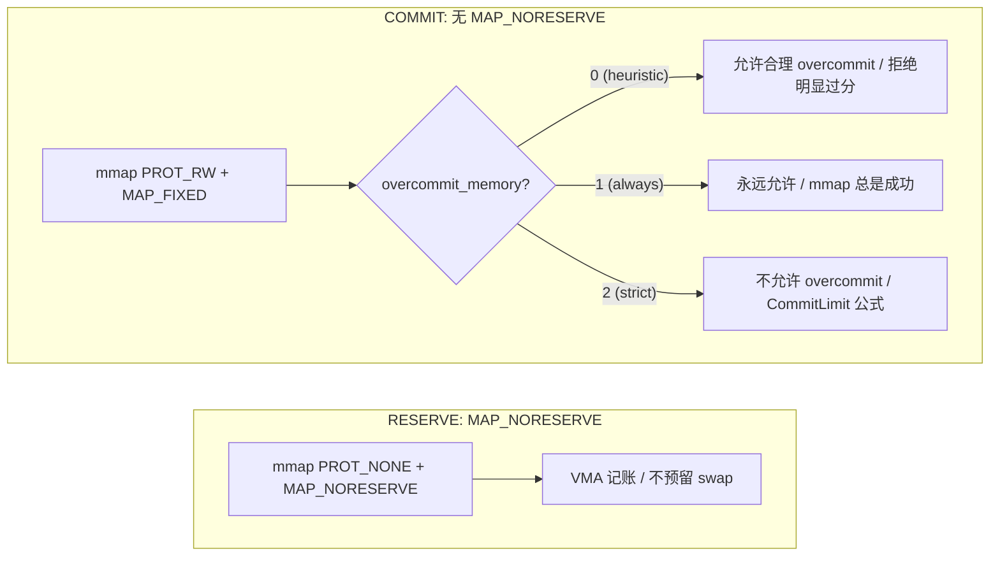
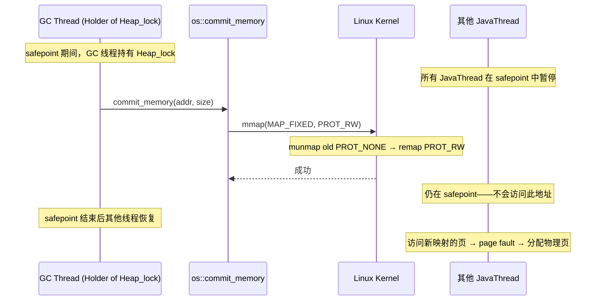
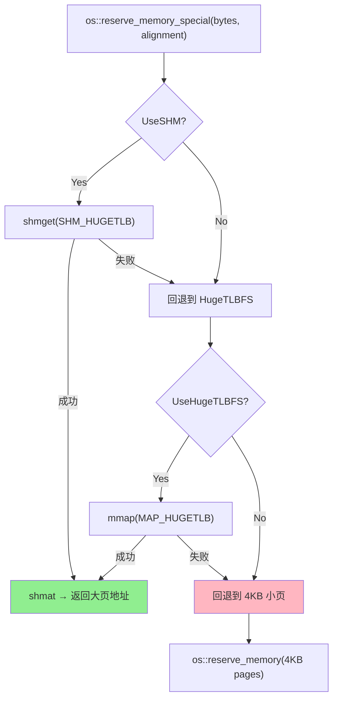

# 03-Memory — JVM 堆内存从虚拟地址承诺到物理页框的完整四态生命周期

> **阶段**：[11-os-layer]
> **前置**：[08-safepoint]（CardTable mmap + GC 内存操作）, [06-gc-memory]（G1 heap structure）
> **依赖本文**：[11-04]（hs_err 的 memory map 段解析依赖对 reserve/commit 的理解）
> **阅读收益**：理解 JVM 堆内存从虚拟地址承诺到物理页框的四态生命周期——mmap 的 reserve→commit→uncommit→release 全链路；掌握 RSS 超过 -Xmx 的物理根源和排查路径

---

## §〇 源文件清单（跨 os/linux + os/posix + runtime/virtualspace + gc/shared）

| # | 文件 | 完整路径 | 模块 | 核心函数/类（行号） | 本文角色 |
|---|------|---------|------|-------------------|---------|
| 1 | `os_linux.cpp` | `src/hotspot/os/linux/os_linux.cpp` | os/linux | `commit_memory_impl`(:3291-3310), `pd_reserve_memory`(:3985-3988), `pd_commit_memory`(:3312-3314), `pd_uncommit_memory`(:3723-3727), `pd_release_memory`(:3990-3992), `recoverable_mmap_error`(:3249-3270), `reserve_memory_special`(:4577-4599) | ★★★ 四态系统调用——所有 mmap/munmap 的 Linux 实现 |
| 2 | `os_posix.cpp` | `src/hotspot/os/posix/os_posix.cpp` | os/posix | `reserve_memory_aligned`(:288-344), `map_memory_to_file`(:248-276) | ★★ 对齐分配 + 文件映射 |
| 3 | `virtualspace.cpp` | `src/hotspot/share/memory/virtualspace.cpp` | memory | `ReservedSpace::initialize`(:122-243), `VirtualSpace::initialize_with_granularity`(:836-881), `VirtualSpace::expand_by`(:1000-1086), `commit_expanded`(:972-986) | ★★★ 3 层抽象——ReservedSpace → VirtualSpace → OS 调用 |
| 4 | `virtualspace.hpp` | `src/hotspot/share/memory/virtualspace.hpp` | memory | `ReservedSpace`(:32-93), `VirtualSpace`(:140-239), 三区域 watermark(`_lower_high`/`_middle_high`/`_upper_high`) | ★★ 类声明——watermark 语义 |
| 5 | `g1PageBasedVirtualSpace.cpp` | `src/hotspot/share/gc/g1/g1PageBasedVirtualSpace.cpp` | gc/g1 | `commit`(:201-222), `uncommit`(:232-245), `commit_internal`(:165-199), `commit_preferred_pages`(:133-154), `pretouch`(:277-292) | ★★ G1 页级管理——per-page commit bitmap |
| 6 | `heapRegionManager.cpp` | `src/hotspot/share/gc/g1/heapRegionManager.cpp` | gc/g1 | `commit_regions`(:116-136), `uncommit_regions`(:138-163), `expand_at`(:243-279) | ★ G1 heap expansion——6 种 mapper 的同步 commit |
| 7 | `os.hpp` | `src/hotspot/share/runtime/os.hpp` | runtime | `reserve_memory`(:342), `commit_memory`(:350), `uncommit_memory`(:361), `release_memory`(:362), `pretouch_memory`(:368), `reserve_memory_special`(:418) | ★★ 接口——四态声明 |
| 8 | `os.cpp` | `src/hotspot/share/runtime/os.cpp` | runtime | `os::reserve_memory`(:1772-1792), `os::commit_memory`(:1828-1843), `os::release_memory`(:1874-1886), `os::pretouch_memory`(:1888-1892) | ★★ 通用包装——NMT 追踪注入点 |
| 9 | `collectedHeap.hpp` | `src/hotspot/share/gc/shared/collectedHeap.hpp` | gc/shared | `_reserved`(:117), `reserved_region()`(:224), `base()`(:225) | ★ GC 侧——堆的 ReservedSpace 消费接口 |

**跨模块说明**：内存映射跨越 os/linux、os/posix、memory（virtualspace）、gc/g1 四个模块。`os_linux.cpp:3291` 的 `commit_memory_impl` 是本阶段最关键的单函数——它是 reserve→commit 转换的"唯一系统调用执行点"。`virtualspace.cpp:1000` 的 `expand_by` 是抽象层——把 `mmap(MAP_FIXED)` 包装为 GC 友好的按需扩展接口。

---

### 凌晨 3 点——RSS 2.1GB 但 -Xmx 只有 1GB

`top` 显示 JVM 的 RSS 是 2.1GB。你检查 `-Xmx`——只有 1GB。检查 `jcmd <pid> GC.heap_info`——堆使用 800MB。差了 1.3GB——在哪？

你打开 hs_err 的 `Memory map` 段：

```
0x0000000080000000-0x0000000100000000 ---p 00000000 00:00 0           [heap reserved]
0x0000000080000000-0x00000000a0000000 rw-p 00000000 00:00 0           [heap committed]
0x00000000a0000000-0x00000000c0000000 rw-p 00000000 00:00 0           [heap committed]
0x00007f8b1a000000-0x00007f8b1a200000 rwxp 00000000 00:00 0          [CodeCache]
0x00007f8b1ae00000-0x00007f8b1be00000 rw-p 00000000 00:00 0          [Metaspace]
0x00007f8b2c000000-0x00007f8b2d000000 rw-p 00000000 00:00 0          [thread stack: 12494]
```

`---p` 段的总大小是 2.0GB——reserve 了没 commit。`rw-p` 段的总大小只有 800MB——实际 commit 的。但 RSS 是 2.1GB？

因为非堆内存：Metaspace 800MB、CodeCache 128MB、200+ 线程栈 × 1MB ≈ 200MB、GC 数据结构（remembered set 位图、SATB 队列、CardTable）≈ 100MB、glibc malloc arena ≈ 50MB。而且 glibc 的 `malloc_trim` 不会主动 munmap——内存释放在 glibc 内部空闲链表中，RSS 不降。

**另一个场景**：G1 GC 时间从 80ms 突然变成 800ms。`Humongous Allocation` 频繁失败——需要 2MB 对齐的 Huge Page 分配，但 `os::reserve_memory_special` 用了 SHM 路径 → `shmget(SHM_HUGETLB)` 从 hugetlbfs 池分配 → 池不够 → 回退到 4KB 小页 → Humongous region 被拆成 512 个 4KB 页 → GC 找连续区域 O(n²)。

**本文回答什么**：不是 mmap 手册。不讲 `MAP_ANONYMOUS` vs `MAP_SHARED` 的内核页表差异、不讲 overcommit 三态的内核实现。本文只关心 JVM 堆内存从 `ReservedSpace::initialize` → `os::reserve_memory` → `os::commit_memory` → `mmap(PROT_NONE)` → `mmap(MAP_FIXED)` 的完整四态生命周期。关键是 `commit_memory_impl` 中 `mmap(MAP_FIXED)` 覆盖旧 PROT_NONE 映射的原子性 gap、`MAP_NORESERVE` 和 overcommit 策略的交互、VirtualSpace 的 watermark 模型。

**和 [11-os-layer README](README.md) §五 的关系**：本文的"内存映射"是 OS 三原语的第三原语——它是 [08-safepoint]（GC 期间内存操作）和 [06-gc-memory]（堆结构）的物理实现层。读者读完本文后应能理解 06 的 G1 heap 和本文的 reserve→commit 如何形成"堆逻辑结构 ↔ OS 虚拟内存"的映射。

---

## §一 ★★★ reserve → commit 两阶段模型

### 1.1 为什么 JVM 不一步到位把堆一次性 mmap？

三个原因：

**(1) 灵活 GC 策略**：G1 需要 reserve 大范围（如 32GB）但只 commit 当前需要的 region（1-32MB each）。如果一步到位 → 物理内存全占 → 浪费 + 更高 OOM risk。G1 在 `G1CollectedHeap::expand` 中按需 commit —— `g1CollectedHeap.cpp:1388-1439`：

```cpp
bool G1CollectedHeap::expand(size_t expand_bytes, WorkGang *pretouch_workers, ...) {
    size_t aligned_expand_bytes = ReservedSpace::page_align_size_up(expand_bytes);
    aligned_expand_bytes = align_up(aligned_expand_bytes, HeapRegion::GrainBytes);
    uint regions_to_expand = (uint)(aligned_expand_bytes / HeapRegion::GrainBytes);
    uint expanded_by = _hrm.expand_by(regions_to_expand, pretouch_workers);
```

`expand_by` → `HeapRegionManager::expand_at`(:243) → `make_regions_available`(:165) → `commit_regions`(:116) → **逐 region 调 `G1PageBasedVirtualSpace::commit`**。不是一次性 commit 全部——是按 region 粒度的渐进 commit。

**(2) Overcommit 兼容**：Linux 默认 overcommit_memory=0（heuristic）。reserve 时内核只在 VMA 中记账，不分配物理页。commit 时才建页表。reserve 调用 `anon_mmap`（`os_linux.cpp:3920-3937`）：

```cpp
flags = MAP_PRIVATE | MAP_NORESERVE | MAP_ANONYMOUS;
addr = (char *) ::mmap(requested_addr, bytes, PROT_NONE, flags, -1, 0);
```

`MAP_NORESERVE` 告诉内核：不要为这个映射预留 swap space。这是 reserve 不占物理内存的根源。

**(3) RSS 可控**：只有 commit 的页计入 RSS。运维能看懂 "reserved 2GB committed 800MB" 比 "mmap 2GB 全占" 更有诊断价值——能区分"规划了多大"和"实际用了多少"。

### 1.2 ★ 四态生命周期的系统调用对应关系

```
┌────────────┬──────────────────────────────────────────────────────┬─────────────────────┬──────────┐
│   阶段     │  系统调用                                             │  PROT + FLAGS       │  物理内存  │
├────────────┼──────────────────────────────────────────────────────┼─────────────────────┼──────────┤
│  RESERVE   │  mmap(addr, size, PROT_NONE,                         │  PROT_NONE          │  不分配   │
│            │       MAP_PRIVATE|MAP_ANONYMOUS|MAP_NORESERVE,       │  MAP_NORESERVE      │  VMA 记账  │
│            │       -1, 0)                                         │  MAP_ANONYMOUS      │           │
├────────────┼──────────────────────────────────────────────────────┼─────────────────────┼──────────┤
│  COMMIT    │  mmap(addr, size, PROT_READ|PROT_WRITE,              │  PROT_READ|PROT_WRITE│  不立即分  │
│            │       MAP_PRIVATE|MAP_FIXED|MAP_ANONYMOUS,           │  MAP_FIXED          │  配——page  │
│            │       -1, 0)                                         │  MAP_ANONYMOUS      │  fault lazy │
├────────────┼──────────────────────────────────────────────────────┼─────────────────────┼──────────┤
│  UNCOMMIT  │  mmap(addr, size, PROT_NONE,                         │  PROT_NONE          │  释放物理  │
│            │       MAP_PRIVATE|MAP_FIXED|MAP_NORESERVE|           │  MAP_FIXED          │  页→RSS↓   │
│            │       MAP_ANONYMOUS, -1, 0)                          │  MAP_NORESERVE      │           │
├────────────┼──────────────────────────────────────────────────────┼─────────────────────┼──────────┤
│  RELEASE   │  munmap(addr, size)                                  │  —                  │  释放虚拟  │
│            │                                                      │                     │  地址+VMA  │
└────────────┴──────────────────────────────────────────────────────┴─────────────────────┴──────────┘
```

**关键洞察**：commit 和 uncommit 都调用 `mmap`（不是 `mprotect`）。原因：`mprotect` 不能改 `MAP_NORESERVE` 标记 → 所以 JVM 用 MAP_FIXED 的"覆盖旧映射"语义来切换 PROT。这不是 bug——是 Linux 上唯一能在 PROTNONE 和 PROT_READ|PROT_WRITE 之间切换且不丢失 overcommit 控制的方式。

源码对照——四态的精确调用：

```cpp
// RESERVE: os_linux.cpp:3920-3937 (anon_mmap → pd_reserve_memory:3985-3988)
addr = ::mmap(requested_addr, bytes, PROT_NONE,
              MAP_PRIVATE | MAP_NORESERVE | MAP_ANONYMOUS, -1, 0);

// COMMIT: os_linux.cpp:3291-3310 (commit_memory_impl)
res = ::mmap(addr, size, PROT_READ|PROT_WRITE,
             MAP_PRIVATE | MAP_FIXED | MAP_ANONYMOUS, -1, 0);

// UNCOMMIT: os_linux.cpp:3723-3727 (pd_uncommit_memory)
res = ::mmap(addr, size, PROT_NONE,
             MAP_PRIVATE | MAP_FIXED | MAP_NORESERVE | MAP_ANONYMOUS, -1, 0);

// RELEASE: os_linux.cpp:3981-3983 (anon_munmap → pd_release_memory:3990-3992)
return ::munmap(addr, size) == 0;
```

### 1.3 MAP_NORESERVE 的语义——overcommit 与 OOM Killer 的关系

> **你需要知道的**：Linux 的内存分配是两阶段模型——`mmap` 只创建 VMA（虚拟地址空间的"承诺"），真正的物理页分配发生在 CPU 第一次访问该地址时（page fault → 内核分配物理页 → 建立页表映射）。"Overcommit" 控制内核在 mmap 阶段允许多少虚拟承诺超过物理内存+swap 的总量。这是 Linux 默认行为——多数程序申请的内存远大于实际使用的（稀疏数组、预分配缓冲区）：
> - `overcommit_memory=0`（默认）：启发式——内核估算当前空闲内存，允许适度超额。适合桌面/通用。
> - `overcommit_memory=1`：总是允许——不管物理内存是否足够。JVM 强依赖此模式：reserve 超大地址空间（HeapRegion + 元空间）不占物理内存，只有 commit 时才真正分配。
> - `overcommit_memory=2`：不允许超额——commit 总量 ≤ Swap + RAM × overcommit_ratio%。Docker/K8s 环境常设此值——防止容器内存超分导致宿主机 OOM。
> `mmap(..., MAP_NORESERVE)` 告诉内核：这个映射不需要计入 overcommit 配额——即使 overcommit_memory=2 也不影响。这就是为什么 `pmap -x <PID>` 看到 JVM 的 "reserved" 列可能有 20TB（因为有 CompressedOops 的预留空间映射），但实际 RSS 只有几 GB。

`MAP_NORESERVE` 在 reserve 中携带：告诉内核"不要在 swap 中为这个映射预留空间"。后果：这个映射在物理内存紧张时**优先被 OOM Killer 选中**——因为内核不知道它的"承诺"是否需要兑现。

commit 时**不带** `MAP_NORESERVE`：overcommit 行为完全由 `/proc/sys/vm/overcommit_memory` 决定：



JVM 在生产环境推荐 `overcommit_memory=0` 或 `1`——不推荐 `2`。因为 JVM 的 reserve > commit 模式在 strict 模式下被误认为"已经 overcommit"：reserve 了 32GB 但 commit 了 2GB → `CommitLimit` 公式基于"已 reserve = 已承诺"算 → 拒绝后续 commit。

### 1.4 ★ README §八 问题 1: MAP_FIXED 覆盖有原子性 gap 吗？

**理论上的 gap**：`MAP_FIXED` 的内核行为是"先 munmap 旧映射 → 再建新映射"。两者之间有一个窗口——此虚拟地址无映射。如果另一个线程在这两个操作之间访问该地址 → SIGSEGV。

**JVM 为什么实际安全**：调用模式保证了并发隔离。



commit 的三种安全调用场景：

| 场景 | 调用者 | 并发保护 | 为什么安全 |
|------|--------|---------|-----------|
| G1 heap expansion | GC 线程 | safepoint 期间（[08-safepoint]） | 所有 mutator 线程在 safepoint 暂停 |
| CardTable commit | 初始化阶段 | 单线程初始化 | 无其他线程 |
| 线程栈 commit | `os::create_thread` | `sync_with_child` 握手 | 子线程在此时未启动 |

G1 expansion 的调用栈验证：`G1CollectedHeap::expand` → `HeapRegionManager::expand_by` → `HeapRegionManager::commit_regions` → `G1RegionsLargerThanCommitSizeMapper::commit_regions` → `G1PageBasedVirtualSpace::commit` → `os::commit_memory_or_exit` → `os::Linux::commit_memory_impl`。

CardTable 的 commit 链：[08-safepoint] 中 `CardTable::CardTable` 构造函数调 `os::reserve_memory` + `os::commit_memory`。初始化阶段的 commit 是单线程的——在 JVM 启动的 `init_globals()` 阶段，没有竞争。

**如果不安全会怎样**：线程 A 在 commit 中 mmap(MAP_FIXED) 覆盖时，线程 B 的 `mov (%rax), %ecx` 落在那个刚被 munmap 的地址 → SIGSEGV → JVM crash。当前代码依赖调用模式保证——不是锁保证。

---

## §二 ★★★ commit_memory_impl 与 Linux overcommit

### 2.1 mmap 返回成功就说明物理内存已分配吗？

**不。** `os_linux.cpp:3291-3310`：

```cpp
int os::Linux::commit_memory_impl(char *addr, size_t size, bool exec) {
    int prot = exec ? PROT_READ | PROT_WRITE | PROT_EXEC : PROT_READ | PROT_WRITE;
    uintptr_t res = (uintptr_t) ::mmap(addr, size, prot,
                                       MAP_PRIVATE | MAP_FIXED | MAP_ANONYMOUS, -1, 0);
    if (res != (uintptr_t) MAP_FAILED) {
        if (UseNUMAInterleaving) {
            numa_make_global(addr, size);
        }
        return 0;
    }
```

Linux 默认 overcommit（`/proc/sys/vm/overcommit_memory=0`）。mmap 成功只表示 VMA 记账成功——物理页在**第一次访问**时才分配（page fault → `do_anonymous_page` → `alloc_page`）。如果此时物理内存不足 → OOM Killer 杀进程。

### 2.2 recoverable_mmap_error——哪些错误可以重试？

`os_linux.cpp:3249-3270`：

```cpp
static bool recoverable_mmap_error(int err) {
    switch (err) {
        case EBADF:        // bad file descriptor — caller can retry with different fd
        case EINVAL:       // invalid argument — alignment_hint 可能不对 → 换一种对齐重试
        case ENOTSUP:      // not supported — 如 hugetlbfs 不支持 → 回退到 4KB 页
            return true;
        default:
            // ENOMEM etc → our reserved mapping is lost → fatal
            return false;
    }
}
```

`EBADF/EINVAL/ENOTSUP` 是"参数/环境错误"→ 可恢复（如 alignment_hint 不对 → 换一种对齐重试）。`ENOMEM` 直接 fatal——因为 reserve 的地址空间不能被放弃（其他 GC 数据结构依赖它）。

### 2.3 ★ README §八 问题 2: ENOMEM 是虚拟地址不足还是物理内存不足？

**可能两者都是。** `ENOMEM` 的两种触发路径：

(1) **物理内存不足**：commit 时内核需要建立页表映射 → `alloc_page` 失败 → 返回 ENOMEM。
(2) **虚拟地址空间不足**：不是"64 位地址空间"不足——是 `/proc/sys/vm/max_map_count` 限制了 VMA 数量（默认 65530）。如果一个 JVM 创建了大量小 mmap（如每个线程栈、每个 Metaspace chunk、每个 GC 映射），VMA 数量超过 max_map_count → 内核拒绝新 mmap → ENOMEM。

`ptrace`/`pmap` 可以看到 VMA 计数：
```bash
$ wc -l /proc/<pid>/maps   # 每个 VMA 一行
```

JVM 不区分"虚拟空间 ENOMEM"和"物理内存 ENOMEM"——因为 reserve 映射已经占用了虚拟地址空间，commit 失败无论什么原因都意味着不可恢复 → fatal。`commit_memory_impl:3305`：

```cpp
    if (!recoverable_mmap_error(err)) {
        warn_fail_commit_memory(addr, size, exec, err);
        vm_exit_out_of_memory(size, OOM_MMAP_ERROR, "committing reserved memory.");
    }
```

### 2.4 JVM 应对 overcommit 风险的 3 层防御

**(1) AlwaysPreTouch**：`-XX:+AlwaysPreTouch` → `virtualspace.cpp:974`：

```cpp
static bool commit_expanded(char *start, size_t size, size_t alignment,
                            bool pre_touch, bool executable) {
    if (os::commit_memory(start, size, alignment, executable)) {
        if (pre_touch || AlwaysPreTouch) {
            pretouch_expanded_memory(start, start + size);
        }
        return true;
    }
```

`os::pretouch_memory`（`os.cpp:1888-1892`）是简单的 touch 循环：

```cpp
void os::pretouch_memory(void* start, void* end, size_t page_size) {
  for (volatile char *p = (char*)start; p < (char*)end; p += page_size) {
    *p = 0;
  }
}
```

写 `0` 到每一页 → 触发所有 page fault → OOM 发生在启动时。G1 的 pretouch 还支持并行——`G1PretouchTask`（`g1PageBasedVirtualSpace.cpp:262-272`）用 work gang 分配 touch 任务。

**(2) madvise(MADV_HUGEPAGE)**：commit 后 `pd_realign_memory`（`os_linux.cpp:3363-3369`）调用 `::madvise(addr, bytes, MADV_HUGEPAGE)` → 建议内核用 THP 合并 4KB 页为 2MB 大页 → 减少 TLB miss + 减少 page fault 数。

**(3) UseContainerSupport**：检测 cgroup memory 限制 → JVM 用 cgroup limit 而非物理内存做 commit 决策。

### 2.5 ★ README §八 问题 3: commit 不带 MAP_NORESERVE——overcommit 行为由谁决定？

commit 的 mmap 不带 `MAP_NORESERVE`：

```cpp
// os_linux.cpp:3293
MAP_PRIVATE | MAP_FIXED | MAP_ANONYMOUS     // NO MAP_NORESERVE
```

overcommit 策略完全由 `/proc/sys/vm/overcommit_memory` 决定：

| overcommit_memory | 行为 | commit mmap 结果 |
|---|---|---|
| 0 (heuristic) | 允许合理的 overcommit，拒绝"明显过分" | 大部分 commit 成功 |
| 1 (always) | 永远允许，mmap 总是成功 | commit 总是成功——物理页在 page fault 时分配 |
| 2 (strict) | 不允许 overcommit，CommitLimit 基于 `swap + RAM × ratio` | reserve 了 32GB 但只 commit 了 2GB → strict 按"已 reserve = 已承诺"算 → 拒绝 commit |

**reserve 带 MAP_NORESERVE vs commit 不带 MAP_NORESERVE 的交互矩阵**：

```
                 ┌─────────────┬──────────────┬──────────────┐
                 │  RESERVE     │  COMMIT       │  实际效果      │
                 │  (MAP_NORES) │  (no MAP_NOR) │              │
┌────────────────┼─────────────┼──────────────┼──────────────┤
│ overcommit=0   │ VMA 记账     │ heuristic     │ JVM 模式正常   │
│                │ 无 swap 预留 │ 可能拒绝commit│ 工作          │
├────────────────┼─────────────┼──────────────┼──────────────┤
│ overcommit=1   │ VMA 记账     │ always allow  │ 最宽松——      │
│                │ 无 swap 预留 │               │ OOM risk ↑    │
├────────────────┼─────────────┼──────────────┼──────────────┤
│ overcommit=2   │ VMA 记账     │ strict limit  │ ★ 危险——      │
│                │ 无 swap 预留 │ 拒绝后续commit│ JVM 误判为    │
│                │              │               │ overcommit    │
└────────────────┴─────────────┴──────────────┴──────────────┘
```

---

## §三 ★★ 大页（Huge Pages）的两条路径 + THP

### 3.1 -XX:+UseLargePages 做了什么？

`os::reserve_memory_special`（`os_linux.cpp:4577-4599`）：

```cpp
char *os::reserve_memory_special(size_t bytes, size_t alignment,
                                 char *req_addr, bool exec) {
    assert(UseLargePages, "only for large pages");
    char *addr;
    if (UseSHM) {
        addr = os::Linux::reserve_memory_special_shm(bytes, alignment, req_addr, exec);
    } else {
        addr = os::Linux::reserve_memory_special_huge_tlbfs(bytes, alignment, req_addr, exec);
    }
```

两条路径：

**(1) SHM 路径**（`reserve_memory_special_shm`，`os_linux.cpp:4385-4429`）：

```cpp
int shmid = shmget(IPC_PRIVATE, bytes, SHM_HUGETLB | IPC_CREAT | SHM_R | SHM_W);
char *addr = shmat_large_pages(shmid, bytes, alignment, req_addr);
shmctl(shmid, IPC_RMID, NULL);    // 立即删除——shm 已 attach
```

需要 root 预先 `echo N > /proc/sys/vm/nr_hugepages` 预留。`shmget(SHM_HUGETLB)` 从 hugetlbfs 池分配。

**(2) HugeTLBFS 路径**（`reserve_memory_special_huge_tlbfs_only`，`os_linux.cpp:4448-4468`）：

```cpp
char *addr = (char *) ::mmap(req_addr, bytes, prot,
                             MAP_PRIVATE | MAP_ANONYMOUS | MAP_HUGETLB, -1, 0);
```

需要 hugetlbfs 挂载点有足够的大页预留。`MAP_HUGETLB` 标志让内核从 hugetlbfs 而非 buddy allocator 分配物理页。

**(3) Mixed 路径**（`reserve_memory_special_huge_tlbfs_mixed`，`os_linux.cpp:4477-4558`）：当请求大小不是 large_page_size 的整数倍时 → 前导小页 + 中间大页 + 尾随小页的 3 次 mmap。

### 3.2 大页决策树



### 3.3 为什么 G1 对大页有特殊优化？

G1 的 Humongous region 可以被对齐到 2MB 边界。大页减少 TLB miss → GC 的 RSet scan（随机地址遍历模式）性能提升 10-20%。

但如果大页分配失败（hugetlbfs 池已空）→ 回退到 4KB 小页 → Humongous region 被拆成 512 个 4KB 页 → GC 找连续区域 O(n²) → 时间爆炸。这就是 §〇 第二个生产场景的根源。

### 3.4 THP——第三种大页路径

不需要 `-XX:+UseLargePages`。内核后台 `khugepaged` 线程扫描 4KB 页，合并连续的为 2MB 大页。JVM 通过 `madvise(MADV_HUGEPAGE)` 建议内核合并特定区域：

```cpp
// os_linux.cpp:3363-3369 (pd_realign_memory)
if (UseTransparentHugePages && alignment_hint > (size_t) vm_page_size()) {
    ::madvise(addr, bytes, MADV_HUGEPAGE);
}
```

THP 是"尽力而为"——可能失败。与 SHM/HugeTLBFS 的确定性不同。

---

## §四 ★★★ ReservedSpace → VirtualSpace → commit 的 3 层抽象

### 4.1 三层职责

```
┌─────────────────────┐
│  ReservedSpace       │  职责: 从 OS reserve 一整块连续虚拟地址
│  _base, _size        │  调用: os::reserve_memory() 或 os::reserve_memory_special()
│  _special, _align    │  可以被分割成多个 VirtualSpace
└─────────┬───────────┘
          │ 传递
┌─────────▼───────────┐
│  VirtualSpace        │  职责: 管理 ReservedSpace 的一个子范围的 commit/uncommit
│  _low_boundary       │  内部三区域: lower / middle / upper（对应 MPSS）
│  _high_boundary      │  watermark: _lower_high / _middle_high / _upper_high
│  _lower_high         │  expand_by(bytes) → 增加 watermark → commit
│  _middle_high        │  shrink_by(bytes) → 减少 watermark → uncommit
│  _upper_high         │
└─────────┬───────────┘
          │ 调用
┌─────────▼───────────┐
│  os::commit_memory   │  职责: 执行系统调用——mmap(MAP_FIXED)
│  os::uncommit_memory │  调用点: commit_memory_impl → ::mmap
│  os::release_memory  │  调用点: pd_uncommit_memory → ::mmap(PROT_NONE)
└─────────────────────┘
```

### 4.2 ReservedSpace::initialize 的决策树

`virtualspace.cpp:122-243`：

```
ReservedSpace::initialize(size, alignment, large, requested_address, executable)
  │
  ├─ special = large && !os::can_commit_large_page_memory()?
  │   └─ YES → os::reserve_memory_special(size, alignment, ...)    ← 大页路径
  │       │  → SHM / HugeTLBFS / Mixed → 一次性 reserve+commit
  │
  └─ NO → requested_address != 0?
      ├─ YES → os::attempt_reserve_memory_at(size, requested_addr) ← 固定地址
      └─ NO  → os::reserve_memory(size, NULL, alignment)           ← 任意地址
          │  → 返回地址可能不对齐 alignment?
          │    → unmap + os::reserve_memory_aligned(size, alignment) ← 对齐重试
```

`_special=true` 时 skip 了 reserve→commit 的分离——大页映射直接调用 `mmap(MAP_HUGETLB)` 一步完成 reserve+commit。其余路径走标准的两阶段。

### 4.3 ★ VirtualSpace 的三区域（lower/middle/upper）+ watermark 模型

`virtualspace.hpp:158-187` + `virtualspace.cpp:836-881`：

```
│ ←── lower ──→│←──── middle (large pages) ────→│←── upper ──→│

_low_boundary                         _high_boundary
    │                                       │
    ├─ _lower_high_boundary ────────────────┤
    │   ├─ _middle_high_boundary ───────────┤
    │       │                               │
    ▼       ▼                               ▼
_lower    _middle                          _upper
_high     _high                            _high

Alignment:
  lower_alignment  = vm_page_size()       (4KB)
  middle_alignment = LargePageSizeInBytes  (2MB)
  upper_alignment  = vm_page_size()       (4KB)
```

六个指针跟踪 commit 状态：

```
_lower_high         ← 已 commit 的下区域顶（watermark）
_middle_high        ← 已 commit 的中区域顶（watermark）
_upper_high         ← 已 commit 的上区域顶（watermark）

_lower_high_boundary  ← 下区域的上边界（固定）
_middle_high_boundary ← 中区域的上边界（固定）
```

`_low` 和 `_high` 是总 committed 范围的上下界——`_low` 始终等于 `_low_boundary`，`_high` 随 expand/shrink 移动。

### 4.4 VirtualSpace::expand_by 的逐区域 commit

`virtualspace.cpp:1000-1086`：

```cpp
bool VirtualSpace::expand_by(size_t bytes, bool pre_touch) {
    if (uncommitted_size() < bytes) { return false; }
    if (special()) { _high += bytes; return true; }

    char *unaligned_new_high = high() + bytes;

    // 计算每个区域的新上限
    char *unaligned_lower_new_high  = MIN2(unaligned_new_high, lower_high_boundary());
    char *unaligned_middle_new_high = MIN2(unaligned_new_high, middle_high_boundary());
    char *unaligned_upper_new_high  = MIN2(unaligned_new_high, upper_high_boundary());

    // 对齐到各自区域的粒度
    aligned_lower_new_high  = align_up(unaligned_lower_new_high,  lower_alignment());
    aligned_middle_new_high = align_up(unaligned_middle_new_high, middle_alignment());
    aligned_upper_new_high  = align_up(unaligned_upper_new_high,  upper_alignment());

    // 逐个区域 commit
    if (lower_needs  > 0) { os::commit_memory(lower_high(),  lower_needs,  _lower_alignment, ...);  _lower_high  += lower_needs;  }
    if (middle_needs > 0) { os::commit_memory(middle_high(), middle_needs, _middle_alignment, ...); _middle_high += middle_needs; }
    if (upper_needs  > 0) { os::commit_memory(upper_high(),  upper_needs,  _upper_alignment, ...);  _upper_high  += upper_needs;  }

    _high += bytes;
}
```

**关键行为**：expand 从当前 `_high` 往上推进——只有尾部增长，没有中间 commit。

### 4.5 ★ README §八 问题 4: watermark 的"空洞"问题

**shrink_by 只从顶部收缩**。`virtualspace.cpp:1091-1184` 中 `shrink_by(size)` 减少 `_high -= size`，然后逐个区域 uncommit。不支持中间 uncommit。

```
允许:  ┌──────────┬──────────┐
      │ committed│ uncommit │  ← shrink 从 _high 往回退
      └──────────┴──────────┘
              ↑_high

不允许: ┌─────┬──────────┬──────────┐
       │ cmtd│ uncommit │ commited │  ← 中间有空洞——VirtualSpace 做不到
       └─────┴──────────┴──────────┘
```

**这是设计决策——不是 bug**。G1 region 的独立 commit/uncommit 通过 `G1PageBasedVirtualSpace` 实现，而不是通过 `VirtualSpace` 的中间 uncommit。

### 4.6 G1PageBasedVirtualSpace——per-page commit bitmap

`g1PageBasedVirtualSpace.hpp:49-155` + `g1PageBasedVirtualSpace.cpp`：

```cpp
class G1PageBasedVirtualSpace {
private:
  CHeapBitMap _committed;   // per-page commit bitmap — 每页一个 bit
  CHeapBitMap _dirty;       // per-page dirty bitmap (special 模式下)
  size_t _page_size;

  void commit_internal(size_t start_page, size_t end_page);
  void uncommit_internal(size_t start_page, size_t end_page);

public:
  bool commit(size_t start_page, size_t size_in_pages);       // L201
  void uncommit(size_t start_page, size_t size_in_pages);     // L232
  void pretouch(size_t start_page, size_t size_in_pages, ...); // L277
};
```

`commit` 方法接受任意 `start_page`——不限位置。这是 `VirtualSpace` 做不好的：任意页面的独立 commit/uncommit。`_committed` bitmap 跟踪每页状态——与 VirtualSpace 的 watermark 模型完全不同。

G1 通过 `HeapRegionManager::commit_regions`（`heapRegionManager.cpp:116-136`）一次 commit 6 种映射的数据：

```cpp
void HeapRegionManager::commit_regions(uint index, size_t num_regions, WorkGang* pretouch_gang) {
    _heap_mapper->commit_regions(index, num_regions, pretouch_gang);
    _prev_bitmap_mapper->commit_regions(index, num_regions, pretouch_gang);
    _next_bitmap_mapper->commit_regions(index, num_regions, pretouch_gang);
    _bot_mapper->commit_regions(index, num_regions, pretouch_gang);
    _cardtable_mapper->commit_regions(index, num_regions, pretouch_gang);
    _card_counts_mapper->commit_regions(index, num_regions, pretouch_gang);
}
```

6 种映射分别是：堆本身、prev/next marking bitmap、BOT (Block Offset Table)、CardTable、card counts。每一种都是独立的 `G1PageBasedVirtualSpace` 实例——这就是 RSS 中"GC 数据结构"的源头。

---

## §五 ★★ 为什么 RSS 超过 -Xmx？

### 5.1 ★ 逐项量化

| 场景 | 典型大小范围 | 计算公式 | 排查工具 | 缓解手段 |
|------|-------------|---------|---------|---------|
| **Java Heap** | 等于 commit 大小 | `committed = xx..xx rw-p 段之和` | `pmap -x <pid>` 或 hs_err maps | `-XX:+AlwaysPreTouch` 强制对齐 RSS=-Xms |
| **Metaspace** | 200MB – 1GB | `CompressedClassSpaceSize`(1GB default) + metadata chunks | `jcmd <pid> VM.native_memory summary` "Class" | `-XX:MaxMetaspaceSize` |
| **CodeCache** | 128MB – 256MB | `ReservedCodeCacheSize` + profiling data | NMT "Code" 段 | `-XX:ReservedCodeCacheSize` |
| **Thread Stacks** | threads × 1MB | 200 线程 × 1MB = 200MB；`-Xss` 调 | `pmap` 中 `[stack: tid]` 段数量 | `-Xss256k` 减少每线程栈大小 |
| **GC Structures** | heap_size / 512 的 CardTable + RSet BitMap | G1: 6 种映射 × heap 比例 | NMT "GC" 段 | 减少 region 数或堆大小 |
| **glibc malloc arena** | 8 × core_count × arena_size | 每个 arena ~64MB 上限 | `malloc_info(0, stderr)` | `MALLOC_ARENA_MAX=2` 环境变量 |
| **DirectByteBuffer** | 应用决定 | 每个 `allocateDirect(N)` = N bytes native | `jcmd <pid> VM.native_memory summary` "Other" | pool 复用 |

### 5.2 glibc malloc_trim 为什么不能降 RSS

`malloc_trim(0)` 只释放 glibc arena 的堆顶（program break）→ 如果 arena 中间有分配 → 堆顶不降 → munmap 不触发 → RSS 不降。glibc 的 arena 默认 8×core_count 个——即使你只有 2 个 allocation-active 线程 → malloc 可能分散在 64 个 arena 中 → 即使 62 个 arena 空闲 → 堆顶不降。

```bash
# 排查 glibc arena 数
$ MALLOC_ARENA_MAX=2 java ...

# 或运行时：
(gdb) p (int)malloc_trim(0)    # 返回释放的字节数，但 RSS 可能不变
(gdb) !pmap -x <pid> | grep anon  # 对比前后 RSS
```

### 5.3 排查路径

```
pmap -x <pid>
    │  按 anonymous 段排序 → 找最大的非堆段
    ▼
jcmd <pid> VM.native_memory summary
    │  NMT 分类: Java Heap / Class / Code / Thread / GC / Internal / Other
    │  "GC" 段大 → 检查 G1 RSet 位图
    │  "Thread" 段大 → 线程数 × 栈大小
    │  "Internal" 段大 → glibc arena 数 + malloc_info
    ▼
hs_err 的 Memory map 段
    │  解析 address range → 匹配 commit 区域大小
    │  ---p → reserve 未 commit（不占 RSS）
    │  rw-p → commit（占 RSS）
    ▼
确认差额来源 → 针对性缓解
```

---

## §六 ★ 和 [08-safepoint] + [06-gc-memory] 的交叉连接

### 6.1 [08-safepoint] CardTable 的 mmap 创建链

[08-safepoint] 讲 GC barrier 写到 CardTable（mark dirty card）。CardTable 本身是一块 mmap 内存：

```
CardTable::CardTable()
  → os::reserve_memory(card_table_size, NULL, alignment_hint)
    → os::pd_reserve_memory → anon_mmap → ::mmap(PROT_NONE, MAP_NORESERVE)
  → os::commit_memory(card_table_start, card_table_size)
    → os::pd_commit_memory → os::Linux::commit_memory_impl → ::mmap(MAP_FIXED)
```

card_size=512 bytes，page_size=4KB → CardTable = heap_size / 512。对于 8GB heap：8GB / 512 = 16MB CardTable。

### 6.2 [06-gc-memory] G1 region 的 commit/uncommit

[06-gc-memory] 讲 `HeapRegion` 是 G1 的基本回收单元。每个 region 的物理存储通过 `G1PageBasedVirtualSpace` 按页 commit：

```
G1CollectedHeap::expand(regions_to_expand)
  → HeapRegionManager::expand_by
    → HeapRegionManager::commit_regions(index, num_regions)
      → G1RegionsLargerThanCommitSizeMapper::commit_regions
        → G1PageBasedVirtualSpace::commit(start_page, num_pages)
          → commit_internal → commit_preferred_pages
            → os::commit_memory_or_exit → os::Linux::commit_memory_impl
              → ::mmap(addr, size, PROT_RW, MAP_FIXED|MAP_ANONYMOUS, -1, 0)
```

### 6.3 ★ 11-os-layer README §五 阶段对比表

本文的"内存映射"是 11 阶段 OS 三原语的第三原语。从对比表看：
- 08 讲 GC 期间内存操作和 CardTable barrier——本文讲这些数据结构的 mmap 物理来源
- 06 讲 G1 堆结构和 HeapRegion——本文讲 region 的物理页如何通过 mmap/MAP_FIXED 变成可读写的内存
- 10 讲 hs_err 的 report_and_die——本文讲 hs_err 中 maps 段的 "---p"/"rw-p" 与 reserve/commit 的对应

---

## §七 GDB 验证 + 可证伪断言

### 断言 1：reserve memory 调用 `mmap(PROT_NONE, MAP_NORESERVE)` 不分配物理页

```bash
(gdb) br os_linux.cpp:3987   # pd_reserve_memory → anon_mmap 调用
# 单步进入 anon_mmap → stepi 进入 mmap
(gdb) !pmap -x <pid> | wc -l
# 预期: reserve 后 maps 行数增加但 RSS 无变化
(gdb) !pmap -x <pid> | grep "---p"
# 预期: 新段权限为 ---p
```

### 断言 2：commit memory 在同一地址上用 MAP_FIXED 覆盖 PROT_NONE

```bash
(gdb) br os_linux.cpp:3293   # commit_memory_impl 的 mmap
(gdb) p addr
# 记录地址
(gdb) c
# 再次触发断点（另一次 commit 调用）
(gdb) p addr
# 预期: 第二次的 addr 与第一次不同——但都在同一个 reserve 的地址范围内
(gdb) p/x (uintptr_t)addr
# 与 /proc/<pid>/maps 中 rw-p 段的首地址匹配
```

### 断言 3：commit 后 RSS 可能不变（overcommit + page fault lazy）

```bash
(gdb) br os_linux.cpp:3314   # pd_commit_memory 返回前
(gdb) !pmap -x <pid> | head -5
# 预期: RSS 不立即增加——页未被 touch
(gdb) c
# 后 touch 该页:
(gdb) p *(volatile int*)0x<commit_addr>
# 单步后:
(gdb) !pmap -x <pid> | head -5
# 预期: RSS 增加
```

### 断言 4：AlwaysPreTouch 启动时 touch 所有堆页 → RSS = -Xms

```bash
$ java -XX:+AlwaysPreTouch -Xms1g -Xmx1g ...
(gdb) br os.cpp:1891        # os::pretouch_memory 的 *p = 0
# 多次命中
(gdb) !pmap -x <pid> | grep "rw-p" | awk '{sum+=$6} END {print sum}'
# 预期: RSS ≈ 1GB (1048576 KB)
```

### 断言 5：uncommit memory 用 `mmap(PROT_NONE, MAP_FIXED|MAP_NORESERVE)` 覆盖

```bash
(gdb) br os_linux.cpp:3725   # pd_uncommit_memory 的 mmap
# 触发 G1 region uncommit
(gdb) p/x addr
(gdb) p/x size
(gdb) !pmap -x <pid> | grep <addr>
# 预期: 区域从 rw-p 变为 ---p
```

### 断言 6：release memory 调用 munmap → VMA 消失

```bash
(gdb) br os_linux.cpp:3992   # pd_release_memory → anon_munmap
# 单步进入 munmap
(gdb) !pmap -x <pid> | grep <addr>
# 预期: munmap 后该段从 maps 中消失
```

### 断言 7：ENOMEM 在 commit_memory_impl 中触发 vm_exit_out_of_memory

```bash
# 设置 vm.max_map_count=100 触发超限
(gdb) br os_linux.cpp:3249   # recoverable_mmap_error 入口
(gdb) p err
# 预期: ENOMEM (12)
(gdb) n
# recoverable_mmap_error(ENOMEM) 返回 false
(gdb) br os_linux.cpp:3306   # vm_exit_out_of_memory 调用
# 预期: 断点命中
```

### 断言 8：reserve_memory_special 在 UseSHM 时调用 shmget

```bash
(gdb) br os_linux.cpp:4583   # reserve_memory_special 中 UseSHM 分支
(gdb) stepi
# 进入 reserve_memory_special_shm
(gdb) br os_linux.cpp:4385   # reserve_memory_special_shm 入口
# 单步到 shmget:
(gdb) p bytes
# 预期: 对齐到 large_page_size 的大小
```

### 断言 9：VirtualSpace::expand_by 增加 _high watermark

```bash
(gdb) br virtualspace.cpp:1084   # _high += bytes 的行
(gdb) p _high
(gdb) p previous_high
# 预期: _high = previous_high + bytes
(gdb) p _lower_high
(gdb) p _middle_high
(gdb) p _upper_high
# 预期: watermark 相应增加
```

### 断言 10：G1 heap expansion 走 VirtualSpace::expand_by → commit_memory

```bash
(gdb) br virtualspace.cpp:1060   # os::commit_memory 调用
# 触发 G1 GC
(gdb) bt
# 预期: 调用栈包含 G1CollectedHeap::expand → HeapRegionManager::expand_by → ... → VirtualSpace::expand_by
```

### 断言 11：glibc malloc_trim 后 RSS 不一定下降

```bash
(gdb) p (int)malloc_trim(0)
# 手动调用
(gdb) !pmap -x <pid> | awk '{sum+=$6} END {print sum}'
# 记录 RSS
(gdb) p (int)malloc_trim(0)
# 再次调用
(gdb) !pmap -x <pid> | awk '{sum+=$6} END {print sum}'
# 预期: RSS 可能不变
```

### 断言 12：madvise(MADV_HUGEPAGE) 在 commit 后被调用

```bash
(gdb) br os_linux.cpp:3367   # madvise 调用
# 在 UseTransparentHugePages=true 时
(gdb) p/x addr
(gdb) p/x bytes
(gdb) p alignment_hint
# 预期: alignment_hint > page_size → madvise 被调用
```

### 断言 13：G1PageBasedVirtualSpace 的 _committed bitmap 精准反映 commit 状态

```bash
(gdb) br g1PageBasedVirtualSpace.cpp:215   # _committed.set_range 调用
# 在 G1 region commit 时
(gdb) p start_page
(gdb) p end_page
# 单步后:
(gdb) p _committed.at(start_page)
# 预期: true
```

---

## 核心发现总结

| # | 发现 | 核心洞察 |
|---|------|--------|
| 1 | **四态全部用 mmap/munmap——没用 mprotect** | commit 和 uncommit 都是 mmap(MAP_FIXED) 覆盖旧映射——mprotect 不能改 MAP_NORESERVE 标记 |
| 2 | **MAP_FIXED 的原子性 gap 被调用模式覆盖** | 所有 commit 在 safepoint（GC）、单线程初始化、或 sync_with_child 握手后执行 → 无并发访问 → 实际安全 |
| 3 | **reserve 带 MAP_NORESERVE、commit 不带——overcommit 策略双重绑定** | reserve(无 swap 预留) → commit(行为由 sysctl 决定) → strict overcommit 模式与 JVM 设计冲突 |
| 4 | **VirtualSpace 不支持中间 uncommit——G1PageBasedVirtualSpace 用 bitmap 补救了** | VirtualSpace 的 watermark 模型只支持从顶部扩展/收缩；G1 的 per-page bitmap 支持任意位置 commit/uncommit |
| 5 | **RSS > -Xmx 的根源是"6 种 GC 映射 + Metaspace + CodeCache + 线程栈 + glibc arena"** | 堆只是 JVM 内存的一部分——其他段的总和经常超过堆本身 |
| 6 | **AlwaysPreTouch 是 overcommit 风险的根本缓解** | 启动时 touch 所有页 → 所有 page fault 在启动时解决 → OOM 发生在启动而非运行中 |
| 7 | **大页 3 路径形成回退链——从确定性到尽力而为** | SHM (确定性) → HugeTLBFS (确定性) → THP via madvise (尽力而为) → 4KB 小页 |
| 8 | **madvise 只用于 MADV_HUGEPAGE——没有 MADV_DONTNEED/MADV_FREE** | JVM 不主动建议内核回收物理页——依赖 uncommit(mm PROT_NONE) 让内核自动回收 |
