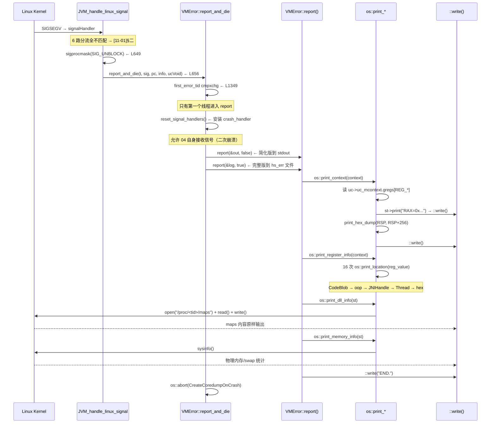

# 04-Crash — hs_err 文件中每一段 OS 层输出的生产者

> **阶段**：[11-os-layer]
> **前置**：[11-01-Signals]（崩溃信号来源）, [11-02-Threads]（线程栈信息）, [11-03-Memory]（maps 解析）, [10-services-diag]（VMError 框架）
> **依赖本文**：无（11 阶段最终篇——组合全阶段能力）
> **阅读收益**：理解 hs_err 文件中每一段 OS 层输出的生产者——寄存器 dump 如何从 ucontext_t 安全提取、寄存器值作为指针的解释如何防范二次崩溃、/proc/self/maps 的输出如何对应 reserve/commit 两阶段模型

---

## §〇 源文件清单（跨 os_cpu/linux_x86 + os/linux + utilities + runtime）

| # | 文件 | 完整路径 | 模块 | 核心函数/类（行号） | 本文角色 |
|---|------|---------|------|-------------------|---------|
| 1 | `os_linux_x86.cpp` | `src/hotspot/os_cpu/linux_x86/os_linux_x86.cpp` | os_cpu/linux_x86 | `os::print_context`(:770-833), `os::print_register_info`(:835-878), `ucontext_get_pc`(:116), `JVM_handle_linux_signal` 末尾 report_and_die(:638-660) | ★★★ 寄存器 dump——ucontext → 可读文本 |
| 2 | `os_linux.cpp` | `src/hotspot/os/linux/os_linux.cpp` | os/linux | `os::print_memory_info`(:2749-2767), `os::print_dll_info`(:2270-2281), `_print_ascii_file`(:2241-2261), `os::infinite_sleep`(:4761-4765) | ★★ crash 入口 + memory/maps 输出 |
| 3 | `vmError.cpp` | `src/hotspot/share/utilities/vmError.cpp` | utilities | `VMError::report_and_die` master(:1307-1634), `report()`(:417-1048), `print_stack_trace`(:195-229), `print_native_stack`(:231-264), STEP 宏(:419-422), `first_error_tid`(:1205), `recursive_error_count`(:1341) | ★★★ 崩溃报告框架——step 调度 + 反递归保护 |
| 4 | `vmError_posix.cpp` | `src/hotspot/os/posix/vmError_posix.cpp` | os/posix | `VMError::interrupt_reporting_thread`(:72-77), `crash_handler`(:107-143), `reset_signal_handlers`(:145-157) | ★★ POSIX 信号重置——二次崩溃保护 |
| 5 | `os.cpp` | `src/hotspot/share/runtime/os.cpp` | runtime | `os::print_location`(:1086-1229), `os::print_hex_dump`(:908-939), `os::is_readable_pointer`(:1063-1071) | ★★★ 地址解析——7 层检查 + hex dump |
| 6 | `decoder.cpp` | `src/hotspot/share/utilities/decoder.cpp` | utilities | `Decoder::get_source_info`(:135-137 stub), `DecoderLocker`(:81-92), `create_decoder`(:67-79) | ★ 符号化——DecoderLocker 的免锁设计 |
| 7 | `decoder_linux.cpp` | `src/hotspot/os/linux/decoder_linux.cpp` | os/linux | `ElfDecoder::demangle`(:31-52) | ★ 符号 demangle——`__cxa_demangle` |
| 8 | `ostream.cpp` | `src/hotspot/share/utilities/ostream.cpp` | utilities | `fdStream::write`(:604-610) | ★★ AS-safe 输出——`::write()` 系统调用 |
| 9 | `thread.cpp` | `src/hotspot/share/runtime/thread.cpp` | runtime | `Threads::print_on_error`(:5064), `JavaThread::print_on_error`(:3231) | ★★ 线程栈打印——依赖 [11-02] 的栈信息 |

**跨模块说明**：崩溃报告跨越 os_cpu/linux_x86、os/linux、os/posix、utilities、runtime 五个模块。`os_linux_x86.cpp:770` 的 `print_context` 和 `os_linux_x86.cpp:835` 的 `print_register_info` 是本阶段的关键 OS 函数——从 `ucontext_t` 提取数据并格式化输出。`vmError.cpp` 的 STEP 框架调度这些 OS 函数——VMError 在 utilities/ 中调用 os_cpu/ 中的函数——这是本阶段最远的跨模块调用。

---

### 凌晨 3 点——hs_err 中的神秘 si_addr=0x10

hs_err 文件里有这一行：

```
#  SIGSEGV (0xb) at pc=0x00007f8b1a3c4d21, pid=12463, tid=12494
#
# siginfo: si_signo: 11 (SIGSEGV), si_code: 1 (SEGV_MAPERR), si_addr: 0x0000000000000010
```

`Current thread` 是 `GCTaskThread`（GC 线程），`si_addr` 是 `0x10` 不是 `0x00`。用 `addr2line -e libjvm.so 0x1a3c4d21` → `G1ParScanThreadState::copy_to_survivor+0x61`。反汇编：

```asm
0x1a3c4d21:  mov    0x10(%rax), %rax
```

`Registers` 段显示 `RAX=0x00007f8b2c003c00`（合法堆指针），`RCX=0x0000000000000000`。仔细看前序指令——`RAX` 在 `mov %rcx, %rax` 后变成了 0x0 → `0x0 + 0x10 = 0x10 = si_addr`。真凶是 RAX 在两条指令之间被清零。

```
Register to memory mapping:

RAX=0x00007f8b2c003c00 is an oop
  [error occurred during error reporting (printing register info), id 0xb, SIGSEGV]
```

JVM 在解析 RAX 的过程中又 crash 了——**二次崩溃**被 `recursive_error_count` 检测到，打印了 `[error occurred during error reporting]`。`os::print_register_info` 在解引用 RAX 指向的对象时，对象 GC 位被损坏 → 嵌套 SIGSEGV → JVM 跳过此 step → 继续输出剩余内容。

**本文回答什么**：不是汇编教程（不讲 x86 ABI 的 rbp/rsp 角色）、不是 gdb 手册（不展开 ELF/DWARF 解析）。本文只关心 hs_err 文件中每一段 OS 层输出的生产者。寄存器 dump → `os::print_context`(:770)。寄存器作为指针的解释 → `os::print_register_info`(:835)。`/proc/self/maps` → `os::print_dll_info`(:2270)。系统内存信息 → `os::print_memory_info`(:2749)。PC 地址符号化 → `os::print_location`(:1086)。**关键是这些函数都在信号上下文中执行——怎么在只能用 `write()` 的约束下提取和输出数据？**

**和 [11-01]、[11-02]、[11-03]、[10-04] 的连接**：
- [11-01] 的信号链 → `JVM_handle_linux_signal:656` → `report_and_die` 是 04 的入口
- [11-02] 的线程模型 → hs_err 的线程栈打印依赖 `record_stack_base_and_size`
- [11-03] 的内存映射 → hs_err 的 Memory map 段中的 `---p` = reserve, `rw-p` = commit
- [10-04] 的 VMError 框架 → 本文是 [10-04] 的 OS 端补完

---

## §一 ★★★ 为什么 hs_err 能打印寄存器但不能打印线程名？

### 1.1 寄存器值——从 ucontext_t 零系统调用读取

寄存器值直接从 `ucontext_t` 结构体读取——这是内核在信号投递时通过 `setup_rt_frame` 压到用户栈上的。**零系统调用、零 malloc、零锁**。

`os_linux_x86.cpp:770-798`：

```cpp
void os::print_context(outputStream *st, const void *context) {
    if (context == NULL) return;
    const ucontext_t *uc = (const ucontext_t*)context;
    st->print_cr("Registers:");
#ifdef AMD64
    st->print(  "RAX=" INTPTR_FORMAT, (intptr_t)uc->uc_mcontext.gregs[REG_RAX]);
    st->print(", RBX=" INTPTR_FORMAT, (intptr_t)uc->uc_mcontext.gregs[REG_RBX]);
    st->print(", RCX=" INTPTR_FORMAT, (intptr_t)uc->uc_mcontext.gregs[REG_RCX]);
    st->print(", RDX=" INTPTR_FORMAT, (intptr_t)uc->uc_mcontext.gregs[REG_RDX]);
    // ... RSP, RBP, RSI, RDI, R8-R15 ...
    st->print(  "RIP=" INTPTR_FORMAT, (intptr_t)uc->uc_mcontext.gregs[REG_RIP]);
    st->print(", EFLAGS=" INTPTR_FORMAT, (intptr_t)uc->uc_mcontext.gregs[REG_EFL]);
```

每个寄存器值以 `INTPTR_FORMAT` 格式化为 16 进制。16 个通用寄存器 + RIP + EFLAGS + CSGSFS + ERR + TRAPNO ≈ 24 个寄存器。`st->print` 最终通过 `fdStream::write` → `::write()` 输出——全程无系统调用（除了最后的 write）。

### 1.2 线程名为什么不能打印？

线程名需要 `pthread_getname_np(pthread_self(), buf, size)` → 内部持有 glibc 的 `__thread_list_lock`。如果 JVM 在持有该锁时崩溃 → 二次调用 `pthread_getname_np` → **死锁**。

这就是为什么 hs_err 的 `Current thread` 行只显示 `Thread*` 指针值和栈范围——不显示线程名：

```
Current thread (0x00007f8b24083800):  GCTaskThread "G1 Young RemSet Sampling"
  [stack: 0x00007f8b1ebfb000,0x00007f8b1ecfe000] [id=12494]
```

`"G1 Young RemSet Sampling"` 来自 `JavaThread::_name`——JVM 自维护的字符串，直接从内存读取——不调 `pthread_getname_np`。

### 1.3 ★ hs_err 输出段 → OS 函数映射表

| hs_err 段 | STEP 名 | OS 函数 | 行号 | 系统调用/机制 | AS-safe 分析 |
|-----------|---------|---------|------|-------------|-------------|
| header (signal, pid, tid) | "printing current thread" | `VMError::report` → `error_string` | vmError.cpp:561 | `os::current_thread_id` → `syscall(SYS_gettid)` | ✅ 纯 syscall |
| problematic frame | "printing problematic frame" | `os::fetch_frame_from_context` → `Decoder::decode` | vmError.cpp:583 | dladdr/dlsym | ✅ DecoderLocker 免锁 |
| registers (RAX-R15, RIP) | "printing registers" | `os::print_context` | os_linux_x86.cpp:770 | 读 ucontext_t（零 syscall） | ✅ 纯内存读 |
| top of stack hex | (在 print_context 内) | `os::print_hex_dump` | os.cpp:908 | `is_readable_pointer` → SafeFetch32 | ⚠️ SafeFetch 可能二次 SEGV |
| instructions at pc | (在 print_context 内) | `print_instructions` | os_linux_x86.cpp:829 | `is_readable_pointer` → SafeFetch32 | ⚠️ 同上 |
| register to memory mapping | "printing register info" | `os::print_register_info` → `os::print_location` | os_linux_x86.cpp:835, os.cpp:1086 | is_readable_pointer → 7 层检查 | ⚠️ oop 解引用可能 SEGV |
| native stack | "printing native stack" | `print_native_stack` → frame walk | vmError.cpp:231 | frame pointer chain → Decoder::get_source_info | ✅ Decoder 已预加载 |
| Java stack | "printing Java stack" | `print_stack_trace` → `StackFrameStream` | vmError.cpp:195 | 读 Java frame 数据 | ✅ JIT metadata 在内存中 |
| dynamic libraries (maps) | "printing dynamic libraries" | `os::print_dll_info` → `_print_ascii_file` | os_linux.cpp:2270 | `open()+read()+write()+close()` | ✅ AS-safe syscalls |
| memory info | "printing memory info" | `os::print_memory_info` | os_linux.cpp:2749 | `sysinfo()` | ✅ AS-safe syscall |
| end marker | "printing end marker" | st->print_cr("END.") | vmError.cpp:1037 | ::write() | ✅ |

### 1.4 崩溃报告序列图



---

## §二 ★★★ os::print_context — 从 ucontext 提取寄存器

### 2.1 x86_64 的 ucontext 结构

`os_linux_x86.cpp:770-833`。`ucontext_t` 的 `uc_mcontext.gregs[]` 是一个寄存器数组——按 x86-64 的 reg 编号索引：

```
REG_RAX=0, REG_RBX=1, REG_RCX=2, REG_RDX=3,
REG_RSP=4, REG_RBP=5, REG_RSI=6, REG_RDI=7,
REG_R8=8, REG_R9=9, REG_R10=10, REG_R11=11,
REG_R12=12, REG_R13=13, REG_R14=14, REG_R15=15,
REG_RIP=16, REG_EFL=17, REG_CSGSFS=18, REG_ERR=19,
REG_TRAPNO=20, REG_OLDMASK=21, REG_CR2=22
```

`ucontext_get_pc`（`os_linux_x86.cpp:116`）：

```cpp
address os::Linux::ucontext_get_pc(const ucontext_t * uc) {
  return (address)uc->uc_mcontext.gregs[REG_PC];
}
```

`ucontext_set_pc`（`:120-122`）用于 stub 跳转——不用于 crash 报告：

```cpp
void os::Linux::ucontext_set_pc(ucontext_t * uc, address pc) {
  uc->uc_mcontext.gregs[REG_PC] = (intptr_t)pc;
}
```

### 2.2 三个子输出

`print_context` 产生三个子输出：

**(1) Registers line**（`:774-798`）：16 个 GP 寄存器 + RIP + EFLAGS + CSGSFS + ERR + TRAPNO——一行格式化。`print_hex_dump` → 零系统调用（直到 st->print）。

**(2) Top of Stack**（`:812-816`）：

```cpp
intptr_t *sp = (intptr_t *)os::Linux::ucontext_get_sp(uc);
st->print_cr("Top of Stack: (sp=" PTR_FORMAT ")", p2i(sp));
print_hex_dump(st, (address)sp, (address)(sp + 8), sizeof(intptr_t));
```

从 `RSP` 开始的 16×8 字节 hex dump——通常能找到返回地址和函数参数。`print_hex_dump` 内部使用 `is_readable_pointer` guard → 如果栈地址不可读 → 输出 `????????` 而非 crash。

**(3) Instructions near PC**（`:827-829`）：

```cpp
address pc = os::Linux::ucontext_get_pc(uc);
print_instructions(st, pc, sizeof(char));
st->cr();
```

从 RIP 附近的 16 字节 hex dump——显示崩溃点的机器码字节（不是反汇编——只是 raw hex）。注释指出 "unsafe to inspect memory near pc"——放在最后。

### 2.3 ★ x86 vs ARM 的 ucontext 寄存器对照

| x86_64 | ARM64 (AArch64) | 角色 |
|--------|-----------------|------|
| RAX | X0 | 返回值 / scratch |
| RBX | X19 | callee-saved 通用 |
| RCX | X1 | 第 2 参数 / scratch |
| RDX | X2 | 第 3 参数 / scratch |
| RSP | SP (X31 或专用 SP) | 栈顶指针 |
| RBP | X29 (FP) | 帧指针 |
| RSI | X3 | 第 4 参数 |
| RDI | X4 | 第 5 参数 |
| R8-R15 | X5-X7, X9-X15 | 参数 / scratch / callee-saved |
| RIP | PC | 指令指针 |
| EFLAGS | PSTATE (NZCV...) | 条件标志 |
| — | X30 (LR) | 链接寄存器（返回地址） |

ARM 的特有寄存器：`X30 (LR)` 保存返回地址（x86 的返回地址在 `[RSP]` 栈中）、`X29 (FP)` 是帧指针——和 x86 的 `RBP` 是同一概念但在不同的寄存器编号上。

不同 `os_cpu/<arch>/` 目录有各自的 `print_context` 实现——模式相同（读 `uc_mcontext.regs[i]` → 输出），差异只在寄存器名和 frame pointer convention。

---

## §三 ★★ os::print_register_info — 寄存器值作为指针的解释

### 3.1 print_location 的 7 层检查链

`os_linux_x86.cpp:835-878` 对每个寄存器调 `os::print_location`（`os.cpp:1086-1229`）：

```cpp
st->print("RAX="); print_location(st, uc->uc_mcontext.gregs[REG_RAX]);
st->print("RBX="); print_location(st, uc->uc_mcontext.gregs[REG_RBX]);
// ... 16 个 GP 寄存器全部
```

`os::print_location` 的检查链：

```
Layer 1: NULL → "0x0 is NULL"                                         L1089
Layer 2: CodeCache::find_blob_unsafe(addr) → CodeBlob → dump_for_addr L1094
Layer 3: Universe::heap()->is_in(addr) → oop_print → "is an oop"      L1101
Layer 4: JNIHandles::is_global_handle / is_local_handle               L1135
Layer 5: Metaspace::contains → Klass / Method                           L1182
Layer 6: 遍历所有 JavaThread → 检查是否位于栈中                        L1153
Layer 7: is_readable_pointer → print_hex_dump → "is an unknown value"  L1216
```

**Layer 2 (CodeBlob)** 的 dump：如果地址在 CodeCache 内 → `CodeBlob::dump_for_addr` 输出 "StubRoutines::xxx" 或 "nmethod for com.example.Foo::bar"。不需要安全读取——CodeCache 是连续的 mmap 且一直有效。

**Layer 3 (oop)** 的风险：`Universe::heap()->is_in(addr)` 检查地址是否在堆范围内——但地址所在的对象可能已损坏（GC 正在移动）→ 解引用触发 SIGSEGV → 二次崩溃。

### 3.2 ★ README §八 问题 2: 野指针解引用——怎么保护？

`os::print_hex_dump`（`os.cpp:908-939`）在解引用前调 `is_readable_pointer(p)`：

```cpp
while (p < end) {
    if (is_readable_pointer(p)) {
        st->print("%02x", *(u1*)p);      // 安全——已验证可读
    } else {
        st->print("????????????????");   // 不可读 → 输出 ?? 而非 crash
    }
    p += unitsize;
}
```

`is_readable_pointer`（`os.cpp:1063-1071`）使用 `SafeFetch32` 机制：

```cpp
bool os::is_readable_pointer(const void* p) {
  int* const aligned = (int*) align_down((intptr_t)p, 4);
  int cafebabe = 0xcafebabe;
  int deadbeef = 0xdeadbeef;
  return (SafeFetch32(aligned, cafebabe) != cafebabe) || (SafeFetch32(aligned, deadbeef) != deadbeef);
}
```

`SafeFetch32` 是一条特制 `mov` 指令——如果触发 SIGSEGV → JVM 的 `SafeFetch` handler 返回默认值（cafebabe/deadbeef）而非 abort。两个不同测试模式防止巧合（地址正好包含 cafebabe 或 deadbeef）。

**但不能完全防御**：地址在有效 VMA 内但页不可读（PROT_NONE 的 reserve 区域）→ SafeFetch 捕获 SIGSEGV → 返回默认值 → `is_readable_pointer` 返回 false → 输出 `??`。如果地址是损坏的 oop（在堆范围内但对象不可安全解引用）→ `print_location` 不走 `print_hex_dump` 的 guard → 直接解引用 oop → 可能 SIGSEGV → `recursive_error_count++`。

### 3.3 ★ 二次崩溃的检测——recursive_error_count

`vmError.cpp:1341`：

```cpp
static int recursive_error_count;
```

`report_and_die` 的入口（`:1421-1427`）：

```cpp
if (recursive_error_count++ > 30) {
    out.print_raw_cr("[Too many errors, abort]");
    os::die();
}
```

STEP 宏的恢复逻辑（`:419-422`）：

```cpp
#define STEP(s) } if (_current_step < __LINE__) { _current_step = __LINE__; _current_step_info = s; \
    record_step_start_time(); _step_did_timeout = false;
```

`_current_step` 记录上次完成 step 的 `__LINE__`——如果二次崩溃 → 重新进入 `report()` → `_current_step < __LINE__` 条件使已完成 step 被跳过 → 只从上次崩溃的 step 之后继续输出。

**三次崩溃机制**：

```
首次崩溃 (recursive_error_count=0):
  _current_step 推进 → 执行所有 STEP

print_register_info 中解引用野指针 → 二次 SIGSEGV:
  crash_handler 捕获 → re-entrant report_and_die
  recursive_error_count=1 → 跳过已完成 STEP (通过 _current_step < __LINE__)
  从 "printing register info" STEP 重新开始
  跳过 print_register_info 本身 → 继续后续 STEP

如果后续又崩 → recursive_error_count=2 → 继续跳过 → ... 
超过 30 次 → os::die() — 直接杀进程，不生成 hs_err
```

### 3.4 [error occurred during error reporting] 的含义

当 `recursive_error_count > 0` 时，report 的二次进入入口（vmError.cpp:1440-1478）输出：

```
[error occurred during error reporting (printing register info), id 0xb, SIGSEGV]
```

告诉读者两件事：(1) 哪个 STEP 出了问题；(2) 什么问题（信号类型）。**这不是 JVM bug**——是 print_register_info 遇到损坏对象时递归 SIGNAL 被 `recursive_error_count` 捕获并优雅降级。

### 3.5 print_location 的 5 层检查流程图

```mermaid
flowchart TD
    A[os::print_location::st, addr] --> B{addr == NULL?}
    B -->|Yes| C["0x0 is NULL"]
    B -->|No| D{CodeCache::find_blob_unsafe}
    D -->|found| E["is a CodeBlob at 0x... / nmethod for ..."]
    D -->|not found| F{Universe::heap()->is_in}
    F -->|in heap| G["is an oop: class=..., mark=..."]
    G -.->|"oop corrupt → SIGSEGV ⚠️"| X["[error occurred during error reporting]"]
    F -->|not in heap| H{is_readable_pointer?}
    H -->|yes| I{JNIHandles::is_*_handle?}
    I -->|yes| J["is a global/local jni handle"]
    I -->|no| K{Metaspace::contains?}
    K -->|yes| L["is a Klass/Method"]
    K -->|no| M{in any JavaThread stack?}
    M -->|yes| N["points into the stack of thread: 0x..."]
    M -->|no| O[print_hex_dump: raw bytes]
    H -->|no| P["is an unknown value"]

    style X fill:#FF6B6B
    style E fill:#90EE90
    style G fill:#90EE90
```

---

## §四 ★★ JVM_handle_linux_signal → report_and_die 的过渡

### 4.1 ★ 从信号分流失败到崩溃报告的完整链

[11-01] §二 的 8 路分流都不匹配 → `os_linux_x86.cpp:631-656`：

```cpp
    // 信号不可识别——所有分流路径都不匹配
    if (!abort_if_unrecognized) {
        return false;
    }

    if (pc == NULL && uc != NULL) {
        pc = os::Linux::ucontext_get_pc(uc);
    }

    sigset_t newset;
    sigemptyset(&newset);
    sigaddset(&newset, sig);
    sigprocmask(SIG_UNBLOCK, &newset, NULL);

    VMError::report_and_die(t, sig, pc, info, ucVoid);
```

**三个准备动作**：

(1) **PC 补全**：如果 pc 为 NULL（调用方未提供）→ 从 `ucontext_t` 用 `ucontext_get_pc` 提取。
(2) **信号解禁**：`sigprocmask(SIG_UNBLOCK)` —— `signalHandler` 被调用时内核自动屏蔽了当前信号。如果 report 过程中再次发生相同信号 → 解禁后可以递归触发 → `recursive_error_count` 机制处理。
(3) **传入完整上下文**：`t` (Thread*)、`sig`、`pc`、`info` (siginfo_t*)、`ucVoid` (ucontext_t*)——report_and_die 从中提取所有诊断信息。

### 4.2 abort_if_unrecognized 的双重语义

`signalHandler`（`os_linux.cpp:5221-5226`）硬编码传 `true`：

```cpp
static void signalHandler(int sig, siginfo_t *info, void *uc) {
    int orig_errno = errno;
    JVM_handle_linux_signal(sig, info, uc, true);  // ★ 硬编码 true
    errno = orig_errno;
}
```

`true` = "我来自 JVM handler → 处理不了就 crash"。`false` = "试试看 JVM 能不能处理——不能就算了"——留给 JVMTI agent 通过 `os::Linux::signal_handlers_are_installed` 门禁后间接触发。

### 4.3 ★ README §八 问题 3: report_and_die 内部又 SIGSEGV——怎么检测递归？

**first_error_tid 的 cmpxchg**（vmError.cpp:1349-1351）：

```cpp
intptr_t mytid = os::current_thread_id();
if (first_error_tid == -1 &&
    Atomic::cmpxchg(mytid, &first_error_tid, (intptr_t)-1) == -1) {
    // 我是第一个进入的线程——执行 report
```

如果 cmpxchg 失败 → 另一个线程已在生成 hs_err → 当前线程进入 `else` 分支：

```cpp
} else {
    if (first_error_tid != mytid) {
        os::infinite_sleep();   // ← 不同线程：永久休眠
    } else {
        // 同一线程的递归进入
        if (recursive_error_count++ > 30) {
            out.print_raw_cr("[Too many errors, abort]");
            os::die();
        }
        // ... STEP skip logic based on _current_step ...
    }
}
```

`os::infinite_sleep`（`os_linux.cpp:4761-4765`）：

```cpp
void os::infinite_sleep() {
    while (true) { ::sleep(100); }
}
```

**双重防递归**：
- `first_error_tid` cmpxchg：防止多个线程同时生成 hs_err——只有第一个线程写入文件
- `recursive_error_count` + `_current_step` skip：同一线程的嵌套崩溃 → 跳过已完成 step → 只从上次崩溃之后继续

---

## §五 ★★★ report_and_die 的 STEP 框架 — OS 层视角

### 5.1 [10-04] 的关系——扩展而非重复

[10-04] §三 详细解释了 STEP 宏的 `__LINE__` 机制。本文不重复——聚焦 OS 实现层：

| STEP (vmError.cpp) | OS 函数 | 为什么用这个而非其他 |
|---|---|---|
| "printing current thread" (L561) | `os::current_thread_id()` → `syscall(SYS_gettid)` | 不调 `pthread_self()`——信号安全 |
| "printing register info" (L758) | `os::print_register_info` → `os::print_location` | 16 次 address→语义映射 |
| "printing registers" (L766) | `os::print_context` → 读 ucontext | 24 寄存器 + 栈 hex + 指令 hex |
| "printing native stack" (L710) | `print_native_stack` → frame walk → `Decoder::get_source_info` | 跟随 frame pointer chain |
| "printing Java stack" (L724) | `print_stack_trace` → `StackFrameStream` | 读 Java frame 元数据 |
| "printing dynamic libraries" (L935) | `os::print_dll_info` → `_print_ascii_file` | 读 /proc/<tid>/maps——不是 `fopen` |
| "printing memory info" (L1023) | `os::print_memory_info` → `sysinfo()` | 物理内存/swap 统计 |
| "printing end marker" (L1037) | st->print_cr("END.") | 标记报告完整 |

### 5.2 ★ README §八 问题 1: Decoder 触发 demand paging → AS-safe 吗？

`Decoder::get_source_info`（`decoder.cpp:135-137`）在 Linux 上是 **stub——总是返回 false**：

```cpp
bool Decoder::get_source_info(address pc, char* buf, size_t buflen, int* line) {
  return false;
}
```

Linux 上 `get_source_info`（源文件和行号解析）未实现。**真正的符号解析路径**通过 `DecoderLocker` → `AbstractDecoder::decode`（ElfDecoder）→ `dladdr()`：

```cpp
// decoder.cpp:81-92 (DecoderLocker)
DecoderLocker::DecoderLocker() :
  MutexLockerEx(DecoderLocker::is_first_error_thread() ?
                NULL : Decoder::shared_decoder_lock(),  // ★ 崩溃线程不持锁
                Mutex::_no_safepoint_check_flag) {
  _decoder = is_first_error_thread() ?
    Decoder::get_error_handler_instance() : Decoder::get_shared_instance();
}
```

**免锁设计**：如果调用者是崩溃线程 → 传 `NULL` 给 `MutexLockerEx`（不持锁）→ 使用独立的 `_error_handler_decoder` 实例。避免从持有 `shared_decoder_lock` 的代码中崩溃导致死锁。

符号信息已通过 `dlopen` 时预加载到内存——不触发磁盘 I/O。所以 **demand paging 在 crash 路径上通常不被触发**。

### 5.3 check_timeout 的超时保护

`vmError.cpp:1697-1738`——由 WatcherThread 周期性调用。如果 report 超时 → `_reporting_did_timeout = true` → `interrupt_reporting_thread` → `pthread_kill(reporter_thread_id, SIGILL)`：

```cpp
// vmError_posix.cpp:72-77
void VMError::interrupt_reporting_thread() {
  ::pthread_kill(reporter_thread_id, SIGILL);
}
```

`reset_signal_handlers` 安装了 `crash_handler` 捕获 SIGILL——它调用 `VMError::report_and_die` 再次进入 → 命中 `_reporting_did_timeout` 分支 → 输出超时消息 → 调用 `os::infinite_sleep()` 或 `os::die()`。

---

## §六 ★★ hs_err 的 Memory map 段 — 和 [11-03] 的连接

### 6.1 ★ maps 段的 heap 识别

`os::print_dll_info`（`os_linux.cpp:2270-2281`）：

```cpp
void os::print_dll_info(outputStream *st) {
    st->print_cr("Dynamic libraries:");
    char fname[32];
    pid_t pid = os::Linux::gettid();
    jio_snprintf(fname, sizeof(fname), "/proc/%d/maps", pid);
    if (!_print_ascii_file(fname, st)) {
        st->print("Can not get library information for pid = %d\n", pid);
    }
}
```

`_print_ascii_file`（`os_linux.cpp:2241-2261`）——全 AS-safe syscall 链：

```cpp
static bool _print_ascii_file(const char *filename, outputStream *st, ...) {
    int fd = ::open(filename, O_RDONLY);   // AS-safe syscall
    // ...
    char buf[33];
    buf[32] = '\0';
    while ((bytes = ::read(fd, buf, sizeof(buf) - 1)) > 0) {  // AS-safe syscall
        st->print_raw(buf, bytes);         // → fdStream::write → ::write()
    }
    ::close(fd);                           // AS-safe syscall
}
```

不是 `fopen()` → 没有 `FILE*` 锁 → 信号安全。

### 6.2 [11-03] 的 reserve→commit 在 maps 中的可视化

```
[11-03] 四态生命周期              hs_err memory map 段
─────────────────────────────    ─────────────────────────
RESERVE: mmap(PROT_NONE,          ---p ... [heap reserved]
         MAP_NORESERVE)           ★ PROT_NONE = 不可读写

COMMIT: mmap(PROT_RW,             rw-p ... [heap committed]
        MAP_FIXED)                ★ PROT_READ|PROT_WRITE = 可读写

UNCOMMIT: mmap(PROT_NONE,          ---p ... [heap reserved]
          MAP_FIXED|MAP_NORESERVE) ★ 回到 PROT_NONE——但地址范围仍在

RELEASE: munmap()                 ★ 此行从 maps 中消失
```

从 hs_err 的 maps 段一眼能看出 reserve 了多大、commit 了多大：
- `---p` 段的总地址差 = reserved
- `rw-p` 段的总地址差 = committed
- 两者之差 = 未 commit 区域（RSS=0）

### 6.3 os::print_memory_info 的 sysinfo

`os_linux.cpp:2749-2767`：

```cpp
void os::print_memory_info(outputStream *st) {
    st->print("Memory:");
    st->print(" %dk page", os::vm_page_size() >> 10);
    struct sysinfo si;
    sysinfo(&si);
    st->print(", physical " UINT64_FORMAT "k",
              os::physical_memory() >> 10);
    st->print("(" UINT64_FORMAT "k free)",
              os::available_memory() >> 10);
    st->print(", swap " UINT64_FORMAT "k",
              ((jlong) si.totalswap * si.mem_unit) >> 10);
    st->print("(" UINT64_FORMAT "k free)",
              ((jlong) si.freeswap * si.mem_unit) >> 10);
    st->cr();
}
```

`sysinfo()` 是 AS-safe syscall——返回 totalram、freeram、totalswap、freeswap。这是 hs_err 中 "OS: ... Memory: 4k page, physical 32768000k(3281832k free), swap 0k(0k free)" 行的来源。

---

## §七 ★★ print_native_stack — 信号上下文中的栈遍历

### 7.1 native 栈怎么遍历

`vmError.cpp:231-264`：

```cpp
void VMError::print_native_stack(outputStream* st, frame fr, Thread* t, ...) {
    int count = 0;
    while (count++ < StackPrintLimit) {
        fr.print_on_error(st, buf, buf_size);
        if (fr.pc()) {
            char buf[128];
            int line_no;
            if (Decoder::get_source_info(fr.pc(), buf, sizeof(buf), &line_no)) {
                st->print("  (%s:%d)", buf, line_no);
            }
        }
        st->cr();
        // frame walking via sender_for_c_frame
    }
}
```

`os::get_sender_for_C_frame(&fr)` 跟随 frame pointer chain。如果 `-fomit-frame-pointer`（x86-64 上 rbp 被重用为通用寄存器）→ chain 断裂 → 只能解当前帧 → 输出 "..."。

[11-02] §三 的 `record_stack_base_and_size`（`:888`）记录了栈基址——frame walk 用它检查栈边界：如果 sender frame 不在 `[stack_base - stack_size, stack_base]` 内 → 停止遍历。

### 7.2 ★ README §八 问题 4: Instructions hex dump 不是反汇编

`os::print_hex_dump` 输出的是 raw hex 字节——不是反汇编。`os_linux_x86.cpp:824` 的 `print_instructions` 也是 hex dump（不是反汇编器）。

如果需要真正的反汇编 → 需要 hsdis 插件（`-XX:+PrintAssembly`）或 gdb。hsdis 通过 `dlopen("hsdis-amd64.so")` 加载——但在信号上下文中 `dlopen` 不安全（需要 dynamic linker 锁 + 可能触发 mmap）→ 所以 hs_err **不反汇编**。

**读者需要用 `objdump -d libjvm.so | grep -A 5 <offset>` 自行反汇编。** 这是 §〇 凌晨 3 点场景中 `addr2line -e libjvm.so 0x1a3c4d21` 的工作原理。

---

## §八 ★★★ 和 [11-01] + [11-02] + [11-03] + [10-04] 的全局连接

### 8.1 [11-01] → JVM_handle_linux_signal:656 → 崩溃入口

[11-01] §二 的 6 路分流在 `os_linux_x86.cpp:309-533` 执行。全不匹配 → 走到 L631 的 `chained_handler` → 如果链上没有 handler → `abort_if_unrecognized==true` → `report_and_die`。这建立了"信号不可识别 → crash"的连接线。

### 8.2 [11-02] → thread stack print → record_stack_base_and_size

[11-02] §三 的 `thread_native_entry:888` 调用 `record_stack_base_and_size`——记录的 `stack_base` 和 `stack_size` 用于 hs_err 的栈边界检查。`Current thread` 行的 `[stack: 0x...,0x...]` 来自 [11-02] 的记录值。

### 8.3 [11-03] → reserve/commit → hs_err 的 maps 解析

[11-03] §一 的 reserve→commit 四态在 maps 中的可视化——`---p` = reserve, `rw-p` = commit——见本文 §六.2。

### 8.4 [10-04] → VMError::report_and_die + _steps[] → OS 函数调用

[10-04] §三 的 STEP 宏框架——`_current_step` / `__LINE__` 机制——本文 §五 提供 OS 实现映射。10-04 讲"怎么调用"，11-04 讲"在什么约束下工作"。

### 8.5 ★ 11-os-layer README §五 阶段对比表

本文的"崩溃诊断"是 11 阶段 OS 三原语的最终出口——它组合了 01 的信号链（崩溃来源）、02 的线程模型（栈打印）、03 的内存映射（maps 输出）、以及 10-04 的 VMError 框架（step 调度）。读者读完本文后应能完整追踪"从 SEGSEGV 到 hs_err 文件的最后一行"。

---

## §九 GDB 验证 + 可证伪断言

### 断言 1：`os::print_context` 从 ucontext_t 读寄存器——零系统调用

```bash
(gdb) br os_linux_x86.cpp:770
# 触发 SIGSEGV（如 *(volatile int*)0xdeadbeef = 0）
(gdb) bt
# 调用栈底是 __restore_rt（内核信号返回 frame）
(gdb) stepi
# 单步执行 print_context 内部
(gdb) !strace -p <pid> 2>&1 | head -5
# 预期: 无 read/write/mmap 系统调用（只有最后的 write）
```

### 断言 2：`os::print_register_info` 可能触发二次 SIGSEGV

```bash
(gdb) br os_linux_x86.cpp:835
# 构造场景让 RAX 指向 PROT_NONE 区域
(gdb) p/x uc->uc_mcontext.gregs[REG_RAX]
# 设为未 commit 区域的地址
(gdb) n
# 单步到 os::print_location(rax) 内——可能触发 SIGSEGV
# 预期: recursive_error_count 从 0 → 1
```

### 断言 3：`recursive_error_count > 30` 时直接 `os::die()`

```bash
(gdb) br vmError.cpp:1424   # recursive_error_count > 30 的 die 调用
(gdb) set recursive_error_count = 30
# 触发 SIGSEGV
# 预期: 断点命中 → os::die() 被调用
```

### 断言 4：`first_error_tid` 的 cmpxchg 保证只有一个线程生成 hs_err

```bash
(gdb) br os_linux_x86.cpp:656   # report_and_die 调用前
# 两个线程同时断
(gdb) br vmError.cpp:1349       # cmpxchg 处
# 第一个线程 cmpxchg 成功 → 执行 report
# 第二个线程 cmpxchg 失败 → 进入 infinite_sleep
(gdb) info threads
# 预期: 第二个线程状态 = "sleeping"
```

### 断言 5：`os::print_dll_info` 用 open()/read()/write() 而非 fopen()

```bash
(gdb) br os_linux.cpp:2275   # _print_ascii_file 调用
(gdb) stepi
# 进入 _print_ascii_file
(gdb) !strace -p <pid> 2>&1 | grep -E "open|read|write"
# 预期: open("/proc/<tid>/maps", O_RDONLY) + read() + write()
# 预期: 无 fopen / fread 调用
```

### 断言 6：`os::print_location` 把寄存器解析为 CodeBlob

```bash
(gdb) br os.cpp:1094   # CodeCache::find_blob_unsafe 调用
# 在 CompilerThread 上触发 SIGSEGV
(gdb) p/x addr
# 预期: addr 在 CodeCache 范围内
(gdb) n
# 预期: b != NULL → CodeBlob::dump_for_addr 被调用
```

### 断言 7：`os::print_location` 把寄存器解析为 oop

```bash
(gdb) br os.cpp:1101   # Universe::heap()->is_in(addr) 调用
# 在 JavaThread 上触发 SIGSEGV
(gdb) p/x addr
# 预期: addr 在堆范围内
(gdb) n
# 单步进入 oopDesc::oop_or_null
```

### 断言 8：`print_native_stack` 在 rbp 优化掉时只有一帧

```bash
# 编译 libjvm.so 加 -fomit-frame-pointer
(gdb) br vmError.cpp:246   # os::get_sender_for_C_frame 调用
# 触发 SIGSEGV
(gdb) n
# 预期: sender frame 可能为 NULL → 退出循环 → 只有 1 帧
```

### 断言 9：`os::print_memory_info` 通过 sysinfo() 获取系统内存

```bash
(gdb) br os_linux.cpp:2754   # sysinfo 调用
# 触发 SIGSEGV
(gdb) stepi
# 进入 sysinfo()
(gdb) p si.totalram
# 预期: ≈ 物理内存 / mem_unit
```

### 断言 10：`JVM_handle_linux_signal` 的 chained_handler 返回 false 后才调 report_and_die

```bash
(gdb) br os_linux.cpp:5301   # chained_handler 入口
(gdb) br os_linux_x86.cpp:656  # report_and_die 调用
# 发送无法识别的信号
# 预期: 先命中 5301 → chained_handler 返回 false → 再命中 656
```

### 断言 11：hs_err 输出期间 write() 可能被中断导致最后几行缺失

```bash
(gdb) br vmError.cpp:1037   # STEP "printing end marker"
# 在此 step 中触发 crash（如发送 SIGKILL）
# 预期: hs_err 文件缺少 "END." —— 最后一个 step 未完成
```

### 断言 12：`_current_step` skip 机制在二次崩溃中生效

```bash
(gdb) br vmError.cpp:601    # STEP "printing current thread" 入口
# 构造第一次崩溃 → 到达某个 STEP 中段 → 构造二次崩溃
(gdb) p _current_step
# 预期: _current_step = 上次完成的 __LINE__
# 继续执行 → 已完成的 STEP 被跳过
# 预期: 从上次崩溃的 STEP 之后重新开始
```

### 断言 13：reset_signal_handlers 安装的 crash_handler 正确捕获嵌套 SIGSEGV

```bash
(gdb) br vmError_posix.cpp:107  # crash_handler 入口
# 在 report 内部触发 SIGSEGV
# 预期: 断点命中（而非 JVM abort）
(gdb) bt
# 预期: crash_handler → re-entrant VMError::report_and_die
```

---

## 核心发现总结

| # | 发现 | 核心洞察 |
|---|------|--------|
| 1 | **寄存器值从 ucontext_t 零系统调用读取** | 内核在 `setup_rt_frame` 时就压栈了完整寄存器状态——JVM 只读不调任何 syscall |
| 2 | **线程名不能用 pthread_getname_np** | 需要 glibc 内部锁——如果 JVM 在持有锁时崩溃 → 死锁 |
| 3 | **print_register_info 可能触发二次 SIGSEGV** | oop 解引用路径没有 is_readable_pointer guard → JVM 接受这个风险并依赖 recursive_error_count 降级 |
| 4 | **first_error_tid cmpxchg + recursive_error_count 形成双层防递归** | 线程间用 cmpxchg（只有一个线程生成 hs_err）、线程内用 _current_step skip 跳过已完成 STEP |
| 5 | **DecoderLocker 在崩溃线程中不持锁** | 传 NULL 给 MutexLockerEx + 使用独立的 decoder 实例——避免在信号上下文中抢锁 |
| 6 | **_print_ascii_file 用 open/read/write/close——不是 fopen** | 全 AS-safe syscall 链——无 FILE* 锁 |
| 7 | **hs_err 的 Instructions hex dump 不是反汇编** | 只是 raw hex 字节——真正的反汇编需要 objdump -d 或 hsdis 插件 |
| 8 | **check_timeout 用 pthread_kill(SIGILL) 中断 reporter** | WatcherThread 检测超时 → 发 SIGILL → crash_handler 捕获 → 超时降级 |
| 9 | **maps 段的 ---p / rw-p 直接对应 [11-03] 的 reserve/commit** | 一眼看出 reserve 多大、commit 多大——无需 pmap |
| 10 | **[10-04] 的框架 + 本文的 OS 实现 = hs_err 的完整生成链路** | 10-04 讲 STEP 调度和 outputStream 信号安全——本文补上每个 STEP 背后的 OS 数据源 |
