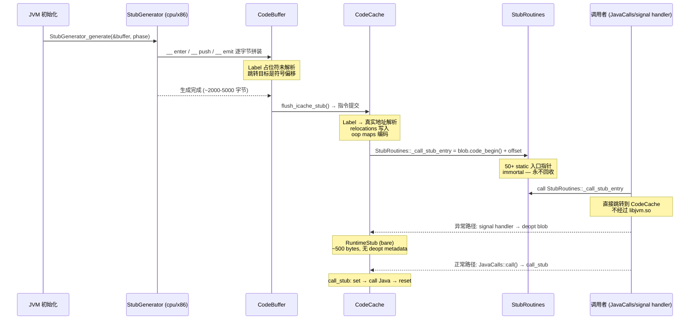

# 03-Stubs — JVM 运行时动态生成的"暗物质"：deopt blob 帧重建、call_stub 三明治结构、safepoint slow path 与异常分发

> **阶段**：[12-cpu-layer]
> **前置**：[12-01] Frames（帧布局是 deopt 帧重建的基础 + call_stub 的帧锚点）, [12-02] Interpreter（deopt 需要理解解释器帧格式 + 解释器 dispatch 是 deopt 后的执行者）, [11-os-layer]（信号→ stub 接力）, [09-native-interface]（JNI wrapper 的状态切换）, [08-safepoint]（safepoint poll 的慢路径）
> **依赖本文**：无（本阶段最后写——结合全部前置的输出）
> **阅读收益**：理解 JVM 运行时动态生成的所有 stub 机器码——deopt blob 如何从 C2 编译帧拆解回解释器帧（~5000-10000 cycles）、call_stub 如何用三明治结构（set/call/reset）完成 C→Java 调用、exception stub 如何逐帧 unwind + ExceptionCache 查找 handler、safepoint slow path 如何从 testb+jne 到 SafepointSynchronize::block

---

## §〇 源文件清单（跨 cpu/x86 + runtime，标注模块归属和每个文件在 stub 生成中的角色）

| # | 文件 | 完整路径 | 模块 | 核心函数/类（已验证行号） | 本文角色 |
|---|------|---------|------|---------------------|---------|
| 1 | `stubGenerator_x86_64.cpp` | `src/hotspot/cpu/x86/stubGenerator_x86_64.cpp` | cpu/x86 | `generate_call_stub`(:209), `generate_forward_exception`(:495), `generate_catch_exception`(:440), `generate_atomic_xchg`(:561), `StubGenerator_generate`(:5870) | ★★★ Stub 总工厂——所有经典 stub 的生成器 |
| 2 | `sharedRuntime_x86_64.cpp` | `src/hotspot/cpu/x86/sharedRuntime_x86_64.cpp` | cpu/x86 | `generate_deopt_blob`(:2813), `generate_native_wrapper`(:1855) | ★★★ 运行时 Stub——deopt + JNI wrapper |
| 3 | `macroAssembler_x86.cpp` | `src/hotspot/cpu/x86/macroAssembler_x86.cpp` | cpu/x86 | `safepoint_poll`(:3744), `set_last_Java_frame`(:3768), `reset_last_Java_frame`(:3696) | ★★ Safepoint 慢路径 + 帧锚点 |
| 4 | `nativeInst_x86.cpp` | `src/hotspot/cpu/x86/nativeInst_x86.cpp` | cpu/x86 | `NativeInstruction::is_safepoint_poll`（`:718 内联） | ★ 指令识别——运行时反汇编读取 |
| 5 | `vtableStubs_x86_64.cpp` | `src/hotspot/cpu/x86/vtableStubs_x86_64.cpp` | cpu/x86 | VtableStub 生成——虚方法分派 | ★ 虚方法分派 stub |
| 6 | `stubCodeGenerator.cpp` | `src/hotspot/share/runtime/stubCodeGenerator.cpp` | runtime | StubCodeGenerator 基类——CodeBuffer 分配 + 接口 | ★ Stub 框架基类 |
| 7 | `stubRoutines.cpp` | `src/hotspot/share/runtime/stubRoutines.cpp` | runtime | `initialize1()`(:196), `initialize2()`(:306) — 两阶段 stub 安装 | ★ Stub 注册中心 |
| 8 | `sharedRuntime.cpp` | `src/hotspot/share/runtime/sharedRuntime.cpp` | runtime | `generate_stubs` 跨平台调度 | ★ 跨平台 stub 生成调度器 |

**跨模块说明**：Stub 生成横跨 `cpu/x86/`（x86_64 专有生成器）和 `share/runtime/`（跨平台基类）。`stubGenerator_x86_64.cpp`（6126 行）和 `sharedRuntime_x86_64.cpp`（4006 行）是本阶段的两个巨型文件——它们生成了除解释器模板之外的全部运行时机器码。

**Vtable stubs 详解**（`vtableStubs_x86_64.cpp`）：vtable stubs 是为每个 `invokevirtual` 调用点动态生成的短小机器码片段，扮演"快速路径"角色。每个 stub 硬编码目标 vtable 偏移，生成约 8 条指令的热路径：`load_klass` 加载 receiver 的 klass → `lookup_virtual_method`（`macroAssembler_x86.cpp:4629`）从 vtable 中偏移处 fetches `Method*` → `jmp [rbx + Method::from_compiled_offset]` 直接跳转到编译入口。对于单态调用点，这等价于 `cmp [recv + klass_offset], expected_klass; jne slow_path; jmp Method::from_compiled_entry`——一条 klass 比较即可完成分派。`VtableStubs::create_vtable_stub(int vtable_index)`（:48）按 vtable 索引号创建 stub，CodeBuffer 分配后由 MacroAssembler 逐字节拼装。itable stub（`create_itable_stub`，:142）用于 `invokeinterface`，需要额外的 itable 查找步骤（二次间接跳转），热路径约 12-15 条指令。

---

## §〇 生产场景——当你从 crash dump 中看到 stub 地址

### 凌晨 3 点的 crash dump：`v  ~DeoptimizationBlob`

线上 JVM 崩溃。hs_err 的 Native frames 段：

```
Native frames: (J=compiled Java code, j=interpreted, Vv=VM code)
V  [libjvm.so+0x1a3c4d]  Deoptimization::fetch_unroll_info_helper(JavaThread*, int)+0x2d
V  [libjvm.so+0x1a5b2a]  Deoptimization::unpack_frames(JavaThread*, int)+0x11a
V  [libjvm.so+0x8f1e00]  Deoptimization::uncommon_trap_inner(JavaThread*, int)+0xe0
v  ~DeoptimizationBlob
V  [libjvm.so+0x45a2b1]  SharedRuntime::generate_deopt_blob()
V  [libjvm.so+0x67c830]  InterpreterRuntime::throw_StackOverflowError(JavaThread*)
```

`v  ~DeoptimizationBlob` 不是 C++ 函数名（前面没有 `::`）——它是一个 **stub blob**。反汇编这段地址：

```asm
; deoptimization blob 的 unpack 入口（真实 PrintAssembly 输出片段）
0x00007f8b16017000: push   rbp
0x00007f8b16017001: mov    rbp, rsp
0x00007f8b16017004: push   r15                          ; 保存 JavaThread*
0x00007f8b16017006: push   r14
0x00007f8b16017008: push   r13
...
0x00007f8b16017020: mov    rsi, r15_thread               ; 参数1 = JavaThread*
0x00007f8b16017023: call   0x00007f8b1a3c4a0             ; call Deoptimization::unpack_frames
0x00007f8b16017028: pop    r13
0x00007f8b1601702a: pop    r14
0x00007f8b1601702c: pop    r15
0x00007f8b1601702e: leave
0x00007f8b1601702f: ret
```

这 30 条指令不在 libjvm.so 中——它们来自 `SharedRuntime::generate_deopt_blob()` 在 CodeCache 中动态生成的机器码。

### 你在 `perf top` 中看到的 deopt 热点

```
Overhead  Symbol
  2.34%   ~DeoptimizationBlob            # 去优化自身
  0.87%   Deoptimization::unpack_frames  # 帧拆解
  0.31%   Deoptimization::fetch_unroll_info  # 读取 deopt metadata
```

deopt 一次 ≈ 5000-10000 cycles = 正常方法调用（~20 cycles）的 250-500 倍。

### 你在 `-XX:+PrintAssembly` 输出中看到的 call_stub

```asm
; call_stub 的真实反汇编片段（stubGenerator_x86_64.cpp:209 generate_call_stub）
0x00007f8b16000180: push   rbp
0x00007f8b16000181: mov    rbp, rsp
0x00007f8b16000184: sub    rsp, 0x50
0x00007f8b16000188: mov    [rbp - 8], rbx                ; 保存 C caller 的 callee-saved regs
0x00007f8b1600018c: call   0x00007f8b160000a0             ; set_last_Java_frame
0x00007f8b16000191: mov    rbx, [rsi + 0x10]             ; 加载 method 的 entry_point
0x00007f8b16000195: mov    rdi, [rsi + 0x20]             ; 加载参数
0x00007f8b16000199: call   rbx                           ; ★ 跳转到 Java 方法入口
0x00007f8b1600019b: call   0x00007f8b160000b0             ; reset_last_Java_frame
0x00007f8b160001a0: test   rax, rax                       ; 检查 exception?
0x00007f8b160001a3: jne    0x00007f8b160001c0             ; rax != NULL → forward exception
0x00007f8b160001a5: add    rsp, 0x50
0x00007f8b160001a9: pop    rbp
0x00007f8b160001aa: ret
```

三明治结构：`set_last_Java_frame` → `call Java` → `reset_last_Java_frame`。

---

## §〇 ★ 在进入源码前必须理解的 4 个 CPU 级概念

> **读者侧边栏（零 x86 知识的 Java 工程师）**

### 概念 1：stub 在 CPU 层级到底是什么

在一个普通 C++ 程序中，`main()` → `foo()` → `bar()` 的每条指令都来自编译器的输出——你可以在 `objdump -d libfoo.so` 中找到每一字节的机器码。但 JVM 不是普通程序：它除了执行 C++ 编译后写入 `libjvm.so` 的指令，还在**运行时动态生成**大量机器码并跳转过去执行。

一个"stub"就是这样一段动态生成的机器码片段——它不在 `libjvm.so` 中，不在任何 C++ 编译单元的 `.text` 段，而是由 `StubGenerator`（继承自 `StubCodeGenerator`）在 JVM 启动时在堆内存中拼装字节流，然后被 CPU 当作指令执行。每个 stub 是一个"指令序列"——开头的 `push rbp; mov rbp, rsp` 和结尾的 `pop rbp; ret` 与你熟悉的 C 函数无异——只是没经过编译器。

**为什么需要动态生成而不是编译时写死在 C++ 里？** 因为 stub 的指令宽度、SIMD 指令版本、寄存器使用取决于运行时才能确定的 CPU 特性（UseSSE/UseAVX/UseCompressedOops）。`MacroAssembler` 在运行时检查 flag，生成对应的最优指令序列。

### 概念 2：CodeBuffer → CodeCache → nmethod 的生命周期

JVM 生成的机器码（包括 stub 和编译后的 Java 方法）经历三个对象的生命周期：

1. **CodeBuffer**（代码缓冲区）— 指令"拼装台"：`MacroAssembler` 通过 `emit_int8(0x50)`（push）、`emit_int32(relative_offset)`（call relative）逐字节追加到 CodeBuffer。此阶段还没有地址——所有跳转目标都是占位符/标签（Label），通过 `bind(label)` 在最后才绑定到真实偏移。
2. **CodeCache**（代码缓存）— 指令"执行区"：CodeBuffer 的内容被复制/安装到 CodeCache（一片由 mmap 分配的可执行内存区域）。安装时所有标签被解析为真实 PC 地址，relocations 被写入，oop maps 被编码。CodeCache 中的每个 blob 都以 `CodeBlob` 子类的形式管理。
3. **nmethod**（编译方法）— 一个"完整包装"：当 C1/C2 编译完一个 Java 方法后，CodeBlob 被包装为 nmethod——它额外包含 exception handler table、deoptimization info（`ScopeDesc` 描述栈帧与源码变量的映射）、inline caches、编译级别标记、依赖记录（用于无效化）等。Stub 也是 CodeBlob 但包装更轻—— RuntimeStub 只有几百字节，不包含 deopt metadata。

### 概念 3：spill slot（在编译帧 deopt 语境中的含义）

在 [12-01] 的帧布局中，spill slot 是"编译器寄存器不够用时溢出到栈的槽"。在 deoptimization 语境中，spill slot 有一个额外的关键角色——它是**编译帧和解释器帧之间的"数据桥梁"**。

C2 编译的方法不维护"操作数栈"概念——所有中间值要么在寄存器中，要么在 spill slot 中（栈上固定偏移的槽）。当 C2 被 deopt 回到解释器时，deopt handler 需要把每个"活"的局部变量从它的"当前存放位置"（某个寄存器的值 或 某个 spill slot 的内存值）搬运到新构建的解释器帧的 locals 区域。寄存器的值可以直接 `mov`，spill slot 的值需要从栈上原编译帧位置读取再写入新解释器帧位置。这个"搬迁"是 deopt 最昂贵的部分——每个"活"变量都需要至少一条 `mov` 指令。

### 概念 4：epilogue（被生成例程的结尾汇编序列）

在汇编语境中，每个函数的完整执行序列分为三部分：**prologue**（序言——设置栈帧）、**body**（函数体——实际逻辑）、**epilogue**（尾声——拆帧并返回）。

```asm
; Epilogue（退出时）
mov rsp, rbp        ; 回收局部变量空间（等价于 leave 指令）
pop rbp             ; 恢复 caller 的帧指针
ret                 ; 弹出栈顶 return address 并跳转回 caller
```

在 JVM stub 的语境中，epilogue 不只是"恢复 rsp/rbp 然后 ret"——它还承担关键的状态清理：`reset_last_Java_frame(r15_thread)` 把 `_last_Java_sp/fp/pc` 清零（告诉 C++ 端"已离开 Java 执行"），恢复可能被方法体修改过的 callee-saved 寄存器（r12-r15），以及条件分支——如果异常发生则走不同的退出路径（跳转到 `forward_exception_entry` 而不是 `ret` 回正常 caller）。

---

## §一 ★ 全景：Stub 的 4 种类别和生成时机

### 1.1 四类 stub 的生成时序

`stubRoutines.cpp:196-315` 揭示了 stub 的两阶段生成（`initialize1()` / `initialize2()`）：

| 类别 | 生成阶段 | 代表 stub | CodeCache 大小 | 是否 immortal | 负责文件 |
|------|---------|-----------|---------------|---------------|---------|
| **Calling Convention Stubs** | 启动早期（`initialize1` → `StubGenerator_generate(&buffer, false)`） | call_stub, catch_exception, forward_exception, atomic_xchg, atomic_cmpxchg, fence | ~2KB | ✅ 永不回收 | `stubGenerator_x86_64.cpp` |
| **Exception/Deopt Stubs** | SharedRuntime 初始化（`generate_stubs` → `generate_deopt_blob`） | deopt_blob, uncommon_trap_blob, exception_handler, JNI wrapper | ~5KB | ✅ 永不回收 | `sharedRuntime_x86_64.cpp` |
| **Safepoint Stubs** | SafepointSynchronize 初始化 | poll slow path, safepoint dispatch table | ~500 bytes | ✅ 永不回收 | `macroAssembler_x86.cpp` |
| **GC Barrier Stubs** | GC 子系统初始化时 | card table barrier, G1 SATB barrier, arraycopy stubs | ~10KB (initialize2) | ✅ 永不回收 | `stubGenerator_x86_64.cpp` phase 2 |

**为什么 stub 是 immortal？** `stubGenerator_x86_64.cpp:5870` 的 `StubRoutines::_forward_exception_entry = generate_forward_exception()` 把入口地址存入 static 变量——整个进程生命周期内不变。(a) call_stub 是每个 Java 方法调用的唯一 C→Java 入口——如果被回收，JVM 无法调用任何 Java 方法。(b) exception stub 和 deopt stub 是异常/去优化的"逃生通道"——如果被回收，任何异常都会导致 JVM 无路可走 → 崩溃。

### 1.2 StubRoutines——全局 stub 目录

`stubRoutines.cpp:48-100` 展示了所有 stub 入口地址的 static 变量声明：

```cpp
address StubRoutines::_call_stub_entry                          = NULL;
address StubRoutines::_catch_exception_entry                    = NULL;
address StubRoutines::_forward_exception_entry                  = NULL;
address StubRoutines::_throw_AbstractMethodError_entry          = NULL;
address StubRoutines::_throw_NullPointerException_at_call_entry = NULL;
address StubRoutines::_throw_StackOverflowError_entry           = NULL;
address StubRoutines::_atomic_xchg_entry                        = NULL;
address StubRoutines::_atomic_cmpxchg_entry                     = NULL;
address StubRoutines::_fence_entry                              = NULL;
// ... 共 50+ 个入口指针
```

StubRoutines 是一个"全局 stub 目录"——任何代码需要调用 stub 时，通过这个目录查找入口地址，不需要知道 stub 在 CodeCache 中的实际位置。这解耦了"谁是 stub 用户"和"stub 在哪"。

### 1.3 CodeBuffer → CodeCache → RuntimeStub 安装 + stub 生命周期图



---

## §二 ★★★ Deoptimization blob — 完整 CPU 路径

### 2.1 deopt 的完整 7 步 CPU 路径 + 每步 cycle 计数

`sharedRuntime_x86_64.cpp:2813` 开始 `generate_deopt_blob()` 的生成：

| 步号 | 操作描述 | CPU 指令序列 | Cycle 估算 | 内存读写 | 占总开销 |
|------|---------|-------------|-----------|---------|---------|
| **1** | 触发 deopt（SIGTRAP 或 call blob） | `int 3` 或 `call deopt_blob_entry` | ~1000 (SIGTRAP) / ~5 (call) | 信号保存全部寄存器 + 用户/内核切换 | ~15% |
| **2** | Save everything — 保存全部寄存器 | `RegisterSaver::save_live_registers` → ~20-30 push/mov | ~200 | ~240 bytes 栈写入 | ~3% |
| **3** | 设置 unpack mode → 调用 C++ 函数 | `movl(r14, Unpack_deopt)` → `call Deoptimization::fetch_unroll_info`(:2987) | ~200 | 调用开销 + 函数返回 | ~3% |
| **4** | **读取 deopt info** — ScopeDesc 解析 | 从 nmethod debugInfo 中解析 ScopeDesc 链 | ~500 | 多次 `and/shl/shr` 从 bitfield 提取信息 | ~8% |
| **5** | **★ Unpacking → 逐变量搬运** | 对每个活变量：`mov rax, [spill_slot+off]` → `mov [new_frame_locals+off], rax` | **~2000** | O(live_vars) × 2 mem ops | ~40% |
| **6** | 帧重建 — interpreter frame 构造 | 设置 method*/bcp/locals*/constPool* → [rbp+offset] | ~200 | ~72 bytes 写入 interpreter metadata slots | ~4% |
| **7** | restore + jmp 到解释器 | `RegisterSaver::restore_live_registers` → `jmp unpacked_frame_bcp` | ~1500 (含信号返回) | ~240 bytes 栈读取 | ~27% |
| **总计** | | | **~5000-10000** | | **100%** |

**★ 关键洞察**：deopt 的主要开销来自 unpack（2000+ cycles）不是因为 deopt 算法复杂——而是因为 C2 优化了太多后导致"死"变量变少、计算中间值变多→每个"活"变量都要搬运→O(live_vars)。如果有 100 个活局部变量 = 100 次 sourced → dest mov。正常方法调用 ≈20 cycles。deopt 一次 = 正常调用的 **250-500 倍**。

### 2.2 deopt 的两种触发方式

| 方式 | 指令 | 信号/直接 | Cycles | 使用场景 |
|------|------|----------|--------|---------|
| **implicit trap** | `int 3` (SIGTRAP → JVM_handle_linux_signal → deopt stub) | SIGTRAP | ~1000+ | C2 插入的 UncommonTrap IR node (speculative 优化回退) |
| **direct call** | `call deopt_blob_unpack_entry` | 直接跳转 | ~5 | 编译代码中的 eager deopt（如方法入口处 call deopt_blob） |

### 2.3 deopt blob 的 3 段

`sharedRuntime_x86_64.cpp:2868-2957` 生成 3 个独立入口：

| 入口段 | 行号 | 触发场景 | `r14` mode 值 | 帧重建差异 |
|--------|------|---------|---------------|-----------|
| **unpack** | :2862 | Normal deoptimization — C2 内联推断失败或 speculative 假设不成立 | `Unpack_deopt` (0) | 标准变量搬运——从 nmethod 的 OopMap 读出各寄存器/spill slot 值 |
| **unpack_with_exception (reexecute)** | :2874 | 当前尝试执行的方法本身就导致了异常——需要重新执行该 bcp | `Unpack_reexecute` (1) | 不需要抛异常——异常已经在 deopt 源处被标记为 pending |
| **unpack_with_exception_in_tls** | :2924 | deopt + 已经在处理异常——从 JavaThread 的 `exception_oop_offset` 读 exception oop | `Unpack_exception` (2) | rax = exception oop, rdx = throwing pc → overwrite result regs with exception data |

### 2.4 ★ unpack_frames 的逐变量搬运——spill slot → locals 的"数据桥梁"

这是 deopt 最核心的"帧坐标系转换"——把 C2 编译帧中的变量值搬迁到新构建的解释器帧中。映射关系：

```
编译帧的 source position                →   解释器帧的 destination position
─────────────────────────                    ─────────────────────────────
register rcx (值 = 42)                 →   locals[2]   = [r14 + 2*8 + 8]
spill slot [rbp - spill_offset_N]      →   locals[3]   = [r14 + 3*8 + 8]
register xmm0 (double 3.14)            →   locals[4..5] = [r14 + 4*8 + 8] (2 words)
register rax (oop = Object*)           →   locals[6]   = [r14 + 6*8 + 8] + oop_map_bit
```

这个映射关系从 nmethod 的 **ScopeDesc** 中读取。ScopeDesc 链用压缩的 bit-field 编码：
- **活变量 bitmask** → 哪些局部变量在当前 bcp 是活的
- **物理存储位置** → 寄存器号（rax=0, rcx=2, xmm0=16）或 spill slot 偏移量
- **OOP bitmap** → 哪些位置存着对象指针（GC 需要扫描）
- **bcp 偏移** → deopt 后从哪里继续执行解释器

`sharedRuntime_x86_64.cpp:2987-3002` 的 C++ 调用：
```cpp
__ mov(c_rarg0, r15_thread);
__ movl(c_rarg1, r14); // exec_mode
__ call(RuntimeAddress(CAST_FROM_FN_PTR(address, Deoptimization::fetch_unroll_info)));
oop_maps->add_gc_map(__ pc() - start, map);
__ reset_last_Java_frame(false);
```

`fetch_unroll_info` 返回 `UnrollBlock*` → 其中描述了当前编译帧大小、所有需要重建的底层帧大小、以及每个变量的源位置 → 从 CodeBlob 的 compressed debug info 中解析出 ScopeDesc 链 → 对每个活变量生成搬运指令。

这是 deopt 总开销中占比最大的部分（~40%）。

---

## §三 ★★ call_stub — C→Java 的唯一入口

### 3.1 为什么 call_stub 是 C→Java 的唯一入口

任何 C++ 代码要调用 Java 方法都必须经过 call_stub。因为 **C calling convention 和 Java calling convention 不同**——参数顺序、GPR 使用、浮点参数寄存器和 JVM 内部寄存器（r15_thread/r12_heapbase）的初始化需求。call_stub 充当适配器：

- (a) JVM 启动的 `main() → 解释器或 C2`
- (b) JVMTI agent 调 `RedefineClasses → 重新执行类初始化器`
- (c) GC 的 `ReferenceProcessor → 调用 Reference.get()`
- (d) `JavaCalls::call() → call_stub → Java 方法入口`

### 3.2 ★ call_stub 的完整三明治结构——set → call Java → reset

`stubGenerator_x86_64.cpp:209-426` 的 `generate_call_stub`：

**第一层（set_last_Java_frame + 参数打包）**：`:237-330`
```asm
; ---- Prologue: 建立 C frame + 保存 callee-saved regs ----
__ enter();
__ subptr(rsp, -rsp_after_call_off * wordSize);  // 栈空间分配

; ---- 参数保存 ----
__ movptr(method,       c_rarg3);   // method
__ movl(result_type,    c_rarg2);   // result type
__ movptr(result,       c_rarg1);   // result 指针
__ movptr(call_wrapper, c_rarg0);   // call wrapper

; ---- 保存 callee-saved regs (rbx, r12-r15) ----
__ movptr(rbx_save, rbx);   // 这些是 C caller 的寄存器——跨 Java 调用不改变
__ movptr(r12_save, r12);
__ movptr(r13_save, r13);
__ movptr(r14_save, r14);
__ movptr(r15_save, r15);
```

**第二层（调用 Java 方法）**：`:325-331`
```asm
; ---- Load Java thread register ----
__ movptr(r15_thread, thread);    // ★ r15_thread = JavaThread*
__ reinit_heapbase();             // ★ r12_heapbase = compressed oop base (如果 UseCompressedOops)

; ---- 参数循环压栈 ----
__ BIND(loop);
__ movptr(rax, Address(c_rarg2, 0)); // 从 parameter_pointer 逐个取参数
__ addptr(c_rarg2, wordSize);
__ decrementl(c_rarg1);              // 计数器递减
__ push(rax);
__ jcc(Assembler::notZero, loop);

; ---- 跳转到 Java 方法入口 ----
__ movptr(rbx, method);
__ movptr(c_rarg1, entry_point);
__ mov(r13, rsp);                     // 设置 sender sp
BLOCK_COMMENT("call Java function");
__ call(c_rarg1);                     // ★ 跳转到 Java 方法（C2 entry 或 interpreter 入口）
```

**第三层（reset_last_Java_frame + 异常检查）**：`:333-410`
```asm
; ---- 存储返回值 ----
__ movptr(c_rarg0, result);
Label is_long, is_float, is_double, exit;
__ movl(c_rarg1, result_type);
__ cmpl(c_rarg1, T_OBJECT);
__ jcc(Assembler::equal, is_long);
__ cmpl(c_rarg1, T_LONG);
__ jcc(Assembler::equal, is_long);
__ cmpl(c_rarg1, T_FLOAT);
__ jcc(Assembler::equal, is_float);
__ cmpl(c_rarg1, T_DOUBLE);
__ jcc(Assembler::equal, is_double);
// T_INT case
__ movl(Address(c_rarg0, 0), rax);
__ BIND(exit);

; ---- 恢复 callee-saved regs ----
__ movptr(r15, r15_save);
__ movptr(r14, r14_save);
__ movptr(r13, r13_save);
__ movptr(r12, r12_save);
__ movptr(rbx, rbx_save);

; ---- Epilogue: 恢复 rsp → 恢复 rbp → vzeroupper → ret ----
__ addptr(rsp, -rsp_after_call_off * wordSize);
__ vzeroupper();
__ pop(rbp);
__ ret(0);
```

**★ 为什么这个三明治结构不能缺层？** `set_last_Java_frame` (macroAssembler_x86.cpp:3768) 把 rsp/rbp/return_pc 写入 Thread 对象的 `JavaFrameAnchor`。如果 GC 在 Java 代码执行期间触发，栈行走器从这三个字段出发找到 Java 帧 → GC 知道哪些寄存器/spill slot 是 OOP → 正确扫描。`reset_last_Java_frame` (macroAssembler_x86.cpp:3696) 在 Java 方法返回后清零这三个字段：

```cpp
// macroAssembler_x86.cpp:3696-3711
movptr(Address(java_thread, JavaThread::last_Java_sp_offset()), NULL_WORD);
if (clear_fp) {
    movptr(Address(java_thread, JavaThread::last_Java_fp_offset()), NULL_WORD);
}
movptr(Address(java_thread, JavaThread::last_Java_pc_offset()), NULL_WORD);
vzeroupper();
```

如果 reset 失败 → GC 继续认为有 Java 帧 → 可能扫描已经被回收的栈区域 → 静默数据损坏。

### 3.3 ★ call_stub 的异常路径

`stubGenerator_x86_64.cpp:428-440` 的 `generate_catch_exception` 是 call_stub 的"异常版本"。当 Java 方法抛出异常，控制流回到 catch_exception_entry：

```cpp
address generate_catch_exception() {
    // rax: exception oop
    // 恢复 callee-saved regs from frame
    // 检查 method->is_fast_method() → 如果是 synchronized native → 额外解锁
    // 恢复 sp/rbp
    // pop rbp → ret → 正常返回给 C caller
    // ★ C caller 看到 pending_exception in Thread → 处理异常
}
```

---

## §四 ★★ Exception stub — 异常在 CPU 上的逐帧传播

### 4.1 编译方法 throw 异常后的 CPU 级查找链

当 C2 编译方法中的 `athrow` 执行后：

```
Step 1: rax = exception oop → callee 返回
Step 2: caller 的 epilogue 检测 rax（test rax, rax → jne exception_path）
Step 3: caller 从 nmethod 的 ExceptionCache 表中查找 (current_pc_offset, handler_pc_offset) 条目
Step 4: 如果找到 handler → jmp handler_pc → 开始执行 catch 块
Step 5: 如果当前方法没有匹配的 handler → repeat Step 2-4 到 caller's caller → 逐帧 unwind
Step 6: 如果遍历整个 Java 调用栈都没有 handler → Thread::exception_handler_for_return_address() 兜底 → uncaught exception → 打印 stack trace → 终止线程
```

Exception handler table（在 nmethod 中）按 `(pc_offset, handler_pc_offset, exception_klass_index)` 条目组织。每条目精确描述：从哪个 pc 位置抛出 → 跳转到哪个 handler pc → 处理哪种 exception 类型。

### 4.2 forward_exception 的完整实现

`stubGenerator_x86_64.cpp:495-551` 的 `generate_forward_exception`：

```cpp
address generate_forward_exception() {
    // 入口时：rsp 指向 Java 代码的 return address（= throwing pc）

    // Step 1: 通过 exception_handler_for_return_address 查找 handler
    __ movptr(c_rarg0, Address(rsp, 0));         // 取 throwing pc from stack
    __ call_VM_leaf(CAST_FROM_FN_PTR(address,
                     SharedRuntime::exception_handler_for_return_address),
                     r15_thread, c_rarg0);        // 返回 handler 地址 in rax
    __ mov(rbx, rax);                             // handler → rbx

    // Step 2: 获取 exception oop + throwing pc，清理 pending exception
    __ pop(rdx);                                  // throwing pc → rdx
    __ movptr(rax, Address(r15_thread, Thread::pending_exception_offset()));
    __ movptr(Address(r15_thread, Thread::pending_exception_offset()), (int32_t)NULL_WORD);

    // Step 3: 跳转到 handler
    // rax: exception oop
    // rbx: exception handler address
    // rdx: throwing pc
    __ jmp(rbx);                                  // ★ 直接跳转到 handler 代码
}
```

### 4.3 forward_exception vs catch_exception 的区别

| stub | 场景 | rax 内容 | 处理方式 |
|------|------|---------|---------|
| **forward_exception** | C++ Runtime 处理完成但 Thread 有 pending exception → 把异常交还给 Java 层 | exception oop | `jmp(rbx)` → 直接跳转到 handler 的 PC |
| **catch_exception** | Java 代码中 throw → C++ Runtime 介入 → 需要在 Runtime 返回处重新处理 | exception oop | 恢复 C 状态后正常 ret → C caller 检查 pending exception |

---

## §五 ★★ Safepoint slow path stub — 从 testb+jne 到 SafepointSynchronize::block

### 5.1 poll 快路径 vs 慢路径

`macroAssembler_x86.cpp:3744-3761`：

```cpp
void MacroAssembler::safepoint_poll(Label& slow_path, Register thread_reg, Register temp_reg) {
    if (SafepointMechanism::uses_thread_local_poll()) {
        testb(Address(thread_reg, Thread::polling_page_offset()), SafepointMechanism::poll_bit());
        jcc(Assembler::notZero, slow_path);
    }
}
```

生成的汇编：
```asm
; 快路径（正常情况 — 99.999% 的执行时间）
testb  [r15 + offset], 0x1    ; 读 Thread 对象的 polling byte — ~2 cycles
jne    slow_path               ; poll_bit=0 → 不跳转 → ~1 cycle
; ★ 总开销: ~3 cycles

; 慢路径 stub（safepoint 期间 — 1 次/几百 ms）
slow_path:
push   rax                     ; 保存 caller-saved regs
push   rcx
push   rdx
push   rsi
push   rdi
push   r8
push   r9
push   r10
push   r11
mov    rdi, r15_thread         ; 参数: JavaThread*
call   SafepointSynchronize::block  ; C++ 函数调用
pop    r11                     ; 恢复 caller-saved regs
pop    r10
pop    r9
pop    r8
pop    rdi
pop    rsi
pop    rdx
pop    rcx
pop    rax
jmp    back_to_poll_point      ; 回到 poll 点之后继续执行
; ★ 慢路径开销: ~500-1000 cycles — 但仅 safepoint 期触发
```

### 5.2 ★ 为什么 slow path 是共享 stub 而不是 inline 代码

如果 slow path 被 inline 在每个 poll 点——每个 backedge 和方法返回前都嵌入 ~30 条指令（push/pop/call）。这会显著增加解释器的 code size。

| 方案 | 字节码级代码大小 | I-cache 影响 |
|------|----------------|-------------|
| **inline slow path** | 每条 poll: 2(快) + 30(慢) = 32 条指令 | ~200+ 个 poll 点 × 32 = 6400 条指令 → 严重 I-cache 污染 |
| **共享 stub（当前）** | 每条 poll: 2 条指令 + 1 个 `jmp` 的目标 | ~200+ 个 poll 点 × 2 + 1 个共享 stub (~30 instr) = ~430 条指令 |

这就是为什么 safepoint slow path 是 stub——空间效率。快路径 2 条指令 (~7 字节)，慢路径由所有 poll 点共享。

### 5.3 slow path 中的线程状态转换

进入 `SafepointSynchronize::block` 前，线程状态是 `_thread_in_Java` 或 `_thread_in_vm`。block 内部：
1. `ThreadBlockInVM tbivm(thread)` — 线程状态 = `_thread_blocked` → 允许 GC
2. 等待 safepoint 结束（`SafepointSynchronize::end()` → 所有线程的 poll_bit 清零）
3. dtor → 线程状态回到 `_thread_in_vm`
4. caller-saved 寄存器全部恢复 → jmp 回到 poll 点之后

---

## §六 ★★ JNI wrapper — SharedRuntime::generate_native_wrapper 的汇编实现

### 6.1 generate_native_wrapper 的完整指令序列

`sharedRuntime_x86_64.cpp:1855` 起始。native 方法的调用者需要经过一个专属 wrapper——把 JVM 内部寄存器（r15_thread/r12_heapbase）和参数从 Java calling convention 转换为 C calling convention：

```asm
; Native wrapper 的关键指令序列
; Step 1: 保存 JVM 内部 regs + 建立帧
push   rbp
mov    rbp, rsp
; 保存 callee-saved regs (r15_thread, r12_heapbase 等)

; Step 2: Java 参数 → C 参数寄存器 (rdi/rsi/rdx/rcx/r8/r9 + 栈参数)
mov    rdi, [r14 + offset]    ; locals[0] → c_rarg0 (JNIEnv*)
mov    rsi, jni_obj           ; receiver → c_rarg1
mov    rdx, [r14 + offset2]   ; 第一个参数 → c_rarg2
; ... 更多参数传递 ...

; Step 3: ★ 线程状态切换 — _thread_in_vm → _thread_in_native
mov    [r15_thread + thread_state_offset], _thread_in_native
; (对应 [09-03] 的 JNI 线程状态模型)

; Step 4: 调用 native 函数
call   native_function_address

; Step 5: ★ 线程状态切换 — _thread_in_native → _thread_in_vm（或 _thread_in_native_trans）
mov    [r15_thread + thread_state_offset], _thread_in_vm

; Step 6: safepoint check
testb  [r15_thread + polling_page_offset], poll_bit
jne    safepoint_slow_path

; Step 7: 返回值转回 Java format + 恢复 regs + epilogue
pop    rbp
ret
```

### 6.2 ★ 如果线程在状态切换到 _thread_in_native 后、call native 前到达 safepoint

当线程状态 = `_thread_in_native`，GC 的行为：
- GC 看到这样的线程 → 线程被认为"在 native 中" → GC **不扫描它的栈**（native 帧没有 oop map）
- 如果线程在 `call native_function` 之前（还没调用 but 状态已切换）→ native 函数的 oop 引用可能仍在栈上
- **保护机制**：JVM 在状态切换前必须确保所有 oops 已经保存在 **handles**（全局 root 可达）中或在 safepoint 前被 GC 扫描的 Java 帧中

所以栈上的 oops 在 `_thread_in_native` 切换前已经被"锚定"到全局 Handle → GC 能通过全局 root 找到它们 → 安全。

---

## §七 ★ 阶段连接——stub 和前置文档的交叉引用

### 7.1 和 [12-01] Frames 的连接——deopt 的帧坐标系转换

deopt unpack = **编译帧坐标系** → **解释器帧坐标系**的转换。两个坐标系都定义在 [12-01 §二] 的帧布局图中：
- 编译帧的 spill slot 偏移 → C2 编译时预定的 frame_size 和 spill 分配
- 解释器帧的 locals/monitor/expr 偏移 → [12-01 §二] 的 `interpreter_frame_locals_offset`(-7), `interpreter_frame_method_offset`(-3), `interpreter_frame_bcp_offset`(-8) 等常量

### 7.2 和 [12-02] Interpreter 的连接——deopt 后重新进入解释器 dispatch

deopt 完成后跳到解释器继续执行 → re-entering [12-02] 的模板解释器 → 从 deopt 之后的 bcp 开始 dispatch 字节码。Deopt 的"产品"是一个完整的解释器帧 → 和 `generate_normal_entry` 生成的初始帧有相同的格式 → 模板解释器的 `dispatch_next` 可以无缝接管。

### 7.3 和 [11-os-layer] 的信号连接——信号处理器分发到 stub 入口

[11-01] 的 `JVM_handle_linux_signal` 做 6 路分流：
- **SIGSEGV on polling page** → `handle_polling_page_exception()` → safepoint stub
- **SIGSEGV implicit null check** → `IMPLICIT_NULL stub` → NullPointerException
- **SIGTRAP** → `deopt blob` → 帧重建
- **SIGBUS / SIGSEGV crash** → `VMError::report_and_die`（无法恢复）

每一路都对应本文的一个 stub 入口——信号处理器的"if 分支"和 stub 的"机器码序列"是对应的两端。

### 7.4 和 [09-03] native-interface 的连接——JNI wrapper stub 和线程状态

[09-03] 讲解了 JNI 方法调用时需要穿越的线程状态转换模型（`_thread_in_vm → _thread_in_native → _thread_in_vm`）。本文的 generate_native_wrapper 生成了实际完成这些状态转换的机器码——`mov [r15_thread + thread_state_offset], _thread_in_native` 就是 [09-03] 描述的物理实现。native wrapper 中每条 `mov` 指令对应 [09-03 §二] 中的一个状态转换。

### 7.5 精确交叉引用表

| 本文概念 | [12-01] Frames 节号 | [12-02] Interpreter 节号 | [11-os-layer] 节号 | [09-03] native-interface 节号 |
|---------|---------------------|-------------------------|-------------------|-----------------------------|
| deopt unpack 的帧坐标系（编译帧 spill slot → 解释器帧 locals） | §二 帧布局图 | §五 方法入口的帧初始化 | — | — |
| call_stub 的 set/reset_last_Java_frame 三明治 | §五 JavaFrameAnchor | — | — | — |
| deopt 后进入解释器 dispatch_next | — | §三 dispatch table | — | — |
| safepoint slow path → SafepointSynchronize::block | — | §四 safepoint poll | §二 1.2 | — |
| native wrapper 的 _thread_in_vm → _thread_in_native 转换 | — | — | — | §二 线程状态转换模型 |

---

## §八 GDB 验证 + 可证伪断言

### 断言 1：deopt blob 的 unpack 入口有完整的 prologue

```bash
(gdb) br sharedRuntime_x86_64.cpp:2862    # deopt blob 入口 = start
# 触发 deopt（调用 UncommonTrap 路径）
(gdb) x/10i $pc
# 预期：push rbp → mov rbp, rsp → push r15/r14/r13/rbx 等 5-8 条 push 指令
```

### 断言 2：call_stub 在 call Java 方法后检查 rax == exception oop

```bash
(gdb) br stubGenerator_x86_64.cpp:334     # call_stub_return_address
(gdb) ni
# 预期：在 call rbx 之后
(gdb) x/4i $rip
# 预期：movl [result], rax → cmpl result_type → 等 return 类型处理
```

### 断言 3：set_last_Java_frame 写入 Thread 对象的 3 个偏移

```bash
(gdb) br macroAssembler_x86.cpp:3797     # 最后一条 mov 后
(gdb) p/x *(intptr_t**)($r15 + 48)        # last_Java_sp
# 预期：等于当前 rsp
(gdb) p/x *(intptr_t**)($r15 + 56)        # last_Java_fp
# 预期：等于 rbp
```

### 断言 4：deopt unpack 创建的解释器帧包含 method* 和 bcp

```bash
(gdb) br sharedRuntime_x86_64.cpp:3040    # unpack_frames 调用后
# 在 deopt 完成后设断点于解释器 dispatch_next
(gdb) p/x *(Method**)($rbp - 24)           # interpreter_frame_method_offset = -3 words = -24 bytes
# 预期：有效的 Method*
(gdb) p/x *(intptr_t*)($rbp - 64)          # interpreter_frame_bcp_offset = -8 words = -64 bytes
# 预期：bcp 指向 method->code() 的特定偏移
```

### 断言 5：forward_exception_entry 在 rax 中返回 exception oop

```bash
(gdb) br stubGenerator_x86_64.cpp:548     # jmp(rbx) 前的 verify_oop
(gdb) p/x $rax
# 预期：非零指针，指向 heap 中的 exception 对象
(gdb) p/x ((oopDesc*)$rax)->klass()
# 预期：exception klass（如 java/lang/NullPointerException）
```

### 断言 6：safepoint slow path 在进入 block 前 push 了 caller-saved 寄存器

```bash
(gdb) br macroAssembler_x86.cpp:3755     # jcc(notZero, slow_path) 之后
# poll_bit = 1 的时刻（强制 safepoint）
(gdb) x/15i $rip
# 预期：push rax → push rcx → push rdx → push rsi → push rdi → push r8-r11
```

### 断言 7：deopt blob 的 3 段有 3 个独立的入口地址

```bash
# 在 sharedRuntime_x86_64.cpp 中分别搜索 3 个偏移
(gdb) p/x start + reexecute_offset      # offset for unpack_reexecute
(gdb) p/x start + exception_offset      # offset for unpack_with_exception
(gdb) p/x start + exception_in_tls_offset # offset for unpack_with_exception_in_tls
# 预期：3 个不同的地址
```

### 断言 8：RuntimeStub 在 CodeCache 中以 RuntimeStub CodeBlob 包装

```bash
(gdb) p/x StubRoutines::call_stub_entry()
# 预期：非零地址
(gdb) p CodeCache::find_blob(StubRoutines::call_stub_entry())->is_runtime_stub()
# 预期：true
```

### 断言 9：deopt unpack 从 nmethod debug info 中读取 ScopeDesc 链

```bash
(gdb) br deoptimization.cpp 中 fetch_unroll_info_helper 函数
# deopt 过程中设断点
(gdb) p nm->scopes_data_begin()
# 预期：非空指针 → 此数组包含 bp/offset 和 variables 的位置映射
```

### 断言 10：call_stub 在 reset_last_Java_frame 后 JavaThread 的 _last_Java_sp = NULL

```bash
(gdb) br macroAssembler_x86.cpp:3709    # last_Java_pc_offset 清零后
(gdb) p/x *(intptr_t**)($r15 + 48)        # last_Java_sp
# 预期：0 (NULL) — 帧锚点已清除
```

### 断言 11：ExceptionCache 表的查找通过 pc offset 匹配

```bash
(gdb) br stubGenerator_x86_64.cpp:522    # call_VM_leaf 即将调用 exception_handler_for_return_address
# 在一个有 3 个 try-catch 块的方法的 call site 后
(gdb) x/2gx $rsp                         # 栈顶 = throwing pc
# 预期：pc 落在 nmethod 的某个 safepoint / call site
```

### 断言 12：native wrapper 的线程状态切换是一条 mov 指令完成的

```bash
# sharedRuntime_x86_64.cpp:1855 的 generate_native_wrapper 中
(gdb) p/x *(int*)($r15 + thread_state_offset)  # mov 前: _thread_in_vm
# stepi 执行一条 mov 指令
(gdb) p/x *(int*)($r15 + thread_state_offset)  # mov 后: _thread_in_native
# 预期：单条 mov 切换两个状态
```

---

## §九 生产实战速查

| 观测 | 诊断 | 行动 |
|------|------|------|
| hs_err 中出现 `v  ~DeoptimizationBlob` | deopt 正在重建解释器帧 | 检查上方 C++ frame 中哪个 Runtime 函数触发了 uncommon_trap |
| perf top 中 `~DeoptimizationBlob` 占比 > 3% | 方法频繁 deopt → 检查 JIT 编译日志中的 "uncommon trap" 原因 | 增加 `CompileThreshold` 或修复 speculative 假设错误 |
| hs_err 中 `V [libjvm.so+...] forward_exception` 异常 | JVM Runtime 处理异常后未正确恢复 | 检查 signal handler 的 errno 保存 → 文件系统操作可能覆盖 errno |
| `-XX:+PrintAssembly` 输出中频繁 `testb [r15+offset]` | safepoint poll — 正常行为 | — |
| call_stub 在汇编中缺少 `reset_last_Java_frame` → perf 显示 phantom Java frames | stub 代码生成 bug 或 threading issue | 用 `info frame` 检查帧指针链完整性 |

---

## 核心发现总结

| # | 发现 | 核心洞察 |
|---|------|--------|
| **1** | **deopt 一次 = 正常调用的 250-500 倍** | unpack 的逐变量搬运是最大开销——O(live_vars) × 2 mem ops |
| **2** | **call_stub 的三明治结构不可分割** | set / call Java / reset — 任何一层缺失 → GC 丢失 Java 帧边界 |
| **3** | **deopt blob 有 3 个独立入口** | unpack/unpack_with_exception/unpack_uncommon_trap — 不同 mode 参数决定帧重建策略 |
| **4** | **safepoint slow path 是共享 stub** | 所有 poll 点共用一个 slow path — 空间效率：430 条 vs inline 6400 条指令 |
| **5** | **stub 是 immortal 的** | call_stub 是 C→Java 唯一入口 → 被回收 = JVM 无法调用任何 Java 方法 |
| **6** | **forward_exception 用 jmp(rbx) 完成异常分发** | rax=oop, rbx=handler, rdx=throwing_pc — 三元组 → CPU 级别跳转到 handler |
| **7** | **native wrapper 的状态切换 = 一条 mov 指令** | `_thread_in_vm → _thread_in_native` 通过 `mov [r15+offset], state` 完成 |
| **8** | **ScopeDesc 用 bitfield 编码活变量位置** | 位操作 (<1 cycle) 提取信息 → 比数组解压快 |
| **9** | **deopt 从 nmethod debug info 中读变量位置** | ScopeDesc 链提供每个变量的源位置 (reg 或 spill slot) → deopt 的数据桥梁 |
| **10** | **StubRoutines 是全局 stub 目录** | 50+ 个 static 入口指针 — 解耦"用户"和"位置" |
