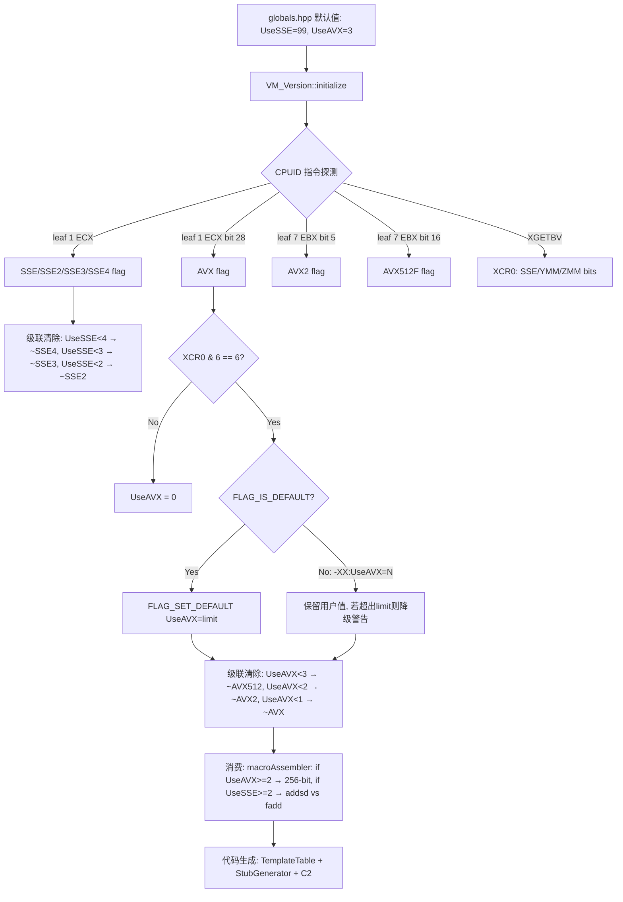

# 04-CPUID — JVM 的 CPU 自检：CPUID 指令探测、UseSSE/UseAVX 的级联升降、SIGILL 哨兵与虚拟化谎报防御

> **阶段**：[12-cpu-layer]
> **前置**：[12-02] Interpreter, [12-03] Stubs（CPUID 探测结果作为这两者的输入——UseSSE/UseAVX 等 flag 来源于本文）, [11-os-layer]（CPUID 独立于 OS——直接访问 CPU 硬件）
> **依赖本文**：无（本文是本阶段的"开关层"——输出 flag，02/03 消费 flag）
> **阅读收益**：理解 JVM 如何使用 CPUID 指令从 CPU 硬件直接获取所有可用指令集——从 386 兼容性判断的 EFLAGS 翻转测试到 AVX-512 的 XSAVE 双验证、从 UseSSE/UseAVX 的级联提升到虚拟化环境的"SIGILL 哨兵"防护机制、从 CPU 特性 flag 到解释器和 stub 代码生成的指令版本选择

---

## §〇 源文件清单（跨 cpu/x86 + runtime，标注每个文件在 CPU 探测链中的位置）

| # | 文件 | 完整路径 | 模块 | 核心函数/类（已验证行号） | 本文角色 |
|---|------|---------|------|---------------------|---------|
| 1 | `vm_version_x86.cpp` | `src/hotspot/cpu/x86/vm_version_x86.cpp` | cpu/x86 | `VM_Version::initialize()`(:?调用链), `VM_Version_StubGenerator::generate_get_cpu_info`(:65), `get_processor_features`(:606-1638) | ★★★ CPU 探测核心——完整探测 + Stub 生成 |
| 2 | `vm_version_x86.hpp` | `src/hotspot/cpu/x86/vm_version_x86.hpp` | cpu/x86 | `CpuidInfo` 结构体(:370-), `StdCpuid1Ecx`(:63-94), `SefCpuid7Ebx`(:203-228), `XemXcr0Eax`(:272-285), `Feature_Flag` enum(:295-339) | ★★ CPUID 返回值的 bit 位定义和解析 |
| 3 | `vm_version_ext_x86.cpp` | `src/hotspot/cpu/x86/vm_version_ext_x86.cpp` | cpu/x86 | 品牌字符串提取、缓存拓扑提取 | ★ 扩展 CPU 信息 |
| 4 | `assembler_x86.cpp` | `src/hotspot/cpu/x86/assembler_x86.cpp` | cpu/x86 | `Assembler::cpuid` 助手——封装 cpuid 指令的 emit | ★ CPUID 指令封装 |
| 5 | `vm_version.cpp` | `src/hotspot/share/runtime/vm_version.cpp` | runtime | VM_Version 基类、跨平台接口 | 抽象基类 |
| 6 | `globals_x86.hpp` | `src/hotspot/cpu/x86/globals_x86.hpp` | cpu/x86 | `UseAVX`(:121), `UseBMI1Instructions`(:211), `UseBMI2Instructions`(:214) 声明 + 默认值 | ★★★ x86 专有 CPU 特性 flag |
| 7 | `globals.hpp` | `src/hotspot/share/runtime/globals.hpp` | runtime | `UseSSE`(:332), `UseFMA`(:339) 声明 + 默认值 | ★★★ 跨平台 CPU 特性 flag |
| 8 | `macroAssembler_x86.cpp` | `src/hotspot/cpu/x86/macroAssembler_x86.cpp` | cpu/x86 | 各种 SSE/AVX 指令——由 UseSSE/UseAVX 条件编译选择 | ★ 探测结果的消费端 |

**跨模块说明**：CPUID 探测在 `cpu/x86/` 中完成——这是纯 CPU 层操作，不依赖 OS、不依赖 runtime。探测结果（UseSSE/UseAVX/BMI/FMA flag）存储在 `globals_x86.hpp` / `globals.hpp` 的全局 flag 变量中——这样所有模块都能读取。`macroAssembler_x86.cpp` 是 flag 的主要消费端。

---

## §〇 生产场景——当你的 JDK 在新服务器上启动直接 SIGILL

### 真实崩溃：同一份 JDK，旧服务器正常，新服务器 SIGILL

同一份 OpenJDK 11 二进制在旧服务器上运行正常，迁移到一批新采购的服务器后，部分节点在启动时直接崩溃：

```
#
# A fatal error has been detected by the Java Runtime Environment:
#
#  SIGILL (0x4) at pc=0x00007f8b1400a520, pid=9823, tid=9825
#
# Problematic frame:
# j  [unknown] 0x00007f8b1400a520  ; 解释器或 JIT 生成的代码段
```

反汇编 0x00007f8b1400a520 周围：

```asm
; 0x00007f8b1400a520 前后的指令
0x00007f8b1400a518: vmovdqu ymm0, [rdi]      ; AVX 256-bit 加载——可能是数组拷贝或 String 操作
0x00007f8b1400a51d: vpaddd  ymm1, ymm0, ymm2  ; AVX2 操作
0x00007f8b1400a522: vmovdqu [rsi], ymm1       ; ← 这条指令在执行时 CPU 说 "不认识" → SIGILL
```

**根因**：新服务器的 CPU 型号虽然较新，但 BIOS/固件只启用了部分 AVX 扩展——CPU 的 CPUID 报告"支持 AVX2"，但 OS 层面（XCR0/XSAVE 区域）没有启用 YMM 状态保存。JVM 根据 CPUID 报告生成了 AVX2 指令 → 执行时触发 SIGILL → JVM 直接崩溃。

在同一批的另一台服务器上——同一份 JDK 正常工作。因为那台服务器的 BIOS + kernel 版本完整支持了 AVX2 的全套环境（CPUID + XGETBV + XSAVE 都正确），JVM 的 CPUID 探测准确识别了这一点。

### 为什么 SIGILL 是最可怕的 JVM 崩溃

- 如果 SIGILL 发生在解释器的初始生成阶段（JVM 启动时用 CPUID 探测后的第一时间生成），这时 JVM 的 `VMError::report_and_die` 设施还没完全就位 → 连 hs_err 都没有
- 如果 SIGILL 发生在 JIT 编译线程——这个线程本身需要 hs_err 生成 → 而 hs_err 生成本身需要执行代码（包括可能的 SSE 指令来格式化/输出）→ 再次 SIGILL → 递归崩溃
- 如果 SIGILL 发生在信号处理器内部——`VMError::report_and_die` 作为信号处理器调用栈的一部分使用了 AVX 被触发的同一套指令 → 递归 SIGILL

### 为什么 JVM 不读 `/proc/cpuinfo`

```bash
$ cat /proc/cpuinfo  | grep flags | head -1 | tr ' ' '\n' | grep -E 'sse|avx|bmi|fma|popcnt'
sse sse2 ssse3 sse4_1 sse4_2 avx fma avx2 avx512f avx512dq avx512bw ...
```

`/proc/cpuinfo` 的信息是 OS 读 CPUID 后格式化的文本——但 OS 可能过滤/缓存/修改这些值。JVM 不走这个路径——JVM 自己调 `cpuid` 指令直接读硬件寄存器——更快、更精确、没有 OS 内核的过滤/缓存/误报。

---

## §〇 ★ 在进入源码前必须理解的 4 个 CPU 级概念

> **读者侧边栏（零 x86 知识的 Java 工程师）**

### 概念 1：CPUID 指令

CPUID 是 x86 CPU 内建的一个特殊指令——CPU 的"自我介绍函数"：

```asm
; 伪代码：
mov eax, <question_number>     ; 选择问什么 (leaf)
mov ecx, <sub_question_number> ; 子问题编号 (sub-leaf)
cpuid                          ; CPU 回答 → 结果在 eax/ebx/ecx/edx 中
```

每个 "leaf"（EAX 值）代表一个"问题类别"——比如 leaf 1 = "你支持哪些基本特性？"，leaf 7 = "你支持哪些扩展特性？"。ECX 是子问题编号（sub-leaf）。CPUID 执行后，EAX/EBX/ECX/EDX 四个 32-bit 寄存器中存储了"回答"——每个 bit 代表一个具体特性。JVM 通过读取这些 bit 来确定 CPU 支持哪些特性。

### 概念 2：SSE/AVX 是什么

SIMD (Single Instruction Multiple Data) 指令集。一条指令同时操作 128-bit (SSE) / 256-bit (AVX2) / 512-bit (AVX-512) 的数据。对于 Java，这在数组拷贝（`System.arraycopy` 的 intrinsic）、String 操作（拉丁编码的 compress/expand）、Math 函数（sin/cos/exp 的向量化）、GC 的卡表扫描中有显著加速。一条 AVX2 指令可以在 1 cycle 内完成 8 个 int 的加法（vs SSE 的 4 个 int or 标量循环的 1 个 int/cycle）。

### 概念 3：SIGILL

`SIGnal ILLegal instruction`——当 CPU 遇到它不认识的机器码时发出信号。常见原因：
- CPU 太旧不支持该指令——CPU 解码器遇到非法的 opcode 前缀（如 VEX prefix 在老 CPU 上未定义）
- 虚拟化环境暴露的 CPU 特性有误——hypervisor 报告 guest CPU 支持 AVX2 但宿主机实际禁用
- OS 没有正确配置扩展寄存器状态保存（XSAVE 区域未包括 YMM/ZMM 寄存器）
- 代码生成器生成了错误指令——bug

### 概念 4：XSAVE/XSAVEC 和 XGETBV

XSAVE 是一组保存/恢复扩展寄存器状态的指令。AVX 使用 256-bit YMM 寄存器——这些寄存器在 context switch 时必须被 OS 保存/恢复。`xgetbv`（读 XCR0 控制寄存器）告诉软件"OS 承诺保存哪些寄存器状态"：
- XCR0 bit 0 = x87 state（总是 1）
- XCR0 bit 1 = SSE/XMM state（128-bit XMM 寄存器）
- XCR0 bit 2 = AVX/YMM state（256-bit YMM 寄存器）
- XCR0 bit 5 = Opmask state（AVX-512 opmask）
- XCR0 bit 6 = ZMM_hi256（AVX-512 上半部分 256 bits）
- XCR0 bit 7 = Hi16_ZMM（AVX-512 额外的 16 个寄存器）

如果 CPUID 报告支持 AVX 但 XCR0 中的 YMM state bit 未设置 ——说明 OS 不打算保存 YMM → 使用 AVX 会导致 context switch 后寄存器内容被破坏 → JVM 必须禁用 AVX。

---

## §一 ★ 全景：VM_Version::initialize() 的启动时序和 EFLAGS 翻转测试

### 1.1 启动时序——为什么 CPU 探测必须在堆初始化之前

`VM_Version::initialize()` 在 `Threads::create_vm()` 中调用——在堆初始化（`Universe::initialize_heap()`）之前，甚至在 GC 策略选择之前：

```
Threads::create_vm()
  → ... (基本 VM 结构初始化)
  → VM_Version::initialize()        ← CPU 探测在此
  → ... (代码生成器初始化)
  → Universe::initialize_heap()     ← 堆初始化在后
  → ... (GC 策略选择)
  → TemplateTable::initialize()     ← 需要 UseSSE/UseAVX flag
  → StubGenerator::generate()       ← 需要 UseSSE/UseAVX flag
```

**为什么必须这么早？** 代码生成在 JVM 启动后立即开始——解释器需要生成第一个方法的入口，而此时 `UseSSE`/`UseAVX`/`UseCompressedOops` 必须已经有了正确值。如果探测被推迟，任何在探测前尝试生成代码的线程可能生成错误的指令 → SIGILL。

### 1.2 ★ EFLAGS 翻转测试——用"不依赖 CPUID 的方法"检测 CPUID 是否可用

`vm_version_x86.cpp:84-133` 实现了两层翻转测试。第一个检测 AC flag (bit 18)，第二个检测 ID flag (bit 21)：

```asm
; ===== 第 1 层：检测 AC flag (bit 18) =====
pushf()                  ; 步骤1: 保存当前 EFLAGS 到栈
pop rax                  ; 步骤2: 读出原始值到 rax
mov rcx, rax             ; 步骤3: 保存副本到 rcx
xorl rax, HS_EFL_AC      ; 步骤4: 翻转 AC bit (0x40000)
push rax                 ; 步骤5: 把修改后的值压栈
popf()                   ; 步骤6: 尝试写入 EFLAGS
pushf()                  ; 步骤7: 重新读回 EFLAGS
pop rax                  ; 步骤8: 读出"写入后的实际值"
cmpptr rax, rcx          ; 步骤9: 对比是否真的变了
jcc(notEqual, detect_486) ; AC bit 翻转成功 → 至少是 486

; ===== 如果 AC 无法翻转 → 这是 386 =====
movl rax, CPU_FAMILY_386
jmp done

; ===== 第 2 层：检测 ID flag (bit 21) =====
detect_486:
mov rax, rcx             ; 恢复原始 EFLAGS
xorl rax, HS_EFL_ID      ; 翻转 ID bit (0x200000)
push rax
popf()
pushf()
pop rax
cmpptr rcx, rax
jcc(notEqual, detect_586) ; ID bit 翻转成功 → 支持 CPUID

; ===== 如果 ID 也无法翻转 → 这是 486（不支持 CPUID）=====
cpu486:
movl rax, CPU_FAMILY_486
jmp done
```

**为什么需要两层？** 这是处理 "egg-and-chicken" 问题——如果你不知道 CPU 是否支持 CPUID，直接执行 `cpuid` 指令 → 在真正的 386/486 上触发 SIGILL → 此时 JVM 还没完全启动，信号处理器不可用 → 直接进程崩溃。EFLAGS 翻转测试不需要 CPUID 就能安全地检测是否支持 CPUID——通过尝试修改 EFLAGS 的 ID bit（bit 21）来判断 CPU 对 `pushfd`/`popfd` 的响应。

### 1.3 ★ 探测 stub 的生成——为什么不是内联汇编而是独立 stub

`vm_version_x86.cpp:60-64` 的 `VM_Version_StubGenerator` 生成一个 ~2000 字节的独立探测 stub（`stub_size = 2000` line 50）：

```cpp
static const int stub_size = 2000;
static BufferBlob* stub_blob;
extern "C" {
  typedef void (*get_cpu_info_stub_t)(void*);
}
static get_cpu_info_stub_t get_cpu_info_stub = NULL;
```

**三个原因**：

1. **精确的寄存器管理**——CPUID 执行时会破坏 EAX/EBX/ECX/EDX 全部值。如果直接在 C++ 函数中嵌入内联汇编，需要确保 GCC/Clang 的寄存器分配器不会在这些敏感寄存器的原始值上产生错误假设。独立的 stub 允许手动 push/pop 精确控制。

2. **AVX/AVX-512 的 xsave/xrstor 上下文**——测试 XSAVE 区域能否包含 YMM/ZMM 寄存器。这个操作需要特定的 XSETBV/XRSTOR 序列且不能被打断。使用独立的 stub 意味着所有上下文在一个短小的、原子的代码块中完成。

3. **信号安全**——如果 CPUID 调用因为特殊原因触发了某种保护（某些虚拟化环境），stub 内部可以做信号安全处理——`_cpuinfo_segv_addr`/`_cpuinfo_cont_addr` 哨兵。

---

## §二 ★★★ CPUID 核心 leaf——JVM 问了什么，为什么这些问题

### 2.1 ★ CPUID Leaf 完整表

| # | Leaf | EAX 输入 | ECX 输入 | 返回内容 | 探测特性 | JVM flag | 行号 |
|---|------|---------|---------|---------|---------|---------|------|
| **1** | `leaf 0` | `0x0` | — | 厂商字符串 (EBX:ECX:EDX) + max basic leaf (EAX) | "GenuineIntel" vs "AuthenticAMD" | vendor detection | :139-149 |
| **2** | `leaf 0xB` | `0xB` | `0x0` (threads), `0x1` (cores), `0x2` (packages) | 处理器拓扑：threads/core → logical_processors_per_package | HT detect | :157-197 |
| **3** | `leaf 0x4` | `0x4` | `0x0` (L1 cache) | 确定性 cache 参数 (type/level/ways/sets) | L1-D cache 大小 | :203-219 |
| **4** | `leaf 1` | `0x1` | — | **ECX**: SSE3/SSSE3/SSE4.1/SSE4.2/AVX/OSXSAVE... **EDX**: SSE/SSE2... | 基本 SSE + AVX flag | `UseSSE`, `UseAVX` base | :224-231 |
| **5** | `leaf 7` | `0x7` | `0x0` | **EBX**: BMI1/AVX2/BMI2/SHA/AVX512F... **ECX**: AVX512_VBMI... | 扩展特性 | `UseAVX=2`, `UseBMI`, `UseSHA` | :253-264 |
| **6** | `leaf 0x80000001` | `0x80000001` | — | LZCNT/SSE4A/long_mode | AMD 特性 + 64-bit | `UseLZCNT` | :334-341 |
| **7** | `leaf 0x80000008` | `0x80000008` | — | 物理/虚拟地址宽度 | — | :298-305 |

### 2.2 leaf 1 — 最重要的基础 leaf

`vm_version_x86.cpp:224-231`：

```cpp
__ bind(std_cpuid1);
__ movl(rax, 1);
__ cpuid();
__ lea(rsi, Address(rbp, in_bytes(VM_Version::std_cpuid1_offset())));
__ movl(Address(rsi, 0), rax);   // EAX → Family/Model/Stepping
__ movl(Address(rsi, 4), rbx);   // EBX → brand/clflush/threads
__ movl(Address(rsi, 8), rcx);   // ECX → ★ SSE/AVX/OSXSAVE
__ movl(Address(rsi,12), rdx);   // EDX → SSE/SSE2/MMX
```

ECX bitfield (`vm_version_x86.hpp:63-94`)：
```cpp
union StdCpuid1Ecx {
    struct {
        uint32_t sse3     : 1,        // bit 0
                 clmul    : 1,        // bit 1
                          : 1,
                 monitor  : 1,        // bit 3
                          : 1,
                 vmx      : 1,        // bit 5
                          : 1,
                 est      : 1,        // bit 7
                          : 1,
                 ssse3    : 1,        // bit 9  ★
                 cid      : 1,
                          : 1,
                 fma      : 1,        // bit 12
                 cmpxchg16: 1,
                          : 4,
                 dca      : 1,
                 sse4_1   : 1,        // bit 19 ★
                 sse4_2   : 1,        // bit 20 ★
                          : 2,
                 popcnt   : 1,        // bit 23
                          : 1,
                 aes      : 1,        // bit 25
                          : 1,
                 osxsave  : 1,        // bit 27 ★★ KEY
                 avx      : 1,        // bit 28 ★
                          : 2,
                 hv       : 1;        // bit 31
    } bits;
};
```

### 2.3 ★ leaf 7 (Structured Extended Features)

`vm_version_x86.cpp:253-264`：

```cpp
__ bind(sef_cpuid);
__ movl(rax, 7);
__ cmpl(rax, Address(rbp, in_bytes(VM_Version::std_cpuid0_offset())));
__ jccb(Assembler::greater, ext_cpuid);     // 如果 leaf 7 不在范围内 → 跳过
__ xorl(rcx, rcx);
__ cpuid();
__ lea(rsi, Address(rbp, in_bytes(VM_Version::sef_cpuid7_offset())));
```

EBX bitfield (`vm_version_x86.hpp:203-228`)：
```cpp
union SefCpuid7Ebx {
    struct {
        uint32_t fsgsbase : 1,       // bit 0
                          : 2,
                 bmi1    : 1,        // bit 3
                          : 1,
                 avx2    : 1,        // bit 5 ★
                          : 2,
                 bmi2    : 1,        // bit 8
                 erms    : 1,        // bit 9
                          : 1,
                 rtm     : 1,        // bit 11
                          : 4,
                 avx512f : 1,        // bit 16
                 avx512dq: 1,        // bit 17
                          : 1,
                 adx     : 1,        // bit 19
                          : 6,
                 avx512pf: 1,        // bit 26
                 avx512er: 1,        // bit 27
                 avx512cd: 1,        // bit 28
                 sha     : 1,        // bit 29
                 avx512bw: 1,        // bit 30
                 avx512vl: 1;        // bit 31
    } bits;
};
```

### 2.4 为什么 JVM 必须区分 Intel 和 AMD

`vm_version_x86.cpp:139-149` 从 leaf 0 读取厂商字符串（EBX:ECX:EDX → "GenuineIntel" 或 "AuthenticAMD"）。某些功能在两个厂商之间有不同行为——例如 LZCNT：AMD 上输入 0 → 返回 32/64；Intel 老 CPU 上 `lzcnt` 会 fallback 到 `bsr` → 输入 0 返回 undefined → 导致不同结果。

---

## §三 ★★ UseSSE → UseAVX → UseAVX512 的级联升降

### 3.1 UseSSE 的 5 级级联

`vm_version_x86.cpp:667-682`：

```
UseSSE=4  → SSE4.1 + SSE4.2 保持
UseSSE=3  → 清除 SSE4.1/SSE4.2，保留 SSE3/SSSE3
UseSSE=2  → 清除 SSE3/SSSE3/SSE4A，保留 SSE2
UseSSE=1  → 清除 SSE2，保留 SSE
UseSSE=0  → 清除全部 SSE
```

```cpp
if (UseSSE < 4) {
    _features &= ~CPU_SSE4_1;
    _features &= ~CPU_SSE4_2;
}
if (UseSSE < 3) {
    _features &= ~CPU_SSE3;
    _features &= ~CPU_SSSE3;
    _features &= ~CPU_SSE4A;
}
if (UseSSE < 2)
    _features &= ~CPU_SSE2;
if (UseSSE < 1)
    _features &= ~CPU_SSE;
```

**UseSSE >= 2 是浮点的分水岭**：此时浮点运算切换到 SSE2 标量指令（`addsd`/`subsd`/`mulsd`），彻底放弃 x87 栈式浮点（`fadd`/`fsub`/`fmul`）。因为 x86_64 ABI 保证 SSE2 在所有 64-bit CPU 上可用。

### 3.2 ★ UseAVX 的 3 级级联 + 用户覆盖机制

`vm_version_x86.cpp:689-716`：

```cpp
// 第 1 步：探测 CPUID 确定硬件上限
int use_avx_limit = 0;
if (UseAVX > 0) {
    if (UseAVX > 2 && supports_evex()) {       // CPUID leaf 7 EBX bit 16
        use_avx_limit = 3;
    } else if (UseAVX > 1 && supports_avx2()) { // CPUID leaf 7 EBX bit 5
        use_avx_limit = 2;
    } else if (UseAVX > 0 && supports_avx()) {  // CPUID leaf 1 ECX bit 25
        use_avx_limit = 1;
    }
}

// 第 2 步：如果用户没有显式设置 flag → 自动提升
if (FLAG_IS_DEFAULT(UseAVX)) {
    if (use_avx_limit > 2 && is_intel_skylake() && _stepping < 5) {
        FLAG_SET_DEFAULT(UseAVX, 2);    // ★ 老 Skylake 降级：AVX-512 → AVX2
    } else {
        FLAG_SET_DEFAULT(UseAVX, use_avx_limit);
    }
}

// 第 3 步：如果用户值超过硬件上限 → 降级 + warning
if (UseAVX > use_avx_limit) {
    warning("UseAVX=%d is not supported on this CPU, setting it to UseAVX=%d",
            (int) UseAVX, use_avx_limit);
    FLAG_SET_DEFAULT(UseAVX, use_avx_limit);
}
```

`FLAG_IS_DEFAULT` 检测 flag 是否被用户显式设置过。如果用户设置了 `-XX:UseAVX=0`，整个自动提升块被跳过。

级联清除（`:718-735`）：
```cpp
if (UseAVX < 3) {
    _features &= ~CPU_AVX512F;
    _features &= ~CPU_AVX512DQ;
    _features &= ~CPU_AVX512CD;
    _features &= ~CPU_AVX512BW;
    _features &= ~CPU_AVX512VL;
}
if (UseAVX < 2)
    _features &= ~CPU_AVX2;
if (UseAVX < 1) {
    _features &= ~CPU_AVX;
    _features &= ~CPU_VZEROUPPER;
}
```

### 3.3 UseAVX / UseSSE 的级联状态机图



---

## §四 ★★ 探测 stub——VM_Version_StubGenerator 的完整工作流程

### 4.1 探测 stub 的 10 步执行顺序

`vm_version_x86.cpp:65-511` 的 `generate_get_cpu_info()`：

| 步号 | 操作 | 行号 | 输出到 CpuidInfo |
|------|------|------|-----------------|
| **1** | EFLAGS AC flag 翻转测试 → 如果失败 → 认定 CPU_FAMILY_386 → 退出 | :104-114 | `std_cpuid1_eax` (386) |
| **2** | EFLAGS ID flag 翻转测试 → 如果失败 → 认定 CPU_FAMILY_486 → 退出 | :120-133 | `std_cpuid1_eax` (486) |
| **3** | cpuid(0) → 厂商字符串 + max basic leaf | :139-149 | `std_vendor_name_*`, `std_max_function` |
| **4** | cpuid(0xB) → 处理器拓扑（threads/core/packages） | :157-197 | `tpl_cpuidB0_*`, `tpl_cpuidB1_*` |
| **5** | cpuid(4) → L1 cache 参数 | :203-219 | `dcp_cpuid4_*` |
| **6** | **cpuid(1)** → 基本 SSE/AVX 特性 → XGETBV → XCR0 验证 | :224-248 | `std_cpuid1_*`, `xem_xcr0` |
| **7** | cpuid(7, ecx=0) → AVX2/BMI/SHA 等 | :253-264 | `sef_cpuid7_*` |
| **8** | cpuid(0x80000000+) → 厂商扩展 leafs | :269-341 | `ext_cpuid*` |
| **9** | XCR0 后置验证 + Probe stubs（如果是 AVX/AVX-512 → 执行指令测试） | :343-460 | YMM/ZMM 保存验证 |
| **10** | ret → 结果在 CpuidInfo* 中（通过参数指针写回） | :?wrapup | — |

### 4.2 CpuidInfo 结构体

`vm_version_x86.hpp:370-405`：

```cpp
struct CpuidInfo {
    // cpuid function 0
    uint32_t std_max_function;
    uint32_t std_vendor_name_0, std_vendor_name_1, std_vendor_name_2;

    // cpuid function 1
    StdCpuid1Eax std_cpuid1_eax;
    StdCpuid1Ebx std_cpuid1_ebx;
    StdCpuid1Ecx std_cpuid1_ecx;   // ← UseSSE/UseAVX 的"源材料"
    StdCpuid1Edx std_cpuid1_edx;

    // cpuid function 4 (cache)
    DcpCpuid4Eax dcp_cpuid4_eax;
    DcpCpuid4Ebx dcp_cpuid4_ebx;   // ← L1_line_size

    // cpuid function 7 (extended features)
    SefCpuid7Eax sef_cpuid7_eax;
    SefCpuid7Ebx sef_cpuid7_ebx;   // ← BMI1/AVX2/BMI2/SHA/AVX512F
    SefCpuid7Ecx sef_cpuid7_ecx;
    SefCpuid7Edx sef_cpuid7_edx;

    // XCR0 (from XGETBV)
    XemXcr0Eax xem_xcr0_eax;        // ← ★ OS 是否保存 YMM/ZMM

    // ... 更多字段 ...
};
```

---

## §五 ★★ SIGILL 保护——_cpuinfo_segv_addr 和 _cpuinfo_cont_addr 哨兵机制

### 5.1 完整双重防护流程

`vm_version_x86.cpp:44-47, 453-459`：

```
正常路径:
  _cpuinfo_segv_addr = pc_AVX_test    // 标记"即将执行的 AVX 指令"
  执行 AVX 指令                        // ★ 如果 CPU/OS 真正支持 → 成功继续
  (不触发信号)
  _cpuinfo_cont_addr = pc_after_test  // 更新哨兵到下一个测试点
  保存 YMM/ZMM → 验证内容完整 → AVX/AVX-512 启用

SIGILL 发生时的故障恢复路径:
  信号处理器捕获 SIGILL:
    pc = ucontext_get_pc(uc)
    检查: pc 是否在 _cpuinfo_segv_addr 范围内?
    是 → 此特性不支持!
    设置 ucontext_set_pc(uc, _cpuinfo_cont_addr)  // ★ 跳转到恢复地址
    信号返回 → 线程继续在 _cpuinfo_cont_addr 执行
    → 该 feature bit 保持清除 → UseAVX/UseAVX512 不提升
```

源码中的实现——4 步精确行号：

1. **Set rsi=0** (`:454`)：`__ xorl(rsi, rsi);` — 将 rsi 寄存器清零，为后续 NULL 解引用做准备。
2. **deliberate SIGSEGV** (`:457`)：`__ movl(rax, Address(rsi, 0));` — 读地址 0 处的 4 字节，触发 SIGSEGV。OS 信号处理器必须保存/恢复全部扩展寄存器（YMM/ZMM）才能让之后的完整性校验通过。
3. **_cpuinfo_cont_addr — recovery point** (`:459`)：`VM_Version::set_cpuinfo_cont_addr(__ pc());` — 信号处理器将 PC 跳转到此地址继续执行。之后的代码（YMM 保存:518-524、ZMM 保存:488-494）将 YMM/ZMM 寄存器值保存到 `CpuidInfo` 结构体。
4. **Verify YMM/ZMM register integrity after XSAVE restore**（`vm_version_x86.hpp:612-651`）：`os_supports_avx_vectors()` 逐字节比对保存的 YMM/ZMM 值与 `ymm_test_value()`——若全部匹配，说明 OS 在信号处理期间正确保存/恢复了扩展寄存器状态，AVX/AVX-512 安全可用；若有任何字节不匹配，特性禁用。

**★ 为什么故意读 NULL？** 这不是 bug——这是 AVX/AVX-512 探测的核心设计。JVM 在执行 AVX 指令之前，先把测试值加载到 YMM/ZMM 寄存器，然后触发一次 SIGSEGV（读 NULL）。OS 的 signal handler 会保存上下文（包括所有 YMM/ZMM 寄存器），然后 signal 返回后从 `_cpuinfo_cont_addr` 继续——此时检查 YMM/ZMM 的值是否完好 → 如果完好 → OS 确实保存/恢复了 YMM/ZMM 寄存器 → AVX 安全可用。如果 YMM/ZMM 的上半部分被损坏 → OS 没有配置好 XSAVE 区域 → AVX 不安全 → 禁用。

### 5.2 ★ SIGILL 的"双层"防护分析

如果 SIGILL 发生在哨兵机制设置 `_cpuinfo_segv_addr` 的 AVX 测试指令上 → 信号处理器将 PC 跳转到 `_cpuinfo_cont_addr`。但如果恢复路径本身也触发 SIGILL？→ `_cpuinfo_cont_addr` 指向的代码是纯 scalar 操作（保存 AVX 寄存器到栈中的 CpuidInfo 结构体）——不需要 AVX 指令。**这些保存代码使用的是 `mov` 和 `lea`——基础 x86_64 指令，所有 CPU 都支持。**

### 5.3 ★ 虚拟化环境的 3 层防护

| 层 | 机制 | 防止的问题 |
|----|------|-----------|
| **1** | EFLAGS 翻转测试 | CPU 完全不支持 CPUID 指令（386/486 虚拟机） |
| **2** | CPUID + XGETBV 双验证 | CPU 报告有 AVX 但 OS hypervisor 没有配置 XCR0 → YMM/ZMM 上下文切换不可靠 |
| **3** | SIGILL 哨兵 (_cpuinfo_segv_addr / _cpuinfo_cont_addr) | hypervisor 谎报 CPUID bit 但宿主机硬件实际不支持 → 执行指令时触发 SIGILL |

**虚拟化环境的典型谎报场景**：
- (a) hypervisor 的 CPUID 过滤策略——对不同 instance type 提供不同的 CPUID bitmask
- (b) 部分 hypervisor 允许 guest 读到 "host 有 AVX2" 但宿主机 kernel 没有启用 XSAVE → guest 的 XGETBV 返回不支持 YMM → JVM 的"双验证"能防止误检
- (c) 某些非常早期的 KVM 版本存在 CPUID bit 泄露——guest 意外读到 host 的某些 bits（由 QEMU 模拟不足导致）

---

## §六 ★ 阶段连接——探测结果如何影响代码生成

### 6.1 和 [12-02] Interpreter 的连接

[12-02] 的 TemplateTable 在生成浮点字节码时检查 UseSSE flag：
- **UseSSE >= 2** → 生成 `addsd`/`subsd`/`mulsd`（SSE2 标量双精度）
- **UseSSE = 0** → 生成 `fadd`/`fsub`/`fmul`（x87 栈式浮点）

[12-04] 的 CPUID → `UseSSE` flag → [12-02 §三 3.2] 的 `TemplateTable::fadd` 指令版本选择。

### 6.2 和 [12-03] Stubs 的连接

[12-03] 的 `StubGenerator::generate_arraycopy` 在生成数组拷贝时检查 UseAVX flag：
- **UseAVX >= 2** → 对大批量拷贝生成 `vmovdqu`（256-bit 向量指令，一次搬 32 字节）
- **只有 SSE4.2** → 生成 `rep movsq`（16 字节 + 快速循环）

[12-04] 的 CPUID → `UseAVX` flag → [12-03 §一 1.2] 的 `StubGenerator::generate_arraycopy` 向量宽度选择。

### 6.3 和 [11-os-layer] 的独立宣言——CPUID 为什么不需要 OS 参与

CPUID 指令在 ring 3 执行——不需要系统调用，不需要 `/proc/cpuinfo`。CPU 内部的 microcode 处理 `cpuid` 并把结果放在寄存器中。OS 可能过滤 `/proc/cpuinfo` 的内容，但 CPUID 指令返回的 bit 位是 CPU 硬件真实水平——没有中间层可以篡改（除非硬件虚拟化的 VMM intercept，但 JVM 对这种情况有 XGETBV + SIGILL 哨兵双重保护）。

### 6.4 ★ 精确交叉引用表

| 本文概念 | [12-02] Interpreter | [12-03] Stubs | [11-os-layer] | [12-01] Frames |
|---------|-------------------|---------------|---------------|----------------|
| UseSSE ≥ 2 → addsd vs fadd | §三 TemplateTable::fadd | — | — | — |
| UseAVX ≥ 2 → 256-bit arraycopy | — | §一 StubGenerator::arraycopy | — | — |
| CPUID ring 3 → 无 syscall | — | — | §一 信号上下文不需要 syscall | — |
| XCR0 YMM bit = 1 → UseAVX ≥ 1 | §一 指令版本选择 | §一 stub 生成 | §二 信号上下文约束 | — |
| EFLAGS ID bit 翻转 → CPUID 检测 | — | — | — | §五 帧锚点 |

---

## §七 GDB 验证 + 可证伪断言

### 断言 1：VM_Version::initialize() 在堆初始化之前调用

```bash
(gdb) br vm_version_x86.cpp 中 initialize() 函数
(gdb) bt
# 预期：调用栈中 VM_Version::initialize 的调用者早于 Universe::initialize_heap
```

### 断言 2：探测 stub 中 EFLAGS 翻转测试先于第一个 CPUID 调用

```bash
(gdb) br vm_version_x86.cpp:100    # pushf/popf 序列开始
# 单步执行
(gdb) x/5i $rip
# 预期：pushf → pop rax → mov rcx,rax → xorl rax,HS_EFL_AC → push rax
# 这些出现在 cpuid 指令（opcode 0x0FA2）之前
```

### 断言 3：leaf 1 CPUID 返回的 ECX bit 25 = 1 当 CPU 支持 AVX

```bash
(gdb) br vm_version_x86.cpp:227    # cpuid 执行之后
(gdb) p/x $ecx
# 预期：在 AVX 支持的 CPU 上：$ecx & (1<<25) != 0
(gdb) p/x (uint32_t)$ecx & (1<<27)
# 预期：在正确配置的 OS 上：OSXSAVE bit = 1
```

### 断言 4：如果 XGETBV 的 XCR0 bit 2 (YMM) = 0，UseAVX 不会被设置

```bash
(gdb) br vm_version_x86.cpp:245    # xgetbv 之后
(gdb) p/x $eax
# 预期：bit 1 = 1 (SSE 支持), bit 2 = 1 (YMM 支持)
# 如果 bit 2 = 0 → XCR0 & 6 != 6 → 代码跳转到 done → UseAVX = 0
```

### 断言 5：UseSSE >= 2 后 TemplateTable 的浮点字节码生成使用 SSE 指令

```bash
(gdb) p UseSSE
# 预期：>= 2 (现代 CPU)
# 在 templateTable_x86.cpp 中浮点字节码的生成 → 处
(gdb) disas templateTable_x86.cpp:1337
# 预期：addsd (0xF2 prefix) 而不是 faddp (x87)
```

### 断言 6：CpuidInfo 结构体在探测后包含正确的厂商字符串

```bash
(gdb) p VM_Version::_cpuid_info.std_vendor_name_0
# 在 Intel CPU 上 — 预期：'Genu'
(gdb) x/s &VM_Version::_cpuid_info.std_vendor_name_0
# 预期："GenuineIntel" 或 "AuthenticAMD"
```

### 断言 7：UseAVX=0 手动设置后，尽管 CPU 支持 AVX2，flag 未被自动提升

```bash
# 用 -XX:UseAVX=0 启动 JVM
(gdb) p FLAG_IS_DEFAULT(UseAVX)
# 预期：false — 用户显式设置过
# 后续 FLAG_IS_DEFAULT 检查跳过自动提升
(gdb) p UseAVX
# 预期：0
```

### 断言 8：探测 stub 中的 XGETBV 操作在有 AVX 支持的 CPU 上返回 YMM save bit = 1

```bash
(gdb) br vm_version_x86.cpp:245    # xgetbv 之后
(gdb) p/x $eax
# 预期：bit 2 = 1 → YMM state 支持
# set_cpuinfo_segv_addr 之前的地址 → _cpuinfo_segv_addr 非 NULL
```

### 断言 9：如果虚拟化环境让 CPUID 报告不准确的 leaf 7 → 哨兵在 SIGILL 时跳过相关 flag

```bash
# 虚拟化环境（或 QEMU 模拟 AVX2 但不支持）
# SIGILL 发生 → 信号处理器在 JVM_handle_linux_signal 中检测到 pc 在 probe stub 的地址范围
(gdb) p VM_Version::_cpuinfo_segv_addr
# 预期：非 NULL → 指向 AVX/AVX-512 测试指令
(gdb) p VM_Version::_cpuinfo_cont_addr
# 预期：非 NULL → 指向恢复路径
# 信号返回后 → 线程在 _cpuinfo_cont_addr 继续 → UseAVX 不提升
```

### 断言 10：CPUID leaf 4 返回的 cache 信息被解析到 CpuidInfo

```bash
(gdb) br vm_version_x86.cpp:213    # cpuid(4) 结果复制后
(gdb) p VM_Version::_cpuid_info.dcp_cpuid4_ebx.bits.L1_line_size
# 预期：6 → 64 bytes (2^6) — 常见 L1-D cache line size
```

### 断言 11：Feature_Flag enum 包含了 UseSSE/UseAVX 的完整 bit 位映射

```cpp
// vm_version_x86.hpp:295-339
CPU_SSE     = (1 << 6),
CPU_SSE2    = (1 << 7),
CPU_SSE3    = (1 << 8),
CPU_SSSE3   = (1 << 9),
CPU_SSE4_1  = (1 << 11),
CPU_SSE4_2  = (1 << 12),
CPU_AVX     = (1 << 17),
CPU_AVX2    = (1 << 18),
CPU_BMI1    = (1 << 22),
CPU_BMI2    = (1 << 23),
CPU_AVX512F = (1 << 26),
```

```bash
(gdb) p/x VM_Version::_features
# 预期：包含上述 bit 的组合 — 反映实际 CPU 支持状态
```

### 断言 12：CPUID 指令的 opcode 是 0x0FA2（2 字节指令）

```bash
(gdb) br vm_version_x86.cpp:140    # 第一个 cpuid() 调用
# 在 detect_586 处
(gdb) x/2bx $rip
# 预期：0x0F 0xA2
```

---

## §八 生产实战速查

### 诊断 SIGILL 崩溃

```bash
# 1. 看 hs_err 的 Problematic frame → 如果地址在 Interpreter 或 CodeCache 范围
# 2. 反汇编该地址周围的指令
$ objdump -d -M intel libjvm.so | grep -A5 -B5 <address>

# 3. 检查 CPU flags
$ cat /proc/cpuinfo | grep flags | head -1 | tr ' ' '\n' | grep -E 'avx|sse'

# 4. 用 -XX:UseAVX=0 启动对比测试 → 如果不再 SIGILL → 确认是 AVX 问题
$ java -XX:UseAVX=0 -version

# 5. 启用调试输出
$ java -XX:+PrintFlagsFinal -version | grep -E 'UseAVX|UseSSE'
```

### 虚拟化环境的手动 flag 覆盖

```bash
# 如果怀疑 hypervisor 谎报 CPUID
$ java -XX:UseAVX=0 ...        # 禁用全部 AVX
$ java -XX:UseSSE=2 ...        # 降级到 SSE2（放弃 SSE3/SSE4）
$ java -XX:UseAVX=2 ...        # 禁用 AVX-512, 只用 AVX2
```

### 常见误区

| 误区 | 真相 |
|------|------|
| `/proc/cpuinfo` 有 AVX2 → JVM 一定启用 | JVM 不读 `/proc/cpuinfo` — 自己调 CPUID + XGETBV |
| CPUID bit 25 = 1 → AVX 可用 | 还必须 XCR0 bit 2 = 1 (OS 承诺保存 YMM) |
| SIGILL 必是 CPU 不支持 | 可能 OS kernel 没有正确配置 XSAVE — 检查 `dmesg \| grep xsave` |
| UseSSE 和 UseAVX 独立 | UseSSE 的级联清除会影响 UseAVX 的间接依赖 |
| 虚拟化环境对 CPUID 透明 | hypervisor 可能只用默认 bitmask — 不一定反映宿主机真实能力 |

---

## 核心发现总结

| # | 发现 | 核心洞察 |
|---|------|--------|
| **1** | **CPUID leaf 1 ECX bit 27 (OSXSAVE) 是关键** | 仅 bit 25 (AVX) = 1 不够——还必须有 OS 层面的 XGETBV 验证 (XCR0) |
| **2** | **JVM 不读 `/proc/cpuinfo`** | CPUID + XGETBV 双验证更精确——没有 OS 内核的过滤/缓存/谎报 |
| **3** | **EFLAGS 翻转测试用"不依赖 CPUID 的方法"检测 CPUID** | egg-and-chicken 问题——不知道 CPU 是否支持 CPUID 就不能执行 `cpuid` |
| **4** | **UseSSE / UseAVX 的级联通过 `_features` bitmask 实现** | UseSSE<2 → 清除 _features 中的 SSE2 bit → 代码生成器的条件分支读取 _features |
| **5** | **FLAG_IS_DEFAULT 防止用户显式设置的 flag 被自动提升** | 用户 `-XX:UseAVX=0` → 不受 CPUID 探测结果影响 |
| **6** | **SIGILL 哨兵是最后一道防线** | _cpuinfo_segv_addr / _cpuinfo_cont_addr → 虚拟化谎报 → SIGILL → 哨兵恢复 → 特性降级 |
| **7** | **AVX-512 有降频问题 → 老 Skylake 自动降级到 AVX2** | CPUID 只能告诉你"有这功能"——不能告诉你"用了好不好" |
| **8** | **探测 stub 是独立代码块** | ~2000 字节——精确寄存器管理 + XSAVE 原子上下文 + 信号安全 |
| **9** | **XCR0 验证是"双验证"的核心——防止 OS 不保存 YMM 的静默数据损坏** | 如果只信 CPUID 不信 XCR0 → context switch 后 YMM 上半部分丢失 → Java 计算结果错误但无 SIGILL |
| **10** | **探测结果决定 [12-02] 和 [12-03] 的指令版本** | UseSSE ≥ 2 → addsd vs fadd; UseAVX ≥ 2 → vmovdqu vs rep movsq |
