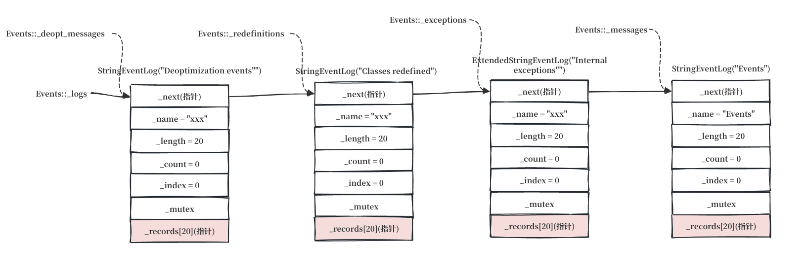
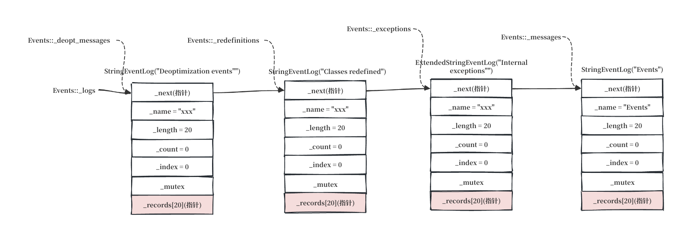
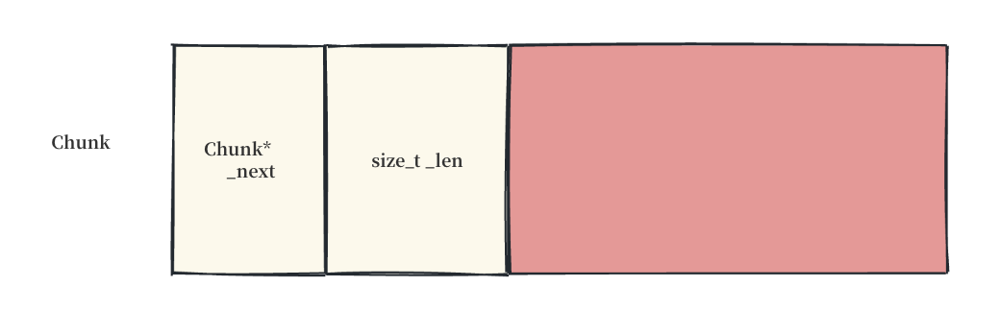
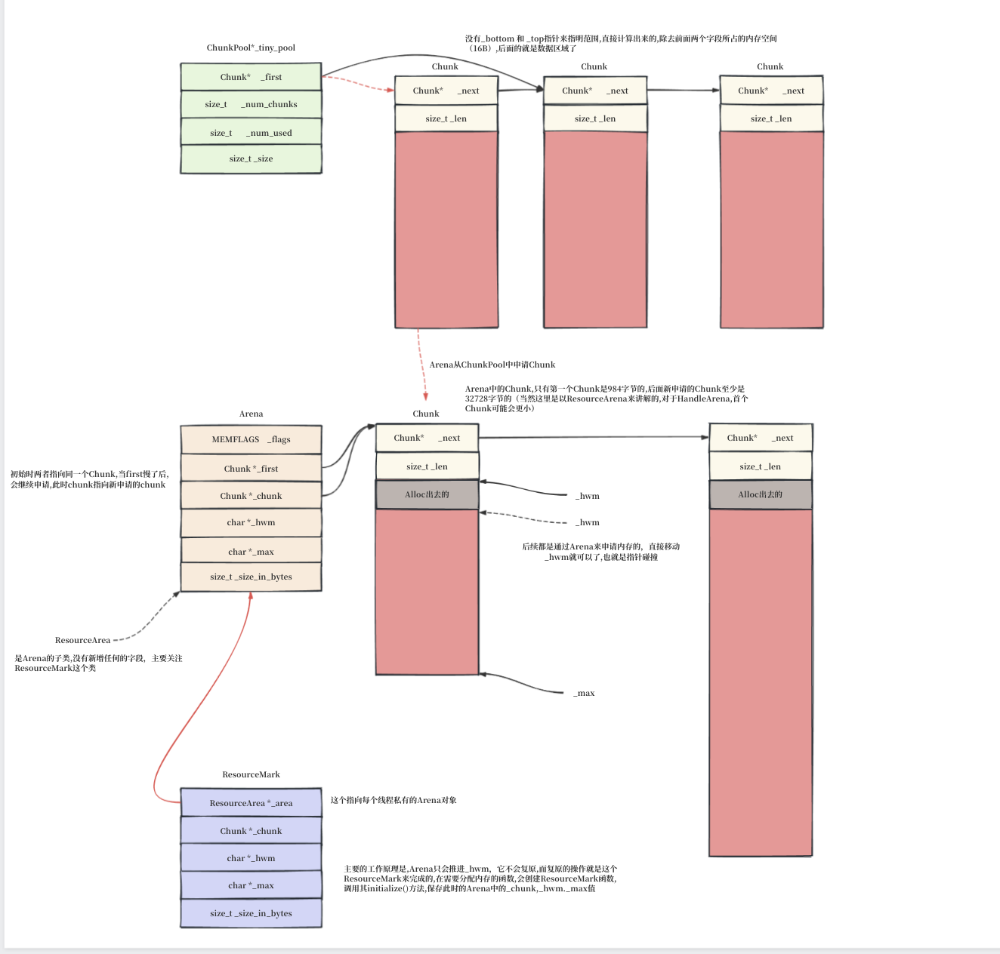
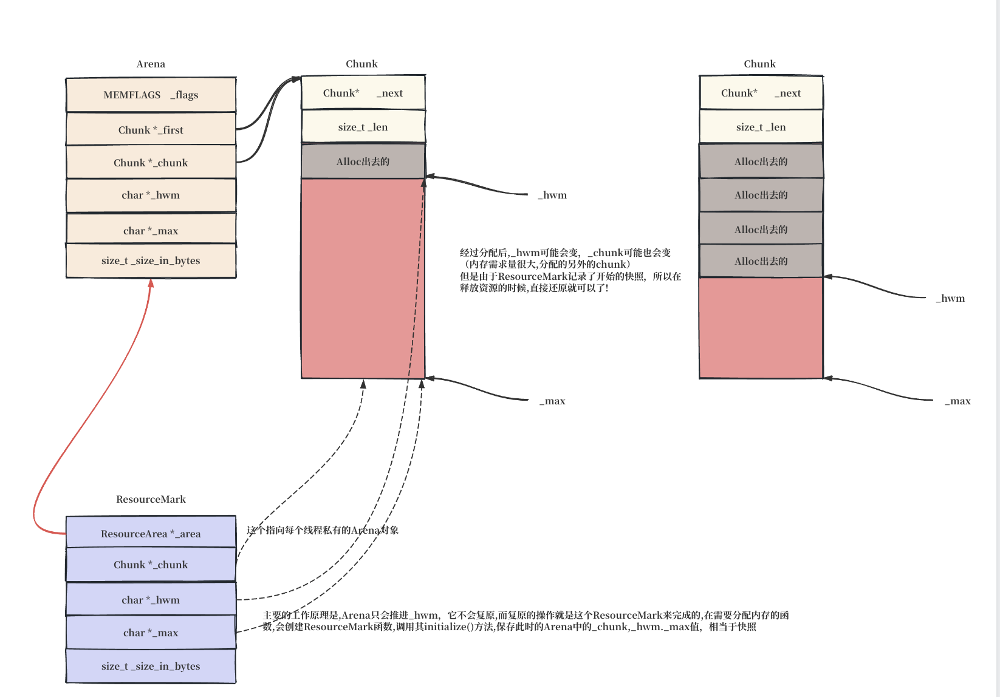

# 3.6 第一个 JavaThread：主线程登记

Stage 3 结束时，JVM 的 OS 层基础设施已经全部就绪——信号处理器注册完成、安全点轮询页分配完成、200+ 个 flag 全部锁定。但所有这些基础设施都是"悬浮在空中"的——没有线程来承载它们。

**当前执行到这里的线程是谁？** 回顾 3.1 的"此刻的进程与线程"——JLI 层在进入 JVM 之前做了 `pthread_create`，此时进程中有两个 OS 线程：

```
Java 进程 (PID=xxx)
├─ 原始线程 (LWP-1)           ← 阻塞在 pthread_join
└─ 新 pthread (LWP-2)         ← 正在执行 Threads::create_vm（就是我们）
```

LWP-2 是由 `CallJavaMainInNewThread()` 中的 `pthread_create` 创建的。它是调用 `JavaMain()` → `InitializeJVM()` → `JNI_CreateJavaVM()` → `Threads::create_vm()` 的线程，也将是 Java 程序员眼中的"main 线程"——最终它会执行 `main(String[] args)`。LWP-1 永远不会变成 `JavaThread`，它唯一的使命是 `pthread_join` 等 LWP-2 结束。

现在的问题是：LWP-2 这个 OS 线程还没有在 JVM 内部"登记"——JVM 不知道它的栈边界在哪、它是什么状态、它的 ParkEvent 分配了没有。从 `Threads::create_vm` 的 9 阶段骨架（参见 [3.2 Stage 1-9 全貌](#/openjdk/vol-01/ch03/02-threads-create-vm)）来看，下一步的使命很明确：给 LWP-2 穿上 JVM 的外衣——创建 JVM 的第一个 `JavaThread` 对象，把当前线程在 JVM 内部完成登记。

> **澄清：`new JavaThread()` 不是创建新的 OS 线程。** 它只是创建一个 C++ 对象来"包装/描述"当前正在运行的 OS 线程（LWP-2）。`new JavaThread()` 之后也只有这一个线程在 `Threads::create_vm` 中执行。后面 `pthread_create` 创建的是额外的子线程（如 CompilerThread、GC 线程）——那些在 ch04 的 `init_globals()` 阶段才会出现。

---
## Stage 4 全貌

`Threads::create_vm` 中 Stage 4 的完整源码：

```cpp
/* === src/hotspot/share/runtime/thread.cpp === */

  // Initialize Threads state
  _thread_list = NULL;
  _number_of_threads = 0;
  _number_of_non_daemon_threads = 0;

  // Initialize global data structures and create system classes in heap
  vm_init_globals();

#if INCLUDE_JVMCI
  // ... (编译期跳过)
#endif

  // Attach the main thread to this os thread
  JavaThread* main_thread = new JavaThread();
  main_thread->set_thread_state(_thread_in_vm);
  main_thread->initialize_thread_current();
  main_thread->record_stack_base_and_size();
  main_thread->register_thread_stack_with_NMT();
  main_thread->set_active_handles(JNIHandleBlock::allocate_block());

  if (!main_thread->set_as_starting_thread()) { ... return JNI_ENOMEM; }

  main_thread->create_stack_guard_pages();

  // Initialize Java-Level synchronization subsystem
  ObjectMonitor::Initialize();

  // → 下一阶段: jint status = init_globals();
```

10 个步骤的重要度分三层（`INCLUDE_JVMCI` 编译期跳过，不计入）：

| 步骤 | 重要度 | 操作 | 一句话 |
|------|--------|------|--------|
| 1 | ★ | Threads 状态零值初始化 | 三个静态成员变量清零——线程管理体系的起点 |
| 2 | ★★ | `vm_init_globals()` | 全局基础设施初始化（ch04 详讲） |
| 3 | ★★★ | `new JavaThread()` | 构造第一个 JavaThread——116 个字段初始化 |
| 4 | ★★ | `initialize_thread_current()` | TLS 绑定——衔接 Stage 1 的 `pthread_key_create` |
| 5 | ★★ | `record_stack_base_and_size()` | 记录主线程栈边界——`_stack_base` 和 `_stack_size` |
| 6 | ★ | `set_active_handles()` | 分配 JNI 局部引用句柄块 |
| 7 | ★ | `set_as_starting_thread()` | 将 OS 主线程附着到 JVM 的 JavaThread 对象 |
| 8 | ★★★ | `create_stack_guard_pages()` | **核心**：`mprotect(PROT_NONE)` 在栈底画守卫区 |
| 9 | ★★ | `ObjectMonitor::Initialize()` | PerfData 性能计数器注册（非锁初始化） |

---
## 1. Threads 状态零值初始化 ★

```cpp
_thread_list = NULL;
_number_of_threads = 0;
_number_of_non_daemon_threads = 0;
```

Stage 3 结束时，信号处理器、安全点轮询页、200+ 个 flag 全部就位——但 JVM 的线程管理表还是一片空白。这三行源代码做的事很简单：把线程管理体系的三根支柱全部清零。

`Threads` 是继承 `AllStatic` 的纯静态类——构造函数和析构函数都声明为 `ShouldNotCallThis()`，确保任何人不创建 `Threads` 实例。它的所有成员都是 `static`，整个 JVM 进程中只有一份。

```cpp
static JavaThread* _thread_list;
```

`_thread_list` 是 JVM 中所有 `JavaThread` 对象的链表头指针。每个 `JavaThread` 通过自己的 `_next` 字段（`JavaThread*`）串在链表中，构成一个单向链表。头插法——最后加入的线程在最前面：

```
_thread_list → [最新加入的 JavaThread] → [上一个] → ... → [最早的] → NULL
```

此刻设为 NULL，表示链表中一个线程都没有。后面 `Threads::add()` 会用头插法把 `main_thread` 推进来。

```cpp
static int _number_of_threads;
```

`_number_of_threads` 记录链表中有多少个 `JavaThread`。每次 `Threads::add()` 时 ++，`Threads::remove()` 时 --。此刻为 0。

但这个数字只算 `JavaThread`——NonJavaThread（VMThread、WatcherThread 等）不计在内。它们有自己独立的 `NonJavaThread::_the_list`。

```cpp
static int _number_of_non_daemon_threads;
```

`_number_of_non_daemon_threads` 记录链表中非守护线程的数量。daemon 线程的判断来自 Java 层的 `Thread.isDaemon()`——`threadObj->bool_field(daemon_offset)`。此刻为 0。

这个计数器直接决定 JVM 何时退出：`Threads::destroy_vm()` 在 `Threads_lock` 上循环等待 `number_of_non_daemon_threads() > 1`，当只剩 shutdown 线程自己（计数降到 1）时才继续退出流程。守护线程不阻止 JVM 退出——所有 daemon 线程会被强制终止。

此刻 JVM 里没有任何线程在名单上。三行代码之后，这张空白名单将开始接收它的第一个成员。

回头想一个问题：将来 JVM 里跑着多个 Java 线程时，GC 需要遍历 `_thread_list` 找到所有线程的 Java 栈帧作为 GC 根。但这时候可能恰巧另一个 Java 线程执行完毕，正在 `Threads::remove()` 把自己从链表中摘除——如果 GC 正遍历到被删节点的 `_next` 指针，读到的就是已释放的内存。

HotSpot 用 Thread-SMR（Safe Memory Reclamation）解决这个问题。核心思路很简单：**不直接遍历原始的 `_thread_list` 链表，而是维护一份不可变的数组快照。** 每次有线程加入或移除时，不是原地改链表，而是创建一个新的快照数组（Copy-On-Write）——旧快照留在原地不动。遍历线程（如 GC）拿到旧快照的指针后，把这个指针写入自己 `_thread` 内的 `_threads_hazard_ptr` 字段——相当于宣告"这份快照我正在读，别释放"。删除线程要等到**所有线程**的 `_threads_hazard_ptr` 都不再指向这份旧快照时，才真正释放它的内存。

> 用生活中的例子：图书馆闭馆时要销毁一批旧书。管理员不是直接烧——而是先看所有阅览室的登记表（hazard pointer），确认"没有人在读这本书"，才来销毁。有人还拿着，就等着。

---
## 2. vm_init_globals() ★★

`vm_init_globals()`（`init.cpp:90-98`）在 `new JavaThread()` 之前建立全局基础设施——下文所有步骤直接或间接依赖这七步。

```
vm_init_globals()
├── check_ThreadShadow()        — 验证 _pending_exception 偏移正确
├── basic_types_init()          — 验证基本类型大小 + 设置 heapOopSize
├── eventlog_init()             — 创建四类 EventLog 环形缓冲区
├── mutex_init()                — 分配 ~80 个全局 Mutex/Monitor，确定加锁全序
├── chunkpool_init()            — 初始化 Arena 块池
├── perfMemory_init()           — 创建 PerfData 共享内存（jstat 可见）
└── SuspendibleThreadSet_init() — 初始化可挂起线程集合
```

### check_ThreadShadow — 偏移验证

```cpp
void check_ThreadShadow() {
  const ByteSize offset1 = byte_offset_of(ThreadShadow, _pending_exception);
  const ByteSize offset2 = Thread::pending_exception_offset();
  if (offset1 != offset2) fatal("ThreadShadow::_pending_exception is not positioned correctly");
}
```

`ThreadShadow` 和 `Thread` 是继承关系——`ThreadShadow::_pending_exception` 从 ThreadShadow 起始地址的偏移量，必须等于从 Thread 起始地址的偏移量。如果 C++ 多继承布局导致 ThreadShadow 子对象在 Thread 中偏移不为 0，两个偏移不相等，`check_ThreadShadow()` 直接 `fatal`——后续所有通过 Thread pointer 访问 `_pending_exception` 的代码全报废。

ThreadShadow 的 `unused_initial_virtual()`（`exceptions.hpp:70-76`）是一个空 virtual 方法，其唯一目的是强制编译器为 ThreadShadow 生成 vtable——保证 ThreadShadow 和 Thread 的 vtable 布局一致，从而两个类中 `_pending_exception` 的偏移量相同。如果编译器不生成 vtable，某些编译器会把基类子对象放在派生类 vtable 之后（偏移 4 或 8），导致偏移超标。

### basic_types_init — 基本类型映射与对象模型

`basic_types_init()` 的源码（`globalDefinitions.cpp:53-176`）：

```cpp
void basic_types_init() {
#ifdef ASSERT
  // 三轮断言跳过 → product 构建下此块为空
#endif

  // Java 线程优先级 → OS 优先级映射（默认全部 -1, 平常不执行）
  if (JavaPriority1_To_OSPriority != -1) os::java_to_os_priority[1] = JavaPriority1_To_OSPriority;
  // ... JavaPriority2~10 同理, 共 10 行 ...

  // 根据 UseCompressedOops 设置对象引用在堆中的大小
  if (UseCompressedOops) {
    heapOopSize        = jintSize;      // 4 字节, 压缩指针
    LogBytesPerHeapOop = LogBytesPerInt;
    BytesPerHeapOop    = BytesPerInt;
  } else {
    heapOopSize        = oopSize;       // 8 字节, 完整指针
    LogBytesPerHeapOop = LogBytesPerWord;
    BytesPerHeapOop    = BytesPerWord;
  }
  _type2aelembytes[T_OBJECT] = heapOopSize;
  _type2aelembytes[T_ARRAY]  = heapOopSize;
}
```

product 构建实际做的事只有两件：

三张全局数组是 HotSpot 类型系统的基础：

```cpp
// BasicType → JVM 签名字符
char type2char_tab[T_CONFLICT+1] = {
  0,0,0,0, 'Z','C','F','D','B','S','I','J','L','[','V',0,0,0,0,0
};
```

`T_BOOLEAN(4)→'Z'，T_INT(10)→'I'，T_LONG(11)→'J'`。JVM 规范里 long 的签名字符就是 J（因为 L 被对象引用占了）。字节码解释器和 JIT 编译器靠这些字符区分栈槽位里是 int 还是 long 还是对象引用。`char2type` 是反向查询——拿到签名字符反查枚举值。

```cpp
BasicType type2field[T_CONFLICT+1] = {
  0,0,0,0, T_BOOLEAN,T_CHAR,T_FLOAT,T_DOUBLE, T_BYTE,T_SHORT,T_INT,T_LONG,
  T_OBJECT, T_OBJECT, T_VOID,                  // T_ARRAY(13)→T_OBJECT: 栈上存的是引用
  T_ADDRESS,T_NARROWOOP,T_METADATA,T_NARROWKLASS,T_CONFLICT
};
```

`type2field` 回答"这个类型在栈/对象字段中实际占什么"。Java 规范中 boolean/byte/char/short 在对象字段中不提升——字段里存的就是 1/1/2/2 字节。T_ARRAY→T_OBJECT 因为数组引用和对象引用在栈上存的是同一类指针。

```cpp
BasicType type2wfield[T_CONFLICT+1] = {
  0,0,0,0, T_INT,T_INT,T_FLOAT,T_DOUBLE, T_INT,T_INT,T_INT,T_LONG,
  //         ↑ T_BOOLEAN/CHAR 提升为 T_INT    ↑ T_BYTE/SHORT 提升为 T_INT
  T_OBJECT,T_OBJECT,T_VOID, T_ADDRESS,T_NARROWOOP,T_METADATA,T_NARROWKLASS,T_CONFLICT
};
```

和 type2field 的区别：sub-word 类型被提升为 T_INT。这是 Java 操作数栈的工作宽度——boolean/byte/char/short 在栈上全按 32 位处理，GC 和 JIT 在栈 banging 时不关心"这一格是 boolean"。

product 构建实际做的事只有两件：

**Java 优先级映射**。10 个 flag（`JavaPriority1_To_OSPriority` 到 `JavaPriority10_To_OSPriority`）默认全为 -1。用户显式传了 `-XX:JavaPriority1_To_OSPriority=N` 时，对应位置才写入 `os::java_to_os_priority[]` 数组。平常这 10 行全是死代码。

**对象引用大小设置**。`UseCompressedOops` 在 Stage 2 中确定——64 位 JVM、堆 < 32GB 时默认为 true。`heapOopSize` 据此设为 4（压缩指针）或 8（完整指针）。`_type2aelembytes` 是数组元素字节数表——T_OBJECT 和 T_ARRAY 的元素大小都设为 heapOopSize。后续 GC 的 oop 遍历和 JIT 编译器的数组边界检查都读这张表。

### eventlog_init — 四类事件的环形缓冲区

```cpp
void eventlog_init() {
  Events::init();
}

void Events::init() {
  if (LogEvents) {
    _messages       = new StringEventLog("Events");
    _exceptions     = new ExtendedStringEventLog("Internal exceptions");
    _redefinitions  = new StringEventLog("Classes redefined");
    _deopt_messages = new StringEventLog("Deoptimization events");
  }
}
```

`LogEvents` 默认 true。下面把 `<256>` 和 `<512>` 两个模板参数的代码全部展开成具体类型——先把抽象模板替换成看得懂的类名。

#### typedef 展开

```cpp
typedef FormatStringEventLog<256> StringEventLog;
typedef FormatStringEventLog<512> ExtendedStringEventLog;
```

`typedef 原名 别名` 就是给已有的类型起个短名。`StringEventLog` 等价于 `FormatStringEventLog<256>`。`ExtendedStringEventLog` 就是 `FormatStringEventLog<512>`——缓冲区大一倍，`_exceptions` 用它记录异常栈信息。

#### FormatStringEventLog<256> —— 替换 bufsz=256

```cpp
class FormatStringEventLog<256> : public EventLogBase< FormatStringLogMessage<256> > {
  FormatStringEventLog<256>(const char* name, int count = LogEventsBufferEntries)
    : EventLogBase< FormatStringLogMessage<256> >(name, count) {}
};
```

`EventLogBase< FormatStringLogMessage<256> >` 是父类的完整类型名。`FormatStringLogMessage<256>` 往下展开就是 `FormatBuffer<256>`——一个空子类，什么字段也没加。

#### FormatBuffer<256> —— 根本的存储

```cpp
template <size_t bufsz = FormatBufferBase::BufferSize>  // 默认值 256
class FormatBuffer : public FormatBufferBase {
  char _buffer[bufsz];               // 嵌在对象内的固定大小字符数组
 protected:
  inline FormatBuffer() : FormatBufferBase(_buffer) {
    _buf[0] = '\0';                  // 设为空字符串
  }
};
```

替换 bufsz=256 后的具体类：

```cpp
class FormatBuffer<256> : public FormatBufferBase {
 private:
  char _buffer[256];               // 256 字节直接嵌在对象内

 protected:
  inline FormatBuffer<256>() : FormatBufferBase(_buffer) {
    _buf[0] = '\0';               // 通过继承来的 _buf 写 _buffer
  }

 public:
  void printv(const char* format, va_list ap) {
    jio_vsnprintf(_buf, 256, format, ap);   // 写入 _buffer, 最多 256 字节
  }
};
```

`char _buffer[256]` 直接嵌在对象内——不用 `malloc`。父类 `FormatBufferBase` 只有 `char* _buf` 指针，构造时接收 `_buffer` 地址。子类通过继承来的 `_buf` 访问 `_buffer`。

#### EventLogBase<FormatBuffer<256>> —— 环形缓冲区

```cpp
class EventLogBase<FormatBuffer<256>> : public EventLog {
 public:
  class EventRecord : public CHeapObj<mtInternal> {
   public:
    double            timestamp;   // os::elapsedTime() 的秒数
    Thread*           thread;      // 哪个线程写的
    FormatBuffer<256> data;        // 264 字节, 内嵌 char _buffer[256]
  };

  EventLogBase<FormatBuffer<256>>(const char* name, int length = 20)
    : _name(name), _length(length), _count(0), _index(0)
    , _mutex(Mutex::event, name, false, Monitor::_safepoint_check_never)
  {
    _records = new EventRecord[length];   // 堆上分配 20 个连续槽位
  }
```

`new EventRecord[20]` 调了 20 次 `EventRecord` 的默认构造函数。`EventRecord` 是 C++ struct，编译器生成的默认构造**不会初始化** `timestamp` 和 `thread`——gdb 验证这两个字段的初始值是 debug 构建的哨兵 `0xf1f1...`（`CHeapObj::operator new` 填入的内存模式），不是 `0.0` 和 `NULL`。只有 `data` 字段（类型 `FormatBuffer<256>`）有自己的构造函数，把 `_buf` 指向 `_buffer` 首地址并把 `_buffer[0]` 设为 `'\0'`。因此刚创建完每个槽位的实际状态是：

```
{ timestamp = 垃圾,  thread = 哨兵值(0xf1...),  data = { _buf→_buffer,  _buffer[0]='\0',  _buffer[1..255]=垃圾 } }
```

`timestamp` 和 `thread` 要等到 `logv()` 第一次写入时才被赋真实值。

  int compute_log_index() {
    int index = _index;
    if (_count < _length) _count++;
    _index++;
    if (_index >= _length) _index = 0;
    return index;              // 返回当前槽位号，然后 _index 前进一格
  }

 private:
  const char*    _name;       // "Events", dump 时的段落标题
  int            _length;     // 环形缓冲区容量, 20
  int            _count;      // 槽位中有效记录数(0→20，满了保持 20)
  int            _index;      // 下一个写入位置(0→19→0 循环)
  Mutex          _mutex;      // 并发保护锁
  EventRecord*   _records;    // 指向 20 个连续槽位的指针
};
```

#### 环形缓冲区机制

`_records = new EventRecord[20]` 分配的数组**固定 20 个槽位，不可扩容**——写满后覆盖最旧的。5 个槽位的例子看清全过程：

```
初始:   _count=0, _index=0
写 #1:  _count=1, _index=1,  slot[0] = A
写 #2:  _count=2, _index=2,  slot[1] = B
写 #3:  _count=3, _index=3,  slot[2] = C
写 #4:  _count=4, _index=4,  slot[3] = D
写 #5:  _count=5, _index=0,  slot[4] = E      ← 满了, _index 绕回 0
写 #6:  _count=5, _index=1,  slot[0] = F      ← 覆盖 A
写 #7:  _count=5, _index=2,  slot[1] = G      ← 覆盖 B
```

满的时候 `_index` 同时是"下一个写入位置"和"最旧条目位置"。

#### 写入流程 —— MutexLockerEx RAII 锁

```cpp
void logv(Thread* thread, const char* format, va_list ap) {
  MutexLockerEx ml(&_mutex, Mutex::_no_safepoint_check_flag);  // 构造: lock
  int index = compute_log_index();
  _records[index].thread    = thread;
  _records[index].timestamp = timestamp;
  _records[index].data.printv(format, ap);  // jio_vsnprintf(_buf, 256, ...)
  // ml 析构: unlock —— 即使上面抛异常也不会漏锁
}
```

`MutexLockerEx` 构造时 `lock()`，析构时 `unlock()`——利用 C++ 栈变量出作用域自动析构的机制保证锁一定被释放。`_no_safepoint_check_flag = true` 表示日志写入极快，不让 GC 打断。

#### EventLog 基类和 Events 类群

```cpp
// events.hpp —— 类声明
class EventLog : public CHeapObj<mtInternal> {
 private:
  EventLog* _next;
 public:
  EventLog();                                    // 只声明, 没有函数体
  virtual void print_log_on(outputStream* out) = 0;
  friend class Events;
};

// events.cpp —— 构造函数实现
EventLog::EventLog() {
  ThreadCritical tc;                              // 单线程保护 (CM: 启动阶段不需要, 但保险)
  _next = Events::_logs;                          // 新节点 next → 旧链表头
  Events::_logs = this;                           // 链表头 → 新节点
}

class Events {
 public:
  static void init() {
    if (LogEvents) {
      _messages       = new FormatStringEventLog<256>("Events");
      _exceptions     = new FormatStringEventLog<512>("Internal exceptions");
      _redefinitions  = new FormatStringEventLog<256>("Classes redefined");
      _deopt_messages = new FormatStringEventLog<256>("Deoptimization events");
    }
  }
 private:
  static FormatStringEventLog<256>*  _messages;
  static FormatStringEventLog<512>*  _exceptions;
  static FormatStringEventLog<256>*  _redefinitions;
  static FormatStringEventLog<256>*  _deopt_messages;
  static EventLog* _logs;
  friend class EventLog;
};
```

四条记录器构造完毕后——最后 `new` 的在链表最前面（头插法）：


```
Events::_logs → [_deopt_messages] → [_redefinitions] → [_exceptions] → [_messages] → NULL
```

**链表是在什么时候链上的？** 看 `new FormatStringEventLog<256>("Events")` 的完整 C++ 构造顺序——列出每一步，链入发生在**第一步**：

```
new FormatStringEventLog<256>("Events") 的 C++ 构造顺序：

第 1 步: EventLog::EventLog()             ← ★ 链表在这里建立
  ThreadCritical tc;
  this->_next = Events::_logs;              // 新节点 next → 当前链表头
  Events::_logs = this;                     // 链表头 → 新节点

第 2 步: EventLogBase 初始化列表
  _name = "Events", _length = 20, _count = 0, _index = 0
  _mutex = Mutex(...)

第 3 步: EventLogBase 函数体
  _records = new EventRecord[20];           // 每个 EventRecord 内部:
                                              //   data._buf = data._buffer
                                              //   data._buffer[0] = '\0'

第 4 步: FormatStringEventLog 初始化列表
  EventLogBase(...)                         // 已在上一步完成

第 5 步: FormatStringEventLog 函数体       // 空
```



因为是 C++ 继承链——`EventLog` 是最顶层的基类，它的构造函数体**最先**执行。后面 `EventLogBase` 的 init list 和函数体、`FormatStringEventLog` 的 init list 都是之后的事。也就是说，`EventLog` 构造函数在对象的字段还没初始化完之前，就已经把还没有完全构造的对象的指针塞进了全局链表。

#### 四条记录器由谁在什么时候写

四个记录器在 `eventlog_init()` 中创建后，在整个 JVM 运行期间被不同模块写入。写入流程都是 `Events::xxx(thread, format, ...)` → `va_start` → `_xxx->logv(...)` → 加锁 → 环形写入。区别只是调用方不同：

**`_messages`（通用事件）—— 线程管理、代码管理**

调用者：
- `Threads::add()` 写 `"Thread added: 0x..."`（`thread.cpp:4485`）
- `Threads::remove()` 写 `"Thread exited: 0x..."`（`thread.cpp:4536`）
- `nmethod::make_not_entrant()` 写 `"flushing nmethod ..."`（`nmethod.cpp:1302`）
- `EventMark` 构造/析构写 `"Compilation of ..."`、`"GC phase ..."` 等

**`_exceptions`（内部异常）—— C++ 层 detect 到 Java 异常时**

调用者：
- `Exceptions::_throw()` 写异常类名和 C++ 源码位置（`exceptions.cpp:170`）
- `SharedRuntime::throw_StackOverflowError()` 写 `"StackOverflowError at 0x..."`（`sharedRuntime.cpp:828`）
- `SharedRuntime::throw_NullPointerException()` 写 `"NullPointerException at vtable entry..."`（`sharedRuntime.cpp:851`）

**`_deopt_messages`（去优化事件）—— JIT 编译帧被拆回解释器时**

调用者：
- `Deoptimization::unpack_frames()` 写 `"DEOPT UNPACKING pc=... sp=... mode=..."`（`deoptimization.cpp:647`）
- `Deoptimization::uncommon_trap()` 写 `"Uncommon trap: reason=... action=... pc=..."`（`deoptimization.cpp:1646`）

**`_redefinitions`（类重定义）—— JVMTI Instrumentation 触发时**

调用者：
- `VM_RedefineClasses::redefine_single_class()` 写 `"redefined class name=..., count=..."`（`jvmtiRedefineClasses.cpp:4180`）

所有写入路径的最终落点都是环形缓冲区——20 个槽位，写满后覆盖最旧的。如果 JVM 在任意时刻崩溃，`hs_err_pid.log` 会按 `_logs` 链表顺序 dump 全部四条记录器，包含崩溃前最后 20 条各类事件。

20 条会不会太少？`LogEventsBufferEntries`（默认 20）可以往上调——`-XX:+UnlockDiagnosticVMOptions -XX:LogEventsBufferEntries=1000`。但 20 条已经是深思熟虑的设计：EventLog 不是用来做长期历史记录的（那是 JFR / UL 日志的职责），它唯一的用途是崩溃后让你看到崩溃前的最后几件事——就像飞机黑匣子只保留最后两小时的驾驶舱录音。崩溃前刚创建了一个线程、GC 刚启动——这 20 条足够了。

因为是 C++ 继承链——`EventLog` 是最顶层的基类，它的构造函数体**最先**执行。后面 `EventLogBase` 的 init list 和函数体、`FormatStringEventLog` 的 init list 都是之后的事。也就是说，`EventLog` 构造函数在对象的字段还没初始化完之前，就已经把还没有完全构造的对象的指针塞进了全局链表。

四条记录器各存不同内容，写入入口也不一样。JVM 运行时约 100 处调了这四个方法：

| 记录器 | 入口方法 | 存什么内容 | 缓冲 |
|--------|---------|-----------|------|
| `_messages` | `Events::log(thread, fmt, ...)` | 线程创建/退出、GC 阶段开始、JIT 编译完成——所有通用事件 | 256 字节 |
| `_exceptions` | `Events::log_exception(thread, fmt, ...)` | JVM 内部抛出的异常（NullPointerException 等在 C++ 层被 detect 的时刻） | 512 字节 |
| `_redefinitions` | `Events::log_redefinition(thread, fmt, ...)` | 类重定义事件——Instrumentation retransform 时触发 | 256 字节 |
| `_deopt_messages` | `Events::log_deopt_message(thread, fmt, ...)` | JIT 去优化（优化的假设被打破，编译帧拆回解释器帧的原因） | 256 字节 |

`_exceptions` 用 512 字节缓冲是因为异常栈信息可能很长——256 字节会截断关键调用链。其余三类事件通常只有一行 `"Thread added: 0x7f..."` 这种格式，256 足够。

#### `_next` 和链表——`Events::init()` 只调用一次

`vm_init_globals()` 只调用一次，所以 `Events::init()` 也只执行一次——这四个 `new` 就是 JVM 整个生命周期内全部的事件记录器，之后再也不会创建新的 `FormatStringEventLog`。

构造时 `EventLog()` 构造函数把每个新对象链入 `Events::_logs` 链表。按 `init()` 中的 `new` 顺序——`_messages` 最先创建、`_deopt_messages` 最后创建——链表状态是：

| new 顺序 | 创建后 _next 指向 | 链表中的位置 |
|---------|------------------|------------|
| 1. `_messages` | NULL（此时 `_logs` 还是 NULL） | 链表末尾 |
| 2. `_exceptions` | `_messages` | 倒数第二 |
| 3. `_redefinitions` | `_exceptions` | 正数第二 |
| 4. `_deopt_messages` | `_redefinitions` | 链表头 |

所以只有 `_messages` 的 `_next` 是 NULL，其他三个的 `_next` 都指向先于自己创建的那个。

崩溃时 `VMError::report()` → `Events::print_all()` 遍历此链表 dump 到 `hs_err_pid<pid>.log`。

#### 对象内存布局

### mutex_init — 约 80 把全局锁的全序系统

`mutex_init()`（`mutexLocker.cpp:195-355`）创建约 80 个全局锁。每把锁都是 `PaddedMutex` 或 `PaddedMonitor`——即 05-os-init2 第 3/4 层讲解的那种锁（PlatformEvent → ParkEvent → Monitor → Mutex 四层），这里不重复锁的工作原理，只讲 80 把锁如何组织。

`def()` 宏是创建锁的统一入口（`mutexLocker.cpp:188-192`）：

```cpp
#define def(var, type, pri, vm_block, safepoint_check_allowed) {      \
  var = new type(Mutex::pri, #var, vm_block, safepoint_check_allowed); \
  assert(_num_mutex < 128, "increase MAX_NUM_MUTEX");                  \
  _mutex_array[_num_mutex++] = var;                                     \
}
```

每调一次 `def` 做三件事。第一，`new type(Mutex::pri, ...)` 创建一个 `PaddedMutex` 或 `PaddedMonitor` 对象——`type` 决定是纯锁还是带 `wait/notify` 的条件变量。第二，`var = new ...` 把指针赋给全局变量，如 `Patching_lock = new PaddedMutex(...)`。第三，`_mutex_array[_num_mutex++] = var` 把指针存入 `_mutex_array[128]`，JVM 崩溃时 `print_owned_locks_on_error()` 遍历这个数组诊断死锁。

五个参数有两个容易理解：`var` 是全局变量名，`type` 是锁类型。`pri` 是下面会讲的 rank 值。`#var` 中的 `#` 是 C 预处理器把变量名转为字符串的运算符——`#var` 把 `tty_lock` 变成 `"tty_lock"`，传给 `Mutex` 构造函数作为锁的名字。

后两个参数 `vm_block` 和 `safepoint_check_allowed` 控制锁的行为约束：

`vm_block` （`bool`）表示线程持此锁后能不能进入阻塞等待。大多数锁设为 `true`（允许阻塞），因为持锁者可能需要等 I/O、等信号量。少数锁（如 `CGCPhaseManager_lock`）设 `false`——持锁者必须在极短时间内完成操作后立即释放。debug 构建下如果允许阻塞的持锁线程真的阻塞了，不会报错；但如果设为 `false` 的持锁线程阻塞了，assert 会蹦。

`safepoint_check_allowed` （`SafepointCheckRequired` 枚举）决定持这把锁时是否允许检查 safepoint。三种取值：`_safepoint_check_never`（不允许检查——如 tty_lock 和 Patching_lock，因为 tty 输出和代码补丁可能在 safepoint 期间被调用），`_safepoint_check_always`（必须检查——如 SystemDictionary_lock 和 SymbolTable_lock，类加载和符号表查找必须在 safepoint 安全点上做），`_safepoint_check_sometimes`（灵活模式——如 Safepoint_lock 和 Threads_lock，允许在 safepoint 内外都可获取）。

**rank 全序防死锁。** 每把锁在创建时分配一个 rank（`lock_types` 枚举，`mutex.hpp:106-118`）：

```
event(0) → access(1) → tty(3) → special(4) → suspend_resume(5)
→ vmweak(7) → leaf(9) → safepoint(19) → barrier(20)
→ nonleaf(21) → max_nonleaf(921) → native(922)
```

rank 之间的跳空（如 leaf+10→safepoint）是为细粒度区分留空间——`leaf-1`(8) 给 MetaspaceExpand_lock、`leaf+2`(11) 给 SymbolTable_lock、`nonleaf+3`(24) 给 Compile_lock。

规则：一个线程一次可以持多把锁，但必须按 rank **从小到大**加锁。为什么这样就不会死锁？看一个具体的反面例子——假设没有 rank 约束：

```
时间线:
  T1                         T2
  lock(A)                    lock(B)
  lock(B) ← 等 T2 释放 B      lock(A) ← 等 T1 释放 A
  (死锁)                     (死锁)
```

但如果 A 的 rank=5、B 的 rank=10，规则强制所有线程必须先拿 rank 小的再拿 rank 大的——T2 先拿了 B(rank=10)，就不能回头去拿 A(rank=5)。T2 的唯一正确路径是 `lock(A) → lock(B)`，和 T1 同路。两人都按 A→B 的顺序加锁，即使 T1 先拿 A、T2 在同一时刻直接拿 B，也不会有 AB-BA 环——T2 根本拿不到 A（已经被 T1 持有），T2 只需等 T1 释放 A。打破死锁的环形等待条件。

最重要的 10 把锁：

| 锁 | rank | 数值 | 用途 |
|----|------|------|------|
| Safepoint_lock | safepoint | 19 | 所有线程进出 safepoint 的同步锁 |
| Threads_lock | barrier | 20 | JavaThread 链表修改保护 |
| Heap_lock | nonleaf+1 | 22 | GC 触发和堆操作保护 |
| Compile_lock | nonleaf+3 | 24 | 编译任务提交保护 |
| CodeCache_lock | special | 4 | CodeCache（JIT 产物）修改保护 |
| Patching_lock | special | 4 | 代码补丁（inline cache/safepoint 插入） |
| SystemDictionary_lock | leaf | 9 | 类加载注册/查找/定义保护 |
| MethodCompileQueue_lock | nonleaf+4 | 25 | 编译队列管理 |
| ClassLoaderDataGraph_lock | nonleaf | 21 | CLD 链表添加/删除/遍历 |
| SymbolTable_lock | leaf+2 | 11 | 符号表去重存储保护 |

**PaddedMutex 的 padding**。锁前面的 `Padded` 是在对象尾追加空白填充，确保每个锁独占一个 CPU cache line（64 字节）。防止 false sharing：CPU-0 修改 tty_lock 的 `_owner` 字段时，不应该让 CPU-1 上的 STS_lock 的 cache line 失效——两个锁完全无关，但碰巧在同一 cache line 中。padding 之后每个锁独立占一整条 cache line，多核环境下避免 10-30% 的性能损失。

### chunkpool_init — Arena 撞针分配器的底层块池

`chunkpool_init()` 创建四个 `ChunkPool`。这是后面 `Thread::Thread()` 构造函数中 `new ResourceArea()` 和 `new HandleArea()` 的前提——没有这四池，线程的临时内存池就分配不了第一个 Chunk。

但理解这个体系的价值不在于 `new ChunkPool(...)` 这几行，而在于它和穿线程生命周期中所有 `Amalloc` 调用的关系。从底层 `Chunk` 开始，逐层向上走完整个架构。

#### 设计动机——为什么不用 malloc/free

HotSpot 在运行期间有大量"临时内存"需求——解析 Class 文件时需要临时数据结构、JIT 编译一个方法时需要中间表示、GC 遍历引用时需要临时队列。这些内存的共同特征是**生命周期短、用完即弃、频繁分配**。

如果每次走 `malloc/free`，两个致命问题。第一，`malloc` 在最快路径（命中 tcache）也要约 50-100 条 CPU 指令，而 HotSpot 的替代方案只需要约 10 条。第二，`free` 把不连续的小块还给 OS——碎片化后 `malloc` 越来越慢。

HotSpot 的答案不是 buddy 算法，也不是 slab 分配器，而是一个**撞针分配器（bump-pointer allocator）**配上一个**对象池（ChunkPool）**。两层的分工：

- **下层（ChunkPool）**：缓存已释放的大块内存，避免反复 `malloc/free`。它是一个对象池——存的是 `Chunk` 对象本身，不是小块内存
- **上层（Arena）**：在 Chunk 内部用指针加法分配。每次 `Amalloc(64)` 就是 `_hwm += 64`——一条指针加法，没有 free list、没有 bitmap、没有分裂合并

```text
每次分配                              整段代码结束后
  Arena::Amalloc(64)                   ResourceMark 析构
    → _hwm += 64   (撞针前进)          → _hwm = 旧值   (一次性回滚)
    → 0 次系统调用                     → 0 次系统调用
    → ~10 条 CPU 指令                  → ~5 条 CPU 指令

  malloc(64)                           free(x20)
    → ~50-500 条 CPU 指令              → ~50-200 条 CPU 指令
    → 可能触发 mmap()                   → 可能触发合并/syscall
```

**和 buddy/slab 的本质区别**：buddy 的核心是**分裂和合并**——分配时把大块一分为二，释放时检查相邻 buddy 并合并。slab 的核心是**固定对象大小**——每个 slab 只存同一种大小的对象。HotSpot 的 Arena 两者都不是——它不管释放（`Amalloc` 从来没有释过一个对象），只管用撞针线分配。释放是在代码段结束时由 `ResourceMark` 一次性回滚全部——这正是"生命周期短、用完即弃"场景的最优解。

#### Chunk —— 大块内存

`Chunk`（`arena.hpp:45-89`）是底层的内存块。每个 `Chunk` 是一块连续内存（`os::malloc` 或 ChunkPool 分配），内部切成两半——前半是 `Chunk` 对象本身的头部，后半是 `_len` 字节的可用区域。

```cpp
class Chunk : CHeapObj<mtChunk> {
 private:
  Chunk*       _next;     // 指向下一个 Chunk，构成单向链表
  const size_t _len;      // 可用区域的长度（不含头部）

 public:
  Chunk(size_t length);

  // 四种标准大小。slack=40 是 sizeof(Chunk)+malloc 头部开销的估计值，
  // 让最终分配略小于 2^k，避免 buddy allocator 向上取整造成浪费
  enum {
    slack      = 40,
    tiny_size  =  256 - slack,   // 216 字节
    init_size  =  1*K - slack,   // 984 字节
    medium_size= 10*K - slack,   // 10200 字节
    size       = 32*K - slack,   // 32728 字节
  };

  char* bottom() const { return ((char*) this) + aligned_overhead_size(); }
  char* top()    const { return bottom() + _len; }
};
```

一个 Chunk 的物理布局——已分配区域、撞针位置、剩余空间三部分：


`_hwm` 从 `bottom()` 开始，每次 `Amalloc(x)` 把 `_hwm` 往前推 `x` 字节。推到 `_max`（即 `top()`）时这个 Chunk 满了——Arena 调 `grow()` 从 ChunkPool 取一个新 Chunk，旧 Chunk 的 `_next` 指向新 Chunk，`_hwm` 跳到新 Chunk 的 `bottom()` 继续撞针。

关键：`Chunk` 既是"存放内存的容器"又是"链表节点"。`_next` 串起链表，`bottom()/top()` 划出可用区间。**`bottom()` 和 `top()` 不是存着的字段——它们是计算出来的。** `bottom()` 是 `((char*)this) + sizeof(Chunk)` 对齐后的地址——跳过 Chunk 头部，直接落到数据区的起始位置。`top()` 是 `bottom() + _len`——数据区的终点。数据区没有独立的 `_data` 成员——Chunk 分配的内存比 `sizeof(Chunk)` 多了 `_len` 字节，这多出来的部分**就是**数据区。这是一种 C 风格的内存布局技巧——在单一 `malloc` 返回的空间内，把头部和数据区紧凑排列。

#### ChunkPool——Chunk 的复用池

`ChunkPool`（`arena.cpp:43-123`）不管理小块内存，它只管理 `Chunk` 对象本身——缓存已经分配过的 Chunk，下次需要一样大小的 Chunk 时直接取回来复用，不用再 `malloc`。

```cpp
class ChunkPool : public CHeapObj<mtInternal> {
  Chunk*       _first;        // 空闲 Chunk 链表头
  size_t       _num_chunks;   // 池里有多少空闲块（初始 0）
  size_t       _num_used;     // 当前借出多少块（初始 0）
  const size_t _size;         // 池中所有块统一大小（含 Chunk 头部）
```

关键设计：**每个池只存一种大小的 Chunk。** `_small_pool` 里的每个 Chunk 都是 984 字节，`_large_pool` 里的每个 Chunk 都是 32728 字节。`allocate()` 入口有 `assert(bytes == _size, "bad size")` 防止串池。不能把一个 984 字节的 Chunk 还到 `_large_pool`，反之亦然——四个池是四条独立的单向链表，不互通。

```cpp
  static ChunkPool* _large_pool;   // 32728 + 16 = 32744 字节
  static ChunkPool* _medium_pool;  // 10200 + 16 = 10216 字节
  static ChunkPool* _small_pool;   //   984 + 16 =  1000 字节
  static ChunkPool* _tiny_pool;    //   216 + 16 =   232 字节
};
```

#### chunkpool_init() 做的事

```cpp
void ChunkPool::initialize() {
  _large_pool  = new ChunkPool(Chunk::size        + Chunk::aligned_overhead_size());
  _medium_pool = new ChunkPool(Chunk::medium_size + Chunk::aligned_overhead_size());
  _small_pool  = new ChunkPool(Chunk::init_size   + Chunk::aligned_overhead_size());
  _tiny_pool   = new ChunkPool(Chunk::tiny_size   + Chunk::aligned_overhead_size());
}
```

每个池构造时 `_first = NULL; _num_chunks = _num_used = 0`——**初始是空的，零预分配**。首次请求必然触发 `os::malloc`。

#### allocate() —— 借出一个 Chunk

```cpp
void* allocate(size_t bytes, AllocFailType alloc_failmode) {
  assert(bytes == _size, "bad size");
  void* p = NULL;
  { ThreadCritical tc;                     // 轻量全局锁
    _num_used++;                           // 借出计数 +1
    p = get_first();                       // 从 _first 链表头取一个
  }
  if (p == NULL) p = os::malloc(bytes, mtChunk, CURRENT_PC);  // 池空就新分配
  return p;
}
```

注意 `allocate()` 返回的是**一整块包含 Chunk 头部 + 数据区的内存**（如 984 字节的一整块），不是某个 Chunk 内部的几个字节。分发小块是 Arena 的 `Amalloc()` 的工作——ChunkPool 只管大块的借和还。

`get_first()` 是 O(1) 头取法——摘 `_first` 并返回。池空才 `os::malloc`。`ThreadCritical` 是比 `Mutex` 更底层的全局锁——这里不能用 Mutex 因为 ChunkPool 被 Mutex 构造之前就需要（循环依赖）。

#### free() —— 归还一个 Chunk

```cpp
void free(Chunk* chunk) {
  ThreadCritical tc;
  _num_used--;
  chunk->set_next(_first);       // 插入链表头
  _first = chunk;
  _num_chunks++;
}
```

归还时不 `os::free`——插回 `_first` 链表头（LIFO，最近归还的最热，可能还在 CPU 缓存里）。

#### 清理

`ChunkPoolCleaner` 每 5000ms 触发一次 `clean()`，每池最多保留 5 个空闲块，多余的 `os::free` 还给 OS。这个周期任务由 **WatcherThread** 执行——JVM 中唯一的定时任务线程。

```cpp
static void clean() {
  enum { BlocksToKeep = 5 };
  _tiny_pool  ->free_all_but(BlocksToKeep);
  _small_pool ->free_all_but(BlocksToKeep);
  _medium_pool->free_all_but(BlocksToKeep);
  _large_pool ->free_all_but(BlocksToKeep);
}
```

#### Arena —— 撞针（bump-pointer）分配器

`Arena` 是一个 C++ 对象——不是某个 Chunk 上的"工具"，它本身就是管理多个 Chunk 的容器。它有两个角色：对内管理 Chunk 链表（负责创建和销毁 Chunk），对外提供 `Amalloc()` 接口（返回内存地址）。

`new Arena()` 时发生两件事。第一，`Arena` 对象本身在 C-Heap 上分配（约 48 字节）。第二，构造函数内部自动创建**第一个 Chunk**——这个 Chunk 不属于任何线程，它只是 Arena 内部的第一个存储块。之后所有 `Amalloc()` 调用都在这个 Arena 内部的 Chunk 链表上操作——当前 Chunk 用完了就调 `grow()` 追加一个新 Chunk，析构时把所有 Chunk 归还 `ChunkPool`。

```cpp
class Arena : public CHeapObj<mtNone> {
  Chunk* _first;      // 第一个 Chunk（始终指向链表头）
  Chunk* _chunk;      // 当前活跃的 Chunk（撞针所在块）
  char*  _hwm;        // high water mark：下一个可分配位置
  char*  _max;        // 当前 _chunk 的 top()——撞针不能越过这里
};
```

#### `new (mtThread) ResourceArea()` 的构造链

这是 `Thread::Thread()` 构造函数中的一行。完整拆开，按 C++ 构造顺序：

```
new (mtThread) ResourceArea()
  │
  │ 1. placement new: 在 C-Heap 上分配 ResourceArea 对象本身（约 48 字节）
  │    (mtThread) → NMT 把这 48 字节标记为 mtThread 类型
  │
  ├─ 2. ResourceArea::ResourceArea(flags) → Arena::Arena(flags)
  │
  ├─ 3. Arena 构造函数内:
  │      _first = _chunk = new (..., Chunk::init_size) Chunk(Chunk::init_size)
  │                                          │                └── Chunk(_len=984)
  │                                          └── 参数 length=984, 走 Chunk::operator new
  │
  ├─ 4. Chunk::operator new(size=16, length=984):
  │      switch(984) → case Chunk::init_size → ChunkPool::small_pool()
  │                                              └── allocate(1000)
  │
  ├─ 5. ChunkPool::small_pool()->allocate(1000):
  │      get_first() → NULL (首次分配，池空)
  │      → os::malloc(1000, mtChunk)
  │      → 返回 1000 字节的原始内存
  │
  ├─ 6. Chunk 构造函数在这块内存上执行:
  │      _len = 984, _next = NULL
  │      内存布局:
  │      ┌───────────┬───────────────────────────────────┐
  │      │ Chunk头部  │ 数据区 (984 字节, 全部空闲)        │
  │      │ _next=NULL │                                   │
  │      │ _len=984   │                                   │
  │      └───────────┴───────────────────────────────────┘
  │
  ├─ 7. Arena 设置三个指针:
  │      _first = _chunk = 这个 Chunk 的地址
  │      _hwm  = _chunk->bottom()   → 指向数据区起点
  │      _max  = _chunk->top()      → 指向数据区终点
  │      撞针就位，分配就绪
  │
  └─ 8. 结果:
       一个 Arena 对象 (48 字节) 在 C-Heap 上
       一个 Chunk (1000 字节) 在 C-Heap 上，通过 ChunkPool
       撞针 _hwm 指向 Chunk 数据区起点——下一步可以直接 Amalloc()
```

注意 `(mtThread)` 只标注 Arena 对象本身的 48 字节属于线程内存——它不控制 Chunk 的分配。Chunk 走的是 `mtChunk` 标记（在 `os::malloc` 参数里）。两笔 NMT 分开记录。

#### Amalloc() —— 撞针前进

```cpp
void* Amalloc(size_t x) {
  x = ARENA_ALIGN(x);                     // 对齐到 16 字节
  if (_hwm + x > _max) {
    return grow(x);                       // 当前块不够——申请新 Chunk
  }
  char* old = _hwm;
  _hwm += x;                              // 撞针前进 x 字节
  return old;
}
```

快速路径：比较 `_hwm + x` 和 `_max`，不超就直接推进——约 10 条 CPU 指令。超出则 `grow()`。

#### grow() —— 申请新 Chunk

```cpp
void* Arena::grow(size_t x, AllocFailType afm) {
  size_t len = MAX2(x, (size_t) Chunk::size);  // 至少 32K-slack
  Chunk *k = _chunk;                             // 保存当前满的 chunk
  _chunk = new (afm, len) Chunk(len);            // 从 large_pool 取新块
  if (_chunk == NULL) { _chunk = k; return NULL; }
  if (k) k->set_next(_chunk);                    // 旧块 → 新块
  _hwm = _chunk->bottom();
  _max = _chunk->top();
  void* result = _hwm; _hwm += x;               // 在新块上切 x 字节
  return result;
}
```

每次 grow 创建的 Chunk 从 `large_pool`（32728 字节）取。除非请求 x > 32728（巨型对象）——这才走 `os::malloc`。grow 后 Chunk 链表增长：`_first → Chunk1(init) → Chunk2(size) → Chunk3(size) → ...`。`_first` 永远不变，`_chunk` 永远是链表末尾——即当前活跃的 Chunk。

上面 `new (...) Chunk(len)` 这一行的调用链——grow() 是"申请方"，ChunkPool 是"供给方"：

```
Arena::grow()
  → new Chunk(len)                  // C++ placement new
    → Chunk::operator new()         // big size: len 大小路由
      → ChunkPool::allocate()       // 从池里拿
        → get_first()  或  os::malloc()
```

所以 **grow() 说"我要一个新块"，allocate() 提供这个块**——不是两个独立的分配操作，而是同一条调用链的上下层。

#### 析构——所有 Chunk 归还 ChunkPool

```cpp
Arena::~Arena() {
  destruct_contents();
}
void Arena::destruct_contents() {
  _first->chop();    // 遍历链表，delete 每个 Chunk
}
void Chunk::chop() {
  Chunk *k = this;
  while (k) {
    Chunk *tmp = k->next();
    delete k;                            // 调用 Chunk::operator delete
    k = tmp;
  }
}
```

Arena 析构时 `_first->chop()` 遍历整个 Chunk 链表，逐个 `delete k`。`Chunk::operator delete` 按 `length` 大小归还到对应的池——984 字节回 `small_pool`、32728 字节回 `large_pool`、216 字节回 `tiny_pool`。不同大小的 Chunk 绝不可能串池。

之后其他 Arena 可直接复用这些 Chunk。

HandleArea 的首个 Chunk 更小——`HandleArea(HandleArea* prev) : Arena(mtThread, Chunk::tiny_size)` 传入 216 字节，从 `tiny_pool` 取。

#### 完整生命周期图

```
一个 Arena 的生命周期:

 ┌─ Arena 构造
 │    _first = _chunk = new Chunk(init_size)  ← small_pool, 984 字节
 │    _hwm = _chunk->bottom()
 │    _max = _chunk->top()
 │
 │  Amalloc(64) × N
 │    _hwm → _hwm+64 → _hwm+128 → ...
 │    直到 _hwm + 64 > _max
 │
 ├─ grow(64)
 │    新 Chunk from large_pool (32728 字节)
 │    链表: _first → Chunk1(984) → Chunk2(32728) ← _chunk
 │    _hwm 重置到新块起点
 │
 │  Amalloc(64) × M
 │    在新块上继续推进
 │
 ├─ grow(64) again
 │    链表: _first → Chunk1 → Chunk2 → Chunk3 ← _chunk
 │



同一个 Arena 的链表中混着不同大小的 Chunk：首个 984 字节，grow 创建的 Chunk 用 `MAX2(x, Chunk::size)` 至少 32728 字节——所以正常场景下后续全是 32728 字节。

 ── Arena 析构
      遍历链表，delete 每个 Chunk
      → ChunkPool 回收: _num_chunks++ (最多保留 5 个)
      → 池中空闲块可被新 Arena 复用
```

#### Chunk::operator new —— 大小路由

```cpp
void* Chunk::operator new(size_t requested_size, AllocFailType afm, size_t length) {
  size_t bytes = ARENA_ALIGN(requested_size) + length;
  switch (length) {
   case Chunk::size:        return ChunkPool::large_pool()->allocate(bytes, afm);
   case Chunk::medium_size: return ChunkPool::medium_pool()->allocate(bytes, afm);
   case Chunk::init_size:   return ChunkPool::small_pool()->allocate(bytes, afm);
   case Chunk::tiny_size:   return ChunkPool::tiny_pool()->allocate(bytes, afm);
   default:                 return os::malloc(bytes, mtChunk, CALLER_PC);
  }
}
```

`length` 是 Chunk 构造时传入的 `_len` 值。四个标准大小走 pool，非标准走 `os::malloc`。

#### ResourceArea 与 ResourceMark —— 线程的临时内存栈

#### 为什么每个线程需要自己的 Arena？ChunkPool 不是共享的吗？

`Thread::Thread()` 构造函数给每个线程分配一个 `ResourceArea`——每个线程都有自己的 `_hwm` 撞针，各自在各自的 Arena 上推。`ChunkPool` 是全局共享的，但共享争用只发生在两个场景：

1. Arena 当前 Chunk 满了，调用 `grow()` → `ChunkPool::allocate()`，从池里拿一个新 Chunk
2. Arena 销毁时，`destruct_contents()` → `Chunk::operator delete` → `ChunkPool::free()`，归还 Chunk

这两个场景在整个线程生命周期中是非常低频的——一个 Arena 的初始 Chunk 就有 984 字节，后续 grow 的 Chunk 有 32728 字节，需要大量 `Amalloc` 才会触发 grow。绝大部分分配走的是 Arena 内部的撞针快速路径——无锁，一条指针加法。

所以设计上两层分工：**撞针部分（Arena）无锁，ChunkPool 部分偶尔短暂加锁**。类比 Java 的 TLAB——每个线程在自己私有的 Chunk 上撞针分配，碰了才去 ChunkPool 领新块，领完继续在私有 Chunk 上无锁撞。

#### ResourceArea 和 ResourceMark

`ResourceArea`（`resourceArea.hpp:42-58`）继承自 `Arena`，**没有新增任何产品字段**（只在 debug 模式加了个 `_nesting` 计数器）。`ResourceArea` 和 `Arena` 的内存布局完全相同——之所以起了另一个名字，是因为它声明了 `friend class ResourceMark`，允许外部的栈变量 `ResourceMark` 访问 Arena 的 private 字段来拍快照和回滚。直接 `new Arena()` 也行——但没有朋友帮你回滚撞针。

```cpp
class ResourceArea : public Arena {
  friend class ResourceMark;        // ★ 唯一新增——授予 ResourceMark 访问权限
  debug_only(int _nesting;)          // debug: 嵌套计数
  ResourceArea(MEMFLAGS flags = mtThread) : Arena(flags) {}
```

`Thread::Thread()` 构造函数中为每个线程创建这个临时内存池：

```cpp
set_resource_area(new (mtThread) ResourceArea());   // init_size=984, 从 small_pool 取
set_handle_area(new (mtThread) HandleArea(NULL));   // init_size=216, 从 tiny_pool 取
```

#### ResourceMark —— 撞针的快照/回滚机制

`ResourceMark` 是一个**栈对象**（继承 `StackObj`，禁止在堆上 `new`）。构造时拍下 `(_chunk, _hwm, _max)` 的快照，析构时拨回撞针。`StackObj` 确保它只能在栈上创建——作用域结束时必定析构，析构时必定回滚。

```cpp
// resourceArea.hpp:73-164
class ResourceMark : public StackObj {
 private:
  ResourceArea* _area;                // 哪个 Arena 的撞针
  Chunk*        _chunk;               // 保存的当前 Chunk
  char*         _hwm;                 // 保存的撞针位置
  char*         _max;                 // 保存的 Chunk 上限

 public:
  ResourceMark(Thread *thread) { initialize(thread); }
  ~ResourceMark() { reset_to_mark(); }

 private:
  void initialize(Thread *thread) {
    _area = thread->resource_area();           // 找到线程自己的 Arena
    _chunk = _area->_chunk;                     // 保存当前 Chunk
    _hwm = _area->_hwm;                         // 保存撞针位置
    _max = _area->_max;                         // 保存当前上限
  }

  void reset_to_mark() {
    if (_chunk->next()) {                // 拍快照之后，有人 grow 了？
      _chunk->next_chop();               // 删除快照之后的全部 Chunk（归还对应大小的 ChunkPool）
    }
    _area->_chunk = _chunk;              // 拨回当前 Chunk
    _area->_hwm = _hwm;                  // 拨回撞针
    _area->_max = _max;                  // 拨回上限
  }
};
```

**两层回滚：**
- **没 grow**：`_chunk->next() == NULL`，只拨回 `_hwm`——旧数据仍在物理内存中，撞针倒退后下次 `Amalloc` 直接覆盖
- **grow 过**：`_chunk->next() != NULL`，先删后续 Chunk（归还 ChunkPool），再拨回撞针

#### 撞针回滚示例



#### ResourceMark 在真实 JVM 代码中什么时候用

JVM 源码中任何需要临时内存的函数都以这一行开头：

```cpp
ResourceMark rm(THREAD);
```

然后该函数内所有 `Amalloc` 分配的内存在 `rm` 析构时（函数返回时）全部回滚。`ResourceMark rm(THREAD)` 在 HotSpot 源码中出现超过 500 次。

#### HandleMark —— GC 句柄的 ResourceMark

除了 `ResourceArea`，HotSpot 还有一个 `HandleArea`——也是 `Arena`，但专门存 **GC 句柄**（`oop*` 指针）。VM 代码操作 Java 对象时不是直接拿着 `oop`，而是通过 `Handle` 包装——`Handle` 对象内部有一个 `oop*` 指针指向 `HandleArea` 的槽位。GC 发生时扫描 `HandleArea` 数组来更新这些引用，防止对象被移动后访问到旧地址。

```cpp
class HandleArea : public Arena {
  friend class HandleMark;
  HandleArea* _prev;
  oop* allocate_handle(oop obj) {
    oop* handle = (oop*) Amalloc_4(oopSize);   // 用 Arena 的撞针分配 8 字节
    *handle = obj;
    return handle;
  }
};
```

`HandleMark` 就是 `HandleArea` 的 `ResourceMark`——同样保存撞针位置，析构时拨回。`HandleMark` 比 `ResourceMark` 多了一层嵌套链表——每次函数调用创建一个新的 `HandleMark`，它会链入 `_previous_handle_mark`，保证内层和外层的 Handle 互不干扰。

`ResourceMark` 和 `HandleMark` 本质相同——都是 RAII 撞针快照/回滚。区别是管的东西不同：一个管通用临时内存，一个管 GC 句柄。

#### 性能对比

| 操作 | Arena（撞针） | glibc malloc |
|------|-------------|-------------|
| 64 字节分配 | ~10 条指令 | ~50-500 条指令 |
| 释放 | 0 次操作（批量回滚） | ~50-200 条指令 |
| 系统调用 | 0 | 可能触发 mmap/brk |
| 多线程 | 无锁（每线程一个 Arena） | glibc arena mutex 竞争 |

ChunkPool reuse 比每次 `os::malloc` 快 10-100 倍。

#### 和 buddy/slab 的对比总结

| | HotSpot Arena | buddy | slab |
|--|-------------|-------|------|
| 核心操作 | 指针加法 | 分裂/合并块 | 固定对象 freelist |
| 空闲管理 | 无（不回退单个对象） | 多种 free list | per-slab free list |
| 释放 | 批量回滚（ResourceMark） | 逐个 free + 合并 | 逐个 free 回 slab |
| 适用场景 | 生命周期一致的临时数据 | 通用场景 | 固定大小内核对象 |


### perfMemory_init — jstat 共享内存

```cpp
void perfMemory_init() {
  if (!UsePerfData) return;
  PerfMemory::initialize();
}
```

`UsePerfData` 默认 true。`PerfMemory::initialize()` 在 Linux 上调用 `mmap_create_shared()`，创建 `/tmp/hsperfdata_<user>/<pid>` 文件——一个 mmap 的共享内存文件：

1. 计算容量（默认 32KB）
2. `mkdir /tmp/hsperfdata_<user>`，清理同目录下已死进程的残留文件
3. `open(O_CREAT|O_RDWR)` 创建文件，`ftruncate` 到目标大小
4. `mmap(MAP_SHARED)` 映射为共享内存，`close(fd)`（通过 mmap 指针访问）
5. 在共享内存头部写入 PerfDataPrologue——magic 0xc0c0feca + byte_order + version + 计数器元数据入口表

`ObjectMonitor::Initialize()`（本章最后一节）中的 `NEWPERFCOUNTER(_sync_Inflations)` 调用 `PerfDataManager::create_counter()` 在这个共享内存中分配空间。`jstat -class` 等工具通过读这个文件获取实时指标。

### SuspendibleThreadSet_init — 可挂起线程集合

```cpp
void SuspendibleThreadSet_init() {
  SuspendibleThreadSet::initialize();
}
```

`SuspendibleThreadSet`（STS）是 GC safepoint 的协作式暂停协议：线程在执行关键操作前声明"我正做重要的事，暂时别要求我进 safepoint"（通过 `SuspendibleThreadSetJoiner` RAII 对象 join），操作完后离开（析构自动 leave）。GC 检查 STS 计数器——为零时说明全员可暂停，执行 safepoint。

这和 `_SR_lock`（suspend/resume）是**两个不同的暂停机制**。_SR_lock 是抢占式——VMThread 用信号 12（SR_signum）直接打断目标线程，Monitor 协调状态转换，用于线程挂起/恢复操作。STS 是协作式——线程主动声明"我准备好了"，用于 safepoint 协调。两个机制独立运作。

> `vm_init_globals()` 只是 VM 线程侧的前置基础设施。同文件下方的 `init_globals()` 才是 ch04 的核心——它依次初始化 management、bytecodes、classLoader、codeCache、VM_Version、universe、interpreter 等 20+ 个子系统。不要混淆两个函数。

---
## 3. Attach the main thread to this os thread ★★★

从 `new JavaThread()` 到 `create_stack_guard_pages()`，这一段源码给 LWP-2 穿上 JVM 的外衣。在展开每行的具体实现之前，先明确 `new JavaThread()` 在创建什么。

`JavaThread` 是 HotSpot 内部类层次中专门执行 Java 代码的线程类型。它的继承链：

```
CHeapObj → ThreadShadow → Thread → JavaThread
```

`Thread` 基类提供所有线程共用的基础设施——栈元数据、内存池（ResourceArea/HandleArea）、四个 ParkEvent、Suspend/Resume 锁、hazard pointer。`JavaThread` 在基类之上增加 Java 执行引擎需要的字段——关联 Java 层 Thread 对象的 `_threadObj`、JNI 函数表、ThreadState 状态机、safepoint 状态、栈守卫区、异常处理。Thread 和 JavaThread 的完整字段清单将在下文的构造函数小节中逐一展开。

> HotSpot 还有另一条继承线 `NonJavaThread → NamedThread → VMThread/WatcherThread`，用于 GC 调度、周期采样等不执行 Java 代码的线程。它们共享 Thread 基类的基础设施但没有 Java 执行引擎的任何字段。本章只关注 `JavaThread`——当前 `_thread_list` 上唯一的线程对象。

### 3.1 new JavaThread() —— 构造函数 ★★★

Stage 4 的核心操作——用 `new` 在 C-Heap 上分配第一个 `JavaThread` 对象。构造函数调用链三层：

```
new JavaThread()
  → ThreadShadow::ThreadShadow()          // 异常传播基类：_pending_exception = NULL
  → Thread::Thread()                      // 基础线 ：栈/内存/系统监控/ParkEvent
  → JavaThread::initialize()              // Java 执行能力：TLS/栈守卫/状态机
  → pd_initialize()                       // 平台相关初始化（Linux 上为空）
```

`ThreadShadow` 是 `Thread` 的直接父类，只有三个字段——`_pending_exception`（`oop`）、`_exception_file`、`_exception_line`。HotSpot 内部 C++ 代码不能用 C++ 的 `throw` 来传播 Java 异常（C++ 异常对象和 Java 堆上的 `oop` 类型完全不兼容），所以通过 `THROW_MSG` 宏把 Java 异常对象写入 `_pending_exception`，然后逐层 `return`。每个调用点用 `CHECK` 宏检查——如果 `_pending_exception != NULL`，立即 `return`。构造时初始化为 NULL——线程刚诞生，没有残留异常。完整的 C++ 异常 vs Java 异常机制对比将在后续异常处理章节详细展开。

构造函数体本身只有一行：

```cpp
JavaThread::JavaThread() : Thread() {
  initialize();
}
```

`Thread()` 构造函数不接收参数——所有字段在构造体内由 `os::random()`、`ParkEvent::Allocate()` 等函数初始化。下面按功能分组展示核心字段——不是 116 个全列，而是按功能分组。

#### 栈信息（暂为空）

```cpp
_stack_base = NULL;
_stack_size = 0;
```

此刻线程的栈还没有捕获——等第 5 步 `record_stack_base_and_size()` 才从 `os::current_stack_base()` 和 `os::current_stack_size()` 读真实值。

#### 内存管理

四个分配器对象——全部用 `new` 在 C-Heap 上分配，GC 不管理它们：

```cpp
ResourceArea*   _resource_area;    // new(mtThread) ResourceArea——临时内存池
HandleArea*     _handle_area;      // new(mtThread) HandleArea——GC 句柄区
GrowableArray<Metadata*>* _metadata_handles; // new——元数据句柄表
JNIHandleBlock* _active_handles;   // JNI 局部引用链表头
JNIHandleBlock* _free_handle_block; // 空闲句柄块链
int             _visited_for_critical_count; // 嵌套 JNI critical 调用计数器
```

`_resource_area` 是 Arena 风格的临时内存池——在线程生命周期内可以快速分配小块内存并在一次操作后全部回收。`_handle_area` 是 GC 句柄区——JVM 内部代码在操作 Java 对象时通过 Handle 包装，防止 GC 期间对象被移动。`_active_handles` 在本 Stage 第 6 步才赋值。

#### 线程安全

```cpp
Threads::ThreadsList* _threads_hazard_ptr;  // 线程列表的 hazard pointer（无锁安全读取）
ThreadsList*          _threads_list_ptr;     // 指向当前有效的线程列表快照
int  _hazard_ptr_count;                      // 递归引用计数
uint _rcu_counter;                           // RCU 风格计数器
```

这三个是实现线程列表无锁遍历的基础——其他线程（如 GC 的 VMThread）可以在不拿锁的情况下安全遍历活跃线程列表。`_threads_hazard_ptr` 在遍历前保存当前列表指针，配合 `_rcu_counter` 防止遍历期间列表被回收。

#### 系统监控

```cpp
Monitor* _SR_lock;          // suspend/resume 的 Monitor（不是 synchronized 那个 ObjectMonitor）
volatile uint32_t _suspend_flags;  // 挂起标志（0=正常运行，非0=需要挂起）
```

`_SR_lock` 是 HotSpot 的 `Monitor`（第 3.5 节详细讲解的四层锁机制的第 3 层），用于线程的 suspend/resume 操作。它和第 3.5 节第 1.1 步注册的 `SR_signum` 信号配合工作：

* `SR_signum`（信号 12）是**通知机制**——VMThread 用 `pthread_kill(target_id, SR_signum)` 通知目标线程"你要停下了"
* `_SR_lock` 是**同步机制**——线程进入 `SR_handler` 后通过这个 Monitor 和 VMThread 协调状态转换

两者功能不同但紧密配合：信号负责打断运行中的线程，Monitor 负责协调挂起/恢复的状态一致性。完整的 Suspend/Resume 流程将在后续 Stop-The-World 章节展开。

#### ParkEvent 四件套

每个 `Thread` 对象预分配四个 **ParkEvent**——每个 `ParkEvent` 都是第 3.5 节讲解的 `PlatformEvent` 的子类，加了链表能力（`ParkEvent* ListNext` 用于排队）。分配代码（`thread.cpp`）：

```cpp
_ParkEvent   = ParkEvent::Allocate(this);
_SleepEvent  = ParkEvent::Allocate(this);
_MutexEvent  = ParkEvent::Allocate(this);
_MuxEvent    = ParkEvent::Allocate(this);
```

`ParkEvent::Allocate(this)` 调用 `operator new` 在 C-Heap 上分配一个 256 字节对齐的 `ParkEvent` 对象，并把 `AssociatedWith` 设为自己所在的 `Thread`。四个各自的用途：

| ParkEvent | 用途 | 谁在用 |
|-----------|------|--------|
| `_ParkEvent` | `synchronized(obj){}` 等待锁时，park 线程 | `ObjectMonitor::wait()` |
| `_SleepEvent` | `Thread.sleep()` 超时等待 | `JVM_Sleep()` |
| `_MutexEvent` | HotSpot 内部 `Mutex`/`Monitor` 锁竞争时排队 | `Monitor::ILock()` |
| `_MuxEvent` | 低层 mux（内部线程间简单同步） | `Parker` |

256 字节对齐是关键——这正是第 3.5 节 SplitWord 设计能够工作的前提：`ParkEvent` 地址的低 8 位始终是 0，所以 `_LockWord` 可以把锁状态（最低位）和队列指针（高位）合并为一个机器字，单次 CAS 同时修改两者。

每个 `ParkEvent` 构造时调用 `PlatformEvent::park()` 和 `unpark()`，底层是 `pthread_mutex_lock` + `pthread_cond_wait` 的阻塞/唤醒原语。

#### Hash 种子

```cpp
_hashStateX = os::random();          // 线程本地随机数种子（第一阶段）
_hashStateY = 842502087;             // Marsaglia XorShift 算法的固定常量
_hashStateZ = 0x8767;                // └─ 来自经典论文《Xorshift RNGs》
_hashStateW = 273326509;             // └─ 四元组确保足够的周期和随机性
```

HotSpot 用 Marsaglia 的 XorShift 算法生成线程本地的伪随机数——每个线程有自己的 `_hashStateX/Y/Z/W` 四元组，不需要全局锁。

#### JavaThread::initialize() 专有字段

`Thread()` 构造完成后，`JavaThread()` 构造函数体调用 `initialize()`：

```cpp
void JavaThread::initialize() {
  if (_safepoint_state != NULL) {   // 子类 ThreadSafepointState 反向引用
    _safepoint_state->set_thread(this);
  }
  set_entry_point(NULL);
  set_jni_functions(jni_functions());
  ...
}
```

按功能分组：

**执行引擎和 JNI：**

```cpp
oop       _threadObj;               // Java 层的 Thread 对象（此刻 NULL，尚未绑定）
address   _entry_point;             // 线程启动后执行的第一个方法入口（NULL）
JNIEnv    _jni_environment;         // JNI 环境块，内含 jni_functions() 函数表
```

`_threadObj` 是 Java 堆中的 `java.lang.Thread` 对象引用——没创建到 Java 堆是因为此刻 `init_globals()` 还没执行，Java 堆还没初始化。`_jni_environment.functions = jni_functions()` 把 JNI 函数表指针写入——后续 native 方法通过这个表调用 JNI 函数。

**Deoptimization（去优化）：**

```cpp
vframeArray* _vframe_array_head;    // Java 帧栈的快照链表头
vframeArray* _vframe_array_last;    // 链表尾
nmethod*     _deopt_nmethod;        // 当前正在去优化的 nmethod（NULL）
intptr_t*    _must_deopt_id;        // 必须去优化的原因 ID（NULL）
```

去优化是 JIT 编译器特有的问题——当编译假设（比如"这个调用点总是调同一个方法"）被打破时，需要把当前编译帧"解构"回解释器帧。`_vframe_array_head/last` 链表保存被解构的帧信息。

**线程生命周期：**

```cpp
bool        _on_thread_list;        // 是否已插入 Threads::_thread_list 链表
ThreadState _thread_state;          // _thread_new → _thread_in_vm → ... 状态机
TerminatedTypes _terminated;        // _not_terminated（未终止） / _thread_exiting / _thread_dead
```

这三个字段记录线程在整个生命周期中处于哪个阶段。构造函数设 `_thread_state = _thread_new`（新建），`_terminated = _not_terminated`（未终止），`_on_thread_list = false`（尚未加入全局链表）。

JavaThread 的状态机共 10 个状态，核心设计是**偶数 = 稳定状态，奇数（偶数+1）= 过渡状态**。主线程在本节只会用到 5 个稳定状态：

| 状态 | 值 | 含义 |
|------|-----|------|
| `_thread_new` | 2 | 刚创建，正在初始化 |
| `_thread_in_native` | 4 | 正在执行 native 代码（JNI） |
| `_thread_in_vm` | 6 | 正在执行 VM 代码 |
| `_thread_in_Java` | 8 | 正在执行 Java 字节码或 JIT 编译的机器码 |
| `_thread_blocked` | 10 | 在 VM 中被阻塞（等待锁/IO） |

HotSpot 用 RAII 包装类管理状态转换——`ThreadInVMfromJava`（Java→VM）、`ThreadInVMfromNative`（Native→VM）、`ThreadBlockInVM`（VM→Blocked）。构造时进入新状态，析构时返回原状态，确保不会"半路抛异常"导致状态泄漏。过渡态期间会检查 safepoint——偶数稳定态之间不能直接跳，必须经过奇数过渡态。主线程在 `Threads::create_vm` 中直接设 `_thread_in_vm`（后面会看到），因为主线程本身就是 VM 代码。

`_terminated` 走另一条路径：`_not_terminated(0xDEAD-2=57003)` → `_thread_exiting(57004)` → `_thread_terminated(57005)`；特殊路径 `_vm_exited(57006)` 用于线程在 native 代码中时 JVM 执行 VM_Exit。

**栈守卫：**

```cpp
StackGuardState   _stack_guard_state;            // stack_guard_unused → stack_guard_enabled
address           _reserved_stack_activation;     // 保留区激活地址
```

`_stack_guard_state` 控制栈守卫区的状态——初始为 `stack_guard_unused`（未启用）。第 8 步 `create_stack_guard_pages()` 成功后改为 `stack_guard_enabled`。`_reserved_stack_activation` 在第 5 步 `record_stack_base_and_size()` 中初始设为 `stack_base()`。

**异常处理：**

```cpp
oop       _exception_oop;          // 当前待处理的异常对象（NULL）
address   _exception_pc;           // 异常发生时的程序计数器（0）
address   _exception_handler_pc;   // 异常处理器的入口地址（0）
```

当 Java 代码中抛出异常时，JVM 把异常对象写入 `_exception_oop`，记录发生位置和处理器入口，然后跳转到异常处理逻辑。

**JVMTI/JVMC（Java 线程特定的调试和编译器控制）：**

```cpp
JvmtiThreadState* _jvmti_thread_state;     // JVMTI 调试器状态（NULL）
int               _interp_only_mode;        // 0=正常模式，非0=强制解释执行
AsyncStatus       _special_runtime_exit_condition; // _no_async_condition（无异步退出条件）
```

`_interp_only_mode` 是调试器通过 JVMTI 强制线程走解释器的开关——设为非 0 值后，即使方法有 JIT 编译的机器码也会走解释执行，方便调试器单步跟踪。

**统计和同步：**

```cpp
ThreadStatistics*           _thread_stat;     // new ThreadStatistics()——tlab 填充量、退优化计数等
Parker*                     _parker;          // Parker::Allocate(this)——Unsafe.park/unpark
ThreadSafepointState*       _safepoint_state; // ThreadSafepointState::create(this)——线程级安全点
```

`_parker` 是 `Unsafe.park()` / `Unsafe.unpark()` 的底层实现——每个 `JavaThread` 有一个私有的 `Parker` 对象（内部包装了一个 `PlatformEvent`）。

#### 构造函数后状态快照

| 分类 | 分配内容 | 内存位置 |
|------|---------|---------|
| ParkEvent ×4 | `_ParkEvent`、`_SleepEvent`、`_MutexEvent`、`_MuxEvent` | C-Heap（`malloc`，256 字节对齐） |
| 内存管理 | `ResourceArea`、`HandleArea`、`GrowableArray<Metadata*>` | C-Heap |
| 统计/同步 | `ThreadStatistics`、`Parker`、`_SR_lock` Monitor | C-Heap |
| 安全点 | `ThreadSafepointState` | C-Heap |

所有分配都在 C-Heap（进程堆，通过 `malloc`/`new`），不在 Java 堆——此刻 Java 堆还没初始化。

| 字段 | 值 | 含义 |
|------|-----|------|
| `_threadObj` | NULL | Java Thread 对象尚未绑定 |
| `_osthread` | NULL | OS 线程尚未创建 |
| `_next` | NULL | 未插入线程链表 |
| `_thread_state` | `_thread_new` | 新建状态 |
| `_terminated` | `_not_terminated` | 未终止 |
| `_on_thread_list` | false | 未加入全局链表 |
| `_stack_guard_state` | `stack_guard_unused` | 守卫区未启用 |

---
### 3.2 initialize_thread_current() —— TLS 绑定 ★★

`Thread::initialize_thread_current()` 把当前 JavaThread 对象绑定到当前 OS 线程的 TLS（Thread-Local Storage）槽——这样后续任何代码调用 `Thread::current()` 都能直接拿回本线程的 `JavaThread*` 指针。

```cpp
void Thread::initialize_thread_current() {
#ifndef USE_LIBRARY_BASED_TLS_ONLY
  assert(_thr_current == NULL, "Thread::current already initialized");
  _thr_current = this;
#endif
  assert(ThreadLocalStorage::thread() == NULL, "...");
  ThreadLocalStorage::set_thread(this);
  assert(Thread::current() == ThreadLocalStorage::thread(), "TLS mismatch!");
}
```

HotSpot 维护了两套 TLS 机制——快路径和慢路径。

`_thr_current` 是一个 C++ `thread_local` 变量——编译器为每个线程分配独立的存储空间。`Thread::current()` 在 `#ifndef USE_LIBRARY_BASED_TLS_ONLY` 时直接读 `_thr_current`，速度快但只在能用 `thread_local` 的平台上可用。

`ThreadLocalStorage::set_thread(this)` 走的是 POSIX 标准路径，底层实现（`os_linux.cpp`）：

```cpp
void ThreadLocalStorage::set_thread(Thread* thread) {
  pthread_setspecific(_thread_key, thread);
}
```

`_thread_key` 是 Stage 1 的 `ThreadLocalStorage::init()` 中 `pthread_key_create(&_thread_key, NULL)` 创建的**进程级单例**。`pthread_key_create` 只调用一次——创建一个全局的 key 槽位。`pthread_setspecific` 则可以被每个线程分别调用，同一个 key 值在不同线程中自动路由到各自线程私有的 TLS 槽——内核为每个线程维护独立的 `pthread_key_t → void*` 映射表。

用表格对比两套 TLS 在四个关键时间点的操作：

| 时间点 | 位置 | 操作 |
|--------|------|------|
| key 创建 | Stage 1 `ThreadLocalStorage::init()` | `pthread_key_create(&_thread_key, ...)` |
| 主线程 TLS 写入 | Stage 4（此刻） | `initialize_thread_current()` → `pthread_setspecific(_thread_key, this)` |
| 新子线程 TLS | `thread_native_entry` | 新 pthread 在自己的栈上调用 |
| JNI Attach | `attach_current_thread` | 原生线程首次调 JNI 时 |
| 线程退出 | `Thread::clear_thread_current()` | `pthread_setspecific(_thread_key, NULL)` 清理 |

这套 TLS 绑定是后续所有阶段的基础——信号处理器收到 SIGSEGV 时需要 `Thread::current()` 判断"哪个线程触发了栈溢出"，GC 线程需要`Thread::current()`访问当前线程的安全点状态。没有 TLS 绑定，这些全部无法工作。

---
### 3.3 record_stack_base_and_size() —— 记录栈边界 ★★

TLS 绑定完成后，立刻捕获当前线程的栈边界：

```cpp
void Thread::record_stack_base_and_size() {
  set_stack_base(os::current_stack_base());
  set_stack_size(os::current_stack_size());
  if (is_Java_thread()) {
    ((JavaThread*) this)->set_stack_overflow_limit();
    ((JavaThread*) this)->set_reserved_stack_activation(stack_base());
  }
}
```

主线程和后续 `pthread_create` 创建的子线程的栈信息来源不同：

| 线程类型 | 栈信息来源 | 函数调用 |
|---------|-----------|---------|
| 主线程(primordial) | Stage 1 `capture_initial_stack()` 预存的静态变量 | `/proc/self/stat` + `/proc/self/maps` 解析 |
| pthread 子线程 | `pthread_getattr_np()` 实时查询 | `pthread_attr_getstack()` |

主线程不能用 `pthread_getattr_np()`——这个函数会返回虚假值（glibc 的实现对主线程只返回 `__libc_stack_end` 附近的一段内存，不准确）。所以 Stage 1 的 `os::init()` 阶段提前通过 `/proc/self/stat` 和 `/proc/self/maps` 解析了栈的真地址，保存为 `os::Linux` 的静态变量。此刻 `os::current_stack_base()` 返回的就是那个预存值。

四个相关字段：

| 字段 | 类型 | 含义 |
|------|------|------|
| `_stack_base` | address | 栈顶（高地址端，x86 栈向下增长） |
| `_stack_size` | size_t | 栈大小（已扣除 pthread 守护页） |
| `stack_end()` | address | `_stack_base - _stack_size`（栈底，低地址端） |

对 `JavaThread` 额外设置两个字段：

`set_stack_overflow_limit()` 计算 `stack_end() + MAX2(stack_guard_zone_size(), stack_shadow_zone_size())`。这个值存在 `_stack_overflow_limit` 字段中，供 JIT 编译器直接在汇编指令里和当前 SP 比较——`if (SP < _stack_overflow_limit) goto throw_StackOverflow`。

`set_reserved_stack_activation(stack_base())` 把 `_reserved_stack_activation` 初始设为栈顶地址——这意味着保留区从栈顶开始，随着栈使用越来越多而逐步下移。

下游消费方简要提及：
* `create_stack_guard_pages()`（第 8 步）——在 `stack_end()` 处设 `PROT_NONE`
* JIT 汇编——每次方法入口比较 SP 和 `_stack_overflow_limit`
* `is_in_stack()`——检查地址是否在线程栈内
* NMT 注册——`register_thread_stack_with_NMT()` 在 Native Memory Tracking 中登记这段栈内存

---
### 3.4 set_active_handles() —— JNI 局部引用块 ★

```cpp
main_thread->set_active_handles(JNIHandleBlock::allocate_block());
```

`_active_handles` 是每个线程的 JNI 局部引用句柄块链表头。当 Java 调用 native 方法时，JNI 接口创建的 `jobject` 引用存储在 `JNIHandleBlock` 的 `oop` 数组中。`JNIHandleBlock` 结构和对应的 Java 概念：

```
JNIHandleBlock
├── oop  _handles[32];           // 固定 32 个槽位的 oop 数组
├── JNIHandleBlock* _next;       // 下一个块（链表，32 个不够时可扩展）
├── int  _top;                   // 当前已用槽位数（0-32）
├── int  _free_list;             // 空闲槽位链表（复用已释放的 slot）
└── int  _allocate_before_rebuild; // 在该块被回收前还允许分配多少次
```

GC 通过遍历每个线程的 `_active_handles` 链表来标记这些局部引用为 GC 根——确保 native 方法返回前，其创建的 JNI 局部引用不会被 GC 回收。

---
### 3.5 set_as_starting_thread() —— 主线程附着 ★

```cpp
if (!main_thread->set_as_starting_thread()) { ... return JNI_ENOMEM; }
```

`set_as_starting_thread()` 调用链：

```
JavaThread::set_as_starting_thread()
  → os::create_main_thread((JavaThread*)this)
    → os::create_attached_thread(thread)
```

`os::create_attached_thread` 不调用 `pthread_create`——因为主线程已经存在（它是 `execve` 启动 `java` 进程后运行的第一个线程）。它的工作是：
* 记录主线程的 `pthread_t` 到 `OSThread` 对象
* 分配 `OSThread` 元数据（线程 ID、栈信息、优先级）
* 做栈展开等特殊处理

`set_as_starting_thread` 这个名字容易让人以为有一个对应的 `is_starting_thread()` 方法——并不存在。概念上最接近的是 `os::is_primordial_thread()`，它通过检查当前线程的栈地址是否落在 Stage 1 保存的 `initial_thread_stack_bottom()` 范围内来判断"我是不是原始线程"。

---
### 3.6 create_stack_guard_pages() —— 栈守卫区 ★★★

这是 Stage 4 最核心的部分。它承接 Stage 2 `init_before_ergo()` 算好的四个守卫区大小，在栈底真正画上 `PROT_NONE` 保护页。Java 线程在方法调用导致栈过深时，碰触这些保护页触发 SIGSEGV——信号处理器根据触发区域决定是抛 `StackOverflowError` 还是直接崩溃。

#### 源码与守卫条件

```cpp
void JavaThread::create_stack_guard_pages() {
  if (!os::uses_stack_guard_pages() ||                          // 平台不支持
      _stack_guard_state != stack_guard_unused ||               // 已设置过
      (DisablePrimordialThreadGuardPages && os::is_primordial_thread())) {
    return;
  }
  address low_addr = stack_end();
  size_t len = stack_guard_zone_size();
  int must_commit = os::must_commit_stack_guard_pages();

  if (must_commit && !os::create_stack_guard_pages((char*)low_addr, len)) {
    ... return;
  }

  if (os::guard_memory((char*)low_addr, len)) {
    _stack_guard_state = stack_guard_enabled;
  } else {
    vm_exit_out_of_memory(..., "memory to guard stack pages");
  }
}
```

三个守卫条件——逐一解释：

`!os::uses_stack_guard_pages()` 检查当前平台是否支持栈守卫页。HotSpot 设计支持多种操作系统，但不是所有 OS 都支持 `mprotect` 实现的栈守卫——比如某些嵌入式系统。在 Linux 上这个函数始终返回 true。

`_stack_guard_state != stack_guard_unused` 防止重复设置。`_stack_guard_state` 初始值为 `stack_guard_unused`。第 3 步构造函数刚设了这个值，所以主线程第一次走到这里是会进入后面逻辑的。一旦 `os::guard_memory` 成功，状态改为 `stack_guard_enabled`——后续任何代码再调 `create_stack_guard_pages()` 会在这个守卫条件被挡掉。

`DisablePrimordialThreadGuardPages && os::is_primordial_thread()` 是一个调试开关（`-XX:+DisablePrimordialThreadGuardPages`）——关闭主线程的栈守卫。某些 JNI 代码的 native 方法会大量用栈，但正常 Java 模式下主线程的栈守卫是必须的。`DisablePrimordialThreadGuardPages` 默认 false。

#### 两步操作

`low_addr = stack_end()` 取第 5 步 `record_stack_base_and_size()` 中算出的栈底地址。`len = stack_guard_zone_size()` 返回 `red + yellow + reserved` 三个区的总长度——Stage 2 已经算好了。

**第一步：commit 内存（条件执行）**

```cpp
if (must_commit && !os::create_stack_guard_pages((char*)low_addr, len)) { ... }
```

`os::must_commit_stack_guard_pages()` 检查是否需要 commit。栈底地址可能因为 lazy allocation 尚未真正分配物理页——只有真正访问页面时内核才为虚拟地址分配实际内存。`os::create_stack_guard_pages` 用 `mmap(MAP_FIXED, PROT_READ|PROT_WRITE, MAP_PRIVATE|MAP_ANONYMOUS, -1, 0)` 强制对栈底的虚拟地址段做映射——`MAP_FIXED` 确保映射到已有的栈地址上，`PROT_READ|PROT_WRITE` 确保该地址有实际物理页支撑。

这步不是分配新内存——`MAP_FIXED` 明确表示"对已存在的虚拟地址重新映射"，不会创建新 VMA。只是确保栈底有物理页 backing，避免后续 `mprotect` 失败。

**第二步：设置保护（核心）**

```cpp
if (os::guard_memory((char*)low_addr, len)) {
    _stack_guard_state = stack_guard_enabled;
}
```

`os::guard_memory` 底层是 `mprotect(low_addr, len, PROT_NONE)`——把这段已 commit 的页面的访问权限改为完全不可访问。从此任何代码试图读写 `[stack_end(), stack_end() + len)` 范围内的地址，MMU 立即报告页错误，内核投递 SIGSEGV。

这里必须强调：`mprotect` **不是分配新内存**——是在已有页面上修改权限。栈本身由 `pthread_create`（子线程）或 OS（主线程）在创建线程时分配，`mprotect` 只是把其中一段的权限改成 `PROT_NONE`。这和 Stage 3 第 1.1 节中用 `mprotect(PROT_NONE)` 保护安全点 bad_page 是完全相同的机制——只是保护的对象不同。

#### 守卫区内存布局

四个颜色区的来源是 Stage 2 `init_before_ergo()` 设置的四个 `JavaThread` 静态成员：

| 参数 | 默认页数 | 默认大小 | C++ 变量 |
|------|---------|---------|---------|
| `StackRedPages` | 1 | 4K | `JavaThread::_stack_red_zone_size()` |
| `StackYellowPages` | 2 | 8K | `JavaThread::_stack_yellow_zone_size()` |
| `StackReservedPages` | 1 | 4K | `JavaThread::_stack_reserved_zone_size()` |
| `StackShadowPages` | 20 | 80K | `JavaThread::_stack_shadow_zone_size()` |

四个值是 `JavaThread` 类的静态成员，所有 `JavaThread` 实例共享同一组值。总保护长度 = red + yellow + reserved = 4K + 8K + 4K = 16K——这块 16K 的区域被 `mprotect(PROT_NONE)` 整体保护。

守卫区在栈上的位置（x86 栈从高地址向低地址增长）：

```
高地址
  ▼ 栈增长方向
┌──────────────────────┐ ← stack_base()
│ [Shadow Zone—80K]     │ R/W, banging 探测
├──────────────────────┤
│ [Usable Stack]         │ 正常 Java 帧
├──────────────────────┤ ← _reserved_stack_activation
│ [Reserved Zone—4K]    │ PROT_NONE, @ReservedStackAccess
├──────────────────────┤
│ [Yellow Zone—8K]      │ PROT_NONE → StackOverflowError(可恢复)
├──────────────────────┤ ← stack_red_zone_base()
│ [Red Zone—4K]         │ PROT_NONE → SIGSEGV(不可恢复)
└──────────────────────┘ ← stack_end()
低地址
```

Shadow Zone 不是保护区——它只是用于 `banging` 探测的间隙区。当 Java 方法被调用时，JIT 生成的代码在方法入口处执行 "stack banging"——尝试写入影子区的高地址端。如果写入成功说明还剩足够栈空间，可以安全执行方法。如果写入触发了 SIGSEGV（因为栈已经用到了影子区内部），说明栈快用完了，信号处理器判断为 `StackOverflowError`。

#### OS 层 PROT_NONE vs Java 层颜色区

在 OS 层面，Red/Yellow/Reserved 三个区域全部是 `PROT_NONE`——MMU 无法区分"这是红区还是黄区"。区别发生在信号处理器中。当线程碰触 `[stack_end(), stack_end() + 16K)` 中的某个地址时，SIGSEGV 触发 `signalHandler` → `JVM_handle_linux_signal`（第 3.5 节第 1.1 步注册）：

```cpp
// 信号处理器中的三层栈检查（第 3.5 节 1.1 步已展示）
if (thread->in_stack_yellow_reserved_zone(addr)) {
  // → StackOverflowError: 先解开 yellow zone 保护,
  //   让异常处理代码有栈空间, 然后抛异常
}
```

信号处理器根据 `si_addr` 落在哪个区间来区分：
* **Red zone**（4K，最底层）— 直接 fatal error/VmExit（不可恢复）——连抛出 `StackOverflowError` 的栈空间都没了
* **Yellow zone**（8K，中间层）— 尝试展开栈 → 可能抛 `StackOverflowError`（可恢复）。处理器先临时解除 yellow zone 的保护，让异常抛出代码有栈空间可用
* **Reserved zone**（4K，最上层）— 仅 `@ReservedStackAccess` 注解的方法可用。正常情况下碰触也抛异常，但标注了该注解的方法（如某些关键的 finalizer）可以在 reserved zone 里执行

> 信号处理器中的完整栈溢出判断逻辑——包括如何在线程内展开栈帧、如何构造 `StackOverflowError` 对象、以及 `@ReservedStackAccess` 注解的处理——将在后续 SIGSEGV 处理专题章节单独详细讲解。这里只需知道：此刻 `mprotect(PROT_NONE)` 完成，后续所有的 SIGSEGV 都已经有对应的处理逻辑。

---
## 4. ObjectMonitor::Initialize() —— PerfData 计数器 ★★

```cpp
void ObjectMonitor::Initialize() {
  static int InitializationCompleted = 0;
  assert(InitializationCompleted == 0, "invariant");
  InitializationCompleted = 1;
  if (UsePerfData) {
    EXCEPTION_MARK;
    NEWPERFCOUNTER(_sync_Inflations);
    NEWPERFCOUNTER(_sync_Deflations);
    NEWPERFCOUNTER(_sync_ContendedLockAttempts);
    NEWPERFCOUNTER(_sync_FutileWakeups);
    NEWPERFCOUNTER(_sync_Parks);
    NEWPERFCOUNTER(_sync_Notifications);
    NEWPERFVARIABLE(_sync_MonExtant);
  }
}
```

`static int InitializationCompleted` 是一个函数级静态变量——只在第一次调用 `ObjectMonitor::Initialize()` 时初始化为 0。`assert(InitializationCompleted == 0)` 确保这个函数只被调用一次——是预防重复初始化的第二次守卫（第一次在调用代码路径上）。

`if (UsePerfData)` 守卫 PerfData 机制——Stage 2 中 `UsePerfData` 默认为 true，所以生产环境总是执行下面的注册。

`NEWPERFCOUNTER(name)` 和 `NEWPERFVARIABLE(name)` 是 `perfData.hpp` 中定义的宏——在 PerfData 共享内存区中注册性能计数器。注册的 7 个计数器全部和 `synchronized` 的运行时代码有关：

| 计数器名 | 类型 | 含义 |
|---------|------|------|
| `_sync_Inflations` | Counter | Monitor 膨胀次数（轻量锁→重量锁） |
| `_sync_Deflations` | Counter | Monitor 收缩次数 |
| `_sync_ContendedLockAttempts` | Counter | 竞争锁尝试次数 |
| `_sync_FutileWakeups` | Counter | 无效唤醒次数 |
| `_sync_Parks` | Counter | 线程 park 次数（等待锁） |
| `_sync_Notifications` | Counter | notify/notifyAll 调用次数 |
| `_sync_MonExtant` | Variable（可增减） | 当前存活的 ObjectMonitor 数量 |

Counter 和 Variable 的区别：Counter 只能递增（如膨胀次数——只增不减），Variable 可以增减（如当前存活的 Monitor 数量——创建和销毁都会更新）。这些数据被写入 PerfData 共享内存（第 3.5 节第 1.8 步创建的 `/tmp/hsperfdata_<user>/<pid>` 文件），`jstat -class`、`jcmd PerfCounter.print` 等工具可以读取。

> 注意：这不是 `synchronized` 锁的膨胀初始化——只是 PerfData 性能计数器注册。`synchronized` 的真正初始化（`ObjectSynchronizer` 模块——偏向锁/BasicLock/ObjectMonitor 的膨胀机制）将在后续同步机制章节详细展开。

---
## Stage 4 变量赋值表

本 Stage 中所有被赋值的变量和字段：

| 变量/字段 | C++ 类型 | 所属 | 新值 | 说明 |
|-----------|---------|------|------|------|
| `Threads::_thread_list` | `JavaThread*` | Threads（静态） | NULL | 线程链表头清零 |
| `Threads::_number_of_threads` | `int` | Threads（静态） | 0 | 活跃线程计数清零 |
| `Threads::_number_of_non_daemon_threads` | `int` | Threads（静态） | 0 | 非守护线程计数清零 |
| `main_thread->_stack_base` | `address` | Thread 实例 | `os::current_stack_base()` | 栈顶地址 |
| `main_thread->_stack_size` | `size_t` | Thread 实例 | `os::current_stack_size()` | 栈大小 |
| `main_thread->_stack_overflow_limit` | `address` | JavaThread 实例 | `stack_end() + MAX2(guard, shadow)` | 供 JIT 汇编比较 SP |
| `main_thread->_reserved_stack_activation` | `address` | JavaThread 实例 | `stack_base()` | 保留区激活地址 |
| `main_thread->_thr_current` | `Thread*` | Thread 实例（thread_local） | `this` | C++ thread_local 变量 |
| `main_thread 的 pthread TLS 槽` | `void*` | 线程 TLS | `this` 指针 | `pthread_setspecific(_thread_key, this)` |
| `main_thread->_active_handles` | `JNIHandleBlock*` | Thread 实例 | `new JNIHandleBlock` | JNI 局部引用链表头 |
| `main_thread->_osthread` | `OSThread*` | Thread 实例 | `new OSThread` | 通过 `set_as_starting_thread` 分配 |
| `main_thread->_stack_guard_state` | `StackGuardState` | JavaThread 实例 | `stack_guard_enabled` | 守卫区启用（或保持 unused） |
| `main_thread->_park_events_[4]` | `ParkEvent*` | Thread 实例 | `Allocate(this)` | ParkEvent ×4 预分配 |
| `main_thread->_resource_area` | `ResourceArea*` | Thread 实例 | `new ResourceArea` | 线程临时内存池 |
| `main_thread->_handle_area` | `HandleArea*` | Thread 实例 | `new HandleArea` | GC 句柄区 |
| `main_thread->_parker` | `Parker*` | JavaThread 实例 | `Parker::Allocate(this)` | Unsafe.park/unpark |
| `main_thread->_safepoint_state` | `ThreadSafepointState*` | JavaThread 实例 | `create(this)` | 线程级安全点 |
| `main_thread->_thread_stat` | `ThreadStatistics*` | JavaThread 实例 | `new ThreadStatistics` | TLAB/退优化统计 |
| `main_thread->_SR_lock` | `Monitor*` | Thread 实例 | `new Monitor(suspend_resume)` | 挂起/恢复锁 |
| `main_thread->_hashStateX` | `intptr_t` | Thread 实例 | `os::random()` | XorShift 种子 |
| `main_thread->_entry_point` | `address` | JavaThread 实例 | NULL | 线程入口点 |
| `main_thread->_jni_environment.functions` | `JNINativeInterface_*` | JavaThread 实例 | `jni_functions()` | JNI 函数表 |
| `main_thread->_thread_state` | `ThreadState` | JavaThread 实例 | `_thread_in_vm` | Stage 4 骨架中显式设置 |
| `ObjectMonitor::_sync_Inflations` 等 | PerfCounter | ObjectMonitor（静态） | 注册 | 7 个 PerfData 计数器 |
| `ObjectMonitor::InitializationCompleted` | `static int` | ObjectMonitor 函数级静态 | 1 | 防重复初始化 |

---
## 下一阶段

Stage 4 结束时，JVM 拥有了第一个 `JavaThread` 对象——TLS 绑定完成、栈边界记录完成、守卫区保护到位、PerfData 计数器就绪。下一个阶段 `init_globals()` 开始初始化 Java 堆、类加载器、代码缓存等 20+ 个 JVM 核心子系统。

> `init_globals()` 是 ch04 的核心——从 `Universe::initialize_heap()` 分配 Java 堆、`ClassLoader::initialize()` 加载系统类、`CodeCache::initialize()` 分配代码缓存，到 `Interpreter::initialize()` 创建模板解释器——20+ 个子系统的初始化将在 ch04 逐项展开。
