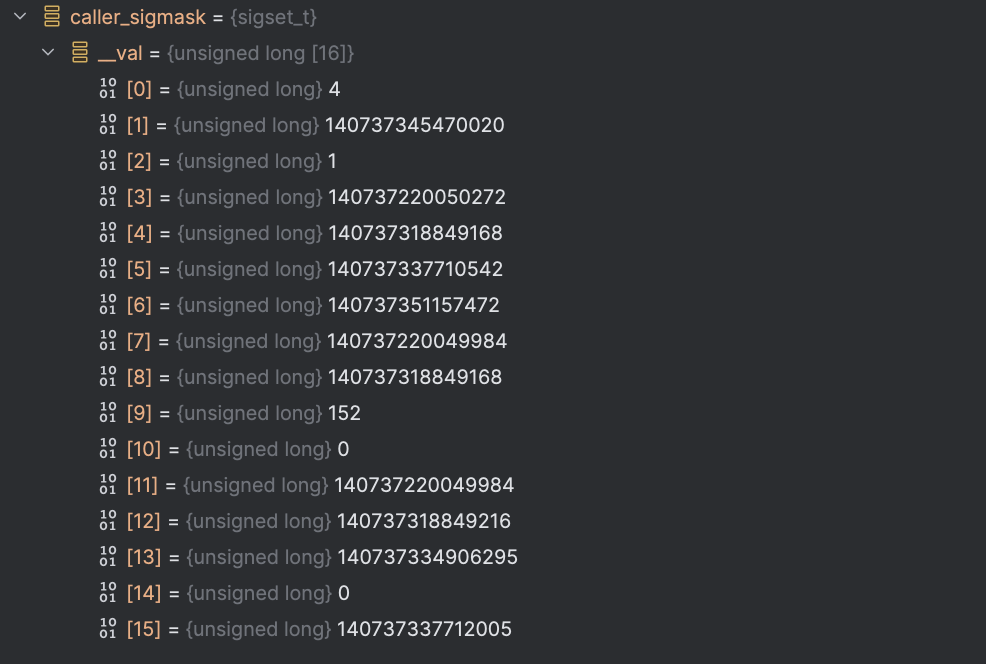

# 前置概念：主线程附着 —— `set_as_starting_thread()`

## 问题

`new JavaThread()` 创建了一个 C++ 对象来"包装"当前 OS 线程。但 `JavaThread` 需要一个 `OSThread` 对象来存储 `pthread_t`、线程 ID、栈信息等 OS 层面数据。

### OSThread 结构

每个 `JavaThread` 通过 `_osthread` 字段持有一个 `OSThread` 对象。`OSThread` 分两层定义：公共部分在 `osThread.hpp:56-110`，Linux 平台扩展在 `osThread_linux.hpp:28-135`。下面按职责分组。

**线程身份——"这是谁"**

```cpp
  thread_id_t _thread_id;      // typedef pid_t —— 就是 int。gettid() 的返回值
  pthread_t _pthread_id;       // Linux glibc 上就是 unsigned long。pthread_self() 的返回值
```

**`thread_id_t` 是什么？** `osThread_linux.hpp:28` 一行：`typedef pid_t thread_id_t;`。`pid_t` 在 Linux 上就是 `int`。所以 `_thread_id` 就是一个 `int` 变量，存的是 `gettid()` 返回的线程号。

**谁来读它？** HotSpot 自己。每次打日志时 `os::current_thread_id()` 读的就是这个字段（`os_linux.cpp:794`）。日志里的 `tid=12346` 就是这个值。外部工具如 `jstack` 通过 `/proc/<pid>/task/<tid>/` 路径读线程状态。`/proc` 是 Linux 内核暴露的虚拟文件系统（procfs）——磁盘上没有这个文件，内核现场从线程的 `task_struct` 里拼出文本返回，只在线程活着时存在。

**`pthread_t` 是什么？** Linux glibc 上就是 `unsigned long`——不是结构体，不是指针。声明 `pthread_t tid;` 就是一个普通变量。`pthread_create(&tid, NULL, func, arg)` 把新线程的 pthread ID 写入 `&tid`（即写入这个 `unsigned long` 变量）。

为什么要把一个 `unsigned long` 单独存一个字段、而不是和 `_thread_id` 合并？因为它俩是不同层的产物：`_thread_id` 由内核分配（`gettid`），`_pthread_id` 由 glibc 分配（`pthread_create` 第 1 个参数 / `pthread_self`）。主线程两者都来自"读自己"——`gettid()` + `pthread_self()`。子线程两者都是新的——内核分配新 SPID，glibc 分配新 `pthread_t`。

**启动控制——"怎么跑起来的"**

```cpp
  OSThreadStartFunc _start_proc;  // Linux 上始终为 NULL——pthread_create 直接传函数指针，不走这个字段
  void* _start_parm;              // Linux 上始终为 NULL——同上
  Monitor* _startThread_lock;     // 父子同步锁
```

`_start_proc` 和 `_start_parm` 是 Solaris 遗留——Linux 的 `pthread_create(&tid, &attr, thread_native_entry, thread)` 把入口函数和参数直接传给 pthread 库，不走这两个字段。Linux 上它们只在构造函数中初始化为 NULL（`new OSThread(NULL, NULL)`），之后从未被读写。

`_startThread_lock` 是父子同步锁：父线程 `pthread_create` 后持锁 `wait()`，等子线程在 `thread_native_entry` 里初始化完成 `notify()`。主线程的 `_startThread_lock` 在构造函数中 `new Monitor` 分配，但因为没有子线程需要等，实际不会被用到。

**线程状态——"JVM 眼里在干嘛"（遗留，不准确）**

```cpp
  volatile ThreadState _state;   // enum: ALLOCATED/INITIALIZED/RUNNABLE/MONITOR_WAIT/OBJECT_WAIT/
                                  //        CONDVAR_WAIT/BREAKPOINTED/SLEEPING/ZOMBIE
```

**注意：这不是 OS 层的线程状态。** `osThread.hpp:41-42` 源码注释直接说：

> Note: the ThreadState is **legacy code and is not correctly implemented**. Uses of ThreadState need to be replaced by the state in the JavaThread.

所以 `_state` 只用于调试日志的粗略提示——不要把它当精确状态机。

**那 Java 程序员看到的 `NEW`/`RUNNABLE`/`BLOCKED`/`WAITING` 又是什么？** 那是第三套状态——存在 `java.lang.Thread` oop 的 `threadStatus` 字段里。`Thread.getState()`、jstack、JMX 都读这个字段。HotSpot 内部用 JVMTI 位编码来存它——`Object.wait()` 时 `threadStatus` 被写成 32位 bitmask（`JVMTI_THREAD_STATE_ALIVE | WAITING | WAITING_INDEFINITELY | IN_OBJECT_WAIT`）。JVMTI agent（调试器、profiler）通过 `GetThreadState()` 拿到原始 bitmask 区分 `Object.wait()` 和 `LockSupport.park()`。Java 代码透过 `Thread.getState()` 看到的是简化后的 `WAITING`。

一个 Java 线程有三套独立的状态系统：

| | 数据位置 | 状态值 | 用途 |
|--|--|--|--|
| Java 层 | `java.lang.Thread.threadStatus`（oop 字段） | NEW/RUNNABLE/BLOCKED/WAITING/TIMED_WAITING/TERMINATED | `Thread.getState()`，JVMTI |
| JVM 内部 | `JavaThread._thread_state` | _thread_new/_thread_in_vm/_thread_in_Java/_thread_in_native/_thread_blocked | 安全点协调，RAII 转换 |
| OSThread（遗留） | `OSThread._state` | ALLOCATED/INITIALIZED/RUNNABLE/ZOMBIE 等 | 调试日志（已废弃） |
**信号处理——"SR_handler 的运行时数据"**

```cpp
  os::SuspendResume sr;          // 信号级挂起/恢复状态机（_SR_lock 文章讲过）
  void* _siginfo;                // 信号触发时的 siginfo_t
  ucontext_t* _ucontext;         // 信号触发时的寄存器上下文
  sigset_t _caller_sigmask;      // 调用者信号掩码（退出时恢复）
  address _alt_sig_stack;        // 替代信号栈基地址
```

**`sr`**——信号级挂起状态机，第 8.1 节 suspend-resume 文章中拆解过。线程收到信号 12（`SR_signum`）时，`SR_handler` 通过 `sr` 的状态转换（`SR_RUNNING → SR_SUSPEND_REQUEST → SR_SUSPENDED → SR_WAKEUP_REQUEST → SR_RUNNING`）完成"暂停-恢复"协议。

**`_siginfo` 和 `_ucontext`**——信号触发时，内核在调用 `SR_handler` 之前把这两个信息压入信号栈。`_siginfo` 存的是 `siginfo_t` 结构（谁发的信号、什么原因），`_ucontext` 存的是线程被打断瞬间的所有寄存器值（`RIP`=被打断的指令地址、`RSP`=栈指针、`RBP`=帧指针等）。`GetCallTrace`（async stack trace）通过 `_ucontext` 的 `RIP` 和 `RBP` 反向展开调用栈——这就是 profiler 不用 safepoint 也能拿到线程堆栈的原理。

**`_caller_sigmask`**——线程创建前，`hotspot_sigmask()` 把调用者的信号掩码保存到这里。线程退出时恢复——防止信号处理环境泄漏到其他线程。

**`_alt_sig_stack`**——HotSpot 为信号处理器单独分配的一个栈（`sigaltstack`）。信号处理器不跑在线程的正常栈上——因为正常栈可能已经溢出（StackOverflowError），需要一块独立的、保证可用的内存来执行信号处理逻辑。

**栈管理**

```cpp
  int _expanding_stack;          // 非零 = 正在手动扩展栈
```

仅 primordial 线程（非标准启动器场景）使用。primordial 线程的栈是 `MAP_GROWSDOWN` 按需映射的——未访问的区域没有物理页。HotSpot 的 stack guard 需要 guard zone 位置有物理页才能用 `mprotect(PROT_NONE)` 保护。`manually_expand_stack` 主动访问这些页面强制映射，期间 `_expanding_stack = 1` 标记。

**线程类型**

```cpp
  int _thread_type;              // java / compiler / gc / watcher 等
```

`os::create_thread()` 传入 `thr_type` 参数——`os::java_thread`、`os::compiler_thread`、`os::vm_thread` 等——存入此字段。主要用于日志和调试区分线程角色。

子线程走的是 `os::create_thread()` —— `pthread_create` 创建新线程，在新线程的入口函数 `thread_native_entry()` 中初始化 `OSThread`。但主线程已经存在——由内核在 `execve` 启动 `java` 进程时创建，不能再 `pthread_create` 一次。

`set_as_starting_thread()` 就是为主线程设计的——不创建新 pthread，直接绑定当前正在执行的 OS 线程。

## 调用链

```cpp
// thread.cpp:1061
bool Thread::set_as_starting_thread() {
  return os::create_main_thread((JavaThread*)this);
}

// os_linux.cpp:1065
bool os::create_main_thread(JavaThread* thread) {
  assert(os::Linux::_main_thread == pthread_self(),
         "should be called inside main thread");
  return create_attached_thread(thread);
}
```

核心在 `create_attached_thread()`。和子线程的 `os::create_thread()` 对比——前者绑定当前线程，后者 `pthread_create` 新线程。

## `os::create_attached_thread()` 逐行拆解

先看完整函数（`os_linux.cpp:1070-1131`），再逐段拆：

```cpp
bool os::create_attached_thread(JavaThread* thread) {
  // 段1: 分配 OSThread
  // 段2: 填充线程 OS 信息
  // 段3: NUMA 亲和性
  // 段4: 主线程栈扩展
  // 段5: 信号掩码 + 日志
}
```

### 段 1：分配 OSThread

```cpp
#ifdef ASSERT
  thread->verify_not_published();
#endif

  OSThread* osthread = new OSThread(NULL, NULL);
```

debug 模式验证 JavaThread 尚未被发布到全局线程列表。`new OSThread(NULL, NULL)` 在 C-Heap 上分配，两个参数为 NULL 表示没有预置启动函数和参数——因为这个线程不是通过 `pthread_create` 启动的，它已经在运行。

```cpp
  if (osthread == NULL) {
    return false;
  }
```

分配失败——比如 OOM——直接返回 false。`set_as_starting_thread()` 接收到 false 后会调用 `vm_shutdown_during_initialization("Failed necessary internal allocation. Out of swap space")` 放弃启动。

当前状态：`JavaThread._osthread` 仍是 NULL（`new JavaThread()` 没设置它）。新分配的 `OSThread` 对象还没和 `JavaThread` 关联。

### 段 2：填充当前线程的 OS 信息

```cpp
  osthread->set_thread_id(os::Linux::gettid());
```

写入内核线程 TID（`gettid()` 返回值，`/proc/self/status` 里的 `Tgid`）。`osthread._thread_id` 此刻被设置。

```cpp
  osthread->set_pthread_id(::pthread_self());
```

写入 POSIX 线程 ID。**关键——这里不是 `pthread_create` 返回的 tid。** 对于主线程和 JNI 附加线程，`pthread_self()` 直接返回**当前正在执行代码的这个 pthread** 自身的 ID。不需要创建新线程。

```cpp
  os::Linux::init_thread_fpu_state();
```

初始化浮点控制寄存器（FPU）。确保线程的 FPU 状态一致——不管原来是什么状态，都重置为默认。

```cpp
  osthread->set_state(RUNNABLE);
```

线程状态设为 `RUNNABLE`。子线程路径中初始状态是 `ALLOCATED`，然后子线程在 `thread_native_entry` 中自己改为 `INITIALIZED`。主线程直接设为 `RUNNABLE`。注意：`OSThread._state` 是遗留代码（`osThread.hpp:41`），真正的状态管理在 `JavaThread._thread_state` 里——这里设它只是为了保证这个遗留字段不被其他代码读成垃圾值。

```cpp
  thread->set_osthread(osthread);
```

`JavaThread._osthread = osthread`。JavaThread 和 OSThread 的双向关联完成——JavaThread 有了 OS 层表示，后续可以通过 `thread->osthread()->get_state()` 查询线程状态。

执行后状态：

```
JavaThread._osthread → osthread {
    _thread_id = gettid(),
    _pthread_id = pthread_self()
}
```

### 段 3：NUMA 亲和性

```cpp
  if (UseNUMA) {
    int lgrp_id = os::numa_get_group_id();
    if (lgrp_id != -1) {
      thread->set_lgrp_id(lgrp_id);
    }
  }
```

如果开启了 `-XX:+UseNUMA`（非统一内存访问架构），把当前线程绑到它所在的 NUMA 节点。`numa_get_group_id()` 返回当前 CPU 所属的 NUMA locality group ID。存到 `JavaThread._lgrp_id`——后续内存分配（如 TLAB）可以根据这个值从本 NUMA 节点分配，减少跨节点内存访问延迟。

如果没开 NUMA——整个 if 块被跳过，`_lgrp_id` 保持默认值。

### 段 4：主线程栈扩展

```cpp
  if (os::is_primordial_thread()) {
    JavaThread *jt = (JavaThread *)thread;
    address addr = jt->stack_reserved_zone_base();
    assert(addr != NULL, "initialization problem?");
    assert(jt->stack_available(addr) > 0, "stack guard should not be enabled");

    osthread->set_expanding_stack();
    os::Linux::manually_expand_stack(jt, addr);
    osthread->clear_expanding_stack();
  }
```

`is_primordial_thread()` 检查当前线程是否是 primordial（`main()` 所在的 pthread）。由标准 Java 启动器创建时这个函数返回 false——整个段被跳过。

只在非标准嵌入场景才执行。主线程的栈是用 `MAP_GROWSDOWN` 映射的——按需增长，未访问的区域没有物理页。HotSpot 的 stack guard（栈守卫）需要在 yellow zone 位置写入时立即触发 `SIGSEGV`。如果这个位置还没被物理映射，内核会尝试"扩展栈"而不是发信号——导致 guard 失效。

`manually_expand_stack` 主动访问栈上的页面，强制内核把它们映射进来。之后 `create_stack_guard_pages()` 把 guard zone 用 `mprotect(PROT_NONE)` 保护起来——此时这些页面已经映射好了，`mprotect` 才有效。

### 段 5：信号掩码 + 日志

```cpp
  os::Linux::hotspot_sigmask(thread);
```

**这个函数解决的问题**：Linux 上每个线程有一个"信号屏蔽字"——被屏蔽的信号不会送达这个线程。`pthread_create` 创建的子线程会**继承父线程的屏蔽字**。如果父线程屏蔽了 `SIGSEGV`，子线程也收不到段错误信号——而 HotSpot 用 `SIGSEGV` 实现 NullPointerException 检测。`hotspot_sigmask` 就是确保新线程能收到 HotSpot 需要的信号。

函数体（`os_linux.cpp:600-620`）：

```cpp
void os::Linux::hotspot_sigmask(Thread* thread) {
  sigset_t caller_sigmask;
  pthread_sigmask(SIG_BLOCK, NULL, &caller_sigmask);   // ①
  thread->osthread()->set_caller_sigmask(caller_sigmask); // ②
  pthread_sigmask(SIG_UNBLOCK, unblocked_signals(), NULL); // ③
  if (!ReduceSignalUsage) {                                // ④
    if (thread->is_VM_thread())
      pthread_sigmask(SIG_UNBLOCK, vm_signals(), NULL);
    else
      pthread_sigmask(SIG_BLOCK, vm_signals(), NULL);
  }
}
```

**① 拍照保存当前的屏蔽字。** `caller_sigmask` 是栈上的局部变量，类型是 `sigset_t`（在 glibc 上是 `unsigned long[16]——1024 bit 的位图，覆盖 1024 个信号位置）。`pthread_sigmask(SIG_BLOCK, NULL, &caller_sigmask)` 第二个参数是 `NULL`——不修改屏蔽字，只把当前每个信号位填到 `caller_sigmask` 数组里。常见的主线程默认情况下 word 0 会有非零位（CRT/启动器屏蔽了 SIGINT、SIGHUP 等），JNI 附加线程的值取决于原生代码的设置。`caller_sigmask` 在调试器中显示如下：




**② 存到 `OSThread._caller_sigmask`。** 这个照片留给线程退出时恢复——保证 HotSpot 不永久改变调用者的信号环境。

**③ 把自己需要的信号放开。** `unblocked_signals()` 返回一个静态全局 `sigset_t*`——它在 `signal_sets_init()`（`os_linux.cpp:540`，Stage 3 的 `os::init_2()` 中调用）里初始化好了，包含了 HotSpot 必须接收的信号：`SIGSEGV`（NullPointerException）、`SIGBUS`、`SIGFPE`、`SIGILL`、`SR_signum`（信号 12——线程挂起），以及 shutdown 钩子需要的 `SHUTDOWN1/2/3_SIGNAL`。`pthread_sigmask(SIG_UNBLOCK, ...)` 把当前屏蔽字中这些信号的屏蔽解除——线程现在能收到它们了。

**④ `Ctrl-\`（线程 dump）只发给 VMThread。** `vm_signals()` 只包含 `SIGBREAK`。只有 VMThread 接收（`SIG_UNBLOCK`），其他线程屏蔽（`SIG_BLOCK`）——因为 `Ctrl-\` 触发的线程 dump 必须由 VMThread 在 safepoint 中统一执行。`-Xrs` 参数使整个分支被跳过。

```cpp
  log_info(os, thread)("Thread attached (tid: " UINTX_FORMAT
                       ", pthread id: " UINTX_FORMAT
                       ", stack: " PTR_FORMAT " - " PTR_FORMAT
                       " (" SIZE_FORMAT "K) ).",
                       os::current_thread_id(), (uintx) pthread_self(),
                       p2i(thread->stack_base()), p2i(thread->stack_end()),
                       thread->stack_size() / K);

  return true;
}
```

打一行日志，记录线程的 TID、pthread ID、栈范围、栈大小。返回 true——附着成功。

## 和子线程路径的对比

子线程走 `os::create_thread()`：

```cpp
OSThread* osthread = new OSThread(NULL, NULL);
osthread->set_state(ALLOCATED);               // ← ALLOCATED，不是 RUNNABLE

pthread_create(&tid, &attr, thread_native_entry, thread);  // 创建新线程

// 父线程等子线程初始化完成
while (osthread->get_state() == ALLOCATED) {
  sync_with_child->wait();   // 子线程初始化完成后 set_state(INITIALIZED) 唤醒父线程
}
```

| | `create_attached_thread` | `create_thread` |
|--|:--:|:--:|
| `pthread_create` | 无——`pthread_self()` | 有——内核分配新 pthread |
| 初始状态 | `RUNNABLE` | `ALLOCATED` |
| 父线程同步 | 不需要等 | 等子线程达到 `INITIALIZED` |
| 适用线程 | 主线程、JNI 附加线程 | Worker/Compiler/GC 子线程 |

## JNI 附加线程也走同样的路径

`AttachCurrentThread`（`jni.cpp:4192`）——native 线程想变成 Java 线程时——同样调用 `os::create_attached_thread()`。流程和主线程几乎一样：

```cpp
JavaThread* thread = new JavaThread(true);             // _attaching_via_jni
thread->record_stack_base_and_size();
os::create_attached_thread(thread);                    // ← 同一个函数
thread->create_stack_guard_pages();
Threads::add(thread);
thread->set_done_attaching_via_jni();                  // _attached_via_jni
```

唯一区别：构造参数 `true` 设置 `_jni_attach_state = _attaching_via_jni`，完成后转为 `_attached_via_jni`。主线程的这个状态始终是 `_not_attaching_via_jni`。
