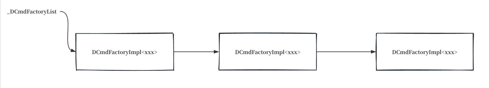

# 4.2 management_init — JVM 管理 API 的 C++ 侧地基

4.1 节给出了 `init_globals()` 的 30 项全貌。本节展开第一项 `management_init()`——它是 `HandleMark hm` 之后的第一行，为 JVM 的"管理 API"铺 C++ 侧地基。

`management_init()` 本身只有 10 行，但它背后是一整个"JVM 管理"子系统。在进入源码之前，必须先搞清楚一个根本问题：**"management" 这个词在 HotSpot 里到底是什么意思？**

---

## "management" 到底是干什么的

这不是 HotSpot 自己发明的概念，而是一个正式的 Java 规范——**JSR 174：Monitoring and Management Specification for the Java Virtual Machine**（2004 年 9 月最终发布，从 J2SE 5.0 开始进入 JDK）。

### JSR 174 官方定义

JSR 174 的标题是 "Monitoring and Management Specification for the Java Virtual Machine"。官方在 "Request" 章节把 management 的职责明确分为**两大类**：

> **Health Indicators（健康指标）** —— 让 Java 应用、系统管理工具、RAS 工具能监控 JVM 的健康状态：
> - Class load/unload（类加载/卸载）
> - Memory allocation statistics（内存分配统计）
> - Garbage collection statistics（GC 统计）
> - Monitor info & statistics（监视器信息和统计）
> - Thread info & statistics（线程信息和统计）
> - Just-in-Time statistics（JIT 编译统计）
> - Object info（堆中对象信息，show/count all objects）
> - Underlying OS and platform info（底层 OS 和平台信息）
>
> **Run-Time Control（运行时控制）** —— 让工具能动态调整 JVM 的运行时行为：
> - Minimum heap size（最小堆大小）
> - Verbose GC on demand（按需打开 GC verbose）
> - Garbage collection control（GC 控制，如触发 System.gc）
> - Thread creation control（线程创建控制）
> - Just-in-Time compilation control（JIT 编译控制）

JSR 174 还规定了几个**设计原则**：
- **Very low performance impact**——即使监控事件开启，性能影响也要极低
- **Restricted to low frequency events**——只支持低频事件，不做高频采样
- **Interface should be self describing**——接口自描述，不需要静态绑定
- **Mandatory and optional set**——分为强制支持和可选支持的能力

### Java 侧的 API：java.lang.management 包

JSR 174 在 Java 侧落地为 `java.lang.management` 包（Oracle 官方文档原文）：

> "Provides the management interfaces for monitoring and management of the Java virtual machine and other components in the Java runtime. It allows both local and remote monitoring and management of the running Java virtual machine."
>
> —— `java.lang.management` package summary

这个包提供 9 个标准 MXBean 接口（每个对应 JVM 的一个子系统）：

| MXBean 接口 | 管 JVM 的哪部分 |
|-------------|----------------|
| `ClassLoadingMXBean` | 类加载系统 |
| `MemoryMXBean` | 内存系统 |
| `ThreadMXBean` | 线程系统 |
| `RuntimeMXBean` | 运行时系统 |
| `OperatingSystemMXBean` | 底层操作系统 |
| `CompilationMXBean` | JIT 编译系统 |
| `GarbageCollectorMXBean` | 垃圾收集器 |
| `MemoryManagerMXBean` | 内存管理器 |
| `MemoryPoolMXBean` | 内存池 |

用户代码通过 `ManagementFactory.getClassLoadingMXBean()` 等静态方法获取这些 MXBean。

### 三类能力对应 JSR 174 的两大类

把 JSR 174 的 "Health Indicators" 和 "Run-Time Control" 拆到代码层面，对应三类操作：

| 能力类型 | JSR 174 分类 | 做什么 | 典型例子 |
|---------|-------------|--------|---------|
| **读**（查询） | Health Indicators | 查询 JVM 当前状态，返回数据，不改变任何东西 | `getThreadCount()` 查线程数 / `getHeapMemoryUsage()` 查堆使用量 / `getLoadedClassCount()` 查类加载数 |
| **写**（修改配置） | Run-Time Control | 修改 JVM 运行时配置/开关，返回旧值 | `setVerbose(true)` 打开详细输出（verbose 是"啰嗦"的意思，让 JVM 多打印日志，如 `-verbose:gc` 每次都打印 GC 详情） / `setThreadCpuTimeEnabled(true)` 开启 CPU 时间统计 / `setUsageThreshold(N)` 设置内存告警阈值 |
| **触发动作**（执行一次性操作） | Run-Time Control | 让 JVM 立即干一件事，有副作用 | `gc()` 触发一次 GC / `dumpHeap()` 堆转储到文件 / `findDeadlockedThreads()` 死锁检测 / `resetPeakThreadCount()` 重置峰值 |

读者第一反应往往是"监控/观察 JVM"——这只覆盖了 "Health Indicators"（读）那一类。读到后面出现的"操作 JVM"其实属于 "Run-Time Control"（写+触发动作）——这两类都是 JSR 174 规范定义的 management 的职责。`management_init` 同时为这三类能力铺地基。

### 一个具体的场景：你作为运维和开发会做什么

假设你写了个 Java 程序跑着：

```java
public class MyApp {
    public static void main(String[] args) throws Exception {
        while (true) {
            Thread.sleep(1000);
            System.out.println("running...");
        }
    }
}
```

`java MyApp` 启动后进程在后台跑。你作为运维/开发会对这个 JVM 做**三类不同的事**（对应 JSR 174 的两大类）：

**1. 想知道它现在状态如何（读 → Health Indicators）**：
- 它跑了多久了？
- 加载了多少个类？
- 堆用了多少内存？
- 现在有多少线程？
- GC 触发了几次？每次多久？

**2. 想调整它的运行时配置（写 → Run-Time Control）**：
- 打开 `-XX:+PrintGC` 让它打印每次 GC 信息
- 打开线程竞争监控看哪些线程在锁上等待
- 给老年代设一个使用率阈值，超过 80% 就告警

**3. 想让它立即干件事（触发动作 → Run-Time Control）**：
- 强制触发一次 GC（`System.gc()`）
- 把整个堆转储到文件分析内存泄漏
- 打印所有线程的栈看有没有死锁
- 重置线程数峰值统计

这三类操作对应 HotSpot management 子系统提供的 40+ 个 jmm 接口函数（读/写/触发动作）和 40+ 个 DCmd 诊断命令。`management_init` 就是给这些能力的 C++ 侧铺地基。

### 三类操作各自走哪条通道

上面三类操作，JDK 给了多种工具和 API 让你能发起：

**方式一：命令行工具**（`JAVA_HOME/bin/` 下）

| 工具 | 用途 | 典型用法 | 能力类型 |
|------|------|---------|---------|
| `jps` | 列出所有 Java 进程 | `jps -l` | 读 |
| `jstat` | 实时监控 GC / 类加载 / 编译 | `jstat -gc <pid> 1000` | 读 |
| `jcmd` | 万能诊断命令（可读可写可触发） | `jcmd <pid> Thread.print`（触发） / `jcmd <pid> VM.flags`（读） / `jcmd <pid> VM.set_flag PrintGC true`（写） | 三类都有 |
| `jstack` | 打印线程栈 | `jstack <pid>` | 触发 |
| `jmap` | 堆转储 / 直方图 | `jmap -histo <pid>` | 触发 |
| `jinfo` | 查看/修改 VM flag | `jinfo -flag PrintGC <pid>`（读） / `jinfo -flag +PrintGC <pid>`（写） | 读+写 |

这些工具不需要目标 JVM 改代码——`jstat` 直接读 PerfData 共享内存（本章下文会讲），`jcmd`/`jstack`/`jmap` 通过 attach API 让目标 JVM 执行命令。attach API 的底层原理（`AttachListener` 线程、UNIX socket 通信、`/tmp/.attach_pid<pid>` 握手文件）后续章节会详细展开。

**方式二：图形工具**

| 工具 | 用途 |
|------|------|
| `jconsole` | JMX 图形监控（自带，JDK 9 后从 bin 移到 lib） |
| `jvisualvm` | 堆/CPU/线程图形分析（JDK 9 后独立下载） |
| `JMC` | Java Mission Control，飞行记录分析 |

这些都是 Java 写的图形程序，需要 X11 窗口系统才能显示。Linux 上有三种用法：

1. **本地有桌面环境**（如 GNOME/KDE）— 直接运行 `jconsole <pid>` 即可
2. **远程服务器无桌面** — 通过 `ssh -X user@server` 把图形转发到本地 X server，或在本机用 `jconsole` 通过 JMX 远程连接服务器的 `jmxremote.port`
3. **纯命令行服务器**（无 X11，无 forwarding）— 图形工具用不了，只能用方式一的命令行工具

`jconsole` 连上 JVM 后能自动每秒采样数据画曲线（读）、能打开/关闭 verbose 开关（写）、能点按钮触发堆转储（触发动作）。

**方式三：Java 代码**

Java 代码通过 `java.lang.management` 包（JSR 174 规范）查询和操作 JVM：

```java
import java.lang.management.*;

// === 读操作（Health Indicators）===
long uptime = ManagementFactory.getRuntimeMXBean().getUptime();
int loadedCount = ManagementFactory.getClassLoadingMXBean().getLoadedClassCount();
int threadCount = ManagementFactory.getThreadMXBean().getThreadCount();
MemoryUsage heap = ManagementFactory.getMemoryMXBean().getHeapMemoryUsage();

// === 写操作（Run-Time Control）===
ManagementFactory.getClassLoadingMXBean().setVerbose(true);   // 打开类加载 verbose
ManagementFactory.getThreadMXBean().setThreadCpuTimeEnabled(true);  // 开启 CPU 时间统计

// === 触发动作（Run-Time Control）===
ManagementFactory.getMemoryMXBean().gc();                       // 触发一次 GC
long[] deadlocked = ManagementFactory.getThreadMXBean().findDeadlockedThreads();  // 死锁检测
ManagementFactory.getThreadMXBean().resetPeakThreadCount();     // 重置峰值
```

`ManagementFactory` 提供 `getXxxMXBean()` 静态方法返回 "MXBean" 对象——每个 MXBean 对应一类 JVM 状态（ThreadMXBean 管线程、MemoryMXBean 管内存、ClassLoadingMXBean 管类加载等）。

---

## management_init 在这个体系里扮演什么角色

上面三种方式——命令行工具、图形工具、Java 代码——它们的**数据从哪里来**？

答案：**全部最终来自 HotSpot 的 C++ 层**。

但具体怎么从 C++ 传到 Java / 外部工具，有两条不同的通道：

### 通道 A：PerfData 共享内存（ch03/05 已创建，management_init 来填数据）

ch03/05 的 `perfMemory_init` 创建了一个文件 `/tmp/hsperfdata_<user>/<pid>`（在 `tmpdir` 下，名字是 JVM 进程 PID），用 `mmap` 映射到 JVM 进程的虚拟地址空间。这个文件就是 PerfData 共享内存——JVM 往里写数据，外部工具 mmap 同一个文件读出来。

```
JVM 进程                                外部工具（jstat）
┌──────────────────────────┐           ┌──────────────────┐
│ management_init()        │           │                  │
│ 注册 22 个计数器          │           │  open + mmap     │
│   ↓ PerfDataManager      │           │   /tmp/hsperf..  │
│   ↓ create_counter       │           │     ↑            │
│   ↓ 写入共享内存地址      │←──────────│  读同一片内存     │
│                          │  共享内存  │                  │
│ /tmp/hsperfdata_xxx/12345│           │  零系统调用      │
└──────────────────────────┘           └──────────────────┘
```

**关键点**：通道 A 是**被动的**——JVM 往共享内存写完就完事，外部工具随时来读，**不需要 JVM 进程配合**。这就是 `jstat` 高频采样不卡 JVM 的原因。

但 PerfData 共享内存里目前还是空的——`perfMemory_init` 只建了"仓库"（文件 + mmap），还没往里放数据。`management_init` 就是第一批往里放数据的——22 个 PerfData 计数器（线程数、类加载数、safepoint 统计等）。后续 `universe_post_init`、`compileBroker_init` 等还会继续往里加。

### 通道 A 解决不了的问题

通道 A 看起来很完美——零开销、被动读、不卡 JVM。但它有根本限制：**共享内存里只能放简单数值**。

考虑这几个用例：

| 用例 | 通道 A 能做吗？ | 为什么 |
|------|----------------|--------|
| 读当前活线程数 | 能（一个 int） | 计数器就是简单数值 |
| 读当前堆使用了多少字节 | 能（一个 long） | 计数器 |
| 检测当前有没有死锁 | **不能** | 要遍历所有线程的锁关系图，不是读一个数 |
| 打印所有线程的栈 | **不能** | 要遍历线程 + 读每个线程的栈帧，输出大段文本 |
| 触发一次 GC | **不能** | 这是"让 JVM 干件事"，不是"读个数" |
| 转储整个堆到文件 | **不能** | 复杂操作 + 大量数据 |

通道 A 是"被动的、只读的、单值查询"——它把 JVM 状态压扁成一个个数字。但监控和诊断经常需要"让 JVM 主动干件事"或"查询复杂结构化数据"——这就要求**每次操作都进 JVM 执行 C++ 代码**，按需返回结果。

### 通道 B：Java 代码主动调 JVM 干活

通道 B 解决的就是"让 JVM 干件事"。它不是走共享内存，而是**走函数调用**——Java 代码发起调用，进 JVM 执行 C++ 函数，返回结果。

还是用前面"观察 JVM"的 Java 代码例子：

```java
int threadCount = ManagementFactory.getThreadMXBean().getThreadCount();
```

这行代码背后发生了什么？`getThreadCount()` 不是读共享内存——它最终调用到 HotSpot C++ 侧的 `ThreadService`，读取那个 `_live_threads_count` 计数器（就是通道 A 注册的同一个计数器）返回。

具体调用链（简化）：

```
你的 Java 代码
  └─ ThreadMXBean.getThreadCount()                      Java 接口方法
       └─ ThreadImpl.getThreadCount()                     Java 实现类
            └─ native getThreadCount()                    JNI native 方法
                 └─ libmanagement.so 里的 C 函数          JVM 入口
                      └─ 通过 jmm_interface 函数表查表     函数指针调用
                           └─ jmm_GetLongAttribute(...)   HotSpot C++ 函数
                                └─ 读 _live_threads_count 的值  最终数据源
```

前 4 层都是 Java/JNI 世界的常规代码——Java 接口、Java 实现类、native 方法、JNI 入口。关键是第 5 步那个"**jmm_interface 函数表**"——这是 Java 世界和 C++ 世界之间的桥梁。

**为什么需要函数表？** Java 代码不能直接调 C++ 函数（JNI 规范决定的）。`libmanagement.so`（JDK 自带的 native 库）在加载时通过 `JVM_GetManagement()` 一次性拿到 HotSpot 提供的函数指针表，之后每次调用都通过这个表的某个函数指针进 JVM。`jmm_interface` 就是这个函数指针表——约 40 个函数指针，每个对应一类操作（读计数器、读线程信息、找死锁、堆转储等）。

**为什么叫"主动"通道？** 和通道 A 对比就清楚了：

| 维度 | 通道 A（PerfData 共享内存） | 通道 B（jmm_interface 函数表） |
|------|---------------------------|------------------------------|
| 谁发起 | 外部工具主动读 | Java 代码主动调 |
| 是否进 JVM | 不进，直接读 mmap | 进 JVM 执行 C++ 函数 |
| 能做什么 | 只能读简单数值 | 任何事（死锁检测、堆转储、触发 GC） |
| 开销 | 零（读内存） | JNI 调用开销 |
| 谁走这条路 | jstat、jcmd PerfCounter.print | jconsole、Java 代码、jcmd（大部分命令） |

**management_init 同时为两条通道做准备**：
- 注册 22 个 PerfData 计数器 → 给通道 A（让 jstat 能读到数）
- 初始化能力位 + 注册 DCmd → 给通道 B（让 Java/jcmd 能调命令）

通道 A 的数据已经讲清楚了（22 个计数器）。通道 B 涉及的能力位和 DCmd 在下文 `Management::init()` 详解里展开。

---

## management_init 全貌源码

```cpp
/* === src/hotspot/share/services/management.cpp === */

void management_init() {
  Management::init();
  ThreadService::init();
  RuntimeService::init();
  ClassLoadingService::init();
}
```

四个 `init()` 的分工：

| 函数 | 职责 | 注册的 PerfData 数 |
|------|------|-------------------|
| `Management::init()` | 3 个时间戳 PerfVariable + 9 个能力位 + 40+ DCmd 注册 | 3 |
| `ThreadService::init()` | 线程计数（live/peak/daemon/started） | 4 |
| `RuntimeService::init()` | safepoint 统计 + jvmVersion 常量 + jvmCapabilities 串 | 6 |
| `ClassLoadingService::init()` | 类加载/卸载计数 + 字节数 | 9 |
| **合计** | | **22** |

这 22 个 PerfData 计数器就是通道 A 第一批填进共享内存的数据，也是后续 `jstat` 能读到的东西。`Management::init()` 还额外做了能力位和 DCmd 注册（给通道 B）。下面逐个展开。

---

## Management::init() — 时间戳 + 能力位 + DCmd 注册

```cpp
/* === src/hotspot/share/services/management.cpp === */

void Management::init() {
  EXCEPTION_MARK;

  // 1. 创建 3 个 PerfVariable 计时器
  _begin_vm_creation_time =
            PerfDataManager::create_variable(SUN_RT, "createVmBeginTime",
                                             PerfData::U_None, CHECK);
  _end_vm_creation_time =
            PerfDataManager::create_variable(SUN_RT, "createVmEndTime",
                                             PerfData::U_None, CHECK);
  _vm_init_done_time =
            PerfDataManager::create_variable(SUN_RT, "vmInitDoneTime",
                                             PerfData::U_None, CHECK);

  // 2. 初始化 _optional_support（9 个能力位）
  _optional_support.isLowMemoryDetectionSupported = 1;
  _optional_support.isCompilationTimeMonitoringSupported = 1;
  _optional_support.isThreadContentionMonitoringSupported = 1;
  if (os::is_thread_cpu_time_supported()) {
    _optional_support.isCurrentThreadCpuTimeSupported = 1;
    _optional_support.isOtherThreadCpuTimeSupported = 1;
  } else {
    _optional_support.isCurrentThreadCpuTimeSupported = 0;
    _optional_support.isOtherThreadCpuTimeSupported = 0;
  }
  _optional_support.isObjectMonitorUsageSupported = 1;
#if INCLUDE_SERVICES
  _optional_support.isSynchronizerUsageSupported = 1;
#endif
  _optional_support.isThreadAllocatedMemorySupported = 1;
  _optional_support.isRemoteDiagnosticCommandsSupported = 1;

  // 3. 注册诊断命令
  DCmdRegistrant::register_dcmds();
  DCmdRegistrant::register_dcmds_ext();
  uint32_t full_export = DCmd_Source_Internal | DCmd_Source_AttachAPI
                         | DCmd_Source_MBean;
  DCmdFactory::register_DCmdFactory(
      new DCmdFactoryImpl<NMTDCmd>(full_export, true, false));
}
```

三件事：创建计时器、声明能力位、注册 DCmd。

### 1. 3 个 PerfVariable 计时器

这三个计数器记录 JVM 启动的三个关键时间戳（都是绝对时间，单位毫秒）。创建方式和 ch03/06 节讲过的 `ObjectMonitor::Initialize()` 完全一样——都是调用 `PerfDataManager::create_variable()`，在 ch03/05 创建的 PerfData 共享内存里分配一个 `PerfDataEntry`（填头部 + 数据区），`_valuep` 直接指向共享内存数据区，后续写入零系统调用。本节不再重复 PerfDataEntry 的创建细节，只列计数器清单和运行时含义：

| 计数器全名 | 写入时机 | 含义 |
|-----------|---------|------|
| `sun.rt.createVmBeginTime` | `TraceVmCreationTime::end()` | `Threads::create_vm` 开始时间 |
| `sun.rt.createVmEndTime` | 同上 | `Threads::create_vm` 结束时间 |
| `sun.rt.vmInitDoneTime` | `set_init_completed()` 之后 | VM 初始化完成时间 |

`RuntimeMXBean.getStartTime()` 返回的就是 `vmInitDoneTime`。`createVmBeginTime` 和 `createVmEndTime` 这两个计数器的值由 `TraceVmCreationTime` 填入——ch03/02 讲过，`Threads::create_vm` 末尾会显式调用 `create_vm_timer.end()`（`thread.cpp:4080`），`end()` 调用 `Management::record_vm_startup_time(begin, duration)`（`management.cpp:200`），把启动开始时间和总耗时写到对应的 PerfVariable：

```cpp
/* === src/hotspot/share/services/management.cpp:200-208 === */

void Management::record_vm_startup_time(jlong begin, jlong duration) {
  if (_begin_vm_creation_time == NULL) return;   // PerfData 未初始化（vm init 失败）
  _begin_vm_creation_time->set_value(begin);              // 写入 createVmBeginTime
  _end_vm_creation_time->set_value(begin + duration);    // 写入 createVmEndTime
  PerfMemory::set_accessible(true);                       // 允许外部工具 mmap 读
}
```

注意最后一行 `PerfMemory::set_accessible(true)`——直到这一刻，PerfData 共享内存才对外部工具开放读取。ch03/05 创建了共享内存文件，但直到这里（`create_vm` 末尾，`end()` 被调用）才标记可读——保证外部工具读到的是完整的、已填好的计数器。

### 2. 9 个能力位（jmmOptionalSupport）

这一步**就是往 `_optional_support` 这个 C++ 结构体里写 9 个 bit 标记**，没做其他任何事情——不创建对象、不分配内存、不注册回调。整个 `_optional_support` 是个静态结构体字段，Java 层第一次访问 MXBean 时通过 `jmm_GetOptionalSupport` 一次性读走这 9 个 bit，据此决定哪些方法可用、哪些抛 `UnsupportedOperationException`。

先看这个结构体长什么样：

```cpp
/* === src/hotspot/share/include/jmm.h === */

typedef struct {
  unsigned int isLowMemoryDetectionSupported         : 1;
  unsigned int isCompilationTimeMonitoringSupported  : 1;
  unsigned int isThreadContentionMonitoringSupported: 1;
  unsigned int isCurrentThreadCpuTimeSupported      : 1;
  unsigned int isOtherThreadCpuTimeSupported        : 1;
  unsigned int isObjectMonitorUsageSupported        : 1;
  unsigned int isSynchronizerUsageSupported         : 1;
  unsigned int isThreadAllocatedMemorySupported     : 1;
  unsigned int isRemoteDiagnosticCommandsSupported   : 1;
  unsigned int                                        : 22;  // 保留位
} jmmOptionalSupport;
```

这是个 C 位域结构体（bit-field）——每个字段后面跟 `: 1` 表示这个字段只占 1 个 bit。9 个能力位 + 22 位保留 = 32 位，正好一个 `unsigned int`（4 字节）。

**三处代码的分工**：

| 位置 | 做什么 |
|------|--------|
| `jmm.h:57-68` | 定义结构体类型（9 个能力位 + 22 保留位 = 32 bit） |
| `management.hpp:41` | 声明 `static jmmOptionalSupport _optional_support;`（Management 类的静态字段） |
| `management.cpp:82` | 初始化为 `{0}`——C++ 静态变量定义，所有位清零 |
| `management.cpp:118-136` | `Management::init()` 里逐个位赋值（就是下面的 `// 2.` 部分） |
| `management.hpp:68` | 声明 `get_optional_support(jmmOptionalSupport*)`——运行时 Java 层通过它读取 |

所以你在 `management.cpp:82` 看到的 `jmmOptionalSupport Management::_optional_support = {0};` 就是这个静态字段的定义——把所有 32 位清零。之后 `Management::init()` 在 `// 2.` 部分逐个把某些位设为 1，声明 JVM 支持这些能力。

9 个布尔位各自提供的能力：

| 能力位 | 设置条件 | 提供的能力 | 对应的 Java API |
|--------|---------|----------|----------------|
| `isLowMemoryDetectionSupported` | 恒为 1 | **低内存告警**：给内存池设一个使用率阈值（如老年代 80%），超过后自动触发通知。背后的 `LowMemoryDetector` 在 Service 线程中检查阈值，通过 `Sensor`（Java 侧的告警器）通知注册的监听器 | `MemoryPoolMXBean.setUsageThreshold(long)` / `isUsageThresholdExceeded()` |
| `isCompilationTimeMonitoringSupported` | 恒为 1 | **JIT 编译耗时查询**：能查到 JVM 累计花了多少毫秒做 JIT 编译 | `CompilationMXBean.getTotalCompilationTime()` |
| `isThreadContentionMonitoringSupported` | 恒为 1 | **线程竞争统计**：开启后能查到每个线程在锁上等待了多久、多久进过 synchronized 块。默认关闭，开启有性能开销 | `ThreadMXBean.setThreadContentionMonitoringEnabled(true)` / `getThreadInfo(id).getBlockedTime()` |
| `isCurrentThreadCpuTimeSupported` | `os::is_thread_cpu_time_supported()` | **当前线程 CPU 时间**：查当前线程累计用了多少 CPU 时间（纳秒）。依赖 OS 支持——某些嵌入式平台不支持 | `ThreadMXBean.getCurrentThreadCpuTime()` |
| `isOtherThreadCpuTimeSupported` | 同上 | **其他线程 CPU 时间**：查任意指定线程的 CPU 时间，不只是当前线程。同样依赖 OS | `ThreadMXBean.getThreadCpuTime(long id)` |
| `isObjectMonitorUsageSupported` | 恒为 1 | **ObjectMonitor 使用情况**：`dumpAllThreads` 时能带上每个线程持有了哪些 synchronized 锁（ObjectMonitor）的信息 | `ThreadMXBean.dumpAllThreads(lockedMonitors=true, ...)` |
| `isSynchronizerUsageSupported` | `INCLUDE_SERVICES` | **JSR-166 同步器使用情况**：`dumpAllThreads` 时能带上每个线程持有了哪些 `ReentrantLock`/`ReentrantReadWriteLock` 等 JSR-166 同步器。同时是 `findDeadlockedThreads()`（找死锁，含 Lock 锁的）的前提 | `ThreadMXBean.findDeadlockedThreads()` |
| `isThreadAllocatedMemorySupported` | 恒为 1 | **线程分配内存统计**：查每个线程在 Java 堆上累计分配了多少字节（TLAB 分配量累加）。用于排查哪个线程分配对象最多 | `ThreadMXBean.getThreadAllocatedBytes(long id)` |
| `isRemoteDiagnosticCommandsSupported` | 恒为 1 | **远程诊断命令**：能通过 JMX 远程连接执行 DCmd 诊断命令（如 `Thread.print`、`GC.heap_dump`）。否则只能本地 attach | `DiagnosticCommandMBean` 是否可用 |

几个需要说明的：

**`isCurrentThreadCpuTimeSupported` / `isOtherThreadCpuTimeSupported` 依赖 OS**：HotSpot 调用 `os::is_thread_cpu_time_supported()` 判断——Linux/Windows/macOS 都支持，某些嵌入式平台（如纯 RTOS 移植）可能返回 false。此时两个位为 0，对应的 `ThreadMXBean` 方法返回 -1。这两个位通常同时为 1 或同时为 0。

**`isSynchronizerUsageSupported` 依赖 `INCLUDE_SERVICES`**：这是一个编译期宏，控制是否编译 heap inspector 等服务。标准 JDK 构建都启用，裁剪版可能关闭。它是 `findDeadlockedThreads()`（查找包括 `ReentrantLock` 在内的死锁）的前提——`findMonitorDeadlockedThreads()`（只查 synchronized 锁死锁）不需要这个位。

**`isLowMemoryDetectionSupported` 是个完整子系统**：不是简单的位查询，背后是 `LowMemoryDetector` + `Sensor` 机制——内存池设阈值后，Service 线程定期检查，超过阈值就触发 Java 侧的 `Sensor.trigger()`，`Sensor` 通知所有注册的监听器（如 `MemoryMXBean` 发 `Notification`）。这让 Java 代码能收到"老年代快满了"的主动告警，而不是自己轮询查询。

### 3. DCmd 注册

#### DCmd 到底是什么

在讲注册之前，先搞清楚 DCmd 本身是什么。

**DCmd（Diagnostic Command，诊断命令）是一个 C++ 类**——准确说是 `DCmd` 基类（`diagnosticFramework.hpp:238`，继承 `ResourceObj`）+ 一堆子类。**每个子类对应一条 jcmd 命令**。

看一个最简单的例子——`VersionDCmd`（对应 `jcmd <pid> VM.version`）：

```cpp
/* === src/hotspot/share/services/diagnosticCommand.hpp:60-75 === */

class VersionDCmd : public DCmd {
public:
  VersionDCmd(outputStream* output, bool heap) : DCmd(output,heap) { }

  static const char* name()         { return "VM.version"; }            // 命令名
  static const char* description() { return "Print JVM version information."; }  // 帮助说明
  static const char* impact()       { return "Low"; }                  // 影响等级(Low/Medium/High)
  static const JavaPermission permission() {                           // JMX 调用时的权限要求
    JavaPermission p = {"java.util.PropertyPermission",
                        "java.vm.version", "read"};
    return p;
  }
  static int num_arguments()        { return 0; }                       // 参数个数

  virtual void execute(DCmdSource source, TRAPS);   // ← 执行逻辑(打印版本信息)
};
```

`execute()` 是核心——用户跑 `jcmd <pid> VM.version`，最终就是调这个函数。它的实现在 `diagnosticCommand.cpp`：

```cpp
/* === src/hotspot/share/services/diagnosticCommand.cpp:164-168 === */

void VersionDCmd::execute(DCmdSource source, TRAPS) {
  output()->print_cr("%s version %s", Abstract_VM_Version::vm_name(),
                                       Abstract_VM_Version::vm_release());
}
```

就是把 JVM 版本信息打到 `_output`（outputStream）里，返回给 jcmd 工具显示。

**所以 DCmd = "一条 jcmd 命令的 C++ 实现类"**。每条命令（`VM.version`、`Thread.print`、`GC.heap_dump` 等）都对应一个 DCmd 子类，子类的 `name()` 返回命令名，`execute()` 实现命令逻辑。`jcmd <pid> VM.version` 实际上就是让 JVM 找到 `VersionDCmd` 这个子类，调它的 `execute()`。

`DCmd` 基类提供这些通用方法（子类按需重写）：

| 方法 | 作用 | VersionDCmd 怎么实现 |
|------|------|---------------------|
| `name()` | 命令名（jcmd 用的字符串） | `"VM.version"` |
| `description()` | 命令说明（help 显示） | `"Print JVM version information."` |
| `impact()` | 影响等级（Low/Medium/High） | `"Low"`——读版本不影响 JVM |
| `permission()` | JMX 调用时的 Java 权限 | `PropertyPermission("java.vm.version", "read")` |
| `num_arguments()` | 参数个数 | 0——无参数 |
| `parse()` | 解析参数 | 基类默认实现（拒绝任何参数） |
| `execute()` | **执行命令逻辑** | 打印版本字符串 |

`impact()` 的作用是告诉用户这条命令对 JVM 的影响程度——`VM.version` 是 Low（读个字符串），`Thread.print` 是 Medium（遍历所有线程），`GC.heap_dump` 是 High（遍历整个堆写文件）。jcmd 工具会用这个值提示用户。

HotSpot 内置 42 个 DCmd 子类（management_init 阶段注册的 41 + 1 个 NMT），分布在不同文件：

| 文件 | 声明的 DCmd 子类 |
|------|-----------------|
| `diagnosticCommand.hpp` | 35+ 个标准命令（VersionDCmd、ThreadDumpDCmd、HeapDumpDCmd 等） |
| `nmtDCmd.hpp` | 1 个（NMTDCmd，对应 `VM.native_memory`） |
| `jfr/dcmd/jfrDcmds.hpp` | 5 个 JFR 命令（JFR.start/stop/dump/check/configure，后续注册） |
| `logging/logDiagnosticCommand.hpp` | 1 个（LogDiagnosticCommand，对应 `VM.log`，后续注册） |

每个 DCmd 子类都配套一个 `DCmdFactoryImpl<XxxDCmd>` 工厂对象（上面讲过），factory 负责创建 DCmd 实例、管理 enabled/hidden 状态、提供命令元数据（name/description/impact/permission）。

#### 注册源码

`Management::init()` 最后 4 行注册所有 DCmd：

```cpp
/* === src/hotspot/share/services/management.cpp:138-143 === */

  // Registration of the diagnostic commands
  DCmdRegistrant::register_dcmds();        // 注册 35+ 个标准 DCmd
  DCmdRegistrant::register_dcmds_ext();    // 扩展 DCmd（当前空实现）
  uint32_t full_export = DCmd_Source_Internal | DCmd_Source_AttachAPI
                         | DCmd_Source_MBean;
  DCmdFactory::register_DCmdFactory(
      new DCmdFactoryImpl<NMTDCmd>(full_export, true, false));  // 单独注册 NMT
```

4 行各自的作用：

| 行 | 做什么 |
|----|--------|
| `DCmdRegistrant::register_dcmds()` | 注册 35+ 个标准 DCmd（在 `diagnosticCommand.cpp:71-138` 里），如 `VM.version`、`Thread.print`、`GC.heap_dump` 等 |
| `DCmdRegistrant::register_dcmds_ext()` | 扩展 DCmd 钩子（当前是空实现，`diagnosticCommand.cpp:141-143`） |
| `full_export = Internal \| AttachAPI \| MBean` | 声明 NMT 命令对三种来源都开放（JVM 内部 / jcmd attach / JMX 远程） |
| `register_DCmdFactory(new DCmdFactoryImpl<NMTDCmd>(...))` | 单独注册 NMT 命令（`VM.native_memory`） |

### 注册的是什么？存在哪里？

和上面第 2 步的能力位（bit 存在静态结构体）完全不同——DCmd 注册的是**C++ 对象，存在链表里**。

`DCmdFactory` 是个 C++ 类（`diagnosticFramework.hpp:345`，继承 `CHeapObj`），每个 DCmd 对应一个 `DCmdFactory` 子类实例（如 `DCmdFactoryImpl<NMTDCmd>`）。`DCmdFactory` 内部有个静态头指针 `_DCmdFactoryList`（`diagnosticFramework.cpp:381`，初始化为 NULL），所有注册过的 factory 用 `_next` 字段串成**单向链表**：

```cpp
/* === src/hotspot/share/services/diagnosticFramework.hpp:345-353 === */

class DCmdFactory: public CHeapObj<mtInternal> {
private:
  static DCmdFactory* _DCmdFactoryList;   // 链表头指针（全局唯一）
  DCmdFactory*        _next;              // 指向下一个 factory（链表节点）
  const bool          _enabled;           // 是否启用（禁用则不能执行）
  const bool          _hidden;           // 是否隐藏（隐藏则 help 命令不列出）
  const uint32_t      _export_flags;      // 对哪些来源开放（Internal/AttachAPI/MBean 位掩码）
  const int           _num_arguments;     // 参数个数
  // ... 虚函数: name() / description() / impact() / permission() / create_resource_instance()
};
```

`register_DCmdFactory` 的实现就是**头插法链表插入**：

```cpp
/* === src/hotspot/share/services/diagnosticFramework.cpp:513-516 === */

int DCmdFactory::register_DCmdFactory(DCmdFactory* factory) {
  MutexLockerEx ml(DCmdFactory_lock, Mutex::_no_safepoint_check_flag);
  factory->_next = _DCmdFactoryList;   // 新 factory 的 next 指向当前头
  _DCmdFactoryList = factory;          // 头指针更新为新 factory
  // ...
}
```

`DCmdFactoryImpl` 是个模板子类（`diagnosticFramework.hpp:404`），用模板参数指定具体 DCmd 类型。每次 `new DCmdFactoryImpl<XxxDCmd>(...)` 都在 C 堆上创建一个对象，调 `register_DCmdFactory` 插入链表头部。

看 `register_dcmds()` 的源码（`diagnosticCommand.cpp:71-138`），每行都是一次 `new + register`：

```cpp
/* === src/hotspot/share/services/diagnosticCommand.cpp:71-138（节选）=== */

void DCmdRegistrant::register_dcmds(){
  uint32_t full_export = DCmd_Source_Internal | DCmd_Source_AttachAPI
                         | DCmd_Source_MBean;
  DCmdFactory::register_DCmdFactory(new DCmdFactoryImpl<HelpDCmd>(full_export, true, false));
  DCmdFactory::register_DCmdFactory(new DCmdFactoryImpl<VersionDCmd>(full_export, true, false));
  DCmdFactory::register_DCmdFactory(new DCmdFactoryImpl<CommandLineDCmd>(full_export, true, false));
  DCmdFactory::register_DCmdFactory(new DCmdFactoryImpl<PrintSystemPropertiesDCmd>(full_export, true, false));
  // ... 一直 new 下去
  DCmdFactory::register_DCmdFactory(new DCmdFactoryImpl<CompilerDirectivesClearDCmd>(full_export, true, false));
  // JMX Agent 命令(不导出给 MBean)
  uint32_t jmx_agent_export_flags = DCmd_Source_Internal | DCmd_Source_AttachAPI;
  DCmdFactory::register_DCmdFactory(new DCmdFactoryImpl<JMXStartRemoteDCmd>(jmx_agent_export_flags, true,false));
  // ...
}
```

每一行做两件事：
1. `new DCmdFactoryImpl<XxxDCmd>(...)` —— 在 C 堆上创建一个 factory 对象
2. `DCmdFactory::register_DCmdFactory(...)` —— 头插法插入链表

### 到底创建了几个对象？

数 `new DCmdFactoryImpl` 的次数：

| 注册位置 | `new` 次数 | 何时执行 |
|---------|-----------|---------|
| `diagnosticCommand.cpp:71-138`（`register_dcmds()`） | **41** | management_init 调用 |
| `management.cpp:143`（NMTDCmd 单独注册） | **1** | management_init 调用 |
| `jfrDcmds.cpp:672-676`（JFR 5 个命令） | **5** | JFR `on_create_vm_2` 调用（不在 management_init） |
| `logDiagnosticCommand.cpp:61`（Log 命令） | **1** | 日志系统初始化（不在 management_init） |

所以 **management_init 执行完时，链表里有 42 个 DCmdFactory 对象**（41 + 1 NMT）。JVM 完全启动后，JFR 和日志系统还会追加 6 个，最终链表里有 **48 个**。

链表示意（头插法，最后注册的在链表头）：



因为头插法，链表顺序和注册顺序**相反**——`register_dcmds()` 第一行注册的 `HelpDCmd` 在链表尾，最后注册的 `DebugOnCmdStartDCmd` 在链表头；`management.cpp` 单独注册的 `NMTDCmd` 插在最前面。

运行时 jcmd 发命令进来，`DCmdFactory::factory(source, cmd, len)`（`diagnosticFramework.cpp:498`）从链表头开始遍历，按 `name()` 匹配找到对应的 factory，调它的 `create_resource_instance()` 创建 DCmd 实例执行。

**和能力位的对比**：

| 维度 | 第 2 步：9 个能力位 | 第 3 步：DCmd 注册 |
|------|-------------------|------------------|
| 存什么 | 9 个 bit | 42 个 C++ 对象（management_init 后） |
| 存哪里 | `_optional_support` 静态结构体（4 字节） | `_DCmdFactoryList` 单向链表（C 堆） |
| 数据形式 | 位域（bit-field，`: 1`） | 链表节点（`_next` 指针串联） |
| 怎么读 | `jmm_GetOptionalSupport` 一次性读 9 个 bit | `DCmdFactory::factory()` 遍历链表按名字查找 |
| 何时用 | Java 层初始化时查一次，决定哪些方法可用 | 每次 `jcmd <pid> <命令>` 都要遍历查找 |

### 为什么 NMT 要单独注册

NMT 要单独注册而不放在 `register_dcmds()` 里，因为 NMT 是独立子系统（声明在 `nmtDCmd.hpp`），和 `diagnosticCommand.hpp` 里那些标准 DCmd 不在同一个文件。`register_dcmds()` 在 `diagnosticCommand.cpp:71-138` 注册的都是 `diagnosticCommand.hpp` 声明的命令；NMTDCmd 单独注册。

`register_dcmds()` 注册的标准 DCmd 清单（部分）：

| 命令 | 作用 | 典型调用 |
|------|------|---------|
| `VM.version` | 打印 JVM 版本 | `jcmd <pid> VM.version` |
| `VM.flags` | 打印所有 VM flag | `jcmd <pid> VM.flags` |
| `Thread.print` | 打线程转储（等同 jstack） | `jcmd <pid> Thread.print` |
| `GC.heap_info` | 打印堆信息 | `jcmd <pid> GC.heap_info` |
| `GC.class_histogram` | 堆对象直方图 | `jcmd <pid> GC.class_histogram` |
| `GC.heap_dump` | 堆转储（等同 jmap -dump） | `jcmd <pid> GC.heap_dump /tmp/heap.hprof` |
| `VM.system_properties` | 系统属性 | `jcmd <pid> VM.system_properties` |
| `VM.native_memory` | NMT 内存跟踪（单独注册） | `jcmd <pid> VM.native_memory summary` |

DCmd 的工作机制（jcmd 怎么通过 attach API 把命令送到 JVM、AttachListener 线程怎么处理、DCmd 框架怎么解析参数和执行、为什么 `jcmd PerfCounter.print` 走的是特殊路径不走 attach API）将在本节后续的 **"DCmd 的工作机制"** 一段展开。本节先讲到这里——management_init 注册了 DCmd 让 jcmd 能工作，具体的调用链路下文接着讲。

---

## ThreadService::init() — 4 个线程计数器

下面 3 个 Service 的 `init()`（ThreadService / RuntimeService / ClassLoadingService）内部机制都一样——都是调用 `PerfDataManager::create_counter` / `create_variable` 在 PerfData 共享内存里创建 PerfDataEntry（和上面 `Management::init()` 的 3 个计时器是同一套机制，详见 ch03/06 的 `ObjectMonitor::Initialize()`）。所以下面不再贴 `create_counter` 内部细节，只列每个 Service 注册了哪些计数器、什么时候更新、外部工具怎么读。

```cpp
/* === src/hotspot/share/services/threadService.cpp === */

void ThreadService::init() {
  EXCEPTION_MARK;

  if (UsePerfData) {
    _total_threads_count =
      PerfDataManager::create_counter(JAVA_THREADS, "started",
                                      PerfData::U_Events, CHECK);

    _live_threads_count =
      PerfDataManager::create_variable(JAVA_THREADS, "live",
                                        PerfData::U_None, CHECK);

    _peak_threads_count =
      PerfDataManager::create_variable(JAVA_THREADS, "livePeak",
                                       PerfData::U_None, CHECK);

    _daemon_threads_count =
      PerfDataManager::create_variable(JAVA_THREADS, "daemon",
                                       PerfData::U_None, CHECK);
  }
}
```

注册 4 个线程相关计数器：

| 计数器全名 | 类型 | 更新时机 |
|-----------|------|---------|
| `java.threads.started` | Counter（单调递增） | 每次新线程加入 `Threads::_thread_list` 时 `inc()` |
| `java.threads.live` | Variable（可增减） | 线程加入时 inc / 线程退出时 dec |
| `java.threads.livePeak` | Variable | 线程加入时若 `count > peak` 则更新 |
| `java.threads.daemon` | Variable | daemon 线程加入/退出时增减 |

Counter 和 Variable 的区别：Counter 只能递增（如累计启动过的线程总数），Variable 可增可减（如当前活着的线程数）。

读者运行 `jstat -threads <pid>` 看到的 Live、Peak、Daemon、Started 列就是这 4 个计数器的值。Java 代码 `ThreadMXBean.getThreadCount()` 返回 `java.threads.live`。

> **注意**：ThreadService 内部还有两个原子计数 `_atomic_threads_count` / `_atomic_daemon_threads_count`（`volatile int`），不写 PerfData，用于 `Thread.join()` 返回前的精确计数——`current_thread_exiting` 提前递减原子计数，PerfData 的 `live` 延迟到 `remove_thread` 才递减。这是 PerfData 路径有延迟，不能用作强同步的例子。

---

## RuntimeService::init() — safepoint 统计

```cpp
/* === src/hotspot/share/services/runtimeService.cpp === */

void RuntimeService::init() {
  if (UsePerfData) {
    EXCEPTION_MARK;

    _sync_time_ticks =
      PerfDataManager::create_counter(SUN_RT, "safepointSyncTime",
                                      PerfData::U_Ticks, CHECK);

    _total_safepoints =
      PerfDataManager::create_counter(SUN_RT, "safepoints",
                                      PerfData::U_Events, CHECK);

    _safepoint_time_ticks =
      PerfDataManager::create_counter(SUN_RT, "safepointTime",
                                     PerfData::U_Ticks, CHECK);

    _application_time_ticks =
      PerfDataManager::create_counter(SUN_RT, "applicationTime",
                                      PerfData::U_Ticks, CHECK);

    PerfDataManager::create_constant(SUN_RT, "jvmVersion",
                                     PerfData::U_None,
                                     Abstract_VM_Version::jvm_version(), CHECK);

    char capabilities[65];
    capabilities[0] = AttachListener::is_attach_supported() ? '1' : '0';
    capabilities[1] = INCLUDE_SERVICES ? '1' : '0';
    for (int i = 2; i<64; i++) capabilities[i] = '0';
    capabilities[64] = '\0';
    PerfDataManager::create_string_constant(SUN_RT, "jvmCapabilities",
                                            capabilities, CHECK);
  }
}
```

| 计数器全名 | 类型 | 单位 | 更新时机 |
|-----------|------|------|---------|
| `sun.rt.safepointSyncTime` | Counter | Ticks | 安全点同步阶段耗时累加 |
| `sun.rt.safepoints` | Counter | Events | 每次进入安全点时 `inc()` |
| `sun.rt.safepointTime` | Counter | Ticks | 整个安全点耗时累加 |
| `sun.rt.applicationTime` | Counter | Ticks | 两次安全点之间应用代码执行时间 |
| `sun.rt.jvmVersion` | Constant | — | 创建时赋值，不变 |
| `sun.rt.jvmCapabilities` | StringConstant | — | 创建时赋值，64 字符二进制串 |

前 4 个单位是 **Ticks**（时钟周期），不是毫秒——`RuntimeMXBean.getUptime()` 会通过 `Management::ticks_to_ms()` 换算。

safepoint 是 JVM 暂停所有应用线程做全局操作的机制（GC、去优化、Thread.dump 等都需要安全点）。这 4 个计数器让外部能观察安全点的频率和耗时——`jstat -gccause` 的 CGC 列就是 `safepoints` 计数。

`jvmCapabilities` 是 64 字符的二进制串，第 0 位表示 attach 是否支持（决定 `jcmd` 能不能连进来），第 1 位表示 `INCLUDE_SERVICES` 是否启用。

---

## ClassLoadingService::init() — 类加载统计

```cpp
/* === src/hotspot/share/services/classLoadingService.cpp === */

void ClassLoadingService::init() {
  EXCEPTION_MARK;

  _classes_loaded_count =
    PerfDataManager::create_counter(JAVA_CLS, "loadedClasses",
                                    PerfData::U_Events, CHECK);
  _classes_unloaded_count =
    PerfDataManager::create_counter(JAVA_CLS, "unloadedClasses",
                                    PerfData::U_Events, CHECK);
  _shared_classes_loaded_count =
    PerfDataManager::create_counter(JAVA_CLS, "sharedLoadedClasses",
                                    PerfData::U_Events, CHECK);
  _shared_classes_unloaded_count =
    PerfDataManager::create_counter(JAVA_CLS, "sharedUnloadedClasses",
                                    PerfData::U_Events, CHECK);

  if (UsePerfData) {
    _classbytes_loaded =
      PerfDataManager::create_counter(SUN_CLS, "loadedBytes",
                                     PerfData::U_Bytes, CHECK);
    _classbytes_unloaded =
      PerfDataManager::create_counter(SUN_CLS, "unloadedBytes",
                                     PerfData::U_Bytes, CHECK);
    _shared_classbytes_loaded =
      PerfDataManager::create_counter(SUN_CLS, "sharedLoadedBytes",
                                     PerfData::U_Bytes, CHECK);
    _shared_classbytes_unloaded =
      PerfDataManager::create_counter(SUN_CLS, "sharedUnloadedBytes",
                                     PerfData::U_Bytes, CHECK);
    _class_methods_size =
      PerfDataManager::create_variable(SUN_CLS, "methodBytes",
                                       PerfData::U_Bytes, CHECK);
  }
}
```

| 计数器全名 | 类型 | 单位 | 更新时机 |
|-----------|------|------|---------|
| `java.cls.loadedClasses` | Counter | Events | 类加载完成时 `inc()` |
| `java.cls.unloadedClasses` | Counter | Events | 类卸载时 `inc()` |
| `java.cls.sharedLoadedClasses` | Counter | Events | CDS 共享类加载时 `inc()` |
| `java.cls.sharedUnloadedClasses` | Counter | Events | CDS 共享类卸载时 `inc()` |
| `sun.cls.loadedBytes` | Counter | Bytes | 类加载时累加字节 |
| `sun.cls.unloadedBytes` | Counter | Bytes | 类卸载时累加字节 |
| `sun.cls.sharedLoadedBytes` | Counter | Bytes | CDS 共享类字节累加 |
| `sun.cls.sharedUnloadedBytes` | Counter | Bytes | CDS 共享类卸载字节 |
| `sun.cls.methodBytes` | Variable | Bytes | 类加载时累加方法字节 |

前 4 个用 `JAVA_CLS` 前缀（标准接口，`jstat -class` 优先读这些），后 5 个用 `SUN_CLS` 前缀（HotSpot 扩展）。

读者运行 `jstat -class <pid>` 看到的 Loaded / Bytes / Unloaded 就是这几个计数器的值。Java 代码 `ClassLoadingMXBean.getLoadedClassCount()` 返回 `loadedClasses`。

---

## PerfData 命名空间与共享内存写入

上面看到每个计数器名都有个前缀（`sun.rt`、`java.threads`、`java.cls`、`sun.cls`），这是 PerfData 的命名空间。HotSpot 用前缀区分稳定性：

| 前缀 | 含义 | 稳定性 | 例子 |
|------|------|--------|------|
| `java.*` | JSR 174 标准接口 | 稳定，外部工具可依赖 | `java.threads.live` |
| `com.sun.*` | Oracle 提交扩展 | 不稳定但支持 | `com.sun.cls.*`（实际少见） |
| `sun.*` | HotSpot 内部扩展 | 不稳定，可能版本间改名 | `sun.rt.safepoints` |

`jstat` 优先读 `java.*` 前缀的；`jcmd PerfCounter.print` 全部输出。

写入共享内存的机制：`PerfDataManager::create_counter` 底层调用 `PerfData::create_entry`，从 ch03/05 创建的共享内存里分配一段空间，写入一个 `PerfDataEntry` 结构（含名字、类型、单位、可变性、数据区）。`_valuep` 指针指向数据区——后续 `inc()` / `set_value()` 直接写共享内存，**零系统调用、零拷贝**。这就是 jstat 能每秒采样还不卡 JVM 的原因。

---

## DCmd 的工作机制（通道 B 详解）

上面 `Management::init()` 第 3 步注册了 40+ DCmd（见 "### 3. DCmd 注册" 段）。这里讲它们怎么被调用。

### 三种调用来源

**DCmd 不止 jcmd 能用**——它是个通用诊断命令框架，有三种调用入口，最终都走同一个 `DCmd::parse_and_execute`，只是来源参数不同：

| 调用方 | 入口 | source 参数 | 典型场景 |
|--------|------|------------|---------|
| **jcmd 工具** | AttachListener 线程 → `jcmd()` 函数（`attachListener.cpp:200`） | `DCmd_Source_AttachAPI` | 命令行 `jcmd <pid> VM.version` |
| **JMX 客户端**（jconsole / Java 代码） | `jmm_ExecuteDiagnosticCommand`（`management.cpp:2032`）→ `parse_and_execute` | `DCmd_Source_MBean` | jconsole 点按钮 / Java 代码调 DiagnosticCommandMBean |
| **JVM 内部代码** | 直接调 `DCmd::parse_and_execute` | `DCmd_Source_Internal` | JVM 内部触发诊断（如 OOM 时自动 dump） |

三种来源最终都调 `DCmd::parse_and_execute`（`diagnosticFramework.hpp:306`），只是 source 参数不同——DCmd 的 `execute(source, THREAD)` 方法能根据 source 判断是谁调的，做不同处理。

每个 DCmd 注册时用位掩码声明接受哪些来源：

```cpp
enum DCmdSource {
  DCmd_Source_Internal  = 0x01U,  // JVM 自身调用
  DCmd_Source_AttachAPI = 0x02U,  // jcmd 工具调用（attach API）
  DCmd_Source_MBean     = 0x04U   // JMX 客户端调用（jconsole/Java 代码）
};
```

大部分命令对三种来源都开放（`full_export = Internal | AttachAPI | MBean`）。例外：

- `ManagementAgent.start` / `stop` / `status` 故意只导出给 `Internal | AttachAPI`，不给 MBean——防止远程 JMX 客户端控制 Agent 启停（安全考虑）。
- 部分 debug 专用命令只给 Internal。

### jcmd 的完整调用链

```
用户执行: jcmd <pid> Thread.print
    │
    ▼
jcmd 工具(Java 程序) → VirtualMachine.attach(pid)
    │  创建 /tmp/.attach_pid<pid> 文件
    │  发 SIGQUIT 信号给目标 JVM
    │  轮询等待 /tmp/.java_pid<pid> UNIX socket
    │  connect(socket) 发送命令字符串
    ▼
目标 JVM 的 AttachListener 线程收到请求
    │  AttachListener 线程在死循环里 dequeue() 等待 socket 请求
    │  收到后在 funcs[] 表里按名字查找
    │  找到 "jcmd" → 调 jcmd() 函数 (attachListener.cpp:200)
    ▼
jcmd() 函数直接调 DCmd::parse_and_execute(DCmd_Source_AttachAPI, ...)
    │  → DCmdFactory::factory() 遍历链表查找 "Thread.print" → ThreadDumpDCmd
    ▼
ThreadDumpDCmd::execute() → 打印所有线程栈
    │  （仍在 AttachListener 线程的栈上执行）
    ▼
输出通过 socket 返回给 jcmd 工具
```

**AttachListener 线程直接执行 DCmd**——`attach_listener_thread_entry`（`attachListener.cpp:344`）是个死循环，`dequeue()` 收到请求后，在 `funcs[]` 表里找到 `"jcmd"` 对应的函数，直接调 `jcmd()`，`jcmd()` 再调 `DCmd::parse_and_execute`。整条调用链都在 AttachListener 线程的栈上完成，不转发给其他线程。

所以 jcmd 走的是 AttachListener 路径，但 jconsole/Java 代码走的是 JMX 路径（通道 B 的 `jmm_interface`）——两条路径最终都调用 `DCmd::parse_and_execute`，但入口不同。

注意路径上 `jcmd` 是通过 attach API（UNIX socket）和 JVM 通信的，目标 JVM 的 AttachListener 线程要参与。这和 `jstat` 直接读共享内存完全不同——`jstat` 不需要 JVM 配合。

### jcmd PerfCounter.print 是个例外

`jcmd <pid> PerfCounter.print` 看起来像普通 DCmd，但它走的是 `jstat` 同款路径——直接 mmap PerfData 共享内存读出来打印。不走 attach API。这是为什么 `jcmd PerfCounter.print` 即使目标 JVM 卡在 safepoint 也能用，但 `jcmd Thread.print` 不行（AttachListener 线程也要在 safepoint 暂停）。

---

## JMX Agent 启动（本 JDK 不可用）

> **本节说明**：下面讲的 JMX Agent 功能依赖 `java.rmi` 模块和 `jdk.internal.agent.Agent` 类。**本项目的 jdk11u-copy 已经裁剪掉了 RMI 相关代码**（`java.rmi` 模块不存在，`jdk.management.agent` 模块里 `Agent.java` 被删掉）。所以 JMX Agent 在本 JDK 上**不可用**——`ManagementAgent.start` 这个 DCmd 虽然注册了，但执行时会因找不到 Agent 类而失败。
>
> 本节仅作为"标准 JDK 上 JMX Agent 是怎么工作的"背景知识保留，实际验证时可以跳过。

### 为什么 jdk11u-copy 删掉了 RMI

jdk11u-copy 的裁剪原则是**只删除已被淘汰或明确废弃的功能**。RMI 属于这一类：

**RMI 已在 JDK 15 废弃**。RMI（Remote Method Invocation）是 Java 早期的远程调用协议，1996 年 JDK 1.1 引入。它有几个问题导致被淘汰：

1. **协议笨重**——RMI 用 Java 序列化传输对象，数据大、性能差，还要开 TCP 端口
2. **只能 Java ↔ Java**——不支持跨语言，不能和 C++/Python/Go 通信
3. **安全风险大**——Java 反序列化漏洞频发（如 CVE-2015-4852 等），RMI 是反序列化攻击的主要入口
4. **现代替代方案成熟**——REST/HTTP+JSON、gRPC、消息队列都比 RMI 更通用、更安全

现代企业应用几乎不用 RMI 了——要么 REST API，要么 gRPC。RMI 只在老的 JMX 远程监控和已淘汰的 EJB 里还在用。

**Linux 服务器场景几乎不用 RMI**：
- Linux 服务器一般不开 GUI 桌面，不会用 jconsole 图形工具连过来
- Linux 上更常用 `jstat`/`jcmd`/`jstack` 这些命令行工具——它们走通道 A（读 PerfData 共享内存）或 attach API（UNIX socket），**都不依赖 RMI**
- 远程监控的现代实践是装 Prometheus + JMX exporter（HTTP 协议，不是 RMI）

删掉 RMI 后唯一受影响的是 **jconsole/VisualVM 的远程连接**——但本 JDK 是学习用的裁剪版，不会用 jconsole 连过来。`jstat`/`jcmd`/`jstack` 这些命令行工具完全不受影响（走通道 A 和 attach API，不依赖 RMI）。

### 生产环境也不会用 jconsole/VisualVM

有人可能担心：裁剪掉 RMI 后生产环境出问题怎么办？其实**生产环境几乎不会用 jconsole/VisualVM 远程连 JVM**——这是开发/测试环境才用的工具。生产环境排查问题的标准流程是：

1. **先看监控告警**——Prometheus + Grafana + JMX exporter（HTTP 协议，不是 RMI）已经在持续采集 JVM 指标，出问题第一时间看监控大盘，不用临时连 JVM

> **JMX exporter 是什么？** Prometheus 官方维护的一个收集器（[github.com/prometheus/jmx_exporter](https://github.com/prometheus/jmx_exporter)），把 JVM 的 JMX MBean 数据转成 Prometheus 格式通过 HTTP 暴露。它有两种模式：
> - **Agent 模式**（推荐）——用 `-javaagent:./jmx_prometheus_javaagent.jar=9999:config.yml` 启动 JVM 时挂进去，**在进程内直接通过 JMX API 读 MBean，不走 RMI**，然后开个 HTTP 端口（9999）让 Prometheus 来抓
> - **独立模式**——作为独立进程运行，通过 RMI 连远程 JVM 读 MBean（这种模式才需要 RMI，但不推荐）
>
> 现代生产环境几乎都用 Agent 模式——不依赖 RMI，性能好，配置简单。

2. **命令行工具救急**——SSH 上服务器后用 `jstat -gc <pid>`、`jcmd <pid> Thread.print`、`jmap -histo <pid>` 这些命令行工具，不需要 RMI
3. **堆转储离线分析**——`jcmd <pid> GC.heap_dump /tmp/heap.hprof` 生成 dump 文件，下载到本地用 MAT（Memory Analyzer Tool）/VisualVM 离线分析，不需要实时连 JVM

### Arthas——生产环境排查利器

除了上面的三件套，**生产环境排查 Java 问题还有一个更强大的工具：Arthas**（阿里巴巴开源，[arthas.aliyun.com](https://arthas.aliyun.com/)）。

Arthas 是什么？它是一个 **Java Agent**——用 `java -jar arthas-boot.jar` 启动后 attach 到目标 JVM 进程内，**在进程内直接读 JVM 内部数据**，不走 RMI 也不走网络。它能做到的事情远超 jcmd：

| Arthas 命令 | 做什么 | 对应的 jcmd/jstack 能力 |
|------------|--------|----------------------|
| `dashboard` | 实时仪表盘（线程/GC/内存/CPUs 一屏看） | `jstat` + `jstack` 组合 |
| `thread` | 线程详情，找阻塞/死锁/CPU 飙高线程 | `jstack`/`jcmd Thread.print` |
| `trace Foo.method` | 追踪某方法调用链耗时 | 无（jcmd 做不到） |
| `watch Foo.method returnObj` | 实时观察方法返回值 | 无 |
| `jad Foo` | 反编译已加载的类（看实际运行版本） | 无 |
| `sc -d Foo` | 查类加载器、加载路径、来源 jar | `jcmd VM.class_hierarchy` 弱版 |
| `ognl '@Foo@field'` | 执行 OGNL 表达式读静态字段 | 无 |
| `heapdump /tmp/heap.hprof` | 堆转储 | `jcmd GC.heap_dump` |
| `redefine /tmp/Foo.class` | 热更新类（不重启 JVM 替换方法体） | 无 |

#### Arthas 底层是不是包装了 jcmd/JMX？

**不是**。Arthas 用的是一套**完全不同的 JVM API**，和 jcmd/JMX 不是一回事。

jcmd/JMX 提供的是"查询 JVM 状态"的能力——读计数器、打线程栈、触发 GC、堆转储。这些是**只读或触发性的**，不能"在方法执行时插入逻辑"。

Arthas 能做 jcmd 做不到的事（trace/watch/redefine），因为它的底层是 **Java Instrumentation API**（`java.lang.instrument`）——这是 JVM 提供的另一套完全独立的接口，专门用于**运行时修改字节码**。

Arthas 底层的三个核心 API：

| API | 提供什么 | Arthas 用来做什么 |
|-----|---------|-----------------|
| **Attach API**（JDK 6+） | 动态 attach 到运行中的 JVM | `java -jar arthas-boot.jar` 后通过 `VirtualMachine.attach(pid)` 连进目标 JVM，走的是和 jcmd **同一条** UNIX socket 通信路径（`/tmp/.attach_pid<pid>` + SIGQUIT + `/tmp/.java_pid<pid>`） |
| **Instrumentation API**（`java.lang.instrument`） | 运行时修改已加载类的字节码——`addTransformer` 注册字节码转换器，`retransformClasses` 触发重新转换 | **Arthas 的核心**——用 ASM 字节码框架在方法前后织入"通知"代码（AOP），实现 `trace`（记录方法耗时）/ `watch`（记录返回值）/ `jad`（反编译字节码） |
| **JVMTI**（JVM Tool Interface，C++ native 接口） | JVM 最底层的调试/profiling 接口——类加载事件、方法进入/退出事件、字段访问事件、堆遍历 | Instrumentation 是 JVMTI 的 Java 封装，async-profiler（Arthas 集成的火焰图工具）直接调 JVMTI + `AsyncGetCallTrace` 做非安全点采样 |

**以 `watch Foo.method returnObj` 为例**，Arthas 底层做了什么：

```
1. Attach API 连进目标 JVM（同 jcmd 的 attach 路径）
2. 把 Arthas 的 jar 加载到目标 JVM 的 classpath 里
3. 调 Instrumentation.addTransformer(Enhancer) 注册字节码转换器
4. 调 Instrumentation.retransformClasses(Foo.class) 触发 Foo 的重新加载
5. JVM 加载 Foo 时，Enhancer 用 ASM 框架在 Foo.method 的进入/返回处织入通知代码：
   - 方法进入时调 AdviceWeaver.onMethodEnter()
   - 方法返回时调 AdviceWeaver.onMethodReturn()，传入返回值
6. 织入的通知代码把返回值通过 Arthas 的 Advice 回调传给 WatchAdviceListener
7. WatchAdviceListener 把返回值打印出来
```

这就是为什么 Arthas 能做"实时观察方法返回值"——它**修改了方法的字节码**，在方法执行时插了回调。这不是"查询 JVM 状态"，是"修改 JVM 行为"——jcmd/JMX 完全做不到。

**和 jcmd/JMX 的关系**：

| 维度 | jcmd / JMX（本节讲的 DCmd/jmm_interface） | Arthas |
|------|----------------------------------------|--------|
| 底层 API | `DCmd::parse_and_execute` / `jmm_interface` 函数表 | Attach API + **Instrumentation API** + ASM 字节码框架 |
| 能做什么 | 查询状态、触发动作（GC/dump/线程转储） | **修改字节码**——方法级追踪、观察返回值、反编译、热更新 |
| 是否修改 JVM 行为 | 不修改，只读或触发 | **修改**——织入通知代码改变方法行为 |
| attach 方式 | jcmd 走 attach API（同 Arthas 的 attach 路径） | 同样的 attach API |
| 不依赖 RMI | ✓ | ✓ |

所以 Arthas 和 jcmd 的关系是：**attach 路径相同**（都用 Attach API），但**底层能力完全不同**——jcmd 是查 JVM 状态，Arthas 是改 JVM 字节码。Arthas 不是 jcmd 的"包装"，而是用了 JVM 的另一套独立 API（Instrumentation）实现了更强大的功能。

**生产环境典型排查流程**（Arthas 场景）：
1. 收到告警——某接口慢
2. `trace com.xxx.ServiceImpl.method` 找出慢在哪一行
3. `watch com.xxx.ServiceImpl.method returnObj` 看返回值是否异常
4. `jad com.xxx.ServiceImpl` 确认运行的是不是最新版本
5. 必要时 `redefine` 临时打日志验证假设（不重启）
6. 排查完 detach，不影响 JVM 运行

### 容器时代的排查方式

**Kubernetes/Docker 容器场景**下排查 JVM 问题稍有不同——容器里没有完整的 JDK，常见做法：

**1. 容器内 kubectl exec + jcmd**（如果镜像里有 JDK）：
```bash
kubectl exec -it <pod> -- jcmd 1 Thread.print
kubectl exec -it <pod> -- jstat -gc 1 1000
```
PID 通常是 1（容器里 java 进程是 PID 1）。

**2. Arthas（推荐）**——镜像里预置 arthas-boot.jar，或运行时从挂载卷/对象存储拉进来：
```bash
kubectl exec -it <pod> -- java -jar /opt/arthas/arthas-boot.jar 1
```
Arthas 对容器友好——不需要 RMI 端口，attach 后在容器内完成排查。

**3. 旁路容器（sidecar）**——目标镜像没 JDK 时，用一个包含 JDK/Arthas/MAT 的"工具容器"挂载目标容器的文件系统：
```bash
# 共享目标容器的 PID namespace
kubectl debug -it <pod> --image=openjdk:11 --target=<container-name>
# 进入后就可以用 jcmd/jstack/arthas 了
```

**4. JMX exporter + Prometheus**——容器环境标配：启动 JVM 时挂 `-javaagent:jmx_prometheus_javaagent.jar`，开 HTTP 端口让 Prometheus 定期 scrape，Grafana 大盘看趋势。

**5. JVM 常用诊断参数预埋**——容器启动参数里预埋诊断开关，出问题时不需要进容器：
```bash
java -XX:+HeapDumpOnOutOfMemoryError \
     -XX:HeapDumpPath=/dumps/ \
     -XX:ErrorFile=/logs/hs_err_pid%p.log \
     -jar app.jar
```
OOM 时自动 dump 到挂载卷，不用人为干预。

**容器场景的核心原则**：能用预埋（OOM 自动 dump + 监控告警）就不进容器；要进容器优先用 Arthas（attach 一次解决多种问题）；JMX exporter Agent 模式持续采集（不需要 RMI）。这些都不依赖 RMI——本 JDK 删了 RMI 在容器场景完全不受影响。

jconsole/VisualVM 的实时图形界面在**开发/测试环境**更有用（本地连开发机调试），生产环境几乎不用，因为：
- 生产服务器一般不开 GUI 桌面
- 即使有 `ssh -X` X11 转发也很卡（实时采样数据量大）
- 远程 JMX 要在防火墙开端口（安全风险）+ 配置 SSL/认证
- 实时连 JVM 会增加开销（堆大、线程多时采样很重）

所以 RMI 被删对生产环境影响极小——现代生产环境排查 JVM 问题走的是"监控大盘 + 命令行工具 + Arthas + 离线 dump 分析"四件套，都不依赖 RMI。

> **本节涉及的这些概念后续章节会展开讲解**：
> - **Attach API**（`/tmp/.attach_pid<pid>` + SIGQUIT + UNIX socket 通信）——在 ch04 后续 "DCmd 工作机制" 一节展开
> - **Instrumentation API**（`java.lang.instrument`，运行时修改字节码）——是 Arthas / JRebel / async-profiler 等工具的底层基础，后续 Java Agent / 字节码章节展开
> - **JVMTI**（JVM Tool Interface，C++ native 调试接口）——是 JVMTI agent、debugger、profiler 的底层接口，后续 JVMTI 章节展开
> - **HeapDumpOnOutOfMemoryError / hs_err 日志** 等 JVM 诊断参数——在 ch29 universe_post_init 讲异常预分配时展开
>
> 本节先讲到"这些工具不依赖 RMI、不受裁剪影响"这个结论即可，具体的底层机制后续逐个展开。

标准 JDK 上，jconsole / VisualVM 远程连接一个 JVM 时，目标 JVM 必须启动 JMX Agent。Agent 不是 `management_init` 启动的——`management_init` 只铺 C++ 侧地基，Agent 是 Java 层的，要等 JNI 就绪后才能启动。

### JMX Agent 是什么

JMX Agent 是一个 **Java 类**——`jdk.internal.agent.Agent`。它做两件事：
1. 在 JVM 内启动一个 **RMI 服务器**（RMI = Remote Method Invocation，Java 的远程调用协议），监听一个 TCP 端口（如 9999）
2. 把 JVM 的所有 MXBean 注册到这个 RMI 服务器上

这样远程的 jconsole 连上这个端口后，就能通过 RMI 协议调用 MXBean 的方法（`getThreadCount()`、`gc()` 等），最终通过 `jmm_interface` 进 HotSpot C++ 侧。


### 三种启动方式（标准 JDK 上）

```
方式1: 启动时加参数（远程 JMX）
  java -Dcom.sun.management.jmxremote.port=9999 MyApp
  → create_vm 末尾由 Management::initialize() 加载并调 Agent.startAgent()
  → Agent 启动 RMI 服务器监听 9999 端口

方式2: 运行时通过 jcmd 启动（远程 JMX）
  jcmd <pid> ManagementAgent.start jmxremote.port=9999
  → JMXStartRemoteDCmd::execute() → Agent.startRemoteManagementAgent()

方式3: 只启动本地 JMX（jconsole 本地连接，不开端口）
  jcmd <pid> ManagementAgent.start_local
  → JMXStartLocalDCmd::execute() → Agent.startLocalManagementAgent()
```

**方式 1 和 2 是"远程 JMX"**——Agent 监听 TCP 端口，远程的 jconsole 通过网络连过来。

**方式 3 是"本地 JMX"**——不监听端口，只在本机内通过 attach API 连接（和 jcmd 同一条路径）。jconsole 默认用本地连接（不用输入 IP 和端口），走的就是这个。

这三种都不在 `management_init` 里——`management_init` 只负责注册 DCmd（包括 `ManagementAgent.start` 这个 DCmd 本身）和创建 PerfData 计数器，让 Agent 启动后有数据可读。Agent 的实际启动在 `create_vm` 末尾（方式 1）或运行时通过 jcmd 触发（方式 2、3）。

---


> **`JNI_OnLoad` 是什么？** Java 代码调 `ThreadMXBean.getThreadCount()` 时要进 C++ 执行 `ThreadService::get_live_thread_count()`，但 Java 字节码不能直接调 C++ 函数——需要 `libmanagement.so` 这个 native 库做桥梁。问题是：这座桥什么时候搭？谁来搭？
>
> 答案就是 `JNI_OnLoad`。它是 JNI 规范定义的一个约定——Java 代码第一次 `System.loadLibrary("management")` 加载 `libmanagement.so` 时，JVM 会自动调这个库里的 `JNI_OnLoad` 函数。`libmanagement.so` 在这个函数里做两件事：
>
> 1. 调 `JVM_GetManagement(JMM_VERSION)` 向 JVM 要 `jmm_interface` 函数表指针——相当于"搭桥"，把 JVM 的 40 个 C++ 函数地址拿过来
> 2. 把拿到的指针存起来，以后 Java 代码调 `getThreadCount()` 时就能通过这个指针跳进 C++ 执行
>
> 简单说：`JNI_OnLoad` = native 库被加载时的"搭桥仪式"——在 Java 和 C++ 之间搭好桥，之后 Java 代码就能通过这座桥调 C++ 函数了。如果 native 库没有 `JNI_OnLoad`，JVM 不调任何初始化函数，桥就不搭（库只能用最基本的 JNI 1.1 能力）。
>
> **`System.loadLibrary("management")` 在哪里调的？** 在 `ManagementFactory` 类的 static 初始化块里（`ManagementFactory.java:1018-1023`）：
>
> ```java
> /* === src/java.management/share/classes/java/lang/management/ManagementFactory.java === */
>
> public class ManagementFactory {
>     static {
>         AccessController.doPrivileged((PrivilegedAction<Void>) () -> {
>             System.loadLibrary("management");   // ← 加载 libmanagement.so
>             return null;
>         });
>     }
>     // ...
> }
> ```
>
> Java 的 static 初始化块在类**第一次被使用时**执行（类加载时）。所以你第一次调 `ManagementFactory.getThreadMXBean()` 时，`ManagementFactory` 类被加载，static 块执行 `System.loadLibrary("management")`，JVM 加载 `libmanagement.so` 并调它的 `JNI_OnLoad`——桥就搭好了。之后再调其他 MXBean 方法都能通过这座桥进 C++。
>
> **`JNI_OnLoad` 里到底做了什么？** 源码在 `libmanagement/management.c:38-55`，可以看到就是调 `JVM_GetManagement` 拿 `jmm_interface` 指针：
>
> ```c
> /* === src/java.management/share/native/libmanagement/management.c === */
>
> const JmmInterface* jmm_interface = NULL;   // 全局变量，存函数表指针
>
> JNIEXPORT jint JNICALL
>    DEF_JNI_OnLoad(JavaVM *vm, void *reserved) {
>     JNIEnv* env;
>     jvm = vm;
>     if ((*vm)->GetEnv(vm, (void**) &env, JNI_VERSION_1_2) != JNI_OK) {
>         return JNI_ERR;
>     }
>
>     jmm_interface = (JmmInterface*) JVM_GetManagement(JMM_VERSION);  // ← 搭桥！拿函数表
>     if (jmm_interface == NULL) {
>         JNU_ThrowInternalError(env, "Unsupported Management version");
>         return JNI_ERR;
>     }
>
>     jmm_version = jmm_interface->GetVersion(env);   // 拿版本号
>     return (*env)->GetVersion(env);
> }
> ```
>
> 第 47 行 `JVM_GetManagement(JMM_VERSION)` 就是"搭桥"——向 JVM 要 `jmm_interface` 函数表指针，存到全局变量 `jmm_interface` 里。之后所有 MXBean 实现类（`ThreadImpl.c`、`MemoryImpl.c` 等）调 `jmm_interface->GetLongAttribute(...)` 之类的方法时，都通过这个全局变量进 HotSpot C++ 侧。

### DCmd / jmm_interface / MBean 三者是什么关系

读者看到这里可能觉得三个概念有点乱。这里彻底梳理清楚。

**三者不是并列关系，是层次关系**：

```
   Java 程序 / jconsole / JMX 客户端
              │  调 Java 接口
              ▼
         MBean (Java 接口)              ← 对外的 API 表面
              │  native 方法
              ▼
       libmanagement.so                ← Java native 库(C 写的)
              │  通过 jmm_interface 函数指针
              ▼
         jmm_interface (C 函数指针表)    ← native 库与 HotSpot 之间的桥
              │  函数实现
              ▼
         HotSpot C++ 内部
              ├── 普通查询: 直接读 Service 数据(ThreadService/MemoryService...)
              └── 诊断命令: 调 DCmd::parse_and_execute → DCmd 子类.execute()
                                     ↑
                              DCmd (C++ 类) ← 诊断命令的执行引擎
```

**一句话说清每个是什么**：

| 概念 | 本质 | 一句话 |
|------|------|--------|
| **MBean** | Java 接口 | 定义"Java 程序观察 JVM 的标准 API"（如 `ThreadMXBean.getThreadCount()`） |
| **jmm_interface** | C 函数指针表 | native 库与 HotSpot 之间的桥，让 C 函数能回调进 HotSpot |
| **DCmd** | C++ 类 | 每条 jcmd 命令一个子类，`execute()` 实现命令逻辑 |

**关键洞察：jmm_interface 是 MBean 和 DCmd 共同的下层通道**：
- MBean 的 native 方法 → jmm_interface → ThreadService 等（查数据，如 `getThreadCount()`）
- MBean 的 DiagnosticCommandMBean → jmm_interface 的 `ExecuteDiagnosticCommand` → DCmd（执行命令）
- jcmd（不走 MBean）→ AttachListener → 直接调 `DCmd::parse_and_execute`（不经过 jmm_interface）

### 三条调用路径对比

用三个具体场景展示三者的调用关系：

**路径 A：Java 代码调 `ThreadMXBean.getThreadCount()`（用 MBean + jmm_interface，不用 DCmd）**

```
ThreadMXBean.getThreadCount()                          [Java 接口]
  → ThreadImpl.getThreadCount()                        [Java 实现 ThreadImpl.java:59]
    → VMManagementImpl.getLiveThreadCount()             [native 方法]
      → VMManagementImpl.c:150                          [C 实现]
        jmm_interface->GetLongAttribute(env, NULL, JMM_THREAD_LIVE_COUNT)
        → jmm_GetLongAttribute                         [management.cpp:952]
          → ThreadService::get_live_thread_count()    [threadService.hpp:100]
            return _atomic_threads_count;              ← 最终数据
```

这条路径**只用了 MBean + jmm_interface，不用 DCmd**——因为只是查一个标量值，不是执行命令。

**路径 B：jcmd 执行 `VM.version`（用 DCmd，不用 MBean/jmm_interface）**

```
jcmd <pid> VM.version
  → Attach API → AttachListener 线程                    [attachListener.cpp:344]
    → jcmd() 函数                                       [attachListener.cpp:200]
      DCmd::parse_and_execute(DCmd_Source_AttachAPI, "VM.version", ...)
      → DCmdFactory::factory() 遍历链表                  [diagnosticFramework.cpp:496]
        找到 DCmdFactoryImpl<VersionDCmd>
      → factory->create_resource_instance()             [diagnosticFramework.hpp:409]
        new VersionDCmd()
      → VersionDCmd::execute()                          [diagnosticCommand.cpp:227]
        output()->print_cr("%s version %s", ...)
```

这条路径**只用了 DCmd，不用 MBean/jmm_interface**——因为 jcmd 是外部进程通过 Attach API 连进来，AttachListener 是 HotSpot 内部线程，直接调 C++ 函数，不需要 JNI 桥接。

**路径 C：jconsole 调 DiagnosticCommandMBean 执行 `VM.version`（用 MBean + jmm_interface + DCmd 三者）**

```
jconsole → DiagnosticCommandMBean.invoke("vmVersion")
  → DiagnosticCommandImpl.invoke()                     [DiagnosticCommandImpl.java:243]
    → Wrapper.execute()                                 [DiagnosticCommandImpl.java:151]
      → executeDiagnosticCommand("VM.version")         [native, DiagnosticCommandImpl.java:420]
        → DiagnosticCommandImpl.c:247                   [C 实现]
          jmm_interface->ExecuteDiagnosticCommand(env, command)
          → jmm_ExecuteDiagnosticCommand                [management.cpp:2032]
            DCmd::parse_and_execute(DCmd_Source_MBean, "VM.version", ...)
            → (后续同路径 B 的后半段)
              → VersionDCmd::execute()
```

这条路径**三者都用到了**：MBean（DiagnosticCommandMBean）→ jmm_interface（ExecuteDiagnosticCommand 函数指针）→ DCmd（VersionDCmd）。

### 为什么有三个概念而不是一个

**为什么不直接让 Java 代码调 DCmd？** 因为 DCmd 只处理"诊断命令"（执行命令并产生文本输出），不处理"高频查询"。`getThreadCount()` 要的是一个 int 返回值，如果走 DCmd 要把 int 转成字符串再解析回来，既慢又别扭。jmm_interface 提供了 `GetLongAttribute` 这种直接返回数值的函数指针，专为高频查询设计。

**为什么不直接让 jcmd 调 jmm_interface？** 因为 jcmd 的命令需要参数解析、帮助信息、权限检查、影响等级等框架支持。DCmd 提供了 `DCmdParser` 统一处理参数，`DCmdFactory` 支持动态注册和发现。jmm_interface 是编译期固定的函数指针表，不能动态扩展。

**历史原因**：jmm_interface 比 DCmd 早出现——JDK 5 引入 jmm_interface（JSR 174），JDK 7 才引入 DCmd。DCmd 引入后，在 jmm_interface 里加了 `ExecuteDiagnosticCommand` 桥接函数让 MBean 也能调 DCmd。所以三者是按需演化出来的。

### DCmd 的两个入口

| 入口 | 来源标记 | 调用方 | 经过 jmm_interface？ |
|------|---------|--------|-------------------|
| `DCmd::parse_and_execute(DCmd_Source_AttachAPI, ...)` | AttachAPI | jcmd 工具 → AttachListener 线程 | **否**（HotSpot 内部线程直接调） |
| `DCmd::parse_and_execute(DCmd_Source_MBean, ...)` | MBean | jconsole → DiagnosticCommandMBean → jmm_interface | **是**（通过 `ExecuteDiagnosticCommand` 函数指针） |

jcmd 走 AttachAPI 不经过 jmm_interface——AttachListener 是 HotSpot 内部 C++ 线程，直接调 `DCmd::parse_and_execute`。jconsole 走 MBean 要经过 jmm_interface——因为 jconsole 是外部 Java 进程，通过 JMX 协议连进来，最终落在 Java 层的 DiagnosticCommandImpl，Java 层要调 C++ 必须通过 JNI + jmm_interface 桥接。

## 验证

management_init 注册了 22 个 PerfData 计数器。在 gdb 里断点到 `management_init` 末尾的 `}`，让 JVM 执行完 4 个 `init()` 调用、停下时，在另一个终端跑：

```bash
hexdump -C /tmp/hsperfdata_root/$(pgrep java) | head -120
```

实际输出（前 120 行）：

```
00000000  ca fe c0 c0 01 02 00 00  90 06 00 00 00 00 00 00  |................|
00000010  96 cf 7f 02 00 00 00 00  20 00 00 00 1d 00 00 00  |........ .......|
00000020  38 00 00 00 14 00 00 00  00 00 00 00 4a 00 04 02  |8...........J...|
00000030  30 00 00 00 73 75 6e 2e  72 74 2e 5f 73 79 6e 63  |0...sun.rt._sync|
00000040  5f 49 6e 66 6c 61 74 69  6f 6e 73 00 00 00 00 00  |_Inflations.....|
00000050  00 00 00 00 00 00 00 00  38 00 00 00 14 00 00 00  |........8.......|
...（中间省略，后面会逐字节解读）
00000690  00 00 00 00 00 00 00 00  00 00 00 00 00 00 00 00  |................|
*
00008000
```

### Prologue 头（0x00~0x1F）——和 ch03/06 对比三处变化

```
0x00  ca fe c0 c0   magic = 0xcafec0c0，没变（PerfData 魔数）
0x04  01            byte_order = 1（大端，没变）
0x05  02            major_version = 2
0x06  00            minor_version = 0
0x07  00            accessible = 0 ← 还是 0！jstat 还不能读
0x08  90 06 00 00   used = 0x690 = 1680 字节 ← ch03/06 是 0x1a8=424，涨了 1256 字节
0x0C  00 00 00 00   overflow = 0
0x10  96 cf 7f 02   mod_time_stamp ← 有值（上次更新时间）
0x14  00 00 00 00
0x18  20 00 00 00   entry_offset = 0x20 = 32（没变，第一个 Entry 还在 0x20）
0x1C  1d 00 00 00   num_entries = 0x1d = 29 ← ch03/06 是 7，现在 7+22=29
```

**关键发现 1**：`accessible = 0`。为什么？因为断点停在 `management_init` 末尾，此时 `create_vm_timer.end()` 还没执行——`PerfMemory::set_accessible(true)` 在 `record_vm_startup_time` 里调用，要等 `create_vm` 末尾才会开放读取。所以此刻 jstat 还读不到，但 hexdump 能直接读文件。

**关键发现 2**：`num_entries = 29`。ch03/06 断点在 `ObjectMonitor::Initialize` 后时是 7，现在多了 22——正好对应 management_init 的 4 个 Service::init() 注册的 22 个计数器（Management 3 + ThreadService 4 + RuntimeService 6 + ClassLoadingService 9 = 22）。

### 前 7 个 Entry（0x20~0x19F）——ch03/06 已讲过的 ObjectMonitor 计数器

从 0x20 到 0x1A0 是 ch03/06 讲过的 7 个 `sun.rt._sync_*` 计数器。这里只列名字确认，不重复解读：

| # | 地址 | 名字 | 类型 |
|---|------|------|------|
| 1 | 0x20 | `sun.rt._sync_Inflations` | Counter |
| 2 | 0x58 | `sun.rt._sync_Deflations` | Counter |
| 3 | 0x90 | `sun.rt._sync_ContendedLockAttempts` | Counter |
| 4 | 0xD0 | `sun.rt._sync_FutileWakeups` | Counter |
| 5 | 0x100 | `sun.rt._sync_Parks` | Counter |
| 6 | 0x130 | `sun.rt._sync_Notifications` | Counter |
| 7 | 0x170 | `sun.rt._sync_MonExtant` | **Variable**（注意：这里 `data_variability = 0x03`） |

第 7 个 `_sync_MonExtant` 比较特殊——看 0x17F 的 `data_variability`：

```
0x170  38 00 00 00   entry_length = 0x38 = 56
0x174  14 00 00 00   name_offset = 20
0x178  00 00 00 00   vector_length = 0
0x17C  4a            data_type = 'J'（jlong）
0x17D  00            flags = 0
0x17E  00            data_units = U_None
0x17F  03            data_variability = 0x03 = V_Variable ← 不同于前 6 个的 0x02
```

`0x03 = V_Variable`（可增可减），因为 `_sync_MonExtant` 记录的是当前存活 ObjectMonitor 数量——创建时 +1，销毁时 -1。前 6 个是 Counter（`0x02 = V_Monotonic`，单调递增，如膨胀次数）。

### 第 8 个 Entry（0x1A0~）——management_init 新加的第一个

从 0x1A0 开始就是 management_init 注册的新计数器了。第一个是 `sun.rt.createVmBeginTime`：

```
0x1A0  38 00 00 00   entry_length = 0x38 = 56 字节
0x1A4  14 00 00 00   name_offset = 0x14 = 20（名字在 0x1A0+20=0x1B4）
0x1A8  00 00 00 00   vector_length = 0（标量，不是数组）
0x1AC  4a            data_type = 0x4a = 'J'（jlong，8 字节长整型）
0x1AD  00            flags = 0
0x1AE  01            data_units = 0x01 = U_None（无单位，时间戳）
0x1AF  03            data_variability = 0x03 = V_Variable ← 变量，不是 Counter
0x1B0  30 00 00 00   data_offset = 0x30 = 48（jlong 值在 0x1A0+48=0x1F0）
```

名字从 0x1B4 开始：`73 75 6e 2e 72 74 2e 63 72 65 61 74 65 56 6d 42 65 67 69 6e 54 69 6d 65 00` = `sun.rt.createVmBeginTime\0`。

jlong 值在 0x1F0：`00 00 00 00 00 00 00 00` = 0。此刻还没被 `record_vm_startup_time` 写入——因为断点停在 `management_init` 末尾，`create_vm_timer.end()` 还没执行。值会在 `create_vm` 末尾才被填入。

### 第 9、10 个 Entry —— 另外两个计时器

紧接着是 `sun.rt.createVmEndTime`（0x1E0）和 `sun.rt.vmInitDoneTime`（0x210）：

```
0x1E0  38 00 00 00 ... 4a 00 01 03   ← createVmEndTime，同样 V_Variable
0x210  38 00 00 00 ... 4a 00 01 03   ← vmInitDoneTime，同样 V_Variable
```

三个计时器结构完全一样，都是 `data_units=01(U_None)` + `data_variability=03(V_Variable)`——没单位、可变值。

### 第 11~14 个 Entry —— ThreadService 的 4 个线程计数器（0x250~）

```
0x250  38 00 00 00 ... 4a 01 04 02   ← java.threads.started  Counter(U_Events=04, V_Monotonic=02)
0x280  30 00 00 00 ... 4a 01 01 03   ← java.threads.live     Variable(U_None=01, V_Variable=03)
0x2B0  38 00 00 00 ... 4a 01 01 03   ← java.threads.livePeak Variable
0x2F0  30 00 00 00 ... 4a 01 01 03   ← java.threads.daemon   Variable
```

注意 `started` 是 Counter（`04 02` = U_Events + V_Monotonic，累计启动过的线程总数只增不减），其他 3 个是 Variable（`01 03` = U_None + V_Variable，当前活线程数可增可减）。这对应文章里讲的"Counter 和 Variable 的区别"。

### 第 15~18 个 Entry —— RuntimeService 的 safepoint 计数器（0x320~）

```
0x320  38 00 00 00 ... 4a 00 03 02   ← sun.rt.safepointSyncTime   Counter(U_Ticks=03, V_Monotonic=02)
0x350  30 00 00 00 ... 4a 00 04 02   ← sun.rt.safepoints          Counter(U_Events=04, V_Monotonic=02)
0x380  38 00 00 00 ... 4a 00 03 02   ← sun.rt.safepointTime        Counter(U_Ticks=03)
0x3C0  38 00 00 00 ... 4a 00 03 02   ← sun.rt.applicationTime     Counter(U_Ticks=03)
```

这 4 个都是 Counter（单调递增）。`data_units = 0x03 = U_Ticks`——单位是时钟周期，不是毫秒。

### 第 19 个 Entry —— jvmVersion 常量（0x400~）

```
0x400  30 00 00 00 ... 4a 00 01 01   ← sun.rt.jvmVersion  Constant(U_None=01, V_Constant=01)
```

`data_variability = 0x01 = V_Constant`——常量，创建时写入一次不再变。

### 第 20 个 Entry —— jvmCapabilities 字符串常量（0x420~）

这个比较特殊——不是 jlong 而是**字符串**：

```
0x420  70 00 00 00   entry_length = 0x70 = 112 字节（比其他 Entry 大很多）
0x424  14 00 00 00   name_offset = 20
0x428  41 00 00 00   vector_length = 0x41 = 65 ← 注意！这里是 65，不是 0
0x42C  41            data_type = 0x41 = 'A'（不是 'J'）← 字符串类型
0x42D  00            flags = 0
0x42E  05            data_units = 0x05 = U_String
0x42F  01            data_variability = 0x01 = V_Constant
0x430  2b 00 00 00   data_offset = 0x2b = 43（字符串数据在 0x420+43=0x44b）
```

名字从 0x434 开始：`73 75 6e 2e 72 74 2e 6a 76 6d 43 61 70 61 62 69 6c 69 74 69 65 73 00` = `sun.rt.jvmCapabilities\0`。

字符串数据从 0x44B 开始：`31 31 30 30 30 30 30 30 30 30 30 30 30 30 30 30 30 30 30 30 30 30 30 30 30 30 30 30 30 30 30 30 30 30 30 30 30 30 30 30 30 30 30 30 30 30 30 30 30 30 30 30 30 30 30 30 30 30 30 30 30 30 30 30 30 00` = `"1100000000000000000000000000000000000000000000000000000000000000000\0"`（64 字符 + `\0`）。

前两位 `11`：
- 位 0 = `'1'` = AttachListener::is_attach_supported() 返回 true（支持 jcmd attach）
- 位 1 = `'1'` = INCLUDE_SERVICES 启用（支持 heap inspector）
- 位 2~63 = `'0'` = 保留位

### 第 21~29 个 Entry —— ClassLoadingService 的 9 个类加载计数器（0x490~）

最后 9 个是 ClassLoadingService 注册的类加载计数器：

| # | 地址 | 名字 | data_units | data_variability |
|---|------|------|-----------|------------------|
| 21 | 0x490 | `java.cls.loadedClasses` | 04 = U_Events | 02 = V_Monotonic |
| 22 | 0x4D0 | `java.cls.unloadedClasses` | 04 = U_Events | 02 = V_Monotonic |
| 23 | 0x500 | `java.cls.sharedLoadedClasses` | 04 = U_Events | 02 = V_Monotonic |
| 24 | 0x540 | `java.cls.sharedUnloadedClasses` | 04 = U_Events | 02 = V_Monotonic |
| 25 | 0x580 | `sun.cls.loadedBytes` | 02 = U_Bytes | 02 = V_Monotonic |
| 26 | 0x5B0 | `sun.cls.unloadedBytes` | 02 = U_Bytes | 02 = V_Monotonic |
| 27 | 0x5F0 | `sun.cls.sharedLoadedBytes` | 02 = U_Bytes | 02 = V_Monotonic |
| 28 | 0x620 | `sun.cls.sharedUnloadedBytes` | 02 = U_Bytes | 02 = V_Monotonic |
| 29 | 0x660 | `sun.cls.methodBytes` | 02 = U_Bytes | 03 = V_Variable |

注意最后一个 `sun.cls.methodBytes` 是 Variable（`0x03`）——方法字节数会随着类加载/卸载增减。前 8 个都是 Counter（`0x02`，单调递增）。

### 三种 variability 值对照表

从这次 hexdump 看到的三种 `data_variability` 值，和文章里讲的 Counter/Variable/Constant 三种变体完全对应：

| 值 | 名字 | 含义 | 本节看到的例子 |
|----|------|------|---------------|
| 0x01 | V_Constant | 常量，创建时写入一次不变 | `jvmVersion`、`jvmCapabilities` |
| 0x02 | V_Monotonic | Counter，单调递增 | `loadedClasses`、`safepoints`、`_sync_Inflations` |
| 0x03 | V_Variable | Variable，可增可减 | `createVmBeginTime`、`java.threads.live`、`_sync_MonExtant` |

### 29 个计数器全部清点

对照本节讲的 4 个 Service::init() 分工：

| Service | 注册数 | hexdump 看到的计数器 |
|---------|--------|---------------------|
| ObjectMonitor::Initialize（ch03/06） | 7 | `sun.rt._sync_*` × 7 |
| Management::init | 3 | `createVmBeginTime` / `createVmEndTime` / `vmInitDoneTime` |
| ThreadService::init | 4 | `java.threads.started/live/livePeak/daemon` |
| RuntimeService::init | 6 | `safepointSyncTime` / `safepoints` / `safepointTime` / `applicationTime` / `jvmVersion` / `jvmCapabilities` |
| ClassLoadingService::init | 9 | `java.cls.*` × 4 + `sun.cls.*` × 5 |
| **合计** | **29** | ✓ 和 Prologue 的 `num_entries = 29` 对上 |

22 个 management_init 计数器全部找到，结构完全符合本节讲的源码。

---


## 小结

### management_init() 做了什么

`management_init()` 是 JSR 174（JVM 管理 API 规范）在 HotSpot C++ 侧的地基。它本身只有 10 行，调用 4 个 Service 的 `init()`：

```cpp
void management_init() {
  Management::init();        // 第 1 个
  ThreadService::init();     // 第 2 个
  RuntimeService::init();    // 第 3 个
  ClassLoadingService::init(); // 第 4 个
}
```

这 4 个 `init()` 合起来做了三类事，对应 JSR 174 的两大职责（Health Indicators 健康指标 + Run-Time Control 运行时控制）：

#### 第 1 类：往 PerfData 共享内存里注册 22 个计数器（给通道 A——jstat 被动读）

每个计数器都是调 `PerfDataManager::create_counter` / `create_variable` 在共享内存（ch03/05 创建的 `/tmp/hsperfdata_<user>/<pid>` 文件）里创建一个 `PerfDataEntry`，`_valuep` 直接指向共享内存数据区，后续 `inc()` / `set_value()` 零系统调用。和 ch03/06 的 `ObjectMonitor::Initialize()` 是同一套机制。

| Service | 注册数 | 计数器 | variability |
|---------|--------|--------|-------------|
| `Management::init()` | 3 | `createVmBeginTime` / `createVmEndTime` / `vmInitDoneTime` | Variable（时间戳，可变值） |
| `ThreadService::init()` | 4 | `started` / `live` / `livePeak` / `daemon` | started 是 Counter，其余 Variable |
| `RuntimeService::init()` | 6 | `safepointSyncTime` / `safepoints` / `safepointTime` / `applicationTime` / `jvmVersion` / `jvmCapabilities` | 前 4 个 Counter(Ticks)，后 2 个 Constant |
| `ClassLoadingService::init()` | 9 | `loadedClasses` / `unloadedClasses` / `sharedLoadedClasses` / `sharedUnloadedClasses` / `loadedBytes` / `unloadedBytes` / `sharedLoadedBytes` / `sharedUnloadedBytes` / `methodBytes` | 前 8 个 Counter，最后 methodBytes 是 Variable |
| **合计** | **22** | | |

三种 variability 值（hexdump 验证过）：
- `0x02` V_Monotonic（Counter，单调递增）
- `0x03` V_Variable（Variable，可增可减）
- `0x01` V_Constant（Constant，创建时写入一次不变）

这 22 个计数器被 `jstat`（直接 mmap 读共享内存，零系统调用，不进 JVM）和 `jcmd PerfCounter.print` 读取。断点在 `management_init` 末尾时，hexdump 看到共享内存的 `num_entries` 从 ch03/06 的 7 变成 29（7 + 22）。

#### 第 2 类：声明 9 个能力位（给通道 B——Java 层查询能力）

往 `jmmOptionalSupport` 结构体（C 位域，9 个 `: 1` bit + 22 保留位 = 32 bit = 4 字节）里写 9 个标记位，声明 JVM 支持哪些监控能力：

| 能力位 | 提供的能力 |
|--------|----------|
| `isLowMemoryDetectionSupported` | 低内存告警（内存池设阈值，超过自动通知） |
| `isCompilationTimeMonitoringSupported` | JIT 编译耗时查询 |
| `isThreadContentionMonitoringSupported` | 线程竞争统计（锁等待时间） |
| `isCurrentThreadCpuTimeSupported` | 当前线程 CPU 时间（依赖 OS） |
| `isOtherThreadCpuTimeSupported` | 其他线程 CPU 时间（依赖 OS） |
| `isObjectMonitorUsageSupported` | synchronized 锁持有信息 |
| `isSynchronizerUsageSupported` | ReentrantLock 等 JSR-166 锁信息 + 死锁检测 |
| `isThreadAllocatedMemorySupported` | 线程分配对象字节数 |
| `isRemoteDiagnosticCommandsSupported` | 远程执行 DCmd |

这一步**只是写 9 个 bit 到静态结构体字段**，不创建对象、不分配内存、不注册回调。Java 层（`VMManagementImpl`）第一次访问 MXBean 时通过 `jmm_GetOptionalSupport` 一次性读走这 9 个 bit，据此决定哪些方法可用、哪些抛 `UnsupportedOperationException`。

#### 第 3 类：注册 42 个 DCmd 到链表（给通道 B——jcmd/JMX 主动调）

往 `_DCmdFactoryList` 单向链表（C 堆上的 `DCmdFactory` 对象链表）里插入 42 个节点：

| 注册位置 | 数量 |
|---------|------|
| `diagnosticCommand.cpp:71-138`（`register_dcmds()`） | 41 |
| `management.cpp:143`（NMTDCmd 单独注册） | 1 |
| **management_init 后合计** | **42** |

每个 `DCmdFactoryImpl<XxxDCmd>` 对象是一个 C++ 类——**工厂**，不是命令本身。工厂负责"管理命令的元数据"和"创建命令实例"：

- `name()` 返回命令名（如 `"VM.version"`）——告诉 jcmd 这条命令叫什么
- `description()` / `impact()` / `permission()`——命令的说明、影响等级、权限要求
- `_enabled` / `_hidden` / `_export_flags`——是否启用、是否隐藏、对哪些来源开放
- `create_resource_instance()` ← **关键**：创建真正的 DCmd 实例（`new XxxDCmd()`）

命令的执行逻辑 `execute()` **不在工厂上**，在 DCmd 类上（如 `VersionDCmd::execute()`）。工厂只是"生产命令的工厂"，不亲自执行命令。注册方式是头插法链表插入（`factory->_next = _DCmdFactoryList; _DCmdFactoryList = factory;`）。

运行时 jcmd 发命令进来，调用链是：

```
jcmd "VM.version" 进来
  → DCmdFactory::factory() 遍历链表，按 name() 找到 DCmdFactoryImpl<VersionDCmd>
  → 调 factory->create_resource_instance() → new VersionDCmd()
  → 调 VersionDCmd::execute()  ← execute 在 DCmd 上，不在 Factory 上
```

所以是**工厂创建命令，命令执行逻辑**——两者分工明确。

DCmd 有三种调用来源，最终都走 `DCmd::parse_and_execute`：
- **AttachAPI**（jcmd 工具）——走 AttachListener 线程
- **MBean**（jconsole / Java 代码）——走 `jmm_interface->ExecuteDiagnosticCommand`
- **Internal**（JVM 内部代码）——直接调

JVM 完全启动后，JFR 还会追加 5 个、日志系统追加 1 个，最终链表里有 **48 个** DCmd。

### management_init 到底创建了什么对象

management_init 创建的两类东西容易混淆，这里明确区分：

**第 1 类：PerfData 计数器（22 个）——数据，外部工具可读**

这 22 个计数器是 **PerfDataEntry 结构**，存在 PerfData 共享内存（`/tmp/hsperfdata_<user>/<pid>` 文件）里——这是 mmap 的文件，**外部进程能读**（jstat/jcmd PerfCounter.print 就在读）。每个 entry 包含名字、类型、单位、可变性、数据值。hexdump 看到的 `num_entries=29` 就是这些 entry 的数量（7 ObjectMonitor + 22 management_init）。

**第 2 类：DCmdFactory 对象（42 个）——C++ 对象，外部工具看不到**

这 42 个是 `DCmdFactoryImpl<XxxDCmd>` 类型的 **C++ 对象**，存在 HotSpot 进程的 **C 堆内存**（`malloc` 分配，内存类型 `mtInternal`）里。它们**不在 PerfData 共享内存里**，外部工具**看不到**——只能通过 jcmd 发命令间接触发它们工作。

对比：

| 维度 | PerfData 计数器（第 1 类） | DCmdFactory 对象（第 2 类） |
|------|---------------------------|--------------------------|
| 是什么 | PerfDataEntry 结构（数据） | DCmdFactoryImpl C++ 对象（工厂） |
| 存哪里 | PerfData 共享内存（mmap 文件） | C 堆内存（malloc，mtInternal） |
| 外部能看到吗 | 能（jstat/jcmd PerfCounter.print 直接读） | **不能**（HotSpot 进程内部对象） |
| 数量 | 22 个 | 42 个 |
| 包含 execute() 吗 | 不包含（只是数据） | **不包含**（execute 在 DCmd 上，不在 Factory 上） |
| 怎么用 | 外部工具直接读 | 运行时 jcmd 触发 → factory 创建 DCmd → DCmd::execute() |

关键点：**management_init 创建的 42 个 DCmdFactory 对象只是工厂，不是命令本身**。工厂对象里：
- **有** `name()`（命令名，如 `"VM.version"`）
- **有** `description()` / `impact()` / `permission()`（命令元数据）
- **有** `create_resource_instance()`（创建 DCmd 实例的方法）
- **有** `_enabled` / `_hidden` / `_export_flags`（管理状态）
- **没有** `execute()`（执行逻辑在 DCmd 类上，不在工厂上）

命令实例（`XxxDCmd`）是**运行时按需创建**的——只有用户执行 `jcmd <pid> VM.version` 时，对应的工厂才 `new VersionDCmd()` 创建命令实例，调它的 `execute()` 执行，执行完就析构。工厂对象从 management_init 到 JVM 退出一直存活在链表里。

```
management_init 阶段（注册时，创建工厂）：
  new DCmdFactoryImpl<VersionDCmd>(...)   ← 创建工厂对象，插入链表
  new DCmdFactoryImpl<ThreadDumpDCmd>(...)
  new DCmdFactoryImpl<NMTDCmd>(...)
  ... 共 42 个工厂对象
  （不创建 VersionDCmd/ThreadDumpDCmd/NMTDCmd 命令实例）

运行时（用户执行 jcmd VM.version）：
  DCmdFactory::factory() 遍历链表找到 DCmdFactoryImpl<VersionDCmd>
    → factory->create_resource_instance() → new VersionDCmd()  ← 按需创建命令实例
      → VersionDCmd::execute()  ← 命令执行
        → 执行完，命令实例析构
  （工厂对象继续留在链表里，下次再创建新命令实例）
```

### 两条通道的关系

management_init 注册的两类东西（PerfData 计数器 + DCmd/能力位）分别服务两条不同的数据通道：

| 通道 | 服务什么 | 数据形式 | 谁走这条路 | 是否进 JVM |
|------|---------|---------|-----------|----------|
| **A（PerfData 共享内存）** | 22 个计数器（只读简单数值） | PerfDataEntry 结构 | jstat / jcmd PerfCounter.print | 不进，直接 mmap 读 |
| **B（jmm_interface + DCmd）** | 读+写+触发动作（三类操作） | 函数表 + 链表 | jconsole / Java 代码 / jcmd | 进 JVM 执行 C++ 函数 |

通道 A 是被动的（外部工具读，JVM 不配合），通道 B 是主动的（Java 代码/jcmd 调，进 JVM 执行）。两者最终都能访问到 HotSpot C++ 侧的同一个 Service（如 ThreadService），但入口和机制完全不同。

### management_init 不负责什么

- **创建 PerfData 共享内存**——`perfMemory_init` 在 `vm_init_globals`（ch03/05）中已做，management_init 只是往里填数据
- **开放共享内存读取**——`PerfMemory::set_accessible(true)` 在 `create_vm` 末尾的 `create_vm_timer.end()` 里调用（断点在 management_init 末尾时 `accessible=0`，jstat 还读不到）
- **启动 JMX Agent**——`Management::initialize()` 在 `create_vm` 末尾按需启动（本 JDK 已裁剪 RMI，Agent 不可用）
- **创建 PlatformMBeanServer**——Java 侧 `ManagementFactory.getPlatformMBeanServer()` 按需创建
- **注册 MemoryService / CompileBroker 的 PerfData**——在 `universe_post_init` / `compileBroker_init` 中各自注册

### 生产环境验证

本 JDK 虽然裁剪了 RMI（JMX Agent 不可用），但**不影响日常 JVM 排查**——现代生产环境排查 JVM 问题走的是四件套：

1. **监控告警**（Prometheus + JMX exporter Agent 模式，HTTP 协议不走 RMI）
2. **命令行工具**（jstat / jcmd / jstack，走通道 A 或 attach API）
3. **Arthas**（attach + Instrumentation API，不走 RMI）
4. **离线 dump 分析**（jcmd GC.heap_dump + MAT 离线分析）

这些都不依赖 RMI，本 JDK 删了 RMI 完全不受影响。

下一节（4.3）讲 `bytecodes_init()`——它只有 3 行，但背后是 JVM 字节码规范 + `_flags`/`_lengths` 编码体系 + Bytecode class 体系（12 子类）+ Rewriter 改写机制 + `fast`/`nofast` 变体字节码。
