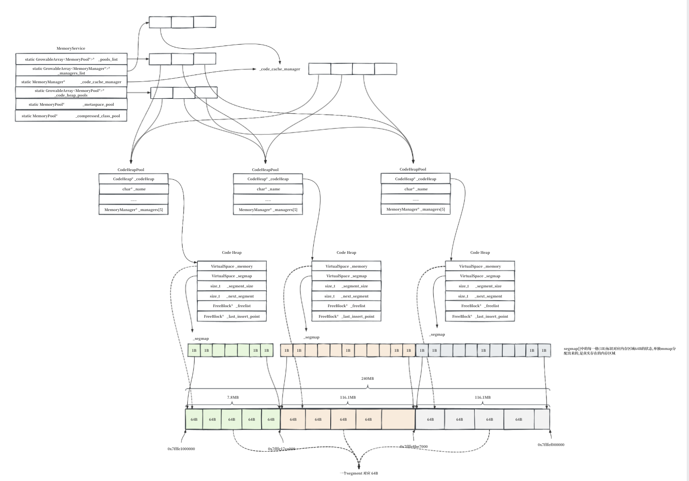

# 7.1 codeCache_init -- CodeCache 内存管理初始化

> **本文定位**：`init_globals()` 第 107 行 `codeCache_init()` 的完整源码讲解。你要理解的是 JVM 如何分配和管理一块有执行权限的内存，用于存放 JIT 编译后的 x86 机器码。
>
> **前置条件**：读者已理解 `init_globals()` 的总体结构和 Stage 3 的上下文（ch06），知道 `ReservedCodeCacheSize` 已经被放大到 240MB（`compilerDefinitions.cpp:197`），`SegmentedCodeCache` 已被设为 `true`。

---

## 0. 完整源码清单

本文涉及的所有源码均列于此。正文中直接以 `codeCache.cpp:1081` 的格式引用行号——你在清单中找到对应文件即可。

### 0a. `codeBlob.hpp` -- CodeBlobType 枚举

**文件**: `src/hotspot/share/code/codeBlob.hpp`

```cpp
// ═══ lines 38-47 ═══
struct CodeBlobType {
  enum {
    MethodNonProfiled   = 0,    // Execution level 1 and 4 (non-profiled) nmethods
    MethodProfiled      = 1,    // Execution level 2 and 3 (profiled) nmethods
    NonNMethod          = 2,    // Non-nmethods like Buffers, Adapters and Runtime Stubs
    All                 = 3,    // All types (No code cache segmentation)
    AOT                 = 4,    // AOT methods
    NumTypes            = 5
  };
};
```

### 0b. `codeCache.hpp` -- CodeCache 类定义

**文件**: `src/hotspot/share/code/codeCache.hpp`

```cpp
// ═══ line 78 ═══
class CodeCache : AllStatic {
  // ═══ lines 89-98 -- 静态字段 ═══
  static GrowableArray<CodeHeap*>* _heaps;              // 所有堆
  static GrowableArray<CodeHeap*>* _compiled_heaps;     // 存放已编译方法的堆
  static GrowableArray<CodeHeap*>* _nmethod_heaps;      // 存放 nmethod 的堆
  static GrowableArray<CodeHeap*>* _allocable_heaps;    // 可分配的堆
  static address _low_bound;                            // CodeHeap 地址下界
  static address _high_bound;                           // CodeHeap 地址上界
  static int _number_of_nmethods_with_dependencies;
  static bool _needs_cache_clean;
  static nmethod* _scavenge_root_nmethods;

  // ═══ lines 104-114 -- 关键静态方法声明 ═══
  static void initialize_heaps();
  static void check_heap_sizes(size_t non_nmethod_size, size_t profiled_size,
                               size_t non_profiled_size, size_t cache_size, bool all_set);
  static void add_heap(ReservedSpace rs, const char* name, int code_blob_type);
  static ReservedCodeSpace reserve_heap_memory(size_t size);

  // ═══ lines 139-143 -- add_heap 重载 + 数组访问器 ═══
  static void add_heap(CodeHeap* heap);
  static const GrowableArray<CodeHeap*>* heaps() { return _heaps; }
  static const GrowableArray<CodeHeap*>* compiled_heaps() { return _compiled_heaps; }
  static const GrowableArray<CodeHeap*>* nmethod_heaps() { return _nmethod_heaps; }

  // ═══ lines 213-216 -- 边界查询 ═══
  static address low_bound()  { return _low_bound; }
  static address high_bound() { return _high_bound; }

  // ═══ lines 237-242 -- heap_available ═══
  static bool heap_available(int code_blob_type);

  // ═══ lines 244-256 -- 过滤函数 ═══
  static bool code_blob_type_accepts_compiled(int type) {
    bool result = type == CodeBlobType::All || type <= CodeBlobType::MethodProfiled;
    return result;
  }
  static bool code_blob_type_accepts_nmethod(int type) {
    return type == CodeBlobType::All || type <= CodeBlobType::MethodProfiled;
  }
  static bool code_blob_type_accepts_allocable(int type) {
    return type <= CodeBlobType::All;
  }
};
```

### 0c. `codeCache.cpp` -- 完整函数实现

**文件**: `src/hotspot/share/code/codeCache.cpp`

```cpp
// ═══ lines 175-314 -- CodeCache::initialize_heaps() ═══
void CodeCache::initialize_heaps() {
  bool non_nmethod_set      = FLAG_IS_CMDLINE(NonNMethodCodeHeapSize);
  bool profiled_set         = FLAG_IS_CMDLINE(ProfiledCodeHeapSize);
  bool non_profiled_set     = FLAG_IS_CMDLINE(NonProfiledCodeHeapSize);
  size_t min_size           = os::vm_page_size();
  size_t cache_size         = ReservedCodeCacheSize;
  size_t non_nmethod_size   = NonNMethodCodeHeapSize;
  size_t profiled_size      = ProfiledCodeHeapSize;
  size_t non_profiled_size  = NonProfiledCodeHeapSize;
  check_heap_sizes((non_nmethod_set  ? non_nmethod_size  : min_size),
                   (profiled_set     ? profiled_size     : min_size),
                   (non_profiled_set ? non_profiled_size : min_size),
                   cache_size,
                   non_nmethod_set && profiled_set && non_profiled_set);

  // Determine size of compiler buffers
  size_t code_buffers_size = 0;
#ifdef COMPILER1
  const int c1_count = CompilationPolicy::policy()->compiler_count(CompLevel_simple);
  code_buffers_size += c1_count * Compiler::code_buffer_size();
#endif
#ifdef COMPILER2
  const int c2_count = CompilationPolicy::policy()->compiler_count(CompLevel_full_optimization);
  code_buffers_size += c2_count * C2Compiler::initial_code_buffer_size();
#endif

  if (!non_nmethod_set) {
    non_nmethod_size += code_buffers_size;
  }
  if (!non_nmethod_set && !profiled_set && !non_profiled_set) {
    if (cache_size > non_nmethod_size) {
      size_t remaining_size = cache_size - non_nmethod_size;
      profiled_size = remaining_size / 2;
      non_profiled_size = remaining_size - profiled_size;
    } else {
      non_nmethod_size = cache_size - 2 * min_size;
      profiled_size = min_size;
      non_profiled_size = min_size;
    }
  } else if (!non_nmethod_set || !profiled_set || !non_profiled_set) {
    intx diff_size = cache_size - (non_nmethod_size + profiled_size + non_profiled_size);
    if (non_profiled_set) {
      if (!profiled_set) {
        if (diff_size < 0 && ((intx)profiled_size + diff_size) <= 0) {
          diff_size += profiled_size - min_size;
          profiled_size = min_size;
        } else {
          profiled_size += diff_size;
          diff_size = 0;
        }
      }
    } else if (profiled_set) {
      if (diff_size < 0 && ((intx)non_profiled_size + diff_size) <= 0) {
        diff_size += non_profiled_size - min_size;
        non_profiled_size = min_size;
      } else {
        non_profiled_size += diff_size;
        diff_size = 0;
      }
    } else if (non_nmethod_set) {
      diff_size = cache_size - non_nmethod_size;
      profiled_size = diff_size / 2;
      non_profiled_size = diff_size - profiled_size;
      diff_size = 0;
    }
    if (diff_size != 0) {
      assert(!non_nmethod_set && ((intx)non_nmethod_size + diff_size) > 0, "sanity");
      non_nmethod_size += diff_size;
    }
  }

  if (!heap_available(CodeBlobType::MethodProfiled)) {
    non_profiled_size += profiled_size;
    profiled_size = 0;
  }
  if (!heap_available(CodeBlobType::MethodNonProfiled)) {
    non_nmethod_size += non_profiled_size;
    non_profiled_size = 0;
  }
  uint min_code_cache_size = CodeCacheMinimumUseSpace DEBUG_ONLY(* 3);
  if (non_nmethod_size < min_code_cache_size) {
    vm_exit_during_initialization(err_msg(
        "Not enough space in non-nmethod code heap to run VM: " SIZE_FORMAT "K < " SIZE_FORMAT "K",
        non_nmethod_size/K, min_code_cache_size/K));
  }

  assert(non_profiled_size + profiled_size + non_nmethod_size == cache_size, "Invalid code heap sizes");
  FLAG_SET_ERGO(uintx, NonNMethodCodeHeapSize, non_nmethod_size);
  FLAG_SET_ERGO(uintx, ProfiledCodeHeapSize, profiled_size);
  FLAG_SET_ERGO(uintx, NonProfiledCodeHeapSize, non_profiled_size);

  const size_t alignment = MAX2(page_size(false, 8), (size_t) os::vm_allocation_granularity());
  non_nmethod_size = align_up(non_nmethod_size, alignment);
  profiled_size    = align_down(profiled_size, alignment);

  ReservedCodeSpace rs = reserve_heap_memory(cache_size);
  ReservedSpace non_method_space    = rs.first_part(non_nmethod_size);
  ReservedSpace rest                = rs.last_part(non_nmethod_size);
  ReservedSpace profiled_space      = rest.first_part(profiled_size);
  ReservedSpace non_profiled_space  = rest.last_part(profiled_size);

  add_heap(non_method_space, "CodeHeap 'non-nmethods'", CodeBlobType::NonNMethod);
  add_heap(profiled_space, "CodeHeap 'profiled nmethods'", CodeBlobType::MethodProfiled);
  add_heap(non_profiled_space, "CodeHeap 'non-profiled nmethods'", CodeBlobType::MethodNonProfiled);
}

// ═══ lines 329-344 -- CodeCache::reserve_heap_memory() ═══
ReservedCodeSpace CodeCache::reserve_heap_memory(size_t size) {
  const size_t rs_ps = page_size();
  const size_t rs_align = MAX2(rs_ps, (size_t) os::vm_allocation_granularity());
  const size_t rs_size = align_up(size, rs_align);
  ReservedCodeSpace rs(rs_size, rs_align, rs_ps > (size_t) os::vm_page_size());
  if (!rs.is_reserved()) {
    vm_exit_during_initialization(err_msg("Could not reserve enough space for code cache ("
                                          SIZE_FORMAT "K)", rs_size/K));
  }
  _low_bound = (address)rs.base();
  _high_bound = _low_bound + rs.size();
  return rs;
}

// ═══ lines 347-362 -- CodeCache::heap_available() ═══
bool CodeCache::heap_available(int code_blob_type) {
  if (!SegmentedCodeCache) {
    return (code_blob_type == CodeBlobType::All);
  } else if (Arguments::is_interpreter_only()) {
    return (code_blob_type == CodeBlobType::NonNMethod);
  } else if (TieredCompilation && (TieredStopAtLevel > CompLevel_simple)) {
    return (code_blob_type < CodeBlobType::All);
  } else {
    return (code_blob_type == CodeBlobType::NonNMethod) ||
           (code_blob_type == CodeBlobType::MethodNonProfiled);
  }
}

// ═══ lines 388-403 -- CodeCache::add_heap(CodeHeap*) ═══
void CodeCache::add_heap(CodeHeap* heap) {
  assert(!Universe::is_fully_initialized(), "late heap addition?");
  _heaps->insert_sorted<code_heap_compare>(heap);
  int type = heap->code_blob_type();
  if (code_blob_type_accepts_compiled(type)) {
    _compiled_heaps->insert_sorted<code_heap_compare>(heap);
  }
  if (code_blob_type_accepts_nmethod(type)) {
    _nmethod_heaps->insert_sorted<code_heap_compare>(heap);
  }
  if (code_blob_type_accepts_allocable(type)) {
    _allocable_heaps->insert_sorted<code_heap_compare>(heap);
  }
}

// ═══ lines 405-425 -- CodeCache::add_heap(ReservedSpace, name, type) ═══
void CodeCache::add_heap(ReservedSpace rs, const char* name, int code_blob_type) {
  if (!heap_available(code_blob_type)) {
    return;
  }
  CodeHeap* heap = new CodeHeap(name, code_blob_type);
  add_heap(heap);
  size_t size_initial = MIN2((size_t)InitialCodeCacheSize, rs.size());
  size_initial = align_up(size_initial, os::vm_page_size());
  if (!heap->reserve(rs, size_initial, CodeCacheSegmentSize)) {
    vm_exit_during_initialization(err_msg("Could not reserve enough space in %s (" SIZE_FORMAT "K)",
                                          heap->name(), size_initial/K));
  }
  MemoryService::add_code_heap_memory_pool(heap, name);
}

// ═══ lines 1081-1112 -- CodeCache::initialize() ═══
void CodeCache::initialize() {
  assert(CodeCacheSegmentSize >= (uintx)CodeEntryAlignment,
         "CodeCacheSegmentSize must be large enough to align entry points");
#ifdef COMPILER2
  assert(CodeCacheSegmentSize >= (uintx)OptoLoopAlignment,
         "CodeCacheSegmentSize must be large enough to align inner loops");
#endif
  assert(CodeCacheSegmentSize >= sizeof(jdouble),
         "CodeCacheSegmentSize must be large enough to align constants");
  CodeCacheExpansionSize = align_up(CodeCacheExpansionSize, os::vm_page_size());
  if (SegmentedCodeCache) {
    initialize_heaps();
  } else {
    FLAG_SET_ERGO(uintx, NonNMethodCodeHeapSize, 0);
    FLAG_SET_ERGO(uintx, ProfiledCodeHeapSize, 0);
    FLAG_SET_ERGO(uintx, NonProfiledCodeHeapSize, 0);
    ReservedCodeSpace rs = reserve_heap_memory(ReservedCodeCacheSize);
    add_heap(rs, "CodeCache", CodeBlobType::All);
  }
  icache_init();
  os::register_code_area((char*)low_bound(), (char*)high_bound());
}

// ═══ lines 1114-1118 -- codeCache_init() ═══
void codeCache_init() {
  CodeCache::initialize();
  AOTLoader::initialize();
}
```

### 0d. `virtualspace.hpp` -- ReservedSpace / ReservedCodeSpace / VirtualSpace

**文件**: `src/hotspot/share/memory/virtualspace.hpp`

```cpp
// ═══ lines 32-93 -- ReservedSpace ═══
class ReservedSpace {
  friend class VMStructs;
 protected:
  char*  _base;
  size_t _size;
  size_t _noaccess_prefix;
  size_t _alignment;
  bool   _special;
  int    _fd_for_heap;
 private:
  bool   _executable;

 protected:
  void initialize(size_t size, size_t alignment, bool large,
                  char* requested_address, bool executable);

 public:
  ReservedSpace();
  ReservedSpace(size_t size, size_t preferred_page_size = 0);
  ReservedSpace(size_t size, size_t alignment, bool large,
                char* requested_address = NULL);
  ReservedSpace(size_t size, size_t alignment, bool large, bool executable);

  char*  base()            const { return _base;      }
  size_t size()            const { return _size;      }
  char*  end()             const { return _base + _size; }
  size_t alignment()       const { return _alignment; }
  bool   special()         const { return _special;   }
  bool   executable()      const { return _executable;   }
  size_t noaccess_prefix() const { return _noaccess_prefix; }
  bool is_reserved()       const { return _base != NULL; }
  void release();

  ReservedSpace first_part(size_t partition_size, size_t alignment,
                           bool split = false, bool realloc = true);
  ReservedSpace last_part (size_t partition_size, size_t alignment);
  inline ReservedSpace first_part(size_t partition_size,
                                  bool split = false, bool realloc = true);
  inline ReservedSpace last_part (size_t partition_size);
  bool contains(const void* p) const;
};

// ═══ lines 128-132 -- ReservedCodeSpace ═══
class ReservedCodeSpace : public ReservedSpace {
 public:
  ReservedCodeSpace(size_t r_size, size_t rs_align, bool large);
};

// ═══ lines 136-225 -- VirtualSpace ═══
class VirtualSpace {
  friend class VMStructs;
 private:
  char* _low_boundary;
  char* _high_boundary;
  char* _low;
  char* _high;
  bool _special;
  bool _executable;
  char* _lower_high;
  char* _middle_high;
  char* _upper_high;
  char* _lower_high_boundary;
  char* _middle_high_boundary;
  char* _upper_high_boundary;
  size_t _lower_alignment;
  size_t _middle_alignment;
  size_t _upper_alignment;

 public:
  char* low()  const { return _low; }
  char* high() const { return _high; }
  char* low_boundary()  const { return _low_boundary; }
  char* high_boundary() const { return _high_boundary; }
  bool special() const { return _special; }

  VirtualSpace();
  bool initialize(ReservedSpace rs, size_t committed_byte_size);
  ~VirtualSpace();
  size_t reserved_size() const;
  size_t actual_committed_size() const;
  size_t committed_size() const;
  size_t uncommitted_size() const;
  bool contains(const void* p) const;
  bool expand_by(size_t size);
};
```

### 0e. `virtualspace.cpp` -- first_part / last_part 实现

**文件**: `src/hotspot/share/memory/virtualspace.cpp`

```cpp
// ═══ lines 234-242 -- first_part ═══
ReservedSpace ReservedSpace::first_part(size_t partition_size, size_t alignment,
                                        bool split, bool realloc) {
  assert(partition_size <= size(), "partition failed");
  if (split) {
    os::split_reserved_memory(base(), size(), partition_size, realloc);
  }
  ReservedSpace result(base(), partition_size, alignment, special(),
                       executable());
  return result;
}

// ═══ lines 247-252 -- last_part ═══
ReservedSpace
ReservedSpace::last_part(size_t partition_size, size_t alignment) {
  assert(partition_size <= size(), "partition failed");
  ReservedSpace result(base() + partition_size, size() - partition_size,
                       alignment, special(), executable());
  return result;
}
```

### 0f. `heap.hpp` -- CodeHeap 类定义

**文件**: `src/hotspot/share/memory/heap.hpp`

```cpp
// ═══ lines 81-109 -- CodeHeap ═══
class CodeHeap : public CHeapObj<mtCode> {
  friend class VMStructs;
 protected:
  VirtualSpace _memory;                          // 存放 CodeBlob 的内存
  VirtualSpace _segmap;                          // 段状态位图

  size_t       _number_of_committed_segments;
  size_t       _number_of_reserved_segments;
  size_t       _segment_size;
  int          _log2_segment_size;

  size_t       _next_segment;

  FreeBlock*   _freelist;
  FreeBlock*   _last_insert_point;
  size_t       _freelist_segments;
  int          _freelist_length;
  size_t       _max_allocated_capacity;

  const char*  _name;
  const int    _code_blob_type;
  int          _blob_count;
  int          _nmethod_count;
  int          _adapter_count;
  int          _full_count;
  int          _fragmentation_count;

  enum { free_sentinel = 0xFF };
  static const int fragmentation_limit = 10000;
  static const int freelist_limit = 100;

 public:
  CodeHeap(const char* name, const int code_blob_type);
  bool  reserve(ReservedSpace rs, size_t committed_size, size_t segment_size);
  bool  expand_by(size_t size);

  char* low()  const  { return _memory.low(); }
  char* high() const  { return _memory.high(); }
  char* low_boundary() const  { return _memory.low_boundary(); }
  char* high_boundary() const { return _memory.high_boundary(); }
  bool contains(const void* p) const;
  bool contains_blob(const CodeBlob* blob) const;

  bool accepts(int code_blob_type) const;
  int code_blob_type() const { return _code_blob_type; }
  const char* name() const { return _name; }
};
```

### 0g. `heap.cpp` -- CodeHeap 构造函数和 reserve

**文件**: `src/hotspot/share/memory/heap.cpp`

```cpp
// ═══ lines 39-57 -- CodeHeap 构造函数 ═══
CodeHeap::CodeHeap(const char* name, const int code_blob_type)
  : _code_blob_type(code_blob_type) {
  _name                         = name;
  _number_of_committed_segments = 0;
  _number_of_reserved_segments  = 0;
  _segment_size                 = 0;
  _log2_segment_size            = 0;
  _next_segment                 = 0;
  _freelist                     = NULL;
  _last_insert_point            = NULL;
  _freelist_segments            = 0;
  _freelist_length              = 0;
  _max_allocated_capacity       = 0;
  _blob_count                   = 0;
  _nmethod_count                = 0;
  _adapter_count                = 0;
  _full_count                   = 0;
  _fragmentation_count          = 0;
}

// ═══ lines 203-252 -- CodeHeap::reserve() ═══
bool CodeHeap::reserve(ReservedSpace rs, size_t committed_size, size_t segment_size) {
  assert(rs.size() >= committed_size, "reserved < committed");
  assert(segment_size >= sizeof(FreeBlock), "segment size is too small");
  assert(is_power_of_2(segment_size), "segment_size must be a power of 2");
  assert_locked_or_safepoint(CodeCache_lock);

  _segment_size      = segment_size;
  _log2_segment_size = exact_log2(segment_size);

  size_t page_size = os::vm_page_size();
  if (os::can_execute_large_page_memory()) {
    const size_t min_pages = 8;
    page_size = MIN2(os::page_size_for_region_aligned(committed_size, min_pages),
                     os::page_size_for_region_aligned(rs.size(), min_pages));
  }

  const size_t granularity = os::vm_allocation_granularity();
  const size_t c_size = align_up(committed_size, page_size);

  os::trace_page_sizes(_name, committed_size, rs.size(), page_size,
                       rs.base(), rs.size());
  if (!_memory.initialize(rs, c_size)) {
    return false;
  }

  on_code_mapping(_memory.low(), _memory.committed_size());
  _number_of_committed_segments = size_to_segments(_memory.committed_size());
  _number_of_reserved_segments  = size_to_segments(_memory.reserved_size());
  assert(_number_of_reserved_segments >= _number_of_committed_segments, "just checking");
  const size_t reserved_segments_alignment = MAX2((size_t)os::vm_page_size(), granularity);
  const size_t reserved_segments_size = align_up(_number_of_reserved_segments, reserved_segments_alignment);
  const size_t committed_segments_size = align_to_page_size(_number_of_committed_segments);

  if (!_segmap.initialize(reserved_segments_size, committed_segments_size)) {
    return false;
  }

  MemTracker::record_virtual_memory_type((address)_segmap.low_boundary(), mtCode);
  assert(_segmap.committed_size() >= (size_t) _number_of_committed_segments,
         "could not commit enough space for segment map");
  assert(_segmap.reserved_size()  >= (size_t) _number_of_reserved_segments,
         "could not reserve enough space for segment map");
  assert(_segmap.reserved_size()  >= _segmap.committed_size(), "just checking");

  clear();
  init_segmap_template();
  return true;
}
```

### 0h. `memoryService.cpp` -- add_code_heap_memory_pool

**文件**: `src/hotspot/share/services/memoryService.cpp`

```cpp
// ═══ lines 94-109 ═══
void MemoryService::add_code_heap_memory_pool(CodeHeap* heap, const char* name) {
  MemoryPool* code_heap_pool = new CodeHeapPool(heap, name, true);
  _code_heap_pools->append(code_heap_pool);
  _pools_list->append(code_heap_pool);
  if (_code_cache_manager == NULL) {
    _code_cache_manager = MemoryManager::get_code_cache_memory_manager();
    _managers_list->append(_code_cache_manager);
  }
  _code_cache_manager->add_pool(code_heap_pool);
}
```

### 0i. `icache.cpp` -- ICache 初始化

**文件**: `src/hotspot/share/runtime/icache.cpp`

```cpp
// ═══ lines 22-41 -- AbstractICache::initialize() ═══
void AbstractICache::initialize() {
  ResourceMark rm;

  BufferBlob* b = BufferBlob::create("flush_icache_stub", ICache::stub_size);
  if (b == NULL) {
    vm_exit_out_of_memory(ICache::stub_size, OOM_MALLOC_ERROR,
                          "CodeCache: no space for flush_icache_stub");
  }
  CodeBuffer c(b);

  ICacheStubGenerator g(&c);
  g.generate_icache_flush(&_flush_icache_stub);

  // The first use of flush_icache_stub must apply it to itself.
  // StubCodeMark destructor calls Assembler::flush, which calls
  // invalidate_range, which calls the flush stub.
}

// ═══ lines 108-110 ═══
void icache_init() {
  ICache::initialize();
}
```


### 0j. `os_linux_x86.hpp` -- register_code_area (Linux)

**文件**: `src/hotspot/os_cpu/linux_x86/os_linux_x86.hpp`

```cpp
// ═══ lines 36-38 ═══
// Used to register dynamic code cache area with the OS
// Note: Currently only used in 64 bit Windows implementations
static bool register_code_area(char *low, char *high) { return true; }
```

### 0k. `compilerDefinitions.cpp` -- SegmentedCodeCache 启用条件

**文件**: `src/hotspot/share/compiler/compilerDefinitions.cpp`

```cpp
// ═══ lines 197-200 -- set_tiered_flags() 内部 ═══
// Enable SegmentedCodeCache if TieredCompilation is enabled,
// ReservedCodeCacheSize >= 240M and the code cache contains
// at least 8 pages.
if (FLAG_IS_DEFAULT(SegmentedCodeCache) && ReservedCodeCacheSize >= 240*M &&
    8 * CodeCache::page_size() <= ReservedCodeCacheSize) {
  FLAG_SET_ERGO(bool, SegmentedCodeCache, true);
}
```

### 0l. `c2_globals_x86.hpp` -- 默认大小

**文件**: `src/hotspot/cpu/x86/c2_globals_x86.hpp`

```cpp
// ═══ lines 57-58 ═══
define_pd_global(uintx, InitialCodeCacheSize,  2496*K); // x86_64
define_pd_global(uintx, CodeCacheExpansionSize, 64*K);  // x86_64

// ═══ lines 87-92 — 堆大小默认值 ═══
define_pd_global(uintx, ReservedCodeCacheSize,      48*M);
define_pd_global(uintx, NonProfiledCodeHeapSize,    21*M);
define_pd_global(uintx, ProfiledCodeHeapSize,       22*M);
define_pd_global(uintx, NonNMethodCodeHeapSize,      5*M);
define_pd_global(uintx, CodeCacheMinimumUseSpace,  400*K);
```

---

## 需要的前置知识

本章涉及的 C++ 概念和内存管理基础全部列在这里。已熟悉的读者可跳过。

### C++ 知识

**`AllStatic`**：HotSpot 内部的一个标记类，声明在 `src/hotspot/share/memory/allocation.hpp`。一个类继承 `AllStatic` 表示它的所有字段和方法都是 `static`，禁止实例化。`CodeCache` 就是继承 `AllStatic` 的类——你永远看不到 `new CodeCache()`，所有操作都是 `CodeCache::allocate(...)` 这种静态方法调用。

**`CHeapObj<mtCode>`**：表示对象在 C 堆上分配（通过 `new`），NMT（Native Memory Tracking）将其内存记录到 `mtCode` 类别。`CodeHeap` 就是这样的对象——每个 code heap 都是 `new` 出来的独立实例，NMT 能在 `mtCode` 分类下看到它们的开销。

**`GrowableArray`**：HotSpot 的动态数组，类似 `std::vector` 但更轻量。`insert_sorted<compare>(elem)` 按比较函数 `compare` 维护排序后插入。`CodeCache` 用 4 个 `GrowableArray<CodeHeap*>` 分别管理不同用途的堆视图。

**`FLAG_IS_CMDLINE(x)`**：检查 flag `x` 是否由用户在命令行显式设置。返回值是 `bool`。如果用户没有在命令行上指定，返回 `false`。初始化代码用这个函数来区分"用户显式指定了大小"和"使用默认值"。

**`FLAG_SET_ERGO(type, name, value)`**：设置 flag 的值，标记为"ergonomic"（自动决策）。与 `FLAG_IS_CMDLINE` 配合意味着：用户设了值用用户的，用户没设值用代码计算的值。

**`assert`**：debug 模式下，条件不满足直接 abort。release 模式下编译为空（无开销）。本文中 `initialize_heaps()` 初始化完成后的 `assert(non_profiled_size + profiled_size + non_nmethod_size == cache_size, ...)` 就是用于验证三段大小之和等于总容量的数学约束。

**继承**：`ReservedCodeSpace` 继承 `ReservedSpace`，不添加任何新字段。所有的字段都来自父类。在本文中，`reserve_heap_memory()` 返回 `ReservedCodeSpace` 类型的对象，但在三段切分时，它被当作普通的 `ReservedSpace` 传递给 `first_part()` 和 `last_part()`——多态在这里不起作用，切片逻辑全在 `ReservedSpace` 基类中。

### 内存管理基础

**虚拟地址 vs 物理内存**：`mmap(PROT_NONE)` 返回的是一段虚拟地址空间的"预留"，操作系统只记账（"这段地址范围被占用了"），不分配物理页。后续 `CodeHeap::expand_by()` 调用 `os::commit_memory()`（底层 `mmap(MAP_FIXED, PROT_READ|PROT_WRITE|PROT_EXEC)`）时，内核才通过 demand paging 按需映射物理页。这就是为什么 `reserve_heap_memory` 只有一次 mmap，而每次 CodeBlob 分配时才 commit 内存。

**demand paging**：mmap 返回虚拟地址后，物理页在首次访问时由内核的缺页中断处理程序按需分配。CodeHeap 的 `_memory.initialize()` 只 commit 初始大小（`InitialCodeCacheSize = 2.5MB`）的物理页，剩余的 ~116MB 预留虚拟地址在后续编译方法时才逐渐提交。

**大页（large page / huge page）**：默认页大小是 4KB。启用大页后（如 2MB），一条 TLB 条目覆盖的地址范围扩大 512 倍——这对频繁跳转的 code cache 性能很重要。`reserve_heap_memory()` 的第三个参数 `rs_ps > os::vm_page_size()` 决定了 `ReservedCodeSpace` 是否使用大页。对应 JVM flag 是 `UseLargePages`。

### JVM 概念（本节涉及的术语）

以下概念在本节正文中频繁出现，这里集中定义。

**编译层级（Tier）**：Tiered 编译把方法从冷到热分成 5 个层级。

| Level | 谁执行 | 特点 |
|-------|--------|------|
| 0 | 解释器 | 逐条翻译字节码，无编译开销 |
| 1 | C1 简单编译 | 无 profiling，编译快但优化少 |
| 2 | C1 + 基本 profiling | 只收集调用计数和回边计数 |
| 3 | C1 + 完整 profiling | 收集类型分布、分支概率——C2 优化依据 |
| 4 | C2 全优化 | 做深度内联、寄存器分配、指令调度，编译慢但运行最快 |

[6.1](#/openjdk/vol-01/ch06/01-policy-selection) 讲了 Tiered 编译的策略选择和 `CICompilerCount` 的计算。本节你只需要知道：Tier 2/3 的方法代码（带 profiling）放在 Profiled 堆，Tier 1/4 的方法代码（无 profiling）放在 NonProfiled 堆，Tier 0 不产生代码。

**profiling**：C1 编译器在编译方法时，在生成的机器码里插入额外的"计数指令"——每调用若干次就回写一次调用次数和类型信息到 MethodData。这些数据是 C2 做优化决策的依据（该方法哪些分支走得最多、虚方法调用实际是哪个子类）。带 profiling 的代码执行效率比不带 profiling 的代码低——所以要单独放一个 Profiled 堆，等 C2 编译出"去 profiling"的高效版本后替换掉。

**stub**：一小段 JVM 手写或生成的汇编代码，实现辅助操作。例子：IC（Inline Cache）miss stub——虚方法调用时目标类型变了，跳转到这段 stub 重新解析方法地址；`call_stub`——从解释器栈切换到编译代码栈；`flush_icache_stub`——修改 code cache 中的机器码后刷新 CPU 指令缓存。stub 不是 Java 方法，它们是 JVM 内部的基础设施代码。

**adapter（方法入口适配器）**：不同编译层级的代码有不同的参数传递约定。解释器把参数放在局部变量表里，C1 编译代码放在寄存器里，C2 编译代码又不同。adapter 是一小段自动生成的代码，放在调用者和被调用者之间做参数格式转换——调用者以为自己在调一个"普通的同层级方法"，adapter 负责把参数整理成被调用者期望的格式。

**nmethod**：HotSpot 中表示"一个已编译的 Java 方法"的对象（`CodeBlob` 的子类）。包含方法的机器码、异常处理器表、依赖项列表、`oop` 引用等元数据。C1 或 C2 每编译一个 Java 方法就生成一个 nmethod 实例，物理存放在 code cache 里。本节中提到"编译后的方法代码"指的就是 nmethod。

---

## 1. code cache 是什么，三个堆分别放什么

### 1.1 为什么需要 code cache

Java 方法的执行有一个从解释到编译的过程：

1. 方法先由解释器执行（模板解释器，字节码逐条翻译为机器码执行）
2. 执行次数达到阈值（Tier 3 compile threshold），C1 编译器将方法编译为机器码
3. 机器码需要放在一块有**执行权限**的内存中才能被 CPU 取指执行

普通的 `malloc` 或 `new` 返回的内存页权限是 `PROT_READ|PROT_WRITE`，缺少 `PROT_EXEC`。如果直接往这种内存写机器码然后跳过去执行，CPU 会触发 segmentation fault。

code cache 是 JVM 专门预留的一块内存区域——通过 `mmap` 一次性预留 240MB 虚拟地址空间（本机），后续按需提交物理页并赋予执行权限。JIT 编译产生的所有机器码都放在这里。

### 1.2 三个堆的分工

如果所有机器码都放在一个大池子里，会产生两个问题：

**碎片化**。C1 profiling 编译（Tier 2/3）生成的代码在方法热到 Tier 4 后会被替换释放，频繁的分配和释放会导致内存碎片。Profiled 代码的碎片会影响 NonProfiled 代码的分配效率。

**Stub 永不释放**。解释器和运行时需要的 stub（IC 缓存桩、方法入口适配器等）在启动时分配后就一直存在。它们分散在堆中会进一步加剧碎片。

JDK 9+ 引入分段 code cache（`SegmentedCodeCache`），把 240MB 分成三个独立堆：

| 堆名 | 放什么 | 大小（本机） | 生命周期特征 |
|------|--------|------------|------------|
| NonNMethod | stub、adapter、编译器临时 buffer | 7.8MB | 启动时分配，几乎不释放 |
| Profiled | C1 profiling 编译后的方法（Tier 2/3） | 116.1MB | 频繁分配释放——热方法升级后替换 |
| NonProfiled | C1/C2 无 profiling 的方法（Tier 1/4）+ native 方法 | 116.1MB | 稳定——Tier 4 代码很少卸载 |

三个堆的地址是连续的（来自同一次 mmap），但分配是隔离的——NonNMethod 碎片不会影响 Profiled 的分配，Profiled 的碎片也不会影响 NonProfiled 的分配。

### 1.3 CodeBlobType 枚举

源码中通过 `CodeBlobType` 枚举值来区分堆的类型。枚举定义在 `codeBlob.hpp:38`：

- **`MethodNonProfiled = 0`**：Tier 1（C1 无 profiling）和 Tier 4（C2 全优化）编译的 Java 方法，以及 native 方法。放在 NonProfiled 堆。
- **`MethodProfiled = 1`**：Tier 2（C1+有限 profiling）和 Tier 3（C1+完全 profiling）编译的 Java 方法。放在 Profiled 堆。
- **`NonNMethod = 2`**：非 Java 方法的代码——运行时 stub、方法入口 adapter、编译器内部的临时 CodeBuffer。放在 NonNMethod 堆。
- **`All = 3`**：只在 `SegmentedCodeCache = false` 时使用，表示所有类型放一个堆。
- **`AOT = 4`**：提前编译器产生的代码，不在本文讨论范围。

本机是 Tiered 模式（`TieredStopAtLevel = 4`），三个堆全部启用。

---

## 2. CodeCache 内存管理系统的四个类

理解 `codeCache_init()` 前，必须先理解四个协作类的角色和关键字段。这一节的每个字段都会在后续代码拆解中出现——本节的目标是建立概念框架。

### 2.1 ReservedSpace -- 虚拟地址空间的"所有权凭证"

**角色**：封装一次 `mmap` 返回的虚拟地址范围。

```cpp
// virtualspace.hpp:32
class ReservedSpace {
 protected:
  char*  _base;            // mmap 返回的起始地址
  size_t _size;            // mmap 预留的大小（字节）
  size_t _noaccess_prefix; // 压缩指针用的不可访问前缀
  size_t _alignment;       // 实际对齐粒度
  bool   _special;         // 是否使用了大页
  int    _fd_for_heap;     // 大页用的文件描述符
 private:
  bool   _executable;      // 此空间是否可以执行（code cache 为 true）
};
```

一个 `ReservedSpace` 对象本身只记录几个数字（_base 和 _size），不持有任何系统资源——它是一张"所有权凭证"。谁持有这个对象，谁就"拥有"这段虚拟地址范围的使用权。

**`first_part(partition_size)`**：从自己的范围中切出前 `partition_size` 字节，返回一个新的 `ReservedSpace` 对象。新对象的 `_base` 等于当前对象的 `_base`，`_size` 等于 `partition_size`。不调用 `mmap`——只是创建一个指向同一块地址的新对象。

**`last_part(partition_size)`**：从自己的范围中切出后 `size() - partition_size` 字节。新对象的 `_base = _base + partition_size`，`_size = _size - partition_size`。同样不调用 `mmap`。

这两个方法是三段切分的核心工具。

**`ReservedCodeSpace`**：继承 `ReservedSpace`，不添加任何字段。构造函数 `ReservedCodeSpace(size, align, large)` 调用父类的 `initialize()` 并执行 `mmap(NULL, size, PROT_NONE, MAP_PRIVATE|MAP_ANONYMOUS|MAP_NORESERVE, -1, 0)`。`PROT_NONE` 意思是只预留虚拟地址，不赋予任何读写执行权限——这段地址暂时不可访问，后续分配 CodeBlob 时再 commit。

### 2.2 VirtualSpace -- 区分"预留"和"已提交"

**角色**：在 `ReservedSpace` 之上管理 commit/uncommit 状态。预留的范围固定不变，已提交的范围可以动态增长。

```cpp
// virtualspace.hpp:136
class VirtualSpace {
 private:
  char* _low_boundary;      // 预留区域的起始地址，初始化后不变
  char* _high_boundary;     // 预留区域的结束地址，初始化后不变
  char* _low;               // 已提交区域的起始地址
  char* _high;              // 已提交区域的当前高水位
  bool  _special;           // 是否使用大页
  bool  _executable;        // 是否可执行
  // ... MPSS 字段省略 ...
};
```

`_low_boundary` 和 `_high_boundary` 在 `initialize()` 时设置，之后永不变。`_high` 在初始 commit 后等于 `_low + initial_committed`，后续 `expand_by()` 会增大 `_high` 指向更高的地址。

CodeHeap 中有两个 `VirtualSpace` 成员：存放机器码的 `_memory` 和存放段状态位图的 `_segmap`。

- **`_memory`**：通过 `_memory.initialize(rs, c_size)` 绑定到前面的 `ReservedSpace rs`——底层的 mmap 是同一个 240MB 大块，只是 CodeHeap 从 `ReservedSpace` 切到的子区间。`_memory` 不单独 mmap。
- **`_segmap`**：通过 `_segmap.initialize(reserved_segments_size, committed_segments_size)` 分配**独立的一块内存**——段状态位图。每个 segment 用 1 个 byte 记录状态（free=0xFF，或归属的 CodeBlob 引用）。以 NonNMethod 堆为例：7.8MB / 64B ≈ 122K 个 segment，_segmap 需要约 122KB 的独立 mmap。这 122KB 不在 240MB code cache 里——是额外开销。

**CodeBlob 是什么**：CodeBlob（`code/codeBlob.hpp`）是 code cache 中所有对象的基类。任何放入 code cache 的东西都继承自 CodeBlob：

```
CodeBlob
  nmethod      -- 已编译的 Java 方法（含机器码 + oop 引用 + 异常表）
  RuntimeStub  -- JVM 内部 stub（如 call_stub、IC miss stub）
  BufferBlob   -- 编译器临时缓冲（如 C1/C2 的 CodeBuffer、flush_icache_stub）
  AdapterBlob  -- 方法入口适配器
```

`CodeCache::allocate(type, size)` 分配的就是一个 CodeBlob——根据 `type` 选对应 CodeHeap，在段内找到空闲块，返回地址。`CodeCache::free(cb)` 释放 CodeBlob 占用的段。后续讲 nmethod 和 stub 时会回到 CodeBlob 的继承体系。

### 2.3 CodeHeap -- 堆分配器

**角色**：管理一段连续虚拟地址空间，在上面分配和回收固定大小（64 字节）的 segment。每次 C1/C2 编译一个方法，CodeHeap 从中划出若干 segment 存放生成的机器码。

CodeHeap 的内存管理由 4 个组件组成：

**组件一：`_memory`（VirtualSpace）——存放机器码的实际内存**

`_memory` 是前面 `VirtualSpace` 的一个实例。`_low_boundary` 到 `_high_boundary` 是整个堆的虚拟地址范围（如 NonNMethod 堆 7.8MB），`_low` 到 `_high` 是已 commit 物理页的范围（初始 2.5MB）。编译器生成的机器码（CodeBlob）就写在 `_memory` 的地址区间里。

**组件二：`_segmap`（VirtualSpace）——段状态位图**

`_segmap` 是另一个独立的 `VirtualSpace`——通过独立的 mmap 分配，不和 `_memory` 共用地址空间。`_segmap` 里每个 **1 字节**对应 `_memory` 中一个 **64 字节**的逻辑格子。`_segmap` 的总大小 = 格子数 × 1B（NonNMethod 堆：122880 个格子 -> 122KB）。按 `_segmap.low() + N` 访问第 N 个 byte。

`_segmap` 的编码规则：

```
值 = 0xFF          -> 空闲（free_sentinel）
值 = 0x00          -> 已分配，且是某个 CodeBlob 占用的第一个格子
值 = 0x01 ~ 0xFE   -> 已分配，表示"往前 N 个格子是 CodeBlob 的开头"
```

例如一个 CodeBlob 占了 _memory 上偏移 100-104 这 5 个格子：`_segmap[100]=0x00`（起始），`_segmap[101]=0x01`，`_segmap[102]=0x02`，`_segmap[103]=0x03`，`_segmap[104]=0x04`。每个后续格子记录自己离第一个格子的偏移量——释放时根据这些偏移量还原 CodeBlob 的实际大小（5 个格子 * 64B = 320B），把 5 个 byte 全部设回 0xFF。

这和 GC 的 card table 是同一个模式——Java 堆切 card，card table 用 byte 数组记 dirty；CodeHeap 的 `_memory` 切格子，`_segmap` 用 VirtualSpace 记 free/used。

**组件三：`_next_segment`——顺序分配指针**

最简单的分配方式：新 CodeBlob 从 `_next_segment` 处开始（格子编号），往后数需要的格子数，`_next_segment += needed`。这是 bump allocation——直接往高地址方向推。当 `_next_segment` 对应的地址（`_memory.low() + _next_segment * 64`）超过已 commit 范围时，触发 `expand_by()` 扩大 commit 范围。

**组件四：`_freelist`——空闲块链表**

`_freelist` 是一个 `FreeBlock*` 指针。`FreeBlock`（`heap.hpp:67`）继承自 `HeapBlock`，结构如下：

```cpp
class HeapBlock {
  struct Header {
    size_t _length;   // 这个块覆盖多少个 64B 格子
    bool   _used;     // false 表示空闲
  };
  Header _header;     // 块的头部，嵌入在 _memory 的起始位置
};

class FreeBlock : public HeapBlock {
  FreeBlock* _link;   // 指向下一个 FreeBlock
};
```

`FreeBlock` 不是一个独立分配的对象——它**嵌入在 `_memory` 的空闲区域开头**。一个 CodeBlob 被释放后，它原来占用的 `_memory` 地址变成空闲区域——`CodeHeap` 在空闲区域的第一个 64B 格子里写一个 `FreeBlock` 结构，记下这段空闲区域的长度（`_length`）和下一个空闲块的指针（`_link`）。

```
_memory 的地址空间（非真实地址，示意）：

[CodeBlob A (64B)] [FreeBlock (64B)] [空闲空间] [CodeBlob B (128B)] ...
                      |                          |
                      | _length = 5 格          |
                      | _used = false            |
                      | _link = 指向下一个 FreeBlock
```

`_freelist` 指向第一个 `FreeBlock`。`FreeBlock` 的 `_link` 指向下一个——形成一条按地址排序的单向链表。分配时遍历链表找第一个长度足够的空闲块；找不到就用 `_next_segment` bump allocation。

`_last_insert_point` 记录上一次插入的 FreeBlock 位置——释放通常是地址递增的，从上次位置开始搜加速下一次插入。`_freelist_segments` 和 `_freelist_length` 分别记录空闲格子总数和链表节点数。

**辅助字段**：


**辅助字段**：

| 字段 | 含义 |
|------|------|
| `_segment_size` / `_log2_segment_size` | 64 和 log2(64)=6，segment 大小和对数 |
| `_number_of_committed_segments` | 已 commit 的段数 = `_memory.committed_size() >> 6` |
| `_number_of_reserved_segments` | 已 reserve 的段数 = `_memory.reserved_size() >> 6` |
| `_name` | 堆名（日志/JMX 用） |
| `_code_blob_type` | CodeBlobType 枚举值，决定此堆放哪种代码 |
| `_blob_count` / `_nmethod_count` / `_adapter_count` | 计数 |
| `_max_allocated_capacity` | 历史峰值 |
| `_full_count` | 分配失败次数——freelist 没合适块且 _next_segment 到头 |
| `_fragmentation_count` | 碎片化事件计数——释放导致的相邻空闲块合并次数 |

构造函数 `heap.cpp:39` 把所有数值字段初始化为 0，所有指针字段初始化为 NULL。此时 CodeHeap 只是一个空壳——没有绑定任何内存、没有 freelist、没有 segmap。这一切在后面的 `reserve()` 中建立。


### 2.4 CodeCache -- 总控

**角色**：全局静态类（`AllStatic`），管理所有 CodeHeap，提供 `allocate/free` 接口。

字段（全部为 `static`）：
- `_heaps`：`GrowableArray<CodeHeap*>*`——所有堆，按 code_blob_type 排序
- `_compiled_heaps`：存放已编译方法的堆（All、MethodProfiled、MethodNonProfiled）
- `_nmethod_heaps`：存放 nmethod 的堆
- `_allocable_heaps`：可分配 CodeBlob 的堆（All、NonNMethod、MethodProfiled、MethodNonProfiled）
- `_low_bound`：所有堆中最低的地址
- `_high_bound`：所有堆中最高的地址

四个数组的关系——以本机三个堆为例：

```
_heaps           = [non-nmethods,  profiled,  non-profiled]
                     CodeBlobType=2  CodeBlobType=1  CodeBlobType=0

_compiled_heaps  = [profiled,  non-profiled]
                    (含 NonNMethod 吗？不含——code_blob_type_accepts_compiled(2) = false)

_nmethod_heaps   = [profiled,  non-profiled]
                    (含 NonNMethod 吗？不含——NonNMethod 放的不是 nmethod)

_allocable_heaps = [non-nmethods,  profiled,  non-profiled]
                    (三种类型都可以分配)
```

四个类的关系——从上层看：

```
CodeCache (总控，AllStatic)
  管理 4 个 GrowableArray<CodeHeap*>
    每个 CodeHeap (分配器，CHeapObj<mtCode>)
      包含 _memory: VirtualSpace (管理提交/未提交范围)
      包含 _segmap: VirtualSpace (段状态位图)
    所有 _memory 和 _segmap 都来自同一段 240MB mmap
```

---

## 3. codeCache_init 的全貌

`codeCache_init()` 是 `init_globals()` 第 107 行调用的函数，整个函数体只有两行：

```cpp
// codeCache.cpp:1114
void codeCache_init() {
  CodeCache::initialize();
  AOTLoader::initialize();
}
```

`AOTLoader::initialize()` 在本机不生效（没有 AOT 库），实际工作全部在 `CodeCache::initialize()` 中。

`CodeCache::initialize()`（`codeCache.cpp:1081`）做五件事：

1. **前置 assert**（编译时常量校验，正文不展开）

2. **CodeCacheExpansionSize 向上对齐到页大小**：`CodeCacheExpansionSize = 64KB`（`c2_globals_x86.hpp:58`），`os::vm_page_size() = 4KB`。64KB 已经是 4KB 的整数倍，`align_up` 不影响值。这行代码是为某些默认页大小更大的系统准备的（如 Solaris 有 8KB 默认页）。

3. **SegmentedCodeCache 分支**：本机 `SegmentedCodeCache = true`（在 `compilerDefinitions.cpp:197-199` 中根据三个条件自动设置），走 `initialize_heaps()`。另一分支（单堆模式）将三个堆大小 flag 设为 0，mmap 一整块作为 `CodeBlobType::All` 堆——本机不执行。

4. **`icache_init()`**：初始化指令缓存刷新机制，生成 `flush_icache_stub`。

5. **`os::register_code_area()`**：通知操作系统 code cache 的地址范围。Linux 上空操作（`return true`），Windows 64 位上注册结构化异常处理。

后面三节（4、5、6）逐一拆解这三步。

---

## 4. initialize_heaps 逐行拆解

`initialize_heaps()` 有 140 行，是本文核心。按执行顺序分为 7 个段落。

### 4.1 变量初始化

开头的 20 行是变量声明和校验：

```cpp
// codeCache.cpp:175-183
bool non_nmethod_set      = FLAG_IS_CMDLINE(NonNMethodCodeHeapSize);
bool profiled_set         = FLAG_IS_CMDLINE(ProfiledCodeHeapSize);
bool non_profiled_set     = FLAG_IS_CMDLINE(NonProfiledCodeHeapSize);
size_t min_size           = os::vm_page_size();
size_t cache_size         = ReservedCodeCacheSize;
size_t non_nmethod_size   = NonNMethodCodeHeapSize;
size_t profiled_size      = ProfiledCodeHeapSize;
size_t non_profiled_size  = NonProfiledCodeHeapSize;
```

`FLAG_IS_CMDLINE(x)` 检查用户是否在命令行上指定了该 flag。本机上用户没有指定任何堆大小参数，所以三个 `_set` 变量全部为 `false`。`min_size = 4KB`，`cache_size = 240MB`。

三个 size 变量初始化为默认值：
- `non_nmethod_size = 5MB`（`c2_globals_x86.hpp:90`）
- `profiled_size = 22MB`（`c2_globals_x86.hpp:89`）
- `non_profiled_size = 21MB`（`c2_globals_x86.hpp:88`）

紧接着调用 `check_heap_sizes()`：

```cpp
// codeCache.cpp:185-189
check_heap_sizes((non_nmethod_set  ? non_nmethod_size  : min_size),
                 (profiled_set     ? profiled_size     : min_size),
                 (non_profiled_set ? non_profiled_size : min_size),
                 cache_size,
                 non_nmethod_set && profiled_set && non_profiled_set);
```

参数 1-3 传给 `check_heap_sizes` 的值：如果用户没设某个大小，传入 `min_size`（4KB）而非默认值。这意味着"用户只设了部分 flag"的情况不会被 `total_size > cache_size` 检测挡住——传入的是 4KB * 3 = 12KB 远小于 240MB。只有用户显式设置全部三个 flag 时（第五个参数为 `true`），才会要求 `total_size == cache_size`。

本机三个 `_set` 全是 `false`，所以传入 `(4KB, 4KB, 4KB, 240MB, false)`——所有检查自动通过。

### 4.2 编译器缓冲

JIT 编译器在工作时需要临时的 CodeBuffer 来生成机器码。C1 编译器的 CodeBuffer 存储编译中产生的代码和元数据，C2 编译器需要 scratch buffer 和常量表。这些 buffer 的存储位置就在 NonNMethod 堆中。

```cpp
// codeCache.cpp:192-203
size_t code_buffers_size = 0;
#ifdef COMPILER1
  const int c1_count = CompilationPolicy::policy()->compiler_count(CompLevel_simple);
  code_buffers_size += c1_count * Compiler::code_buffer_size();
#endif
#ifdef COMPILER2
  const int c2_count = CompilationPolicy::policy()->compiler_count(CompLevel_full_optimization);
  code_buffers_size += c2_count * C2Compiler::initial_code_buffer_size();
#endif
```

两个分支之间是计算差异的核心。C1 编译器数量 `c1_count = 5`（本机 slowdebug 构建），每个 C1 buffer 大小是 `Compiler::code_buffer_size()` 返回的值。C2 编译器数量 `c2_count = 10`（本机 slowdebug），每个 C2 buffer 大小是 `C2Compiler::initial_code_buffer_size()`。

本机 slowdebug 构建的 buffer 比 production 构建大得多——debug 构建中编译器 buffer 包含大量调试符号和额外内联信息。prompt 中给出了本机实测数据：`code_buffers_size = 2939260 ≈ 2.8MB`。

接着将这 2.8MB 加到 `non_nmethod_size` 上：

```cpp
// codeCache.cpp:206-208
if (!non_nmethod_set) {
  non_nmethod_size += code_buffers_size;
}
```

本机用户没设 `NonNMethodCodeHeapSize`，所以执行：`non_nmethod_size = 5MB + 2.8MB = 7.8MB`。如果用户显式设了这个值，编译器缓冲的大小就从用户的设置值中"挤占"——JVM 认为用户应该有这个判断。

### 4.3 自动分配三段大小

三个堆的最终大小由这个分支决定。本机走的是第一个分支——三个 flag 都没被用户设置：

```cpp
// codeCache.cpp:210-223
if (!non_nmethod_set && !profiled_set && !non_profiled_set) {
    if (cache_size > non_nmethod_size) {
      size_t remaining_size = cache_size - non_nmethod_size;
      profiled_size = remaining_size / 2;
      non_profiled_size = remaining_size - profiled_size;
    }
```

计算过程：

```
non_nmethod_size = 7.8MB  (5MB 默认 + 2.8MB 编译器缓冲)
remaining_size   = 240MB - 7.8MB = 232.2MB
profiled_size     = 232.2MB / 2 = 116.1MB
non_profiled_size = 232.2MB - 116.1MB = 116.1MB
```

三个结果：`non_nmethod_size = 7.8MB`，`profiled_size = 116.1MB`，`non_profiled_size = 116.1MB`。

第二个 `else if` 分支（`codeCache.cpp:224-263`）处理用户显式设置了部分 flag 的情况——本机不执行。第三个分支（`codeCache.cpp:210` 的 `else`）处理 `cache_size` 小于 `non_nmethod_size` 的情况——240MB 远超 7.8MB，也不执行。

### 4.4 可用性检查、校验、写回

计算完毕后的三步验证：

```cpp
// codeCache.cpp:265-269
if (!heap_available(CodeBlobType::MethodProfiled)) {
    non_profiled_size += profiled_size;
    profiled_size = 0;
}
if (!heap_available(CodeBlobType::MethodNonProfiled)) {
    non_nmethod_size += non_profiled_size;
    non_profiled_size = 0;
}
```

`heap_available()` 检查某个类型是否真的需要独立堆。本机 `heap_available()` 走第三个分支（`codeCache.cpp:354-355`：`TieredCompilation && TieredStopAtLevel > CompLevel_simple`），返回 `code_blob_type < CodeBlobType::All`——也就是 0、1、2 三种类型全部返回 `true`。所以这两个 if 都不执行。

最小空间检查：

```cpp
// codeCache.cpp:276-281
uint min_code_cache_size = CodeCacheMinimumUseSpace DEBUG_ONLY(* 3);
if (non_nmethod_size < min_code_cache_size) {
    vm_exit_during_initialization(...);
}
```

`CodeCacheMinimumUseSpace = 400KB`（`c2_globals_x86.hpp:92`）。`DEBUG_ONLY(* 3)` 意味着 debug 构建下 `min_code_cache_size = 1.2MB`，release 构建下 `min_code_cache_size = 400KB`。`non_nmethod_size = 7.8MB` 远大于 1.2MB，检查通过。

校验 + 写回：

```cpp
// codeCache.cpp:283-287
assert(non_profiled_size + profiled_size + non_nmethod_size == cache_size,
       "Invalid code heap sizes");
FLAG_SET_ERGO(uintx, NonNMethodCodeHeapSize, non_nmethod_size);
FLAG_SET_ERGO(uintx, ProfiledCodeHeapSize, profiled_size);
FLAG_SET_ERGO(uintx, NonProfiledCodeHeapSize, non_profiled_size);
```

`FLAG_SET_ERGO` 把计算值写回 flag 变量。

### 4.5 对齐

```cpp
// codeCache.cpp:291-293
const size_t alignment = MAX2(page_size(false, 8), (size_t) os::vm_allocation_granularity());
non_nmethod_size = align_up(non_nmethod_size, alignment);
profiled_size    = align_down(profiled_size, alignment);
```

`page_size(false, 8)` 计算在不要求对齐到大页边界的前提下，8 个最小页（`min_pages = 8`）覆盖的区域大小。本机未启用大页，返回 `os::vm_page_size() = 4KB`。`os::vm_allocation_granularity()` 在 Linux 上通常也是 4KB。所以 `alignment = 4KB`。

`align_up(7.8MB, 4KB)` 和 `align_down(116.1MB, 4KB)`——4KB 粒度下这基本不影响值。对齐的目的是：**NonNMethod 堆起始于页边界**——它的 _base 就是 `rs._base`，所以它的结束地址也必须是页对齐的，否则 Profiled 堆的起始地址就会落在页内部。

### 4.6 mmap 预留 240MB

```cpp
// codeCache.cpp:302
ReservedCodeSpace rs = reserve_heap_memory(cache_size);
```

`reserve_heap_memory()` 的完整实现（`codeCache.cpp:329`）：

```cpp
// codeCache.cpp:329-344
ReservedCodeSpace CodeCache::reserve_heap_memory(size_t size) {
  const size_t rs_ps = page_size();
  const size_t rs_align = MAX2(rs_ps, (size_t) os::vm_allocation_granularity());
  const size_t rs_size = align_up(size, rs_align);
  ReservedCodeSpace rs(rs_size, rs_align, rs_ps > (size_t) os::vm_page_size());
  if (!rs.is_reserved()) {
    vm_exit_during_initialization(...);
  }
  _low_bound = (address)rs.base();
  _high_bound = _low_bound + rs.size();
  return rs;
}
```

`page_size()` 计算合适的页大小。本机未启用大页，返回 `os::vm_page_size() = 4KB`。`rs_align = MAX2(4KB, 4KB) = 4KB`。`rs_size = align_up(240MB, 4KB) = 240MB`。

`ReservedCodeSpace rs(240MB, 4KB, false)` 构造函数内部调用 `ReservedSpace::initialize()`，最终执行：
```
mmap(NULL, 240MB, PROT_NONE, MAP_PRIVATE|MAP_ANONYMOUS|MAP_NORESERVE, -1, 0)
```

关键参数：
- `PROT_NONE`：只预留地址，没有读写执行权限。这块内存现在不能访问。
- `MAP_NORESERVE`：不为其预留 swap 空间——不消耗实际内存资源。
- 返回的地址由内核选择：本机返回 `0x7fffe1000000`。

`is_reserved()` 检查 `_base != NULL`。如果 mmap 失败返回 `MAP_FAILED`（即 `(void*)-1`），`is_reserved()` 返回 false，JVM 直接退出。

最后设置边界：`_low_bound = 0x7fffe1000000`，`_high_bound = 0x7fffe1000000 + 240MB = 0x7fffef000000`。

**初始状态**：虚拟地址 `[0x7fffe1000000, 0x7fffef000000)` 被预留，但没有任何物理页被分配，也没有任何读/写/执行权限。这块 240MB 地址在今后的 CodeBlob 分配过程中会被逐步 commit 并赋予权限。

### 4.7 三段切分

有了整个 240MB 的 `ReservedCodeSpace rs`，用 `first_part` 和 `last_part` 将其切成三段：

```cpp
// codeCache.cpp:303-306
ReservedSpace non_method_space    = rs.first_part(non_nmethod_size);
ReservedSpace rest                = rs.last_part(non_nmethod_size);
ReservedSpace profiled_space      = rest.first_part(profiled_size);
ReservedSpace non_profiled_space  = rest.last_part(profiled_size);
```

`first_part` 的实现（`virtualspace.cpp:234`）：

```cpp
ReservedSpace ReservedSpace::first_part(size_t partition_size, size_t alignment,
                                        bool split, bool realloc) {
  assert(partition_size <= size(), "partition failed");
  ReservedSpace result(base(), partition_size, alignment, special(), executable());
  return result;
}
```

`first_part(7.8MB)` 做的事：以 `rs._base = 0x7fffe1000000` 为起始地址、长度 `7.8MB`，构造一个新的 `ReservedSpace` 对象。关键：**不调用 `mmap`**，不调用 `split_reserved_memory`（split 参数默认 false）。纯粹是创建一个指向同一块地址的新对象。

`last_part` 的实现（`virtualspace.cpp:247`）：

```cpp
ReservedSpace ReservedSpace::last_part(size_t partition_size, size_t alignment) {
  assert(partition_size <= size(), "partition failed");
  ReservedSpace result(base() + partition_size, size() - partition_size,
                       alignment, special(), executable());
  return result;
}
```

`last_part(7.8MB)` 做的事：以 `rs._base + 7.8MB = 0x7fffe17ce000` 为起始地址、长度 `240MB - 7.8MB = 232.2MB`，构造一个新的 `ReservedSpace` 对象。同样不调用 `mmap`。

切分过程用本机地址展示：

```
rs:           [0x7fffe1000000 ----------------------------------------- 0x7fffef000000)  240MB
               |--- 7.8MB ---|-------------- 116.1MB --------------|-------------- 116.1MB --------------|

first_part:   [0x7fffe1000000, 0x7fffe17ce000)    -> non_method_space, 7.8MB
last_part:    [0x7fffe17ce000, 0x7fffef000000)    -> rest, 232.2MB

rest:
first_part:   [0x7fffe17ce000, 0x7fffe8be7000)    -> profiled_space, 116.1MB
last_part:    [0x7fffe8be7000, 0x7fffef000000)    -> non_profiled_space, 116.1MB

最终:
non_method_space:    [0x7fffe1000000, 0x7fffe17ce000)  7.8MB   NonNMethod
profiled_space:      [0x7fffe17ce000, 0x7fffe8be7000)  116.1MB Profiled
non_profiled_space:  [0x7fffe8be7000, 0x7fffef000000)  116.1MB NonProfiled
```

三段地址连续且没有间隙——因为 `first_part` 和 `last_part` 是精确的互补操作。

### 4.8 add_heap 三次调用

三段切分完成后，三次调用 `add_heap(ReservedSpace, name, type)` 为每一段创建 CodeHeap：

```cpp
// codeCache.cpp:308-313
add_heap(non_method_space, "CodeHeap 'non-nmethods'", CodeBlobType::NonNMethod);
add_heap(profiled_space, "CodeHeap 'profiled nmethods'", CodeBlobType::MethodProfiled);
add_heap(non_profiled_space, "CodeHeap 'non-profiled nmethods'", CodeBlobType::MethodNonProfiled);
```

每次调用执行五个子步骤。

#### 步骤一：heap_available() 检查

```cpp
// codeCache.cpp:406-409
if (!heap_available(code_blob_type)) {
    return;
}
```

本机三个类型（0/1/2）在 `heap_available()` 中都返回 `true`（走 `codeCache.cpp:354-355` 的第三个 `else if` 分支：`TieredCompilation && TieredStopAtLevel > CompLevel_simple`），检查通过。

#### 步骤二：new CodeHeap()

```cpp
// codeCache.cpp:412
CodeHeap* heap = new CodeHeap(name, code_blob_type);
```

构造函数初始化全部 17 个字段（`heap.cpp:39`）：

```
_name                         = "CodeHeap 'non-nmethods'" (第一次调用)
_code_blob_type               = 2 (NonNMethod)
_number_of_committed_segments = 0
_number_of_reserved_segments  = 0
_segment_size                 = 0
_log2_segment_size            = 0
_next_segment                 = 0
_freelist                     = NULL
_last_insert_point            = NULL
_freelist_segments            = 0
_freelist_length              = 0
_max_allocated_capacity       = 0
_blob_count                   = 0
_nmethod_count                = 0
_adapter_count                = 0
_full_count                   = 0
_fragmentation_count          = 0
```

新建的 `CodeHeap` 对象本身在 C 堆上（`CHeapObj<mtCode>`），通过 `new` 分配。此时它不拥有任何 code cache 内存——`_memory` 和 `_segmap` 都还是默认构造的空 VirtualSpace。

#### 步骤三：add_heap(heap) 插入四个数组

```cpp
// codeCache.cpp:413
add_heap(heap);
```

进入 `add_heap(CodeHeap*)`（`codeCache.cpp:388`）：

```cpp
void CodeCache::add_heap(CodeHeap* heap) {
  assert(!Universe::is_fully_initialized(), "late heap addition?");
  _heaps->insert_sorted<code_heap_compare>(heap);
  int type = heap->code_blob_type();
  if (code_blob_type_accepts_compiled(type)) {
    _compiled_heaps->insert_sorted<code_heap_compare>(heap);
  }
  if (code_blob_type_accepts_nmethod(type)) {
    _nmethod_heaps->insert_sorted<code_heap_compare>(heap);
  }
  if (code_blob_type_accepts_allocable(type)) {
    _allocable_heaps->insert_sorted<code_heap_compare>(heap);
  }
}
```

`insert_sorted<code_heap_compare>` 按 `code_heap_compare` 函数的比较规则插入。`code_heap_compare`（`codeCache.cpp:380`）比较规则：如果两个堆的 `code_blob_type` 相同，按指针地址排序；不同则按 `code_blob_type` 数值排序。

每个堆（NonNMethod=2, MethodProfiled=1, MethodNonProfiled=0）被插入后，各数组的最终状态：

| 数组 | NonNMethod (type=2) | MethodProfiled (type=1) | MethodNonProfiled (type=0) |
|------|---------------------|------------------------|---------------------------|
| `_heaps` | 插入（type 2 < All=3） | 插入（type 1 < All=3） | 插入（type 0 < All=3） |
| `_compiled_heaps` | 跳过（`code_blob_type_accepts_compiled(2)` = false，因为 type 2 > 1） | 插入 | 插入 |
| `_nmethod_heaps` | 跳过（`code_blob_type_accepts_nmethod(2)` = false，因为 type 2 > 1） | 插入 | 插入 |
| `_allocable_heaps` | 插入（type 2 <= All=3） | 插入 | 插入 |

过滤函数的含义：
- `code_blob_type_accepts_compiled(type)`：type 是 All 或 <= MethodProfiled(1)。NonNMethod(2) 不满足——NonNMethod 堆不放已编译的 Java 方法。
- `code_blob_type_accepts_nmethod(type)`：type 是 All 或 <= MethodProfiled(1)。同上。
- `code_blob_type_accepts_allocable(type)`：type <= All(3)。所有类型都满足。

最终数组按 type 排序后（type 0 最小，type 2 最大）：

```
_heaps           = [NonProfiled(type=0),  Profiled(type=1),  NonNMethod(type=2)]
_compiled_heaps  = [NonProfiled(type=0),  Profiled(type=1)]
_nmethod_heaps   = [NonProfiled(type=0),  Profiled(type=1)]
_allocable_heaps = [NonProfiled(type=0),  Profiled(type=1),  NonNMethod(type=2)]
```

#### 步骤四：heap->reserve()

```cpp
// codeCache.cpp:416-421
size_t size_initial = MIN2((size_t)InitialCodeCacheSize, rs.size());
size_initial = align_up(size_initial, os::vm_page_size());
if (!heap->reserve(rs, size_initial, CodeCacheSegmentSize)) {
    vm_exit_during_initialization(...);
}
```

`InitialCodeCacheSize = 2.5MB`（`c2_globals_x86.hpp:57`）。`MIN2(2.5MB, rs.size())`：NonNMethod 堆的 rs.size() = 7.8MB，所以 size_initial = 2.5MB；Profiled 堆的 rs.size() = 116.1MB，size_initial = 2.5MB；NonProfiled 堆同样。

`align_up(2.5MB, 4KB)`——2.5MB 已经是 4KB 的整数倍，不变。

`heap->reserve(rs, 2.5MB, CodeCacheSegmentSize)` 逐行拆解（`heap.cpp:203`）：

**第一段：设段大小**（`heap.cpp:204-210`）：

```cpp
assert(rs.size() >= committed_size, "reserved < committed");
assert(segment_size >= sizeof(FreeBlock), "segment size is too small");
assert(is_power_of_2(segment_size), "segment_size must be a power of 2");

_segment_size      = segment_size;
_log2_segment_size = exact_log2(segment_size);
```

`CodeCacheSegmentSize` 是编译时常量 64 字节。`FreeBlock` 至少 16 字节（header 8 字节 + 指针 8 字节），64 >= 16。`is_power_of_2(64)` = true。设置 `_segment_size = 64`，`_log2_segment_size = 6`。

**第二段：大页探测**（`heap.cpp:214-218`）：

```cpp
size_t page_size = os::vm_page_size();
if (os::can_execute_large_page_memory()) {
    const size_t min_pages = 8;
    page_size = MIN2(os::page_size_for_region_aligned(committed_size, min_pages),
                     os::page_size_for_region_aligned(rs.size(), min_pages));
}
```

本机未启用大页，`can_execute_large_page_memory()` 返回 false。`page_size` 保持 4KB。

**第三段：_memory.initialize**（`heap.cpp:220-227`）：

```cpp
const size_t granularity = os::vm_allocation_granularity();
const size_t c_size = align_up(committed_size, page_size);

if (!_memory.initialize(rs, c_size)) {
    return false;
}
```

`granularity = 4KB`。`c_size = align_up(2.5MB, 4KB) = 2.5MB`。

`VirtualSpace::initialize(rs, committed_byte_size)` 做这些事：
1. 将 `_low_boundary = rs.base()`，`_high_boundary = rs.base() + rs.size()`——记录预留的完整范围
2. 将 `_low = rs.base()`，`_high = rs.base()`——已提交范围初始为零
3. 调用 `os::commit_memory(rs.base(), committed_byte_size, executable)`——提交初始 2.5MB 的物理页并赋予执行权限

执行后 NonNMethod 堆的 `_memory` 状态：
- `_low_boundary = 0x7fffe1000000`
- `_high_boundary = 0x7fffe17ce000`（7.8MB 范围的上界）
- `_low = 0x7fffe1000000`
- `_high = 0x7fffe1280000`（初始提交 2.5MB）

**第四段：on_code_mapping**（`heap.cpp:229`）：

```cpp
on_code_mapping(_memory.low(), _memory.committed_size());
```

Linux 上内部调用 `linux_wrap_code()`——仅在 `UseOprofile` 开启时生效，将 code cache 映射到临时文件以便 oprofile 采样器将地址关联到生成代码。生产环境 `UseOprofile = false`，直接返回。

**第五段：段数转换**（`heap.cpp:230-235`）：

```cpp
_number_of_committed_segments = size_to_segments(_memory.committed_size());
_number_of_reserved_segments  = size_to_segments(_memory.reserved_size());

const size_t reserved_segments_size = align_up(_number_of_reserved_segments, ...);
const size_t committed_segments_size = align_to_page_size(_number_of_committed_segments);
```

`size_to_segments(size) = (size + 63) / 64`（右移 6 位）。NonNMethod 堆：`_number_of_committed_segments = 2.5MB / 64 = 40960`，`_number_of_reserved_segments = 7.8MB / 64 = 127872`。

`reserved_segments_size` 是 `_number_of_reserved_segments` 向上对齐到页大小——这是因为 segmap 用一个字节记录一个 segment 的状态，127872 字节向上对齐到 4KB 后为 128KB。

**第六段：_segmap.initialize**（`heap.cpp:238-240`）：

```cpp
if (!_segmap.initialize(reserved_segments_size, committed_segments_size)) {
    return false;
}
```

`_segmap` 是 `VirtualSpace`，`VirtualSpace::initialize` 的签名是 `(ReservedSpace rs, size_t committed)`。这里传了两个 `size_t`——第一个参数 `reserved_segments_size`（128KB）隐式调用了 `ReservedSpace(size_t)` 构造函数，在构造函数内部执行了 segmap 的**独立 mmap**：

```
第一步：隐式构造 ReservedSpace(128KB)
  ReservedSpace::ReservedSpace(size_t size) {
    initialize(size, alignment, large, NULL, false)
      -> os::reserve_memory(128KB)
        -> mmap(NULL, 128KB, PROT_NONE, ...)    // segmap 独立 mmap！
    -> 返回 ReservedSpace{_base=<新地址>, _size=128KB, _executable=false}
  }

第二步：VirtualSpace::initialize(上一步的 rs, committed_segments_size)
  -> _segmap._low_boundary = rs.base()
  -> _segmap._high_boundary = rs.base() + 128KB
  -> 初始 commit committed_segments_size 字节
```

所以 segmap 有自己独立的 mmap——不在 code cache 的 240MB 范围内。`_executable = false`——segmap 只是普通内存，不需要执行权限。

NonNMethod 堆的 segmap：reserve 128KB，初始 commit 约 40K 字节（对应 2.5MB / 64 = 40000 个已 commit segment，每个 segment 在 segmap 中占 1B，对齐后约 40KB）。后续 CodeHeap 扩容时 segmap 跟着 `expand_by()` 扩大 commit 范围。

**第七段：clear + init_segmap_template**（`heap.cpp:249-250`）：

```cpp
clear();
init_segmap_template();
return true;
```

`clear()` 将 `_memory` 中已提交的范围用 `memset(0)` 清零，并重置 `_next_segment = 0`、`_freelist = NULL` 等分配状态。

`init_segmap_template()` 填充 `segmap_template` 数组：`segmap_template[0] = 0, segmap_template[1] = 1, ..., segmap_template[255] = 255`。这个数组用于后续初始化 segmap 内容——每个 segment 的状态初始值就是它自己的索引。

#### 步骤五：add_code_heap_memory_pool()

```cpp
// codeCache.cpp:424
MemoryService::add_code_heap_memory_pool(heap, name);
```

`memoryService.cpp:94` 的完整实现：

```cpp
void MemoryService::add_code_heap_memory_pool(CodeHeap* heap, const char* name) {
  MemoryPool* code_heap_pool = new CodeHeapPool(heap, name, true);    // 行 96
  _code_heap_pools->append(code_heap_pool);                           // 行 99
  _pools_list->append(code_heap_pool);                                // 行 100
  if (_code_cache_manager == NULL) {                                  // 行 102
    _code_cache_manager = MemoryManager::get_code_cache_memory_manager(); // 行 104
    _managers_list->append(_code_cache_manager);                      // 行 105
  }
  _code_cache_manager->add_pool(code_heap_pool);                      // 行 108
}
```

`MemoryService` 是 JVM 内部所有内存池的注册中心。在讲代码之前，先看涉及的类和数据结构。

**MemoryPool**（`services/memoryPool.hpp:45`）——内存池的抽象基类：

```cpp
class MemoryPool : public CHeapObj<mtInternal> {
  const char* _name;                    // 池名称，如 "CodeHeap 'non-nmethods'"
  PoolType    _type;                    // Heap 或 NonHeap
  size_t      _initial_size;            // 初始大小
  size_t      _max_size;                // 最大大小
  MemoryManager* _managers[5];          // 关联的管理器（最多 5 个，Heap 池如 Eden 可能有 2 个 GC 管理器；CodeHeap 池始终只有 1 个）
  int         _num_managers;            // 当前关联的管理器数
  MemoryUsage _peak_usage;              // 峰值使用量
};
```

**CodeHeapPool**（`services/memoryPool.hpp:149`）——CodeHeap 的 MemoryPool 子类：

```cpp
class CodeHeapPool : public MemoryPool {
  CodeHeap* _codeHeap;
 public:
  CodeHeapPool(CodeHeap* codeHeap, const char* name, bool support_usage_threshold);
  size_t used_in_bytes() { return _codeHeap->allocated_capacity(); }
  MemoryUsage get_memory_usage();
};
```

它不存储自己的大小——`used_in_bytes()` 直接从 `_codeHeap` 的段计数算出，`max_size()` 从 `_codeHeap->_memory.reserved_size()` 算出。它只是 CodeHeap 的一个"读取窗口"。

**这些类之间不是层级关系，是平铺 + 分组**：

```
MemoryService (全局注册中心)
  _pools_list:            [Eden, Survivor, Old, Metaspace, CodeHeap×3, CompressedClass]
  _code_heap_pools:       [CodeHeap(non-nmethods), CodeHeap(profiled), CodeHeap(non-profiled)]
  _managers_list:         [G1 Young, G1 Old, Metaspace, CodeCache]
  _code_cache_manager:    "CodeCache" 单例 -> add_heap 首次调用时创建并加入 _managers_list
  _metaspace_pool:        Metaspace 池单例     由 add_metaspace_memory_pools() 设置
  _compressed_class_pool: CompressedClass 池单例 
```

`_code_heap_pools` 是 `_pools_list` 的子集，方便 CodeHeap 专属操作直接遍历（如 jcmd VM.codecache）。`_code_cache_manager` 是 "CodeCache" Manager 单例。后两个是 Metaspace 的池子，和 code cache 无关。

**MemoryService**（`services/memoryService.hpp`）——6 个静态字段：

```cpp
class MemoryService : public AllStatic {
  static GrowableArray<MemoryPool*>*    _pools_list;         // 全部池子
  static GrowableArray<MemoryManager*>* _managers_list;       // 全部 Manager
  static GrowableArray<MemoryPool*>*    _code_heap_pools;     // CodeHeap 子集
  static MemoryManager*                 _code_cache_manager;  // CodeCache Manager 单例
  static MemoryPool*                    _metaspace_pool;      // Metaspace 池单例
  static MemoryPool*                    _compressed_class_pool; // CompressedClass 池单例
};
```


现在看 `add_code_heap_memory_pool` 的实现：

```cpp
void MemoryService::add_code_heap_memory_pool(CodeHeap* heap, const char* name) {
  MemoryPool* code_heap_pool = new CodeHeapPool(heap, name, true);    // 行 96
  _code_heap_pools->append(code_heap_pool);                           // 行 99
  _pools_list->append(code_heap_pool);                                // 行 100

  if (_code_cache_manager == NULL) {                                  // 行 102
    _code_cache_manager = MemoryManager::get_code_cache_memory_manager(); // 行 104
    _managers_list->append(_code_cache_manager);                      // 行 105
  }
  _code_cache_manager->add_pool(code_heap_pool);                      // 行 108
}
```

**行 96**：`new CodeHeapPool(heap, name, true)`——`CodeHeapPool` 构造函数把 `heap` 指针存下来，后续 `used_in_bytes()` 通过 `_codeHeap->allocated_capacity()` 直接读，不需要自己维护计数。

**行 99-100**：把新池子追加到两个列表。`_code_heap_pools` 只放 CodeHeap 池子（CodeHeap 专属遍历用），`_pools_list` 放所有池子（全局遍历用）。三次调用后两个列表分别是：

```
_code_heap_pools: [CodeHeapPool("non-nmethods"), CodeHeapPool("profiled"), CodeHeapPool("non-profiled")]
_pools_list:      [Eden, Survivor, Old, Metaspace, ..., CodeHeapPool×3, ...]
```

同一个 `CodeHeapPool` 对象出现在两个列表中——指针指向同一块内存。

**行 102-105**：仅第一次调用时执行。`get_code_cache_memory_manager()` 的实现（`memoryManager.cpp:57`）是 `return new MemoryManager("CodeCacheManager")`——直接 new 一个单例。然后 `_managers_list->append(manager)` 把它加入全局管理器列表。

**行 108**：`add_pool(pool)` 的实现（`memoryManager.cpp:46`）：

```cpp
int MemoryManager::add_pool(MemoryPool* pool) {
  _pools[_num_pools] = pool;   // 存到固定数组
  _num_pools++;
  pool->add_manager(this);     // 反向引用：pool 的 _managers[] 也记录这个 manager
  return _num_pools - 1;
}
```

双向建立引用——Manager 的 `_pools[]` 存 pool，pool 的 `_managers[]` 也存 manager。至此同一个 `CodeHeapPool` 对象有三处引用指向它：

```
CodeHeapPool("non-nmethods")
  _pools_list[5]             -> 全局遍历
  _code_heap_pools[0]        -> CodeHeap 专属遍历
  _code_cache_manager._pools[0] -> jconsole 分组展示

CodeHeapPool("profiled")
  _pools_list[6]             -> 全局遍历
  _code_heap_pools[1]        -> CodeHeap 专属遍历
  _code_cache_manager._pools[1] -> jconsole 分组展示

CodeHeapPool("non-profiled")
  _pools_list[7]             -> 全局遍历
  _code_heap_pools[2]        -> CodeHeap 专属遍历
  _code_cache_manager._pools[2] -> jconsole 分组展示
```

三份列表存的是同一个对象的指针——不是三份拷贝，是三个视角。

三次 `add_heap` 完成后：

```
_pools_list:    [CodeHeapPool("non-nmethods"), CodeHeapPool("profiled"), CodeHeapPool("non-profiled")]
_code_heap_pools: 同上（3 个）
_managers_list: [CodeCache MemoryManager]
  CodeCache._pools: [non-nmethods, profiled, non-profiled]  (关联的 3 个 pool)
```

整个初始化完成后的数据结构和地址关系图：



---

## 5. icache_init 和 register_code_area

`initialize_heaps()` 返回后，`CodeCache::initialize()` 继续执行剩余两步。

### 5.1 icache_init

```cpp
// codeCache.cpp:1106
icache_init();
```

`icache_init()` 只有一行（`icache.cpp:108`）：

```cpp
void icache_init() {
  ICache::initialize();
}
```

`ICache::initialize()` 是 `AbstractICache::initialize()`（`icache.cpp:22`）：

```cpp
void AbstractICache::initialize() {
  ResourceMark rm;
  BufferBlob* b = BufferBlob::create("flush_icache_stub", ICache::stub_size);
  if (b == NULL) { /* 分配失败，退出 */ }

  CodeBuffer c(b);
  ICacheStubGenerator g(&c);
  g.generate_icache_flush(&_flush_icache_stub);
  // _flush_icache_stub 指向 NonNMethod 堆里的一段可执行机器码
  // 后续 CodeCache 修改了代码后，调用它刷新 CPU 指令缓存
}
```

`icache_init` 不是空操作。它生成的是一个手写汇编 stub——`flush_icache_stub`，存到 `AbstractICache::_flush_icache_stub` 中。下面逐行拆解。

`BufferBlob::create` 是 **reserve 之后第一次往 code cache 里实际分配内存**。内部调用链：

```
BufferBlob::create(name, ICache::stub_size)
  -> CodeCache::allocate(NonNMethod, size)
    -> get_code_heap(NonNMethod)          // 找到 NonNMethod 堆
    -> heap->allocate(size)               // freelist 当前为 NULL，走 _next_segment bump allocation
      -> _next_segment += needed
      -> _segmap[i..i+needed-1] = 0x00, 0x01, ...  // 标记为已分配
      -> 返回 _memory.low() + old_next * 64        // 实际内存地址
```

分配后 NonNMethod 堆的 `_next_segment` 从 0 跳到 `stub_size/64`，`_segmap` 对应位置从全 0xFF 变成第一条分配记录。`ICache::stub_size` 的值由 `ICache::line_size` 和 `ICache::log2_line_size` 决定——x86 上很小。

`BufferBlob` 是 `CodeBlob` 的子类。`BufferBlob::create`（`codeBlob.cpp:224`）的源码：

```cpp
BufferBlob* BufferBlob::create(const char* name, int buffer_size) {
  unsigned int size = sizeof(BufferBlob);          // header 大小
  size = CodeBlob::align_code_offset(size);         // 对齐到 CodeEntryAlignment(32)
  size += align_up(buffer_size, oopSize);           // 加上 payload 大小

  blob = new (size) BufferBlob(name, size);         // placement new
}
```

`new (size) BufferBlob` 是 placement new——先在 CodeCache 里分配 `size` 字节，然后在上面构造对象。分配后这块内存在 NonNMethod 堆中的布局：

```
NonNMethod 堆中分配到的地址 (start)
  |
  ├── [BufferBlob C++ 对象]  ← header，sizeof(BufferBlob) 字节
  |       _content_offset = align_code_offset(header_size)
  |
  ├── [payload]              ← content_begin() 从这里开始
  |       大小 = align_up(ICache::stub_size, oopSize)
  |       可以往里写机器码
```

`content_begin()`（`codeBlob.hpp:157`）返回 `start + _content_offset`——跳过 header 后的 payload 起始地址。

**`CodeBuffer c(b)`**——`CodeBuffer` 构造函数（`codeBuffer.cpp:87`）：

```cpp
CodeBuffer::CodeBuffer(CodeBlob* blob) {
  initialize_misc("static buffer");
  initialize(blob->content_begin(), blob->content_size());
  //          ↑ payload 起始          ↑ payload 大小
}
```

`initialize()` 把 payload 分成三个逻辑区域：`_insts`（指令段，主用）、`_stubs`（stub 段，这里几乎不用）、`_consts`（常量段，这里几乎不用）。flush_icache_stub 只写几条指令，只用 `_insts` 区域。

**`ICacheStubGenerator g(&c)`**——继承关系（`stubCodeGenerator.hpp:97` + `icache.hpp:74`）：

```cpp
class StubCodeGenerator : public StackObj {
 protected:
  MacroAssembler* _masm;                  // x86 汇编器
 public:
  StubCodeGenerator(CodeBuffer* code);    // 构造时 _masm = new MacroAssembler(code)
};

class ICacheStubGenerator : public StubCodeGenerator {
 public:
  ICacheStubGenerator(CodeBuffer *c) : StubCodeGenerator(c) {}
  void generate_icache_flush(ICache::flush_icache_stub_t* flush_icache_stub);
};
```

`StubCodeGenerator` 构造时做 `_masm = new MacroAssembler(code)`——创建 x86 汇编器，绑定到 CodeBuffer `c`。后续通过 `_masm->ret(0)`、`_masm->push(rbp)` 等高层调用 emit 汇编指令，逐字节写入 `c` 管理的 BufferBlob 内存。

**`g.generate_icache_flush(&_flush_icache_stub)`**——用 `_masm` 往 CodeBuffer 里写一段"刷新 CPU 指令缓存"的汇编代码。x86 上极简（硬件自维护缓存一致性），但 JVM 跨平台必须生成。生成的函数入口地址写入 `_flush_icache_stub`，后续 JVM 修改 code cache 中机器码时调用 `(*_flush_icache_stub)(addr, lines, magic)` 刷新对应指令缓存行。

> **后续展开**：`BufferBlob` / `CodeBuffer` / `MacroAssembler` / `StubCodeGenerator` 的完整机制在后面的 `stubRoutines_init1` 章节中展开。本节只需要知道：`icache_init` 往 NonNMethod 堆分配了第一块内存，往里面写了 flush 指令。

---

## 6. 最终状态

`codeCache_init()` 执行完成后，CodeCache 的全局状态如下（本机真实数据）：

```
CodeCache 静态字段：
  _low_bound                         = 0x7fffe1000000
  _high_bound                        = 0x7fffef000000
  _number_of_nmethods_with_dependencies = 0
  _needs_cache_clean                 = false
  _scavenge_root_nmethods            = NULL

四个数组（按 type 排序，type 0 最小 type 2 最大）：
  _heaps           = [NonProfiled(type=0),  Profiled(type=1),  NonNMethod(type=2)]
  _compiled_heaps  = [NonProfiled(type=0),  Profiled(type=1)]
  _nmethod_heaps   = [NonProfiled(type=0),  Profiled(type=1)]
  _allocable_heaps = [NonProfiled(type=0),  Profiled(type=1),  NonNMethod(type=2)]

三个 CodeHeap：
  NonNMethod (type=2):
    _memory: 预留 [0x7fffe1000000, 0x7fffe17ce000) = 7.8MB,  提交 2.5MB
    _segmap: 预留 128KB, 提交 ~40KB
    _segment_size = 64, _log2_segment_size = 6
    _number_of_committed_segments = 40960, _number_of_reserved_segments = 127872

  Profiled (type=1):
    _memory: 预留 [0x7fffe17ce000, 0x7fffe8be7000) = 116.1MB, 提交 2.5MB
    _segmap: 预留 ~1.9MB, 提交 ~40KB
    _segment_size = 64, _log2_segment_size = 6
    _number_of_committed_segments = 40960, _number_of_reserved_segments = 1902336

  NonProfiled (type=0):
    _memory: 预留 [0x7fffe8be7000, 0x7fffef000000) = 116.1MB, 提交 2.5MB
    _segmap: 预留 ~1.9MB, 提交 ~40KB
    _segment_size = 64, _log2_segment_size = 6
    _number_of_committed_segments = 40960, _number_of_reserved_segments = 1902336

地址总览（从上到下 = 从低地址到高地址）：

```
0x7fffe1000000:  NonNMethod 堆预留起始
                 |-- 已提交 2.5MB --|
0x7fffe1280000:  未提交区 (5.3MB)
0x7fffe17ce000:  Profiled 堆预留起始 (NonNMethod 结束)
                 |-- 已提交 2.5MB --|
0x7fffe1a4c000:  未提交区 (113.6MB)
0x7fffe8be7000:  NonProfiled 堆预留起始 (Profiled 结束)
                 |-- 已提交 2.5MB --|
0x7fffe8e67000:  未提交区 (113.6MB)
0x7fffef000000:  全部预留结束 (CodeCache 上界)
```
```

**关键观察**：240MB 虚拟地址空间已全部预留，但三个堆各自只提交了初始的 2.5MB 物理页。总共提交了 7.5MB 物理页（$2.5MB \times 3$），远小于 240MB——剩下的物理页在后续 JIT 编译过程中按需提交。

JMX 层面：三个 `CodeHeapPool` 已注册到 `CodeCache` memory manager：
- `CodeHeap 'non-nmethods'`：`init=2.5MB, used=~0, committed=2.5MB, max=7.8MB`
- `CodeHeap 'profiled nmethods'`：`init=2.5MB, used=~0, committed=2.5MB, max=116.1MB`
- `CodeHeap 'non-profiled nmethods'`：`init=2.5MB, used=~0, committed=2.5MB, max=116.1MB`

used 接近 0 是因为还没有任何 Java 方法被编译——初始化刚完成，code cache 里只有一个 `flush_icache_stub`。

---

## 7. 初始化之后

`codeCache_init()` 执行完毕后，CodeCache 处于"已就绪"状态。后续 JVM 运行时：

**编译方法**：当编译线程 C1/C2 完成一个方法的编译，调用 `CodeCache::allocate(size, code_blob_type)`。内部流程：
1. 根据 `code_blob_type` 从 `_heaps` 中找到对应 `CodeHeap`
2. 在 `CodeHeap` 的 `_memory` 中分配 `size` 字节（不足时 `expand_by` 提交更多物理页）
3. 返回 `CodeBlob*` 指针，指向 code cache 中分配的内存

**方法去优化/卸载**：调用 `CodeCache::free(cb)`，标记 segment 为空闲并加入 `_freelist`。后续分配可复用被释放的段。

**分段不隔离**：三个堆物理地址连续——`NonNMethod` 堆的最后 1 字节紧接着 `Profiled` 堆的第 1 字节。但这只是地址连续，分配逻辑是隔离的——NonNMethod 堆的碎片不会进入 Profiled 堆的分配器视野。

**初始状态的可见性**：此时 code cache 中只有一个内容——`flush_icache_stub`，它被分配在 NonNMethod 堆的 `_memory` 开头。三个堆的 segmap 已经被 `clear()` 清零，`_next_segment = 0` 指向第一个可用 segment。
