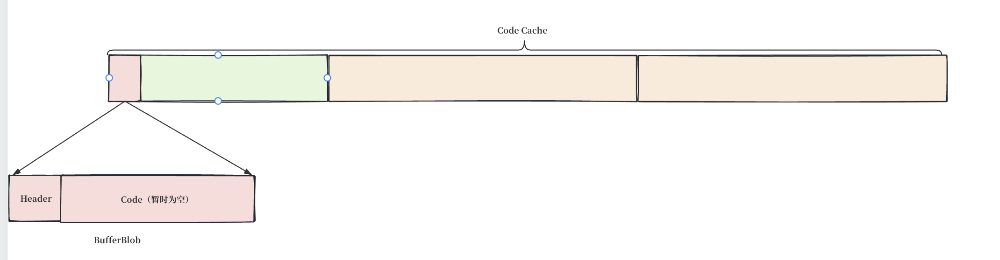

# 前置概念：CodeCache、BufferBlob —— 可执行内存从哪来

> **本文定位**：背景知识文章。你要理解的是 `_code1 = BufferBlob::create("StubRoutines (1)", code_size1)` 这一行代码背后的三个概念：
>
> 1. **CodeCache** —— 一块带执行权限的内存，JVM 专门用它放运行时代码
> 2. **BufferBlob** —— 一种 C++ 对象，自己就住在这块可执行内存里，对象字段在前面，代码区在后面
> 3. **CodeBlobLayout** —— 算出"前面多少字节是对象字段、从哪里开始可以写机器码"的坐标计算器
>
> 本文是一本电子书的章节——不限制长度。每个概念都从最基础的问题出发讲清楚 WHY，再展示 HOW。
>
> **前置依赖**：02 篇讲了 StubRoutines 是一张全局表。ch07 的 `01-heap-layout.md` 详细讲解了 CodeCache 的三个堆（NonNMethod / Profiled / NonProfiled）和 PROT_EXEC 权限。本文只回顾用到的关键结论——CodeCache 用 mmap 分配可执行内存，stub 从 NonNMethod 堆分配——重心在 BufferBlob、placement new、CodeBlobLayout 这三个新概念。
>
> **阅读提示**：本文用 `p` 表示 `CodeCache::allocate` 返回的地址——用具体数值（`p + 128`、`p + 30128`）代替抽象公式，让你看清楚一块内存里每个字节的归属。

---

## 1. CodeCache 回顾（ch07 已讲，这里只取结论）

ch07 详细讲了 CodeCache 的内部分配机制。本文只需要两个结论：

- **CodeCache 是一块可执行内存**——通过 `mmap` 加 `PROT_READ | PROT_WRITE | PROT_EXEC` 权限分配，CPU 可以直接从这块内存取指令执行。普通的 `new` / `malloc` 不给执行权限，写在里面的机器码跑不了。
- **CodeCache 内部切成三个独立的堆**—— `NonNMethod`（堆 2）存 stub、adapter 等"非 Java 方法"代码。stub 永不卸载，放在独立堆里不跟 JIT 编译的方法碎片混在一起。BufferBlob 总是从 NonNMethod 堆分配。

### 1.1 但光有可执行内存不够——还需要"有结构"

`CodeCache::allocate` 返回一块裸内存。你需要知道这块内存里：

- 前 N 字节存 C++ 对象的字段（`_name`、`_size`、`_code_begin`……）
- 从 N 字节开始是可以写 x86 机器码的区域
- N 是多少？全写完是写到哪？

HotSpot 的做法不是"C++ 对象在堆上，另开一个指针指向 code cache"——这样做两个内存块：对象和代码分开，管理混乱。HotSpot 的做法是：**让 C++ 对象本身住在这块可执行内存里**。对象字段在前面，代码区在后面——同一块内存，前半是 header，后半是 payload。

接下来三个类协作实现这个想法：
- **CodeBlob**：基类，定义"一段代码块"的通用字段
- **RuntimeBlob**：加了"帧安全点"概念的中间类
- **BufferBlob**：最简形式——没有重定位、没有数据段、只有 header + 代码

---

## 2. CodeBlob 继承链——三种角色

### 2.1 CodeBlob —— 所有 code cache 条目的基类

```cpp
// codeBlob.hpp
class CodeBlob {
  const char* _name;          // 名称（如 "StubRoutines (1)"）
  int         _size;          // 总分配大小
  int         _header_size;   // C++ header 的大小
  int         _data_offset;   // 数据区从哪个偏移开始
  address     _code_begin;    // 可执行代码的起始地址
  address     _code_end;      // 可执行代码的结束地址
  address     _content_begin; // 内容区起始（对于 BufferBlob 等同于 _code_begin）
  address     _data_end;      // 整块分配的终点
  // ... 还有其他字段
};
```

**关键**：`_code_begin` 和 `_content_begin` 不是两个独立的指针——它们是**坐标**，存储的是"从这块内存的起始地址往后多少字节"。这些坐标由 `CodeBlobLayout` 计算（第 3 节讲），CodeBlob 只负责存着。

CodeBlob 的子类包括：
- **nmethod**：JIT 编译的 Java 方法——最大、最复杂、字段最多
- **RuntimeBlob**：运行时生成的非 Java 方法代码——stub、adapter 等
- **BufferBlob**：最简单的 RuntimeBlob——纯代码，没有重定位

本文只关注 BufferBlob——它是 stub 代码的载体。

### 2.2 RuntimeBlob —— 加了一个"帧安全点"标记

```cpp
// codeBlob.cpp:137-141
RuntimeBlob::RuntimeBlob(const char* name, int header_size, int size,
                         int frame_complete, int locs_size)
  : CodeBlob(name, compiler_none,
      CodeBlobLayout((address) this, size, header_size, locs_size, size),
      frame_complete, 0, NULL, false)
{}
```

- `header_size`：传入 `sizeof(BufferBlob)` —— C++ 对象字段占多少字节
- `frame_complete`：传入 `frame_never_safe`（值为 -1）——表示"这一段机器码没有安全的栈帧点"，GC 不应该在这个区间扫描 oop 引用
- `locs_size`：传入 0 —— BufferBlob 不需要重定位信息。

> **什么是重定位信息？** JIT 编译 Java 方法时，生成的 x86 指令里会嵌入 Java 对象的地址（oop 引用）。GC 移动对象后，这些地址就过期了——需要 GC 找到指令中的旧地址并更新成新地址。重定位信息就是一个表，告诉 GC："第 N 个字节处有 oop 引用，类型是 xxx"。stub 不引用 Java 对象——它的指令就是简单的 `push rbp / mov 参数 / call 入口`，没有 oop 引用需要 GC 更新，所以重定位信息为零。

### 2.3 BufferBlob —— 最简形式

```cpp
// codeBlob.cpp:220-222
BufferBlob::BufferBlob(const char* name, int size)
: RuntimeBlob(name, sizeof(BufferBlob), size, CodeOffsets::frame_never_safe, 0)
{}
```

`BufferBlob` 自己不增加任何字段。它的角色单纯：**"给我一个名字和大小，我构造一个能住进可执行内存的 C++ 对象。"**

---

## 3. placement new —— 怎么让 C++ 对象生在可执行内存里

### 3.1 普通 new vs 我们要做的事

普通 `new Foo()`：
1. `operator new` → `malloc` → 从 C++ 堆上分配内存
2. 在分到的内存上调用 `Foo` 的构造函数

**问题**：`malloc` 返回的内存不可执行。

我们要做的事：**在 CodeCache 的可执行内存上构造对象**。不能先 `CodeCache::allocate` 再 `new`——那会在 C++ 堆和 CodeCache 里各分一块，互相独立。

`placement new` 是 C++ 的一个机制：你可以自定义 `operator new` 的行为。

### 3.2 BufferBlob 的重载

```cpp
// codeBlob.cpp:264-265
void* BufferBlob::operator new(size_t s, unsigned size) throw() {
  return CodeCache::allocate(size, CodeBlobType::NonNMethod);
}
```

`s` 是 C++ 编译器自动传的——大小是 `sizeof(BufferBlob)`。`size` 是我们手动传的——整块需要的总大小（30128 字节）。

调用处：

```cpp
blob = new (size) BufferBlob(name, size);
//      ^^^^^^                          这个传入 operator new 的第二个参数
//             ^^^^^^^^^^^^^^^^^^^      构造函数参数
```

这行干了两件事：
1. `BufferBlob::operator new(sizeof(BufferBlob), size)` → `CodeCache::allocate(30128, NonNMethod)` → 返回一块 30128 字节的可执行内存，地址记为 `p`
2. 在 `p` 上原地调用 `BufferBlob(name, size)` → 执行整个构造链（BufferBlob → RuntimeBlob → CodeBlob → CodeBlobLayout 计算坐标）

**做完后**：`blob` 指向 `p`。`p` 这块内存的前 128 字节存着 BufferBlob 的 C++ 字段，后面 30000 字节是空的代码区。`blob->_code_begin` 的值是 `p + 128`，`blob->content_begin()` 返回的也是 `p + 128`。

---

## 4. BufferBlob::create —— 逐步骤追踪数值变化

我们用一个具体的地址 `p` 来追踪——假设 `CodeCache::allocate` 返回 `p = 0x7fdc00000000`。

### 4.1 `unsigned int size = sizeof(BufferBlob)`

`sizeof(BufferBlob)` 的值来源于继承链。BufferBlob 和 RuntimeBlob 都不增加字段——所有字段都在 CodeBlob 里。CodeBlob 约 12 个字段（指针、整数），加上对齐 padding，实际大小约 104 字节。

```
执行前: size = 垃圾值
执行后: size = 104
```

### 4.2 `size = CodeBlob::align_code_offset(size)`

```cpp
// codeBlob.cpp:56-61
unsigned int CodeBlob::align_code_offset(int offset) {
  return
    ((offset + (int)CodeHeap::header_size() + (CodeEntryAlignment-1))
     & ~(CodeEntryAlignment-1))
    - (int)CodeHeap::header_size();
}
```

**为什么要对齐？** CPU 取指令按 cache line（64 字节）预取。如果指令从 32 字节对齐的位置开始，一次预取能装满整条 cache line 的有效指令，效率最高。如果不对齐，代码区可能跨 cache line 边界，需要两次预取来装同一条指令。

**为什么公式里有 `CodeHeap::header_size()` 又加又减？**

CodeHeap 在分配内存时，会在你请求的块前面插入自己的管理头（HeapBlock header，约 32 字节）。所以从 CodeCache 的角度看，内存布局是：

```
[HeapBlock header (32B)] [你的数据从这里开始...]
```

`align_code_offset` 需要保证：你的数据 + HeapBlock header 整体落在 32 字节对齐的位置上。所以它先把 header_size 加上去、对齐、再减掉——得到的是"相对于你的数据起点"的对齐偏移。

代入数值：
```
offset = 104
CodeEntryAlignment = 32
CodeHeap::header_size() = 32（假设）

步骤：
  104 + 32 = 136
  136 + 31 = 167
  167 & ~31 = 160      （清除低 5 位 = 按 32 字节向下对齐）
  160 - 32 = 128
```

```
执行前: size = 104
执行后: size = 128
```

### 4.3 `size += align_up(buffer_size, oopSize)`

`buffer_size` = `code_size1` = 30000。

`code_size1` 定义在 `stubRoutines_x86.hpp:35`：

```cpp
code_size1 = 20000 LP64_ONLY(+10000)    // = 30000 on x86_64
```

含义：32 位系统上 20000，64 位系统上再加 10000 = 30000。这个值是经验估算——17 个核心 stub 的 x86 机器码加起来约 2000 字节，30000 绰绰有余。如果将来加了新桩、空间不够，开发者增加这个常量重新编译 HotSpot 即可。

`align_up(30000, 8)` = 30000（30000 已经是 8 的倍数）。

```
执行前: size = 128（这是前两步从 sizeof(BufferBlob) 对齐出来的 header 大小）
执行后: size = 128 + 30000 = 30128
```

向 CodeCache 申请的这 30128 字节，前 128 字节放 C++ header，后 30000 字节放 x86 机器码。

### 4.4 `new (size) BufferBlob(name, size)` —— placement new

```
调用: new (30128) BufferBlob("StubRoutines (1)", 30128)

1. BufferBlob::operator new(sizeof(BufferBlob), 30128)
     → CodeCache::allocate(30128, NonNMethod)
     → 从 NonNMethod 堆分配 30128 字节可执行内存
     → 返回 p = 0x7fdc00000000

2. 在 p 上原地构造:
   BufferBlob("StubRoutines (1)", 30128)
     → RuntimeBlob("StubRoutines (1)", sizeof(BufferBlob)=104, 30128, -1, 0)
       → CodeBlobLayout((address)0x7fdc00000000, 30128, 104, 0, 30128)
          算出 code_begin = 0x7fdc00000080 (p + 128)
              code_end   = 0x7fdc000075B8 (p + 30128)
       → CodeBlob("StubRoutines (1)", ..., layout, -1, 0, NULL, false)
          把 layout 的坐标全部存入 this 的成员字段
```

**执行后 `blob` 的成员字段**：

```
blob->_name          = "StubRoutines (1)"
blob->_size          = 30128
blob->_header_size   = 104
blob->_code_begin    = 0x7fdc00000080
blob->_code_end      = 0x7fdc000075B8
blob->_content_begin = 0x7fdc00000080
blob->_data_end      = 0x7fdc000075B8
```

**关键**：`blob` 自己就在 `0x7fdc00000000`——它的 C++ 字段存于 `[0x7fdc00000000, 0x7fdc00000080)`。`content_begin() = 0x7fdc00000080`——这是可以写 x86 机器码的起点。`content_size() = 30000`——可以写 30000 字节。

至此，这行代码的目的完全达成：

```
StubRoutines::_code1 = blob;
  → _code1->content_begin() = 0x7fdc00000080    ← 起始地址
  → _code1->content_size()  = 30000             ← 可用大小
```

`_call_stub_entry`、`_forward_exception_entry` 等 address 字段还是 NULL——代码区已经分配好了，但要等后续文章讲的 `StubGenerator` 往里写 x86 指令后才有内容。

---

## 5. CodeBlobLayout —— 坐标计算器（可选阅读）

> 本节用于理解 `code_begin = p + 128` 这个"128"是怎么来的。不影响后续文章阅读。

### 5.1 问题

CodeCache::allocate 返回裸内存 `p`。谁来算出"第 128 字节开始是可执行代码"？CodeBlobLayout。

### 5.2 构造函数——从五个参数算出全部坐标

```cpp
// codeBlob.hpp:282-301
CodeBlobLayout(const address start, int size, int header_size,
               int relocation_size, int data_offset) :
  _size(size),
  _header_size(header_size),
  _relocation_size(relocation_size),
  _content_offset(CodeBlob::align_code_offset(_header_size + _relocation_size)),
  _code_offset(_content_offset),
  _data_offset(data_offset)
{
  _code_begin     = (address) start + _code_offset;
  _code_end       = (address) start + _data_offset;
  _content_begin  = (address) start + _content_offset;
  _content_end    = (address) start + _data_offset;
  _data_end       = (address) start + _size;
  _relocation_begin = (address) start + _header_size;
  _relocation_end   = _relocation_begin + _relocation_size;
}
```

对 BufferBlob 来说：
- `start` = p（CodeCache::allocate 返回的地址）
- `size` = 30128
- `header_size` = sizeof(BufferBlob) = 104
- `relocation_size` = 0（BufferBlob 不需要重定位）
- `data_offset` = size = 30128（数据区起点 = 终点 = 数据区为空）

计算结果：
```
_content_offset = align_code_offset(104 + 0) = 128
_code_offset    = 128

_code_begin     = p + 128         = 0x7fdc00000080
_code_end       = p + 30128       = 0x7fdc000075B8
_content_begin  = p + 128         = 0x7fdc00000080
_content_end    = p + 30128       = 0x7fdc000075B8
_data_end       = p + 30128       = 0x7fdc000075B8
_relocation_begin = p + 104       = 0x7fdc00000068
_relocation_end   = p + 104 + 0   = 0x7fdc00000068  （退化成一个点）
```

### 5.3 完整内存布局

```
p = 0x7fdc00000000
  │
  ├─ [0x00000, 0x00080)  128 字节  ← C++ header
  │     BufferBlob 的全部字段在这 128 字节里
  │     relocation_begin = relocation_end = p + 0x68 = 0x7fdc00000068
  │
  ├─ [0x00080, 0x075B8)  30000 字节 ← code / content 区域
  │     这是待填充 x86 机器码的地方
  │     code_begin    = content_begin = 0x7fdc00000080
  │     code_end      = content_end   = 0x7fdc000075B8
  │     data_end      = 0x7fdc000075B8
  │
  p + 30128 = 0x7fdc000075B8  ← 终点
```

**CodeBlob 的通用模型其实是 4 个区域**（BufferBlob 是其中最简的特例）：

```
nmethod（JIT 编译的 Java 方法）的完整布局：

start
  │
  ├─ [0, header_size)                    ← 区域 1: header（C++ 对象字段）
  │
  ├─ [header_size, header_size + relocation_size)  ← 区域 2: relocation（重定位表）
  │     记录：代码里第 N 个字节处有 oop 引用，GC 移动对象后要更新
  │
  ├─ [content_offset, data_offset)       ← 区域 3: content / code（x86 机器码）
  │
  ├─ [data_offset, size)                 ← 区域 4: data（oop 引用表、metadata 引用表）
  │     存编译代码中引用的 Java 对象和类的元数据指针
```

| 区域 | 谁用 | nmethod | BufferBlob |
|------|------|---------|-----------|
| header | 所有 CodeBlob 子类 | 有 | 有（128 字节） |
| relocation | 只有 nmethod | 有（GC 需要更新 oop 引用） | **无**（stub 不引用 Java 对象） |
| content / code | 所有 CodeBlob 子类 | 有（C2 编译的方法可能上百 KB） | 有（30000 字节） |
| data | 只有 nmethod | 有 | **无**（stub 不需要存 oop 表） |

**BufferBlob 的 4 区域退化为 2 区域**：`relocation_size = 0`（没有重定位），`data_offset = size`（数据区起点 = 终点 = 数据区为空），只剩 header + code。这是 CodeBlob 最简单的一种形态。



---

## 0. 完整源码清单

本文涉及的所有源码均列于此。正文中直接以 `codeBlob.cpp:224` 的格式引用行号。

### 0a. CodeBlobType 枚举

```cpp
// codeBlob.hpp:38-47
struct CodeBlobType {
  enum {
    MethodNonProfiled   = 0,
    MethodProfiled      = 1,
    NonNMethod          = 2,
    All                 = 3,
    AOT                 = 4,
    NumTypes            = 5
  };
};
```

### 0b. align_code_offset

```cpp
// codeBlob.cpp:56-61
unsigned int CodeBlob::align_code_offset(int offset) {
  return
    ((offset + (int)CodeHeap::header_size() + (CodeEntryAlignment-1))
     & ~(CodeEntryAlignment-1))
    - (int)CodeHeap::header_size();
}
```

### 0c. BufferBlob 构造 + create + operator new

```cpp
// codeBlob.cpp:220-222
BufferBlob::BufferBlob(const char* name, int size)
: RuntimeBlob(name, sizeof(BufferBlob), size, CodeOffsets::frame_never_safe, 0)
{}

// codeBlob.cpp:224-241
BufferBlob* BufferBlob::create(const char* name, int buffer_size) {
  ThreadInVMfromUnknown __tiv;
  BufferBlob* blob = NULL;
  unsigned int size = sizeof(BufferBlob);
  size = CodeBlob::align_code_offset(size);
  size += align_up(buffer_size, oopSize);
  {
    MutexLockerEx mu(CodeCache_lock, Mutex::_no_safepoint_check_flag);
    blob = new (size) BufferBlob(name, size);
  }
  MemoryService::track_code_cache_memory_usage();
  return blob;
}

// codeBlob.cpp:264-265
void* BufferBlob::operator new(size_t s, unsigned size) throw() {
  return CodeCache::allocate(size, CodeBlobType::NonNMethod);
}
```

### 0d. RuntimeBlob 构造

```cpp
// codeBlob.cpp:137-141
RuntimeBlob::RuntimeBlob(const char* name, int header_size, int size,
                         int frame_complete, int locs_size)
  : CodeBlob(name, compiler_none,
      CodeBlobLayout((address) this, size, header_size, locs_size, size),
      frame_complete, 0, NULL, false)
{}
```

### 0e. CodeBlobLayout 类定义（精简）

```cpp
// codeBlob.hpp:248-301
class CodeBlobLayout : public StackObj {
  int _size, _header_size, _relocation_size;
  int _content_offset, _code_offset, _data_offset;
  address _code_begin, _code_end, _content_begin, _content_end;
  address _data_end, _relocation_begin, _relocation_end;

  CodeBlobLayout(const address start, int size, int header_size,
                 int relocation_size, int data_offset) :
    _size(size), _header_size(header_size), _relocation_size(relocation_size),
    _content_offset(CodeBlob::align_code_offset(_header_size + _relocation_size)),
    _code_offset(_content_offset), _data_offset(data_offset)
  {
    _code_begin     = (address) start + _code_offset;
    _code_end       = (address) start + _data_offset;
    _content_begin  = (address) start + _content_offset;
    _content_end    = (address) start + _data_offset;
    _data_end       = (address) start + _size;
    _relocation_begin = (address) start + _header_size;
    _relocation_end   = _relocation_begin + _relocation_size;
  }
};
```

### 0f. CodeCache::allocate

```cpp
// codeCache.cpp:482-551
CodeBlob* CodeCache::allocate(int size, int code_blob_type, int orig_code_blob_type) {
  NMethodSweeper::notify(code_blob_type);
  assert_locked_or_safepoint(CodeCache_lock);
  CodeBlob* cb = NULL;
  CodeHeap* heap = get_code_heap(code_blob_type);
  while (true) {
    cb = (CodeBlob*)heap->allocate(size);
    if (cb != NULL) break;
    if (!heap->expand_by(CodeCacheExpansionSize)) { return NULL; }
  }
  return cb;
}
```

---

## 6. 总结

| 概念 | 一句话 |
|------|--------|
| CodeCache | 用 mmap + PROT_EXEC 分配的一块可执行内存，内部切成三个堆（NonNMethod 堆存 stub） |
| CodeBlob | 所有 code cache 条目的基类——存 `_code_begin`、`_code_end` 等坐标 |
| RuntimeBlob | 加了"帧安全点"标记的中间类 |
| BufferBlob | 最简单的 CodeBlob——没有重定位、没有数据段，只有 header + 代码区 |
| placement new | 让 `BufferBlob::operator new` 调用 `CodeCache::allocate` 而不是 `malloc`——对象生在可执行内存里 |
| align_code_offset | 保证代码区从 32 字节对齐位置开始——CPU 取指令效率最高 |
| CodeBlobLayout | 从 start + size + header_size 五个参数算出 code_begin、code_end、content_begin 所有坐标 |

**执行完 `_code1 = BufferBlob::create(...)` 后的状态**：

```
_code1 → BufferBlob at 0x7fdc00000000
  [0x00000, 0x00080)  128 字节 C++ header  ← 对象字段
  [0x00080, 0x075B8)  30000 字节空代码区    ← 等着写 x86 机器码
其他 StubRoutines 的 address 字段：全 NULL（代码区已分配，还没写内容）
```

**接下来**：`04-code-writing-chain.md` 解释怎么往这 30000 字节的代码区里写 x86 指令——CodeSection 的三指针模型、Assembler 的指令编码、`__ push(rbp)` 变成 `*_end = 0x55` 的完整链路。
