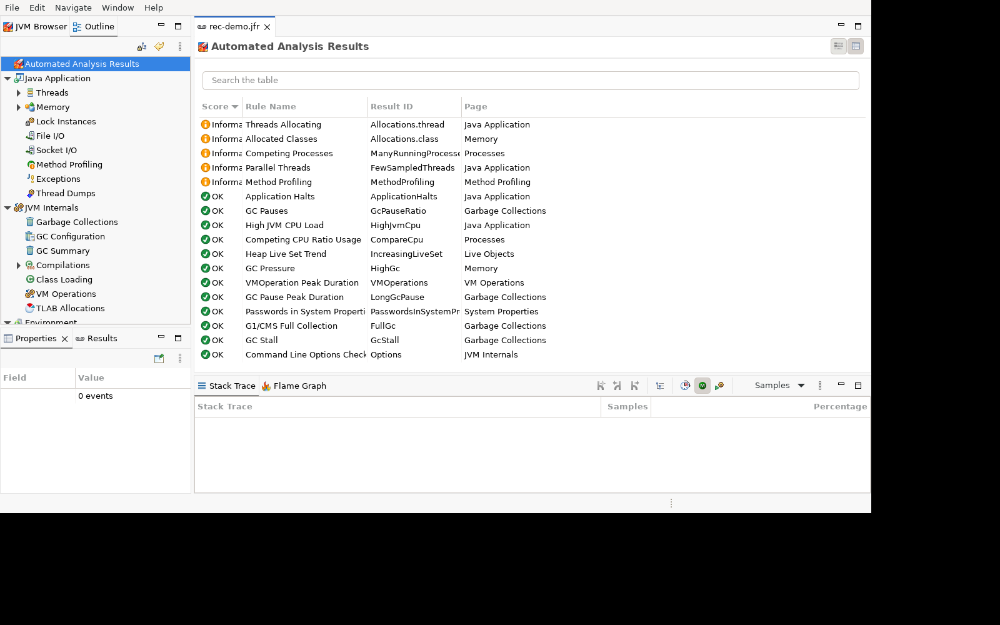
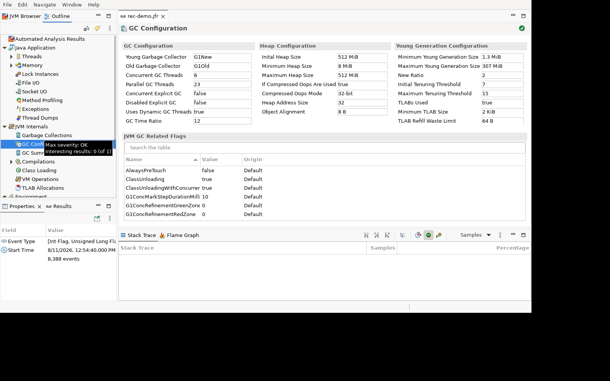
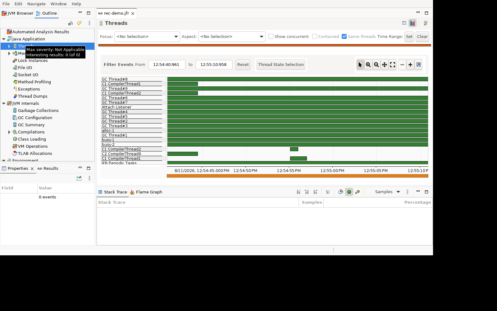
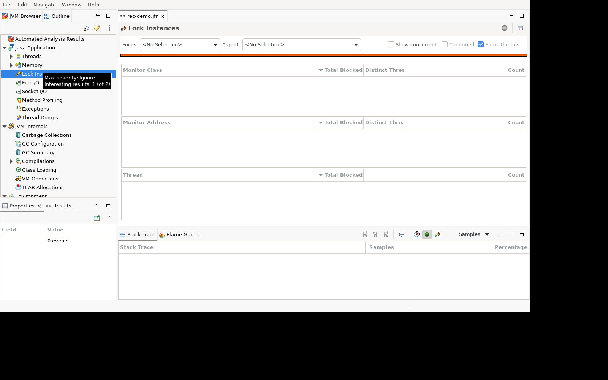
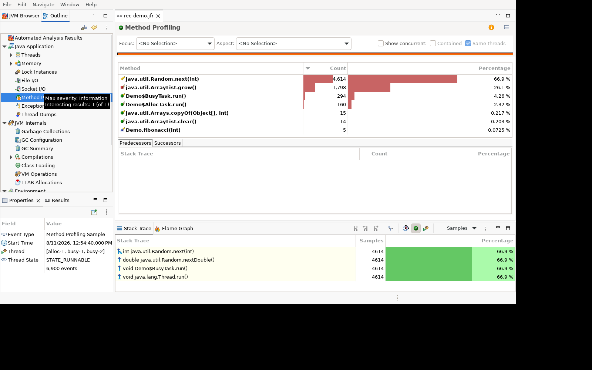
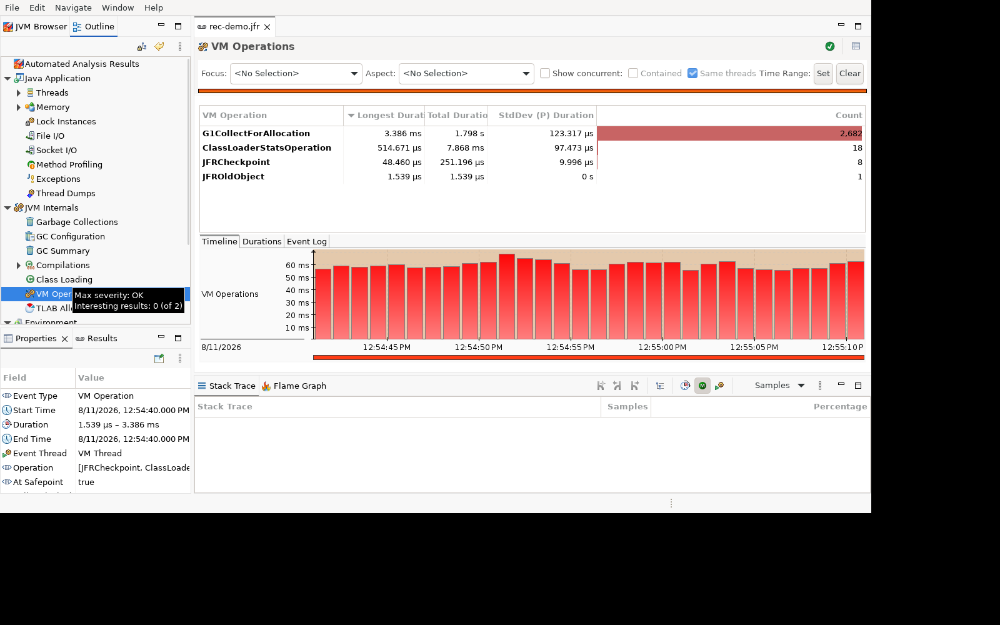
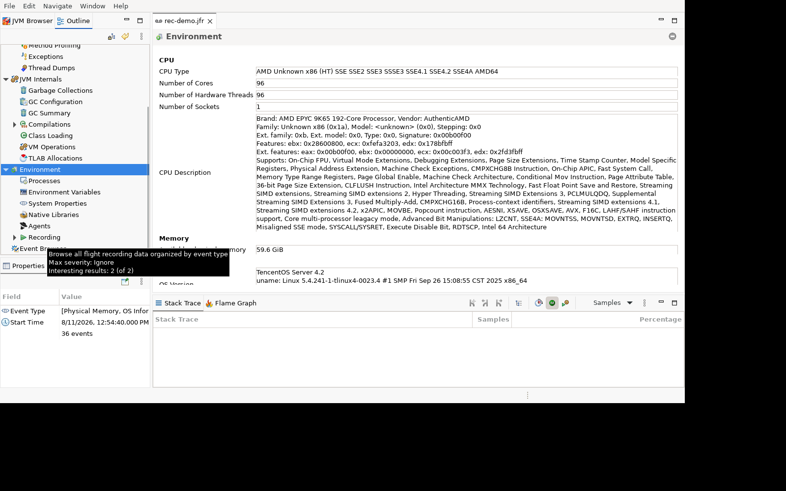

# 01. 先录一次 JFR,看见整个 JVM

> **前置依赖**：会写 Java、跑过 `java` 命令（[卷 0 ch01 — java 命令到底是什么](openjdk/vol-00/ch01.md)）；知道 JIT/GC/线程这些词的大概意思
> → **后续**：[02 — jcmd 万能诊断命令](openjdk/vol-tools/ch02.md)：50 个子命令逐个拆；03 — 内存工具；05 — SA 内部查看
>
> 本章所有数字均来自 2026-08-11 的实测录制（rec-demo.jfr，JDK 17.0.8.1），不是编的。

## 怎么"看见"一个运行中的 JVM

写这本书的整个流程里，我一直在跟一个问题搏斗：JVM 是个黑盒子，你怎么知道里面在干什么？

你当然可以看代码。但代码是静态的——G1 的代码写在 `src/hotspot/share/gc/g1/` 里，它描述了 G1 会怎么运行，却没法告诉你：你机器上这个进程，此刻正在干什么。

要回答"此刻正在干什么"，需要一个**观测仪器**。就像手术台上的监控仪——不是把病人切开看器官，而是连着心电、血压、血氧几条线，让内部状态变成你眼前能读的数字和曲线。

JDK 里就有这样一台监控仪，叫 **JFR**（Java Flight Recorder，飞行记录器），配套一个显示器叫 **JMC**（JDK Mission Control）。

这一篇的目的很简单：亲手录一次，把 JMC 打开，让事件流摊开给你看。你会第一次"看见"一个活着的 JVM——它怎么分线程、怎么 GC、怎么编译、什么时候停顿。这些画面就是后面每一篇的原料：你写 JVM 的任何一个域，脑子里先得有它运行时的样子。

先录一个。

## 30 秒，录一个 JFR

### 准备一个"病人"

我准备了一个小程序 Demo，三个线程在跑三种典型负载：一个死算斐波那契烧 CPU，一个疯狂分配对象，一个混合干两件事。这种程序在真实服务里就是"CPU 高、GC 频繁"的问题现场——作为观测对象再合适不过。^[它的代码长这样：一个 `BusyTask` 循环调 `fibonacci(20)`，一个 `AllocTask` 往 `ArrayList` 里塞 `byte[]` 再清空，主线程等 600 秒。后面你会反复在采样栈里看到这两个类的名字。]

### 方式一：jcmd 动态开启（最常用）

程序跑起来之后，随便找一种方式录：

```
$ jcmd <pid> JFR.start duration=30s filename=rec-demo.jfr
```

`<pid>` 是目标进程号。输出：

```
Started recording 1.

Use jcmd 3720407 JFR.dump name=1 filename=FILEPATH to copy recording data to file.
```

30 秒后，`rec-demo.jfr` 出现在当前目录。这是**运行期动态开启**——不用重启进程，跟给一台跑着的服务器装监控一样。生产环境里这是首选：JFR 默认录制开销在 1% 级别，随时可开可关（后面细说）。

### 方式二：启动参数（要开机就录）

如果程序一启动就有问题，可以在启动命令里带上：

```
$ java -XX:StartFlightRecording=settings=profile,filename=rec.jfr Demo
```

JVM 一启动就开始录。这个参数还有 `duration=30s`（录 30 秒自动停）、`maxsize=250MB`（环形缓冲上限）等选项，跟 jcmd 的 `JFR.start` 完全对应——启动参数在 `src/hotspot/share/runtime/arguments.cpp` 里解析，jcmd 的命令实现在 `src/hotspot/share/jfr/dcmd/jfrDcmds.cpp`，最终都汇到 `src/hotspot/share/jfr/recorder/jfrRecorder.hpp` 的 `start_recording()`。

### 方式三：JMC 图形界面（点按钮）

JMC 左侧 JVM Browser 双击进程 → 右键 → Start Flight Recording…，向导里选时长、配置模板，点 Finish。本质是给同一个接口发命令，只是多了个界面。

### 录完怎么读：无头提取三连

GUI 不是唯一读法。JDK 自带 `jfr` 命令，专治无界面环境——这也是我后面采集素材的主力：

```
$ jfr summary rec-demo.jfr
```

打印这个文件里**有哪些事件类型、各多少条**。对 30 秒的录制，输出开头是这样的：

```
 Version: 2.1
 Chunks: 9
 Start: 2026-08-11 04:54:40 (UTC)
 Duration: 30 s

 Event Type                              Count  Size (bytes)
==================================================================
 jdk.PromoteObjectOutsidePLAB           3,057,467    49.4 MB
 jdk.GCPhaseParallel                    2,291,962    59.2 MB
 jdk.TenuringDistribution                  40,230   455.4 kB
 jdk.GCPhasePauseLevel1                    10,728   440.5 kB
 jdk.ObjectAllocationSample                 8,908   139.5 kB
 jdk.ExecutionSample                        6,900    74.2 kB
 jdk.SafepointBegin                         2,710    41.1 kB
 jdk.ExecuteVMOperation                     2,709    46.5 kB
 jdk.GCPhasePause                           2,682    62.2 kB
 jdk.ActiveSetting                          3,041    90.8 kB
 ...
```

一共 **86 种事件类型**（计数非 0）。读这张表要读出三件事：

第一，**JFR 录的是"事件流"，不是"快照"**。`jstack` 抓线程栈，抓到的是按下按钮那一瞬间的定格；`jmap -histo` 是那一瞬间的对象分布。而 JFR 是 30 秒里每一件值得记录的事都按时间戳写下来——`GCPhaseParallel` 两百多万条，是因为 GC 并行阶段的每个子步骤都是一条事件。这就是域 32 的核心概念：**事件驱动采样**。

第二，**数字就是文章素材**。"我录了 30 秒，数到 2710 次安全点、2709 次 VM 操作"——这比任何概念描述都有说服力。写安全点（域 18）的时候，这个数就是你的开场白。

第三，**不同事件的量级差着几个数量级**。`GCPhaseParallel` 229 万条 vs `SafepointBegin` 2710 条——不是因为安全点不重要，是因为 GC 事件**阈值设为 0**、无脑全录，而安全点事件有 threshold 过滤。这就引出一个大坑：

### 一个必须现在就知道的坑：threshold 过滤

JFR 的每个事件都有自己的开关和阈值（threshold）。默认配置 `default.jfc` 里，`SafepointBegin` 的 threshold 是 **10ms**——只有持续超过 10 毫秒的安全点才会被记下来。绝大多数安全点只有几十微秒，于是默认配置下你会看到"安全点事件很少"的假象。

实测对比（同一进程、同样 30 秒）：

| 事件 | default 配置 | profile 配置 |
|---|---|---|
| SafepointBegin | 0 条 | 503 条 |
| ExecuteVMOperation | 0 条 | 502 条 |

profile 配置把 threshold 全压到 0ms，才露出真面目。所以规矩是：**写安全点、锁、IO、采样相关文章，必须用 `settings=profile` 录**。我前面录 rec-demo.jfr 用的也是 profile，所以能看到 2710 条 SafepointBegin。

用 `jfr print` 可以按事件类型精确提取，比如只把采样样本打出来：

```
$ jfr print --events jdk.ExecutionSample rec-demo.jfr
```

```
jdk.ExecutionSample {
  startTime = 12:54:40.972
  sampledThread = "busy-1" (javaThreadId = 25)
  state = "STATE_RUNNABLE"
  stackTrace = [
    java.util.Random.next(int) line: 209
    java.util.Random.nextDouble() line: 463
    Demo$BusyTask.run() line: 14
    java.lang.Thread.run() line: 833
  ]
}
```

一条采样事件就是"某个时刻、某个线程、当时完整的调用栈"。把 6900 条堆起来，就得到一张"每个方法占了多少 CPU"的画像——这就是后面要讲的火焰图的数据源。

## JMC 打开之后：29 个页签

`jfr` 命令负责无头提取，JMC 负责**可视化**。双击打开 rec-demo.jfr——113MB 的文件，JMC 要加载一会儿，然后你会看到左边一棵树，右边一堆页签。

JMC 9.1.2 实际有 **29 个分析页签**，不是老资料里说的"六面板"。按观察对象分组，正好对应这本书的域划分：

### 第一眼：自动分析

打开文件默认停在 **Automated Analysis Results**——JMC 内置规则引擎（74 条规则）扫一遍整个录制，把"值得注意的事"列出来：



实测 30 秒的录制，它报了 17 条：Threads Allocating（线程分配）、Allocated Classes、Method Profiling、GC Pauses、High JVM CPU Load、Heap Live Set Trend……每个都标了严重级别。这块面板的用途不是下结论，而是**告诉你往哪看**——看到 GC Pressure 就点进 GC 页，看到 Allocation 就点进 Memory 页。

### 内存与 GC

**Memory 页**是第一个值得细看的。上面的 "Class Allocation" 表把分配按类型排开：

![JMC Memory 页：byte[] 分配 1.01TiB，栈指向 AllocTask](assets/01-jmc-memory.png)

`byte[]` 分配了 **1.01 TiB**——30 秒、一个进程、只算对象分配总量。右下方配了分配热点的调用栈，`Demo$AllocTask.run()` 占 98.6%。这就是"分配风暴"的实锤。

**GC Configuration 页**告诉你这台 JVM 的 GC 是怎么配的：



G1 用了 6 个并发线程、23 个并行线程——这两个数不是拍脑袋定的，是 G1 按这台机器的 CPU 核数（192 核）自动推导的。堆初始 512MiB、最大 512MiB，这是启动参数定死的。region 大小、新生代比例、Tenuring 阈值全在这里。写 G1（域 26）时，这张图就是"G1 实际配置长什么样"的答案。

**GC Collections 页**是 G1 的作战记录：每一行是一次 GC pause，G1 Evacuation Pause 从 852 号排下去；图上是堆使用率随时间的曲线（512MiB 的堆，每次分配风暴后跌回几 MiB，锯齿清晰可见）。30 秒里 `GCPhasePause` 事件记了 2682 条——正好和后面 VM Operations 页里 G1 收集的次数对上。

**TLAB Allocations 页**这次是空的——录这份文件时 TLAB 分配事件（`jdk.ObjectAllocationInNewTLAB`）没有记录。**空页也是信息**：它让你知道这类事件在当前配置里的开关状态，写 TLAB 文章（域 09）前要先去 jfc 里把事件打开、重录。

### 线程与锁

**Threads 页**把每个线程画成一条泳道，横轴是时间：



能看到 `busy-1`、`busy-2`、`alloc-1` 这些业务线程在烧 CPU（高亮段），GC 线程周期性地冒出来，Compiler 线程在编译。**这张图回答"谁在什么时候烧 CPU"**——jstack 回答不了这个，它只有一帧。

**Lock Instances 页**找锁竞争。我们的 Demo 没有锁竞争，页面干净：



但页面的三列布局——Monitor Class / Monitor Address / Thread——本身就是域 19（同步）的地图：谁持有了哪个 monitor、谁在等它。有竞争时它会列出"哪个对象、被谁持有、等待的线程栈"。写锁的文章时，用抢锁 demo 录一次，这一页就是现场照片。

**Method Profiling 页**是采样聚合：30 秒 6900 个样本，按方法归堆：



```
java.util.Random.next(int)        4,614  66.9%
java.util.ArrayList.grow()        1,798  26.1%
Demo$BusyTask.run()                 294   4.3%
Demo$AllocTask.run()                160   2.3%
```

`Random.next` 占 66.9%——这是 BusyTask 忙循环里每秒几十万次 `R.nextDouble()` 的功劳（Demo 里那个 `Random` 实例）。右下的栈显示 `Random.next → Random.nextDouble → Demo$BusyTask.run → Thread.run`，热点链路一眼到底。这个"采样→聚合→排名"的机制，就是 async-profiler、JFR 采样、Arthas `thread -n` 的共同内核。

### JVM 内部操作

**VM Operations 页**展示 VM 层的全局操作——GC 之外的"全 JVM 停顿"：



```
G1CollectForAllocation   2,682 次   总耗时 1.798s   最长 3.386ms
ClassLoaderStatsOperation
JFRCheckpoint
```

G1 收集、类加载统计、JFR 自己的 checkpoint——每次 VM 操作都是一次安全点停顿。这个页签和 `jcmd VM.events`、JFR 的 `ExecuteVMOperation` 事件是**同一个东西的三种视图**，后面写域 20 时三处交叉引用。

**Compilations 页**是 JIT 编译日志：30 秒里编译了哪些方法、谁编的（C1/C2）、哪个失败了。实测有一个失败事件，原因是 "Jvmti state change invalidates compilation"——**JVMTI 改写字节码会让已编译代码失效**，这个失败本身就是域 28（JVMTI）和域 15（C2）的衔接素材。

**Class Loading 页**显示类加载统计：实测加载 3043-3046 个类、卸载 0 个——一个只用了 JDK 内部类和 Demo 两个类的进程，类数量就是这么多。

### IO 与环境

**File I/O、Socket I/O 页**这次是空的——Demo 不碰磁盘和网络。这同样是信息：IO 事件（`jdk.FileRead`、`jdk.SocketRead` 等）是显式上报的，没上报就是没发生，你可以据此判断"这台 JVM 到底在不在做 IO"。

**Environment 页**是机器的体检报告：CPU 型号（AMD EPYC 9K65，192 核）、物理内存（59.6 GiB）、操作系统（TencentOS Server 4.2）、系统属性、Native 库列表。**录 JFR 时顺手把环境录进去了**——这也是 JFR 的隐藏福利：分析别人的录制文件时，环境信息不用问。



### 素材检索入口：Event Browser

最后一个是 **Event Browser**：把录制里全部 170 种 `jdk.*` 事件按类型列出，点开能看到每个事件的字段。这页签对写作的意义特殊——**它是"按域查事件"的入口**：写哪个域，就在这查那个域的事件有哪些字段、长什么样。我维护了一份完整的事件→域索引（规划库 KP 05 节），170 事件 × 48 域的映射，写作时按域检索。

## 对照：三种工具看同一条线程

只看一个工具，永远不知道自己漏了什么。拿"这个进程的 CPU 高"这个最常见的问题，三种工具三个视角：

```
$ jstack <pid>          # 单点快照：此刻每个线程在哪个方法
$ arthas thread -n 3    # 窗口平均：过去一段时间的 CPU Top 3
# JMC Threads 面板      # 全程时间线：谁、在什么时候、烧了多久
```

jstack 抓"此刻"——问题如果是一闪而过的，它抓不住；Arthas 给"平均"——慢问题的统计视角；JFR 给"全程"——你能回放 30 秒里每一秒在发生什么，还能按时间范围切片，只看出问题的那 5 秒。

锁竞争（域 19）也一样，三处对照：JMC LockInstances 页给出锁实例的持有/等待关系，Arthas `thread -b` 抓死锁，async-profiler 的 lock 采样给锁等待的时间分布。VM 操作（域 20）则是 JMC VMOperation 页 ↔ `jcmd VM.events` ↔ JFR ExecuteVMOperation 事件三视图。

这就是写作素材的用法：**一个机制，三个工具各露一面**，文章里交叉引用，读者才能建立"这个机制在真实世界里长什么样"的立体认知。

## 生产注意：代价与姿势

- **开销**：默认配置持续录制，开销约 1-2%（JDK 官方基准），profile 配置更贵一些。生产环境建议用 default 配置长开，诊断时临时 `jcmd JFR.start settings=profile` 补精细采样——**按需开，别重启**。
- **安全**：`jcmd JFR.start` 比重启加 `-XX:StartFlightRecording` 安全得多——重启意味着复现问题，复现可能就复现不出来了。
- **动态调**：`jcmd JFR.configure` 能改全局参数（磁盘路径、仓库大小等）；`JFR.dump` 随时把环形缓冲里的数据拷出来，录完了再 `JFR.stop`。

## 跨域桥

- **JFR 是 JDK 内置的**（域 32）：事件定义在 `src/hotspot/share/jfr/metadata/`，录制器实现在 `src/hotspot/share/jfr/recorder/`，Java 侧 API 在 `src/jdk.jfr/share/classes/jdk/jfr/`。你在这个目录里能找到每一个事件的出生证明。
- **两种写者**：JFR 文件格式不是 JDK 独占的——async-profiler 也能写 JFR 文件（写 15 个 JDK 事件 + 自定义的 `jdk.MethodTrace`，来源 `jfrMetadata.cpp`）。同一格式多种写者，这正是"格式契约"最好的验证：JMC 和 `jfr` CLI 是读者，JDK 和 async-profiler 是写者，谁都能读写同一份文件。
- **事件驱动 vs 快照**：这是贯穿全书的思维工具。JFR 是事件驱动（流式、带时间戳、可回放），jstack/jmap 是快照（定格、单点）。写任何域之前先问：我手里这个工具，看到的是流还是帧？

素材在哪里：本篇所有截图在 `materials/screenshots/01-jmc-*.png`，录制文件在 `materials/jfr-recordings/rec-demo.jfr`，事件→域索引见规划库 KP 05 节，JMC 74 条规则清单见 KP 06 节。下一篇用 jcmd 把这台机器的"活体解剖"做一遍——50 个子命令，每个都是一扇窗户。
