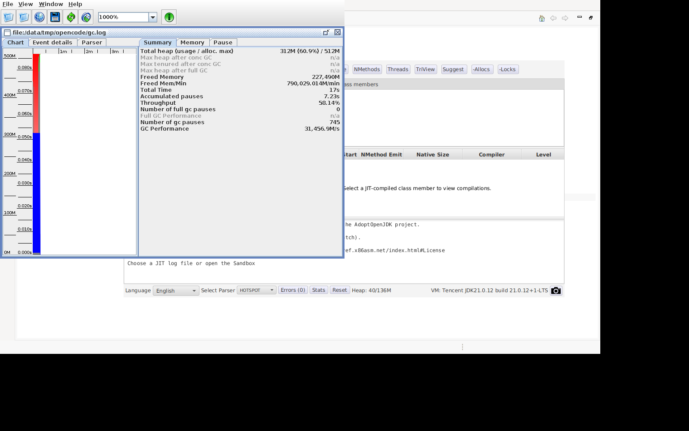
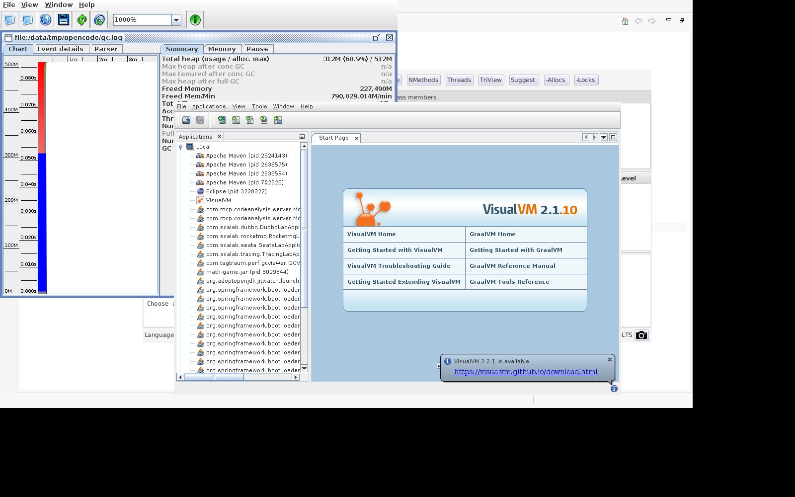

# 03. 堆里到底有什么 — jmap 与 MAT 堆分析

> **前置依赖**：[01 — JFR 与 JMC](openjdk/vol-tools/ch01.md)：认识事件流与 JMC 页签；[02 — jcmd](openjdk/vol-tools/ch02.md)：`GC.heap_dump` 与 `GC.heap_info`
> → **后续**：[05 — SA 内部查看](openjdk/vol-tools/ch05.md)：用 Serviceability Agent 直接读对象头
>
> 本篇输出抓自 2026-08-11 的三组实测：Demo 进程（PID 3742260）的转储与 MAT 报告、64MB 小堆 OOM 程序（`-XX:+HeapDumpOnOutOfMemoryError` 实测日志）、Arthas memory（math-game，PID 3029544），均为 JDK 17.0.8.1，不是编的。

## 先搞清楚：堆是"活的"，转储是"照片"

上一篇用 jcmd 看到的 `GC.heap_info` 是一个快照——此刻堆多大、用了多少。这一篇更进一步：把**整个堆**倒出来，逐对象地看。

但先立一个观念：**堆是活的，转储是照片**。进程跑着，对象在 Eden 里生、被 GC 挪到 Survivor、进 Old、被回收——一张照片拍下来，只能定格某一瞬间的引用关系。所以转储工具全都要回答同一个问题：**你想拍哪一瞬间**。

这决定了本篇的节奏：先用轻的（直方图，毫秒级）看轮廓，再用重的（全量转储，会停顿）取证。线上堆分析的标准姿势，就是这篇的顺序。

## 1. 导出堆的三条路

### 路一：直方图——不落盘的第一眼

```
$ jmap -histo:live <pid>
 num     #instances         #bytes  class name (module)
-----------------------------------------------------------
   1:         17524        1092080  [B (java.base@17.0.8.1)
   2:         16507         396168  java.lang.String (java.base@17.0.8.1)
   3:          2384         292344  java.lang.Class (java.base@17.0.8.1)
   4:          2132         164640  [Ljava.lang.Object; (java.base@17.0.8.1)
   5:          4297         137504  java.util.HashMap$Node (java.base@17.0.8.1)
   6:          3848         123136  java.util.concurrent.ConcurrentHashMap$Node (java.base@17.0.8.1)
```

一列类、一列实例数、一列浅堆字节数。两个读法：

- **`-histo:live` 里的 live 是动词**：它先做一次 Full GC 再数，所以表里全是**活下来的对象**。这也解释了为什么这个疯狂分配 1TiB 的 Demo，表里 byte[] 只有 17,524 个、1MB 出头——分配风暴的对象在 Full GC 那一刻已经全被回收了。**看到小数字别惊讶，先问自己：这是 live 还是总量**。
- **表顶是"大头"**：byte[]、String、Class、Object[]——JDK 内部结构占了大半。线上真出问题时，直方图的头部就是嫌疑人的第一排。

jmap 的 `-histo`（不带 live）不触发 GC、数的是总量快照，更快但包含垃圾。快筛用 histo，这是第一条路里最便宜的一条。

### 路二：全量转储——落盘的完整照片

```
$ jmap -dump:live,format=b,file=heap.hprof <pid>
```

hprof 二进制格式（域 37 的标准格式），MAT、VisualVM、JMC 都能读。和直方图同样的问题：`live` 会先 Full GC。

还有一条等价的路——jcmd 的 `GC.heap_dump`，它是 JVM 内置诊断命令（`HeapDumpDCmd`，注册在 `src/hotspot/share/services/diagnosticCommand.cpp:92`），jmap 和它底层是同一个转储器（`src/hotspot/share/services/heapDumper.cpp`）：

```
$ jcmd <pid> GC.heap_dump /path/heap.hprof
```

### 路三：OOM 自动转储——照片自己拍

真正生产上，堆溢出那一刻往往是**最需要照片**的时刻——但那一刻你往往不在场。JVM 留了一手：启动时加一个参数，OOM 发生时自动拍：

```
$ java -Xmx64m -XX:+HeapDumpOnOutOfMemoryError \
    -XX:HeapDumpPath=/path/oom.hprof OOM
```

实测一个 64MB 小堆的分配程序（每毫秒往静态列表塞 1MB），日志里一行 "allocated" 都没来得及打印就炸了：

```
OOM demo starting, heap limited
java.lang.OutOfMemoryError: Java heap space
Dumping heap to /data/tmp/opencode/oom.hprof ...
Heap dump file created [34740234 bytes in 0.018 secs]
Exception in thread "main" java.lang.OutOfMemoryError: Java heap space
	at OOM.main(OOM.java:9)
```

三行日志讲完整个事故：**报错 → 自动转储 → 34.7MB 照片落盘（0.018 秒）**。这个转储里就是 OOM 那一刻的完整堆——最珍贵的证据。实现上这是 `HeapDumper::dump_heap_from_oome()`（`src/hotspot/share/services/heapDumper.cpp:2023`），OOM 路径上自动调用的。

**"快筛慢定"是标准节奏**：线上先 `-histo:live` 看大类（毫秒级、影响小），锁定嫌疑后，低峰期再 `-dump:live` 全量取证（会停顿，见文末生产注意）。

## 2. MAT 四板斧：从"什么多"到"为什么多"

拿到 heap.hprof，怎么找泄漏？Eclipse MAT（Memory Analyzer）是标准答案。它有四个视图，正好是递进的四板斧：**Overview（总览）→ Histogram（直方图）→ Dominator Tree（支配树）→ Leak Suspects（泄漏报告）**。

MAT 有命令行模式（无界面环境也能跑）：

```
$ ParseHeapDump.sh heap.hprof org.eclipse.mat.api:suspects \
    org.eclipse.mat.api:top_components org.eclipse.mat.api:overview
```

对 7.5MB 的 jmap-live.hprof，它产出了三份报告。我们直接读核心那份 Leak Suspects 的文本：

### 第一板斧：Overview——总览

报告开头是"Biggest Objects"，即**保留堆最大的一批对象**：

```
Class Name                          Shallow Heap  Retained Heap
java.lang.Thread @ 0x446000650 alloc-1   112        1,045,184
java.lang.Object[2152] @ 0x7ff773c50 JNI Global  8,624       242,112
class java.time.zone.ZoneRulesProvider   16          204,064
```

这里第一次出现两个概念，全篇都会用到：

- **浅堆（Shallow Heap）**：对象自己占的字节——Thread 对象本身只有 112 字节。
- **深堆（Retained Heap）**：把"只有这个对象引用得到的东西"全算上——那个 Thread 能保留 1MB。**深堆 = 释放它能回收多少**。

`alloc-1` 线程深堆 1MB，是这张表的第一名。

### 第二板斧：Histogram——什么多

MAT 的 Histogram 和 jmap -histo 同构，但多一列 **Retained Heap**（实测，取自 MAT 报告的 Class Histogram 页）：

```
Class Name                     Objects   Shallow Heap   Retained Heap
byte[]                         17,947    1,916,312      >= 1,916,312
java.lang.Object[]              2,135      168,568      >= 1,681,616
java.lang.Class                 1,996       27,280      >= 1,175,384
java.util.ArrayList               148        3,552      >= 1,070,584
java.lang.Thread                   23        2,576      >= 1,055,568
java.lang.String               16,134      387,216      >= 1,032,080
```

这张表有两个看头：

- **byte[] 17,947 个**——和上一篇 jmap -histo:live 的 17,524 个对得上（数字不完全一样，因为直方图和转储之间隔了几秒，堆在变——复现性话题，文末再说）。分配风暴的对象没出现在这里，因为它们已可回收。
- **浅堆 vs 深堆的悬殊对比**：`java.util.ArrayList` 只有 148 个对象、浅堆 3.5KB，深堆却 1,070,584（1MB）——**浅堆 300 倍放大**。因为每个 ArrayList 都牵着它的 elementData 数组（Leak Suspects 里那个 2152 槽的 Object[] 就是它），深堆把整条链都算进来。这就是"深堆 = 释放它能回收多少"的直观体现。java.lang.Class 保留 1.1MB 居前，但它是系统类加载器加载的类元数据（近两千个 JDK 类），不是泄漏。

### 第三板斧：Dominator Tree——谁持有

支配树回答"为什么多"：**每个对象的深堆是谁"牵着"的**。

```
Label                                Objects   Retained   %
java.lang.Class                      1,879     1,161,048  33.06%
java.lang.Thread                        23     1,055,096  30.04%
java.lang.String                     4,784       287,880   8.20%
...
<system class loader>                8,663     3,511,864  100.00%
```

最后一行是答案的形状：所有支配关系收拢到类加载器层——**8,654 个对象、3.5MB，100% 由 `<system class loader>` 支配**。这说明这个堆里没有"业务代码泄漏"，大头全是 JVM 自举的类元数据和线程栈。支配树是域 06（对象模型/引用分析）最直观的实证：**可达性分析的"谁引用谁"，在这里是棵树**。

### 第四板斧：Leak Suspects——自动报告

MAT 自动算嫌疑：

```
Problem Suspect 1
1,883 instances of java.lang.Class, loaded by <system class loader>
occupy 1,168,864 (32.95%) bytes.
Keywords: java.lang.Class

Problem Suspect 2
The thread java.lang.Thread @ 0x446000650 alloc-1 keeps local variables
with total size 1,045,184 (29.46%) bytes. The memory is accumulated in
one instance of java.lang.Object[], which occupies 1,044,952 (29.46%) bytes.
Significant stack frames and local variables:
    Demo$AllocTask.run()V (Demo.java:25)
    java.util.ArrayList @ 0x45d000000 retains 1,044,976 (29.46%) bytes
```

Suspect 2 是这条链路：**alloc-1 线程 → 栈上局部变量 → 一个 1MB 的 Object[] → 由 ArrayList 持有**，定位到 `Demo$AllocTask.run()` 的 Demo.java:25。这就是泄漏报告的威力：**从嫌疑到现场，一条链给全**。Suspect 1（Class 占 33%）是系统类加载器的类元数据，属于"正常的假阳性"——MAT 报告也得分得出哪个是真的。

**四板斧的递进关系**：Overview 给总量直觉 → Histogram 给类级排名 → Dominator 给持有关系 → Leak Suspects 给结论链。写作域 06/37 时，"支配树 = 泄漏定位器"这个关系就是文章的主线。

**免安装替代**：JMC 自带 JOverflow 和 MemoryLeak 页（读 JFR 的 OldObjectSample 事件），不想装 MAT 也能做泄漏分析——只是深度不如 MAT 的四板斧。

## 3. 可视化对照：GCViewer、VisualVM 与 Arthas

转储分析是"离线解剖"。在线看堆还有三层工具，和 jmap/MAT 正好构成**概览 → 统计 → 分析**的层次：

| 层次 | 工具 | 看到什么 | 实测 |
|---|---|---|---|
| 概览 | `arthas memory` | 各内存池 used/total/max 一行表 | 见下 |
| 统计 | `jmap -histo:live` | 类级实例数/浅堆 | 上一节 |
| 分析 | MAT Dominator/Leak | 持有链/泄漏结论 | 上一节 |

Arthas `memory` 是概览层的典型——它把 JVM 的内存池摊成一张表：

```
Memory                            used      total     max        usage
heap                              65M       160M      15264M     0.43%
g1_eden_space                     48M       96M       -1         50.00%
g1_old_gen                        16M       56M       15264M     0.11%
g1_survivor_space                 1017K     8192K     -1         12.42%
nonheap                           45M       48M       -1         95.07%
codeheap_'non-nmethods'           1M        2M        7M         16.54%
metaspace                         31M       31M       -1         99.22%
compressed_class_space            3M        3M        1024M      0.35%
codeheap_'profiled_nmethods'      8M        8M        116M       6.92%
codeheap_'non-profiled_nmethods'  2M        2M        116M       1.78%
```

三处要会读：`heap 65M / 15264M = 0.43%`（堆用了 0.43%）；`metaspace 99.22%`（Metaspace 总量 31M 用满——注意 `-1` 是"无上限"的显示，Metaspace 的 max 默认不设）；三块 codeheap 各归各位（域 16 呼应）。这张表 = 上一篇 `GC.heap_info` 的分池展开版。

**GCViewer** 管的是另一件事——GC 行为。把 `-Xlog:gc` 的日志喂给它，得到停顿/吞吐/各代曲线：



它回答"GC 健不健康"：停顿频率、吞吐百分比、各代大小曲线。写域 25/26 时，GCViewer 是"GC 日志长什么样、怎么读"的标准配图。

**VisualVM** 是轻量全能：堆曲线、CPU、线程，双击本地进程就接上：



它的堆曲线和上一篇 JMC 的 Memory 页是同一数据的两张脸。日常"瞄一眼"用它最顺手——装插件后还能采样 CPU、生成火焰图。

## 生产注意：转储是有代价的

- **全量 dump 会 STW**（域 18 相关）：堆越大停越久，几十 GB 的堆能停到秒级。线上转储**选低峰期**，别在促销峰值点 dump。
- **`-histo:live` 也会触发 Full GC**：直方图本身快，但 live 前缀附赠一次 Full GC，一样有停顿——能不用 live 就不用。
- **节奏**：生产优先 `jcmd GC.heap_info` + `jmap -histo`（轻），必要时才 `-dump:live`（重），OOM 自动转储参数**提前配好**，等出事时它自己会拍。

## 复现说明：数字来自哪，变了又意味着什么

本篇的 histo/MAT 输出来自 2026-08-11 对 Demo 进程（PID 3742260）的 `jmap -dump:live` 转储（7.5MB），OOM 日志来自 64MB 小堆的 OOM 程序（34.7MB 转储），Arthas memory 来自 math-game（PID 3029544）。

- **结构稳定**：直方图的列含义（#instances/#bytes）、live 前缀会先 Full GC、MAT 四板斧的递进关系、支配树"谁持有"的答案形状——这些对任何转储都成立。
- **数值可变**：实例数、深堆大小、Suspect 排名——换个时刻转储就是另一组数。特别是 **live 转储的数字强烈依赖那一刻的 GC 状态**：Full GC 刚过和过了 30 秒，堆内容天差地别。
- **方法不变**：先 histo 快筛、再 dump 取证、用支配树找持有者——这个流程比任何具体数字都值得带走。

## 跨域桥

- **转储格式**（域 37）：hprof 是 JDK 的标准转储格式，导出实现在 `src/hotspot/share/services/heapDumper.cpp`（含 `dump_heap_from_oome()`，第 2023 行），`GC.heap_dump` 命令类注册在 `diagnosticCommand.cpp:92`，客户端 jmap 在 `src/jdk.jcmd/share/classes/sun/tools/jmap/JMap.java`。
- **对象模型**（域 06）：MAT 的支配树是"引用链/可达性"的直观实证——GC 怎么判断"活着"，就是按这棵树剪的。
- **GC 观察**（域 25/26）：`GC.heap_info` 快照 + jstat 趋势 + GCViewer 曲线 + JFR 事件流，四段时间分辨率齐了。
- **OOM 场景**：`HeapDumpOnOutOfMemoryError` 是"现场自动取证"的标准姿势，和 Arthas 的 `memory`/`heapdump` 命令构成对照（一个靠 JVM 自动，一个靠人工触发）。

下一篇用 Serviceability Agent 直接钻进 JVM 内部：不看转储照片，看活体结构——对象头、Klass、堆分区。
