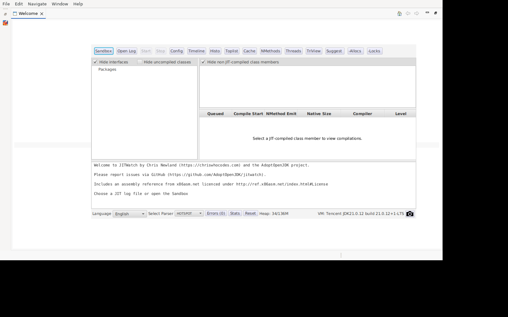

# 04. 代码在 JVM 里怎么被加工 — javap 与 JIT 观察

> **前置依赖**：[01 — JFR 与 JMC](openjdk/vol-tools/ch01.md)：认识方法热点与火焰图；[02 — jcmd](openjdk/vol-tools/ch02.md)：`Compiler.codecache` 与编译事件
> → **后续**：[05 — SA 内部查看](openjdk/vol-tools/ch05.md)：用 Serviceability Agent 直接读已编译代码
>
> 本篇的 javap 输出、编译日志与 inline 统计抓自 2026-08-11 对 Demo 的实测（JDK 17.0.8.1），不是编的。

## 一段 Java 代码，在 JVM 里有三副面孔

```
public static int fibonacci(int n) {
    if (n <= 1) return n;
    return fibonacci(n - 1) + fibonacci(n - 2);
}
```

这是上一篇那个烧 CPU 的 `BusyTask` 里的核心方法。它跑在 JVM 里，先后有三副面孔：

1. **源码**——你写的样子；
2. **字节码**——javac 编译后的指令流，解释器和 JIT 的输入；
3. **机器码**——JIT 编译器加工的最终产物，CPU 真正执行的指令。

这一篇就沿着这三副面孔走：先看字节码（javap），再看编译和内联过程（编译日志 + JFR 事件 + JITWatch）。你会发现，"代码怎么被加工"这件事，JVM 全程都有记录，只是需要合适的放大镜。

## 1. javap：字节码的第一现场

### `-c -p`：指令流

javap 是 JDK 自带的字节码查看器（实现在 `src/jdk.jdeps/share/classes/com/sun/tools/javap/`）。`-c` 反汇编指令，`-p` 连私有方法也显示：

```
$ javap -c -p Demo
...
  static int fibonacci(int);
    Code:
       0: iload_0
       1: iconst_1
       2: if_icmpgt     7
       5: iload_0
       6: ireturn
       7: iload_0
       8: iconst_1
       9: isub
      10: invokestatic  #7     // Method fibonacci:(I)I
      13: iload_0
      14: iconst_2
      15: isub
      16: invokestatic  #7     // Method fibonacci:(I)I
      19: iadd
      20: ireturn
```

读这份输出的第一课：**字节码是"紧凑指令流"，每行左边是字节偏移**。`0: iload_0` 表示第 0 字节是一条"加载局部变量 0"的指令；`invokestatic #7` 表示"调用常量池第 7 项指向的方法"——递归调用 fibonacci 自己，就是 `invokestatic #7`。指令和操作数栈的配合（`isub` 把栈顶两个数相减），是解释器和 JIT 共用的输入格式。

再看一个平时天天碰的：`java.util.ArrayList` 的 `grow()`（JDK 17 里的扩容逻辑，从 `javap -c -p java.util.ArrayList` 的输出里截取）：

```
$ javap -c -p java.util.ArrayList | awk '/grow\(/,/^$/'   # 截取
  private java.lang.Object[] grow(int);
    descriptor: (I)[Ljava/lang/Object;
    Code:
       0: aload_0
       1: getfield      #9    // Field elementData:[Ljava/lang/Object;
       4: arraylength
       5: istore_2
       6: iload_2
       7: ifgt          20
      10: aload_0
      11: getfield      #9
      14: getstatic     #39   // Field DEFAULTCAPACITY_EMPTY_ELEMENTDATA
      17: if_acmpeq     45
      20: iload_2
      21: iload_1
      22: iload_2
      23: isub
      24: iload_2
      25: iconst_1
      26: ishr
```

开头几行就是在算"新容量"：`iload_2` 取出当前长度，`iconst_1; ishr` 右移一位算出**预增部分**（`oldCapacity >> 1`），紧接着 `invokestatic #73` 调用 `ArraysSupport.newLength` 做加法与溢出保护——**JDK 17 的 1.5 倍扩容逻辑就在这里**（`newLength = old + max(minGrowth, prefGrowth)`）。上一篇我们见过 `ArrayList.grow` 在方法热点里占 26.1%，现在它的指令长什么样也看到了。

### `-v`：完整视图

`javap -v` 输出完整解剖图：常量池（`#7`、`#39` 这些编号指向的到底是什么）、行号表、局部变量表，还有 **StackMapTable**——JDK 7 以后验证器（域 44）用来做类型检查的"栈帧类型表"：

```
$ javap -v Demo | grep -A2 StackMapTable
      StackMapTable: number_of_entries = 1
        frame_type = 7 /* same */
```

`frame_type = 7 /* same */` 的意思是：跳转目标（`if_icmpgt 7` 的 offset 7）处的栈帧与上一个已知帧**完全相同**——局部变量还是那个 int、栈还是空的，所以一条 `same` 帧就够；栈或局部变量有变化的分支点才需要 `full_frame`（255）那样的全量记录。这张表是**域 44（类验证）的标准引用素材**：验证器拿到字节码后，按 StackMapTable 推演每条跳转的栈帧类型，类型不符直接拒绝加载。字节码改写工具（比如 async-profiler 的 BytecodeRewriter）插入指令后，必须**重算这张表**——这就是"插桩会破坏验证"的根源，也是那些工具最麻烦的活。

## 2. 编译日志：JIT 的全程记录

javap 看到的是编译前的字节码。要看到"JVM 怎么把它加工成机器码"，让 JVM 把编译过程写日志：

```
$ java -XX:+UnlockDiagnosticVMOptions -XX:+LogCompilation \
       -XX:LogFile=hotspot.log Demo
```

跑两分多钟，得到 2.2MB 的 XML 日志——609 个编译任务、730 个 nmethod 的全过程。这个日志由 HotSpot 的 `CompileLog`（`src/hotspot/share/compiler/compileLog.hpp`）生成，每个编译决策都是一条 XML 记录。

### 编译任务长什么样

```
<task_queued compile_id='2' method='java.lang.String hashCode ()I'
             bytes='60' count='256' iicount='256' level='3' stamp='0.022'
             comment='tiered' hot_count='256'/>
```

一条任务 = 一个待编译方法。字段就是答案：

- `bytes='60'`：方法字节码 60 字节——JIT 按大小决定值不值得编；
- `count='256' / iicount='256'`：调用次数已达 256 次——**热方法阈值**（CompileThreshold 的默认思路），解释器跑够了次数才排进编译队列；
- `level='3'`：C1 全优化层——分层编译（域 13/14）的层级标记：level 1-3 属于 C1（1 简单、3 全优化；**level 2 在现代 JDK 默认停用**，`Tier2CompileThreshold=0`），level 4 是 C2 最终优化。

编完的结果是 nmethod——机器码落进代码缓存（域 16 那三块 CodeHeap）：

```
<nmethod compile_id='2' compiler='c1' level='3'
         entry='0x00007fa49d471560' size='1480' address='0x00007fa49d471390'
         method='java.lang.String hashCode ()I' bytes='60' count='294'/>
```

`entry` 是方法入口地址，`size` 是机器码大小（1480 字节 vs 字节码 60 字节——**机器码约 25 倍于字节码**，这就是"解释执行省内存、编译执行耗内存"的实锤）。

还有反转现场：某天热点转移，旧代码作废——`make_not_entrant`（实测 61 条）：

```
<make_not_entrant thread='3751657' compile_id='8' compiler='c1'
                  level='3' stamp='0.026'/>
```

编译任务 id=8 的 C1 产物被作废——层级替换、依赖失效、反优化都可能触发这条记录，它标志着"这份机器码不再允许新入口进入"。

### 内联：JIT 的灵魂决策

编译日志里最有价值的是 **inline 决策**。对 2.2MB 日志全文统计（`grep` 一下就出来）：

```
inline_success: 1,544 次
inline_fail:    1,327 次

失败原因分布（前 6）：
  callee is too large       850   ← 方法太大，超过内联大小上限
  no static binding         120   ← 虚方法分派，静态内联不了
  callee uses too much stack  83
  not inlineable             77
  native method              68
  Throwable 构造器           68
```

**"callee is too large" 一家独大**——这正是 JIT 内联策略的核心规则（C1/C2 都做内联，决策逻辑同源）：方法超过大小上限（`MaxInlineSize`/`FreqInlineSize` 两个开关管着）就不内联。写域 15（C2）时，这张"失败原因分布"表就是"内联决策在真实负载下怎么裁"的第一手统计。

成功的内联长这样（XML 里 `inline_success reason='inline'`），而 JFR 把同样的事件存成结构化记录——实测 45 秒录到 **4,122 条 `jdk.CompilerInlining` 事件**：

```
jdk.CompilerInlining {
  compileId = 1274
  caller = jdk.jfr.internal.Control.isType(Class)
  callee = {
    type = "java/lang/Object"
    name = "getClass"
    descriptor = "()Ljava/lang/Class;"
  }
  succeeded = true
  message = "intrinsic"     ← 内联为内建指令，不是拷贝方法体
  bci = 4
  eventThread = "C1 CompilerThread0"
}
```

注意 `message = "intrinsic"`——`Object.getClass` 这类方法不拷贝方法体，而是直接内联成一条内建指令（intrinsic）。`succeeded`/`message`/`bci` 字段把内联决策完整结构化：调用点 bci、成功与否、原因。写域 15 时，**日志给统计、JFR 给明细**，两个来源互相印证。

### JITWatch：把日志画出来

文本日志能 grep，但可视化更直观。JITWatch（`java -jar jitwatch-ui.jar` 启动）导入 hotspot.log 后：



它把同一份日志摊成三个视图：**Compilations**（哪些方法被编、C1/C2、耗时）、**Inlining**（内联决策树：每条边是一次 inline，红的失败绿的失败原因）、**Bytecode vs Assembly**（装了 hsdis 反汇编器时，源码→字节码→机器码三栏对照）。JITWatch 的 Inlining 树和 JFR 的 CompilerInlining 事件是**同一个决策的两份记录**——一个画图、一个存数据。

## 3. 对照：三视角看一个方法

`Demo$BusyTask.run()` 这个热点方法，三个工具三副面孔：

| 视角 | 工具 | 看到什么 | 回答什么 |
|---|---|---|---|
| 源码 | 编辑器 | 你写的样子 | 逻辑是什么 |
| 字节码 | `javap -c -p` | 指令流 + 常量池 | 编译后长什么样（域 44 输入） |
| 编译结果 | 编译日志/JFR | 层数、nmethod 地址、inline 决策 | JIT 怎么加工的（域 13/15） |

内联还有"运行结果"视角：火焰图里的 `[inlined]` 帧——async-profiler 展开栈时，被内联的方法帧会标记出来。**火焰图上的 `[inlined]` 帧 = 编译日志里的 `inline_success`**，同一事实的两种视图：一个看决策，一个看效果。

## 生产注意

- `-XX:+LogCompilation` 有真实开销：写 XML 日志本身消耗 IO 和 CPU，本地探索用没问题，**生产别开**。
- 生产想观察编译/内联，用 JFR 的 `jdk.Compilation`、`jdk.CompilerPhase`、`jdk.CompilerInlining` 事件（域 32）——零侵入、按需开。注意 `jdk.CompilerInlining` 在默认配置里是**关闭**的（jfc 里 `compiler-enabled-failure` 控制），要显式改配置才录得到（本篇的 4122 条就是用改过的配置录的）。
- `javap` 是无副作用只读命令，生产随便用。

## 复现说明：数字来自哪，变了又意味着什么

本篇的字节码输出来自 Demo 与 JDK 自带 ArrayList（JDK 17.0.8.1 实测）；编译日志来自 `-XX:+LogCompilation` 跑 2 分多钟的 2.2MB hotspot.log；inline 统计与 4,122 条事件来自 35 秒 profile 配置录制（需先按上文开 CompilerInlining 事件）。

- **结构稳定**：字节码偏移与指令序列（javap 输出）、编译任务/nmethod 的字段含义、内联失败原因的类型分布（"callee is too large" 永远是最大头）——这些对任何 JDK 17 程序都成立。
- **数值可变**：编译任务数（609）、inline 次数（1544/1327）、具体方法名——取决于负载和运行时长。换一个程序，统计表里的名字全变，但"大小限制是内联第一大杀手"这个结论不变。
- **复现要点**：`jdk.CompilerInlining` 事件必须改 jfc 才录得到，直接 `settings=profile` 也默认关闭——这是最容易踩的坑（规划库坑档案第 17 条的近亲）。

## 跨域桥

- **字节码**（域 44/08）：javap -v 的常量池与 StackMapTable 是类验证与解释执行的输入素材；`src/jdk.jdeps/share/classes/com/sun/tools/javap/` 是 javap 的实现。
- **JIT 框架**（域 13/14/15）：编译日志由 `src/hotspot/share/compiler/compileLog.hpp` 的 `CompileLog` 生成（`-XX:+LogCompilation` 开关）；层数字段（1/2/3/4）对应分层编译的 C1/C2 形态；nmethod 机器码落进代码缓存（域 16）。
- **内联**（域 15）：编译日志 `inline_fail` 原因分布 + JFR `jdk.CompilerInlining` 事件（caller/callee/succeeded/message/bci）双源互证；火焰图 `[inlined]` 帧是运行结果视图。
- **对照工具**：JITWatch 的 Inlining 树 ↔ JFR 事件 ↔ 火焰图 `[inlined]` 帧，同一决策三份记录。

下一篇用 Serviceability Agent 直接钻进 JVM 内部：不看日志照片，看活体结构——对象头、Klass、堆分区。
